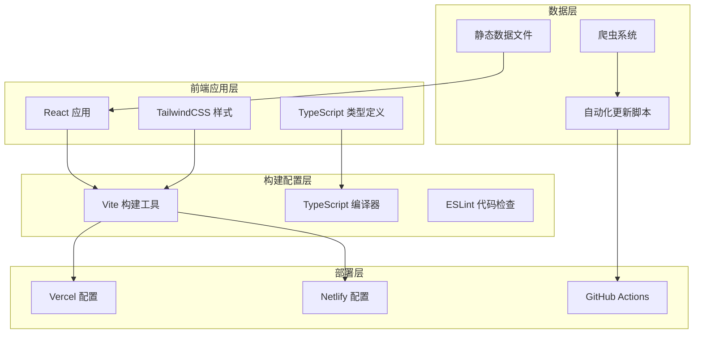
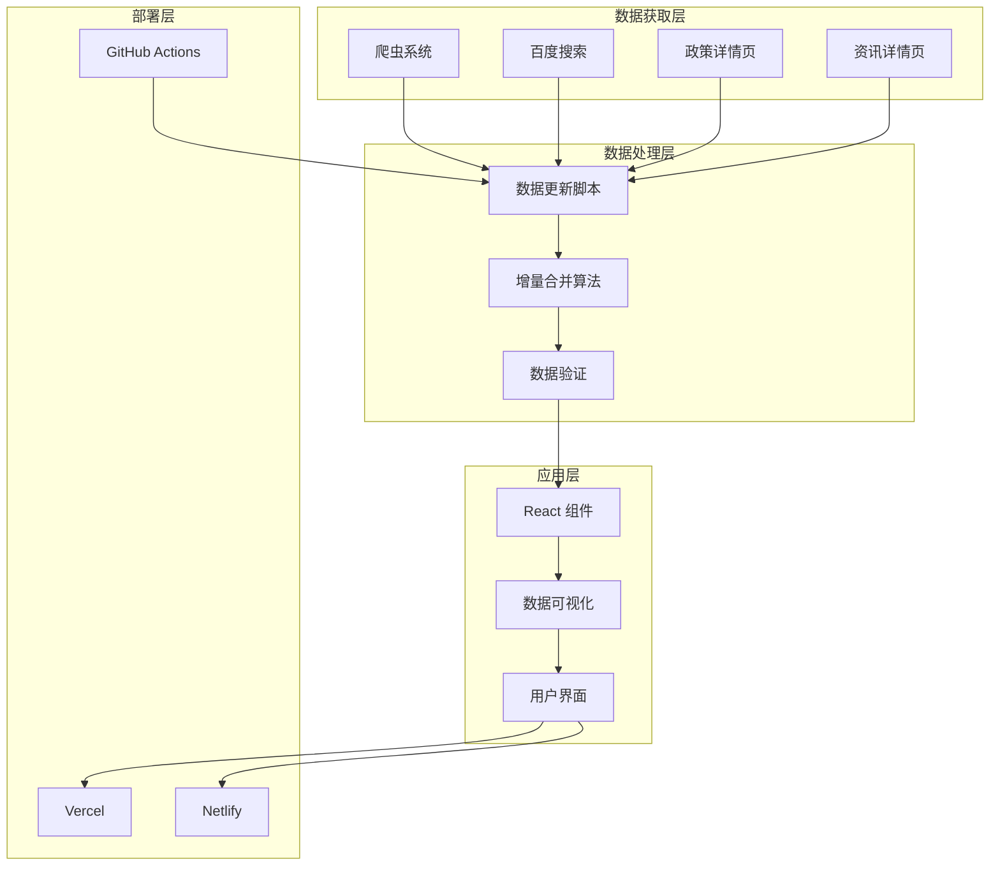
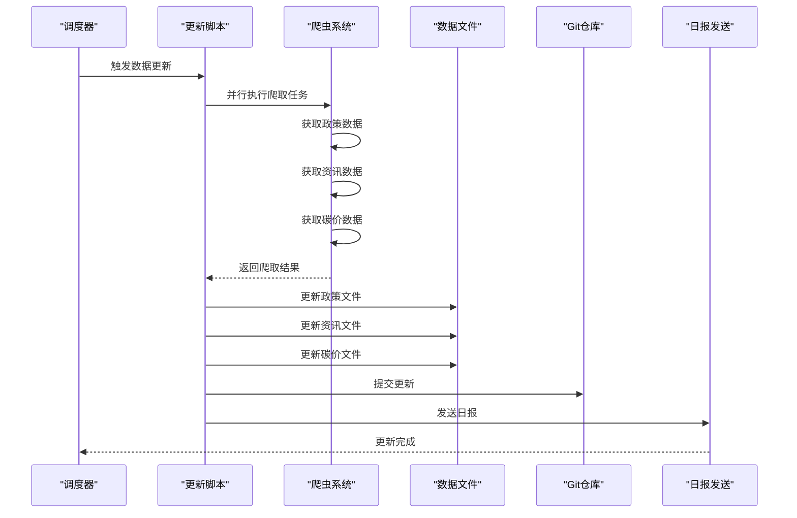
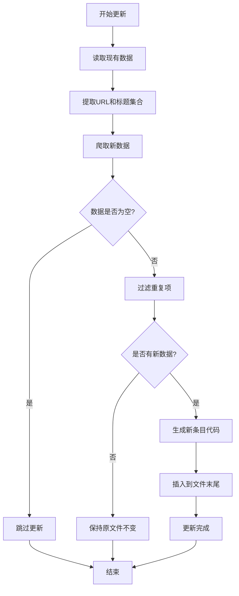
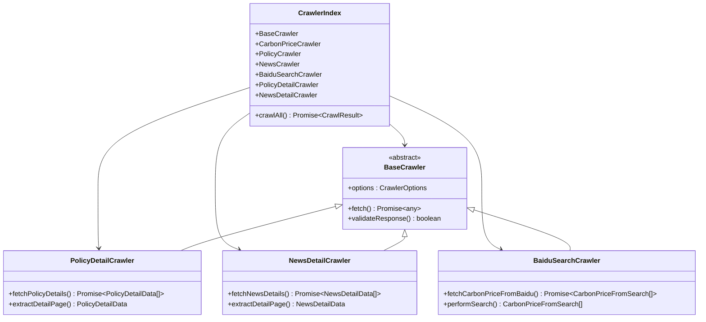
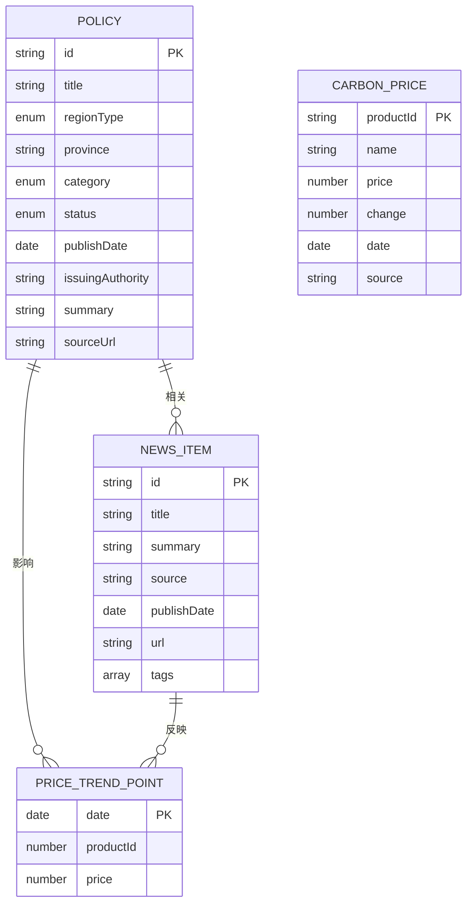
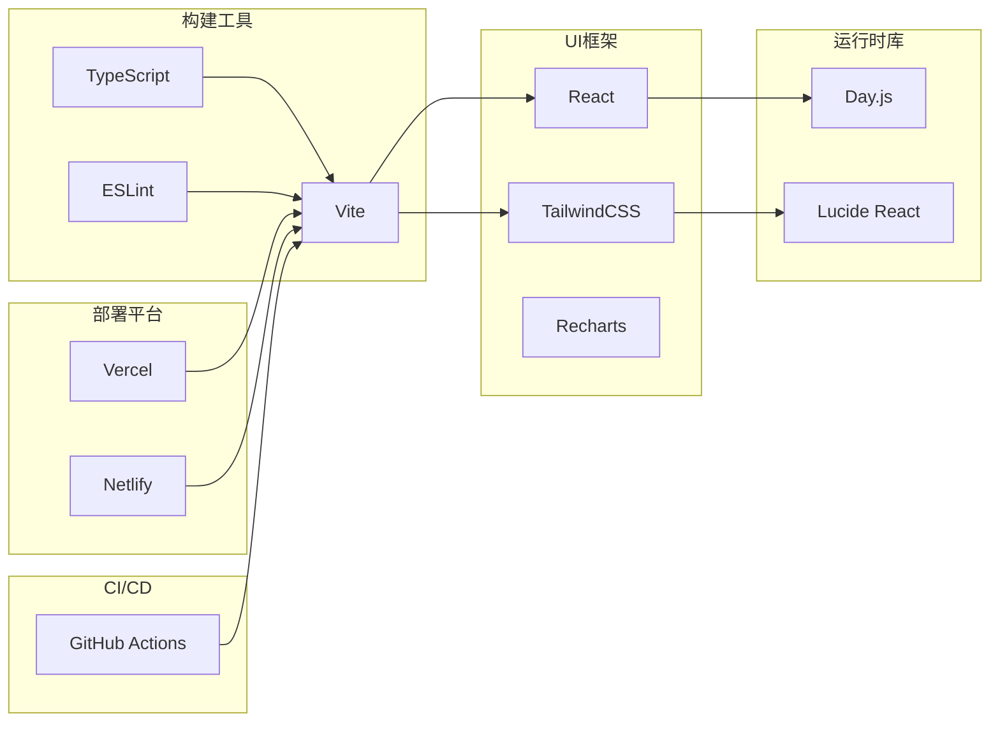

# 现代化部署配置文档

<cite>
**本文档中引用的文件**
- [vercel.json](file://vercel.json)
- [.vercel/project.json](file://.vercel/project.json)
- [netlify.toml](file://netlify.toml)
- [package.json](file://package.json)
- [vite.config.ts](file://vite.config.ts)
- [README.md](file://README.md)
- [.github/workflows/daily-report.yml](file://.github/workflows/daily-report.yml)
- [.github/workflows/daily-update.yml](file://.github/workflows/daily-update.yml)
- [scripts/autoUpdate.ts](file://scripts/autoUpdate.ts)
- [scripts/updateData.ts](file://scripts/updateData.ts)
- [scripts/crawler/index.ts](file://scripts/crawler/index.ts)
- [src/data/policies.ts](file://src/data/policies.ts)
- [src/data/news.ts](file://src/data/news.ts)
- [src/data/carbonPricesLatest.ts](file://src/data/carbonPricesLatest.ts)
- [tsconfig.json](file://tsconfig.json)
- [tsconfig.app.json](file://tsconfig.app.json)
- [eslint.config.js](file://eslint.config.js)
</cite>

## 更新摘要
**所做更改**
- 更新了Vercel项目配置中的项目名称和标识符
- 更新了GitHub Actions工作流中的网站URL配置
- 更新了项目名称相关的所有配置文件引用
- 修正了部署配置文档中的项目名称一致性

## 目录
1. [简介](#简介)
2. [项目结构概览](#项目结构概览)
3. [核心组件分析](#核心组件分析)
4. [架构总览](#架构总览)
5. [详细组件分析](#详细组件分析)
6. [依赖关系分析](#依赖关系分析)
7. [性能考虑](#性能考虑)
8. [故障排除指南](#故障排除指南)
9. [结论](#结论)

## 简介

这是一个基于现代前端技术栈构建的碳普惠资讯平台，采用React + TypeScript + Vite + TailwindCSS技术组合。项目实现了完整的自动化数据更新和部署流水线，支持多平台部署（Vercel和Netlify），并通过GitHub Actions实现定时数据抓取和日报发送功能。

**更新** 项目现已完成品牌重塑，项目名称从 `carbonhub` 更新为 `carbon-info-agent`，所有相关配置文件均已同步更新。

## 项目结构概览

项目采用现代化的前端工程化架构，主要分为以下几个核心部分：

**图表来源**
- [package.json:1-40](file://package.json#L1-L40)
- [vite.config.ts:1-8](file://vite.config.ts#L1-L8)
- [vercel.json:1-43](file://vercel.json#L1-L43)
- [netlify.toml:1-12](file://netlify.toml#L1-L12)

**章节来源**
- [package.json:1-40](file://package.json#L1-L40)
- [vite.config.ts:1-8](file://vite.config.ts#L1-L8)
- [README.md:1-75](file://README.md#L1-L75)

## 核心组件分析

### 构建系统配置

项目使用Vite作为主要构建工具，配合TypeScript进行类型检查和编译。构建配置具有以下特点：

- **多环境支持**: 支持开发、生产环境的不同配置
- **模块解析**: 采用bundler模式，优化模块打包
- **类型安全**: 严格的TypeScript配置，启用严格模式
- **代码分割**: 自动进行代码分割和懒加载

### 部署配置

项目同时支持Vercel和Netlify两种部署方式，每种都有其特定的优势：

**Vercel配置特性**:
- 框架感知：自动识别Vite框架
- 路由重写：支持SPA单页应用路由
- 安全头：内置多种安全响应头
- 缓存策略：静态资源长期缓存

**Netlify配置特性**:
- 简单易用：基于TOML配置文件
- Node版本控制：固定使用Node.js 20
- 重定向规则：支持SPA路由重写

**更新** Vercel项目配置现已更新为新的项目名称 `carbon-info-agent`，确保与品牌重塑保持一致。

**章节来源**
- [vercel.json:1-43](file://vercel.json#L1-L43)
- [.vercel/project.json:1-1](file://.vercel/project.json#L1-L1)
- [netlify.toml:1-12](file://netlify.toml#L1-L12)
- [package.json:6-14](file://package.json#L6-L14)

## 架构总览

项目采用分层架构设计，从数据获取到用户展示形成完整的技术链路：

**图表来源**
- [scripts/updateData.ts:282-294](file://scripts/updateData.ts#L282-L294)
- [scripts/crawler/index.ts:28-59](file://scripts/crawler/index.ts#L28-L59)
- [scripts/autoUpdate.ts:18-49](file://scripts/autoUpdate.ts#L18-L49)

## 详细组件分析

### 自动化数据更新系统

项目实现了完整的自动化数据更新流程，通过GitHub Actions定时执行：

**图表来源**
- [.github/workflows/daily-update.yml:15-44](file://.github/workflows/daily-update.yml#L15-L44)
- [scripts/autoUpdate.ts:18-49](file://scripts/autoUpdate.ts#L18-L49)
- [scripts/updateData.ts:282-294](file://scripts/updateData.ts#L282-L294)

### 数据更新算法

数据更新采用增量合并策略，确保不会丢失人工维护的数据：

**图表来源**
- [scripts/updateData.ts:41-127](file://scripts/updateData.ts#L41-L127)
- [scripts/updateData.ts:133-222](file://scripts/updateData.ts#L133-L222)

### 爬虫系统架构

爬虫系统采用统一入口设计，支持多种数据源：

**图表来源**
- [scripts/crawler/index.ts:6-12](file://scripts/crawler/index.ts#L6-L12)
- [scripts/crawler/index.ts:18-23](file://scripts/crawler/index.ts#L18-L23)

**章节来源**
- [scripts/autoUpdate.ts:1-53](file://scripts/autoUpdate.ts#L1-L53)
- [scripts/updateData.ts:1-305](file://scripts/updateData.ts#L1-L305)
- [scripts/crawler/index.ts:1-60](file://scripts/crawler/index.ts#L1-L60)

### 数据模型设计

项目采用强类型的数据模型设计，确保数据的一致性和完整性：

**图表来源**
- [src/types/index.ts:1-65](file://src/types/index.ts#L1-L65)
- [src/data/policies.ts:1-200](file://src/data/policies.ts#L1-L200)
- [src/data/news.ts:1-200](file://src/data/news.ts#L1-L200)
- [src/data/carbonPricesLatest.ts:1-39](file://src/data/carbonPricesLatest.ts#L1-L39)

**章节来源**
- [src/types/index.ts:1-65](file://src/types/index.ts#L1-L65)
- [src/data/policies.ts:1-200](file://src/data/policies.ts#L1-L200)
- [src/data/news.ts:1-200](file://src/data/news.ts#L1-L200)
- [src/data/carbonPricesLatest.ts:1-39](file://src/data/carbonPricesLatest.ts#L1-L39)

## 依赖关系分析

项目依赖关系清晰，采用模块化设计：

**图表来源**
- [package.json:15-38](file://package.json#L15-L38)
- [vite.config.ts:1-8](file://vite.config.ts#L1-L8)

**章节来源**
- [package.json:15-38](file://package.json#L15-L38)
- [tsconfig.json:1-8](file://tsconfig.json#L1-L8)
- [eslint.config.js:1-24](file://eslint.config.js#L1-L24)

## 性能考虑

项目在多个层面进行了性能优化：

### 构建性能
- **并行构建**: TypeScript和Vite并行执行
- **模块解析优化**: 使用bundler模式提高解析效率
- **代码分割**: 自动进行代码分割，减少首屏加载时间

### 运行时性能
- **懒加载**: React组件支持懒加载
- **缓存策略**: 静态资源长期缓存
- **压缩优化**: 生产环境自动压缩

### 数据访问性能
- **增量更新**: 只更新新增数据，避免全量重载
- **并行处理**: 多个爬虫任务并行执行
- **内存优化**: 合理的数据结构设计

## 故障排除指南

### 常见部署问题

**Vercel部署失败**
- 检查`vercel.json`配置是否正确
- 确认Node.js版本兼容性
- 验证构建命令和输出目录设置
- **更新** 确认项目名称已更新为 `carbon-info-agent`

**Netlify部署异常**
- 确认`netlify.toml`配置格式正确
- 检查Node.js版本设置
- 验证构建命令权限

**GitHub Actions部署问题**
- 检查工作流文件中的网站URL配置
- 确认部署凭证和权限设置
- 验证构建环境和依赖安装

### 数据更新问题

**爬虫数据为空**
- 检查网络连接和代理设置
- 验证目标网站可访问性
- 查看爬虫错误日志

**数据重复问题**
- 检查URL和标题去重逻辑
- 验证正则表达式匹配
- 确认数据文件格式

**章节来源**
- [.github/workflows/daily-report.yml:33-40](file://.github/workflows/daily-report.yml#L33-L40)
- [.github/workflows/daily-update.yml:46-53](file://.github/workflows/daily-update.yml#L46-L53)

## 结论

该项目展现了现代前端项目的最佳实践，具有以下突出特点：

1. **完整的自动化流水线**: 从数据获取到部署的全流程自动化
2. **多平台部署支持**: 同时支持Vercel和Netlify，提供灵活的部署选择
3. **强类型安全保障**: 完整的TypeScript类型系统确保代码质量
4. **性能优化完善**: 多层次的性能优化策略
5. **可扩展架构设计**: 清晰的模块划分和接口设计

**更新** 项目已完成品牌重塑，所有配置文件均已完成更新，确保项目名称一致性。通过合理的架构设计和技术选型，项目实现了高效、稳定、可维护的现代化部署配置，为类似项目提供了优秀的参考模板。