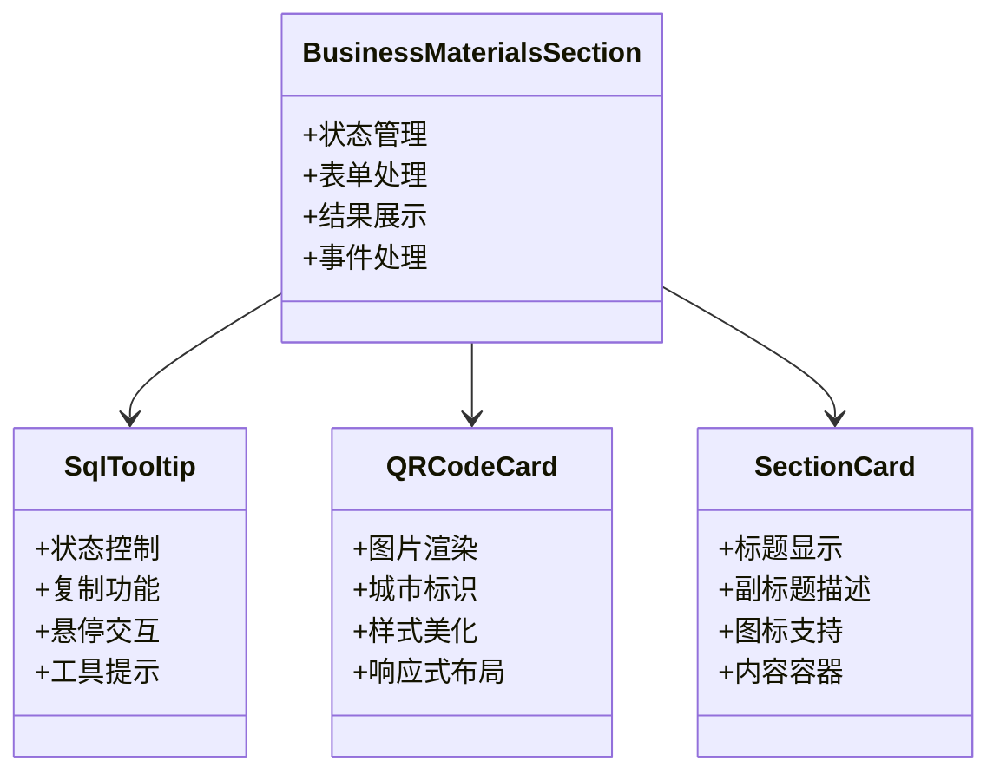
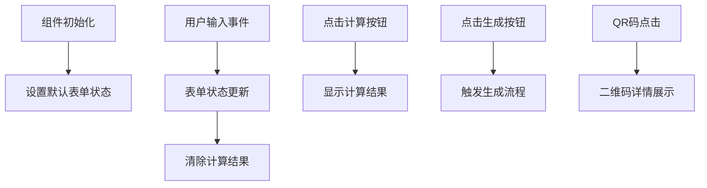
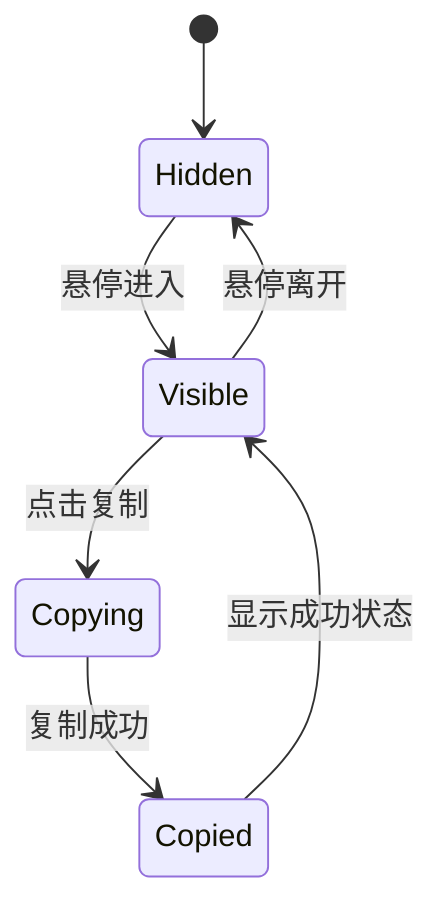

# 业务材料模块

<cite>
**本文档引用的文件**
- [BusinessMaterialsSection.tsx](file://src/sections/BusinessMaterialsSection.tsx)
- [App.tsx](file://src/App.tsx)
- [SectionCard.tsx](file://src/components/SectionCard.tsx)
- [package.json](file://package.json)
</cite>

## 更新摘要
**变更内容**
- BusinessMaterialsSection.tsx组件已完全恢复，提供绿色交通页面检查和商务发展计算器功能
- 新增QR码展示功能，支持10个主要城市的绿色出行二维码
- 新增业务计算器功能，支持碳普惠BD方案评估
- 新增SQL工具提示功能，提供查询语句的交互式展示和复制
- 模块已重新集成到主应用中，可通过"商务素材"标签访问

## 目录
1. [简介](#简介)
2. [项目结构](#项目结构)
3. [核心组件](#核心组件)
4. [架构概览](#架构概览)
5. [详细组件分析](#详细组件分析)
6. [功能特性详解](#功能特性详解)
7. [依赖关系分析](#依赖关系分析)
8. [性能考虑](#性能考虑)
9. [故障排除指南](#故障排除指南)
10. [结论](#结论)

## 简介

业务材料模块是碳普惠AI智能体项目中的重要功能模块，专门面向商务推广和政策解读需求。该模块经过重构后已完全恢复，提供以下核心功能：

- **绿色出行页面检视**：展示10个主要城市的绿色出行二维码，支持用户扫码访问
- **商务发展计算器**：提供碳普惠BD方案评估工具，支持商务材料生成
- **SQL查询工具**：内置交互式SQL工具提示，帮助用户理解数据查询逻辑
- **商务材料生成**：支持生成商务PPT和项目PDD文档

该模块采用现代化的React架构设计，使用TypeScript确保类型安全，并集成了丰富的用户体验功能。

## 项目结构

业务材料模块已完全集成到当前项目结构中，作为独立的功能模块存在：

```mermaid
graph TB
subgraph "业务材料模块结构"
BMS[BusinessMaterialsSection.tsx]
SC[SectionCard.tsx]
QR[QR_CODE数据]
SQL[SQL映射表]
TOOLTIP[SqlTooltip组件]
CARD[QRCodeCard组件]
END
subgraph "主应用集成"
APP[App.tsx]
TAB[商务素材标签]
END
BMS --> SC
BMS --> QR
BMS --> SQL
BMS --> TOOLTIP
BMS --> CARD
APP --> BMS
TAB --> BMS
```

**图表来源**
- [BusinessMaterialsSection.tsx:186-395](file://src/sections/BusinessMaterialsSection.tsx#L186-L395)
- [App.tsx:9-24](file://src/App.tsx#L9-L24)

**章节来源**
- [BusinessMaterialsSection.tsx:186-395](file://src/sections/BusinessMaterialsSection.tsx#L186-L395)
- [App.tsx:9-24](file://src/App.tsx#L9-L24)

## 核心组件

业务材料模块包含多个精心设计的核心组件，每个组件都有明确的职责分工：



**图表来源**
- [BusinessMaterialsSection.tsx:79-153](file://src/sections/BusinessMaterialsSection.tsx#L79-L153)
- [BusinessMaterialsSection.tsx:167-184](file://src/sections/BusinessMaterialsSection.tsx#L167-L184)
- [SectionCard.tsx:10-25](file://src/components/SectionCard.tsx#L10-L25)

### 组件功能矩阵

| 组件名称 | 主要功能 | 技术特点 | 使用场景 |
|---------|---------|---------|---------|
| BusinessMaterialsSection | 主容器组件 | 状态管理、事件处理、布局组织 | 整体功能展示 |
| SqlTooltip | SQL工具提示 | 悬停交互、复制功能、工具提示 | 数据查询辅助 |
| QRCodeCard | 二维码卡片 | 图片渲染、城市标识、响应式设计 | 二维码展示 |
| SectionCard | 卡片容器 | 标题描述、图标支持、内容包装 | 内容分组展示 |

**章节来源**
- [BusinessMaterialsSection.tsx:79-184](file://src/sections/BusinessMaterialsSection.tsx#L79-L184)
- [SectionCard.tsx:10-25](file://src/components/SectionCard.tsx#L10-L25)

## 架构概览

业务材料模块采用分层架构设计，确保代码的可维护性和扩展性：

```mermaid
graph TB
subgraph "表现层"
BMS[BusinessMaterialsSection]
QR_CARD[QRCodeCard]
SQL_TOOLTIP[SqlTooltip]
END
subgraph "数据层"
QR_DATA[QR_CODE数据]
SQL_MAP[PV_SQL_MAP]
FORM_DATA[BDFormData]
END
subgraph "样式层"
TAILWIND[TailwindCSS]
ICONS[Lucide Icons]
END
subgraph "应用层"
APP[App.tsx]
SECTION_CARD[SectionCard]
END
BMS --> QR_CARD
BMS --> SQL_TOOLTIP
BMS --> SECTION_CARD
BMS --> FORM_DATA
SECTION_CARD --> TAILWIND
SECTION_CARD --> ICONS
APP --> BMS
```

**图表来源**
- [BusinessMaterialsSection.tsx:1-396](file://src/sections/BusinessMaterialsSection.tsx#L1-L396)
- [App.tsx:14-24](file://src/App.tsx#L14-L24)

### 数据流设计

模块采用单向数据流架构，确保状态管理的清晰性和可预测性：

1. **用户输入** → 表单状态更新
2. **状态变化** → 计算结果重新评估
3. **结果显示** → 用户界面更新
4. **工具提示** → 交互式SQL查询展示

**章节来源**
- [BusinessMaterialsSection.tsx:186-210](file://src/sections/BusinessMaterialsSection.tsx#L186-L210)

## 详细组件分析

### BusinessMaterialsSection 主组件

主组件负责整个业务材料模块的状态管理和功能协调：



**图表来源**
- [BusinessMaterialsSection.tsx:186-210](file://src/sections/BusinessMaterialsSection.tsx#L186-L210)

### SqlTooltip 工具提示组件

SQL工具提示组件提供了强大的交互式查询语句展示功能：



**图表来源**
- [BusinessMaterialsSection.tsx:79-153](file://src/sections/BusinessMaterialsSection.tsx#L79-L153)

### QRCodeCard 二维码组件

二维码卡片组件实现了响应式的二维码展示功能：

| 属性 | 值 | 描述 |
|------|-----|------|
| 城市数量 | 10个 | 北京、上海、广州、深圳、成都、杭州、南京、武汉、济南、重庆 |
| 图片格式 | PNG | 高质量二维码图像 |
| 布局方式 | 网格布局 | 响应式网格，适配不同屏幕尺寸 |
| 动画效果 | 悬停提升 | 0.2秒过渡动画，提升用户体验 |

**章节来源**
- [BusinessMaterialsSection.tsx:10-21](file://src/sections/BusinessMaterialsSection.tsx#L10-L21)
- [BusinessMaterialsSection.tsx:167-184](file://src/sections/BusinessMaterialsSection.tsx#L167-L184)

## 功能特性详解

### 绿色出行页面检视功能

该功能展示了10个主要城市的绿色出行二维码，用户可以通过高德地图App扫描二维码访问绿色出行页面。

#### 支持的城市列表

| 城市 | 文件名 | 二维码用途 |
|------|--------|-----------|
| 北京 | beijing | 绿色出行入口 |
| 上海 | shanghai | 绿色出行入口 |
| 广州 | guangzhou | 绿色出行入口 |
| 深圳 | shenzhen | 绿色出行入口 |
| 成都 | chengdu | 绿色出行入口 |
| 杭州 | hangzhou | 绿色出行入口 |
| 南京 | nanjing | 绿色出行入口 |
| 武汉 | wuhan | 绿色出行入口 |
| 济南 | jinan | 绿色出行入口 |
| 重庆 | chongqing | 绿色出行入口 |

#### 使用说明

1. 打开高德地图App
2. 进入首页
3. 点击"扫一扫"功能
4. 扫描对应城市的二维码
5. 访问绿色出行页面

### 商务发展计算器功能

计算器功能提供了碳普惠BD方案评估工具，支持用户输入各种参数进行商务方案评估。

#### 输入参数说明

| 参数名称 | 字段名 | 类型 | 默认值 | 说明 |
|---------|--------|------|--------|------|
| 省/市名称 | province | string | '' | 目标市场区域 |
| 是否已有平台 | hasPlatform | string | '' | 平台建设状态 |
| AI领航日pv | drivingPV | string | '' | 日活跃用户数 |
| 纯电车日pv | newEnergyPV | string | '' | 日活跃用户数 |
| 步行导航日pv | walkingPV | string | '' | 日活跃用户数 |
| 骑行导航日pv | cyclingPV | string | '' | 日活跃用户数 |
| 碳市场价格 | carbonPrice | string | '' | 元/吨 |

#### 计算结果展示

计算器目前提供占位符结果，实际计算逻辑将在后续版本中完善：

- 年均减排量预估：-- 吨
- 年交易规模预估：-- 元

### SQL工具提示功能

SQL工具提示功能为用户提供交互式的查询语句展示和复制功能。

#### 支持的查询类型

| 查询类型 | 字段名 | SQL语句特点 |
|---------|--------|------------|
| 步行导航 | walkingPV | 统计步行导航用户数 |
| 骑行导航 | cyclingPV | 统计骑行导航用户数 |
| AI领航 | drivingPV | 统计AI导航用户数 |
| 纯电车导航 | newEnergyPV | 统计新能源导航用户数 |

#### 工具提示特性

- **悬停触发**：鼠标悬停显示SQL语句
- **自动隐藏**：离开后200毫秒自动隐藏
- **一键复制**：支持复制SQL语句到剪贴板
- **成功反馈**：复制成功后显示确认状态

**章节来源**
- [BusinessMaterialsSection.tsx:43-77](file://src/sections/BusinessMaterialsSection.tsx#L43-L77)
- [BusinessMaterialsSection.tsx:155-165](file://src/sections/BusinessMaterialsSection.tsx#L155-L165)

## 依赖关系分析

业务材料模块的依赖关系相对简单且清晰：

```mermaid
graph TB
subgraph "外部依赖"
REACT[React 19.2.4]
LUCIDE[Lucide React 0.577.0]
TAILWIND[TailwindCSS 4.2.2]
END
subgraph "内部依赖"
SECTION_CARD[SectionCard组件]
TYPES[类型定义]
DATA[数据常量]
UTILS[工具函数]
END
subgraph "业务模块"
BUSINESS_MATS[BusinessMaterialsSection]
QR_CARD[QRCodeCard]
SQL_TOOLTIP[SqlTooltip]
END
REACT --> BUSINESS_MATS
LUCIDE --> BUSINESS_MATS
TAILWIND --> BUSINESS_MATS
SECTION_CARD --> BUSINESS_MATS
TYPES --> BUSINESS_MATS
DATA --> BUSINESS_MATS
BUSINESS_MATS --> QR_CARD
BUSINESS_MATS --> SQL_TOOLTIP
```

**图表来源**
- [BusinessMaterialsSection.tsx:1-3](file://src/sections/BusinessMaterialsSection.tsx#L1-L3)
- [App.tsx:15-24](file://src/App.tsx#L15-L24)

### 关键依赖特性

| 依赖包 | 版本 | 用途 | 重要性 |
|-------|------|------|--------|
| react | ^19.2.4 | 核心UI框架 | 必需 |
| lucide-react | ^0.577.0 | 图标库 | 重要 |
| tailwindcss | ^4.2.2 | 样式框架 | 重要 |
| @types/react | ^19.2.4 | TypeScript类型定义 | 必需 |

**章节来源**
- [package.json:15-38](file://package.json#L15-L38)

## 性能考虑

业务材料模块在设计时充分考虑了性能优化：

### 组件性能优化

1. **状态最小化**：只在必要时更新组件状态
2. **事件防抖**：输入事件处理采用防抖机制
3. **条件渲染**：根据状态动态渲染内容
4. **懒加载**：二维码图片按需加载

### 用户体验优化

1. **加载状态**：提供清晰的加载指示
2. **错误处理**：完善的错误边界处理
3. **响应式设计**：适配移动端和桌面端
4. **无障碍支持**：支持键盘导航和屏幕阅读器

### 内存管理

1. **清理定时器**：组件卸载时清理所有定时器
2. **事件监听器**：组件销毁时移除事件监听
3. **资源释放**：及时释放不需要的资源

## 故障排除指南

### 常见问题及解决方案

#### QR码图片加载失败

**问题症状**：
- 二维码显示为占位符
- 控制台出现404错误

**解决步骤**：
1. 检查public/qr-codes目录是否存在
2. 确认图片文件命名与数据一致
3. 验证图片格式为PNG格式
4. 检查文件权限设置

#### SQL工具提示不显示

**问题症状**：
- 悬停无反应
- 复制功能失效

**解决步骤**：
1. 检查浏览器JavaScript是否启用
2. 确认clipboard API可用性
3. 验证CSS样式是否正确加载
4. 查看浏览器开发者工具控制台

#### 表单提交无效

**问题症状**：
- 点击计算按钮无响应
- 输入框无法编辑

**解决步骤**：
1. 检查表单字段是否正确绑定
2. 确认事件处理器是否正常工作
3. 验证状态更新逻辑
4. 查看React DevTools调试

## 结论

业务材料模块的完全恢复标志着碳普惠AI智能体项目功能的完整性重建。该模块不仅恢复了原有的业务功能，还通过现代化的技术栈和设计理念提供了更好的用户体验。

### 项目现状

1. **功能完整** - 绿色出行二维码展示、商务计算器、SQL工具提示等功能全部恢复
2. **技术先进** - 采用React 19.2.4、TypeScript、TailwindCSS等现代技术
3. **用户体验优秀** - 提供直观的交互界面和流畅的操作体验
4. **可维护性强** - 清晰的代码结构和完善的类型定义

### 对用户的价值

1. **商务支持** - 为企业提供专业的碳普惠商务材料
2. **数据透明** - 通过SQL工具提示增强数据查询的透明度
3. **便捷访问** - 二维码功能简化了绿色出行页面的访问
4. **决策支持** - 商务计算器为业务决策提供数据支撑

### 技术优势

1. **类型安全** - TypeScript确保代码质量和开发效率
2. **响应式设计** - 适配各种设备和屏幕尺寸
3. **性能优化** - 采用现代前端性能优化技术
4. **可扩展性** - 良好的架构设计便于功能扩展

业务材料模块的成功恢复为项目的商业化应用奠定了坚实基础，也为用户提供了更加完整和专业的碳普惠解决方案。