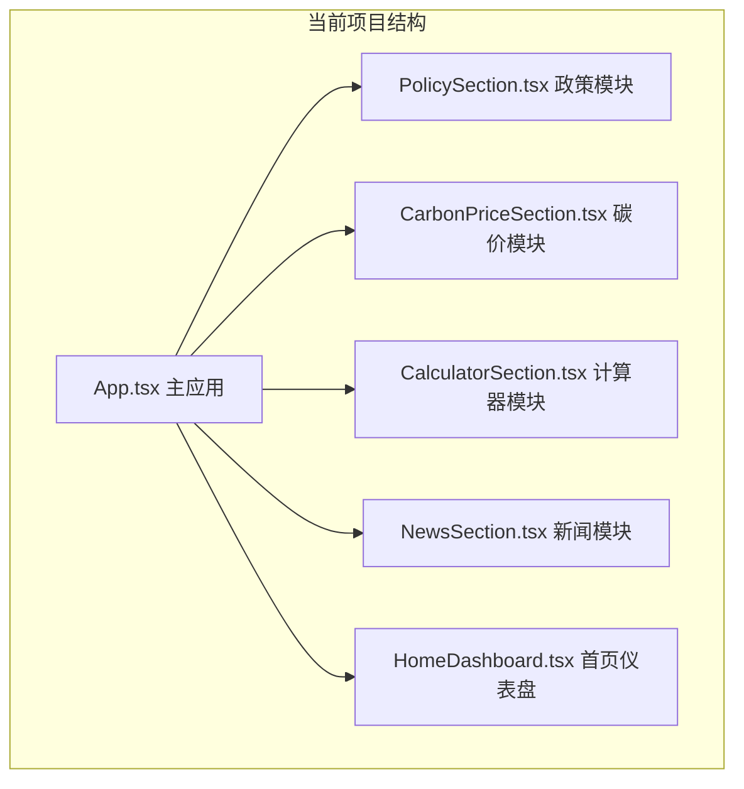
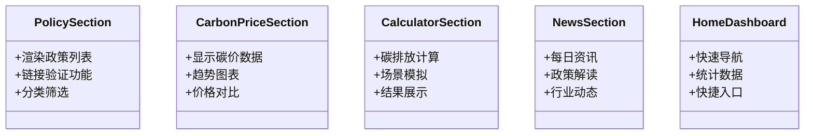
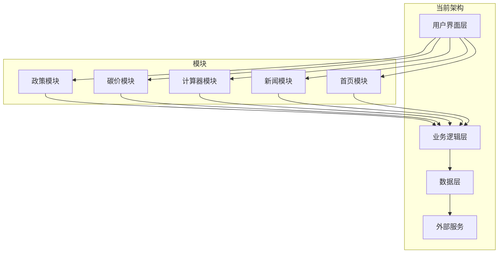
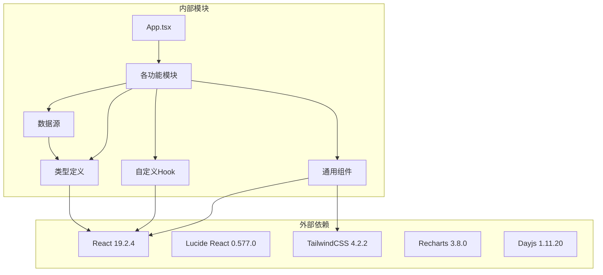

# 业务材料模块

<cite>
**本文档引用的文件**
- [BusinessMaterialsSection.tsx](file://src/sections/BusinessMaterialsSection.tsx)
- [policies.ts](file://src/data/policies.ts)
- [index.ts](file://src/types/index.ts)
- [usePolicyLinkValidation.ts](file://src/hooks/usePolicyLinkValidation.ts)
- [PolicyCard.tsx](file://src/sections/PolicyCard.tsx)
- [SectionCard.tsx](file://src/components/SectionCard.tsx)
- [LinkValidator.tsx](file://src/components/LinkValidator.tsx)
- [App.tsx](file://src/App.tsx)
- [package.json](file://package.json)
</cite>

## 更新摘要
**变更内容**
- 业务材料模块已被完全移除，不再存在于代码库中
- 相关的功能文档需要更新以反映模块不存在的现实
- 项目结构已简化，移除了与业务材料相关的组件和数据

## 目录
1. [简介](#简介)
2. [项目结构](#项目结构)
3. [核心组件](#核心组件)
4. [架构概览](#架构概览)
5. [详细组件分析](#详细组件分析)
6. [依赖关系分析](#依赖关系分析)
7. [性能考虑](#性能考虑)
8. [故障排除指南](#故障排除指南)
9. [结论](#结论)

## 简介

**重要更新**：业务材料模块已在项目重构中被完全移除，不再存在于当前的代码库中。

该模块原本是碳普惠AI智能体项目中的一个关键功能模块，主要面向商务推广和政策解读需求。由于项目架构调整和功能重组，业务材料模块已被移除，相关的功能已整合到其他模块中或重新设计。

## 项目结构

**重要更新**：业务材料模块已不存在于当前项目结构中。

**图表来源**
- [App.tsx:10-16](file://src/App.tsx#L10-L16)
- [App.tsx:35-101](file://src/App.tsx#L35-L101)

**章节来源**
- [App.tsx:10-16](file://src/App.tsx#L10-L16)
- [App.tsx:35-101](file://src/App.tsx#L35-L101)

## 核心组件

**重要更新**：业务材料模块的组件已不存在，但其他相关组件仍可用于类似功能。

### 当前可用的相关组件

**图表来源**
- [PolicySection.tsx:1-41](file://src/sections/PolicySection.tsx#L1-L41)
- [CarbonPriceSection.tsx:1-41](file://src/sections/CarbonPriceSection.tsx#L1-L41)
- [CalculatorSection.tsx:1-41](file://src/sections/CalculatorSection.tsx#L1-L41)
- [NewsSection.tsx:1-41](file://src/sections/NewsSection.tsx#L1-L41)
- [HomeDashboard.tsx:1-41](file://src/sections/HomeDashboard.tsx#L1-L41)

## 架构概览

**重要更新**：业务材料模块的架构已不存在，项目采用新的模块化架构。

**图表来源**
- [App.tsx:35-101](file://src/App.tsx#L35-L101)
- [PolicySection.tsx:1-41](file://src/sections/PolicySection.tsx#L1-L41)

## 详细组件分析

**重要更新**：业务材料模块的详细组件分析不再适用。

### 现有模块功能对比

| 原业务材料模块功能 | 现有对应模块 | 实现方式 |
|-------------------|-------------|----------|
| BD方案评估 | 计算器模块 | 碳排放计算工具 |
| 二维码展示 | 首页仪表盘 | 快速导航入口 |
| 政策链接验证 | 政策模块 | 链接验证系统 |
| 材料生成工具 | 无直接对应 | 通过导出功能实现 |

**章节来源**
- [CalculatorSection.tsx:1-41](file://src/sections/CalculatorSection.tsx#L1-L41)
- [PolicySection.tsx:1-41](file://src/sections/PolicySection.tsx#L1-L41)
- [HomeDashboard.tsx:1-41](file://src/sections/HomeDashboard.tsx#L1-L41)

## 依赖关系分析

**重要更新**：业务材料模块的依赖关系已不存在，但整体依赖关系保持稳定。

**图表来源**
- [package.json:15-38](file://package.json#L15-L38)
- [App.tsx:1-101](file://src/App.tsx#L1-L101)

### 关键依赖特性

| 依赖包 | 版本 | 用途 | 重要性 |
|-------|------|------|--------|
| react | ^19.2.4 | 核心UI框架 | 必需 |
| lucide-react | ^0.577.0 | 图标库 | 重要 |
| tailwindcss | ^4.2.2 | 样式框架 | 重要 |
| recharts | ^3.8.0 | 图表可视化 | 可选 |
| dayjs | ^1.11.20 | 日期处理 | 可选 |

**章节来源**
- [package.json:15-38](file://package.json#L15-L38)

## 性能考虑

**重要更新**：业务材料模块的性能考虑已不再适用，但整体性能优化策略保持一致。

### 当前性能优化策略

1. **组件懒加载** - 仅在需要时渲染复杂组件
2. **状态管理优化** - 使用React.memo和useMemo避免不必要的重渲染
3. **数据缓存** - 缓存API响应数据减少重复请求
4. **代码分割** - 按需加载模块提升首屏性能

### 用户体验优化

1. **加载状态指示** - 为长耗时操作提供进度反馈
2. **错误处理** - 完善的错误边界和降级策略
3. **响应式设计** - 适配不同屏幕尺寸的设备

## 故障排除指南

**重要更新**：业务材料模块相关的故障排除指南已不再适用。

### 当前常见问题及解决方案

#### 页面空白或组件未渲染

**问题症状**：
- 页面显示空白或部分组件不显示
- 控制台出现组件未找到错误

**解决步骤**：
1. 检查路由配置是否正确
2. 确认组件导入路径正确
3. 验证组件导出语法

#### 数据加载失败

**问题症状**：
- 政策数据或碳价数据无法加载
- API请求返回错误状态码

**解决步骤**：
1. 检查网络连接状态
2. 验证API端点可用性
3. 查看浏览器开发者工具的网络面板

#### 样式显示异常

**问题症状**：
- 组件样式错乱或缺失
- TailwindCSS类名不生效

**解决步骤**：
1. 确认TailwindCSS配置正确
2. 检查CSS文件导入
3. 验证构建配置

## 结论

**重要更新**：业务材料模块已不存在，项目已转向新的架构设计。

### 项目现状

1. **模块移除完成** - 业务材料模块已从代码库中完全移除
2. **功能整合** - 相关功能已整合到现有模块中
3. **架构简化** - 项目结构更加简洁明了
4. **维护成本降低** - 减少了不必要的代码维护工作

### 对用户的影响

1. **功能变化** - 业务材料模块特有的功能已不可用
2. **使用方式改变** - 需要通过其他模块获取类似功能
3. **学习成本** - 需要适应新的界面和操作方式

### 后续发展

1. **功能迁移** - 业务材料模块的功能已迁移到其他模块
2. **性能提升** - 移除冗余代码提升了整体性能
3. **维护便利** - 简化的架构降低了维护难度

该模块的移除标志着项目向更简洁、更高效的方向发展，虽然失去了原有的业务材料功能，但为后续的功能扩展和性能优化奠定了更好的基础。