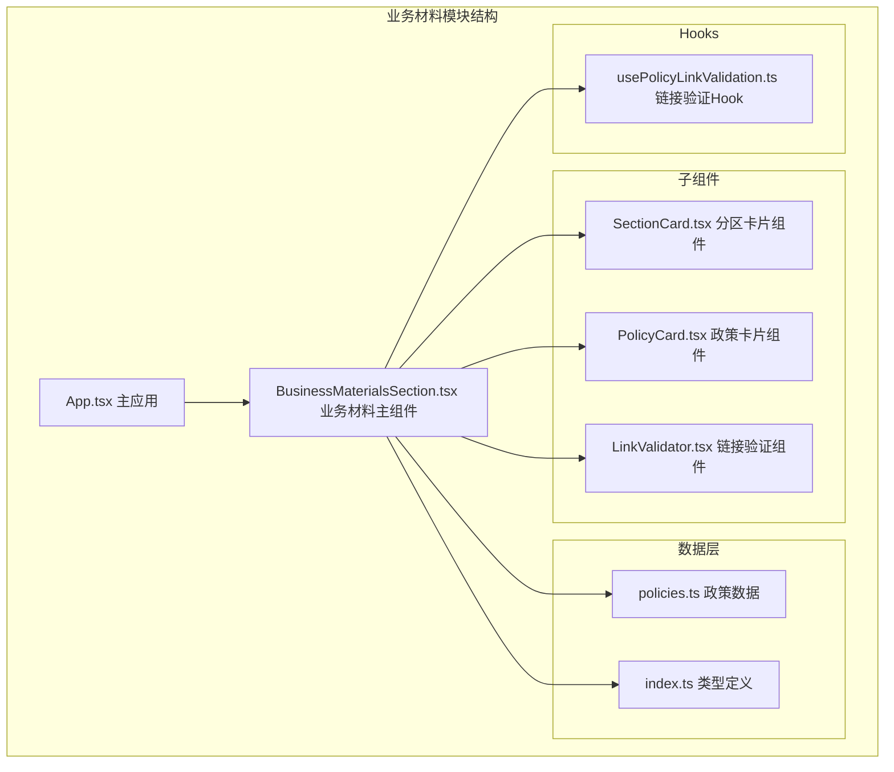
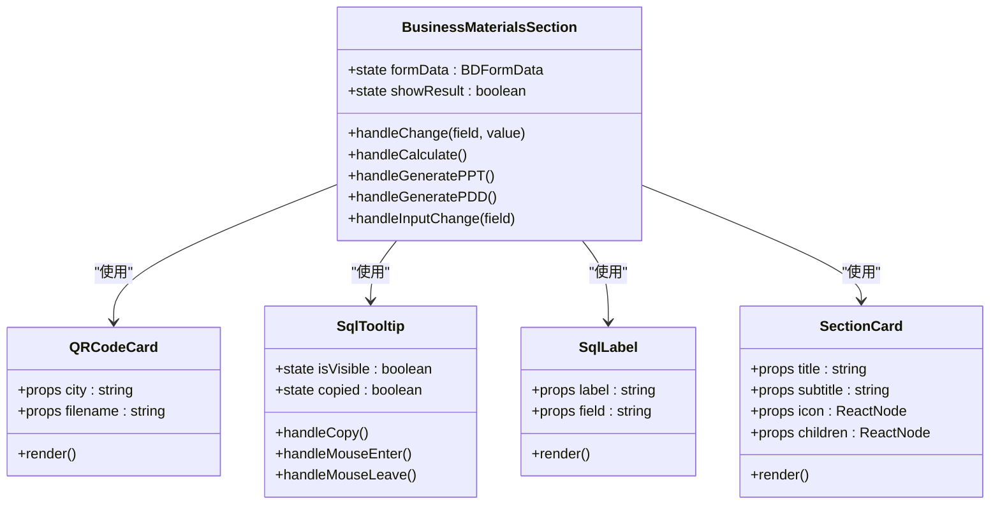
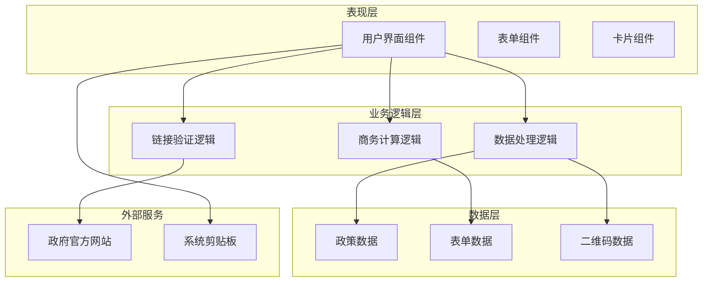
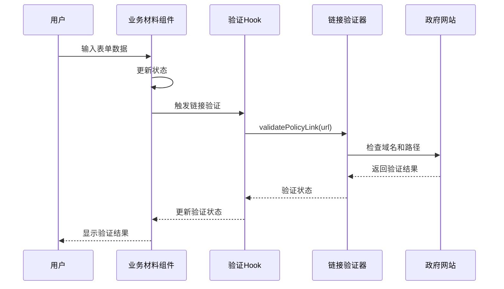
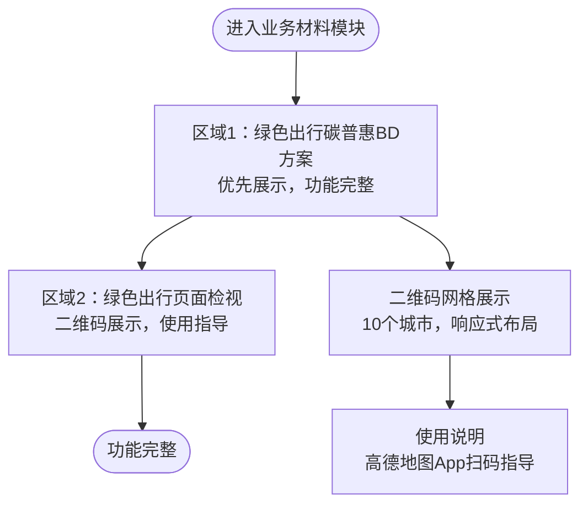
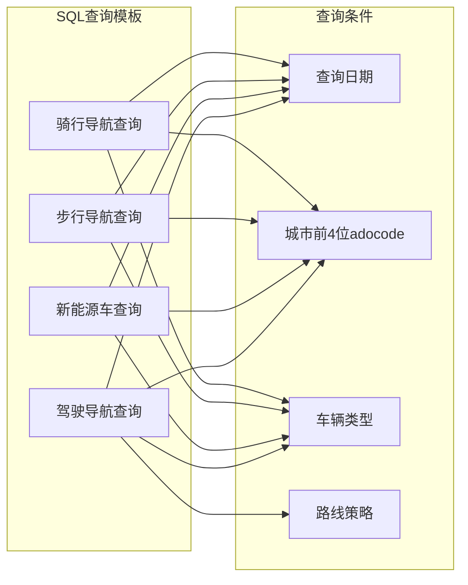
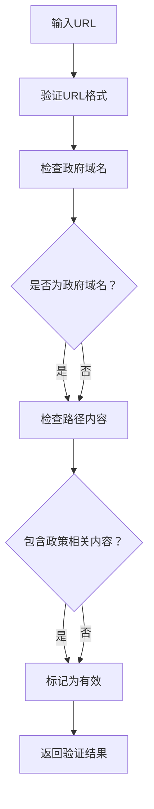
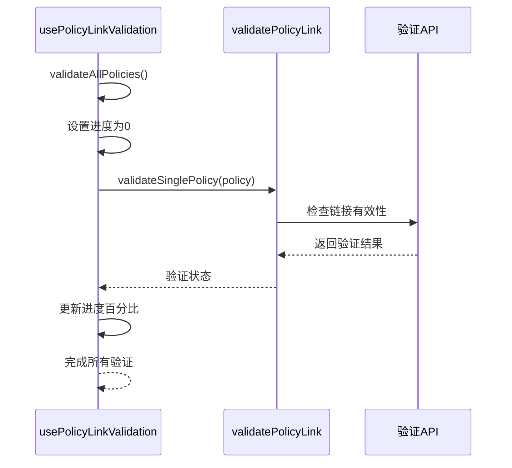
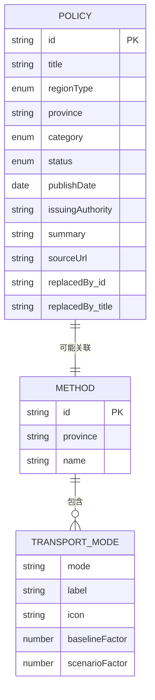
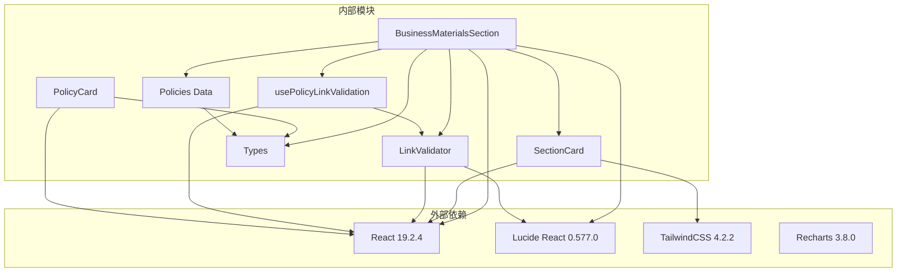

# 业务材料模块

<cite>
**本文档引用的文件**
- [BusinessMaterialsSection.tsx](file://src/sections/BusinessMaterialsSection.tsx)
- [policies.ts](file://src/data/policies.ts)
- [index.ts](file://src/types/index.ts)
- [usePolicyLinkValidation.ts](file://src/hooks/usePolicyLinkValidation.ts)
- [PolicyCard.tsx](file://src/sections/PolicyCard.tsx)
- [SectionCard.tsx](file://src/components/SectionCard.tsx)
- [LinkValidator.tsx](file://src/components/LinkValidator.tsx)
- [App.tsx](file://src/App.tsx)
- [package.json](file://package.json)
</cite>

## 更新摘要
**变更内容**
- 更新了业务材料模块的布局结构，明确了两个核心功能区域的排列顺序
- 强调了BD解决方案优先展示的设计理念
- 保持了10个主要城市的二维码生成功能不变

## 目录
1. [简介](#简介)
2. [项目结构](#项目结构)
3. [核心组件](#核心组件)
4. [架构概览](#架构概览)
5. [详细组件分析](#详细组件分析)
6. [依赖关系分析](#依赖关系分析)
7. [性能考虑](#性能考虑)
8. [故障排除指南](#故障排除指南)
9. [结论](#结论)

## 简介

业务材料模块是碳普惠AI智能体项目中的一个关键功能模块，主要面向商务推广和政策解读需求。该模块提供了两个核心功能区域，采用优化的布局设计：

1. **绿色出行碳普惠BD方案** - 商务方案评估工具，帮助用户估算碳普惠项目的减排量和交易规模
2. **绿色出行页面检视** - 各城市的绿色出行二维码展示，便于用户通过高德地图App扫码访问

该模块集成了政策数据管理、链接验证、用户交互等功能，为碳普惠业务推广提供完整的解决方案。布局优化确保了BD解决方案优先展示，同时保持了二维码生成功能的易用性。

## 项目结构

业务材料模块位于项目的前端架构中，采用React组件化设计，遵循模块化的文件组织原则：

**图表来源**
- [BusinessMaterialsSection.tsx:1-396](file://src/sections/BusinessMaterialsSection.tsx#L1-L396)
- [App.tsx:1-113](file://src/App.tsx#L1-L113)

**章节来源**
- [BusinessMaterialsSection.tsx:1-396](file://src/sections/BusinessMaterialsSection.tsx#L1-L396)
- [App.tsx:14-24](file://src/App.tsx#L14-L24)

## 核心组件

业务材料模块由多个精心设计的组件构成，每个组件都有明确的职责分工：

### 主要组件架构

**图表来源**
- [BusinessMaterialsSection.tsx:186-396](file://src/sections/BusinessMaterialsSection.tsx#L186-L396)
- [SectionCard.tsx:10-25](file://src/components/SectionCard.tsx#L10-L25)

### 数据结构设计

模块使用类型安全的数据结构来确保数据完整性：

| 接口名称 | 字段描述 | 数据类型 | 用途 |
|---------|----------|----------|------|
| BDFormData | 商务表单数据 | - province: string - hasPlatform: string - drivingPV: string - newEnergyPV: string - walkingPV: string - cyclingPV: string - carbonPrice: string | 存储用户输入的商务评估参数 |
| QRCodeItem | 二维码数据项 | - city: string - filename: string | 存储城市二维码信息 |
| Policy | 政策数据接口 | - id: string - title: string - regionType: 'national' \| 'province' \| 'city' - province: string - category: 'policy' \| 'methodology'<n>- status: 'active' \| 'expired' - publishDate: string - issuingAuthority: string - summary: string - sourceUrl: string - replacedBy?: { id: string; title: string } | 政策和方法学数据结构 |

**章节来源**
- [BusinessMaterialsSection.tsx:5-41](file://src/sections/BusinessMaterialsSection.tsx#L5-L41)
- [BusinessMaterialsSection.tsx:23-31](file://src/sections/BusinessMaterialsSection.tsx#L23-L31)
- [index.ts:2-14](file://src/types/index.ts#L2-L14)

## 架构概览

业务材料模块采用分层架构设计，实现了清晰的关注点分离：

**图表来源**
- [BusinessMaterialsSection.tsx:186-396](file://src/sections/BusinessMaterialsSection.tsx#L186-L396)
- [usePolicyLinkValidation.ts:12-80](file://src/hooks/usePolicyLinkValidation.ts#L12-L80)

### 组件交互流程

**图表来源**
- [usePolicyLinkValidation.ts:18-38](file://src/hooks/usePolicyLinkValidation.ts#L18-L38)
- [LinkValidator.tsx:18-96](file://src/components/LinkValidator.tsx#L18-L96)

## 详细组件分析

### 业务材料模块布局优化

业务材料模块采用了经过优化的双区域布局设计，确保用户能够优先关注最重要的功能：

#### 布局结构

**图表来源**
- [BusinessMaterialsSection.tsx:211-395](file://src/sections/BusinessMaterialsSection.tsx#L211-L395)

#### 区域1：绿色出行碳普惠BD方案

该区域作为优先展示的功能，提供了完整的商务评估工具：

**核心功能特性**
1. **省/市名称输入** - 支持全国范围的地区选择
2. **平台现状评估** - 是否已有碳普惠平台的选择
3. **多出行方式PV统计** - 驾驶、新能源车、步行、骑行的每日PV统计
4. **碳市场价格预估** - 碳市场价格的预估输入
5. **预估计算功能** - 年均减排量和年交易规模的预估
6. **材料生成工具** - 商务PPT和项目PDD的生成

**章节来源**
- [BusinessMaterialsSection.tsx:213-369](file://src/sections/BusinessMaterialsSection.tsx#L213-L369)

#### 区域2：绿色出行页面检视

该区域作为辅助功能，专注于二维码的展示和使用指导：

**核心功能特性**
1. **二维码网格展示** - 10个城市二维码的响应式网格布局
2. **使用指导说明** - 清晰的使用步骤说明
3. **视觉设计优化** - 每个二维码卡片包含渐变背景和城市标签
4. **高德地图集成** - 专门针对高德地图App的使用指导

**章节来源**
- [BusinessMaterialsSection.tsx:371-392](file://src/sections/BusinessMaterialsSection.tsx#L371-L392)

### 绿色出行碳普惠BD方案组件

这是业务材料模块的核心功能，提供完整的商务评估工具：

#### 表单设计

组件包含以下输入字段：

| 字段名称 | 类型 | 描述 | 默认值 |
|---------|------|------|--------|
| province | 文本框 | 省/市名称 | 空字符串 |
| hasPlatform | 下拉选择 | 是否已有碳普惠平台 | 空字符串 |
| drivingPV | 数字输入 | AI领航日PV | 空字符串 |
| newEnergyPV | 数字输入 | 纯电车日PV | 空字符串 |
| walkingPV | 数字输入 | 步行导航日PV | 空字符串 |
| cyclingPV | 数字输入 | 骑行导航日PV | 空字符串 |
| carbonPrice | 数字输入 | 碳市场价格预估 | 空字符串 |

#### SQL查询模板系统

组件内置了针对不同出行方式的SQL查询模板：

**图表来源**
- [BusinessMaterialsSection.tsx:43-77](file://src/sections/BusinessMaterialsSection.tsx#L43-L77)

**章节来源**
- [BusinessMaterialsSection.tsx:23-41](file://src/sections/BusinessMaterialsSection.tsx#L23-L41)
- [BusinessMaterialsSection.tsx:43-77](file://src/sections/BusinessMaterialsSection.tsx#L43-L77)

### 链接验证系统

业务材料模块集成了强大的链接验证功能，确保政策链接的可靠性：

#### 验证策略

**图表来源**
- [LinkValidator.tsx:18-96](file://src/components/LinkValidator.tsx#L18-L96)

#### 批量验证功能

**图表来源**
- [usePolicyLinkValidation.ts:41-54](file://src/hooks/usePolicyLinkValidation.ts#L41-L54)

**章节来源**
- [usePolicyLinkValidation.ts:12-80](file://src/hooks/usePolicyLinkValidation.ts#L12-L80)
- [LinkValidator.tsx:178-280](file://src/components/LinkValidator.tsx#L178-L280)

### 数据管理与类型系统

业务材料模块使用TypeScript类型系统确保数据完整性：

#### 政策数据结构

**图表来源**
- [index.ts:2-14](file://src/types/index.ts#L2-L14)
- [index.ts:48-53](file://src/types/index.ts#L48-L53)

**章节来源**
- [policies.ts:4-435](file://src/data/policies.ts#L4-L435)
- [index.ts:2-53](file://src/types/index.ts#L2-L53)

## 依赖关系分析

业务材料模块的依赖关系体现了清晰的模块化设计：

**图表来源**
- [package.json:15-22](file://package.json#L15-L22)
- [BusinessMaterialsSection.tsx:1-3](file://src/sections/BusinessMaterialsSection.tsx#L1-L3)

### 关键依赖特性

| 依赖包 | 版本 | 用途 | 重要性 |
|-------|------|------|--------|
| react | ^19.2.4 | 核心UI框架 | 必需 |
| lucide-react | ^0.577.0 | 图标库 | 重要 |
| tailwindcss | ^4.2.2 | 样式框架 | 重要 |
| recharts | ^3.8.0 | 图表可视化 | 可选 |
| dayjs | ^1.11.20 | 日期处理 | 可选 |

**章节来源**
- [package.json:15-38](file://package.json#L15-L38)

## 性能考虑

业务材料模块在设计时充分考虑了性能优化：

### 渲染优化策略

1. **组件懒加载** - 仅在需要时渲染复杂的表单组件
2. **状态管理优化** - 使用useState和useEffect避免不必要的重渲染
3. **事件处理优化** - 使用useCallback缓存回调函数

### 数据处理优化

1. **批量验证** - 使用异步队列处理多个链接验证请求
2. **内存管理** - 在组件卸载时清理定时器和事件监听器
3. **剪贴板操作** - 使用navigator.clipboard API进行高效的文本复制

### 用户体验优化

1. **加载状态指示** - 为长耗时操作提供进度反馈
2. **错误处理** - 完善的错误边界和降级策略
3. **响应式设计** - 适配不同屏幕尺寸的设备

## 故障排除指南

### 常见问题及解决方案

#### 链接验证失败

**问题症状**：
- 政策链接显示为无效状态
- 验证结果显示"链接格式不正确"

**解决步骤**：
1. 检查URL格式是否以http://或https://开头
2. 确认域名是否在可信域名列表中
3. 验证目标网站是否可达

#### 表单数据丢失

**问题症状**：
- 刷新页面后表单数据消失
- 预估计算结果未保存

**解决步骤**：
1. 确保表单字段绑定到正确的state变量
2. 检查onChange事件处理器是否正确更新状态
3. 验证组件的生命周期管理

#### 二维码显示问题

**问题症状**：
- 二维码图片无法加载
- 网格布局错乱

**解决步骤**：
1. 检查public/qr-codes目录下是否存在对应的PNG文件
2. 验证文件名与配置中的filename字段一致
3. 确认图片文件格式正确且大小合适

**章节来源**
- [LinkValidator.tsx:88-95](file://src/components/LinkValidator.tsx#L88-L95)
- [BusinessMaterialsSection.tsx:90-94](file://src/sections/BusinessMaterialsSection.tsx#L90-L94)

## 结论

业务材料模块作为碳普惠AI智能体的重要组成部分，成功实现了以下目标：

### 技术成就

1. **模块化设计** - 清晰的组件分离和职责划分
2. **类型安全** - 完整的TypeScript类型系统
3. **用户体验** - 直观的界面设计和流畅的交互体验
4. **数据完整性** - 严格的数据验证和错误处理机制
5. **布局优化** - 优先展示BD解决方案的设计理念

### 功能价值

1. **商务推广支持** - 为碳普惠项目的商务拓展提供工具支持
2. **政策信息整合** - 集中展示各地区的政策和方法学信息
3. **链接可靠性保证** - 通过多重验证确保政策链接的有效性
4. **跨城市覆盖** - 支持全国主要城市的绿色出行信息
5. **布局合理性** - 优化的双区域布局确保用户关注重点功能

### 发展建议

1. **功能扩展** - 可以考虑添加更多城市的二维码支持
2. **性能优化** - 进一步优化大数据量下的渲染性能
3. **国际化支持** - 添加多语言支持以扩大用户覆盖面
4. **移动端优化** - 针对移动设备进行更深入的界面优化

该模块为碳普惠业务的发展提供了坚实的技术基础，通过持续的优化和扩展，有望成为碳普惠领域的重要工具平台。