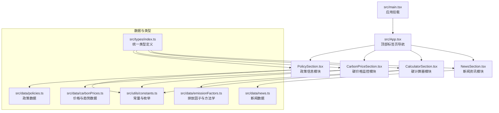
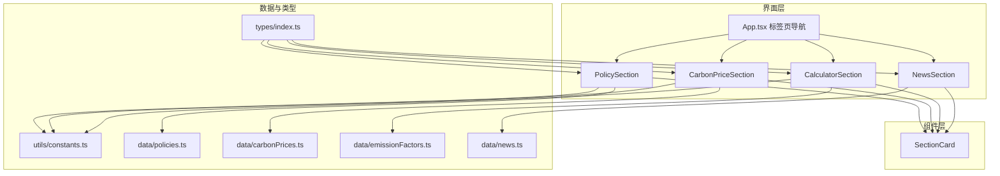
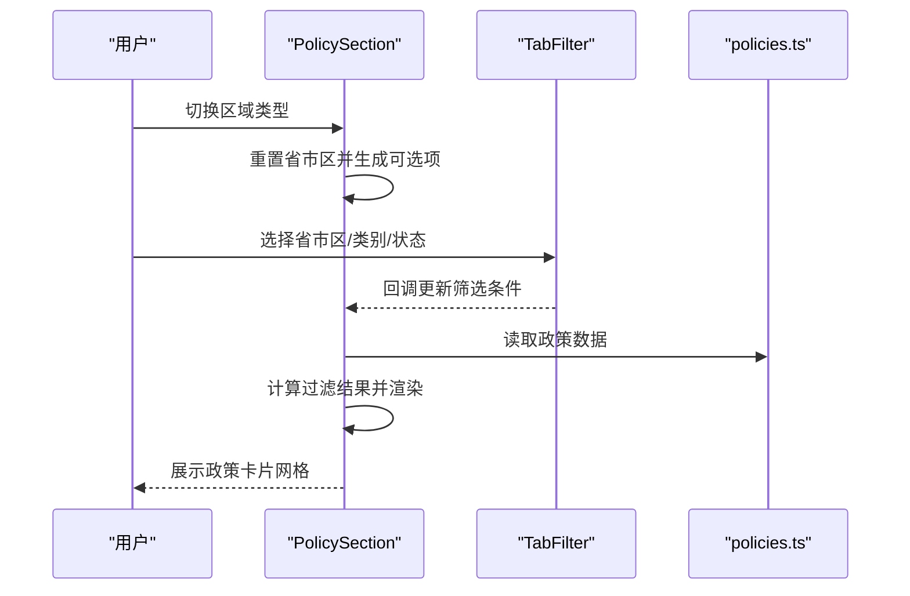
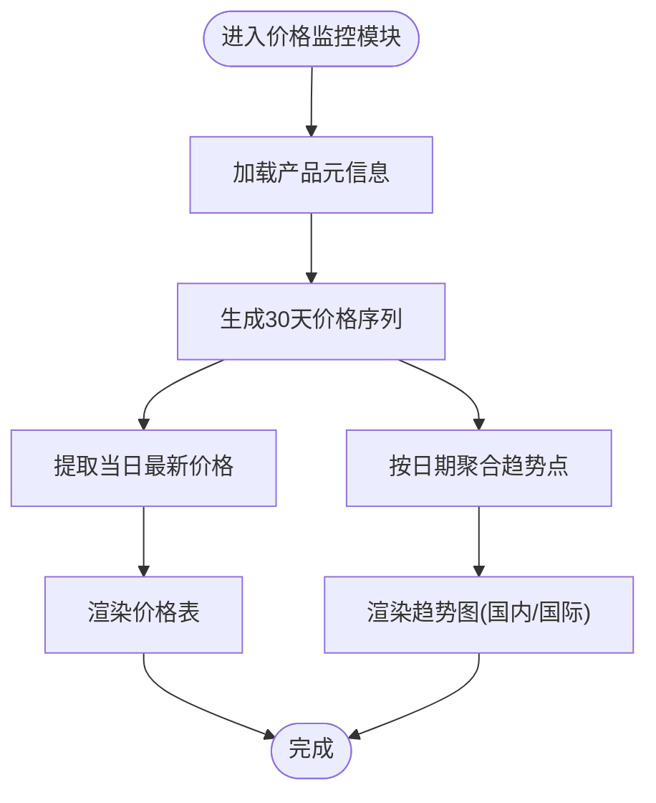
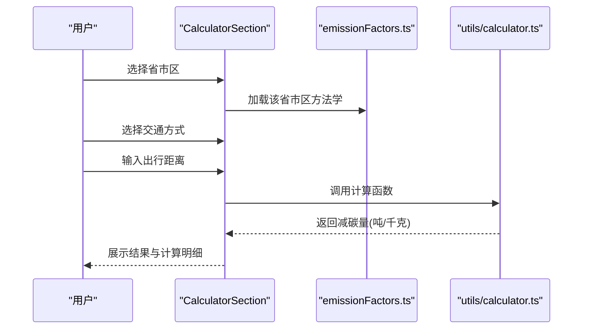
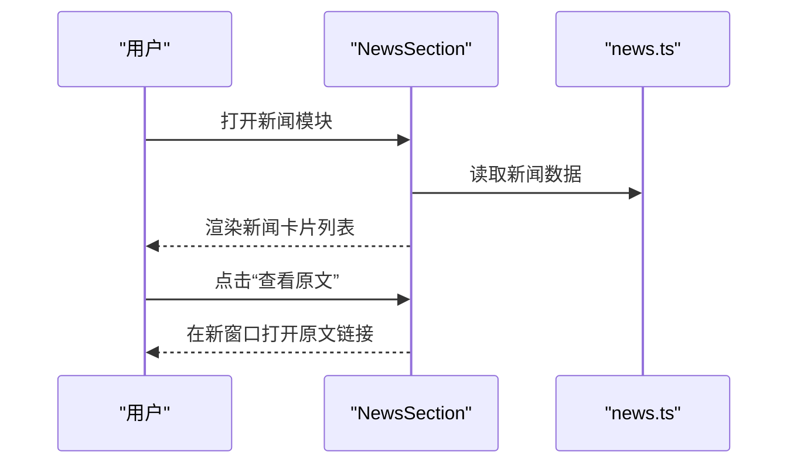
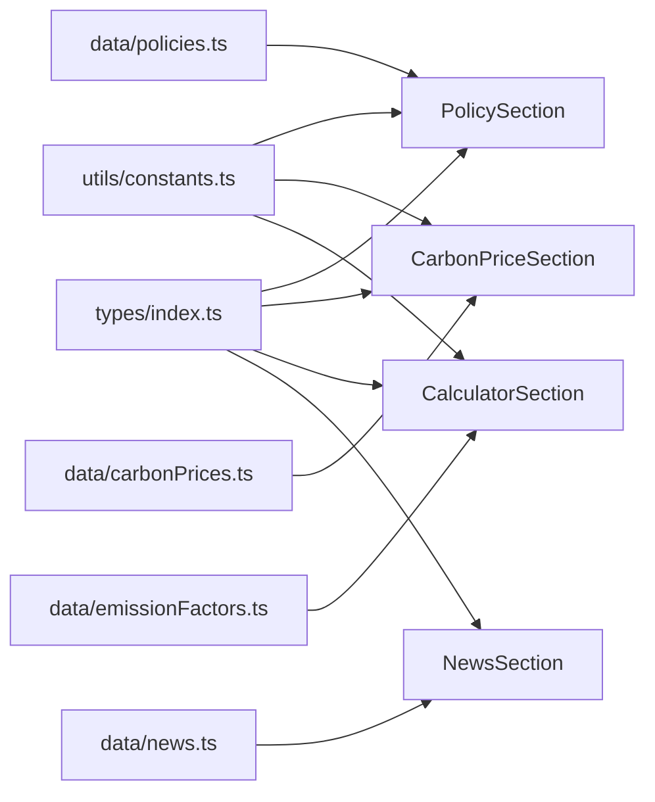

# 功能模块

<cite>
**本文引用的文件**
- [src/App.tsx](file://src/App.tsx)
- [src/main.tsx](file://src/main.tsx)
- [src/types/index.ts](file://src/types/index.ts)
- [src/utils/constants.ts](file://src/utils/constants.ts)
- [src/utils/calculator.ts](file://src/utils/calculator.ts)
- [src/components/SectionCard.tsx](file://src/components/SectionCard.tsx)
- [src/sections/PolicySection.tsx](file://src/sections/PolicySection.tsx)
- [src/sections/CarbonPriceSection.tsx](file://src/sections/CarbonPriceSection.tsx)
- [src/sections/CalculatorSection.tsx](file://src/sections/CalculatorSection.tsx)
- [src/sections/NewsSection.tsx](file://src/sections/NewsSection.tsx)
- [src/data/policies.ts](file://src/data/policies.ts)
- [src/data/carbonPrices.ts](file://src/data/carbonPrices.ts)
- [src/data/emissionFactors.ts](file://src/data/emissionFactors.ts)
- [src/data/news.ts](file://src/data/news.ts)
</cite>

## 目录
1. [简介](#简介)
2. [项目结构](#项目结构)
3. [核心组件](#核心组件)
4. [架构总览](#架构总览)
5. [详细组件分析](#详细组件分析)
6. [依赖分析](#依赖分析)
7. [性能考虑](#性能考虑)
8. [故障排查指南](#故障排查指南)
9. [结论](#结论)
10. [附录](#附录)

## 简介
本项目为“碳普惠信息代理”前端应用，围绕四大核心功能模块构建：政策信息、碳价格监控、碳计算器、新闻资讯。系统采用 React + TypeScript + Vite 技术栈，通过类型安全的数据模型与清晰的模块边界，提供政策检索、价格趋势、个人出行减碳量估算以及行业动态聚合等能力。模块间通过统一的类型定义与数据源解耦，支持按需扩展与定制。

## 项目结构
应用以“页面级模块 + 数据层 + 工具层 + 组件层”的方式组织，主入口负责路由式内容切换，各功能模块独立封装为 Section，并通过通用卡片组件进行布局与样式统一。

图表来源
- [src/main.tsx:1-11](file://src/main.tsx#L1-L11)
- [src/App.tsx:18-59](file://src/App.tsx#L18-L59)
- [src/sections/PolicySection.tsx:1-89](file://src/sections/PolicySection.tsx#L1-L89)
- [src/sections/CarbonPriceSection.tsx:1-42](file://src/sections/CarbonPriceSection.tsx#L1-L42)
- [src/sections/CalculatorSection.tsx:1-161](file://src/sections/CalculatorSection.tsx#L1-L161)
- [src/sections/NewsSection.tsx:1-71](file://src/sections/NewsSection.tsx#L1-L71)
- [src/types/index.ts:1-65](file://src/types/index.ts#L1-L65)
- [src/utils/constants.ts:1-44](file://src/utils/constants.ts#L1-L44)
- [src/data/policies.ts:1-318](file://src/data/policies.ts#L1-L318)
- [src/data/carbonPrices.ts:1-103](file://src/data/carbonPrices.ts#L1-L103)
- [src/data/emissionFactors.ts:1-103](file://src/data/emissionFactors.ts#L1-L103)
- [src/data/news.ts:1-77](file://src/data/news.ts#L1-L77)

章节来源
- [src/main.tsx:1-11](file://src/main.tsx#L1-L11)
- [src/App.tsx:18-59](file://src/App.tsx#L18-L59)

## 核心组件
- 应用入口与导航：应用根组件负责渲染头部、顶部标签页与当前激活模块内容；标签页切换通过状态驱动，确保模块间互斥显示。
- 模块卡片容器：通用卡片组件提供标题、副标题与图标区域，统一模块头部样式与内边距，便于后续扩展。

章节来源
- [src/App.tsx:18-59](file://src/App.tsx#L18-L59)
- [src/components/SectionCard.tsx:1-26](file://src/components/SectionCard.tsx#L1-L26)

## 架构总览
四大模块在数据与类型层面保持一致的契约，通过统一的类型定义与常量配置实现松耦合协作。模块间无直接依赖，仅通过类型与数据源间接关联，便于替换与扩展。

图表来源
- [src/App.tsx:18-59](file://src/App.tsx#L18-L59)
- [src/sections/PolicySection.tsx:1-89](file://src/sections/PolicySection.tsx#L1-L89)
- [src/sections/CarbonPriceSection.tsx:1-42](file://src/sections/CarbonPriceSection.tsx#L1-L42)
- [src/sections/CalculatorSection.tsx:1-161](file://src/sections/CalculatorSection.tsx#L1-L161)
- [src/sections/NewsSection.tsx:1-71](file://src/sections/NewsSection.tsx#L1-L71)
- [src/types/index.ts:1-65](file://src/types/index.ts#L1-L65)
- [src/utils/constants.ts:1-44](file://src/utils/constants.ts#L1-L44)
- [src/data/policies.ts:1-318](file://src/data/policies.ts#L1-L318)
- [src/data/carbonPrices.ts:1-103](file://src/data/carbonPrices.ts#L1-L103)
- [src/data/emissionFactors.ts:1-103](file://src/data/emissionFactors.ts#L1-L103)
- [src/data/news.ts:1-77](file://src/data/news.ts#L1-L77)

## 详细组件分析

### 政策信息模块（PolicySection）
- 设计思路
  - 提供多维筛选：区域类型、省市区名称、政策类别、状态，支持联动更新与重置。
  - 展示策略：网格卡片列表，每条政策包含标题、摘要、发布机构、日期等关键信息；空态提示友好。
- 实现细节
  - 使用记忆化计算过滤后的政策列表，避免重复渲染。
  - 区域联动：根据区域类型动态生成省市区选项，保证筛选一致性。
  - 常量来源：区域类型、省市区、政策类别、状态均来自统一常量配置。
- 用户交互流程
  - 步骤一：选择区域类型，自动刷新省市区选项。
  - 步骤二：选择省市区、政策类别、状态，实时更新列表。
  - 步骤三：点击卡片查看详情或跳转原文链接（如存在）。

图表来源
- [src/sections/PolicySection.tsx:15-34](file://src/sections/PolicySection.tsx#L15-L34)
- [src/sections/PolicySection.tsx:48-72](file://src/sections/PolicySection.tsx#L48-L72)
- [src/data/policies.ts:1-318](file://src/data/policies.ts#L1-L318)

章节来源
- [src/sections/PolicySection.tsx:1-89](file://src/sections/PolicySection.tsx#L1-L89)
- [src/data/policies.ts:1-318](file://src/data/policies.ts#L1-L318)
- [src/utils/constants.ts:1-44](file://src/utils/constants.ts#L1-L44)

### 碳价格监控模块（CarbonPriceSection）
- 设计思路
  - 双视图：最新价格表与国内外市场30天趋势图，满足“快读”与“趋势”两类需求。
  - 数据模型：产品元信息、价格记录、趋势点集合，统一单位与标注。
- 实现细节
  - 最新价格：按产品维度取当日价格与涨跌。
  - 趋势数据：按日期聚合各产品价格，形成时间序列。
  - 价格生成：内置随机游走模拟，控制基价、波动率与种子，确保可复现实验数据。
- 用户交互流程
  - 步骤一：浏览最新价格表，快速对比不同产品价格与涨跌。
  - 步骤二：查看国内/国际趋势图，观察价格走势与波动。

图表来源
- [src/sections/CarbonPriceSection.tsx:8-39](file://src/sections/CarbonPriceSection.tsx#L8-L39)
- [src/data/carbonPrices.ts:33-83](file://src/data/carbonPrices.ts#L33-L83)
- [src/data/carbonPrices.ts:85-102](file://src/data/carbonPrices.ts#L85-L102)
- [src/utils/constants.ts:26-43](file://src/utils/constants.ts#L26-L43)

章节来源
- [src/sections/CarbonPriceSection.tsx:1-42](file://src/sections/CarbonPriceSection.tsx#L1-L42)
- [src/data/carbonPrices.ts:1-103](file://src/data/carbonPrices.ts#L1-L103)
- [src/utils/constants.ts:26-43](file://src/utils/constants.ts#L26-L43)

### 碳计算器模块（CalculatorSection）
- 设计思路
  - 基于省/市方法学与交通方式排放因子，提供个人出行减碳量估算。
  - 参数配置：省市区选择、交通方式、出行距离；结果展示包含吨/千克与计算明细。
- 实现细节
  - 方法学数据：按省/市分组，包含多种交通方式及其基准与场景排放因子。
  - 计算逻辑：差值乘以距离，再换算为吨与千克，保留合理精度。
  - 交互设计：卡片式输入区与结果区，直观呈现计算过程与依据。
- 用户交互流程
  - 步骤一：选择省市区，加载对应方法学。
  - 步骤二：选择交通方式，查看方式说明与图标。
  - 步骤三：输入出行距离，即时显示预估减碳量与计算公式。

图表来源
- [src/sections/CalculatorSection.tsx:16-35](file://src/sections/CalculatorSection.tsx#L16-L35)
- [src/data/emissionFactors.ts:3-102](file://src/data/emissionFactors.ts#L3-L102)
- [src/utils/calculator.ts:1-12](file://src/utils/calculator.ts#L1-L12)

章节来源
- [src/sections/CalculatorSection.tsx:1-161](file://src/sections/CalculatorSection.tsx#L1-L161)
- [src/data/emissionFactors.ts:1-103](file://src/data/emissionFactors.ts#L1-L103)
- [src/utils/calculator.ts:1-12](file://src/utils/calculator.ts#L1-L12)

### 新闻资讯模块（NewsSection）
- 设计思路
  - 内容聚合：按时间倒序展示，突出标题、摘要、来源、发布时间与标签。
  - 阅读体验：卡片式布局，悬停高亮，外链打开新窗口，标签圆角展示。
- 实现细节
  - 数据来源：静态新闻数组，包含标题、摘要、来源、日期、URL与标签。
  - 展示策略：标题加粗、摘要两行截断、标签紧凑排列，右侧提供“查看原文”按钮。
- 用户交互流程
  - 步骤一：滚动浏览新闻列表。
  - 步骤二：点击“查看原文”在新窗口打开原文链接。

图表来源
- [src/sections/NewsSection.tsx:5-69](file://src/sections/NewsSection.tsx#L5-L69)
- [src/data/news.ts:1-77](file://src/data/news.ts#L1-L77)

章节来源
- [src/sections/NewsSection.tsx:1-71](file://src/sections/NewsSection.tsx#L1-L71)
- [src/data/news.ts:1-77](file://src/data/news.ts#L1-L77)

## 依赖分析
- 类型与常量
  - 统一类型定义贯穿所有模块，确保数据契约一致。
  - 常量配置集中管理筛选项与产品元信息，降低硬编码风险。
- 数据源
  - 各模块独立依赖自身数据文件，避免跨模块耦合。
- 组件复用
  - 通用卡片组件被四个模块复用，提升一致性与维护效率。

图表来源
- [src/types/index.ts:1-65](file://src/types/index.ts#L1-L65)
- [src/utils/constants.ts:1-44](file://src/utils/constants.ts#L1-L44)
- [src/data/policies.ts:1-318](file://src/data/policies.ts#L1-L318)
- [src/data/carbonPrices.ts:1-103](file://src/data/carbonPrices.ts#L1-L103)
- [src/data/emissionFactors.ts:1-103](file://src/data/emissionFactors.ts#L1-L103)
- [src/data/news.ts:1-77](file://src/data/news.ts#L1-L77)

章节来源
- [src/types/index.ts:1-65](file://src/types/index.ts#L1-L65)
- [src/utils/constants.ts:1-44](file://src/utils/constants.ts#L1-L44)
- [src/data/policies.ts:1-318](file://src/data/policies.ts#L1-L318)
- [src/data/carbonPrices.ts:1-103](file://src/data/carbonPrices.ts#L1-L103)
- [src/data/emissionFactors.ts:1-103](file://src/data/emissionFactors.ts#L1-L103)
- [src/data/news.ts:1-77](file://src/data/news.ts#L1-L77)

## 性能考虑
- 渲染优化
  - 使用记忆化计算（如政策过滤、价格与趋势数据）减少重复计算。
  - 列表渲染采用虚拟化或分页策略可进一步优化长列表性能。
- 数据体积
  - 价格数据为固定天数与产品数量的预生成序列，建议在生产环境接入真实接口时按需分页。
- 交互响应
  - 输入框与按钮使用受控组件，避免不必要的重渲染。
- 图表性能
  - 趋势图建议使用轻量图表库或Canvas绘制，减少DOM节点数量。

## 故障排查指南
- 政策筛选无结果
  - 检查筛选条件是否过于严格；尝试将“全部”作为初始状态。
  - 确认省市区选项随区域类型联动正确更新。
- 价格趋势为空
  - 确认产品元信息与价格记录生成逻辑未被修改；检查日期格式与聚合逻辑。
- 计算结果异常
  - 核对所选省市区与交通方式对应的排放因子是否存在；确认距离输入为正数。
- 新闻无法打开原文
  - 检查链接URL是否有效；确认浏览器未拦截新窗口。

章节来源
- [src/sections/PolicySection.tsx:74-79](file://src/sections/PolicySection.tsx#L74-L79)
- [src/data/carbonPrices.ts:85-102](file://src/data/carbonPrices.ts#L85-L102)
- [src/utils/calculator.ts:1-12](file://src/utils/calculator.ts#L1-L12)
- [src/sections/NewsSection.tsx:20-24](file://src/sections/NewsSection.tsx#L20-L24)

## 结论
本项目通过清晰的模块划分与统一的数据契约，实现了政策检索、价格趋势、个人减碳估算与行业资讯聚合的完整闭环。模块间低耦合、高内聚，具备良好的可扩展性与可维护性。建议在后续迭代中引入真实数据接口、完善权限与缓存策略，并持续优化交互细节与性能表现。

## 附录
- 模块扩展建议
  - 政策模块：增加关键词搜索、分页与收藏功能；支持按发布机构与生效日期排序。
  - 价格模块：接入实时API、支持多时间粒度与多指标对比；增强图表交互（缩放、标注）。
  - 计算器模块：支持更多出行场景与行业场景；提供历史记录与导出功能。
  - 新闻模块：支持按标签筛选、收藏与分享；集成RSS或爬虫以动态更新。
- 自定义开发要点
  - 保持类型定义与常量配置的中心化；新增字段时同步更新类型与默认值。
  - 数据层采用“只读+工厂函数”模式，便于测试与模拟数据注入。
  - 组件层遵循单一职责，必要时拆分子组件并明确 Props 与事件回调。