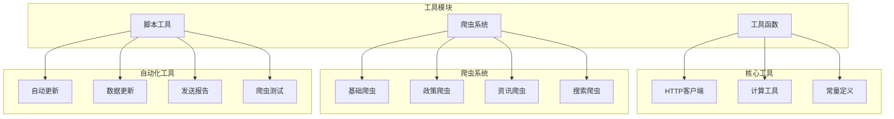
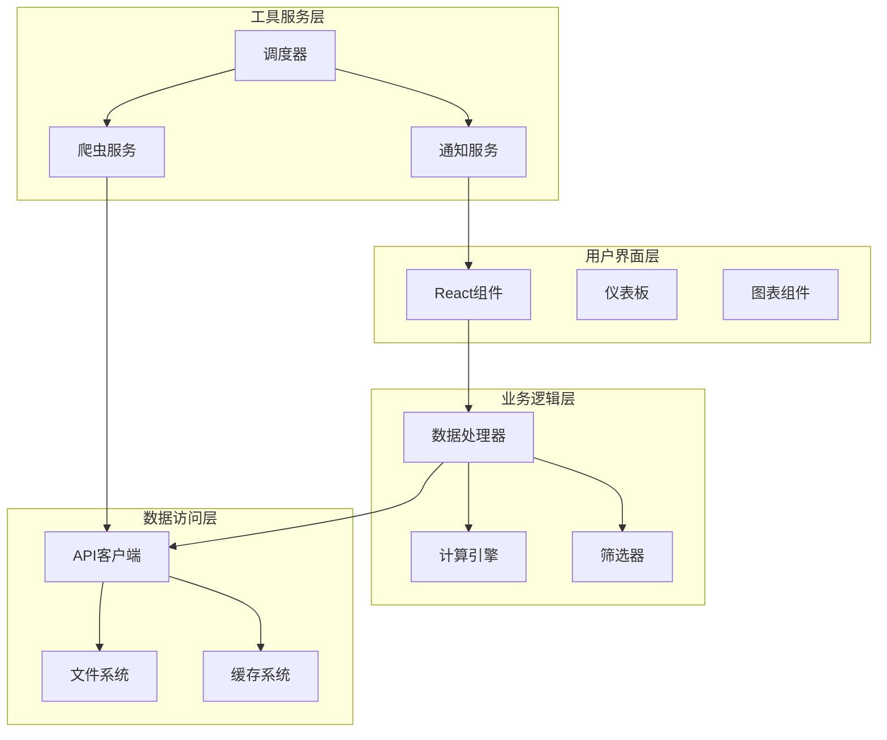
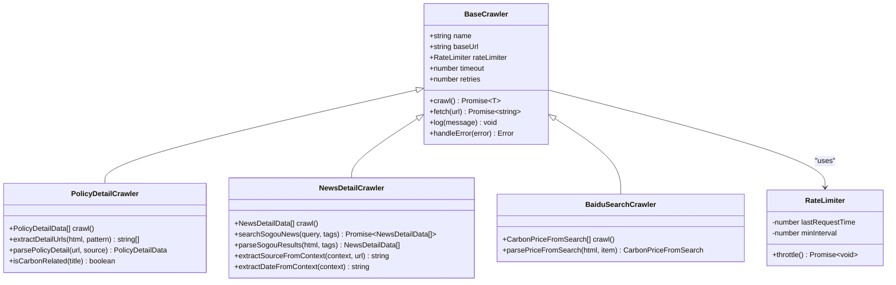
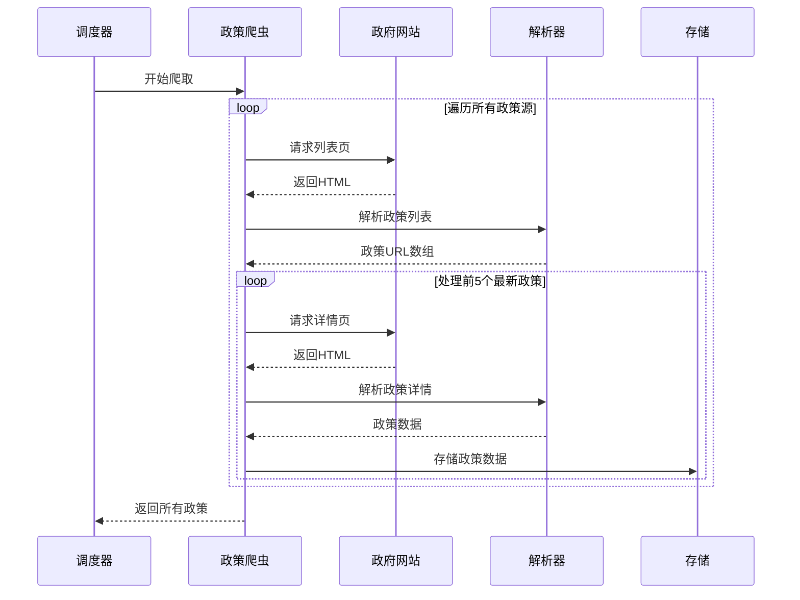
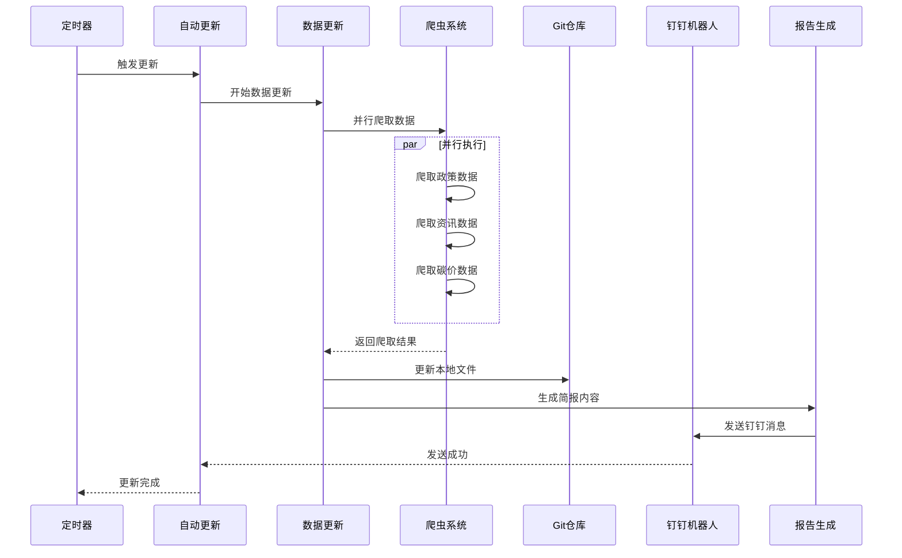
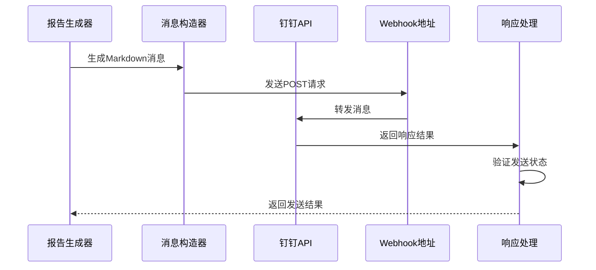
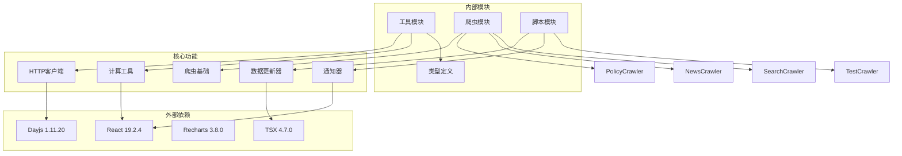

# 工具模块

<cite>
**本文档引用的文件**
- [httpClient.ts](file://scripts/utils/httpClient.ts)
- [calculator.ts](file://src/utils/calculator.ts)
- [constants.ts](file://src/utils/constants.ts)
- [autoUpdate.ts](file://scripts/autoUpdate.ts)
- [updateData.ts](file://scripts/updateData.ts)
- [sendDingTalk.ts](file://scripts/sendDingTalk.ts)
- [generateDailyReport.ts](file://scripts/generateDailyReport.ts)
- [testCrawler.ts](file://scripts/testCrawler.ts)
- [baseCrawler.ts](file://scripts/crawler/baseCrawler.ts)
- [baiduSearchCrawler.ts](file://scripts/crawler/baiduSearchCrawler.ts)
- [newsCrawler.ts](file://scripts/crawler/newsCrawler.ts)
- [policyCrawler.ts](file://scripts/crawler/policyCrawler.ts)
- [policyDetailCrawler.ts](file://scripts/crawler/policyDetailCrawler.ts)
- [newsDetailCrawler.ts](file://scripts/crawler/newsDetailCrawler.ts)
- [package.json](file://package.json)
</cite>

## 更新摘要
**所做更改**
- 移除了关于Tools模块的章节，因为该模块已在代码库中完全移除
- 更新了项目结构图，移除了Tools模块相关的图表元素
- 删除了所有与Tools模块相关的功能描述和架构分析
- 保持了其他相关模块的完整文档内容

## 目录
1. [简介](#简介)
2. [项目结构](#项目结构)
3. [核心组件](#核心组件)
4. [架构概览](#架构概览)
5. [详细组件分析](#详细组件分析)
6. [依赖关系分析](#依赖关系分析)
7. [性能考虑](#性能考虑)
8. [故障排除指南](#故障排除指南)
9. [结论](#结论)

## 简介

碳普惠资讯Agent是一个基于React和TypeScript构建的前端应用，专门用于收集、处理和展示碳普惠相关的政策、资讯和碳价数据。该系统的核心工具模块提供了完整的数据采集、处理和分发能力，包括智能爬虫系统、数据处理工具、自动化更新机制和消息通知功能。

系统采用模块化设计，将工具功能分为多个独立的模块，每个模块都有明确的职责和接口。主要功能包括：

- **智能数据采集**：通过多源爬虫系统自动获取最新的碳普惠相关信息
- **数据处理与转换**：提供数据清洗、格式化和标准化工具
- **自动化更新**：定时执行数据更新和报告生成任务
- **消息通知**：通过钉钉机器人自动发送每日简报
- **计算工具**：提供碳排放量计算和减排效果评估功能

## 项目结构

项目采用清晰的模块化组织结构，工具模块主要分布在以下目录：

**图表来源**
- [httpClient.ts:1-115](file://scripts/utils/httpClient.ts#L1-L115)
- [baseCrawler.ts:1-65](file://scripts/crawler/baseCrawler.ts#L1-L65)
- [autoUpdate.ts:1-53](file://scripts/autoUpdate.ts#L1-L53)

**章节来源**
- [package.json:1-40](file://package.json#L1-L40)

## 核心组件

### HTTP客户端工具

HTTP客户端工具提供了强大的网络请求能力，支持重试机制、限流控制和HTML解析功能。

#### 主要特性
- **重试机制**：支持可配置的重试次数和延迟策略
- **限流控制**：防止请求过于频繁导致被目标服务器限制
- **超时处理**：智能的请求超时管理
- **HTML解析**：提供简单的HTML内容提取功能

#### 关键接口
- `fetchWithRetry()`: 带重试的HTTP请求函数
- `RateLimiter`: 请求限流器类
- `extractTextContent()`: 单个元素内容提取
- `extractAllTextContent()`: 多元素内容提取

**章节来源**
- [httpClient.ts:1-115](file://scripts/utils/httpClient.ts#L1-L115)

### 计算工具

计算工具模块提供了碳排放量计算功能，支持不同运输方式的碳足迹评估。

#### 核心功能
- **减排量计算**：基于基线因子和场景因子计算减排量
- **单位转换**：自动进行吨和千克之间的转换
- **精度控制**：确保计算结果的小数位精度

#### 计算逻辑
公式：`减排量(kg) = (基线因子 - 场景因子) × 距离(km)`
转换：`减排量(吨) = 减排量(kg) ÷ 1000`

**章节来源**
- [calculator.ts:1-12](file://src/utils/calculator.ts#L1-L12)

### 常量定义

常量定义模块提供了系统中使用的各种枚举值和配置参数。

#### 主要常量
- **地区类型**：全国、省级、市级等行政区划分类
- **省份列表**：中国主要省份和地区
- **政策分类**：政策文件和方法学分类
- **政策状态**：有效和失效状态
- **碳产品元数据**：碳交易产品的详细信息

**章节来源**
- [constants.ts:1-44](file://src/utils/constants.ts#L1-L44)

## 架构概览

系统采用分层架构设计，将不同的功能模块清晰分离：

**图表来源**
- [autoUpdate.ts:1-53](file://scripts/autoUpdate.ts#L1-L53)
- [updateData.ts:1-305](file://scripts/updateData.ts#L1-L305)

## 详细组件分析

### 爬虫系统架构

爬虫系统是整个工具模块的核心，采用了统一的基础架构和多种专用爬虫：

**图表来源**
- [baseCrawler.ts:1-65](file://scripts/crawler/baseCrawler.ts#L1-L65)
- [policyDetailCrawler.ts:1-204](file://scripts/crawler/policyDetailCrawler.ts#L1-L204)
- [newsDetailCrawler.ts:1-339](file://scripts/crawler/newsDetailCrawler.ts#L1-L339)
- [baiduSearchCrawler.ts:1-110](file://scripts/crawler/baiduSearchCrawler.ts#L1-L110)

#### 政策爬虫工作流程

**图表来源**
- [policyDetailCrawler.ts:79-111](file://scripts/crawler/policyDetailCrawler.ts#L79-L111)

#### 资讯爬虫工作流程

**图表来源**
- [newsDetailCrawler.ts:52-70](file://scripts/crawler/newsDetailCrawler.ts#L52-L70)

**章节来源**
- [baseCrawler.ts:1-65](file://scripts/crawler/baseCrawler.ts#L1-L65)
- [policyDetailCrawler.ts:1-204](file://scripts/crawler/policyDetailCrawler.ts#L1-L204)
- [newsDetailCrawler.ts:1-339](file://scripts/crawler/newsDetailCrawler.ts#L1-L339)

### 自动化更新系统

自动化更新系统提供了完整的数据更新和报告生成功能：

**图表来源**
- [autoUpdate.ts:18-49](file://scripts/autoUpdate.ts#L18-L49)
- [updateData.ts:282-294](file://scripts/updateData.ts#L282-L294)

#### 数据更新流程

**图表来源**
- [updateData.ts:41-127](file://scripts/updateData.ts#L41-L127)
- [updateData.ts:133-222](file://scripts/updateData.ts#L133-L222)
- [updateData.ts:227-277](file://scripts/updateData.ts#L227-L277)

**章节来源**
- [autoUpdate.ts:1-53](file://scripts/autoUpdate.ts#L1-L53)
- [updateData.ts:1-305](file://scripts/updateData.ts#L1-L305)

### 通知系统

通知系统通过钉钉机器人实现自动化的消息推送：

#### 钉钉消息发送流程

**图表来源**
- [sendDingTalk.ts:14-55](file://scripts/sendDingTalk.ts#L14-L55)
- [generateDailyReport.ts:100-113](file://scripts/generateDailyReport.ts#L100-L113)

**章节来源**
- [sendDingTalk.ts:1-61](file://scripts/sendDingTalk.ts#L1-L61)
- [generateDailyReport.ts:1-119](file://scripts/generateDailyReport.ts#L1-L119)

## 依赖关系分析

系统采用模块化依赖管理，各个组件之间的依赖关系清晰明确：

**图表来源**
- [package.json:15-38](file://package.json#L15-L38)
- [httpClient.ts:1-115](file://scripts/utils/httpClient.ts#L1-L115)
- [baseCrawler.ts:1-65](file://scripts/crawler/baseCrawler.ts#L1-L65)

### 组件耦合度分析

系统设计遵循低耦合高内聚的原则：

- **工具模块**：高度内聚，功能单一明确
- **爬虫系统**：通过基础类实现代码复用，降低重复代码
- **自动化系统**：模块间通过明确定义的接口交互
- **数据流**：单向数据流，便于调试和维护

**章节来源**
- [package.json:1-40](file://package.json#L1-L40)

## 性能考虑

### 爬虫性能优化

系统在爬虫性能方面采用了多项优化措施：

1. **并发控制**：使用Promise.all实现并行爬取，提高效率
2. **请求限流**：通过RateLimiter防止请求过于频繁
3. **智能重试**：指数退避重试策略，减少服务器压力
4. **缓存机制**：利用浏览器缓存和文件系统缓存

### 内存管理

- **流式处理**：大量数据采用流式处理方式
- **及时释放**：及时清理不再使用的变量和DOM节点
- **垃圾回收**：合理使用垃圾回收机制

### 网络优化

- **连接复用**：复用HTTP连接减少开销
- **压缩传输**：启用Gzip压缩减少传输时间
- **超时控制**：合理的超时设置避免长时间等待

## 故障排除指南

### 常见问题及解决方案

#### 爬虫无法获取数据

**问题症状**：爬虫返回空数据或错误信息

**可能原因**：
1. 目标网站结构变更
2. 网络连接问题
3. 反爬虫机制
4. 请求频率过高

**解决步骤**：
1. 检查目标网站是否正常运行
2. 验证网络连接稳定性
3. 调整爬虫配置参数
4. 检查代理设置

#### 数据更新失败

**问题症状**：数据更新脚本执行失败

**解决步骤**：
1. 检查文件权限
2. 验证目标文件是否存在
3. 查看详细的错误日志
4. 确认Git配置正确

#### 钉钉消息发送失败

**问题症状**：钉钉机器人无法接收消息

**解决步骤**：
1. 验证Webhook地址正确性
2. 检查网络连接
3. 确认API密钥有效
4. 查看返回的错误码

**章节来源**
- [testCrawler.ts:1-53](file://scripts/testCrawler.ts#L1-L53)
- [sendDingTalk.ts:14-43](file://scripts/sendDingTalk.ts#L14-L43)

### 调试工具

系统提供了完善的调试工具：

- **爬虫测试脚本**：单独测试各个爬虫功能
- **详细日志输出**：记录每个步骤的执行情况
- **错误堆栈跟踪**：提供完整的错误信息
- **性能监控**：监控爬取过程的性能指标

**章节来源**
- [testCrawler.ts:1-53](file://scripts/testCrawler.ts#L1-L53)

## 结论

碳普惠资讯Agent的工具模块展现了优秀的软件工程实践，具有以下特点：

### 设计优势

1. **模块化设计**：清晰的功能划分和接口定义
2. **可扩展性**：易于添加新的爬虫类型和数据源
3. **可靠性**：完善的错误处理和重试机制
4. **性能优化**：合理的并发控制和资源管理

### 技术亮点

1. **智能爬虫系统**：支持多种数据源和解析策略
2. **自动化流程**：完整的数据更新和通知机制
3. **数据质量保证**：多重去重和验证机制
4. **用户友好**：简洁的命令行接口和详细的状态反馈

### 改进建议

1. **监控系统**：添加实时监控和告警功能
2. **配置管理**：提供更灵活的配置选项
3. **测试覆盖**：增加单元测试和集成测试
4. **文档完善**：补充详细的API文档和使用说明

该工具模块为碳普惠信息的自动化收集和分发提供了坚实的技术基础，具有良好的扩展性和维护性，能够满足不断增长的数据需求和业务场景。