# 政策信息模块

<cite>
**本文档引用的文件**
- [policies.ts](file://src/data/policies.ts)
- [TabFilter.tsx](file://src/components/TabFilter.tsx)
- [PolicyCard.tsx](file://src/sections/PolicyCard.tsx)
- [PolicySection.tsx](file://src/sections/PolicySection.tsx)
- [constants.ts](file://src/utils/constants.ts)
- [index.ts](file://src/types/index.ts)
- [SectionCard.tsx](file://src/components/SectionCard.tsx)
- [Badge.tsx](file://src/components/Badge.tsx)
- [App.tsx](file://src/App.tsx)
</cite>

## 目录
1. [简介](#简介)
2. [项目结构](#项目结构)
3. [核心组件](#核心组件)
4. [架构总览](#架构总览)
5. [详细组件分析](#详细组件分析)
6. [依赖关系分析](#依赖关系分析)
7. [性能考虑](#性能考虑)
8. [故障排除指南](#故障排除指南)
9. [结论](#结论)
10. [附录](#附录)

## 简介
本文件为政策信息模块的功能文档，围绕政策数据结构设计、区域类型筛选机制、省市区县联动筛选逻辑、政策状态管理进行深入解析，并详细说明TabFilter组件的实现原理、筛选条件组合逻辑与动态省份数组生成算法；阐述PolicyCard组件的展示逻辑、数据绑定方式与用户交互行为；同时给出政策数据加载流程、状态管理策略与性能优化方案，并提供筛选器扩展指南、新增筛选条件的方法以及自定义展示样式的实现建议。

## 项目结构
政策信息模块位于前端工程中，采用按功能分层的组织方式：
- 数据层：政策数据定义于数据文件中，类型定义集中于类型文件
- 组件层：通用UI组件（如TabFilter、SectionCard、Badge）与业务组件（PolicyCard、PolicySection）
- 工具层：常量定义（区域类型、省份列表、分类与状态枚举）
- 应用入口：App组件负责页面导航与内容渲染

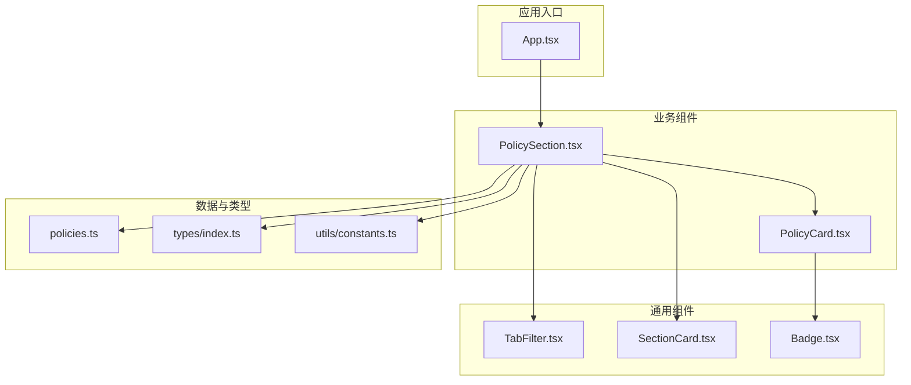

图表来源
- [App.tsx:18-59](file://src/App.tsx#L18-L59)
- [PolicySection.tsx:9-88](file://src/sections/PolicySection.tsx#L9-L88)
- [TabFilter.tsx:8-31](file://src/components/TabFilter.tsx#L8-L31)
- [SectionCard.tsx:10-25](file://src/components/SectionCard.tsx#L10-L25)
- [PolicyCard.tsx:9-67](file://src/sections/PolicyCard.tsx#L9-L67)
- [Badge.tsx:5-18](file://src/components/Badge.tsx#L5-L18)
- [policies.ts:3-344](file://src/data/policies.ts#L3-L344)
- [constants.ts:1-44](file://src/utils/constants.ts#L1-L44)
- [index.ts:2-14](file://src/types/index.ts#L2-L14)

章节来源
- [App.tsx:18-59](file://src/App.tsx#L18-L59)
- [PolicySection.tsx:9-88](file://src/sections/PolicySection.tsx#L9-L88)

## 核心组件
本模块的核心组件包括：
- PolicySection：聚合筛选器与政策卡片展示，负责筛选逻辑与状态管理
- TabFilter：通用标签式筛选组件，支持多选项切换
- PolicyCard：政策条目展示组件，包含状态徽章与替代提示
- SectionCard：业务区块容器，统一标题、副标题与图标布局
- Badge：状态徽章组件，区分有效/失效状态

章节来源
- [PolicySection.tsx:9-88](file://src/sections/PolicySection.tsx#L9-L88)
- [TabFilter.tsx:8-31](file://src/components/TabFilter.tsx#L8-L31)
- [PolicyCard.tsx:9-67](file://src/sections/PolicyCard.tsx#L9-L67)
- [SectionCard.tsx:10-25](file://src/components/SectionCard.tsx#L10-L25)
- [Badge.tsx:5-18](file://src/components/Badge.tsx#L5-L18)

## 架构总览
政策信息模块采用“数据驱动 + 组合组件”的架构模式：
- 数据源：静态政策数据集合
- 类型约束：通过类型定义确保字段一致性与可选字段处理
- 筛选链路：区域类型 -> 省份 -> 分类 -> 状态，逐级过滤
- 展示链路：筛选结果映射为PolicyCard列表，支持空态提示

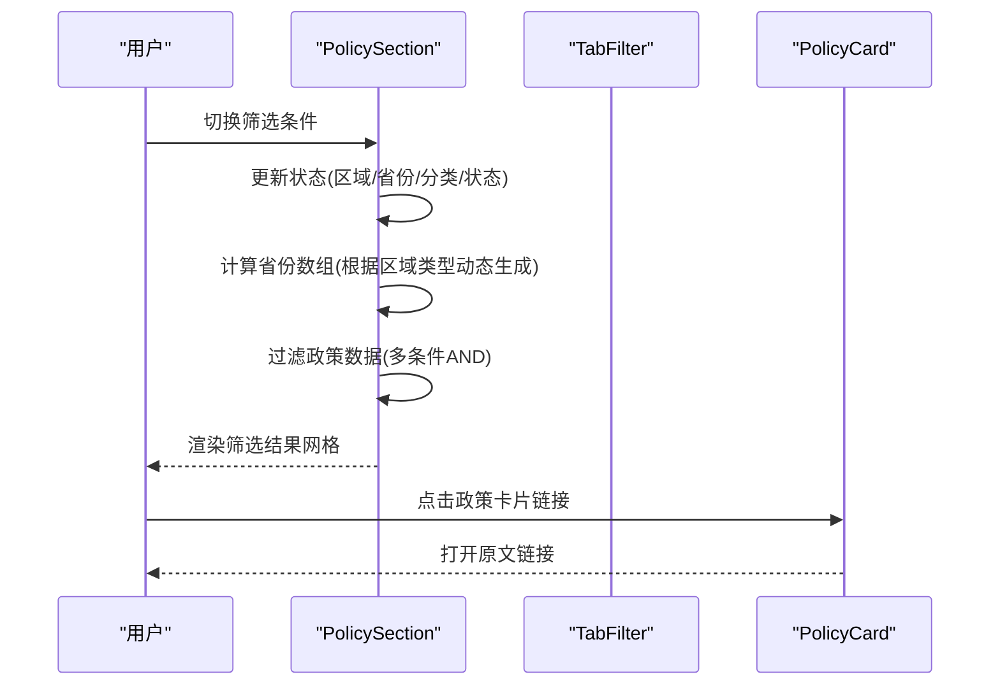

图表来源
- [PolicySection.tsx:15-34](file://src/sections/PolicySection.tsx#L15-L34)
- [TabFilter.tsx:8-31](file://src/components/TabFilter.tsx#L8-L31)
- [PolicyCard.tsx:21-49](file://src/sections/PolicyCard.tsx#L21-L49)

## 详细组件分析

### 政策数据结构设计
- 字段定义：id、title、regionType、province、category、status、publishDate、issuingAuthority、summary、sourceUrl、replacedBy（可选）
- 区域类型：national（全国）、province（省/直辖市/自治区）、city（市/自治州）
- 分类：policy（政策文件及管理办法）、methodology（方法学及编制说明）
- 状态：active（有效）、expired（已失效），配合可选的replacedBy用于替代关系表达
- 数据来源：静态数组，便于在客户端直接使用，减少网络请求开销

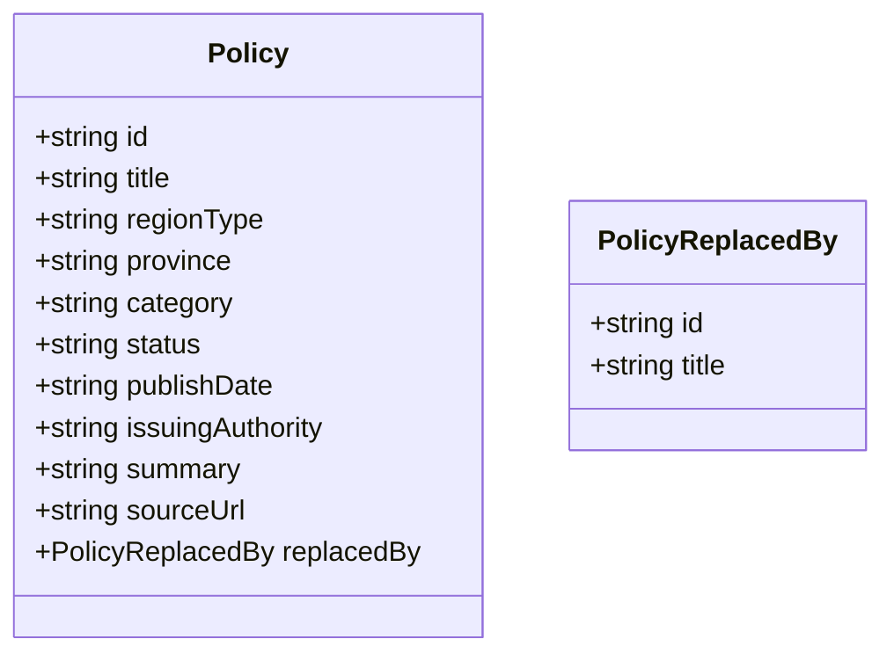

图表来源
- [index.ts:2-14](file://src/types/index.ts#L2-L14)

章节来源
- [policies.ts:3-344](file://src/data/policies.ts#L3-L344)
- [index.ts:2-14](file://src/types/index.ts#L2-L14)

### 区域类型筛选机制
- 常量定义：REGION_TYPES包含全部、全国、省和直辖市、市和自治区等选项
- 策略：当区域类型为“全部”时，省份数组包含全量省份；否则仅从匹配区域类型的政策中提取省份数组
- 动态生成：通过过滤与去重生成省份数组，确保省份数组与当前区域类型一致

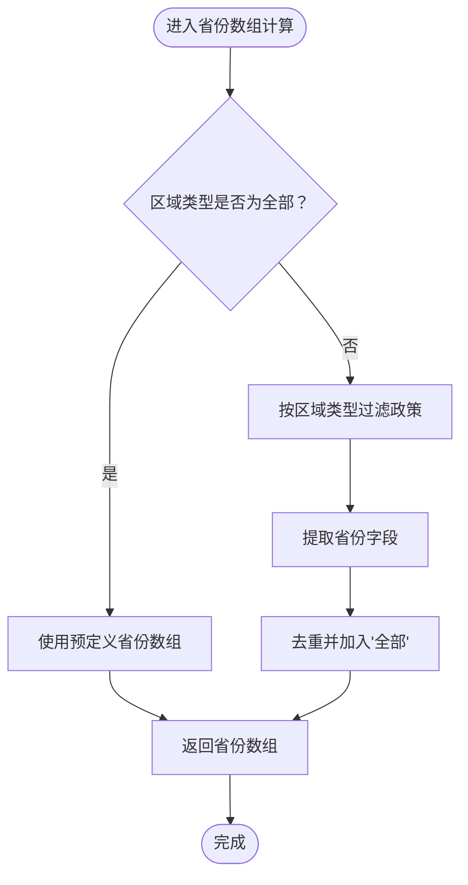

图表来源
- [PolicySection.tsx:15-24](file://src/sections/PolicySection.tsx#L15-L24)
- [constants.ts:1-6](file://src/utils/constants.ts#L1-L6)

章节来源
- [PolicySection.tsx:15-24](file://src/sections/PolicySection.tsx#L15-L24)
- [constants.ts:1-6](file://src/utils/constants.ts#L1-L6)

### 省市区县联动筛选逻辑
- 省份联动：当区域类型变化时，省份值自动重置为“全部”，避免跨区域的无效选择
- 多条件AND：最终筛选结果同时满足区域类型、省份、分类、状态四个条件
- 空态处理：当无匹配结果时显示占位提示

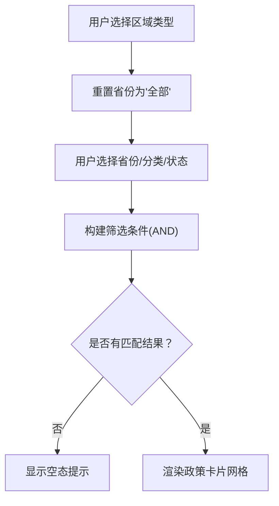

图表来源
- [PolicySection.tsx:36-39](file://src/sections/PolicySection.tsx#L36-L39)
- [PolicySection.tsx:26-34](file://src/sections/PolicySection.tsx#L26-L34)
- [PolicySection.tsx:74-85](file://src/sections/PolicySection.tsx#L74-L85)

章节来源
- [PolicySection.tsx:36-39](file://src/sections/PolicySection.tsx#L36-L39)
- [PolicySection.tsx:26-34](file://src/sections/PolicySection.tsx#L26-L34)
- [PolicySection.tsx:74-85](file://src/sections/PolicySection.tsx#L74-L85)

### 政策状态管理
- 状态枚举：POLICY_STATUS包含全部、有效、已失效
- 状态徽章：Badge组件根据状态渲染不同颜色与文案
- 替代提示：过期政策可通过replacedBy字段指向新版本，PolicyCard在卡片底部展示替代提示

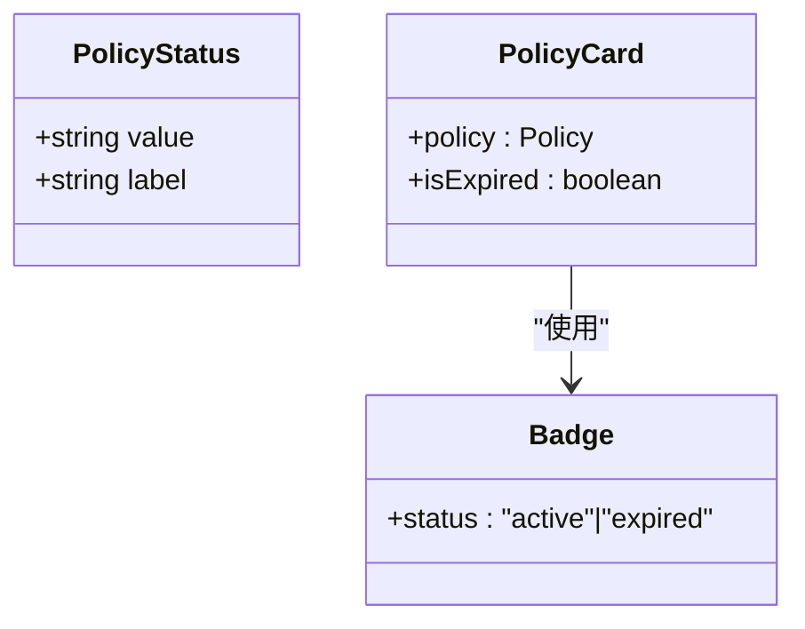

图表来源
- [constants.ts:20-24](file://src/utils/constants.ts#L20-L24)
- [Badge.tsx:5-18](file://src/components/Badge.tsx#L5-L18)
- [PolicyCard.tsx:10-64](file://src/sections/PolicyCard.tsx#L10-L64)

章节来源
- [constants.ts:20-24](file://src/utils/constants.ts#L20-L24)
- [Badge.tsx:5-18](file://src/components/Badge.tsx#L5-L18)
- [PolicyCard.tsx:10-64](file://src/sections/PolicyCard.tsx#L10-L64)

### TabFilter组件实现原理
- 输入参数：label（标签名）、tabs（选项数组）、activeValue（当前激活值）、onChange（回调）
- 渲染逻辑：左侧固定宽度标签，右侧可换行的按钮组，激活项与非激活项样式区分
- 交互行为：点击触发onChange，父组件更新对应筛选状态

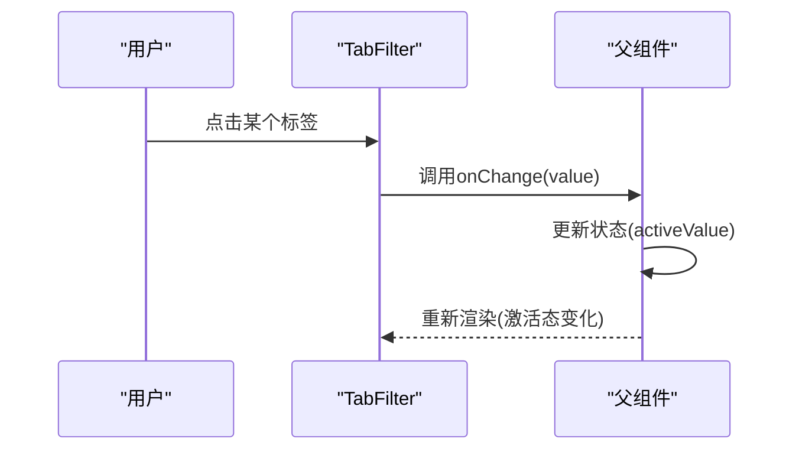

图表来源
- [TabFilter.tsx:8-31](file://src/components/TabFilter.tsx#L8-L31)

章节来源
- [TabFilter.tsx:8-31](file://src/components/TabFilter.tsx#L8-L31)

### 筛选条件组合逻辑与动态省份数组生成算法
- 筛选条件：区域类型、省份、分类、状态，均为可选或全部
- 组合策略：使用单次遍历对每条政策进行四条件AND判断，时间复杂度O(N)
- 动态省份数组：基于当前区域类型过滤政策，提取province字段并去重，再拼接“全部”作为默认选项

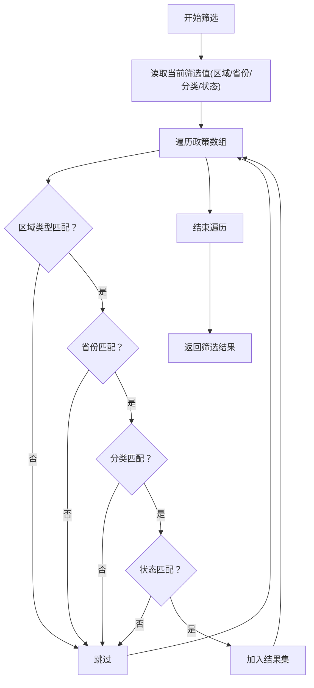

图表来源
- [PolicySection.tsx:26-34](file://src/sections/PolicySection.tsx#L26-L34)

章节来源
- [PolicySection.tsx:26-34](file://src/sections/PolicySection.tsx#L26-L34)

### PolicyCard组件展示逻辑与数据绑定
- 数据绑定：接收Policy对象，绑定到标题、摘要、发布机构、发布时间、链接等字段
- 状态展示：根据status渲染Badge徽章；过期且存在replacedBy时显示替代提示
- 用户交互：标题与“查看原文”按钮均打开外链，支持在新窗口打开并设置安全属性

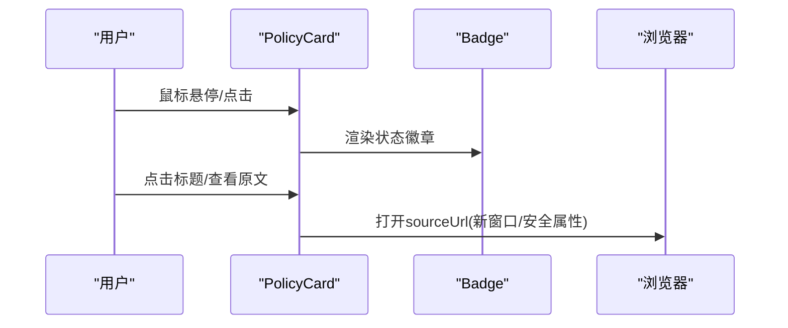

图表来源
- [PolicyCard.tsx:9-67](file://src/sections/PolicyCard.tsx#L9-L67)
- [Badge.tsx:5-18](file://src/components/Badge.tsx#L5-L18)

章节来源
- [PolicyCard.tsx:9-67](file://src/sections/PolicyCard.tsx#L9-L67)
- [Badge.tsx:5-18](file://src/components/Badge.tsx#L5-L18)

### 政策数据加载流程与状态管理策略
- 加载策略：使用静态数据文件，无需网络请求，首屏渲染快速
- 状态管理：使用React状态管理筛选条件，配合useMemo缓存省份数组与筛选结果，避免重复计算
- 性能优化：单次遍历完成筛选，useMemo减少不必要的重渲染

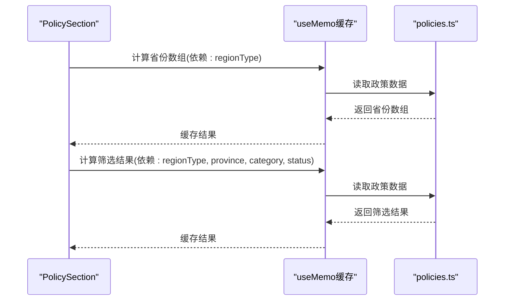

图表来源
- [PolicySection.tsx:15-24](file://src/sections/PolicySection.tsx#L15-L24)
- [PolicySection.tsx:26-34](file://src/sections/PolicySection.tsx#L26-L34)
- [policies.ts:3-344](file://src/data/policies.ts#L3-L344)

章节来源
- [PolicySection.tsx:15-24](file://src/sections/PolicySection.tsx#L15-L24)
- [PolicySection.tsx:26-34](file://src/sections/PolicySection.tsx#L26-L34)
- [policies.ts:3-344](file://src/data/policies.ts#L3-L344)

## 依赖关系分析
- PolicySection依赖TabFilter、SectionCard、PolicyCard、常量与类型定义
- PolicyCard依赖Badge与类型定义
- TabFilter为纯展示组件，无外部依赖
- SectionCard为容器组件，无业务逻辑
- Badge为纯展示组件，无外部依赖

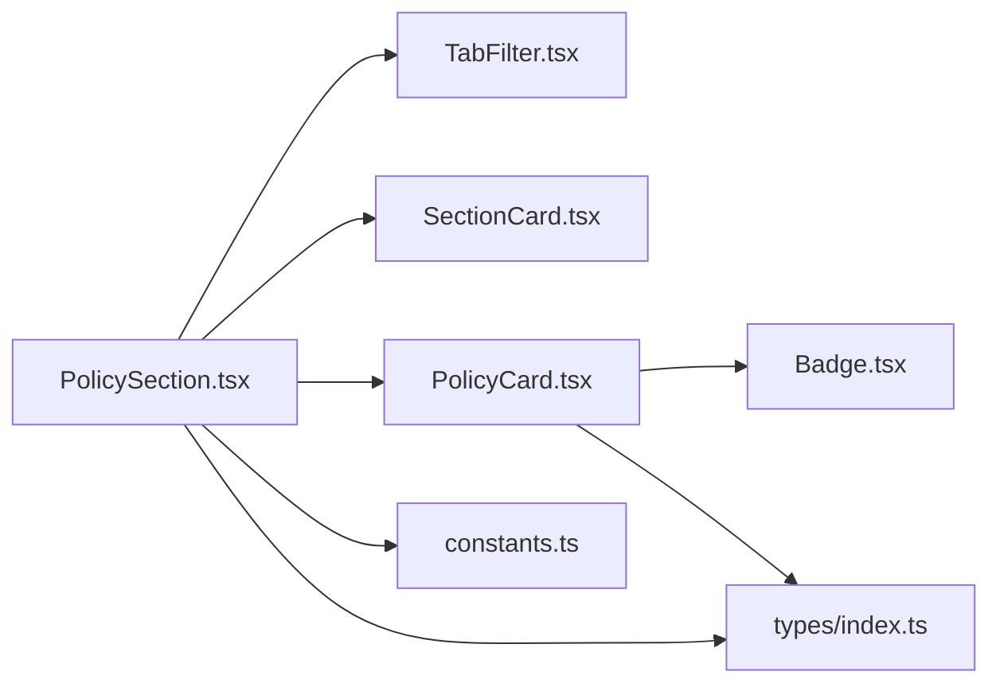

图表来源
- [PolicySection.tsx:4-8](file://src/sections/PolicySection.tsx#L4-L8)
- [PolicyCard.tsx:1-7](file://src/sections/PolicyCard.tsx#L1-L7)
- [TabFilter.tsx:1-6](file://src/components/TabFilter.tsx#L1-L6)
- [SectionCard.tsx:3-8](file://src/components/SectionCard.tsx#L3-L8)
- [Badge.tsx:1-3](file://src/components/Badge.tsx#L1-L3)
- [constants.ts:1-44](file://src/utils/constants.ts#L1-L44)
- [index.ts:2-14](file://src/types/index.ts#L2-L14)

章节来源
- [PolicySection.tsx:4-8](file://src/sections/PolicySection.tsx#L4-L8)
- [PolicyCard.tsx:1-7](file://src/sections/PolicyCard.tsx#L1-L7)
- [TabFilter.tsx:1-6](file://src/components/TabFilter.tsx#L1-L6)
- [SectionCard.tsx:3-8](file://src/components/SectionCard.tsx#L3-L8)
- [Badge.tsx:1-3](file://src/components/Badge.tsx#L1-L3)
- [constants.ts:1-44](file://src/utils/constants.ts#L1-L44)
- [index.ts:2-14](file://src/types/index.ts#L2-L14)

## 性能考虑
- 单次遍历筛选：在筛选函数中对政策数组进行一次遍历，时间复杂度O(N)，空间复杂度O(M)（M为匹配数量）
- useMemo缓存：对省份数组与筛选结果进行缓存，避免在无关状态变化时重复计算
- 静态数据：使用本地数据文件，减少网络请求与异步开销
- 按需渲染：空态时仅渲染提示，不渲染卡片列表，降低DOM节点数量
- 样式与交互：使用CSS类控制样式与过渡效果，避免复杂动画影响性能

[本节为通用性能讨论，不直接分析具体文件]

## 故障排除指南
- 省份筛选异常：检查区域类型变化后是否重置省份为“全部”
- 筛选结果为空：确认筛选条件是否过于严格，尝试将部分条件设为“全部”
- 状态徽章显示错误：确认状态值是否为“active”或“expired”，并检查Badge组件映射
- 替代提示未显示：确认过期政策是否正确设置了replacedBy字段
- 链接无法打开：确认sourceUrl格式正确，外链应使用新窗口打开并设置安全属性

章节来源
- [PolicySection.tsx:36-39](file://src/sections/PolicySection.tsx#L36-L39)
- [PolicySection.tsx:74-85](file://src/sections/PolicySection.tsx#L74-L85)
- [Badge.tsx:5-18](file://src/components/Badge.tsx#L5-L18)
- [PolicyCard.tsx:52-64](file://src/sections/PolicyCard.tsx#L52-L64)
- [PolicyCard.tsx:21-49](file://src/sections/PolicyCard.tsx#L21-L49)

## 结论
政策信息模块通过清晰的数据结构、简洁的筛选组件与高效的筛选算法，实现了区域类型、省市区县联动与多维度状态筛选。TabFilter提供一致的交互体验，PolicyCard以直观的方式呈现政策信息并支持状态与替代提示。整体架构易于扩展，具备良好的可维护性与性能表现。

[本节为总结性内容，不直接分析具体文件]

## 附录

### 筛选器扩展指南
- 新增筛选条件步骤
  1) 在状态管理中新增状态变量（例如新的筛选键）
  2) 在TabFilter中添加新的筛选器标签
  3) 在筛选逻辑中加入新条件的AND判断
  4) 如需动态生成选项，参考省份数组生成逻辑，基于现有数据派生
  5) 在空态处理中考虑新条件的影响
- 示例参考
  - 省份数组生成：[省份数组计算:15-24](file://src/sections/PolicySection.tsx#L15-L24)
  - 筛选条件组合：[筛选函数:26-34](file://src/sections/PolicySection.tsx#L26-L34)

章节来源
- [PolicySection.tsx:15-24](file://src/sections/PolicySection.tsx#L15-L24)
- [PolicySection.tsx:26-34](file://src/sections/PolicySection.tsx#L26-L34)

### 自定义展示样式实现建议
- 使用Tailwind CSS类覆盖默认样式，保持组件间的一致性
- 通过props传递样式变量（如颜色、尺寸），在组件内部进行条件渲染
- 对于复杂交互（悬停、焦点），优先使用CSS过渡与伪类，减少JavaScript干预
- 保持语义化HTML结构，确保可访问性与SEO友好

[本节为通用样式建议，不直接分析具体文件]