# 数据仪表板模块

<cite>
**本文档引用的文件**
- [src/App.tsx](file://src/App.tsx)
- [src/sections/HomeDashboard.tsx](file://src/sections/HomeDashboard.tsx)
- [src/sections/CarbonPriceSection.tsx](file://src/sections/CarbonPriceSection.tsx)
- [src/sections/PolicySection.tsx](file://src/sections/PolicySection.tsx)
- [src/sections/CalculatorSection.tsx](file://src/sections/CalculatorSection.tsx)
- [src/sections/NewsSection.tsx](file://src/sections/NewsSection.tsx)
- [src/components/SectionCard.tsx](file://src/components/SectionCard.tsx)
- [src/data/carbonPrices.ts](file://src/data/carbonPrices.ts)
- [src/data/carbonPricesLatest.ts](file://src/data/carbonPricesLatest.ts)
- [package.json](file://package.json)
</cite>

## 更新摘要
**变更内容**
- C12BI数据仪表板模块已从代码库中完全移除
- 应用程序现在提供四个核心功能模块：首页仪表盘、政策汇总、碳价汇总、碳量计算器和每日资讯
- 移除了与C12BI相关的所有权限控制和iframe集成逻辑
- 更新了应用路由和导航结构以适应新的模块布局

## 目录
1. [简介](#简介)
2. [项目结构](#项目结构)
3. [核心组件](#核心组件)
4. [架构概览](#架构概览)
5. [详细组件分析](#详细组件分析)
6. [依赖关系分析](#依赖关系分析)
7. [性能考虑](#性能考虑)
8. [故障排除指南](#故障排除指南)
9. [结论](#结论)

## 简介

数据仪表板模块是碳普惠AI智能体项目中的核心功能模块，专注于提供碳市场数据的可视化展示和分析。该模块集成了碳价趋势分析、政策法规追踪、碳排放计算等功能，为用户提供全面的碳市场信息和决策支持。

**更新** 模块经历了重大简化，C12BI数据仪表板模块已从代码库中完全移除，应用程序现在提供四个核心功能模块：首页仪表盘、政策汇总、碳价汇总、碳量计算器和每日资讯。

项目基于React + TypeScript + Vite技术栈构建，采用现代化的前端开发模式，具有良好的可维护性和扩展性。模块设计遵循组件化架构原则，通过清晰的职责分离实现了高度的模块化。

## 项目结构

数据仪表板模块采用按功能划分的目录结构，主要包含以下核心目录：

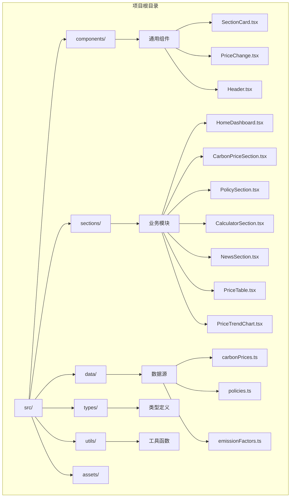

**图表来源**
- [src/App.tsx:1-101](file://src/App.tsx#L1-L101)
- [src/sections/HomeDashboard.tsx:1-218](file://src/sections/HomeDashboard.tsx#L1-L218)

**章节来源**
- [src/App.tsx:1-101](file://src/App.tsx#L1-L101)
- [package.json:1-40](file://package.json#L1-L40)

## 核心组件

数据仪表板模块的核心组件包括首页仪表盘、数据可视化组件和业务逻辑组件三大类：

### 首页仪表盘组件
- **HomeDashboard**: 主要的首页仪表盘组件，提供核心指标展示和模块导航
- **SectionCard**: 通用的卡片式布局组件，提供统一的视觉样式和内容容器

### 数据可视化组件
- **PriceTrendChart**: 碳价趋势图表组件，支持多产品对比和交互式筛选
- **PriceTable**: 碳价表格组件，提供结构化的数据展示和排序功能

### 业务逻辑组件
- **PriceChange**: 价格变化显示组件，用于直观展示价格涨跌情况
- **Header**: 应用头部导航组件，提供全局导航和品牌展示
- **PolicySection**: 政策汇总组件，提供政策法规的分类筛选和展示
- **CalculatorSection**: 碳量计算器组件，提供碳排放量的计算功能
- **NewsSection**: 每日资讯组件，提供最新的碳市场新闻和政策动态

**章节来源**
- [src/sections/HomeDashboard.tsx:1-218](file://src/sections/HomeDashboard.tsx#L1-L218)
- [src/components/SectionCard.tsx:1-26](file://src/components/SectionCard.tsx#L1-L26)
- [src/sections/PriceTrendChart.tsx:1-134](file://src/sections/PriceTrendChart.tsx#L1-L134)
- [src/sections/PriceTable.tsx:1-86](file://src/sections/PriceTable.tsx#L1-L86)
- [src/components/PriceChange.tsx:1-33](file://src/components/PriceChange.tsx#L1-L33)

## 架构概览

数据仪表板模块采用分层架构设计，实现了清晰的关注点分离：

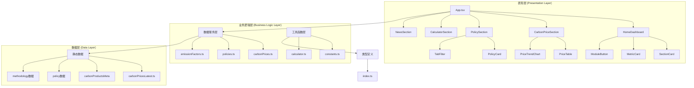

**图表来源**
- [src/App.tsx:1-101](file://src/App.tsx#L1-L101)
- [src/sections/HomeDashboard.tsx:1-218](file://src/sections/HomeDashboard.tsx#L1-L218)
- [src/data/carbonPrices.ts:1-119](file://src/data/carbonPrices.ts#L1-L119)
- [src/utils/constants.ts:1-44](file://src/utils/constants.ts#L1-L44)

### 数据流架构

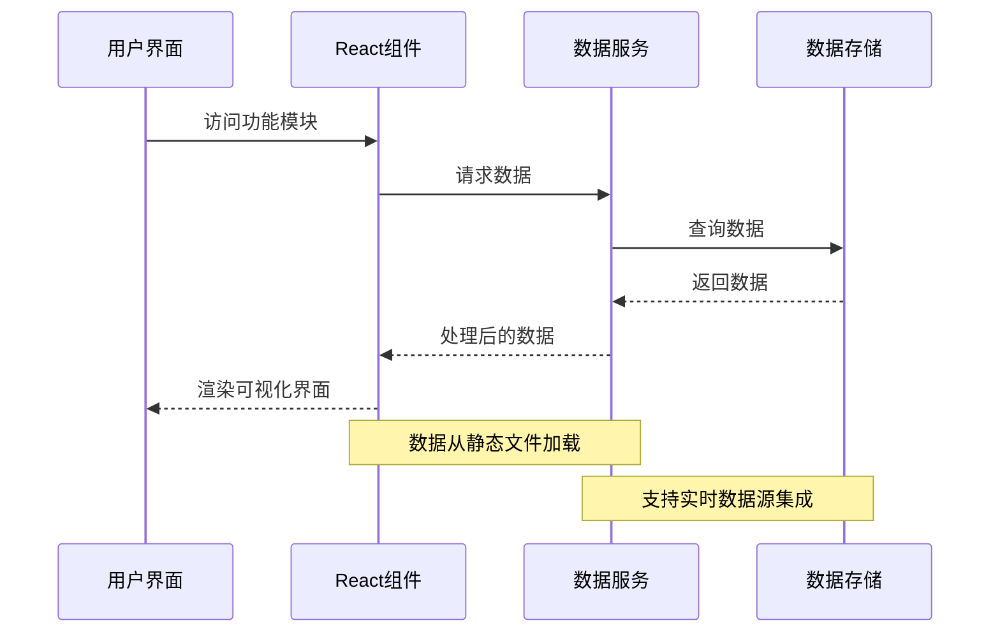

**图表来源**
- [src/sections/HomeDashboard.tsx:122-218](file://src/sections/HomeDashboard.tsx#L122-L218)
- [src/data/carbonPrices.ts:45-65](file://src/data/carbonPrices.ts#L45-L65)

## 详细组件分析

### 首页仪表盘系统

HomeDashboard组件提供了大屏风格的首页仪表盘，展示核心指标和模块导航：

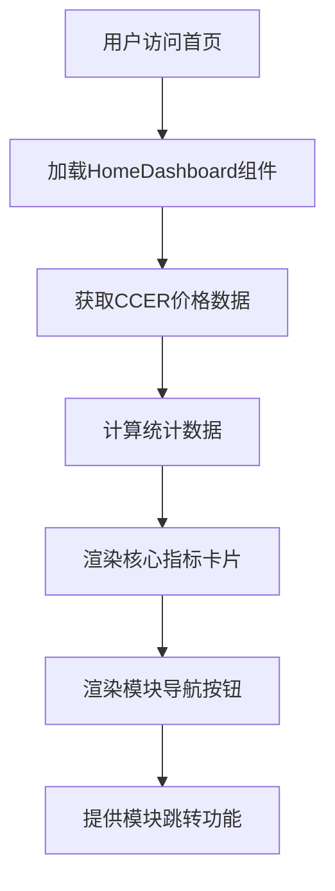

**图表来源**
- [src/sections/HomeDashboard.tsx:122-218](file://src/sections/HomeDashboard.tsx#L122-L218)

#### 核心指标展示

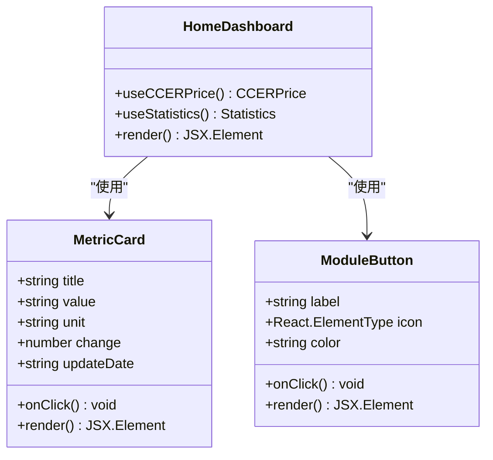

**图表来源**
- [src/sections/HomeDashboard.tsx:47-120](file://src/sections/HomeDashboard.tsx#L47-L120)
- [src/components/SectionCard.tsx:10-25](file://src/components/SectionCard.tsx#L10-L25)

**章节来源**
- [src/sections/HomeDashboard.tsx:1-218](file://src/sections/HomeDashboard.tsx#L1-L218)

### 碳价趋势分析系统

PriceTrendChart组件提供了强大的碳价趋势可视化功能：

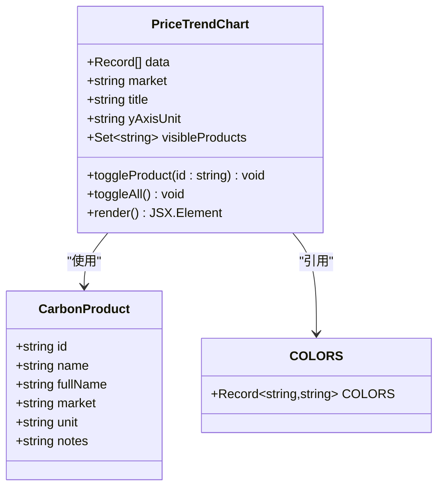

**图表来源**
- [src/sections/PriceTrendChart.tsx:24-29](file://src/sections/PriceTrendChart.tsx#L24-L29)
- [src/utils/constants.ts:26-43](file://src/utils/constants.ts#L26-L43)

#### 数据处理流程

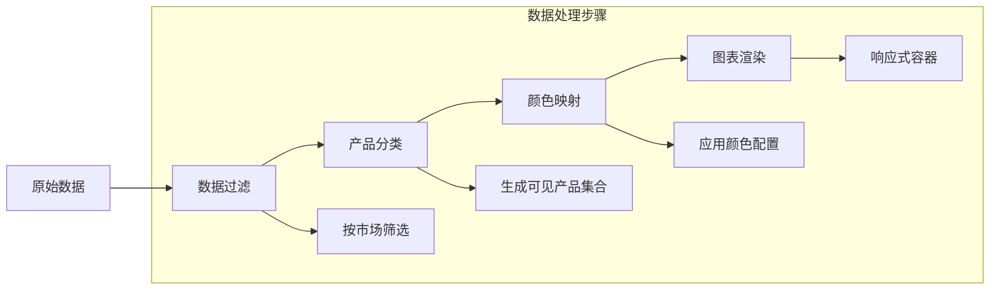

**图表来源**
- [src/sections/PriceTrendChart.tsx:31-55](file://src/sections/PriceTrendChart.tsx#L31-L55)
- [src/data/carbonPrices.ts:101-118](file://src/data/carbonPrices.ts#L101-L118)

**章节来源**
- [src/sections/PriceTrendChart.tsx:1-134](file://src/sections/PriceTrendChart.tsx#L1-L134)
- [src/data/carbonPrices.ts:1-119](file://src/data/carbonPrices.ts#L1-L119)

### 数据表格系统

PriceTable组件提供了结构化的碳价数据展示功能：

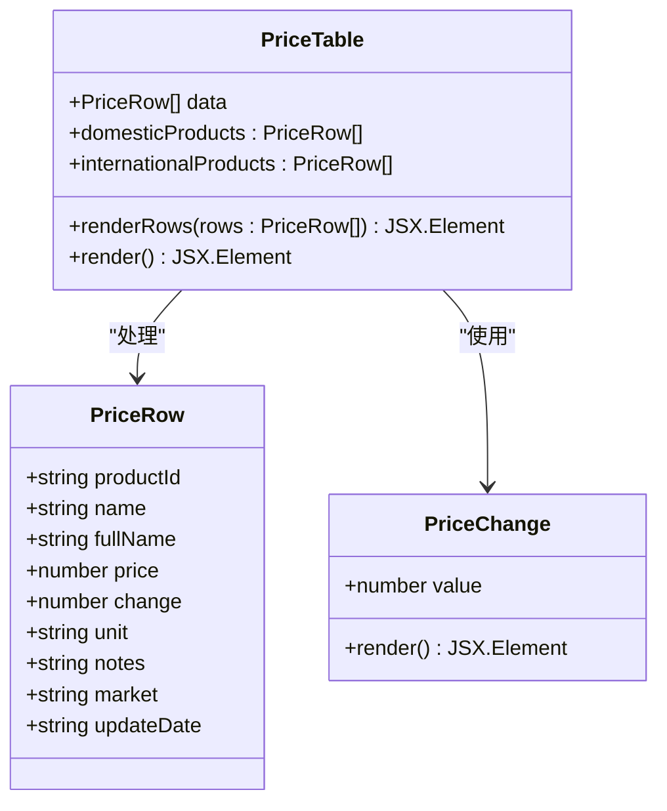

**图表来源**
- [src/sections/PriceTable.tsx:15-17](file://src/sections/PriceTable.tsx#L15-L17)
- [src/components/PriceChange.tsx:3-5](file://src/components/PriceChange.tsx#L3-L5)

#### 表格渲染逻辑

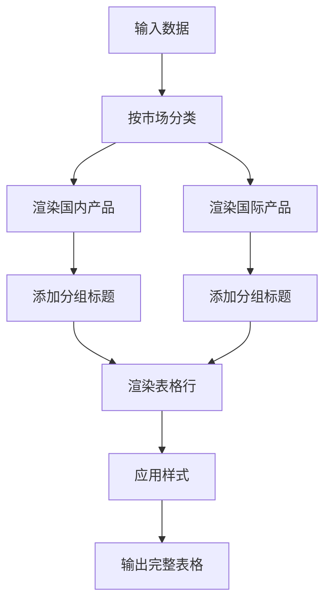

**图表来源**
- [src/sections/PriceTable.tsx:19-85](file://src/sections/PriceTable.tsx#L19-L85)

**章节来源**
- [src/sections/PriceTable.tsx:1-86](file://src/sections/PriceTable.tsx#L1-L86)
- [src/components/PriceChange.tsx:1-33](file://src/components/PriceChange.tsx#L1-L33)

### 数据模型和类型系统

系统采用严格的TypeScript类型定义确保数据完整性：

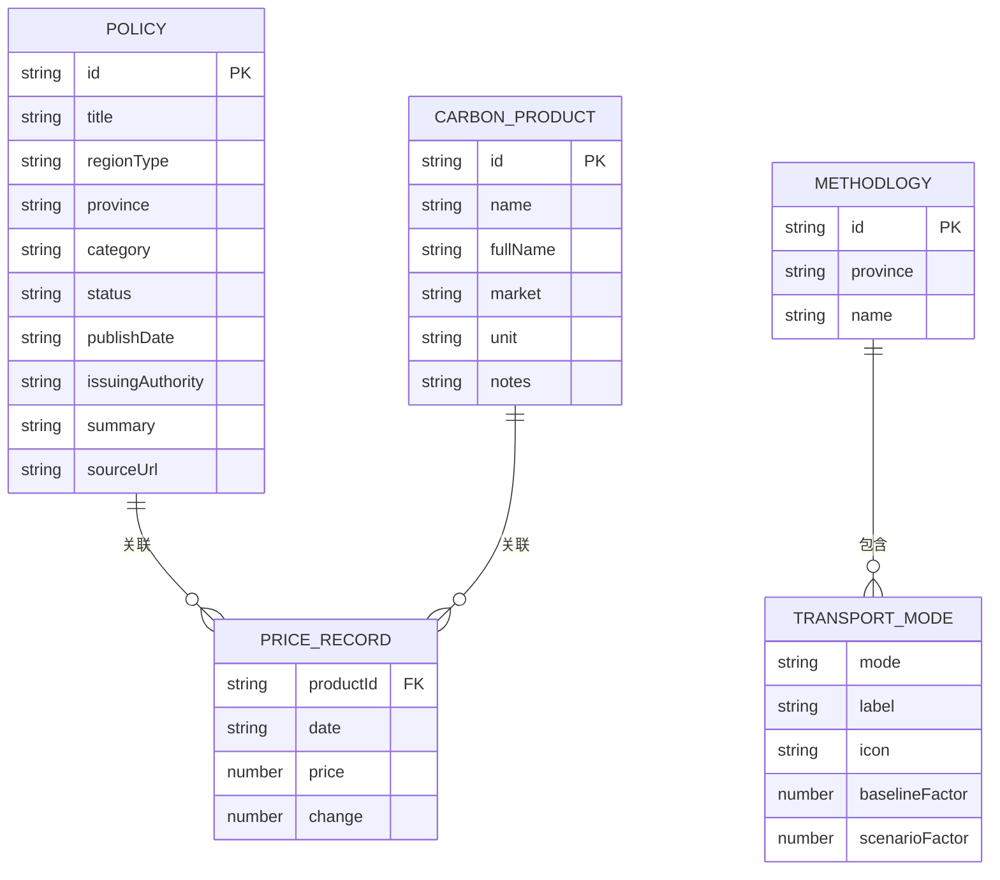

**图表来源**
- [src/types/index.ts:1-65](file://src/types/index.ts#L1-L65)

**章节来源**
- [src/types/index.ts:1-65](file://src/types/index.ts#L1-L65)
- [src/utils/constants.ts:26-43](file://src/utils/constants.ts#L26-L43)

## 依赖关系分析

数据仪表板模块的依赖关系体现了清晰的层次结构：

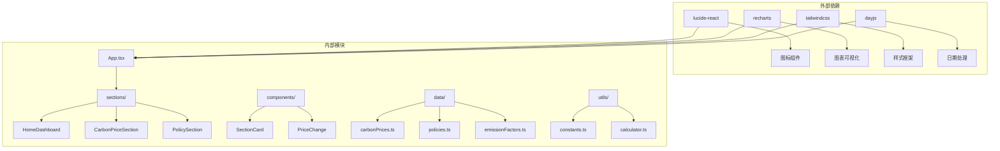

**图表来源**
- [package.json:15-22](file://package.json#L15-L22)
- [src/App.tsx:1-101](file://src/App.tsx#L1-L101)

### 数据依赖链

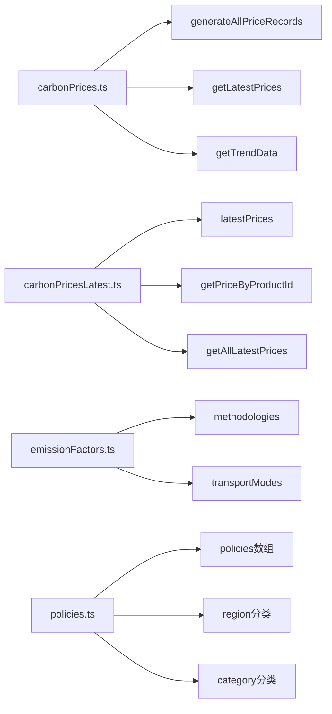

**图表来源**
- [src/data/carbonPrices.ts:45-99](file://src/data/carbonPrices.ts#L45-L99)
- [src/data/carbonPricesLatest.ts:5-39](file://src/data/carbonPricesLatest.ts#L5-L39)
- [src/data/emissionFactors.ts:3-55](file://src/data/emissionFactors.ts#L3-L55)
- [src/data/policies.ts:4-435](file://src/data/policies.ts#L4-L435)

**章节来源**
- [package.json:15-38](file://package.json#L15-L38)
- [src/data/carbonPrices.ts:1-119](file://src/data/carbonPrices.ts#L1-L119)
- [src/data/carbonPricesLatest.ts:1-39](file://src/data/carbonPricesLatest.ts#L1-L39)

## 性能考虑

数据仪表板模块在性能优化方面采用了多项策略：

### 首页仪表盘优化
- **数据预加载**: 所有核心指标数据在组件初始化时预加载，减少首次渲染等待时间
- **记忆化计算**: 使用useMemo优化昂贵的计算操作，避免重复计算
- **响应式设计**: 适配不同屏幕尺寸和设备类型，提供一致的用户体验

### 数据缓存策略
- **静态数据预加载**: 所有碳价数据在应用启动时预加载，减少运行时计算开销
- **内存缓存**: 使用JavaScript Set和Map数据结构优化数据查找性能
- **虚拟滚动**: 对于大量数据的表格组件，考虑实现虚拟滚动以提升渲染性能

### 渲染优化
- **组件懒加载**: 非关键路径的组件采用动态导入，减少初始包体积
- **状态最小化**: 仅在必要时更新组件状态，避免不必要的重渲染
- **事件防抖**: 图表交互操作采用防抖处理，提升用户体验

### 内存管理
- **垃圾回收优化**: 及时清理不再使用的事件监听器和定时器
- **数据结构优化**: 使用高效的数据结构存储和检索数据

## 故障排除指南

### 常见问题诊断

#### 首页仪表盘加载失败
**症状**: 首页无法显示或显示空白
**排查步骤**:
1. 检查carbonPrices.ts和policies.ts数据文件的可用性
2. 验证数据格式是否符合预期
3. 确认网络连接和数据源访问权限
4. 检查组件依赖关系和导入路径

#### 模块导航问题
**症状**: 用户无法在功能模块间切换
**排查步骤**:
1. 验证App.tsx中的TABS配置和导航逻辑
2. 检查各模块组件的导出和导入
3. 确认路由参数传递和状态管理
4. 验证组件的CSS样式和布局

#### 图表渲染异常
**症状**: 碳价趋势图表无法正常显示或显示错误数据
**排查步骤**:
1. 验证数据格式是否符合预期
2. 检查颜色映射配置是否正确
3. 确认响应式容器尺寸设置
4. 验证recharts库的版本兼容性

#### 数据加载超时
**症状**: 页面加载缓慢或数据请求超时
**排查步骤**:
1. 检查网络连接状态
2. 验证数据源可用性
3. 实施数据缓存策略
4. 优化组件渲染性能

**章节来源**
- [src/sections/HomeDashboard.tsx:122-218](file://src/sections/HomeDashboard.tsx#L122-L218)
- [src/sections/PriceTrendChart.tsx:93-131](file://src/sections/PriceTrendChart.tsx#L93-L131)

### 调试工具和技巧

- **React DevTools**: 使用组件检查器分析组件树和状态
- **浏览器开发者工具**: 监控网络请求和性能指标
- **日志记录**: 在关键路径添加详细的日志输出
- **单元测试**: 为核心组件编写测试用例确保功能稳定性

## 结论

数据仪表板模块作为碳普惠AI智能体的核心功能，成功实现了以下目标：

### 技术成就
- **模块化架构**: 采用清晰的组件分层设计，便于维护和扩展
- **数据可视化**: 提供直观的碳价趋势分析和政策追踪功能
- **多模块集成**: 成功整合首页仪表盘、政策汇总、碳价汇总、碳量计算器和每日资讯五大功能模块
- **类型安全**: 完整的TypeScript类型定义确保代码质量
- **响应式设计**: 适配不同设备和屏幕尺寸

### 功能特色
- **核心指标展示**: 首页仪表盘提供CCER价格、政策数量、方法学数量和已落地城市的综合展示
- **多维度数据展示**: 支持国内和国际碳市场的对比分析
- **交互式图表**: 提供灵活的产品筛选和数据探索功能
- **实时数据支持**: 预留接口支持实时数据源集成
- **模块化导航**: 清晰的功能模块划分和便捷的模块跳转

### 发展方向
- **功能扩展**: 计划集成更多碳市场数据源和分析工具
- **性能优化**: 实施更高级的缓存策略和渲染优化
- **用户体验**: 改进交互设计和移动端适配
- **数据整合**: 扩展到更广泛的环境数据和指标

**更新** 该模块的重构体现了现代Web应用的发展趋势，通过移除复杂的C12BI数据仪表板模块，应用程序变得更加简洁高效。新的模块化架构不仅减少了代码复杂度，还提升了系统的稳定性和可维护性。四个核心功能模块为用户提供了全面的碳普惠信息服务，涵盖了政策、价格、计算和资讯等关键领域。

该模块为碳普惠领域的数字化转型提供了坚实的技术基础，为用户提供了全面、准确、及时的碳市场信息服务。