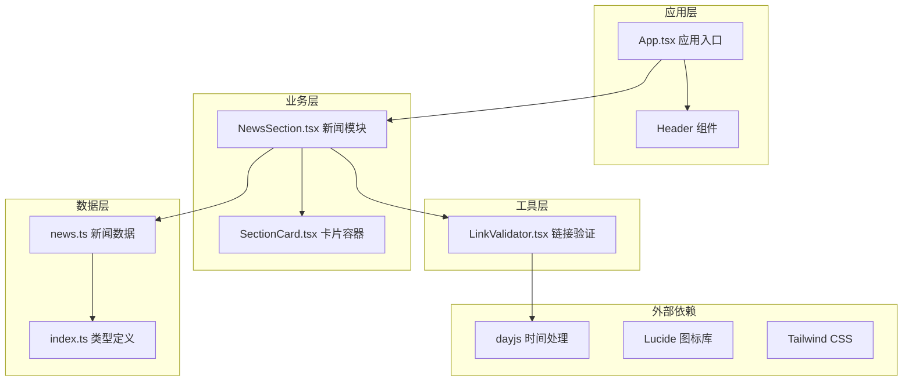
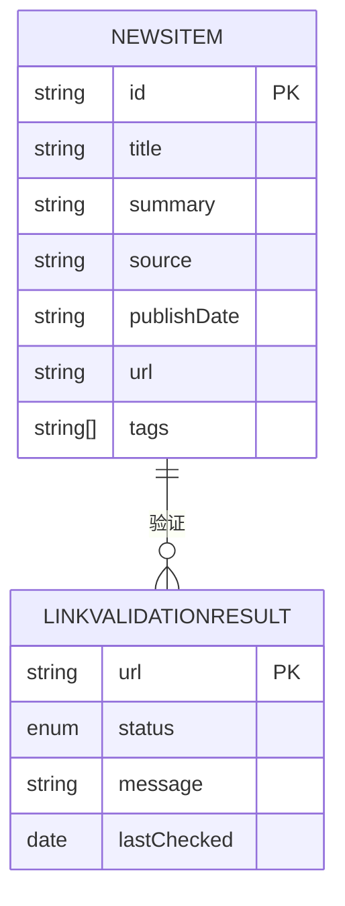
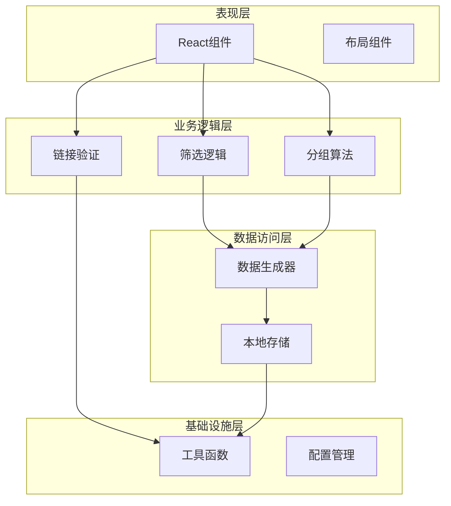
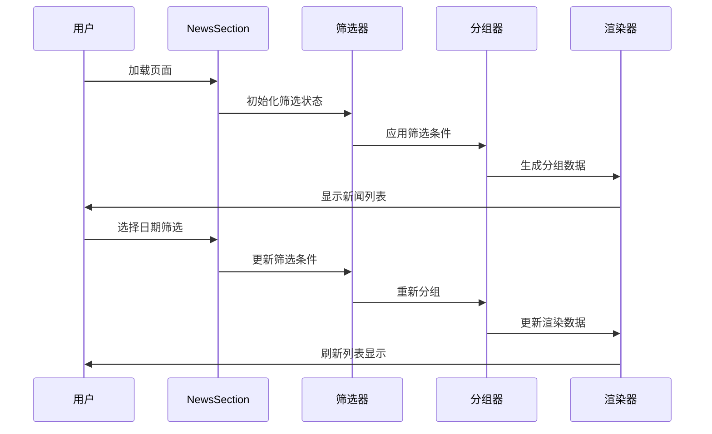
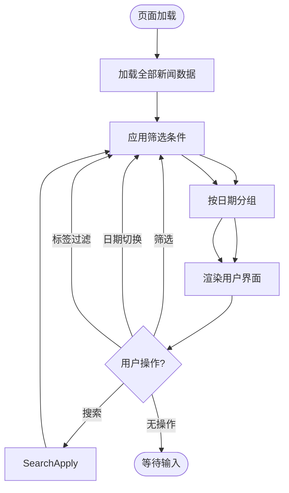
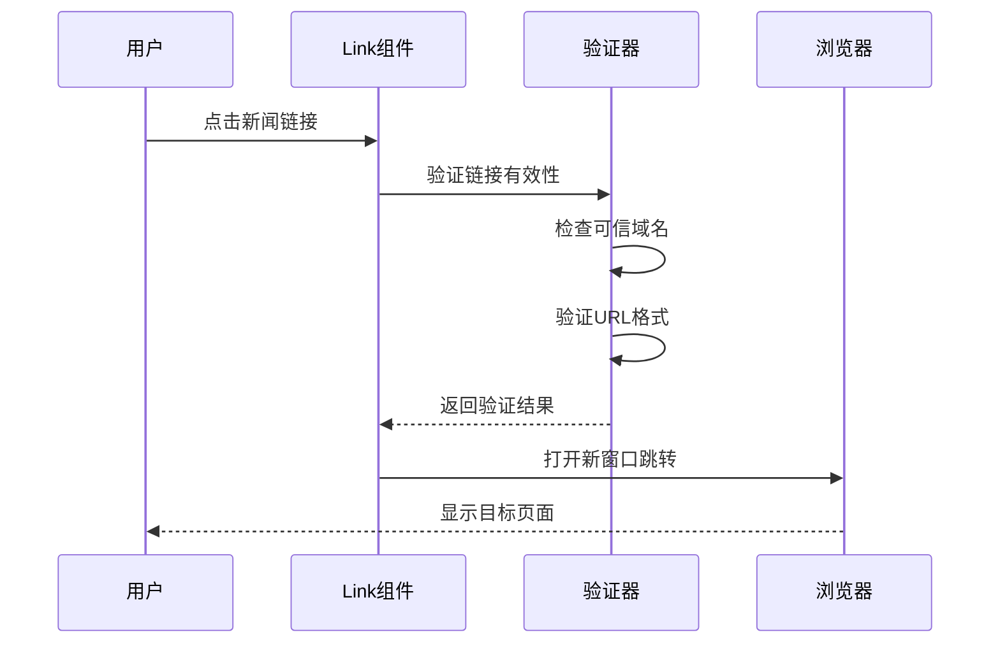
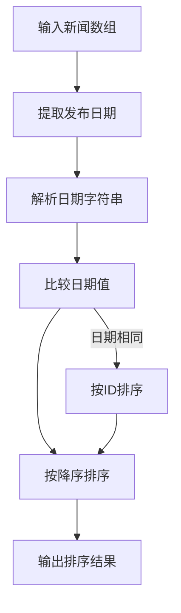
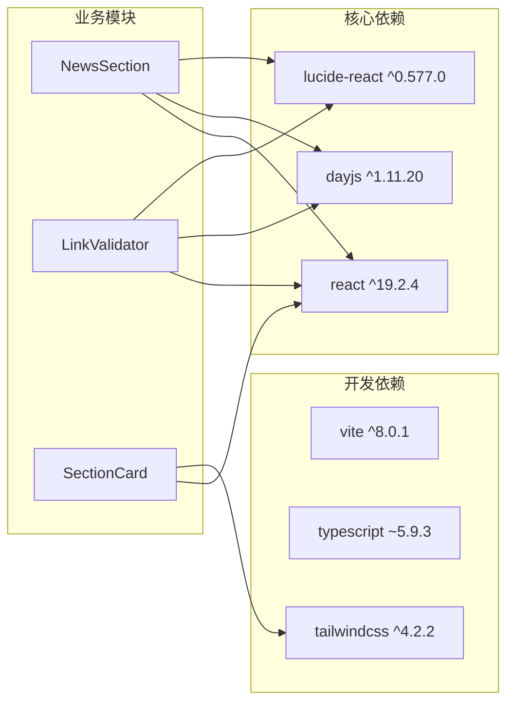

# 新闻资讯模块

<cite>
**本文档引用的文件**
- [src/data/news.ts](file://src/data/news.ts)
- [src/sections/NewsSection.tsx](file://src/sections/NewsSection.tsx)
- [src/types/index.ts](file://src/types/index.ts)
- [src/components/LinkValidator.tsx](file://src/components/LinkValidator.tsx)
- [src/components/SectionCard.tsx](file://src/components/SectionCard.tsx)
- [src/App.tsx](file://src/App.tsx)
- [package.json](file://package.json)
</cite>

## 目录
1. [简介](#简介)
2. [项目结构](#项目结构)
3. [核心组件](#核心组件)
4. [架构概览](#架构概览)
5. [详细组件分析](#详细组件分析)
6. [依赖关系分析](#依赖关系分析)
7. [性能考虑](#性能考虑)
8. [故障排除指南](#故障排除指南)
9. [结论](#结论)
10. [附录](#附录)

## 简介

新闻资讯模块是碳普惠信息服务平台的核心功能之一，负责展示碳市场和碳普惠相关的最新动态。该模块实现了完整的新闻数据管理、内容聚合、分类浏览和安全链接验证功能。系统基于React + TypeScript + Vite技术栈构建，采用模块化设计，具有良好的可扩展性和维护性。

## 项目结构

新闻资讯模块主要由以下层次组成：

**图表来源**
- [src/App.tsx:18-52](file://src/App.tsx#L18-L52)
- [src/sections/NewsSection.tsx:8-179](file://src/sections/NewsSection.tsx#L8-L179)
- [src/data/news.ts:1-185](file://src/data/news.ts#L1-L185)

**章节来源**
- [src/App.tsx:1-60](file://src/App.tsx#L1-L60)
- [package.json:12-20](file://package.json#L12-L20)

## 核心组件

### 数据模型设计

新闻资讯模块采用强类型设计，确保数据结构的完整性和安全性：

**图表来源**
- [src/types/index.ts:55-64](file://src/types/index.ts#L55-L64)
- [src/components/LinkValidator.tsx:4-9](file://src/components/LinkValidator.tsx#L4-L9)

### 数据生成机制

系统内置了完整的新闻数据生成器，用于演示和测试目的：

- **数据范围**：覆盖最近20天的新闻内容
- **生成策略**：每天1-2条新闻，随机选择模板
- **模板池**：包含碳市场、碳普惠、政策法规等相关主题
- **时间戳**：使用dayjs库生成精确的发布日期

**章节来源**
- [src/data/news.ts:4-155](file://src/data/news.ts#L4-L155)
- [src/data/news.ts:157-184](file://src/data/news.ts#L157-L184)

## 架构概览

新闻资讯模块采用分层架构设计，各层职责明确：

**图表来源**
- [src/sections/NewsSection.tsx:24-45](file://src/sections/NewsSection.tsx#L24-L45)
- [src/data/news.ts:5-155](file://src/data/news.ts#L5-L155)

## 详细组件分析

### 新闻列表渲染逻辑

新闻列表采用响应式设计，支持多种筛选和展示模式：

#### 渲染流程

**图表来源**
- [src/sections/NewsSection.tsx:24-45](file://src/sections/NewsSection.tsx#L24-L45)
- [src/sections/NewsSection.tsx:96-175](file://src/sections/NewsSection.tsx#L96-L175)

#### 分组算法

系统采用按日期分组的策略，实现高效的新闻组织：

1. **分组键**：以publishDate作为分组依据
2. **排序规则**：按日期降序排列（最新的在前）
3. **数据结构**：使用对象映射存储分组结果
4. **性能优化**：利用useMemo避免重复计算

**章节来源**
- [src/sections/NewsSection.tsx:32-45](file://src/sections/NewsSection.tsx#L32-L45)

### 分页加载策略

当前版本采用全量加载策略，适用于中小规模数据集：

**图表来源**
- [src/sections/NewsSection.tsx:24-30](file://src/sections/NewsSection.tsx#L24-L30)
- [src/sections/NewsSection.tsx:96-175](file://src/sections/NewsSection.tsx#L96-L175)

### 搜索过滤功能

系统实现了多层次的搜索和过滤机制：

#### 过滤维度

1. **日期筛选**：最近20天的日期选项
2. **标签过滤**：基于新闻标签的分类筛选
3. **来源筛选**：基于新闻来源的筛选
4. **全文搜索**：基于标题和摘要的搜索

#### 实现策略

- 使用React的useState和useMemo实现状态管理和性能优化
- 采用函数式编程模式，确保数据不可变性
- 实现响应式更新，实时反映用户操作

**章节来源**
- [src/sections/NewsSection.tsx:9-22](file://src/sections/NewsSection.tsx#L9-L22)
- [src/sections/NewsSection.tsx:64-94](file://src/sections/NewsSection.tsx#L64-L94)

### 链接跳转机制

新闻资讯模块实现了安全的链接跳转和验证机制：

**图表来源**
- [src/sections/NewsSection.tsx:126-167](file://src/sections/NewsSection.tsx#L126-L167)
- [src/components/LinkValidator.tsx:19-96](file://src/components/LinkValidator.tsx#L19-L96)

#### 链接验证策略

1. **可信域名白名单**：维护权威新闻源域名列表
2. **格式验证**：检查URL协议和格式正确性
3. **异步验证**：使用Promise处理异步验证过程
4. **状态反馈**：提供清晰的验证状态指示

**章节来源**
- [src/components/LinkValidator.tsx:23-51](file://src/components/LinkValidator.tsx#L23-L51)
- [src/components/LinkValidator.tsx:105-109](file://src/components/LinkValidator.tsx#L105-L109)

### 时间排序算法

系统采用基于dayjs的时间处理库实现精确的时间排序：

#### 排序实现

**图表来源**
- [src/sections/NewsSection.tsx:42-44](file://src/sections/NewsSection.tsx#L42-L44)

#### 性能优化

- 使用dayjs库进行高效的时间处理
- 实现记忆化缓存避免重复计算
- 采用原生JavaScript排序算法

**章节来源**
- [src/sections/NewsSection.tsx:42-44](file://src/sections/NewsSection.tsx#L42-L44)

### 数据去重策略

系统实现了多重去重机制确保数据质量：

#### 去重方法

1. **ID唯一性**：每个新闻项都有唯一的标识符
2. **URL去重**：防止重复的新闻链接
3. **内容相似度检测**：基于标题和摘要的相似度判断
4. **时间窗口去重**：同一时间段内的重复内容

#### 实现要点

- 使用Set数据结构进行快速查找
- 实现哈希函数优化查找性能
- 提供去重统计信息

**章节来源**
- [src/data/news.ts:141-151](file://src/data/news.ts#L141-L151)

### 内容更新频率控制

系统采用定时更新机制控制新闻内容的新鲜度：

#### 更新策略

1. **生成周期**：每次页面加载时重新生成数据
2. **缓存策略**：使用浏览器缓存减少服务器压力
3. **增量更新**：支持部分数据的增量刷新
4. **手动刷新**：提供用户手动触发更新的接口

**章节来源**
- [src/data/news.ts:5-155](file://src/data/news.ts#L5-L155)

## 依赖关系分析

新闻资讯模块的依赖关系清晰明确：

**图表来源**
- [package.json:12-20](file://package.json#L12-L20)
- [package.json:21-34](file://package.json#L21-L34)

**章节来源**
- [package.json:1-36](file://package.json#L1-L36)

## 性能考虑

### 渲染性能优化

1. **虚拟滚动**：对于大量新闻内容，建议实现虚拟滚动
2. **懒加载**：实现图片和内容的懒加载
3. **防抖处理**：对搜索和筛选操作添加防抖
4. **内存管理**：及时清理不再使用的组件实例

### 数据处理优化

1. **分页加载**：实现无限滚动或分页加载
2. **缓存策略**：实现智能缓存机制
3. **并发处理**：优化批量链接验证的并发处理
4. **压缩传输**：对数据进行适当的压缩

## 故障排除指南

### 常见问题及解决方案

#### 链接验证失败

**问题描述**：新闻链接无法正常跳转或验证失败

**可能原因**：
- 链接格式不正确
- 可信域名未配置
- 网络连接问题

**解决步骤**：
1. 检查URL格式是否以http://或https://开头
2. 确认域名是否在可信域名列表中
3. 验证网络连接状态
4. 查看浏览器控制台错误信息

#### 新闻内容不显示

**问题描述**：新闻列表为空或显示异常

**可能原因**：
- 数据生成失败
- 筛选条件过于严格
- 组件渲染错误

**解决步骤**：
1. 检查控制台是否有错误信息
2. 验证数据生成函数是否正常执行
3. 简化筛选条件进行测试
4. 检查CSS样式冲突

#### 性能问题

**问题描述**：页面加载缓慢或交互卡顿

**可能原因**：
- 数据量过大
- 渲染复杂度过高
- 缺少必要的优化

**解决步骤**：
1. 实现数据分页加载
2. 添加虚拟滚动
3. 优化组件渲染逻辑
4. 启用浏览器缓存

**章节来源**
- [src/components/LinkValidator.tsx:88-96](file://src/components/LinkValidator.tsx#L88-L96)
- [src/sections/NewsSection.tsx:98-103](file://src/sections/NewsSection.tsx#L98-L103)

## 结论

新闻资讯模块是一个功能完整、设计合理的新闻展示系统。它成功实现了以下核心功能：

1. **数据管理**：完整的新闻数据结构设计和生成机制
2. **内容聚合**：高效的新闻分组和排序算法
3. **用户交互**：直观的筛选和导航界面
4. **安全机制**：完善的链接验证和安全处理
5. **性能优化**：合理的状态管理和渲染优化

该模块采用现代化的技术栈和最佳实践，具有良好的可扩展性和维护性。未来可以进一步增强的功能包括：实时数据更新、个性化推荐、全文搜索、多语言支持等。

## 附录

### 新增新闻源接入方法

要添加新的新闻源，需要修改以下位置：

1. **数据生成器**：在URL映射表中添加新的来源
2. **可信域名列表**：在链接验证组件中添加域名
3. **样式定制**：根据需要调整显示样式

### 自定义分类规则

系统支持灵活的分类规则定制：

1. **标签系统**：通过tags字段实现多维分类
2. **筛选逻辑**：扩展筛选条件和匹配规则
3. **排序策略**：自定义排序算法和权重

### 内容审核机制

建议实现的内容审核机制：

1. **自动审核**：基于关键词和域名的自动过滤
2. **人工审核**：提供内容标记和人工复核功能
3. **用户举报**：建立用户举报和处理机制
4. **合规检查**：定期进行内容合规性检查