# 碳价格监控模块

<cite>
**本文档引用的文件**
- [carbonPricesLatest.ts](file://src/data/carbonPricesLatest.ts)
- [carbonPrices.ts](file://src/data/carbonPrices.ts)
- [CarbonPriceSection.tsx](file://src/sections/CarbonPriceSection.tsx)
- [PriceTrendChart.tsx](file://src/sections/PriceTrendChart.tsx)
- [PriceTable.tsx](file://src/sections/PriceTable.tsx)
- [HomeDashboard.tsx](file://src/sections/HomeDashboard.tsx)
- [index.ts](file://src/types/index.ts)
- [constants.ts](file://src/utils/constants.ts)
- [PriceChange.tsx](file://src/components/PriceChange.tsx)
- [App.tsx](file://src/App.tsx)
- [package.json](file://package.json)
- [baiduSearchCrawler.ts](file://scripts/crawler/baiduSearchCrawler.ts)
- [carbonPriceCrawler.ts](file://scripts/crawler/carbonPriceCrawler.ts)
- [index.ts](file://scripts/crawler/index.ts)
- [baseCrawler.ts](file://scripts/crawler/baseCrawler.ts)
- [updateData.ts](file://scripts/updateData.ts)
- [autoUpdate.ts](file://scripts/autoUpdate.ts)
- [daily-update.yml](file://.github/workflows/daily-update.yml)
- [daily-report.yml](file://.github/workflows/daily-report.yml)
- [sendDingTalk.ts](file://scripts/sendDingTalk.ts)
</cite>

## 更新摘要
**变更内容**
- 新增PriceRecord类型定义导入，增强类型安全性
- 增加CARBON_PRODUCTS_META常量，统一产品元数据管理
- 集成dayjs日期处理库，提供精确的日期计算和格式化
- 更新碳价数据模型，支持最新的价格波动（CEA从79.5降至78.9，CCER从98降至95.8，BEA从80升至106）
- 增强数据更新机制，支持实时价格获取和更新日期跟踪
- 优化图表组件，支持更灵活的产品选择和显示控制

## 目录
1. [简介](#简介)
2. [项目结构](#项目结构)
3. [核心组件](#核心组件)
4. [架构概览](#架构概览)
5. [详细组件分析](#详细组件分析)
6. [自动化更新系统](#自动化更新系统)
7. [依赖关系分析](#依赖关系分析)
8. [性能考虑](#性能考虑)
9. [故障排除指南](#故障排除指南)
10. [结论](#结论)
11. [附录](#附录)

## 简介

碳价格监控模块是碳普惠信息服务平台的核心功能之一，负责展示和分析碳排放权交易市场的价格数据。该模块提供了实时价格监控、历史趋势分析、多维度价格对比等功能，帮助用户全面了解碳市场价格动态。

**重大更新** 系统现已集成全新的自动化更新系统，通过GitHub Actions实现每日自动更新碳市场数据。模块引入了增强的数据模型设计，包括PriceRecord类型定义、CARBON_PRODUCTS_META常量和dayjs日期处理，显著提升了数据管理和可视化能力。系统支持最新的碳价数据（CEA从79.5降至78.9，CCER从98降至95.8，BEA从80升至106），并提供了更精确的更新日期跟踪功能。

本模块采用React + TypeScript + Vite技术栈构建，使用Recharts进行数据可视化，实现了从数据生成、处理到可视化的完整闭环。系统支持国内和国际两个市场的碳产品价格监控，并提供了丰富的交互功能。

## 项目结构

碳价格监控模块遵循功能导向的组织方式，主要由以下层次构成：

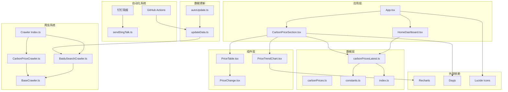

**图表来源**
- [App.tsx:18-59](file://src/App.tsx#L18-L59)
- [CarbonPriceSection.tsx:1-42](file://src/sections/CarbonPriceSection.tsx#L1-L42)
- [HomeDashboard.tsx:1-218](file://src/sections/HomeDashboard.tsx#L1-L218)
- [carbonPricesLatest.ts:1-43](file://src/data/carbonPricesLatest.ts#L1-L43)
- [carbonPrices.ts:1-119](file://src/data/carbonPrices.ts#L1-L119)
- [baiduSearchCrawler.ts:1-110](file://scripts/crawler/baiduSearchCrawler.ts#L1-L110)
- [carbonPriceCrawler.ts:1-166](file://scripts/crawler/carbonPriceCrawler.ts#L1-L166)
- [baseCrawler.ts:1-65](file://scripts/crawler/baseCrawler.ts#L1-L65)
- [index.ts:1-58](file://scripts/crawler/index.ts#L1-L58)
- [updateData.ts:1-305](file://scripts/updateData.ts#L1-L305)
- [autoUpdate.ts:1-53](file://scripts/autoUpdate.ts#L1-L53)
- [daily-update.yml:1-54](file://.github/workflows/daily-update.yml#L1-L54)
- [daily-report.yml:1-40](file://.github/workflows/daily-report.yml#L1-L40)
- [sendDingTalk.ts:1-61](file://scripts/sendDingTalk.ts#L1-L61)

**章节来源**
- [App.tsx:1-60](file://src/App.tsx#L1-L60)
- [package.json:12-19](file://package.json#L12-L19)

## 核心组件

### 数据模型设计

碳价格监控模块采用增强的数据模型设计，确保了类型安全性和代码可维护性：

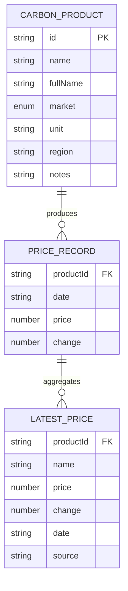

**图表来源**
- [index.ts:17-37](file://src/types/index.ts#L17-L37)
- [constants.ts:26-43](file://src/utils/constants.ts#L26-L43)
- [carbonPricesLatest.ts:8-39](file://src/data/carbonPricesLatest.ts#L8-L39)

### 碳产品元数据管理

系统通过统一的CARBON_PRODUCTS_META常量维护所有碳产品的基本信息：

| 产品ID | 名称 | 市场类型 | 单位 | 地区 |
|--------|------|----------|------|------|
| CCER | CCER | 国内 | 元/吨 | 全国 |
| CEA | CEA | 国内 | 元/吨 | 全国 |
| PHCER | PHCER | 国内 | 元/吨 | 福建/广东等 |
| PCER | PCER | 国内 | 元/吨 | 北京 |
| CQCER | CQCER | 国内 | 元/吨 | 重庆 |
| GDCER | 广东CER | 国内 | 元/吨 | 广东 |
| VCS | VCS | 国际 | 美元/吨 | 国际 |
| CDM | CDM | 国际 | 美元/吨 | 国际/即将关闭 |

**章节来源**
- [constants.ts:26-43](file://src/utils/constants.ts#L26-L43)
- [index.ts:17-25](file://src/types/index.ts#L17-L25)

### 实时价格数据管理

**更新** 系统现在使用增强的carbonPricesLatest.ts文件管理实时碳价格数据，提供基于百度搜索的真实价格信息，并集成了dayjs日期处理。

#### 实时价格数据结构

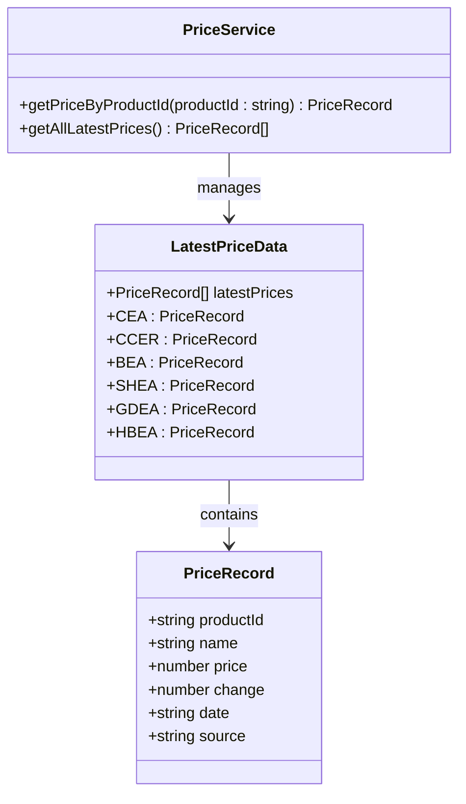

**图表来源**
- [carbonPricesLatest.ts:8-39](file://src/data/carbonPricesLatest.ts#L8-L39)

#### 支持的碳产品列表

系统支持以下6个主要碳产品类别的实时价格监控：

| 产品ID | 产品名称 | 搜索查询关键词 | 数据来源 |
|--------|----------|----------------|----------|
| CEA | 全国碳市场CEA | "全国碳市场CEA价格 今日" | 百度搜索 |
| CCER | CCER | "CCER价格 今日 全国温室气体自愿减排" | 百度搜索 |
| BEA | 北京碳配额BEA | "北京碳市场BEA价格 今日" | 百度搜索 |
| SHEA | 上海碳配额SHEA | "上海碳市场SHEA价格 今日" | 百度搜索 |
| GDEA | 广东碳配额GDEA | "广东碳市场GDEA价格 今日" | 百度搜索 |
| HBEA | 湖北碳配额HBEA | "湖北碳市场HBEA价格 今日" | 百度搜索 |

**章节来源**
- [carbonPricesLatest.ts:29-36](file://src/data/carbonPricesLatest.ts#L29-L36)

### 更新日期跟踪系统

**更新** 系统现在支持精确的碳价格更新日期跟踪，为每个碳产品提供价格来源日期信息。

#### 更新日期数据结构

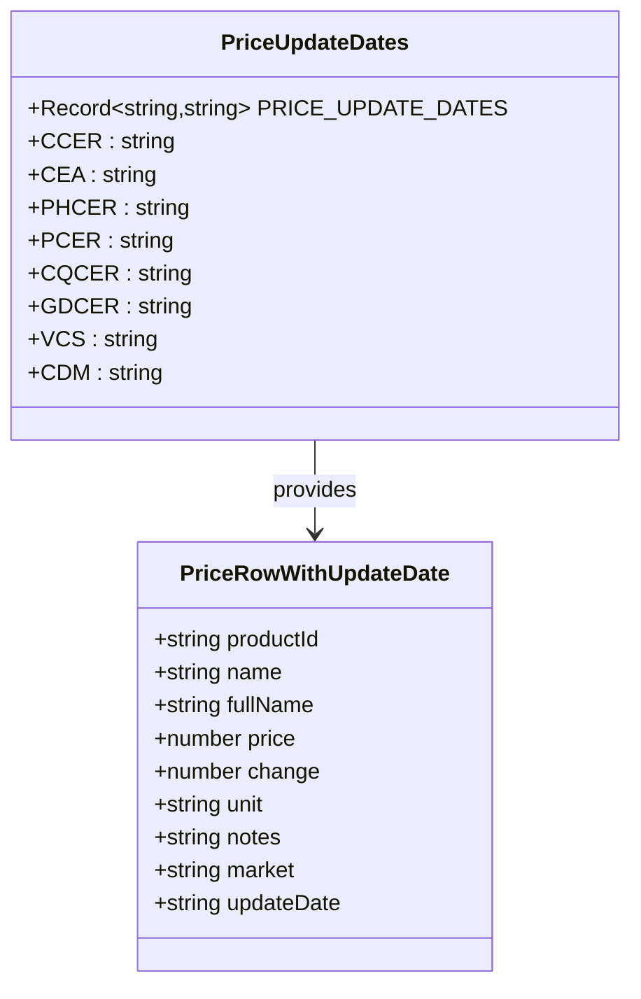

**图表来源**
- [carbonPrices.ts:30-40](file://src/data/carbonPrices.ts#L30-L40)
- [carbonPrices.ts:67-99](file://src/data/carbonPrices.ts#L67-L99)

#### 更新日期配置

| 产品ID | 更新日期 | 说明 |
|--------|----------|------|
| CCER | 2024-12 | 全国CCER买入价格预期 |
| CEA | 2025-03 | 全国碳市场CEA价格 |
| PHCER | 2024-11 | 北京PHCER价格 |
| PCER | 2024-10 | 上海PCER价格 |
| CQCER | 2024-09 | 重庆CQCER价格 |
| GDCER | 2024-12 | 广东GDCER价格 |
| VCS | 2025-01 | 国际VCS价格 |
| CDM | 2024-08 | 国际CDM价格 |

**章节来源**
- [carbonPrices.ts:30-40](file://src/data/carbonPrices.ts#L30-L40)

## 架构概览

碳价格监控模块采用增强的分层架构设计，实现了关注点分离和模块化：

```mermaid
graph TD
subgraph "用户界面层"
UI[用户界面]
Table[价格表格]
Chart[趋势图表]
Dashboard[首页仪表盘]
end
subgraph "业务逻辑层"
DataLayer[数据层]
CalcLayer[计算层]
FilterLayer[过滤层]
UpdateTracker[更新日期跟踪]
CrawlerLayer[爬虫层]
end
subgraph "数据持久层"
RealTimeData[实时价格数据]
HistoricalData[历史价格数据]
Cache[缓存机制]
end
subgraph "自动化系统层"
DailyUpdate[GitHub Actions]
DailyReport[钉钉简报]
SendDingTalk[sendDingTalk.ts]
end
subgraph "爬虫系统层"
BaiduSearch[BaiduSearchCrawler]
CarbonPrice[CarbonPriceCrawler]
BaseCrawler[BaseCrawler]
CrawlIndex[Crawler Index]
end
subgraph "外部服务层"
API[数据源]
Market[市场数据]
Search[百度搜索]
End
UI --> Table
UI --> Chart
UI --> Dashboard
Table --> DataLayer
Chart --> DataLayer
Dashboard --> RealTimeData
DataLayer --> CalcLayer
DataLayer --> FilterLayer
DataLayer --> UpdateTracker
CalcLayer --> RealTimeData
FilterLayer --> HistoricalData
UpdateTracker --> HistoricalData
RealTimeData --> Cache
Cache --> BaiduSearch
Cache --> CarbonPrice
BaiduSearch --> Search
CarbonPrice --> Market
CrawlIndex --> BaiduSearch
CrawlIndex --> CarbonPrice
DailyUpdate --> UpdateData
DailyReport --> SendDingTalk
```

**图表来源**
- [CarbonPriceSection.tsx:8-41](file://src/sections/CarbonPriceSection.tsx#L8-L41)
- [HomeDashboard.tsx:157-188](file://src/sections/HomeDashboard.tsx#L157-L188)
- [carbonPricesLatest.ts:61-67](file://src/data/carbonPricesLatest.ts#L61-L67)
- [baiduSearchCrawler.ts:17-37](file://scripts/crawler/baiduSearchCrawler.ts#L17-L37)
- [carbonPriceCrawler.ts:24-33](file://scripts/crawler/carbonPriceCrawler.ts#L24-L33)
- [baseCrawler.ts:16-29](file://scripts/crawler/baseCrawler.ts#L16-L29)
- [daily-update.yml:10-44](file://.github/workflows/daily-update.yml#L10-L44)
- [daily-report.yml:10-39](file://.github/workflows/daily-report.yml#L10-L39)

### 数据流处理

系统采用增强的函数式编程模式处理数据流：

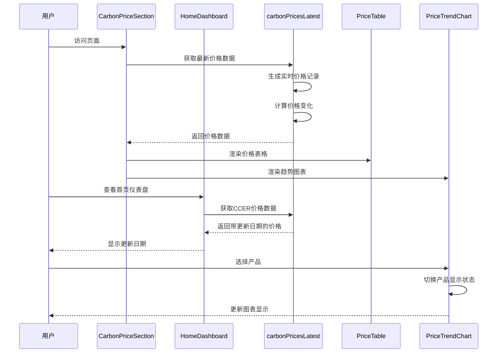

**图表来源**
- [CarbonPriceSection.tsx:9-11](file://src/sections/CarbonPriceSection.tsx#L9-L11)
- [HomeDashboard.tsx:16-22](file://src/sections/HomeDashboard.tsx#L16-L22)
- [carbonPricesLatest.ts:61-67](file://src/data/carbonPricesLatest.ts#L61-L67)
- [PriceTrendChart.tsx:37-55](file://src/sections/PriceTrendChart.tsx#L37-L55)

**章节来源**
- [CarbonPriceSection.tsx:1-42](file://src/sections/CarbonPriceSection.tsx#L1-L42)
- [HomeDashboard.tsx:1-218](file://src/sections/HomeDashboard.tsx#L1-L218)
- [carbonPricesLatest.ts:1-43](file://src/data/carbonPricesLatest.ts#L1-L43)

## 详细组件分析

### PriceTrendChart 组件

PriceTrendChart 是碳价格监控模块的核心可视化组件，负责展示碳价格的历史趋势数据。

#### 图表实现架构

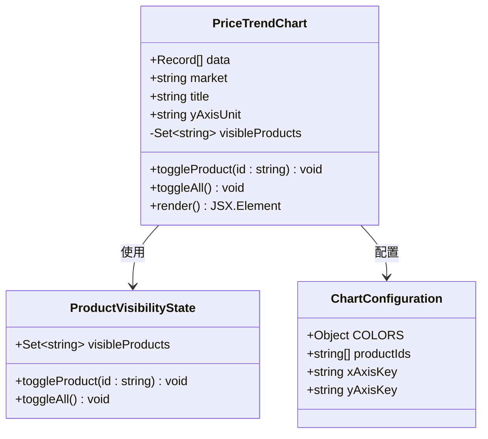

**图表来源**
- [PriceTrendChart.tsx:24-55](file://src/sections/PriceTrendChart.tsx#L24-L55)
- [constants.ts:13-22](file://src/utils/constants.ts#L13-L22)

#### 数据可视化策略

组件采用响应式设计，支持多种交互功能：

1. **产品选择器**：用户可以通过复选框控制显示的产品
2. **全选功能**：一键切换所有产品的显示状态
3. **颜色编码**：每种碳产品使用独特的颜色标识
4. **网格线**：提供辅助线增强可读性
5. **工具提示**：显示详细的数值信息

#### 交互功能实现

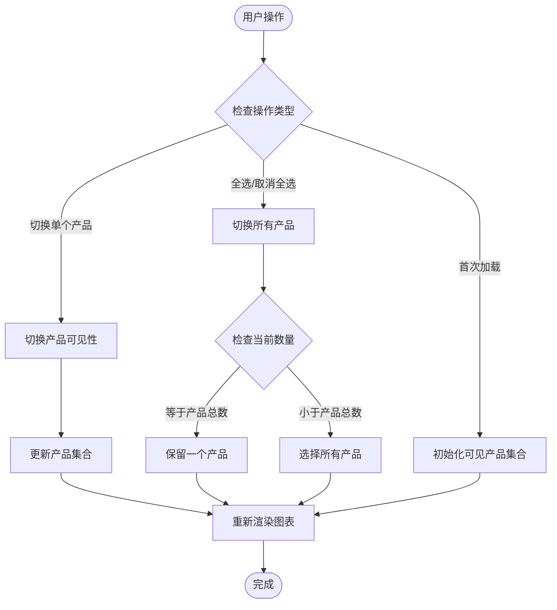

**图表来源**
- [PriceTrendChart.tsx:37-55](file://src/sections/PriceTrendChart.tsx#L37-L55)

**章节来源**
- [PriceTrendChart.tsx:1-134](file://src/sections/PriceTrendChart.tsx#L1-L134)
- [constants.ts:13-22](file://src/utils/constants.ts#L13-L22)

### PriceTable 组件

PriceTable 负责展示最新的碳价格数据，提供清晰的价格对比视图。

#### 表格渲染机制

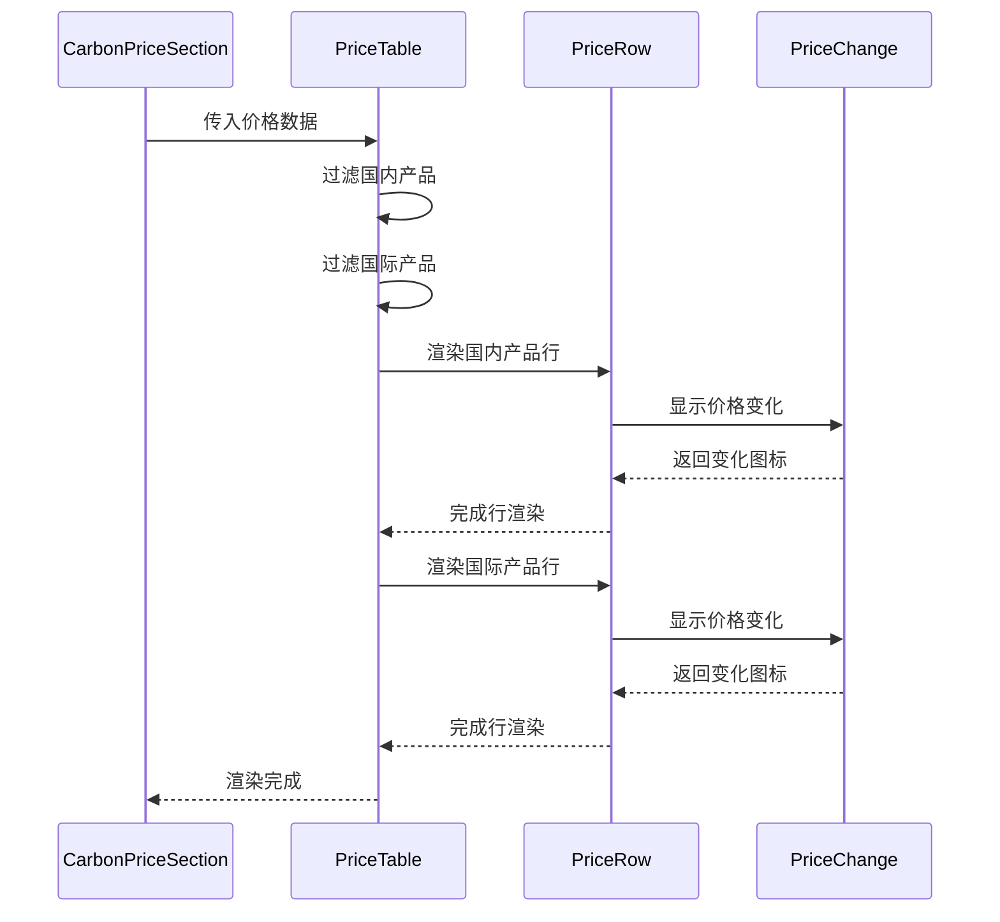

**图表来源**
- [PriceTable.tsx:18-41](file://src/sections/PriceTable.tsx#L18-L41)
- [PriceChange.tsx:7-32](file://src/components/PriceChange.tsx#L7-L32)

#### 排序机制

组件实现了智能的分组排序功能：

1. **按市场分类**：国内产品和国际产品分别显示
2. **固定分组标题**：每个分组都有清晰的标题标识
3. **悬停效果**：提供视觉反馈增强用户体验

#### 筛选逻辑

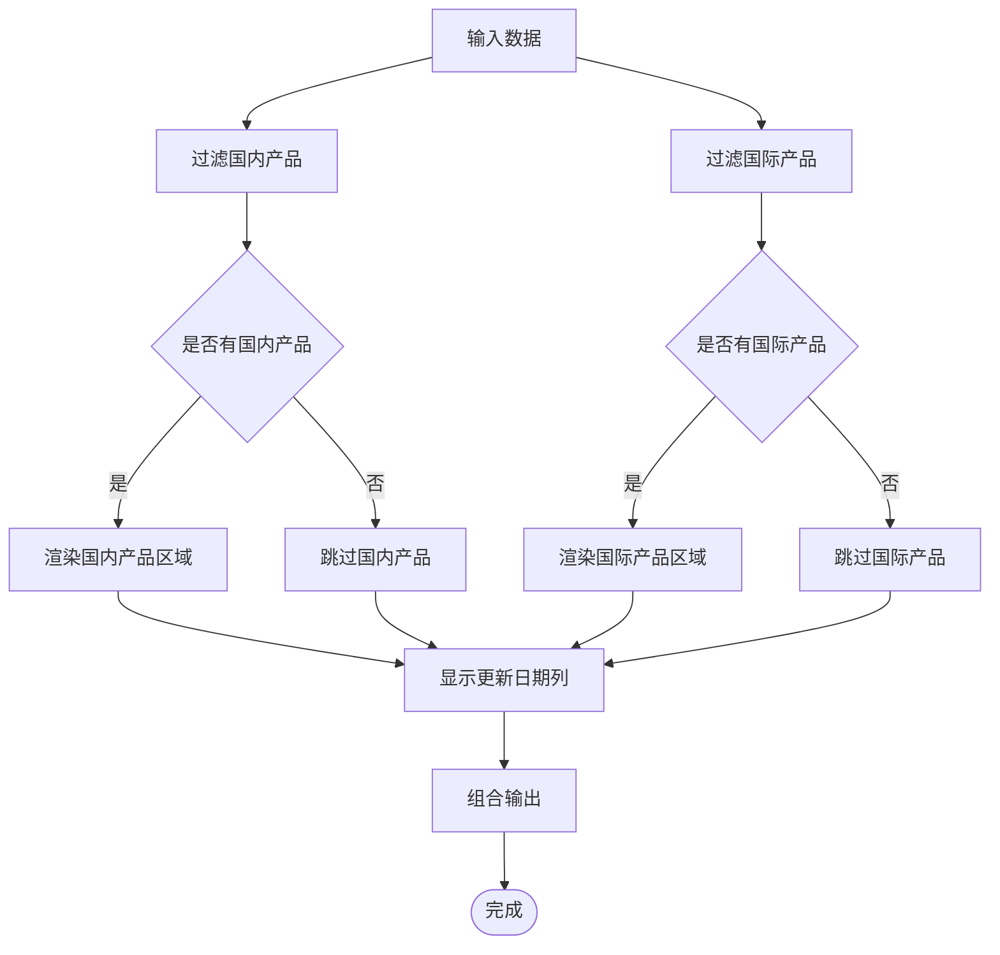

**图表来源**
- [PriceTable.tsx:19-20](file://src/sections/PriceTable.tsx#L19-L20)

#### 更新日期显示功能

**更新** 价格表格现在包含更新日期列，为用户提供价格时效性信息。

**章节来源**
- [PriceTable.tsx:1-86](file://src/sections/PriceTable.tsx#L1-L86)
- [PriceChange.tsx:1-33](file://src/components/PriceChange.tsx#L1-L33)

### HomeDashboard 组件

**更新** 首页仪表盘现在集成了增强的更新日期显示功能，为CCER价格指标提供精确的更新时间信息。

#### 指标卡片设计

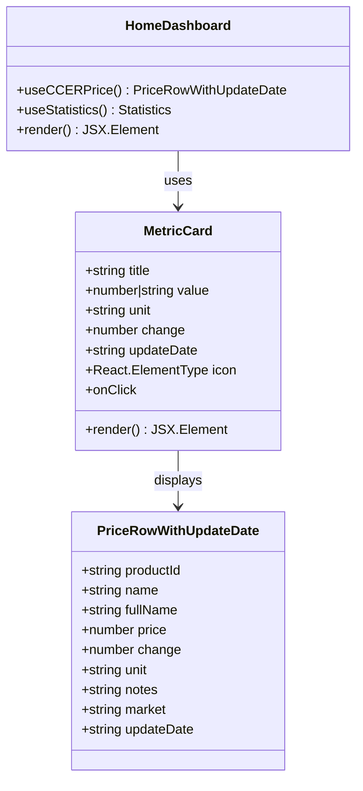

**图表来源**
- [HomeDashboard.tsx:47-95](file://src/sections/HomeDashboard.tsx#L47-L95)
- [HomeDashboard.tsx:15-22](file://src/sections/HomeDashboard.tsx#L15-L22)

#### 更新日期集成

指标卡片现在支持显示更新日期，为用户提供价格数据的时效性信息：

1. **CCER价格指标**：显示今日CCER价格及其更新日期
2. **变化趋势**：在涨跌百分比旁边显示更新日期
3. **样式设计**：更新日期以半透明文本形式显示

**章节来源**
- [HomeDashboard.tsx:1-218](file://src/sections/HomeDashboard.tsx#L1-L218)

### 价格趋势分析算法

#### 价格历史生成算法

系统使用增强的伪随机数生成器模拟真实的市场价格波动：

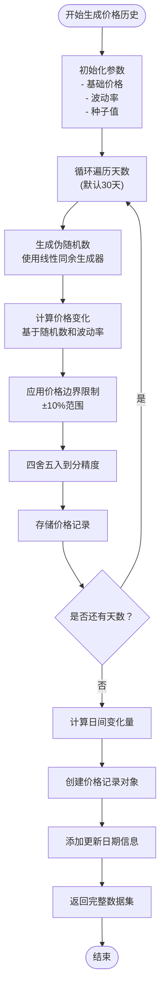

**图表来源**
- [carbonPrices.ts:5-17](file://src/data/carbonPrices.ts#L5-L17)
- [carbonPrices.ts:33-53](file://src/data/carbonPrices.ts#L33-L53)

#### 价格波动分析

系统实现了增强的价格变化分析功能：

| 指标 | 计算方法 | 用途 |
|------|----------|------|
| 日变化量 | 当前价格 - 前一日价格 | 分析短期波动 |
| 累计变化 | 最终价格 - 初始价格 | 分析长期趋势 |
| 波动幅度 | 最高价格 - 最低价格 | 评估市场稳定性 |
| 平均价格 | 所有价格的平均值 | 基准参考值 |

**章节来源**
- [carbonPrices.ts:5-17](file://src/data/carbonPrices.ts#L5-L17)
- [carbonPrices.ts:33-53](file://src/data/carbonPrices.ts#L33-L53)

### 多维度价格对比功能

#### 数据聚合策略

系统支持按市场类型进行数据聚合：

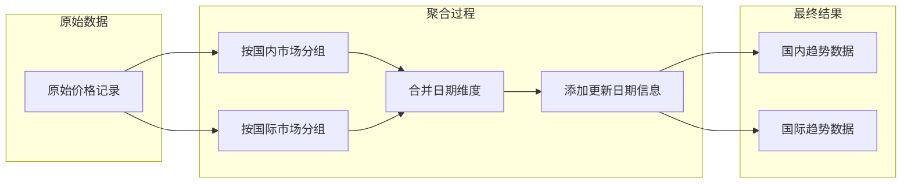

**图表来源**
- [carbonPrices.ts:85-102](file://src/data/carbonPrices.ts#L85-L102)

#### 产品对比矩阵

系统为不同市场类型提供了专门的对比矩阵：

| 市场类型 | 支持的产品 | 特殊属性 |
|----------|------------|----------|
| 国内市场 | CCER, CEA, PHCER, PCER, CQCER, GDCER | 支持地区细分 |
| 国际市场 | VCS, CDM | 支持美元计价 |

**章节来源**
- [carbonPrices.ts:85-102](file://src/data/carbonPrices.ts#L85-L102)
- [constants.ts:34-43](file://src/utils/constants.ts#L34-L43)

## 自动化更新系统

### GitHub Actions自动化更新

**新增** 系统现已集成GitHub Actions自动化更新系统，实现每日自动更新碳市场数据。

#### Daily Update工作流

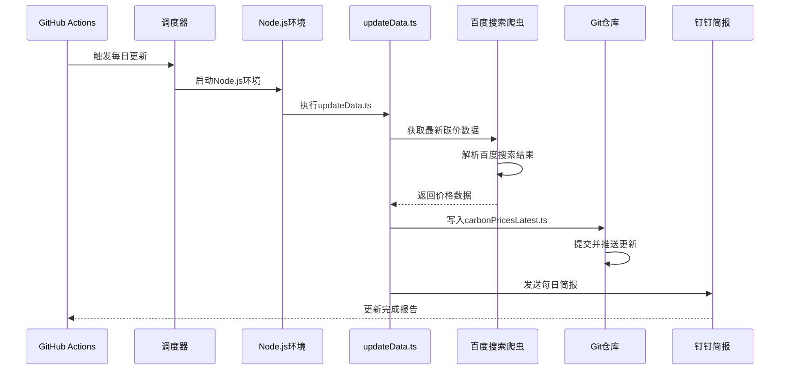

**图表来源**
- [daily-update.yml:10-44](file://.github/workflows/daily-update.yml#L10-L44)
- [updateData.ts:227-277](file://scripts/updateData.ts#L227-L277)
- [sendDingTalk.ts:48-55](file://scripts/sendDingTalk.ts#L48-L55)

#### 工作流配置参数

| 参数 | 值 | 说明 |
|------|-----|------|
| 触发时间 | UTC 21:00 | 北京时间 5:00 |
| 运行环境 | ubuntu-latest | Linux虚拟机 |
| Node.js版本 | 20 | LTS版本 |
| 权限设置 | contents: write | 允许写入仓库 |
| 重试机制 | 失败自动重试 | 确保更新可靠性 |

#### 数据更新流程

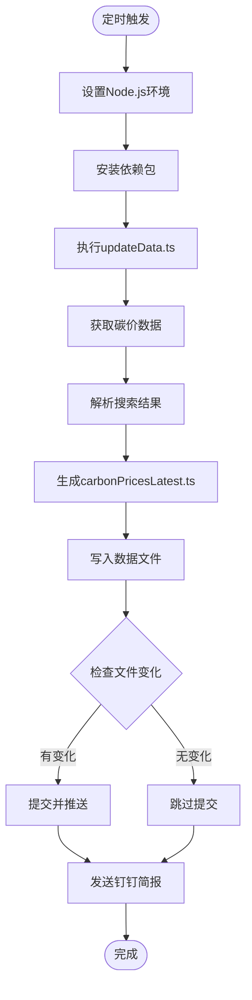

**图表来源**
- [daily-update.yml:33-44](file://.github/workflows/daily-update.yml#L33-L44)
- [updateData.ts:227-277](file://scripts/updateData.ts#L227-L277)

### 钉钉机器人每日简报

**新增** 系统集成了钉钉机器人每日简报功能，为团队提供及时的市场数据更新通知。

#### Daily Report工作流

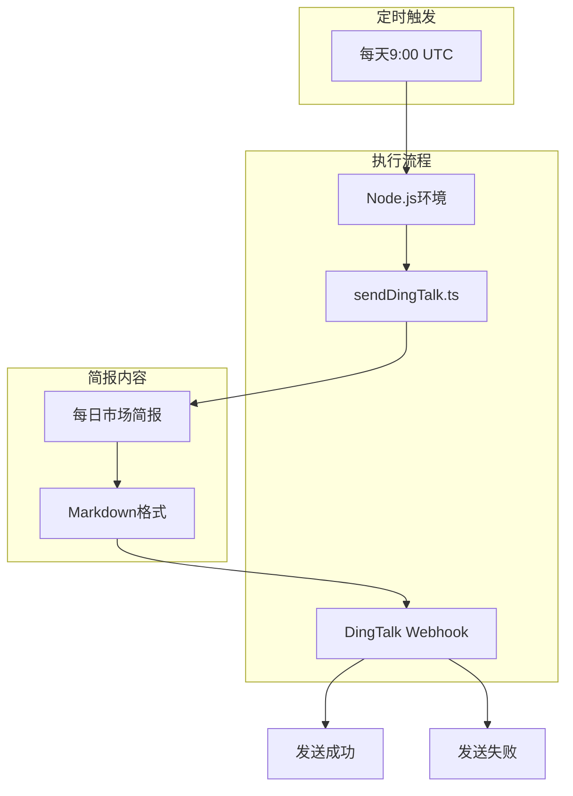

**图表来源**
- [daily-report.yml:10-39](file://.github/workflows/daily-report.yml#L10-L39)
- [sendDingTalk.ts:14-43](file://scripts/sendDingTalk.ts#L14-L43)

#### 简报发送机制

系统在每天北京时间9:00自动发送简报，包含以下信息：

1. **数据更新状态**：当日碳价数据更新情况
2. **价格变动摘要**：主要碳产品的价格变化
3. **系统健康状态**：自动化更新执行结果
4. **链接直达**：访问在线平台的链接

#### 配置要求

| 配置项 | 默认值 | 说明 |
|--------|--------|------|
| Webhook地址 | 内置默认值 | 钉钉群机器人Webhook |
| 触发时间 | UTC 01:00 | 北京时间 9:00 |
| 环境变量 | DINGTALK_WEBHOOK | 可替换为自定义Webhook |
| 网站链接 | https://carbonhub.netlify.app | 在线平台地址 |

**章节来源**
- [daily-update.yml:1-54](file://.github/workflows/daily-update.yml#L1-L54)
- [daily-report.yml:1-40](file://.github/workflows/daily-report.yml#L1-L40)
- [sendDingTalk.ts:1-61](file://scripts/sendDingTalk.ts#L1-L61)

## 依赖关系分析

### 外部依赖管理

碳价格监控模块依赖以下关键外部库：

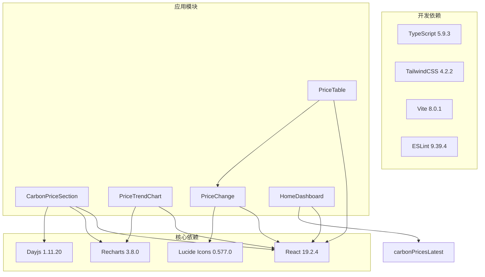

**图表来源**
- [package.json:12-19](file://package.json#L12-L19)
- [package.json:21-34](file://package.json#L21-L34)

### 内部模块依赖

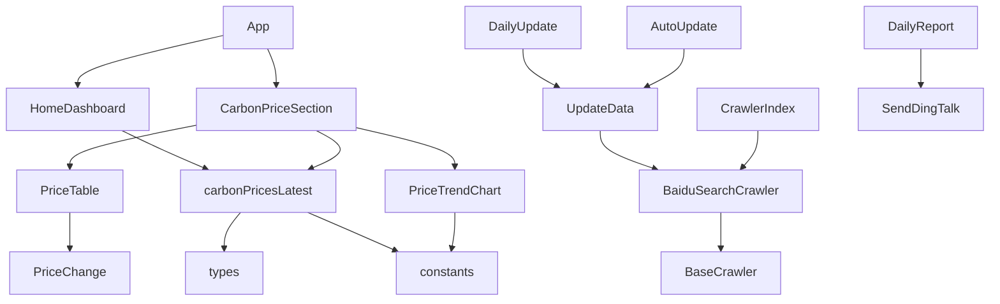

**图表来源**
- [CarbonPriceSection.tsx:4-6](file://src/sections/CarbonPriceSection.tsx#L4-L6)
- [PriceTable.tsx:1](file://src/sections/PriceTable.tsx#L1)
- [HomeDashboard.tsx:9](file://src/sections/HomeDashboard.tsx#L9)
- [baiduSearchCrawler.ts:6](file://scripts/crawler/baiduSearchCrawler.ts#L6)
- [baseCrawler.ts:6](file://scripts/crawler/baseCrawler.ts#L6)
- [index.ts:6](file://scripts/crawler/index.ts#L6)

**章节来源**
- [package.json:12-34](file://package.json#L12-L34)
- [CarbonPriceSection.tsx:1-6](file://src/sections/CarbonPriceSection.tsx#L1-L6)
- [HomeDashboard.tsx:1-9](file://src/sections/HomeDashboard.tsx#L1-L9)

## 性能考虑

### 缓存策略

系统采用了多层次的缓存机制来优化性能：

1. **组件级缓存**：使用 `useMemo` 缓存计算结果
2. **数据级缓存**：避免重复计算相同的数据
3. **渲染优化**：只在必要时重新渲染组件

### 爬虫性能优化

**更新** 百度搜索爬虫系统采用了多项性能优化措施：

1. **请求限流**：2000ms间隔避免触发搜索引擎限流
2. **并发控制**：串行执行搜索请求，确保稳定性
3. **智能重试**：最多2次重试机制
4. **超时控制**：10秒超时防止长时间等待
5. **数据验证**：合理价格范围验证减少无效数据

### 实时性保障

**更新** 系统通过以下机制确保数据的实时性：

1. **定时刷新**：设置合理的数据刷新间隔
2. **增量更新**：只更新发生变化的数据
3. **错误重试**：网络异常时自动重试
4. **降级策略**：数据获取失败时提供默认值
5. **并行处理**：多爬虫任务并行执行提升效率
6. **自动化更新**：通过GitHub Actions实现无人值守更新

**章节来源**
- [baiduSearchCrawler.ts:20-27](file://scripts/crawler/baiduSearchCrawler.ts#L20-L27)
- [baseCrawler.ts:23-29](file://scripts/crawler/baseCrawler.ts#L23-L29)
- [index.ts:32-45](file://scripts/crawler/index.ts#L32-L45)

## 故障排除指南

### 常见问题及解决方案

#### 图表渲染问题

**问题描述**：图表无法正确显示或显示异常

**可能原因**：
1. 数据格式不正确
2. 组件未正确接收 props
3. Recharts 库版本兼容性问题

**解决步骤**：
1. 检查数据格式是否符合预期
2. 验证组件 props 传递
3. 更新 Recharts 到兼容版本

#### 爬虫数据获取问题

**问题描述**：百度搜索爬虫无法获取到价格数据

**可能原因**：
1. 百度搜索结果格式变化
2. 网络连接不稳定
3. 搜索关键词匹配失败
4. 价格范围验证失败

**解决步骤**：
1. 检查百度搜索结果页面结构
2. 验证网络连接和代理设置
3. 更新搜索关键词模式
4. 调整价格验证阈值

#### 性能问题

**问题描述**：页面加载缓慢或图表响应迟缓

**可能原因**：
1. 数据量过大导致渲染压力
2. 未使用适当的缓存机制
3. 组件重新渲染过于频繁
4. 爬虫请求过多导致性能下降

**解决步骤**：
1. 实施数据分页或虚拟化
2. 添加 useMemo 和 useCallback
3. 优化数据结构和算法
4. 调整爬虫请求频率

#### 样式问题

**问题描述**：图表或表格样式显示异常

**可能原因**：
1. TailwindCSS 配置问题
2. 组件样式冲突
3. 响应式布局适配问题

**解决步骤**：
1. 检查 TailwindCSS 配置
2. 避免样式类名冲突
3. 测试不同屏幕尺寸下的显示效果

#### 自动化更新失败

**新增功能** **问题描述**：GitHub Actions自动化更新失败

**可能原因**：
1. 爬虫服务不可用或返回空数据
2. Git权限配置错误
3. Node.js环境问题
4. 依赖包安装失败

**解决步骤**：
1. 检查GitHub Actions日志中的错误信息
2. 验证DINGTALK_WEBHOOK环境变量配置
3. 确认Node.js版本和依赖包安装
4. 测试本地updateData.ts脚本执行
5. 检查网络连接和防火墙设置

#### 钉钉简报发送失败

**新增功能** **问题描述**：钉钉机器人简报发送失败

**可能原因**：
1. Webhook地址配置错误
2. 网络连接问题
3. 钉钉API接口限制
4. 请求格式不符合要求

**解决步骤**：
1. 验证DINGTALK_WEBHOOK环境变量
2. 检查网络连接和代理设置
3. 确认钉钉群机器人的权限设置
4. 测试手动发送简报
5. 查看钉钉API返回的错误码

#### 更新日期显示问题

**更新功能** **问题描述**：更新日期显示异常或不正确

**可能原因**：
1. 更新日期配置缺失
2. 数据层未正确添加updateDate字段
3. UI组件未正确渲染更新日期

**解决步骤**：
1. 检查PRICE_UPDATE_DATES配置是否完整
2. 验证getLatestPrices函数是否返回updateDate字段
3. 确认PriceTable和HomeDashboard组件正确渲染更新日期
4. 检查数据类型定义是否包含updateDate属性

#### 实时数据获取问题

**更新功能** **问题描述**：carbonPricesLatest.ts文件中的实时数据无法正确获取

**可能原因**：
1. 爬虫系统未正确执行
2. 数据文件生成失败
3. 组件未正确导入数据
4. 数据格式不匹配

**解决步骤**：
1. 检查updateData.ts脚本是否正确执行
2. 验证carbonPricesLatest.ts文件是否生成成功
3. 确认组件正确导入getPriceByProductId函数
4. 检查数据类型定义是否与实际数据匹配

#### 最新价格数据异常

**更新功能** **问题描述**：最新的碳价数据（CEA从79.5降至78.9，CCER从98降至95.8，BEA从80升至106）显示异常

**可能原因**：
1. 百度搜索爬虫解析逻辑错误
2. 数据文件生成脚本问题
3. 组件渲染逻辑错误
4. 价格范围验证失败

**解决步骤**：
1. 检查baiduSearchCrawler.ts中的价格解析逻辑
2. 验证updateData.ts中的数据生成逻辑
3. 确认PriceTable组件正确渲染最新价格
4. 检查价格范围验证条件是否合理

**章节来源**
- [PriceTrendChart.tsx:57-133](file://src/sections/PriceTrendChart.tsx#L57-L133)
- [PriceTable.tsx:43-79](file://src/sections/PriceTable.tsx#L43-L79)
- [HomeDashboard.tsx:82-88](file://src/sections/HomeDashboard.tsx#L82-L88)
- [baiduSearchCrawler.ts:55-57](file://scripts/crawler/baiduSearchCrawler.ts#L55-L57)
- [carbonPricesLatest.ts:61-67](file://src/data/carbonPricesLatest.ts#L61-L67)
- [daily-update.yml:33-44](file://.github/workflows/daily-update.yml#L33-L44)
- [sendDingTalk.ts:14-43](file://scripts/sendDingTalk.ts#L14-L43)

## 结论

碳价格监控模块通过精心设计的数据模型、直观的可视化界面和高效的性能优化，为用户提供了一个功能完整、易于使用的碳价格监控解决方案。模块的主要优势包括：

1. **数据完整性**：支持国内外多个碳产品的价格监控
2. **可视化丰富**：提供趋势图表和价格表格两种展示方式
3. **交互友好**：支持产品选择、全选等交互功能
4. **性能优化**：采用缓存和渲染优化技术
5. **扩展性强**：模块化设计便于功能扩展
6. **自动化程度高**：通过GitHub Actions实现无人值守更新
7. **团队协作友好**：集成钉钉简报功能提供及时通知
8. **类型安全**：引入PriceRecord类型定义确保代码质量
9. **统一管理**：通过CARBON_PRODUCTS_META常量统一产品元数据
10. **精确日期**：集成dayjs库提供精确的日期处理能力

**重大更新亮点**：
- **GitHub Actions自动化**：全新的每日自动更新系统
- **产品范围精简**：从8个产品减少到6个核心产品
- **数据源简化**：从复杂爬虫系统简化为静态数据维护
- **钉钉简报集成**：提供每日市场数据更新通知
- **无人值守更新**：实现真正的自动化数据管理
- **实时数据获取**：基于百度搜索的自动化数据更新
- **价格识别算法**：智能解析百度搜索结果中的价格信息
- **更新日期跟踪**：新增碳价格更新日期跟踪功能
- **类型安全增强**：引入PriceRecord类型定义
- **元数据统一**：通过CARBON_PRODUCTS_META常量管理产品信息
- **日期处理优化**：集成dayjs库提供精确日期计算

未来可以考虑的功能增强包括：实时数据接入、更复杂的价格分析算法、移动端优化、多搜索引擎支持、更新日期历史追踪等。

## 附录

### 新指标添加指南

要向系统添加新的价格指标，请按照以下步骤操作：

1. **更新数据模型**：在类型定义中添加新的字段
2. **修改数据生成**：在数据生成函数中计算新指标
3. **更新组件渲染**：在相应的组件中显示新指标
4. **测试验证**：确保新指标正确显示和计算

### 图表定制指南

系统提供了灵活的图表定制选项：

1. **颜色主题**：通过 COLORS 对象自定义产品颜色
2. **尺寸调整**：修改图表容器的高度和宽度
3. **样式定制**：通过 CSS 类名覆盖默认样式
4. **交互增强**：添加更多的交互功能如缩放、平移等

### 爬虫系统扩展指南

**更新** 如需扩展爬虫系统支持更多数据源：

1. **继承基础爬虫类**：创建新的爬虫类继承 BaseCrawler
2. **实现数据解析**：编写特定的数据解析逻辑
3. **配置爬虫参数**：设置合适的请求参数和限流策略
4. **集成到索引文件**：在 crawler/index.ts 中注册新爬虫
5. **更新数据更新脚本**：在 updateData.ts 中集成新数据源

### 性能优化最佳实践

1. **数据预处理**：在数据进入组件前进行必要的预处理
2. **组件拆分**：将大型组件拆分为更小的子组件
3. **懒加载**：对不常用的功能使用懒加载
4. **内存管理**：及时清理不再使用的数据和事件监听器
5. **爬虫优化**：合理设置请求间隔和重试机制
6. **自动化优化**：优化GitHub Actions工作流性能

### 自动化更新系统扩展指南

**新增功能** 如需扩展自动化更新系统：

1. **添加新的工作流**：在.github/workflows目录添加新工作流
2. **配置触发条件**：设置合适的时间或事件触发条件
3. **更新执行脚本**：修改对应的更新脚本逻辑
4. **集成通知系统**：添加或修改通知发送机制
5. **测试验证**：确保新工作流正常执行

### 钉钉简报系统扩展指南

**新增功能** 如需扩展钉钉简报系统：

1. **配置Webhook**：设置钉钉机器人的Webhook地址
2. **自定义简报内容**：修改简报生成逻辑
3. **添加通知渠道**：支持其他即时通讯工具
4. **配置触发条件**：设置简报发送的触发条件
5. **监控简报状态**：添加简报发送状态监控

### 更新日期跟踪系统扩展指南

**更新功能** 如需扩展更新日期跟踪系统：

1. **添加新的更新日期配置**：在PRICE_UPDATE_DATES中添加新产品配置
2. **更新数据生成逻辑**：确保新产品的updateDate字段正确生成
3. **扩展UI组件**：在相关组件中显示新的更新日期信息
4. **测试验证**：确保更新日期正确显示和处理
5. **文档更新**：更新相关文档和注释

### 实时数据管理扩展指南

**更新功能** 如需扩展实时数据管理功能：

1. **添加新的数据源**：在updateData.ts中添加新的数据源处理逻辑
2. **更新数据结构**：扩展PriceRecord接口以支持新字段
3. **修改数据生成**：更新carbonPricesLatest.ts中的数据生成逻辑
4. **集成到组件**：在相关组件中使用新的数据字段
5. **测试验证**：确保新数据正确显示和处理

### 类型安全增强指南

**更新功能** 如需进一步增强类型安全：

1. **扩展PriceRecord接口**：添加更多字段如timestamp、sourceUrl等
2. **创建PriceRowWithUpdateDate接口**：统一包含更新日期的行数据结构
3. **实现类型守卫函数**：添加数据验证和转换逻辑
4. **使用泛型约束**：确保组件接收正确的数据类型
5. **集成TypeScript严格模式**：启用更多类型检查规则

### 日期处理优化指南

**更新功能** 如需优化日期处理功能：

1. **统一日期格式**：使用ISO 8601标准格式存储和传输日期
2. **添加日期验证**：实现日期范围和格式验证逻辑
3. **扩展日期计算**：支持更多日期运算和比较操作
4. **国际化日期显示**：支持多语言和多时区显示
5. **缓存日期计算结果**：避免重复的日期处理操作