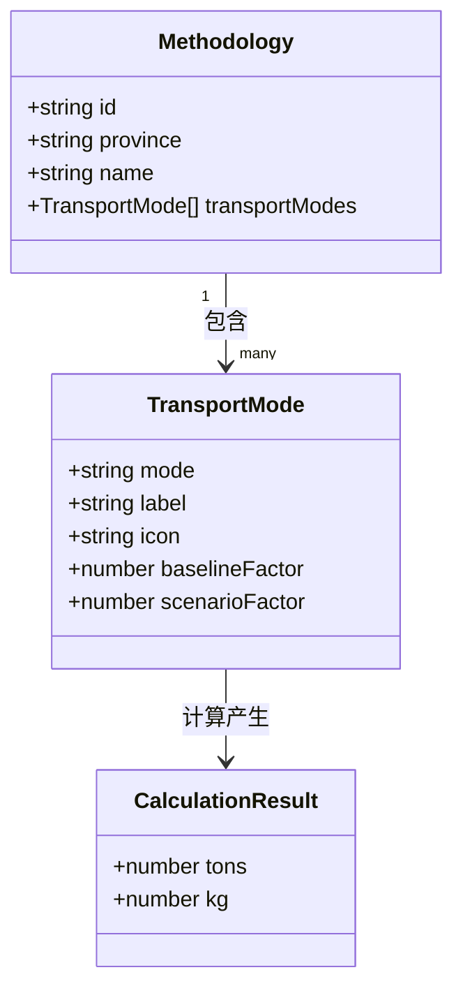
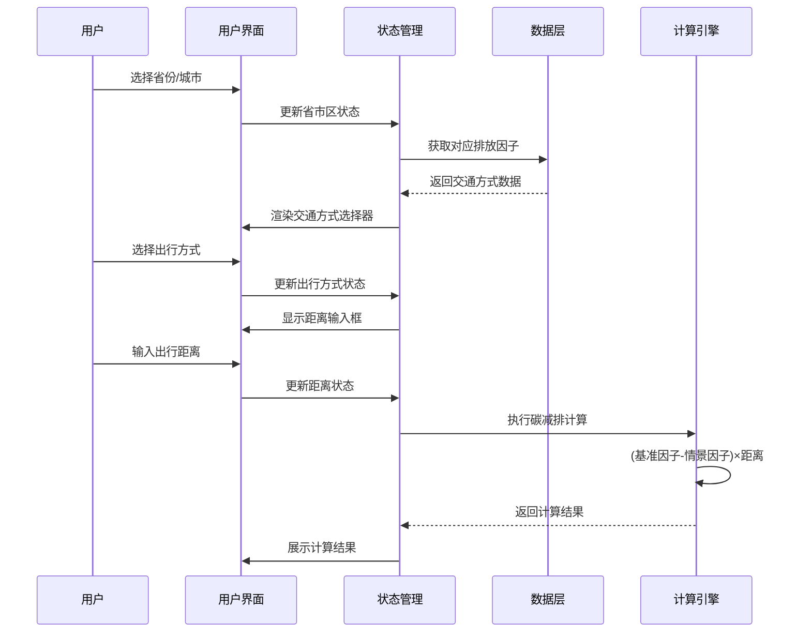
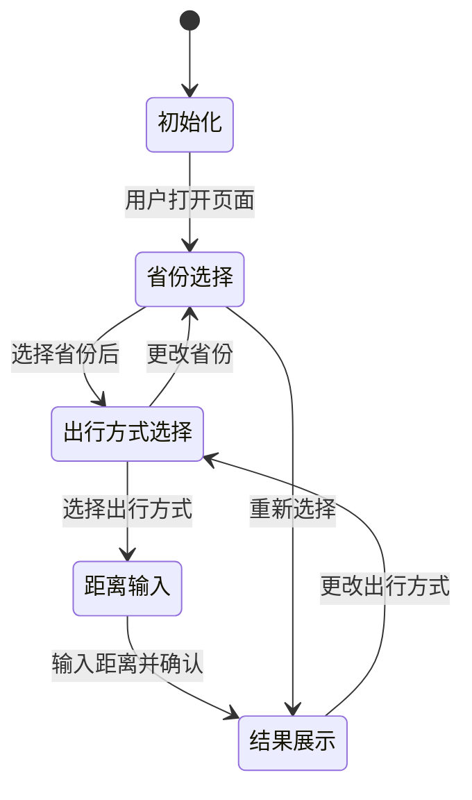
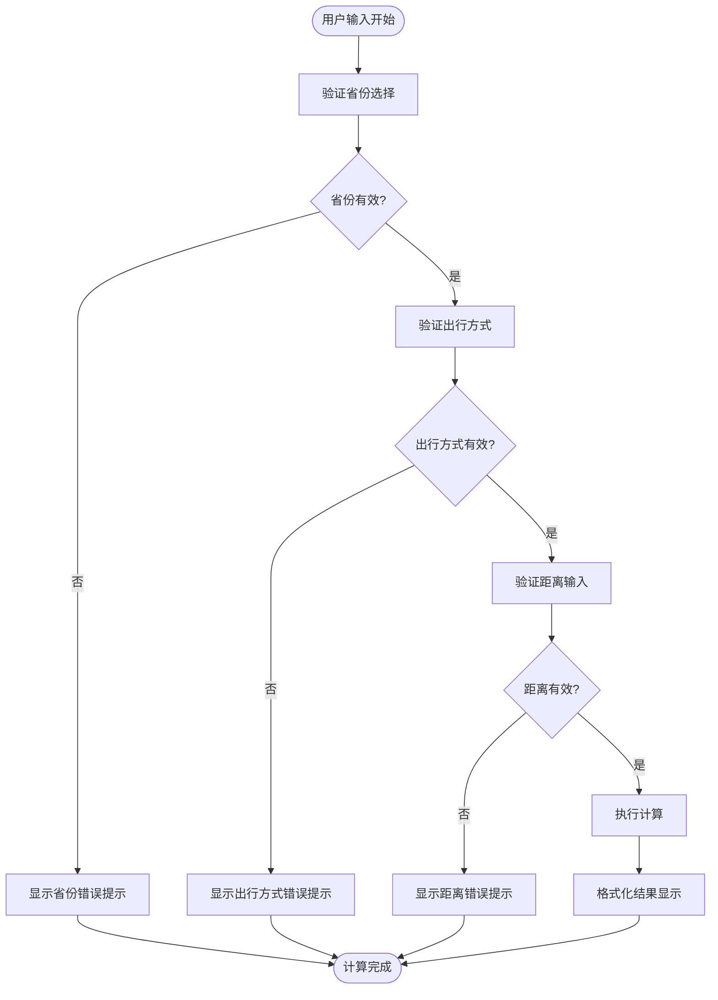
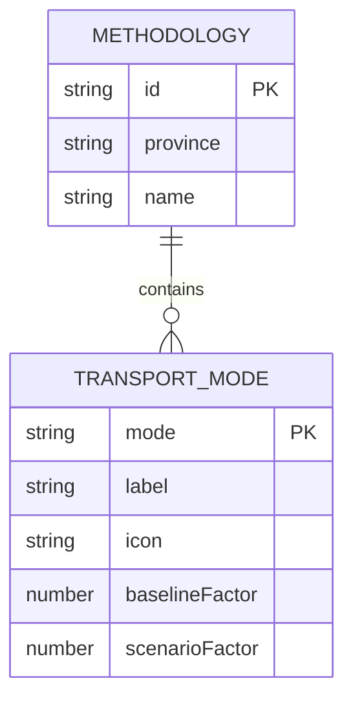
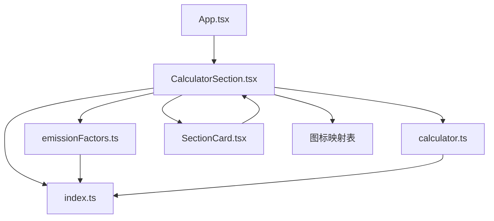

# 碳计算器模块

<cite>
**本文档引用的文件**
- [CalculatorSection.tsx](file://src/sections/CalculatorSection.tsx)
- [emissionFactors.ts](file://src/data/emissionFactors.ts)
- [calculator.ts](file://src/utils/calculator.ts)
- [index.ts](file://src/types/index.ts)
- [constants.ts](file://src/utils/constants.ts)
- [SectionCard.tsx](file://src/components/SectionCard.tsx)
- [App.tsx](file://src/App.tsx)
</cite>

## 更新摘要
**变更内容**
- 更新排放因子数据结构，从单文件配置重构为模块化多地区配置
- 新增北京、广东、深圳、上海、天津、广州等6个地区的碳普惠方法学
- 更新界面本地化文本，支持中文显示
- 优化图标映射机制，增强用户体验
- 完善计算因子配置和结果显示格式化

## 目录
1. [简介](#简介)
2. [项目结构](#项目结构)
3. [核心组件](#核心组件)
4. [架构概览](#架构概览)
5. [详细组件分析](#详细组件分析)
6. [依赖关系分析](#依赖关系分析)
7. [性能考虑](#性能考虑)
8. [故障排除指南](#故障排除指南)
9. [结论](#结论)
10. [附录](#附录)

## 简介

碳计算器模块是碳普惠信息服务平台的核心功能组件，基于中国各省市的碳普惠方法学，为用户提供个性化的碳减排量计算服务。该模块通过科学的排放因子数据和直观的用户界面，帮助用户量化不同出行方式的碳足迹差异，从而做出更环保的选择。

系统现已支持全国多个重点城市的碳普惠方法学，包括北京、广东、深圳、上海、天津、广州等地区的最新标准，涵盖公共交通、轨道交通、骑行、步行、新能源汽车等多种出行方式。

## 项目结构

碳计算器模块采用模块化设计，主要由以下层次组成：

```mermaid
graph TB
subgraph "应用层"
App[App.tsx 应用入口]
SectionCard[SectionCard.tsx 组件容器]
end
subgraph "业务逻辑层"
CalculatorSection[CalculatorSection.tsx 主要组件]
CalculatorUtils[calculator.ts 计算工具]
end
subgraph "数据层"
EmissionFactors[emissionFactors.ts 排放因子数据]
TypeDefinitions[index.ts 类型定义]
end
subgraph "配置层"
Constants[constants.ts 常量定义]
IconMap[图标映射表]
</subgraph>
App --> SectionCard
SectionCard --> CalculatorSection
CalculatorSection --> CalculatorUtils
CalculatorSection --> EmissionFactors
CalculatorSection --> TypeDefinitions
CalculatorSection --> IconMap
```

**图表来源**
- [App.tsx:18-60](file://src/App.tsx#L18-L60)
- [CalculatorSection.tsx:16-161](file://src/sections/CalculatorSection.tsx#L16-L161)

**章节来源**
- [CalculatorSection.tsx:1-161](file://src/sections/CalculatorSection.tsx#L1-L161)
- [App.tsx:1-60](file://src/App.tsx#L1-L60)

## 核心组件

### 数据模型架构

系统采用清晰的数据模型分层设计，确保类型安全和可维护性：



**图表来源**
- [index.ts:39-53](file://src/types/index.ts#L39-L53)
- [calculator.ts:1-12](file://src/utils/calculator.ts#L1-L12)

### 计算因子体系

系统实现了多层级的排放因子配置机制：

| 因子类型 | 定义 | 单位 | 说明 |
|---------|------|------|------|
| 基准排放因子 | baselineFactor | kgCO₂/km | 标准出行方式的碳排放强度 |
| 情景排放因子 | scenarioFactor | kgCO₂/km | 目标或改进后的碳排放强度 |
| 减排量 | reduction | kgCO₂/km | 基准因子与情景因子的差值 |

**章节来源**
- [emissionFactors.ts:3-79](file://src/data/emissionFactors.ts#L3-L79)
- [index.ts:40-46](file://src/types/index.ts#L40-L46)

## 架构概览

碳计算器模块采用React函数式组件架构，结合TypeScript类型系统，实现了高度模块化的设计：



**图表来源**
- [CalculatorSection.tsx:16-161](file://src/sections/CalculatorSection.tsx#L16-L161)
- [calculator.ts:1-12](file://src/utils/calculator.ts#L1-L12)

## 详细组件分析

### CalculatorSection 组件

CalculatorSection 是整个碳计算器的核心组件，负责管理用户交互和状态流转。

#### 状态管理机制

组件使用React的useState和useMemo hooks实现高效的状态管理：



**图表来源**
- [CalculatorSection.tsx:17-39](file://src/sections/CalculatorSection.tsx#L17-L39)

#### 用户输入验证流程

系统实现了多层次的输入验证机制：



**图表来源**
- [CalculatorSection.tsx:102-112](file://src/sections/CalculatorSection.tsx#L102-L112)

#### 计算精度控制策略

系统采用双精度输出机制，确保计算结果的准确性和可读性：

| 输出类型 | 精度控制 | 显示格式 | 使用场景 |
|----------|----------|----------|----------|
| 吨(t) | 保留6位小数后四舍五入到4位 | 四舍五入到4位 | 主要显示单位 |
| 千克(kg) | 保留3位小数后四舍五入到2位 | 四舍五入到2位 | 辅助显示单位 |

**章节来源**
- [calculator.ts:5-11](file://src/utils/calculator.ts#L5-L11)

### emissionFactors 数据配置

排放因子数据采用模块化JSON配置格式，支持多地区、多交通方式的灵活扩展：

#### 数据结构设计



**图表来源**
- [index.ts:48-53](file://src/types/index.ts#L48-L53)
- [index.ts:40-46](file://src/types/index.ts#L40-L46)

#### 地区覆盖范围

系统现已支持以下重点地区的碳普惠方法学：

| 地区 | 方法学名称 | 支持的交通方式数量 | 基准因子范围(kgCO₂/km) |
|------|------------|-------------------|----------------------|
| 北京市 | 碳普惠项目减排量核算技术规范 低碳出行（DB11/T 3043—2024） | 5种 | 0.104-0.250 |
| 广东省 | 广东省碳普惠方法学 低碳出行（2024版） | 6种 | 0.215-0.232 |
| 深圳市 | 深圳市碳普惠方法学 绿色出行 | 6种 | 0.215-0.218 |
| 上海市 | 上海市碳普惠方法学 公共交通 | 5种 | 0.106-0.210 |
| 天津市 | 天津市碳普惠方法学 绿色出行 | 5种 | 0.205 |
| 广州市 | 广州市碳普惠方法学 低碳出行 | 5种 | 0.215 |

**章节来源**
- [emissionFactors.ts:3-79](file://src/data/emissionFactors.ts#L3-L79)

### 计算因子来源与单位换算

#### 因子来源标准

各地区的排放因子来源于权威的碳普惠方法学标准，具体包括：

- **北京市**: DB11/T 3043—2024《碳普惠项目减排量核算技术规范》
- **广东省**: 广东省碳普惠方法学 低碳出行（2024版）
- **深圳市**: 深圳市碳普惠方法学 绿色出行
- **上海市**: 上海市碳普惠方法学 公共交通
- **天津市**: 天津市碳普惠方法学 绿色出行
- **广州市**: 广州市碳普惠方法学 低碳出行

#### 单位换算规则

系统采用国际通用的碳排放计量单位：

| 物质 | 单位 | 换算关系 |
|------|------|----------|
| 二氧化碳 | kgCO₂ | 基准单位 |
| 二氧化碳当量 | tCO₂e | 1 tCO₂e = 1000 kgCO₂ |

**章节来源**
- [emissionFactors.ts:4-78](file://src/data/emissionFactors.ts#L4-L78)

## 依赖关系分析

### 组件间依赖关系



**图表来源**
- [CalculatorSection.tsx:4-5](file://src/sections/CalculatorSection.tsx#L4-L5)
- [App.tsx:6](file://src/App.tsx#L6)

### 外部依赖分析

系统依赖于以下外部库和工具：

- **React 18**: 核心框架，提供组件化开发能力
- **Lucide React**: 图标库，提供直观的视觉反馈
- **TypeScript**: 类型系统，确保代码质量和开发体验
- **Tailwind CSS**: 样式框架，提供响应式设计支持

**章节来源**
- [CalculatorSection.tsx:1-6](file://src/sections/CalculatorSection.tsx#L1-L6)

## 性能考虑

### 计算性能优化

系统在计算性能方面采用了多项优化策略：

1. **Memoization缓存**: 使用useMemo避免重复计算
2. **条件渲染**: 只在必要时重新计算和渲染
3. **数值精度控制**: 合理的四舍五入策略减少计算开销

### 内存管理

- **状态最小化**: 仅存储必要的状态信息
- **事件处理优化**: 使用箭头函数避免不必要的绑定
- **组件卸载清理**: 自动清理未使用的状态引用

## 故障排除指南

### 常见问题及解决方案

#### 问题1: 出行方式选择无效
**症状**: 选择出行方式后无法显示计算结果
**原因**: 距离输入为空或为负数
**解决方法**: 确保输入有效的正数距离

#### 问题2: 计算结果显示异常
**症状**: 减排量显示为NaN或Infinity
**原因**: 排放因子数据配置错误
**解决方法**: 检查emissionFactors.ts中的数值有效性

#### 问题3: 省份选择不生效
**症状**: 切换省份后交通方式列表不变
**原因**: 省份名称匹配失败
**解决方法**: 确认省份名称与数据源一致

**章节来源**
- [CalculatorSection.tsx:31-34](file://src/sections/CalculatorSection.tsx#L31-L34)

## 结论

碳计算器模块通过精心设计的架构和严谨的实现，成功地将复杂的碳排放计算过程简化为直观易用的用户界面。模块具有以下优势：

1. **高可扩展性**: 支持新增地区和交通方式的灵活扩展
2. **强类型安全**: 完整的TypeScript类型定义确保代码质量
3. **用户体验优秀**: 直观的界面设计和实时的计算反馈
4. **数据准确性**: 基于权威方法学的排放因子配置
5. **本地化支持**: 完整的中文界面和本地化文本

该模块为碳普惠信息服务平台提供了坚实的技术基础，有助于推动碳减排意识的普及和实践。

## 附录

### 新增交通方式指南

要为现有地区添加新的交通方式，请按照以下步骤操作：

1. **修改数据配置**: 在对应的地区配置中添加新的TransportMode对象
2. **更新类型定义**: 如需新增字段，在TypeDefinitions中相应位置添加
3. **测试验证**: 确保新交通方式在所有支持的地区都能正常工作

### 自定义计算因子配置

系统支持灵活的计算因子配置机制：

1. **基准因子调整**: 根据实际运营情况调整基准排放强度
2. **情景因子设置**: 设定目标或改进后的排放水平
3. **单位一致性**: 确保所有因子使用相同的计量单位

### 结果展示格式化

计算结果采用统一的格式化策略：

- **主显示**: 以吨(t)为单位，保留4位小数
- **辅助显示**: 以千克(kg)为单位，保留2位小数
- **详细信息**: 显示计算公式和参数来源

### 新增地区支持指南

要为新地区添加碳普惠方法学支持，请按照以下步骤操作：

1. **添加数据配置**: 在emissionFactors.ts中添加新的Methodology对象
2. **更新类型定义**: 确保TypeDefinitions中包含新的地区配置
3. **测试验证**: 确保新地区的所有交通方式都能正常计算
4. **界面适配**: 确认本地化文本和图标显示正确