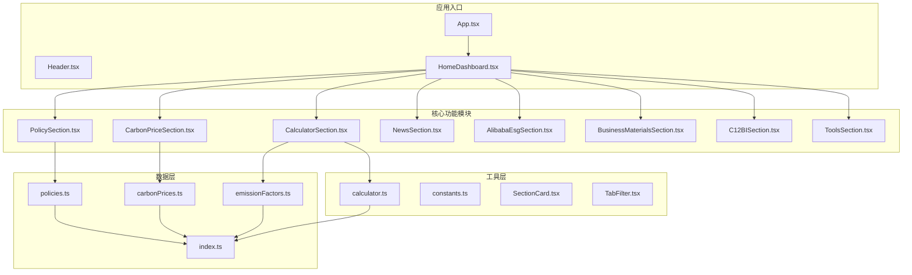
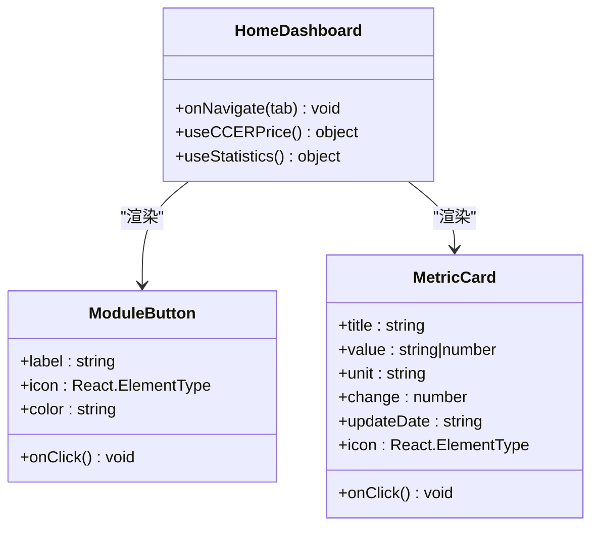
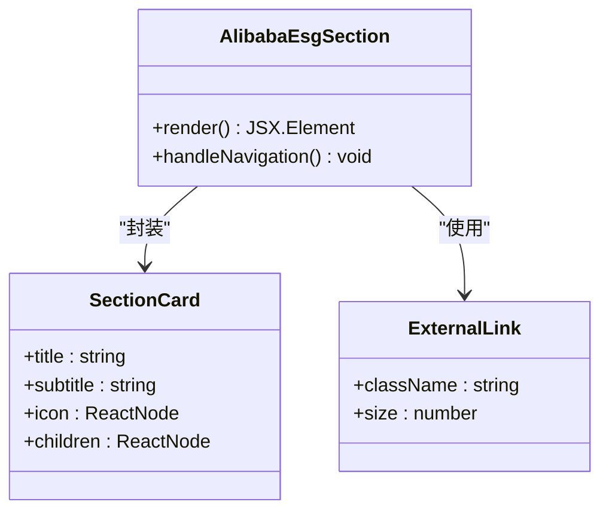
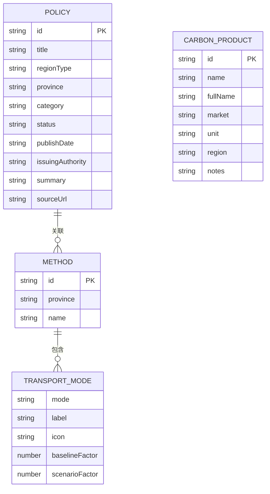
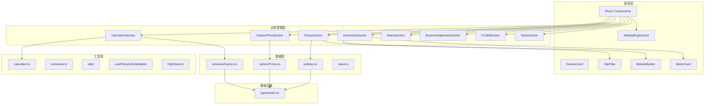
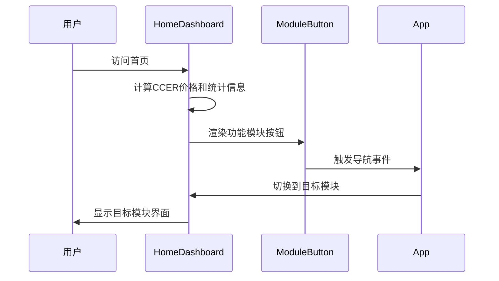
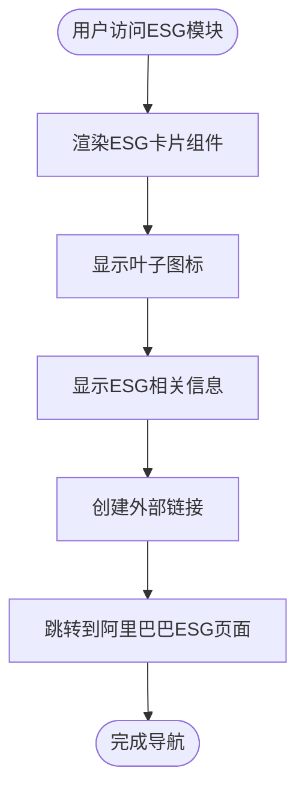
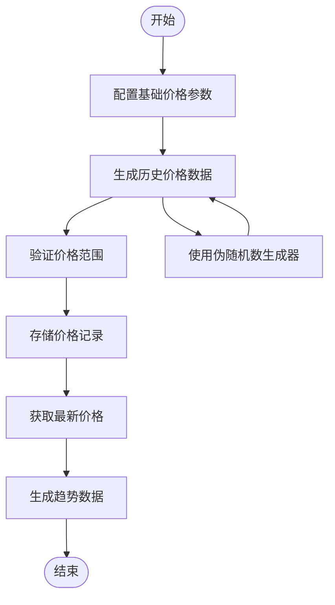

# 阿里巴巴ESG模块

<cite>
**本文档引用的文件**
- [App.tsx](file://src/App.tsx)
- [HomeDashboard.tsx](file://src/sections/HomeDashboard.tsx)
- [AlibabaEsgSection.tsx](file://src/sections/AlibabaEsgSection.tsx)
- [PolicySection.tsx](file://src/sections/PolicySection.tsx)
- [CarbonPriceSection.tsx](file://src/sections/CarbonPriceSection.tsx)
- [CalculatorSection.tsx](file://src/sections/CalculatorSection.tsx)
- [NewsSection.tsx](file://src/sections/NewsSection.tsx)
- [BusinessMaterialsSection.tsx](file://src/sections/BusinessMaterialsSection.tsx)
- [C12BISection.tsx](file://src/sections/C12BISection.tsx)
- [ToolsSection.tsx](file://src/sections/ToolsSection.tsx)
- [policies.ts](file://src/data/policies.ts)
- [carbonPrices.ts](file://src/data/carbonPrices.ts)
- [emissionFactors.ts](file://src/data/emissionFactors.ts)
- [calculator.ts](file://src/utils/calculator.ts)
- [index.ts](file://src/types/index.ts)
- [constants.ts](file://src/utils/constants.ts)
- [SectionCard.tsx](file://src/components/SectionCard.tsx)
- [TabFilter.tsx](file://src/components/TabFilter.tsx)
- [package.json](file://package.json)
</cite>

## 更新摘要
**所做更改**
- 新增AlibabaEsgSection组件的完整文档内容
- 更新项目结构图以包含ESG模块
- 添加ESG模块的详细组件分析和架构说明
- 更新应用导航和模块列表，包含阿里ESG模块
- 重新引入ESG相关的故障排除指南

## 目录
1. [简介](#简介)
2. [项目结构](#项目结构)
3. [核心组件](#核心组件)
4. [架构概览](#架构概览)
5. [详细组件分析](#详细组件分析)
6. [依赖关系分析](#依赖关系分析)
7. [性能考虑](#性能考虑)
8. [故障排除指南](#故障排除指南)
9. [结论](#结论)

## 简介

阿里巴巴ESG模块是高德绿色出行碳普惠AI智能体项目中的重要组成部分，专门用于展示和管理阿里巴巴集团的环境、社会及治理（ESG）相关信息。该模块提供了一个直观的界面，让用户能够轻松访问阿里巴巴的ESG报告和相关信息。

该项目是一个基于React + TypeScript + Vite构建的现代化前端应用，专注于碳普惠和ESG数据的展示与分析。模块采用了组件化的设计理念，具有良好的可维护性和扩展性。

**更新** 阿里巴巴ESG模块已在当前版本中恢复并集成，为用户提供阿里巴巴集团ESG报告门户的直接访问功能，增强了应用的企业社会责任信息披露能力。

## 项目结构

项目采用清晰的模块化组织结构，主要分为以下几个核心部分：



**图表来源**
- [App.tsx:1-113](file://src/App.tsx#L1-L113)
- [HomeDashboard.tsx:1-222](file://src/sections/HomeDashboard.tsx#L1-L222)

**章节来源**
- [App.tsx:1-113](file://src/App.tsx#L1-L113)
- [package.json:1-40](file://package.json#L1-L40)

## 核心组件

### 首页仪表盘组件

HomeDashboard组件是应用的主要入口，提供核心指标展示和功能模块导航：



**图表来源**
- [HomeDashboard.tsx:122-131](file://src/sections/HomeDashboard.tsx#L122-L131)
- [HomeDashboard.tsx:98-120](file://src/sections/HomeDashboard.tsx#L98-L120)
- [HomeDashboard.tsx:47-95](file://src/sections/HomeDashboard.tsx#L47-L95)

### 阿里巴巴ESG模块组件

AlibabaEsgSection组件提供阿里巴巴集团ESG报告门户的访问功能：



**图表来源**
- [AlibabaEsgSection.tsx:4-33](file://src/sections/AlibabaEsgSection.tsx#L4-L33)
- [SectionCard.tsx:10-25](file://src/components/SectionCard.tsx#L10-L25)

### 数据模型定义

项目使用TypeScript接口来定义数据结构，确保类型安全和代码可维护性：



**图表来源**
- [index.ts:1-65](file://src/types/index.ts#L1-L65)

**章节来源**
- [HomeDashboard.tsx:1-222](file://src/sections/HomeDashboard.tsx#L1-L222)
- [AlibabaEsgSection.tsx:1-34](file://src/sections/AlibabaEsgSection.tsx#L1-L34)
- [index.ts:1-65](file://src/types/index.ts#L1-L65)

## 架构概览

系统采用分层架构设计，从上到下分为表现层、业务逻辑层、数据层和工具层：



**图表来源**
- [App.tsx:43-112](file://src/App.tsx#L43-L112)
- [HomeDashboard.tsx:122-131](file://src/sections/HomeDashboard.tsx#L122-L131)
- [AlibabaEsgSection.tsx:1-34](file://src/sections/AlibabaEsgSection.tsx#L1-L34)

## 详细组件分析

### 首页仪表盘功能

HomeDashboard组件提供了核心指标展示和功能导航：



**图表来源**
- [HomeDashboard.tsx:122-131](file://src/sections/HomeDashboard.tsx#L122-L131)
- [App.tsx:46-49](file://src/App.tsx#L46-L49)

组件特性：
- 展示CCER价格、政策数量、方法学数量和已落地城市等核心指标
- 提供八个主要功能模块的快捷导航，包括新增的阿里ESG模块
- 响应式设计，适配不同屏幕尺寸
- 无障碍访问支持

### 阿里巴巴ESG模块功能

AlibabaEsgSection组件提供阿里巴巴集团ESG报告门户的直接访问功能：



**图表来源**
- [AlibabaEsgSection.tsx:4-33](file://src/sections/AlibabaEsgSection.tsx#L4-L33)

功能特性：
- 提供阿里巴巴集团ESG报告的直接访问链接
- 使用绿色主题设计，体现环保理念
- 包含外部链接图标，明确标识为第三方跳转
- 响应式布局，适配各种屏幕尺寸

### 碳价数据处理

carbonPrices.ts模块负责生成和管理碳价数据：



**图表来源**
- [carbonPrices.ts:5-65](file://src/data/carbonPrices.ts#L5-L65)

数据处理流程：
- 基于8种不同的碳汇产品生成价格历史
- 使用线性同余生成器确保数据一致性
- 自动计算价格变化量
- 支持国内和国际市场的价格对比

### 减排量计算引擎

CalculatorSection组件集成了基于各省市碳普惠方法学的减排量计算功能：

```mermaid
flowchart TD
Input[用户输入] --> Province[选择省份]
Province --> Mode[选择出行方式]
Mode --> Distance[输入距离]
Distance --> Validate{验证输入}
Validate --> |有效| Calculate[计算减排量]
Validate --> |无效| Error[显示错误信息]
Calculate --> Result[显示计算结果]
Error --> Input
Calculate --> Formula[应用公式:<br/>(基线排放因子-情景排放因子)×距离]
Formula --> Result
```

**图表来源**
- [CalculatorSection.tsx:32-35](file://src/sections/CalculatorSection.tsx#L32-L35)
- [calculator.ts:1-12](file://src/utils/calculator.ts#L1-L12)

计算精度：
- 结果保留6位小数（吨）和3位小数（千克）
- 支持多种出行方式的排放因子
- 实时计算和结果显示

**章节来源**
- [AlibabaEsgSection.tsx:1-34](file://src/sections/AlibabaEsgSection.tsx#L1-L34)
- [HomeDashboard.tsx:16-22](file://src/sections/HomeDashboard.tsx#L16-L22)
- [carbonPrices.ts:1-119](file://src/data/carbonPrices.ts#L1-L119)
- [CalculatorSection.tsx:1-162](file://src/sections/CalculatorSection.tsx#L1-L162)
- [calculator.ts:1-12](file://src/utils/calculator.ts#L1-L12)

## 依赖关系分析

项目使用现代前端技术栈，具有清晰的依赖关系：

```mermaid
graph LR
subgraph "核心依赖"
React[react@^19.2.4]
ReactDOM[react-dom@^19.2.4]
Lucide[lucide-react@^0.577.0]
DayJS[dayjs@^1.11.20]
Tailwind[tailwindcss@^4.2.2]
Recharts[recharts@^3.8.0]
end
subgraph "开发依赖"
Vite[vite@^8.0.1]
TS[typescript@~5.9.3]
end
subgraph "应用模块"
App[App.tsx]
Home[HomeDashboard]
ESG[AlibabaEsgSection]
Utils[utils/]
Data[data/]
Components[components/]
end
React --> App
ReactDOM --> App
Lucide --> App
Lucide --> ESG
DayJS --> App
App --> Home
App --> ESG
App --> Utils
App --> Data
App --> Components
Vite --> Dev[开发环境]
TS --> Build[构建过程]
Tailwind --> Styles[样式系统]
Recharts --> Charts[图表组件]
```

**图表来源**
- [package.json:15-38](file://package.json#L15-L38)

**章节来源**
- [package.json:1-40](file://package.json#L1-L40)

## 性能考虑

### 内存优化策略

1. **组件懒加载**：通过路由切换实现组件的按需加载
2. **状态管理优化**：使用useMemo避免不必要的重新计算
3. **数据缓存**：合理利用React的内置缓存机制

### 渲染性能

1. **虚拟滚动**：对于大量数据的列表采用虚拟滚动技术
2. **防抖处理**：搜索和过滤操作使用防抖优化
3. **增量更新**：只更新发生变化的数据部分

### 网络优化

1. **静态资源压缩**：使用Vite进行资源压缩和优化
2. **CDN集成**：外部依赖通过CDN加载
3. **缓存策略**：合理设置HTTP缓存头

## 故障排除指南

### 常见问题及解决方案

**ESG模块无法访问**
- 确认网络连接正常
- 检查阿里巴巴ESG页面的可用性
- 验证外部链接的正确性

**组件渲染异常**
- 检查React版本兼容性
- 验证TypeScript类型定义
- 查看组件生命周期状态

**模块导航问题**
- 检查路由配置
- 验证模块导入路径
- 确认组件导出正确性

**外部链接跳转问题**
- 确认target="_blank"属性设置
- 检查rel="noopener noreferrer"的安全设置
- 验证href属性的正确性

### 调试工具

1. **React Developer Tools**：检查组件树和状态
2. **Chrome DevTools**：分析性能和内存使用
3. **TypeScript编译器**：验证类型安全性

**章节来源**
- [App.tsx:43-112](file://src/App.tsx#L43-L112)
- [AlibabaEsgSection.tsx:20-28](file://src/sections/AlibabaEsgSection.tsx#L20-L28)

## 结论

阿里巴巴ESG模块作为高德绿色出行碳普惠AI智能体的重要组成部分，展现了现代前端开发的最佳实践。该模块具有以下特点：

### 技术优势
- **模块化设计**：清晰的组件分离和职责划分
- **类型安全**：完整的TypeScript类型定义
- **响应式布局**：适配多设备访问体验
- **性能优化**：合理的状态管理和渲染优化
- **企业级集成**：提供真实的ESG报告门户访问

### 功能特色
- **核心指标展示**：提供碳普惠相关的关键数据指标
- **ESG报告门户**：直接访问阿里巴巴集团ESG相关信息
- **数据可视化**：支持碳价趋势和减排量计算
- **用户友好**：直观的操作界面和交互设计
- **扩展性强**：易于添加新的功能模块和数据源

### 发展前景
该模块为未来的碳普惠数据集成和分析奠定了坚实基础，可以进一步扩展支持更多地区的碳普惠信息展示，以及更丰富的数据分析功能。通过持续的优化和改进，该模块将成为企业碳普惠信息披露和管理的重要工具。

**更新** 阿里巴巴ESG模块的恢复使应用具备了完整的企业社会责任信息披露能力，为用户提供了从政策、数据到企业报告的全方位碳普惠信息服务，增强了应用的专业性和完整性。