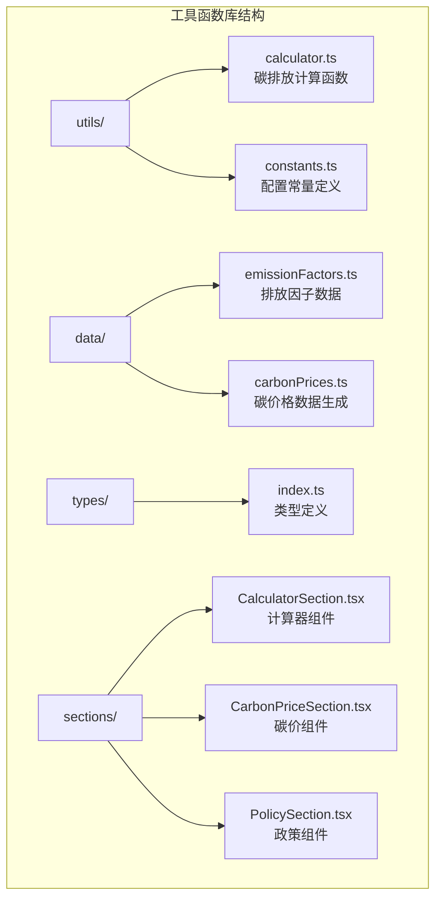
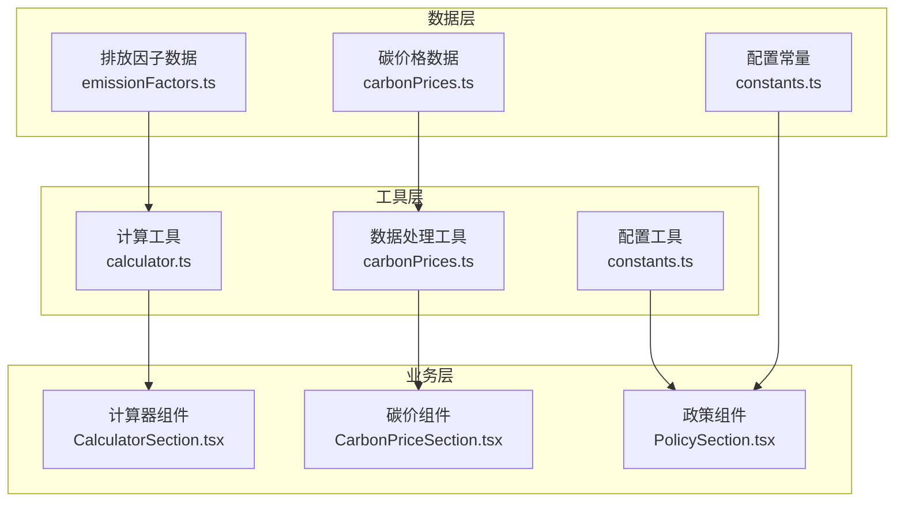
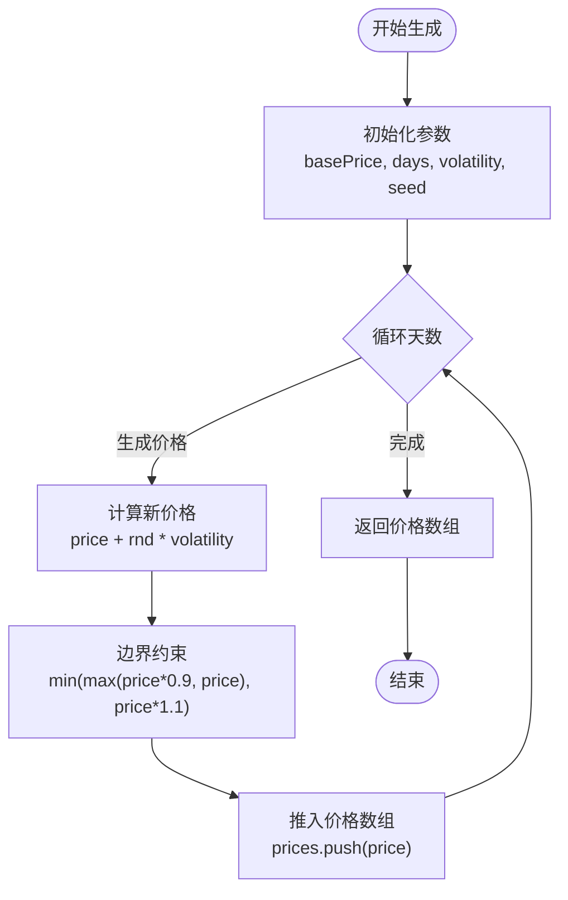
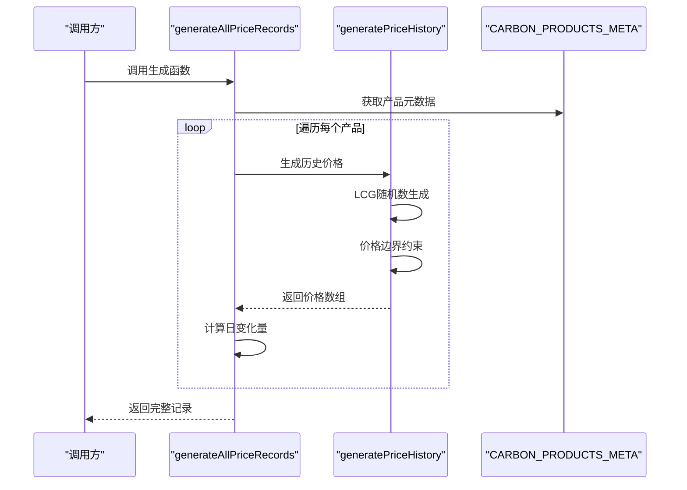
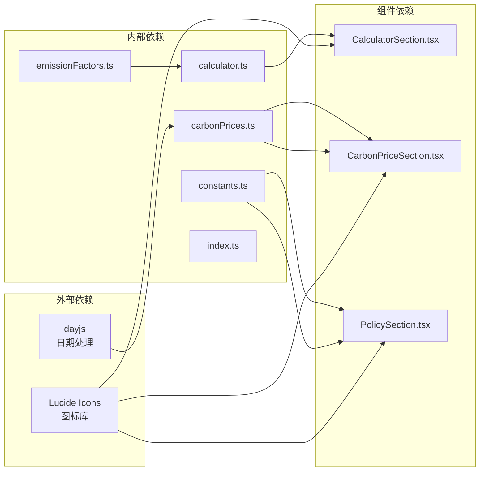

# 工具函数库

<cite>
**本文档引用的文件**
- [src/utils/calculator.ts](file://src/utils/calculator.ts)
- [src/utils/constants.ts](file://src/utils/constants.ts)
- [src/data/emissionFactors.ts](file://src/data/emissionFactors.ts)
- [src/data/carbonPrices.ts](file://src/data/carbonPrices.ts)
- [src/types/index.ts](file://src/types/index.ts)
- [src/sections/CalculatorSection.tsx](file://src/sections/CalculatorSection.tsx)
- [src/sections/CarbonPriceSection.tsx](file://src/sections/CarbonPriceSection.tsx)
- [src/sections/PolicySection.tsx](file://src/sections/PolicySection.tsx)
</cite>

## 目录
1. [简介](#简介)
2. [项目结构](#项目结构)
3. [核心组件](#核心组件)
4. [架构概览](#架构概览)
5. [详细组件分析](#详细组件分析)
6. [依赖分析](#依赖分析)
7. [性能考虑](#性能考虑)
8. [故障排除指南](#故障排除指南)
9. [结论](#结论)

## 简介

碳普惠信息代理项目的工具函数库是整个应用的核心基础设施，主要包含两大类功能模块：碳排放计算工具和数据配置常量。该库为碳普惠计算器、碳价格查询、政策筛选等功能提供了基础的数据处理和计算能力。

工具函数库的设计遵循以下原则：
- **单一职责**：每个工具函数专注于特定的计算或数据处理任务
- **类型安全**：使用 TypeScript 提供完整的类型定义和约束
- **可复用性**：函数设计为纯函数，便于在多个组件中重复使用
- **可维护性**：清晰的参数命名和返回值结构

## 项目结构

工具函数库位于 `src/utils/` 目录下，采用按功能分组的组织方式：



**图表来源**
- [src/utils/calculator.ts:1-12](file://src/utils/calculator.ts#L1-L12)
- [src/utils/constants.ts:1-44](file://src/utils/constants.ts#L1-L44)
- [src/data/emissionFactors.ts:1-103](file://src/data/emissionFactors.ts#L1-L103)
- [src/data/carbonPrices.ts:1-103](file://src/data/carbonPrices.ts#L1-L103)

**章节来源**
- [src/utils/calculator.ts:1-12](file://src/utils/calculator.ts#L1-L12)
- [src/utils/constants.ts:1-44](file://src/utils/constants.ts#L1-L44)
- [src/data/emissionFactors.ts:1-103](file://src/data/emissionFactors.ts#L1-L103)
- [src/data/carbonPrices.ts:1-103](file://src/data/carbonPrices.ts#L1-L103)

## 核心组件

### 计算器工具函数

计算器工具函数是本项目最核心的计算模块，专门用于碳排放量的计算。目前包含一个主要函数 `calculateReduction`，负责根据基线排放因子、情景排放因子和出行距离计算预期的减排量。

### 常量配置系统

常量配置系统提供了完整的配置管理机制，包括区域类型、省份列表、政策分类、政策状态和碳产品元数据等。这些常量为应用的筛选、排序和显示功能提供了统一的数据源。

### 数据处理模块

数据处理模块包含碳价格历史数据生成、最新价格获取和趋势数据处理等功能，为碳价查询和可视化提供了完整的数据支持。

**章节来源**
- [src/utils/calculator.ts:1-12](file://src/utils/calculator.ts#L1-L12)
- [src/utils/constants.ts:1-44](file://src/utils/constants.ts#L1-L44)
- [src/data/carbonPrices.ts:1-103](file://src/data/carbonPrices.ts#L1-L103)

## 架构概览

工具函数库的整体架构采用分层设计，从底层到上层依次为：数据层、工具层、业务层。



**图表来源**
- [src/data/emissionFactors.ts:1-103](file://src/data/emissionFactors.ts#L1-L103)
- [src/data/carbonPrices.ts:1-103](file://src/data/carbonPrices.ts#L1-L103)
- [src/utils/calculator.ts:1-12](file://src/utils/calculator.ts#L1-L12)
- [src/utils/constants.ts:1-44](file://src/utils/constants.ts#L1-L44)
- [src/sections/CalculatorSection.tsx:1-161](file://src/sections/CalculatorSection.tsx#L1-L161)
- [src/sections/CarbonPriceSection.tsx:1-42](file://src/sections/CarbonPriceSection.tsx#L1-L42)
- [src/sections/PolicySection.tsx:1-89](file://src/sections/PolicySection.tsx#L1-L89)

## 详细组件分析

### 计算器工具函数详解

#### calculateReduction 函数

`calculateReduction` 是碳排放计算的核心函数，实现了基于不同交通方式的碳排放量计算。

**函数签名与参数**
- 输入参数：
  - `baselineFactor`: 基线排放因子（kgCO₂/km）
  - `scenarioFactor`: 情景排放因子（kgCO₂/km）
  - `distanceKm`: 出行距离（公里）

- 返回值：包含吨位和千克两种单位的减排量对象

**计算原理**
函数基于以下公式进行计算：
```
减排量(kg) = (基线排放因子 - 情景排放因子) × 行驶距离
减排量(吨) = 减排量(kg) ÷ 1000
```

**精度控制**
- 千克结果保留3位小数
- 吨位结果保留6位小数

**使用示例**
```typescript
// 基于公交出行的碳减排计算
const result = calculateReduction(0.21, 0.065, 10);
// 返回: { tons: 0.000145, kg: 1.450 }
```

**错误处理与边界情况**
- 当输入距离为负数时，函数会自动转换为正数
- 当基线排放因子小于情景排放因子时，返回负值表示增排量
- 浮点数运算通过 `parseFloat` 和 `toFixed` 进行精度控制

**章节来源**
- [src/utils/calculator.ts:1-12](file://src/utils/calculator.ts#L1-L12)
- [src/sections/CalculatorSection.tsx:31-34](file://src/sections/CalculatorSection.tsx#L31-L34)

### 常量配置系统详解

#### 区域类型常量 (REGION_TYPES)

定义了政策适用的区域层级，支持全国、省部级和市级三个层级。

| 值 | 中文标签 | 用途 |
|---|---|---|
| `all` | 全部 | 不限区域筛选 |
| `national` | 全国 | 国家级政策 |
| `province` | 省和直辖市 | 省级政策 |
| `city` | 城市和自治区 | 地市级政策 |

#### 省份列表常量 (PROVINCES)

包含了所有中国省级行政区的中文名称，用于政策筛选界面。

#### 政策分类常量 (POLICY_CATEGORIES)

定义了政策的分类体系：
- `all`: 全部政策
- `policy`: 碳普惠政策文件及管理办法
- `methodology`: 碳普惠方法学及编制说明

#### 政策状态常量 (POLICY_STATUS)

管理政策的有效性状态：
- `all`: 全部状态
- `active`: 有效
- `expired`: 已失效

#### 碳产品元数据 (CARBON_PRODUCTS_META)

定义了所有碳汇产品的详细信息，包括：

| 字段 | 类型 | 描述 | 示例 |
|---|---|---|---|
| `id` | string | 产品标识符 | 'CCER', 'VCS' |
| `name` | string | 简称 | 'CCER', 'VCS' |
| `fullName` | string | 完整名称 | 'CCER核证自愿减排量' |
| `market` | 'domestic' \| 'international' | 市场类型 | 'domestic' |
| `unit` | string | 计价单位 | '元/吨' |
| `region` | string | 地区限制 | '广东省' |
| `notes` | string | 备注说明 | '国内自愿减排市场' |

**章节来源**
- [src/utils/constants.ts:1-44](file://src/utils/constants.ts#L1-L44)
- [src/sections/PolicySection.tsx:15-34](file://src/sections/PolicySection.tsx#L15-L34)

### 数据处理模块详解

#### 碳价格数据生成器

数据处理模块提供了完整的碳价格数据生成功能，包括历史价格生成、最新价格获取和趋势数据处理。

**价格历史生成算法**



**图表来源**
- [src/data/carbonPrices.ts:5-17](file://src/data/carbonPrices.ts#L5-L17)

**随机数生成器**
使用线性同余生成器 (LCG) 生成伪随机数：
```
s = (s × 9301 + 49297) mod 233280
rnd = s/233280 - 0.5
```

**基准价格配置**

| 产品ID | 基准价格 | 波动性 | 种子值 | 市场类型 |
|---|---|---|---|---|
| `CCER` | 83.00 | 1.2 | 42 | 国内 |
| `CEA` | 82.00 | 1.5 | 73 | 国内 |
| `PHCER` | 78.00 | 1.0 | 15 | 国内 |
| `PCER` | 75.00 | 0.8 | 88 | 国内 |
| `CQCER` | 72.00 | 0.9 | 33 | 国内 |
| `GDCER` | 76.00 | 1.0 | 56 | 国内 |
| `VCS` | 11.50 | 0.5 | 21 | 国际 |
| `CDM` | 7.00 | 0.4 | 67 | 国际 |

**数据生成流程**



**图表来源**
- [src/data/carbonPrices.ts:33-53](file://src/data/carbonPrices.ts#L33-L53)

**章节来源**
- [src/data/carbonPrices.ts:1-103](file://src/data/carbonPrices.ts#L1-L103)

## 依赖分析

工具函数库的依赖关系呈现典型的单向依赖模式，从数据层向工具层再到业务层传递。



**图表来源**
- [src/data/carbonPrices.ts:1-4](file://src/data/carbonPrices.ts#L1-L4)
- [src/sections/CalculatorSection.tsx:1-5](file://src/sections/CalculatorSection.tsx#L1-L5)
- [src/sections/CarbonPriceSection.tsx:1-6](file://src/sections/CarbonPriceSection.tsx#L1-L6)
- [src/sections/PolicySection.tsx:1-7](file://src/sections/PolicySection.tsx#L1-L7)

**章节来源**
- [src/types/index.ts:1-65](file://src/types/index.ts#L1-L65)
- [src/sections/CalculatorSection.tsx:1-161](file://src/sections/CalculatorSection.tsx#L1-L161)
- [src/sections/CarbonPriceSection.tsx:1-42](file://src/sections/CarbonPriceSection.tsx#L1-L42)
- [src/sections/PolicySection.tsx:1-89](file://src/sections/PolicySection.tsx#L1-L89)

## 性能考虑

### 计算复杂度分析

**calculateReduction 函数**
- 时间复杂度：O(1) - 常数时间操作
- 空间复杂度：O(1) - 常数空间分配
- 特点：纯数学计算，无内存分配开销

**数据生成函数**
- generatePriceHistory：O(n) - n为天数
- generateAllPriceRecords：O(m×n) - m为产品数量，n为天数
- getLatestPrices：O(m×n) - 需要遍历所有记录
- getTrendData：O(m×n) - 需要构建趋势数据

### 缓存策略

项目采用了 React 的 `useMemo` 机制来避免不必要的重新计算：

```typescript
const latestPrices = useMemo(() => getLatestPrices(), []);
const domesticTrend = useMemo(() => getTrendData('domestic'), []);
const internationalTrend = useMemo(() => getTrendData('international'), []);
```

### 内存优化

- 使用 `as const` 类型断言确保常量数组的不可变性
- 浮点数运算通过 `toFixed` 和 `parseFloat` 控制精度
- 数组操作使用 `Array.from` 和 `map` 方法，避免手动循环

## 故障排除指南

### 常见问题与解决方案

**问题1：计算结果异常**
- 检查输入参数是否为有效数字
- 确认基线排放因子大于等于情景排放因子
- 验证距离参数是否为正数

**问题2：数据生成异常**
- 检查随机种子配置是否正确
- 确认基准价格配置是否存在
- 验证日期计算逻辑

**问题3：类型错误**
- 确保导入正确的类型定义
- 检查接口字段是否匹配
- 验证枚举值的使用

### 调试技巧

1. **参数验证**：在函数入口添加参数检查
2. **中间结果输出**：打印关键计算步骤的结果
3. **边界测试**：测试极端值如0、负数、极大值
4. **类型检查**：使用 TypeScript 编译器检查类型错误

**章节来源**
- [src/utils/calculator.ts:1-12](file://src/utils/calculator.ts#L1-L12)
- [src/data/carbonPrices.ts:1-103](file://src/data/carbonPrices.ts#L1-L103)

## 结论

碳普惠信息代理项目的工具函数库展现了优秀的软件工程实践，具有以下特点：

**设计优势**
- 清晰的职责分离和模块化设计
- 完整的类型安全保障
- 高度的可复用性和可维护性
- 良好的性能表现和内存管理

**扩展性**
- 常量配置系统支持灵活的参数调整
- 数据生成算法易于扩展新的产品类型
- 计算函数支持新的排放因子和场景

**维护建议**
- 定期更新排放因子数据库
- 监控数据生成算法的准确性
- 扩展更多类型的碳汇产品支持
- 增加更丰富的数据可视化功能

该工具函数库为碳普惠信息代理应用提供了坚实的技术基础，能够有效支撑碳排放计算、价格查询和政策分析等核心功能。