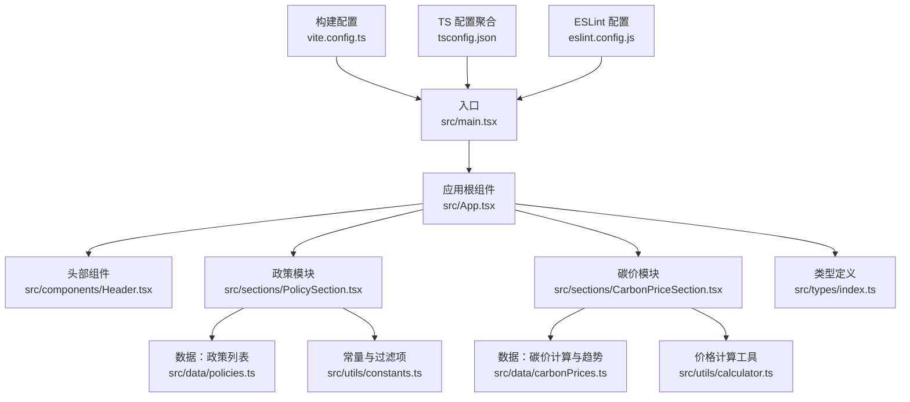
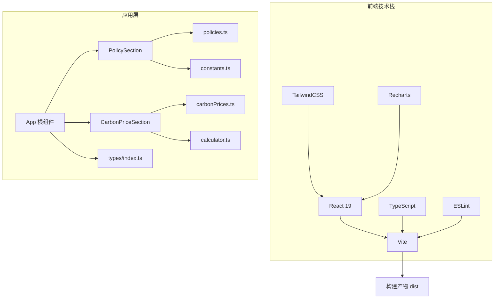
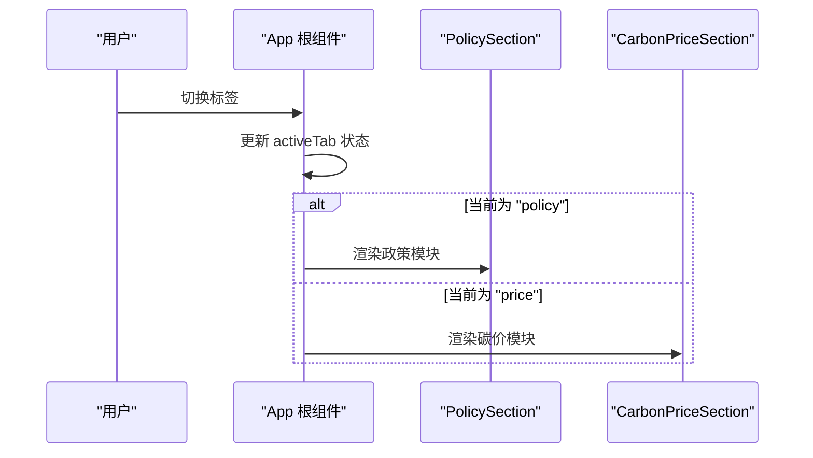
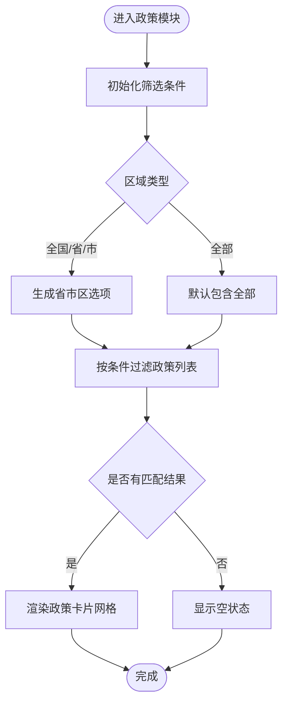
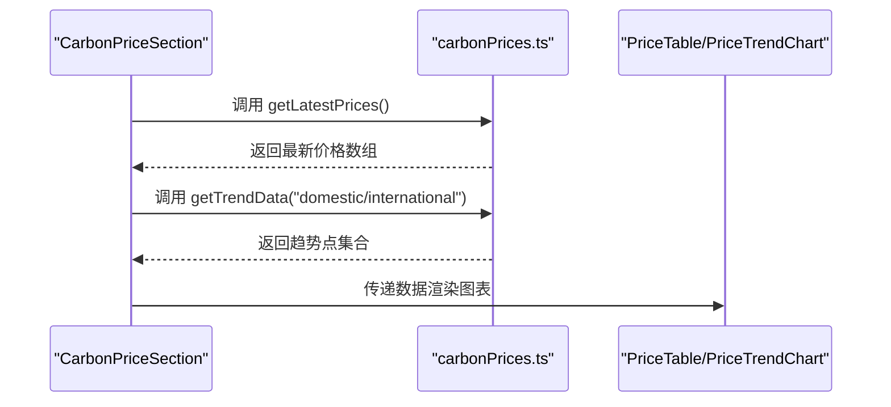
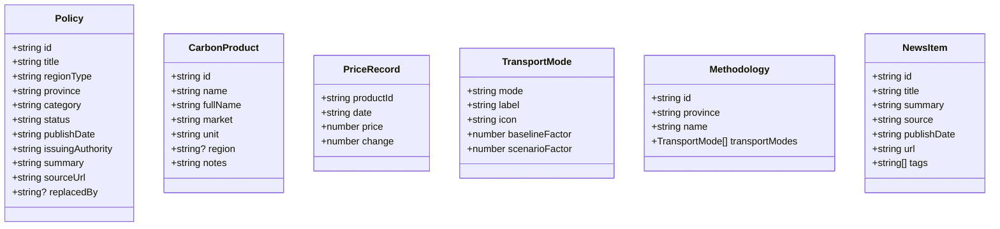
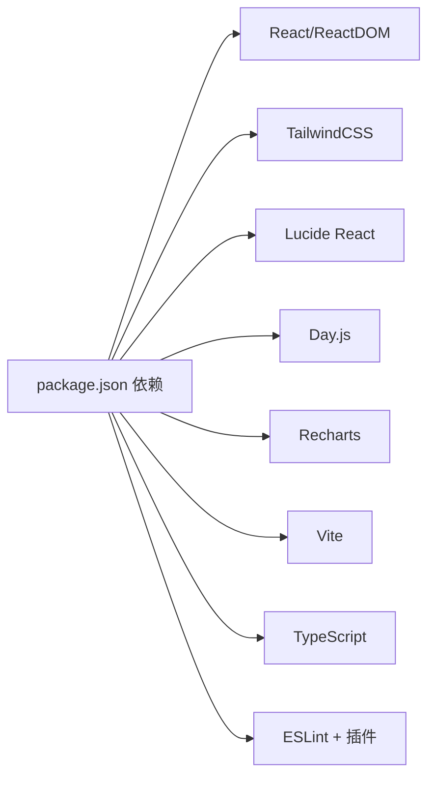

# 开发指南

<cite>
**本文引用的文件**
- [package.json](file://package.json)
- [eslint.config.js](file://eslint.config.js)
- [tsconfig.json](file://tsconfig.json)
- [vite.config.ts](file://vite.config.ts)
- [README.md](file://README.md)
- [src/main.tsx](file://src/main.tsx)
- [src/App.tsx](file://src/App.tsx)
- [src/types/index.ts](file://src/types/index.ts)
- [src/utils/constants.ts](file://src/utils/constants.ts)
- [src/utils/calculator.ts](file://src/utils/calculator.ts)
- [src/components/Header.tsx](file://src/components/Header.tsx)
- [src/data/policies.ts](file://src/data/policies.ts)
- [src/data/carbonPrices.ts](file://src/data/carbonPrices.ts)
- [src/sections/PolicySection.tsx](file://src/sections/PolicySection.tsx)
- [src/sections/CarbonPriceSection.tsx](file://src/sections/CarbonPriceSection.tsx)
</cite>

## 目录
1. [简介](#简介)
2. [项目结构](#项目结构)
3. [核心组件](#核心组件)
4. [架构总览](#架构总览)
5. [详细组件分析](#详细组件分析)
6. [依赖分析](#依赖分析)
7. [性能考虑](#性能考虑)
8. [故障排除指南](#故障排除指南)
9. [结论](#结论)
10. [附录](#附录)

## 简介
本指南面向“碳普惠信息代理”项目的开发者，提供从代码规范、TypeScript 配置、ESLint 规则到组件开发、测试策略、调试技巧、Git 工作流、版本控制规范、新功能开发模板、代码评审标准与发布流程的完整说明。同时覆盖性能优化、内存管理、渲染优化、开发环境配置与 IDE 设置、常见问题与团队协作规范，帮助团队高效协作并保持高质量交付。

## 项目结构
项目采用基于功能分层的组织方式：入口与应用根组件位于 src 根目录；页面级模块按功能划分为 sections；通用 UI 组件位于 components；类型定义集中在 types；业务数据与工具函数分别在 data 与 utils；构建与语言配置由 Vite、TypeScript 与 ESLint 共同支撑。

图表来源
- [src/main.tsx:1-11](file://src/main.tsx#L1-L11)
- [src/App.tsx:1-60](file://src/App.tsx#L1-L60)
- [src/components/Header.tsx:1-28](file://src/components/Header.tsx#L1-L28)
- [src/sections/PolicySection.tsx:1-89](file://src/sections/PolicySection.tsx#L1-L89)
- [src/sections/CarbonPriceSection.tsx:1-42](file://src/sections/CarbonPriceSection.tsx#L1-L42)
- [src/data/policies.ts:1-321](file://src/data/policies.ts#L1-L321)
- [src/data/carbonPrices.ts:1-103](file://src/data/carbonPrices.ts#L1-L103)
- [src/utils/constants.ts:1-44](file://src/utils/constants.ts#L1-L44)
- [src/utils/calculator.ts:1-12](file://src/utils/calculator.ts#L1-L12)
- [src/types/index.ts:1-65](file://src/types/index.ts#L1-L65)
- [vite.config.ts:1-8](file://vite.config.ts#L1-L8)
- [tsconfig.json:1-8](file://tsconfig.json#L1-L8)
- [eslint.config.js:1-24](file://eslint.config.js#L1-L24)

章节来源
- [src/main.tsx:1-11](file://src/main.tsx#L1-L11)
- [src/App.tsx:1-60](file://src/App.tsx#L1-L60)
- [vite.config.ts:1-8](file://vite.config.ts#L1-L8)
- [tsconfig.json:1-8](file://tsconfig.json#L1-L8)
- [eslint.config.js:1-24](file://eslint.config.js#L1-L24)

## 核心组件
- 应用根组件负责页面布局、顶部导航与页脚展示，并根据当前标签切换渲染不同功能区。
- 头部组件负责平台标题、副标题与日期显示。
- 政策模块提供区域类型、省市区、政策类别与状态的多维筛选，并以卡片形式展示结果。
- 碳价模块提供最新价格表与国内外产品价格 30 天趋势图。
- 类型系统集中定义政策、碳价产品、价格记录、运输方式与方法学等数据模型。
- 常量与过滤项提供筛选下拉选项与产品元数据。
- 计算工具提供碳减排量计算逻辑。

章节来源
- [src/App.tsx:1-60](file://src/App.tsx#L1-L60)
- [src/components/Header.tsx:1-28](file://src/components/Header.tsx#L1-L28)
- [src/sections/PolicySection.tsx:1-89](file://src/sections/PolicySection.tsx#L1-L89)
- [src/sections/CarbonPriceSection.tsx:1-42](file://src/sections/CarbonPriceSection.tsx#L1-L42)
- [src/types/index.ts:1-65](file://src/types/index.ts#L1-L65)
- [src/utils/constants.ts:1-44](file://src/utils/constants.ts#L1-L44)
- [src/utils/calculator.ts:1-12](file://src/utils/calculator.ts#L1-L12)

## 架构总览
应用采用 React + TypeScript + Vite 技术栈，使用 TailwindCSS 进行样式设计，Recharts 展示图表数据。构建与开发体验通过 Vite 提供热更新与快速打包；ESLint 与 TypeScript 提供静态检查与类型安全；TailwindCSS 作为原子化样式框架。

图表来源
- [package.json:12-34](file://package.json#L12-L34)
- [vite.config.ts:1-8](file://vite.config.ts#L1-L8)
- [eslint.config.js:1-24](file://eslint.config.js#L1-L24)
- [src/App.tsx:1-60](file://src/App.tsx#L1-L60)
- [src/sections/PolicySection.tsx:1-89](file://src/sections/PolicySection.tsx#L1-L89)
- [src/sections/CarbonPriceSection.tsx:1-42](file://src/sections/CarbonPriceSection.tsx#L1-L42)
- [src/data/policies.ts:1-321](file://src/data/policies.ts#L1-L321)
- [src/data/carbonPrices.ts:1-103](file://src/data/carbonPrices.ts#L1-L103)
- [src/utils/constants.ts:1-44](file://src/utils/constants.ts#L1-L44)
- [src/utils/calculator.ts:1-12](file://src/utils/calculator.ts#L1-L12)
- [src/types/index.ts:1-65](file://src/types/index.ts#L1-L65)

## 详细组件分析

### 应用根组件与页面布局
- 负责顶部导航栏与标签切换，依据当前激活标签渲染对应功能区。
- 使用图标库提供统一视觉标识，结合 TailwindCSS 实现响应式布局与主题色系。

图表来源
- [src/App.tsx:18-52](file://src/App.tsx#L18-L52)
- [src/sections/PolicySection.tsx:1-89](file://src/sections/PolicySection.tsx#L1-L89)
- [src/sections/CarbonPriceSection.tsx:1-42](file://src/sections/CarbonPriceSection.tsx#L1-L42)

章节来源
- [src/App.tsx:1-60](file://src/App.tsx#L1-L60)

### 政策模块与筛选逻辑
- 支持区域类型、省市区、政策类别与状态四维筛选，筛选结果以卡片网格展示。
- 省市区筛选会根据区域类型动态过滤可选项，避免无效组合。

图表来源
- [src/sections/PolicySection.tsx:9-34](file://src/sections/PolicySection.tsx#L9-L34)
- [src/utils/constants.ts:1-44](file://src/utils/constants.ts#L1-L44)
- [src/data/policies.ts:1-321](file://src/data/policies.ts#L1-L321)

章节来源
- [src/sections/PolicySection.tsx:1-89](file://src/sections/PolicySection.tsx#L1-L89)
- [src/utils/constants.ts:1-44](file://src/utils/constants.ts#L1-L44)
- [src/data/policies.ts:1-321](file://src/data/policies.ts#L1-L321)

### 碳价模块与趋势图表
- 提供最新价格表与国内外产品价格 30 天趋势图，数据通过工具函数生成与聚合。
- 国内外市场分别渲染独立图表，便于对比分析。

图表来源
- [src/sections/CarbonPriceSection.tsx:8-41](file://src/sections/CarbonPriceSection.tsx#L8-L41)
- [src/data/carbonPrices.ts:55-103](file://src/data/carbonPrices.ts#L55-L103)

章节来源
- [src/sections/CarbonPriceSection.tsx:1-42](file://src/sections/CarbonPriceSection.tsx#L1-L42)
- [src/data/carbonPrices.ts:1-103](file://src/data/carbonPrices.ts#L1-L103)

### 数据与工具链
- 类型系统集中定义政策、碳价产品、价格记录、运输方式与新闻等数据模型，确保跨模块一致性。
- 常量与过滤项提供筛选维度与产品元数据，减少硬编码。
- 计算工具提供碳减排量计算逻辑，支持以吨与千克两种单位返回结果。

图表来源
- [src/types/index.ts:1-65](file://src/types/index.ts#L1-L65)

章节来源
- [src/types/index.ts:1-65](file://src/types/index.ts#L1-L65)
- [src/utils/constants.ts:1-44](file://src/utils/constants.ts#L1-L44)
- [src/utils/calculator.ts:1-12](file://src/utils/calculator.ts#L1-L12)

## 依赖分析
- 构建与运行时：React、ReactDOM、TailwindCSS、Lucide React、Day.js、Recharts。
- 开发依赖：@vitejs/plugin-react、@tailwindcss/vite、typescript、@types/react、@types/react-dom、eslint、typescript-eslint、globals、@eslint/js、eslint-plugin-react-hooks、eslint-plugin-react-refresh。
- 构建与脚本：dev、build、lint、preview。

图表来源
- [package.json:12-34](file://package.json#L12-L34)

章节来源
- [package.json:1-36](file://package.json#L1-36)

## 性能考虑
- 渲染优化
  - 使用 React.memo 或 useMemo 缓存昂贵计算与子组件渲染，避免不必要的重渲染。
  - 在政策模块中对筛选结果与省市区选项使用 useMemo，降低每次渲染的计算成本。
- 数据生成与缓存
  - 碳价历史数据通过确定性随机算法生成，建议在首次生成后缓存，避免重复计算。
  - 对趋势数据按市场维度拆分，减少单次渲染的数据体量。
- 图表性能
  - Recharts 默认具备较好的虚拟化能力，建议限制一次性渲染的数据点数量或采用分页/懒加载策略。
- 样式与资源
  - TailwindCSS 原子类提升样式复用效率，避免过度嵌套导致的样式膨胀。
- 打包与体积
  - 使用 Vite 的按需加载与 Tree-shaking，确保生产构建最小化。

章节来源
- [src/sections/PolicySection.tsx:15-34](file://src/sections/PolicySection.tsx#L15-L34)
- [src/data/carbonPrices.ts:5-17](file://src/data/carbonPrices.ts#L5-L17)

## 故障排除指南
- ESLint 报错
  - 检查 eslint.config.js 中的扩展与语言选项是否正确配置，必要时参考 README 中的类型感知规则升级方案。
- TypeScript 类型错误
  - 确认 tsconfig.json 引用了 app 与 node 两个配置文件，确保类型检查覆盖完整。
- 构建失败
  - 按顺序执行清理与重新安装依赖，确认 Vite 插件（React、TailwindCSS）版本兼容。
- 图表不显示或数据异常
  - 核查 carbonPrices.ts 的数据生成逻辑与时间轴格式，确保趋势点键名与数据结构一致。
- 样式未生效
  - 确认 TailwindCSS 插件已启用，且未被其他样式覆盖。

章节来源
- [eslint.config.js:1-24](file://eslint.config.js#L1-L24)
- [tsconfig.json:1-8](file://tsconfig.json#L1-L8)
- [README.md:14-74](file://README.md#L14-L74)
- [vite.config.ts:1-8](file://vite.config.ts#L1-L8)
- [src/data/carbonPrices.ts:85-103](file://src/data/carbonPrices.ts#L85-L103)

## 结论
本指南提供了从架构到实现细节的全栈开发指引，涵盖代码规范、配置体系、组件开发、性能优化与故障排除。建议团队在日常开发中严格遵循 ESLint 与 TypeScript 规范，配合 Vite 快速迭代，持续优化渲染与数据处理性能，确保高质量交付。

## 附录

### 代码规范与命名约定
- 文件与目录
  - 页面模块：sections 下以名词短语命名，如 PolicySection、CarbonPriceSection。
  - 通用组件：components 下以名词命名，如 Header、SectionCard。
  - 工具与常量：utils 下以动词或描述性名词命名，如 constants、calculator。
  - 数据：data 下以领域名词命名，如 policies、carbonPrices。
- 组件命名
  - 函数组件使用帕斯卡命名法，导出默认组件。
  - Props 与状态变量使用驼峰命名，布尔值前缀建议使用 is/has/can 等。
- 类型与接口
  - 接口以大写字母开头，属性使用小写驼峰，可选字段显式标注。
  - 枚举或联合类型优先使用字面量联合，避免字符串字面量散落各处。
- 命名空间与模块
  - 类型定义集中于 types/index.ts，避免跨模块重复定义。
  - 常量集中于 utils/constants.ts，便于统一维护与复用。

### TypeScript 配置与 ESLint 规则
- TypeScript
  - 使用 tsconfig.json 聚合 app 与 node 配置，确保类型检查覆盖浏览器与 Node 环境。
- ESLint
  - 使用 flat 配置风格，启用推荐规则与 React Hooks、React Refresh 插件。
  - 可按 README 建议升级为类型感知规则集，提升类型相关检查精度。

章节来源
- [tsconfig.json:1-8](file://tsconfig.json#L1-L8)
- [eslint.config.js:1-24](file://eslint.config.js#L1-L24)
- [README.md:14-74](file://README.md#L14-L74)

### 组件开发流程
- 设计阶段
  - 明确组件职责与边界，定义输入输出（Props/State），绘制数据流向图。
- 实现阶段
  - 先写类型定义，再实现组件骨架，最后补充交互与样式。
  - 使用 useMemo/useCallback 缓存计算与回调，避免重复渲染。
- 测试阶段
  - 单元测试覆盖关键计算逻辑（如碳减排量计算）。
  - 集成测试验证筛选与渲染流程。
- 文档与评审
  - 为复杂组件编写使用说明与变更日志，提交前进行代码评审。

### 测试策略与调试技巧
- 单元测试
  - 针对工具函数（如 calculateReduction）编写断言，覆盖边界值与异常路径。
- 集成测试
  - 使用 React Testing Library 或类似方案，模拟用户操作与数据变化。
- 调试技巧
  - 使用 React DevTools Profiler 分析渲染热点。
  - 在 Vite 中开启严格模式，尽早暴露潜在问题。
  - 使用 ESLint 的自动修复与 TypeScript 的类型提示提升开发效率。

章节来源
- [src/utils/calculator.ts:1-12](file://src/utils/calculator.ts#L1-L12)

### Git 工作流程、分支管理与版本控制
- 分支策略
  - 主分支：main（受保护，仅允许合并请求）。
  - 功能分支：feature/前缀，如 feature/add-policy-filter。
  - 修复分支：fix/前缀，如 fix/carbon-price-chart-render。
  - 预发布分支：release/前缀，如 release/v1.2.0。
- 提交规范
  - 类型：feat、fix、docs、style、refactor、test、chore。
  - 示例：feat(types): 新增政策状态枚举类型。
- 合并与发布
  - 使用 Squash Merge 合并功能分支，确保提交历史整洁。
  - 版本号遵循语义化版本，发布前执行 lint、build、preview 验证。

### 新功能开发模板
- 步骤
  - 创建功能分支，新增类型定义与数据源。
  - 实现页面模块与子组件，确保可筛选与可展示。
  - 补充单元测试与集成测试，修复 ESLint/TS 报错。
  - 提交 PR，等待代码评审与自动化检查通过。
- 模板文件
  - sections/YourFeatureSection.tsx
  - data/yourFeatureData.ts
  - utils/yourFeatureUtils.ts
  - tests/yourFeature.test.tsx

### 代码评审标准
- 正确性：逻辑清晰、边界处理完备、无明显缺陷。
- 可读性：命名规范、注释充分、结构清晰。
- 性能：避免重复计算与渲染、合理使用缓存。
- 安全：输入校验、URL 与链接校验、权限与可见性控制。
- 兼容性：浏览器与设备适配、样式与交互一致性。

### 发布流程
- 本地
  - 运行 lint、build、preview，确保无错误与异常。
- 远程
  - 推送分支并创建 PR，触发 CI 检查。
  - 评审通过后合并至 main，打 Tag 并发布预览或生产环境。

### 开发环境配置与 IDE 推荐
- VS Code
  - 插件：ESLint、TypeScript Importer、Tailwind CSS IntelliSense、ES7+ React/Redux/React-Native snippets。
  - 设置：启用 ESLint 自动修复、保存时格式化、TypeScript 严格模式。
- Node 版本
  - 使用与项目依赖兼容的 LTS 版本，确保 Vite 与插件稳定运行。
- 环境变量
  - 如需环境区分，可在根目录新增 .env.development/.env.production 并在 Vite 中读取。

### 常见问题与团队协作规范
- 常见问题
  - ESLint 与 TypeScript 冲突：统一使用 flat 配置，确保解析器与项目路径正确。
  - TailwindCSS 未生效：确认插件已启用且未被覆盖。
  - 图表数据为空：核对时间轴与键名映射，确保数据生成逻辑正确。
- 协作规范
  - 统一代码风格与提交信息格式，定期回顾与优化流程。
  - 对复杂改动进行文档化与知识分享，提升团队整体效率。