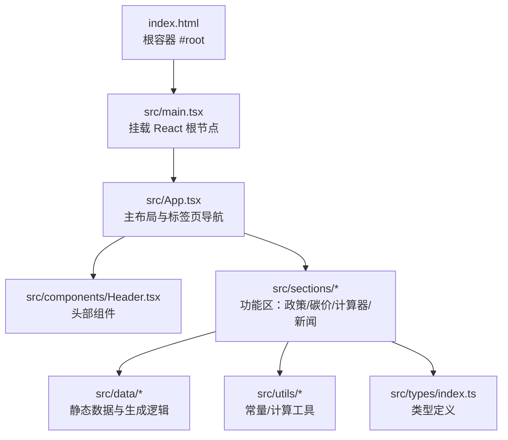
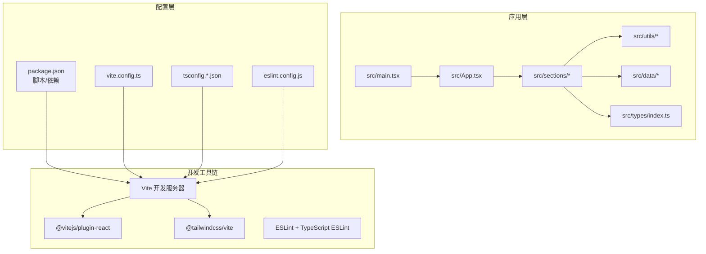
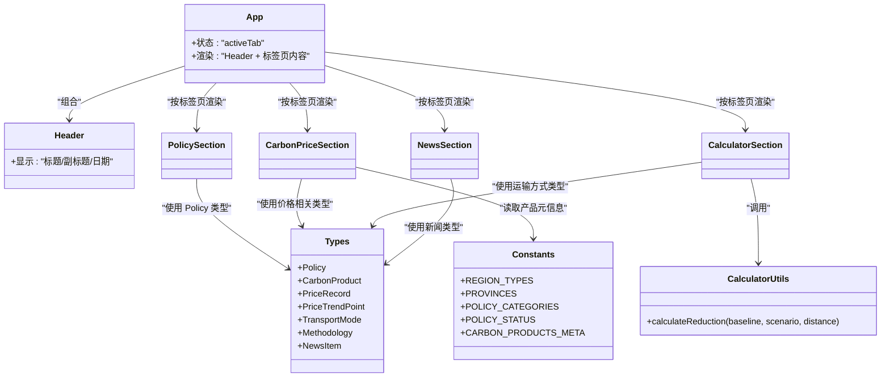
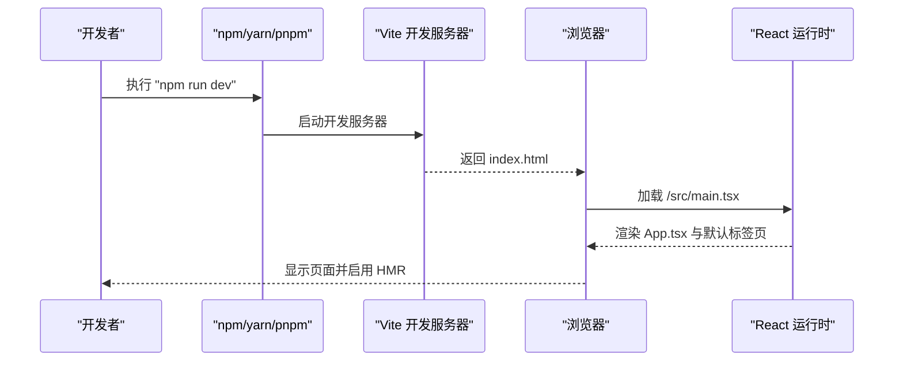
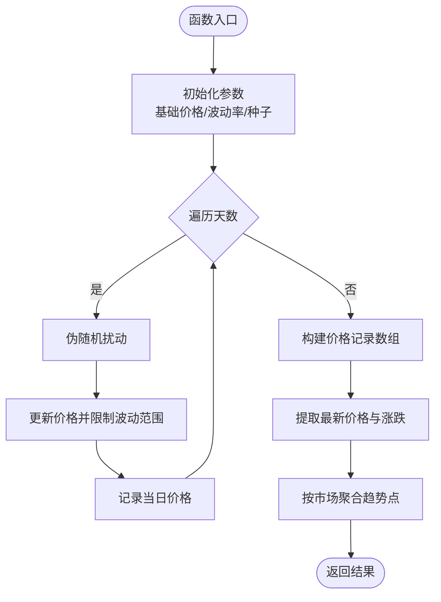

# 快速开始

<cite>
**本文引用的文件**
- [package.json](file://package.json)
- [vite.config.ts](file://vite.config.ts)
- [eslint.config.js](file://eslint.config.js)
- [tsconfig.json](file://tsconfig.json)
- [tsconfig.app.json](file://tsconfig.app.json)
- [tsconfig.node.json](file://tsconfig.node.json)
- [index.html](file://index.html)
- [src/main.tsx](file://src/main.tsx)
- [src/App.tsx](file://src/App.tsx)
- [src/components/Header.tsx](file://src/components/Header.tsx)
- [src/types/index.ts](file://src/types/index.ts)
- [src/utils/constants.ts](file://src/utils/constants.ts)
- [src/utils/calculator.ts](file://src/utils/calculator.ts)
- [src/data/policies.ts](file://src/data/policies.ts)
- [src/data/carbonPrices.ts](file://src/data/carbonPrices.ts)
- [src/data/emissionFactors.ts](file://src/data/emissionFactors.ts)
- [README.md](file://README.md)
</cite>

## 目录
1. [简介](#简介)
2. [项目结构](#项目结构)
3. [核心组件](#核心组件)
4. [架构总览](#架构总览)
5. [详细组件分析](#详细组件分析)
6. [依赖分析](#依赖分析)
7. [性能考虑](#性能考虑)
8. [故障排除指南](#故障排除指南)
9. [结论](#结论)
10. [附录](#附录)

## 简介
本指南帮助新开发者在最短时间内成功运行“碳普惠信息代理”项目，涵盖环境要求、依赖安装、开发服务器启动、常用命令、首次运行验证与常见问题排查。项目基于 React 19、TypeScript、Vite 以及 TailwindCSS，采用模块化组织结构，包含政策、碳价、计算器、新闻四大板块。

## 项目结构
项目采用前端单页应用（SPA）结构，入口为 HTML 模板与 React 根节点，页面通过路由式标签页切换展示不同功能区。TypeScript 配置拆分为应用与 Node 环境两套 tsconfig，配合 Vite 插件体系实现开发与构建。

图表来源
- [index.html:1-14](file://index.html#L1-L14)
- [src/main.tsx:1-11](file://src/main.tsx#L1-L11)
- [src/App.tsx:1-60](file://src/App.tsx#L1-L60)
- [src/components/Header.tsx:1-26](file://src/components/Header.tsx#L1-L26)

章节来源
- [index.html:1-14](file://index.html#L1-L14)
- [src/main.tsx:1-11](file://src/main.tsx#L1-L11)
- [src/App.tsx:1-60](file://src/App.tsx#L1-L60)
- [src/components/Header.tsx:1-26](file://src/components/Header.tsx#L1-L26)

## 核心组件
- 应用入口与挂载
  - HTML 提供根容器，React 在 main.tsx 中挂载根组件。
- 主应用组件
  - App.tsx 负责顶部标签页导航与内容区域渲染，支持政策、碳价、计算器、新闻四个标签页。
- 头部组件
  - Header.tsx 展示站点标题、副标题与当前日期。
- 类型系统
  - types/index.ts 定义政策、碳价、排放、新闻等核心类型，保证数据一致性。
- 工具与常量
  - utils/constants.ts 提供筛选维度（地区、政策分类、状态）与产品元信息。
  - utils/calculator.ts 提供出行减碳量计算逻辑。
- 数据层
  - data/policies.ts 提供全国及多地政策与方法学数据。
  - data/carbonPrices.ts 生成历史价格与最新价格、趋势数据。
  - data/emissionFactors.ts 提供多城市低炭出行基准与情景因子。

章节来源
- [src/main.tsx:1-11](file://src/main.tsx#L1-L11)
- [src/App.tsx:1-60](file://src/App.tsx#L1-L60)
- [src/components/Header.tsx:1-26](file://src/components/Header.tsx#L1-L26)
- [src/types/index.ts:1-65](file://src/types/index.ts#L1-L65)
- [src/utils/constants.ts:1-44](file://src/utils/constants.ts#L1-L44)
- [src/utils/calculator.ts:1-12](file://src/utils/calculator.ts#L1-L12)
- [src/data/policies.ts:1-318](file://src/data/policies.ts#L1-L318)
- [src/data/carbonPrices.ts:1-103](file://src/data/carbonPrices.ts#L1-L103)
- [src/data/emissionFactors.ts:1-103](file://src/data/emissionFactors.ts#L1-L103)

## 架构总览
项目采用“前端直出 + 构建时优化”的架构，开发阶段由 Vite 提供 HMR 与快速热更新；生产构建使用 Vite 打包，TypeScript 编译与类型检查分离到独立配置文件中。

图表来源
- [package.json:1-36](file://package.json#L1-L36)
- [vite.config.ts:1-8](file://vite.config.ts#L1-L8)
- [tsconfig.json:1-8](file://tsconfig.json#L1-L8)
- [tsconfig.app.json:1-29](file://tsconfig.app.json#L1-L29)
- [tsconfig.node.json:1-27](file://tsconfig.node.json#L1-L27)
- [eslint.config.js:1-24](file://eslint.config.js#L1-L24)
- [src/main.tsx:1-11](file://src/main.tsx#L1-L11)
- [src/App.tsx:1-60](file://src/App.tsx#L1-L60)

## 详细组件分析

### 组件关系类图（代码级）

图表来源
- [src/App.tsx:1-60](file://src/App.tsx#L1-L60)
- [src/components/Header.tsx:1-26](file://src/components/Header.tsx#L1-L26)
- [src/utils/calculator.ts:1-12](file://src/utils/calculator.ts#L1-L12)
- [src/utils/constants.ts:1-44](file://src/utils/constants.ts#L1-L44)
- [src/types/index.ts:1-65](file://src/types/index.ts#L1-L65)

章节来源
- [src/App.tsx:1-60](file://src/App.tsx#L1-L60)
- [src/components/Header.tsx:1-26](file://src/components/Header.tsx#L1-L26)
- [src/utils/calculator.ts:1-12](file://src/utils/calculator.ts#L1-L12)
- [src/utils/constants.ts:1-44](file://src/utils/constants.ts#L1-L44)
- [src/types/index.ts:1-65](file://src/types/index.ts#L1-L65)

### 开发流程时序图（从命令到页面）

图表来源
- [package.json:6-11](file://package.json#L6-L11)
- [index.html:1-14](file://index.html#L1-L14)
- [src/main.tsx:1-11](file://src/main.tsx#L1-L11)
- [src/App.tsx:1-60](file://src/App.tsx#L1-L60)

章节来源
- [package.json:6-11](file://package.json#L6-L11)
- [index.html:1-14](file://index.html#L1-L14)
- [src/main.tsx:1-11](file://src/main.tsx#L1-L11)
- [src/App.tsx:1-60](file://src/App.tsx#L1-L60)

### 碳价数据生成流程（算法实现）

图表来源
- [src/data/carbonPrices.ts:5-17](file://src/data/carbonPrices.ts#L5-L17)
- [src/data/carbonPrices.ts:33-53](file://src/data/carbonPrices.ts#L33-L53)
- [src/data/carbonPrices.ts:55-83](file://src/data/carbonPrices.ts#L55-L83)
- [src/data/carbonPrices.ts:85-102](file://src/data/carbonPrices.ts#L85-L102)

章节来源
- [src/data/carbonPrices.ts:1-103](file://src/data/carbonPrices.ts#L1-L103)

## 依赖分析
- 包管理与脚本
  - 使用 npm 脚本统一管理开发、构建、预览与代码检查。
- 生产依赖
  - React 19、React DOM、TailwindCSS v4、@tailwindcss/vite、Recharts、Lucide React、Day.js。
- 开发依赖
  - Vite、@vitejs/plugin-react、TypeScript、ESLint 及相关插件。
- 配置文件
  - vite.config.ts 启用 React 与 TailwindCSS 插件。
  - tsconfig.json 引入 app 与 node 两套配置，分别用于应用与工具链。
  - eslint.config.js 集成 JS/TS 推荐规则与 React Hooks/Refresh 规则。

章节来源
- [package.json:12-34](file://package.json#L12-L34)
- [vite.config.ts:1-8](file://vite.config.ts#L1-L8)
- [tsconfig.json:1-8](file://tsconfig.json#L1-L8)
- [tsconfig.app.json:1-29](file://tsconfig.app.json#L1-L29)
- [tsconfig.node.json:1-27](file://tsconfig.node.json#L1-L27)
- [eslint.config.js:1-24](file://eslint.config.js#L1-L24)

## 性能考虑
- 开发体验
  - Vite 提供极快的冷启动与热更新，建议使用现代浏览器以获得最佳 HMR 体验。
- 构建优化
  - TypeScript 分离编译与类型检查，减少构建时间；TailwindCSS 按需生成样式，避免全量引入。
- 代码质量
  - ESLint 与 TypeScript ESLint 结合，开启严格模式与未使用变量/参数检查，降低运行时风险。

## 故障排除指南
- Node.js 版本不兼容
  - 症状：安装或启动时报错，提示版本过低。
  - 处理：升级至推荐的 Node.js LTS 版本后再重试。
- 包管理器缓存问题
  - 症状：安装依赖失败或模块缺失。
  - 处理：清理缓存后重装依赖（例如 npm ci 或删除 node_modules 与锁文件后重新安装）。
- Vite 启动端口被占用
  - 症状：无法启动开发服务器，提示端口冲突。
  - 处理：修改 Vite 配置中的端口或释放占用端口。
- TailwindCSS 样式未生效
  - 症状：页面无样式或部分样式异常。
  - 处理：确认 TailwindCSS 插件已正确加载，检查内容路径与构建输出目录。
- ESLint 报错
  - 症状：编辑器或命令行出现大量规则报错。
  - 处理：根据报错逐项修复，必要时调整 ESLint 配置或忽略特定文件。
- TypeScript 类型错误
  - 症状：构建失败或编辑器提示类型不匹配。
  - 处理：对照 types/index.ts 的接口定义修正数据结构，确保字段完整且类型一致。

章节来源
- [package.json:6-11](file://package.json#L6-L11)
- [vite.config.ts:1-8](file://vite.config.ts#L1-L8)
- [eslint.config.js:1-24](file://eslint.config.js#L1-L24)
- [tsconfig.app.json:19-25](file://tsconfig.app.json#L19-L25)
- [tsconfig.node.json:17-23](file://tsconfig.node.json#L17-L23)

## 结论
通过本快速开始指南，您可以在本地完成环境准备、依赖安装与开发服务器启动，并验证页面功能。项目结构清晰、配置明确，结合 TypeScript 与 ESLint 能力，有助于快速迭代与长期维护。遇到问题时，可依据“故障排除指南”定位并解决常见问题。

## 附录

### 环境要求
- Node.js：建议使用 LTS 版本（具体版本请参考团队内部约定或 CI/CD 约束）。
- 包管理器：npm（推荐使用与项目脚本一致的版本）。
- 浏览器：现代浏览器以获得最佳 HMR 体验。

章节来源
- [package.json:6-11](file://package.json#L6-L11)

### 依赖安装步骤
- 在项目根目录执行安装命令，等待依赖下载完成。
- 若首次安装失败，请清理缓存后重试。

章节来源
- [package.json:6-11](file://package.json#L6-L11)

### 开发服务器启动方法
- 执行开发命令，等待浏览器自动打开或手动访问本地地址。
- 如需自定义端口，请在 Vite 配置中进行相应调整。

章节来源
- [package.json:7](file://package.json#L7)
- [vite.config.ts:5-7](file://vite.config.ts#L5-L7)

### 常用开发命令
- 开发：npm run dev
- 构建：npm run build
- 预览：npm run preview
- 代码检查：npm run lint

章节来源
- [package.json:6-11](file://package.json#L6-L11)

### 首次运行后的验证步骤
- 页面加载成功，显示头部标题与副标题。
- 顶部标签页可切换，点击后对应内容区渲染。
- 政策/碳价/计算器/新闻板块均能正常展示数据。
- 控制台无明显错误与警告。

章节来源
- [src/App.tsx:18-59](file://src/App.tsx#L18-L59)
- [src/components/Header.tsx:4-25](file://src/components/Header.tsx#L4-L25)

### 基本配置选项
- Vite 插件：React 与 TailwindCSS 插件已在配置中启用。
- TypeScript：应用与 Node 环境分别使用独立 tsconfig，严格模式开启。
- ESLint：集成 JS/TS 推荐规则与 React Hooks/Refresh 规则。

章节来源
- [vite.config.ts:1-8](file://vite.config.ts#L1-L8)
- [tsconfig.app.json:19-25](file://tsconfig.app.json#L19-L25)
- [tsconfig.node.json:17-23](file://tsconfig.node.json#L17-L23)
- [eslint.config.js:8-23](file://eslint.config.js#L8-L23)

### 项目背景与扩展建议
- 项目模板来自官方 React + TypeScript + Vite 模板，具备最小可用配置与 ESLint 规则。
- 如需启用 React Compiler，可参考 README 中的说明进行配置。

章节来源
- [README.md:1-74](file://README.md#L1-L74)