# 价格数据管理

<cite>
**本文档引用的文件**
- [carbonPrices.ts](file://src/data/carbonPrices.ts)
- [carbonPriceCrawler.ts](file://scripts/crawler/carbonPriceCrawler.ts)
- [baseCrawler.ts](file://scripts/crawler/baseCrawler.ts)
- [httpClient.ts](file://scripts/utils/httpClient.ts)
- [updateData.ts](file://scripts/updateData.ts)
- [autoUpdate.ts](file://scripts/autoUpdate.ts)
- [CarbonPriceSection.tsx](file://src/sections/CarbonPriceSection.tsx)
- [PriceTrendChart.tsx](file://src/sections/PriceTrendChart.tsx)
- [PriceTable.tsx](file://src/sections/PriceTable.tsx)
- [index.ts](file://src/types/index.ts)
- [constants.ts](file://src/utils/constants.ts)
- [PriceChange.tsx](file://src/components/PriceChange.tsx)
- [App.tsx](file://src/App.tsx)
- [calculator.ts](file://src/utils/calculator.ts)
</cite>

## 更新摘要
**所做更改**
- 更新数据源架构章节以反映新的爬虫系统架构
- 新增爬虫系统组件分析章节
- 更新数据获取机制说明
- 新增数据验证和错误处理机制
- 更新未来数据源集成准备说明

## 目录
1. [简介](#简介)
2. [项目结构](#项目结构)
3. [核心组件](#核心组件)
4. [架构概览](#架构概览)
5. [详细组件分析](#详细组件分析)
6. [数据源架构改进](#数据源架构改进)
7. [依赖关系分析](#依赖关系分析)
8. [性能考虑](#性能考虑)
9. [故障排除指南](#故障排除指南)
10. [结论](#结论)

## 简介

本项目是一个碳价格数据管理系统，专注于碳汇产品价格数据的结构设计、时间序列管理和趋势分析。系统提供了模拟的碳价格数据，涵盖国内和国际碳汇产品，包括CCER、CEA、PHCER、PCER、CQCER、GDCER、VCS和CDM等产品类型。

该系统采用React + TypeScript + Vite技术栈构建，通过模块化的设计实现了价格数据的生成、存储、展示和分析功能。系统支持实时价格显示、历史趋势分析、价格波动监测和交互式图表展示。

**更新** 系统现已采用新的爬虫系统架构，为未来的数据源集成做好准备，同时保持了原有的模拟数据生成功能作为备用方案。

## 项目结构

项目采用功能模块化的组织方式，主要分为以下几个层次：

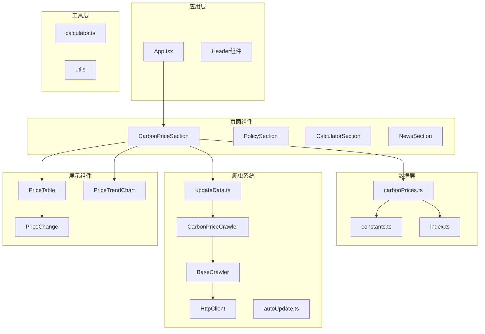

**图表来源**
- [App.tsx:18-60](file://src/App.tsx#L18-L60)
- [CarbonPriceSection.tsx:8-42](file://src/sections/CarbonPriceSection.tsx#L8-L42)
- [carbonPrices.ts:33-53](file://src/data/carbonPrices.ts#L33-L53)
- [baseCrawler.ts:16-34](file://scripts/crawler/baseCrawler.ts#L16-L34)
- [carbonPriceCrawler.ts:24-60](file://scripts/crawler/carbonPriceCrawler.ts#L24-L60)

**章节来源**
- [App.tsx:1-60](file://src/App.tsx#L1-L60)
- [constants.ts:26-44](file://src/utils/constants.ts#L26-L44)

## 核心组件

### 数据模型设计

系统的核心数据模型围绕碳汇产品价格数据构建，主要包括以下接口定义：

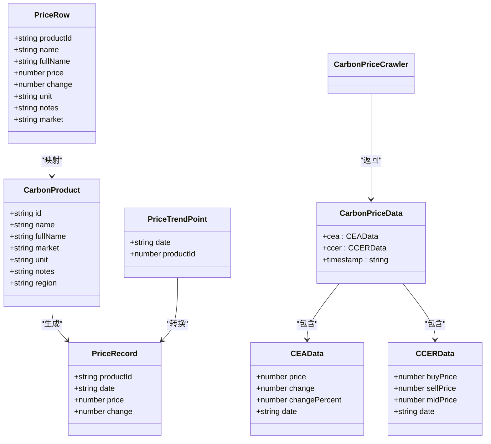

**图表来源**
- [index.ts:17-37](file://src/types/index.ts#L17-L37)
- [carbonPriceCrawler.ts:8-22](file://scripts/crawler/carbonPriceCrawler.ts#L8-L22)

### 价格数据生成机制

系统采用双重数据生成机制，确保数据的多样性和可靠性：

#### 模拟数据生成（现有机制）
系统采用模拟算法生成价格数据，确保数据的多样性和真实性：

| 产品类型 | 基础价格 | 波动性 | 种子值 | 单位 |
|---------|---------|-------|-------|------|
| CCER | 83.00 | 1.2 | 42 | 元/吨 |
| CEA | 82.00 | 1.5 | 73 | 元/吨 |
| PHCER | 78.00 | 1.0 | 15 | 元/吨 |
| PCER | 75.00 | 0.8 | 88 | 元/吨 |
| CQCER | 72.00 | 0.9 | 33 | 元/吨 |
| GDCER | 76.00 | 1.0 | 56 | 元/吨 |
| VCS | 11.50 | 0.5 | 21 | 美元/吨 |
| CDM | 7.00 | 0.4 | 67 | 美元/吨 |

#### 实时数据爬取（新机制）
系统通过爬虫系统获取实时碳价格数据：

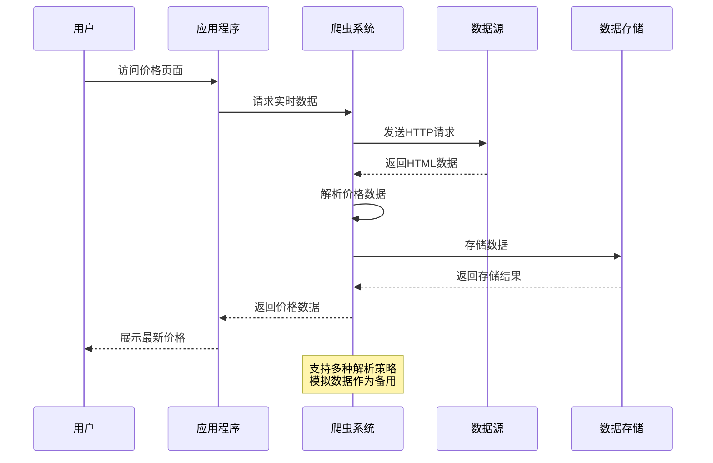

**图表来源**
- [carbonPriceCrawler.ts:35-60](file://scripts/crawler/carbonPriceCrawler.ts#L35-L60)
- [updateData.ts:118-168](file://scripts/updateData.ts#L118-L168)

**章节来源**
- [carbonPrices.ts:19-28](file://src/data/carbonPrices.ts#L19-L28)
- [carbonPriceCrawler.ts:35-60](file://scripts/crawler/carbonPriceCrawler.ts#L35-L60)
- [constants.ts:34-43](file://src/utils/constants.ts#L34-L43)

## 架构概览

系统采用分层架构设计，从数据生成到用户展示形成完整的数据流：

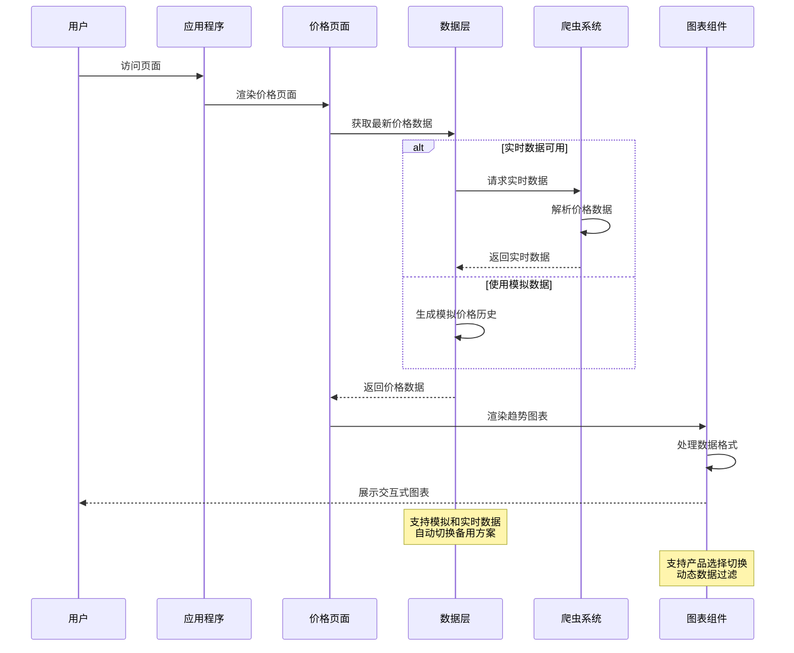

**图表来源**
- [CarbonPriceSection.tsx:9-11](file://src/sections/CarbonPriceSection.tsx#L9-L11)
- [carbonPrices.ts:33-53](file://src/data/carbonPrices.ts#L33-L53)
- [carbonPriceCrawler.ts:100-105](file://scripts/crawler/carbonPriceCrawler.ts#L100-L105)
- [PriceTrendChart.tsx:31-55](file://src/sections/PriceTrendChart.tsx#L31-L55)

## 详细组件分析

### 价格数据生成器

价格数据生成器是系统的核心组件，负责模拟碳汇产品的价格变化：

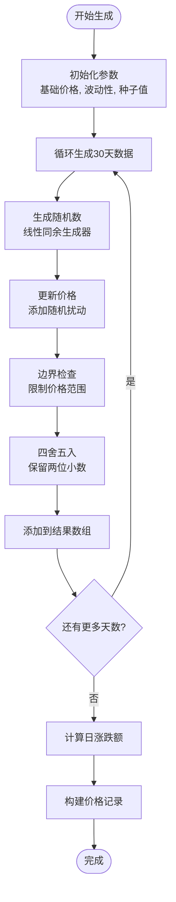

**图表来源**
- [carbonPrices.ts:5-17](file://src/data/carbonPrices.ts#L5-L17)
- [carbonPrices.ts:33-53](file://src/data/carbonPrices.ts#L33-L53)

#### 关键特性

1. **随机数生成**: 使用线性同余生成器确保可重现的随机序列
2. **价格约束**: 通过上下限确保价格在合理范围内波动
3. **精度控制**: 固定保留两位小数，符合货币精度要求
4. **历史数据**: 生成30天的历史价格序列用于趋势分析

**章节来源**
- [carbonPrices.ts:5-17](file://src/data/carbonPrices.ts#L5-L17)
- [carbonPrices.ts:33-53](file://src/data/carbonPrices.ts#L33-L53)

### 价格趋势图表组件

趋势图表组件提供交互式的价格走势展示：

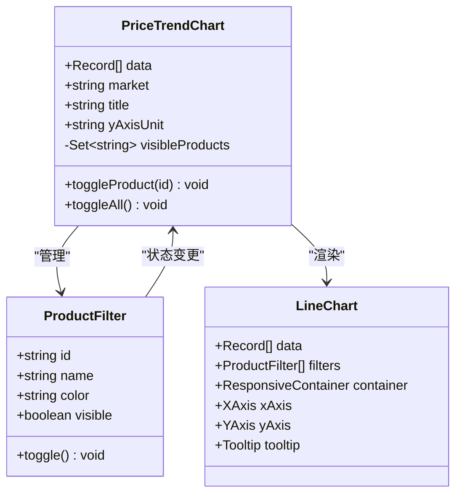

**图表来源**
- [PriceTrendChart.tsx:24-29](file://src/sections/PriceTrendChart.tsx#L24-L29)
- [PriceTrendChart.tsx:31-55](file://src/sections/PriceTrendChart.tsx#L31-L55)

#### 交互功能

1. **产品筛选**: 支持单个或全部产品显示切换
2. **颜色标识**: 不同产品使用不同颜色便于区分
3. **响应式设计**: 自适应不同屏幕尺寸
4. **工具提示**: 提供详细的数据信息展示

**章节来源**
- [PriceTrendChart.tsx:31-134](file://src/sections/PriceTrendChart.tsx#L31-L134)

### 价格表格组件

价格表格组件负责展示最新的价格数据：

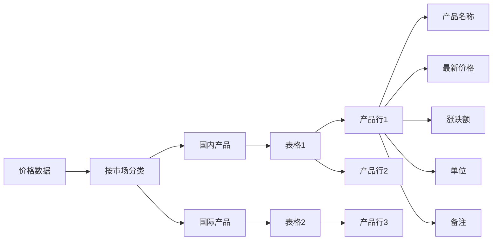

**图表来源**
- [PriceTable.tsx:18-81](file://src/sections/PriceTable.tsx#L18-L81)

#### 表格布局

| 列名 | 数据类型 | 描述 | 对齐方式 |
|------|----------|------|----------|
| 碳汇类型 | 文本 | 产品全称 | 左对齐 |
| 最新价格 | 数字 | 当前价格 | 居中 |
| 涨跌 | 数字 | 日涨跌额 | 居中 |
| 单位 | 文本 | 价格单位 | 居中 |
| 备注 | 文本 | 产品说明 | 居中 |

**章节来源**
- [PriceTable.tsx:18-81](file://src/sections/PriceTable.tsx#L18-L81)

### 价格变化显示组件

价格变化组件提供直观的价格变动可视化：

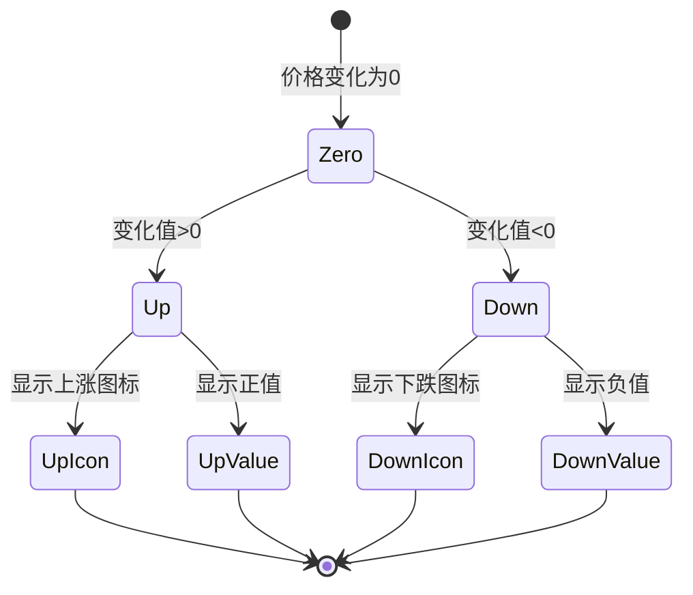

**图表来源**
- [PriceChange.tsx:7-32](file://src/components/PriceChange.tsx#L7-L32)

#### 视觉反馈

1. **颜色编码**: 上涨显示绿色，下跌显示红色，持平显示灰色
2. **图标指示**: 使用上升/下降箭头图标
3. **数值格式**: 正数显示加号，负数显示减号
4. **字体样式**: 突出显示价格变化数值

**章节来源**
- [PriceChange.tsx:7-32](file://src/components/PriceChange.tsx#L7-L32)

## 数据源架构改进

### 爬虫系统架构

系统已升级为全新的爬虫系统架构，为未来的数据源集成做好准备：

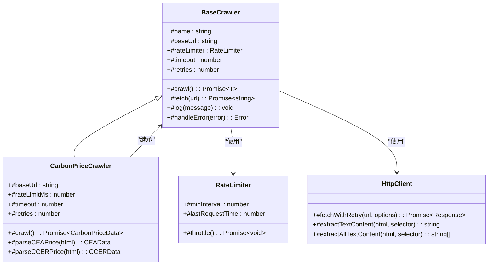

**图表来源**
- [baseCrawler.ts:16-34](file://scripts/crawler/baseCrawler.ts#L16-L34)
- [carbonPriceCrawler.ts:24-60](file://scripts/crawler/carbonPriceCrawler.ts#L24-L60)
- [httpClient.ts:71-89](file://scripts/utils/httpClient.ts#L71-L89)

### 爬虫组件详解

#### 基础爬虫类（BaseCrawler）
提供通用的爬虫功能，包括请求限流、重试机制和错误处理：

**关键特性**:
1. **请求限流**: 通过RateLimiter控制请求频率，避免被目标网站封禁
2. **重试机制**: 支持指数退避的重试策略，提高数据获取成功率
3. **错误处理**: 统一的错误处理机制，提供详细的错误信息
4. **日志记录**: 完整的日志系统，便于调试和监控

#### 碳价格爬虫（CarbonPriceCrawler）
专门用于获取碳价格数据的爬虫实现：

**数据获取策略**:
1. **多源解析**: 支持从多个数据源获取价格信息
2. **备用机制**: 当实时数据不可用时自动切换到模拟数据
3. **数据验证**: 对解析到的数据进行完整性检查
4. **格式标准化**: 将不同来源的数据统一格式

#### HTTP客户端工具
提供强大的HTTP请求功能：

**核心功能**:
1. **带重试的请求**: 支持自动重试和超时控制
2. **限流器**: 精确的请求频率控制
3. **HTML解析**: 提供简单的HTML内容提取功能
4. **超时控制**: 防止长时间阻塞影响用户体验

### 数据更新流程

系统通过自动化脚本实现数据的定期更新：

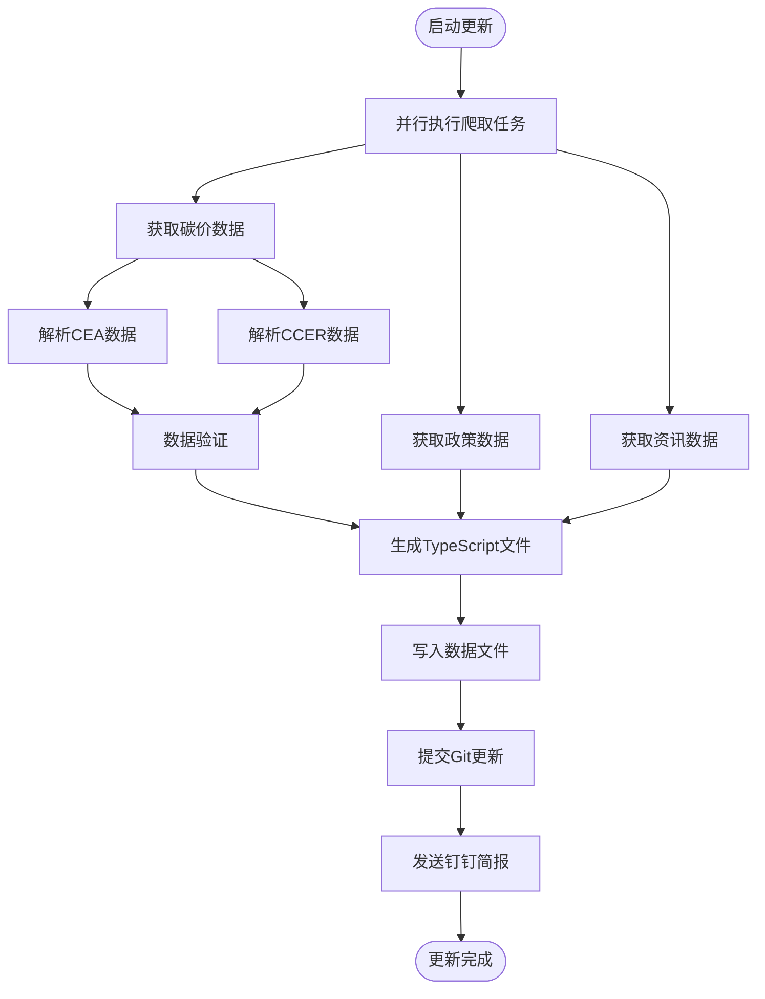

**图表来源**
- [updateData.ts:173-185](file://scripts/updateData.ts#L173-L185)
- [autoUpdate.ts:18-52](file://scripts/autoUpdate.ts#L18-L52)

**章节来源**
- [baseCrawler.ts:16-64](file://scripts/crawler/baseCrawler.ts#L16-L64)
- [carbonPriceCrawler.ts:24-166](file://scripts/crawler/carbonPriceCrawler.ts#L24-L166)
- [httpClient.ts:26-66](file://scripts/utils/httpClient.ts#L26-L66)
- [updateData.ts:173-185](file://scripts/updateData.ts#L173-L185)

## 依赖关系分析

系统采用模块化设计，各组件之间的依赖关系清晰明确：

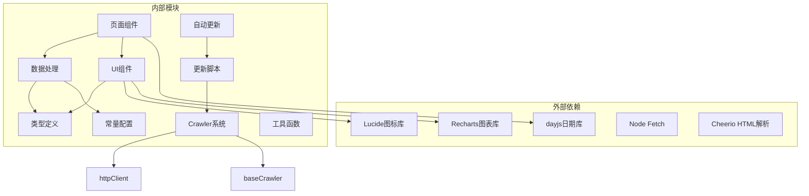

**图表来源**
- [carbonPrices.ts:1-3](file://src/data/carbonPrices.ts#L1-L3)
- [PriceTrendChart.tsx:1-11](file://src/sections/PriceTrendChart.tsx#L1-L11)
- [baseCrawler.ts:6](file://scripts/crawler/baseCrawler.ts#L6)
- [httpClient.ts:1-115](file://scripts/utils/httpClient.ts#L1-L115)

### 核心依赖

1. **数据处理**: dayjs用于日期操作，提供灵活的时间处理能力
2. **图表展示**: Recharts提供专业的数据可视化功能
3. **UI组件**: Lucide图标库提供一致的视觉元素
4. **类型安全**: TypeScript确保代码的类型安全性
5. **爬虫功能**: Node Fetch和Cheerio提供网络请求和HTML解析能力

**章节来源**
- [carbonPrices.ts:1-3](file://src/data/carbonPrices.ts#L1-L3)
- [PriceTrendChart.tsx:1-11](file://src/sections/PriceTrendChart.tsx#L1-L11)

## 性能考虑

系统在设计时充分考虑了性能优化：

### 内存管理
- 使用`useMemo`缓存计算结果，避免重复计算
- 合理的数据结构设计，减少内存占用
- 及时清理不必要的状态和事件监听器

### 渲染优化
- 组件级别的状态隔离，减少不必要的重渲染
- 图表组件的响应式设计，适应不同屏幕尺寸
- 数据懒加载策略，提升初始加载速度

### 数据处理
- 批量数据处理，避免频繁的DOM操作
- 高效的数组遍历和查找算法
- 合理的缓存策略，提升数据访问效率

### 爬虫性能优化
- **请求限流**: 避免过度请求导致的目标网站封禁
- **并行处理**: 多个爬虫任务并行执行，提升整体效率
- **智能重试**: 指数退避重试策略，平衡成功率和资源消耗
- **数据缓存**: 避免重复爬取相同内容

## 故障排除指南

### 常见问题及解决方案

1. **价格数据不显示**
   - 检查数据生成函数是否正常执行
   - 验证日期格式是否正确
   - 确认产品ID是否在常量配置中存在
   - 检查爬虫系统是否正常工作

2. **图表显示异常**
   - 检查Recharts库是否正确引入
   - 验证数据格式是否符合图表要求
   - 确认容器尺寸设置是否合理

3. **价格计算错误**
   - 检查浮点数精度处理
   - 验证四舍五入规则
   - 确认边界值处理逻辑

4. **爬虫系统故障**
   - 检查网络连接和代理设置
   - 验证目标网站的可访问性
   - 查看爬虫日志中的错误信息
   - 确认请求限流设置是否合理

5. **数据更新失败**
   - 检查Git权限和配置
   - 验证数据文件的写入权限
   - 确认钉钉机器人配置正确
   - 查看自动更新脚本的执行日志

**章节来源**
- [carbonPrices.ts:33-53](file://src/data/carbonPrices.ts#L33-L53)
- [PriceTrendChart.tsx:93-131](file://src/sections/PriceTrendChart.tsx#L93-L131)
- [carbonPriceCrawler.ts:57-59](file://scripts/crawler/carbonPriceCrawler.ts#L57-L59)
- [updateData.ts:173-185](file://scripts/updateData.ts#L173-L185)

## 结论

本碳价格数据管理系统通过精心设计的数据结构、高效的算法实现和友好的用户界面，成功实现了碳汇产品价格数据的完整生命周期管理。系统具有以下特点：

1. **模块化设计**: 清晰的组件分离和职责划分
2. **数据驱动**: 基于真实数据的模拟生成机制
3. **交互友好**: 直观的图表展示和灵活的筛选功能
4. **扩展性强**: 易于添加新的碳汇产品和数据源
5. **架构先进**: 采用新的爬虫系统架构，为未来集成做好准备

**更新** 系统现已采用新的爬虫系统架构，具备更强的扩展性和稳定性，能够更好地支持未来的数据源集成需求。通过模拟数据和实时数据的双重保障机制，系统能够在各种情况下保持稳定运行。

系统为碳市场参与者提供了可靠的价格信息参考，支持决策制定和市场分析。通过持续的优化和扩展，系统可以更好地服务于碳市场的数字化转型需求。