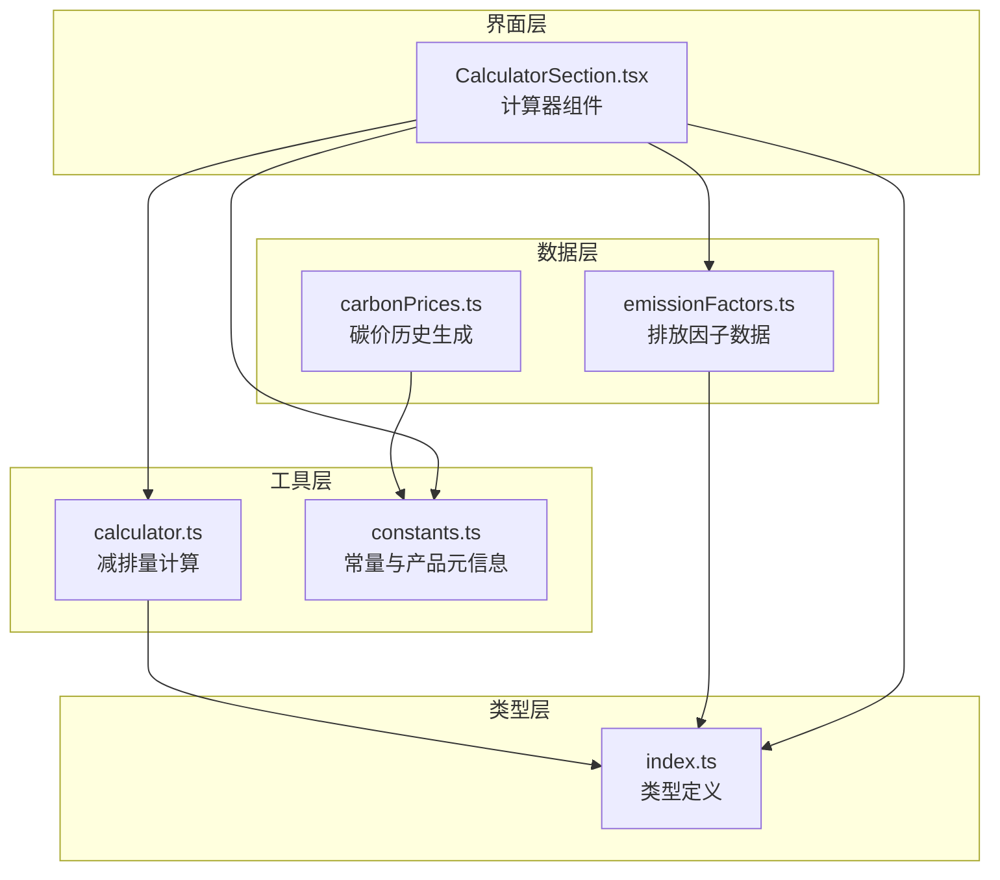
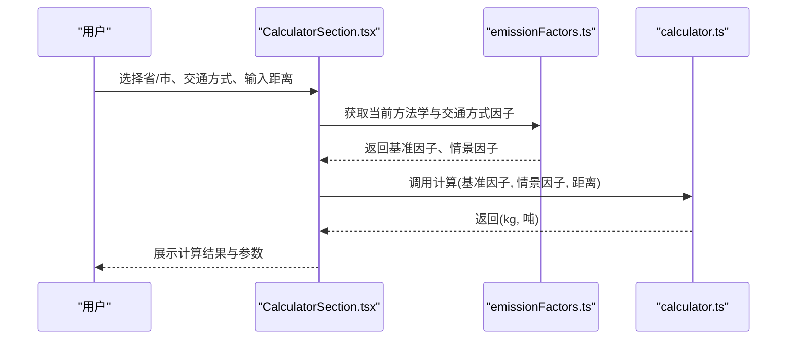
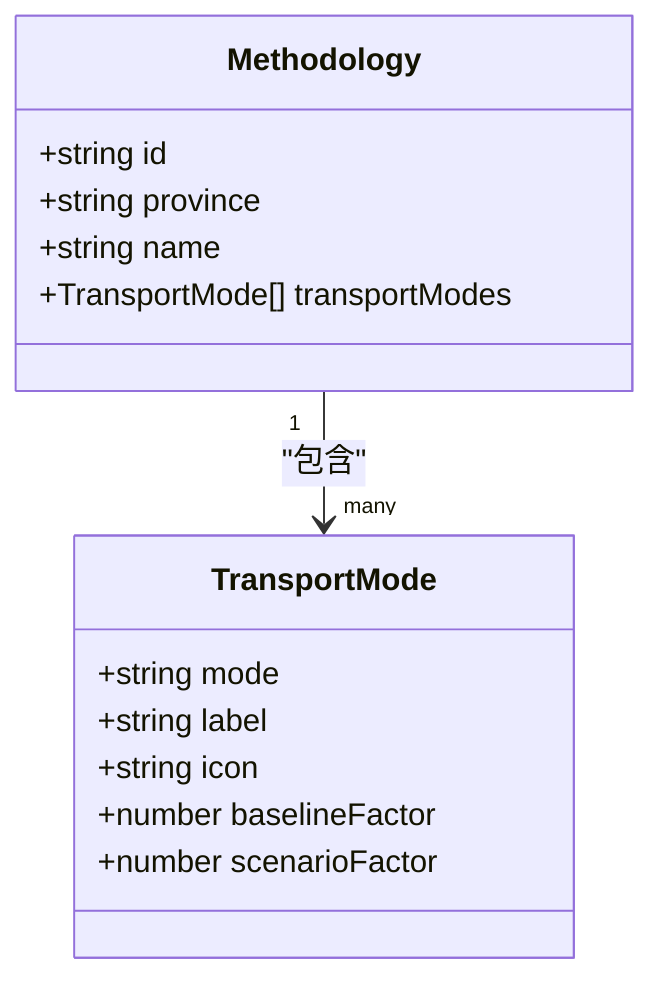
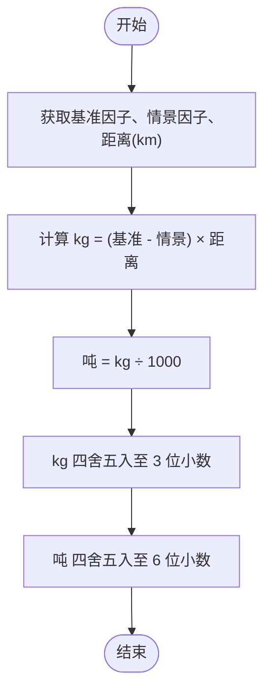
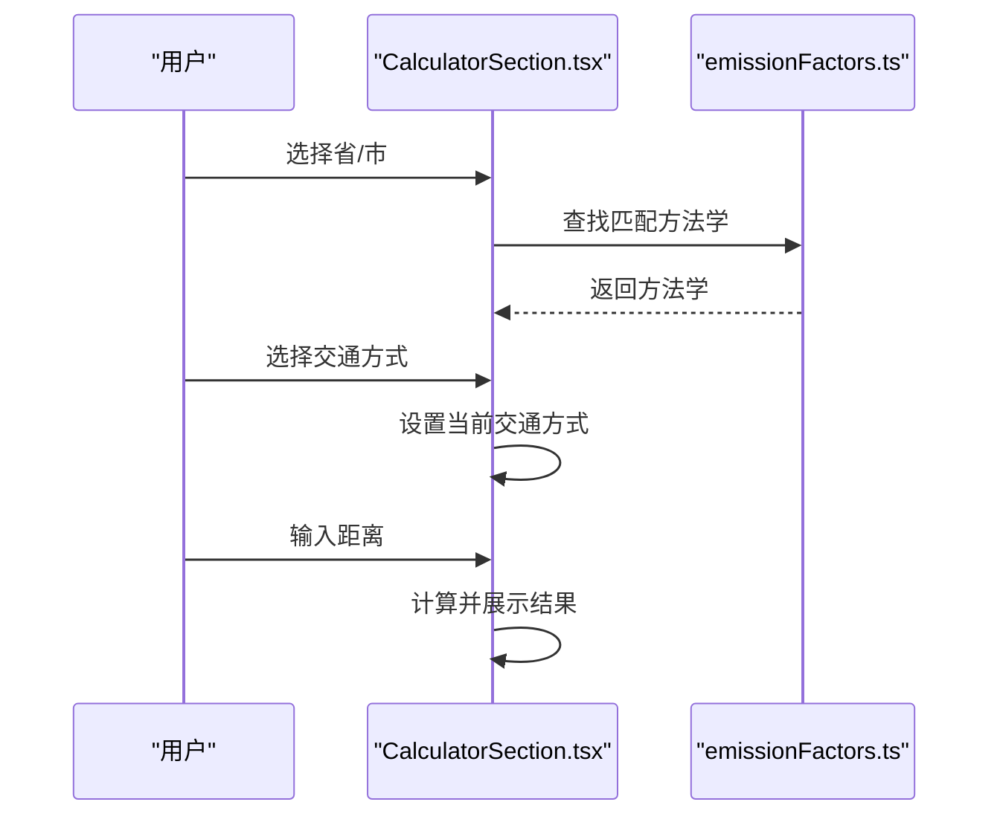
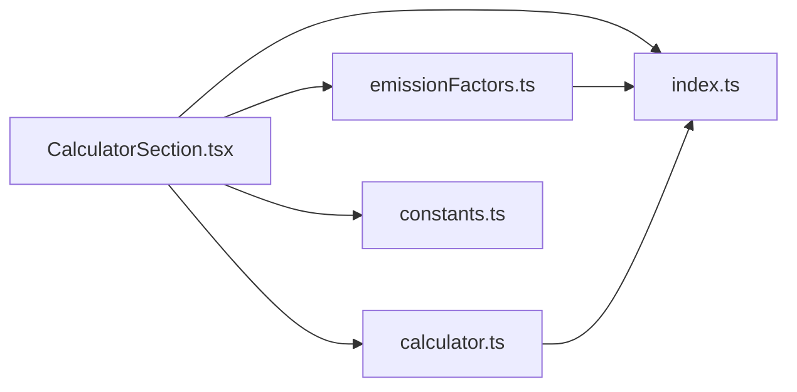

# 排放因子数据

<cite>
**本文引用的文件**
- [emissionFactors.ts](file://src/data/emissionFactors.ts)
- [calculator.ts](file://src/utils/calculator.ts)
- [index.ts](file://src/types/index.ts)
- [constants.ts](file://src/utils/constants.ts)
- [carbonPrices.ts](file://src/data/carbonPrices.ts)
- [CalculatorSection.tsx](file://src/sections/CalculatorSection.tsx)
- [package.json](file://package.json)
</cite>

## 目录
1. [简介](#简介)
2. [项目结构](#项目结构)
3. [核心组件](#核心组件)
4. [架构总览](#架构总览)
5. [详细组件分析](#详细组件分析)
6. [依赖关系分析](#依赖关系分析)
7. [性能考量](#性能考量)
8. [故障排查指南](#故障排查指南)
9. [结论](#结论)
10. [附录](#附录)

## 简介
本文件系统性梳理碳排放因子数据管理模块，聚焦于交通出行场景下的排放因子数据结构与计算流程。内容涵盖：
- 各省/市交通方式的基准与情景排放因子定义
- 排放计算公式、单位换算与结果精度控制
- 数据来源、准确性等级与适用范围说明
- 更新机制、数据校验与异常处理策略
- 扩展方式：新增交通方式、新增区域方法学与区域差异化处理

## 项目结构
该项目采用前端单页应用架构，围绕“排放因子数据”“计算工具”“类型定义”“常量与产品元信息”等模块组织代码。核心目录如下：
- src/data：存放静态数据，如排放因子与碳价历史
- src/utils：存放通用工具函数，如计算与常量
- src/types：存放 TypeScript 类型定义
- src/sections：存放页面级组件，如计算器界面
- package.json：项目依赖与脚本

图表来源
- [emissionFactors.ts:1-103](file://src/data/emissionFactors.ts#L1-L103)
- [calculator.ts:1-12](file://src/utils/calculator.ts#L1-L12)
- [index.ts:1-65](file://src/types/index.ts#L1-L65)
- [constants.ts:1-44](file://src/utils/constants.ts#L1-L44)
- [carbonPrices.ts:1-103](file://src/data/carbonPrices.ts#L1-L103)
- [CalculatorSection.tsx:1-160](file://src/sections/CalculatorSection.tsx#L1-L160)

章节来源
- [package.json:1-36](file://package.json#L1-L36)

## 核心组件
- 排放因子数据源：按省/市组织的方法学集合，每条方法学包含若干交通方式及其基准与情景排放因子
- 计算器工具：基于输入的基准因子、情景因子与距离，计算减排量（单位：kg 与吨）
- 类型系统：统一定义交通方式、方法学、政策、新闻等数据模型
- 常量与产品元信息：提供区域类型、省份列表、碳产品元信息等基础数据
- 界面组件：计算器界面负责选择区域、交通方式与距离，并展示计算结果与参数

章节来源
- [emissionFactors.ts:1-103](file://src/data/emissionFactors.ts#L1-L103)
- [calculator.ts:1-12](file://src/utils/calculator.ts#L1-L12)
- [index.ts:1-65](file://src/types/index.ts#L1-L65)
- [constants.ts:1-44](file://src/utils/constants.ts#L1-L44)
- [CalculatorSection.tsx:1-160](file://src/sections/CalculatorSection.tsx#L1-L160)

## 架构总览
排放因子数据管理的端到端流程包括：用户在界面选择区域与交通方式，输入出行距离；系统根据所选区域的方法学获取对应交通方式的基准与情景因子；调用计算工具进行减排量计算；最终以 kg 与吨两种单位呈现结果。

图表来源
- [CalculatorSection.tsx:16-34](file://src/sections/CalculatorSection.tsx#L16-L34)
- [emissionFactors.ts:3-102](file://src/data/emissionFactors.ts#L3-L102)
- [calculator.ts:1-12](file://src/utils/calculator.ts#L1-L12)

## 详细组件分析

### 排放因子数据结构
- 方法学（Methodology）：包含唯一标识、省/市名称、方法学名称以及该区域的交通方式清单
- 交通方式（TransportMode）：包含模式标识、显示标签、图标、基准排放因子与情景排放因子
- 数据组织：按省/市分组，每个省/市可包含多种交通方式，且每种方式具有对应的基准与情景因子

图表来源
- [index.ts:40-53](file://src/types/index.ts#L40-L53)
- [emissionFactors.ts:3-102](file://src/data/emissionFactors.ts#L3-L102)

章节来源
- [index.ts:40-53](file://src/types/index.ts#L40-L53)
- [emissionFactors.ts:1-103](file://src/data/emissionFactors.ts#L1-L103)

### 排放计算与单位换算
- 计算公式：减排量(kg) = (基准因子 - 情景因子) × 行驶距离(km)
- 单位换算：将 kg 结果除以 1000 得到吨结果
- 精度控制：kg 结果保留 3 位小数，吨结果保留 6 位小数，使用浮点解析确保数值稳定

图表来源
- [calculator.ts:1-12](file://src/utils/calculator.ts#L1-L12)

章节来源
- [calculator.ts:1-12](file://src/utils/calculator.ts#L1-L12)

### 界面交互与数据绑定
- 区域选择：通过下拉框选择省/市，切换当前方法学
- 交通方式选择：网格按钮展示各交通方式，点击后高亮显示并启用计算
- 输入距离：文本框输入距离值，实时触发计算
- 结果展示：同时显示 kg 与吨两种单位，并列出基准因子、情景因子与计算公式

图表来源
- [CalculatorSection.tsx:16-34](file://src/sections/CalculatorSection.tsx#L16-L34)
- [emissionFactors.ts:3-102](file://src/data/emissionFactors.ts#L3-L102)

章节来源
- [CalculatorSection.tsx:1-160](file://src/sections/CalculatorSection.tsx#L1-L160)

### 数据来源、准确性等级与适用范围
- 数据来源：各省/市发布的低碳出行碳普惠方法学或技术规范
- 准确性等级：由方法学权威性与覆盖范围决定，例如地市级方法学与省级方法学在适用范围上存在差异
- 适用范围：按省/市维度划分，同一区域内不同交通方式的基准与情景因子可能不同

章节来源
- [emissionFactors.ts:3-102](file://src/data/emissionFactors.ts#L3-L102)

### 排放因子更新机制
- 新增区域：在数据源中添加新的方法学条目，包含省/市标识、方法学名称与交通方式清单
- 新增交通方式：在现有方法学的交通方式数组中追加新项，设置模式标识、标签、图标与因子
- 因子调整：修改现有交通方式的基准与情景因子，以反映最新政策或技术进步
- 版本管理：通过方法学 id 与名称区分不同版本，便于追踪与回溯

章节来源
- [emissionFactors.ts:1-103](file://src/data/emissionFactors.ts#L1-L103)
- [index.ts:40-53](file://src/types/index.ts#L40-L53)

### 数据校验与异常处理
- 输入校验：当未选择交通方式或距离非正时，不执行计算并提示用户
- 边界处理：确保计算结果为非负值；若情景因子大于基准因子，结果为负值，需在界面层进行提示
- 类型安全：通过 TypeScript 类型定义约束数据结构，避免运行期错误

章节来源
- [CalculatorSection.tsx:31-34](file://src/sections/CalculatorSection.tsx#L31-L34)
- [index.ts:40-53](file://src/types/index.ts#L40-L53)

### 区域差异化处理
- 区域类型：支持全国、省/直管市、城市/自治区等层级
- 省份列表：内置常用省份与直辖市名称，便于筛选与展示
- 方法学覆盖：不同区域的方法学名称与因子存在差异，界面通过省/市选择动态切换

章节来源
- [constants.ts:1-44](file://src/utils/constants.ts#L1-L44)
- [CalculatorSection.tsx:50-71](file://src/sections/CalculatorSection.tsx#L50-L71)

## 依赖关系分析
- 组件耦合：CalculatorSection 依赖 emissionFactors 与 calculator，类型定义贯穿数据与界面层
- 外部依赖：dayjs 用于日期与时间处理；lucide-react 提供图标；recharts 用于图表（碳价趋势）

图表来源
- [CalculatorSection.tsx:1-160](file://src/sections/CalculatorSection.tsx#L1-L160)
- [emissionFactors.ts:1-103](file://src/data/emissionFactors.ts#L1-L103)
- [calculator.ts:1-12](file://src/utils/calculator.ts#L1-L12)
- [index.ts:1-65](file://src/types/index.ts#L1-L65)
- [constants.ts:1-44](file://src/utils/constants.ts#L1-L44)

章节来源
- [package.json:12-34](file://package.json#L12-L34)

## 性能考量
- 计算复杂度：计算过程为 O(1)，仅涉及一次减法与一次乘法，性能开销极低
- 渲染优化：使用 useMemo 缓存当前方法学与当前交通方式，减少不必要的重渲染
- 数据规模：排放因子数据体量较小，加载与查找成本可忽略

章节来源
- [CalculatorSection.tsx:21-29](file://src/sections/CalculatorSection.tsx#L21-L29)
- [calculator.ts:1-12](file://src/utils/calculator.ts#L1-L12)

## 故障排查指南
- 无结果或显示为 NaN：检查是否选择了交通方式与有效距离；确认因子为数值类型
- 结果为负值：情景因子大于基准因子，需调整输入或检查方法学适用性
- 区域不可选：确认省/市名称与数据源一致；检查数据源是否正确导入
- 界面不响应：检查 useMemo 依赖项是否正确；确认事件处理器绑定

章节来源
- [CalculatorSection.tsx:31-34](file://src/sections/CalculatorSection.tsx#L31-L34)

## 结论
本模块以清晰的数据结构与简洁的计算逻辑实现了区域差异化交通出行碳排放因子管理。通过方法学与交通方式的组合，系统能够灵活支持多区域、多方式的排放计算需求。建议后续在以下方面持续优化：
- 增加方法学版本与生效时间字段，提升溯源能力
- 引入因子校验规则与异常告警机制
- 扩展更多交通方式与区域，完善数据覆盖
- 提供导出与审计功能，便于监管与复核

## 附录

### 排放因子数据字段说明
- 方法学（Methodology）
  - id：方法学唯一标识
  - province：省/市名称
  - name：方法学名称
  - transportModes：交通方式数组
- 交通方式（TransportMode）
  - mode：模式标识（如 walking、cycling、public_transit 等）
  - label：显示标签
  - icon：图标名称
  - baselineFactor：基准排放因子（kgCO₂/km）
  - scenarioFactor：情景排放因子（kgCO₂/km）

章节来源
- [index.ts:40-53](file://src/types/index.ts#L40-L53)
- [emissionFactors.ts:3-102](file://src/data/emissionFactors.ts#L3-L102)

### 计算公式与单位
- 公式：减排量(kg) = (基准因子 - 情景因子) × 距离(km)
- 单位换算：吨 = kg ÷ 1000
- 精度：kg 保留 3 位小数，吨保留 6 位小数

章节来源
- [calculator.ts:1-12](file://src/utils/calculator.ts#L1-L12)

### 区域与产品元信息
- 区域类型：支持全国、省/直管市、城市/自治区等层级
- 省份列表：内置常用省份与直辖市名称
- 碳产品元信息：包含产品 ID、名称、全称、市场、单位与备注等

章节来源
- [constants.ts:1-44](file://src/utils/constants.ts#L1-L44)