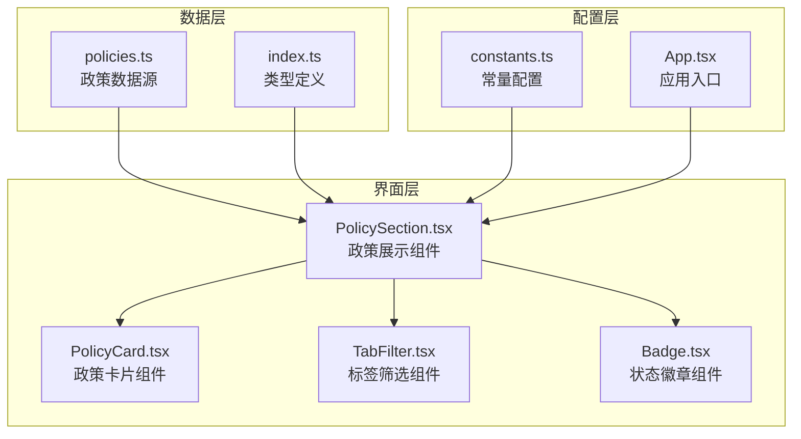
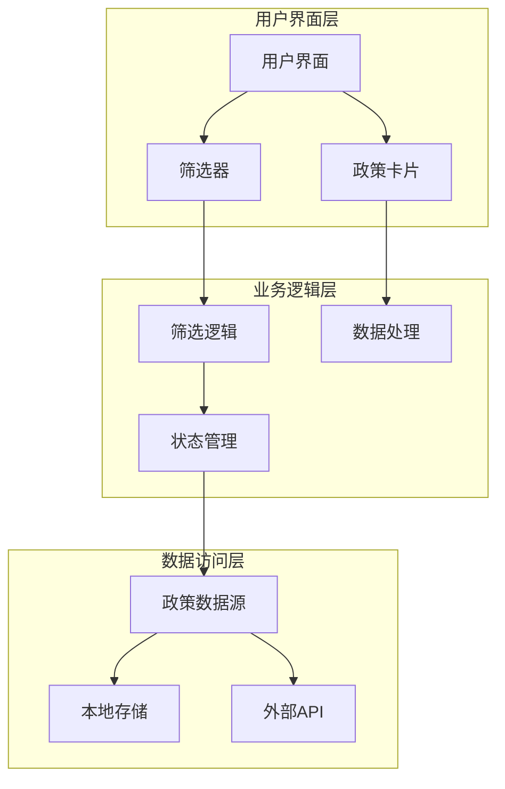
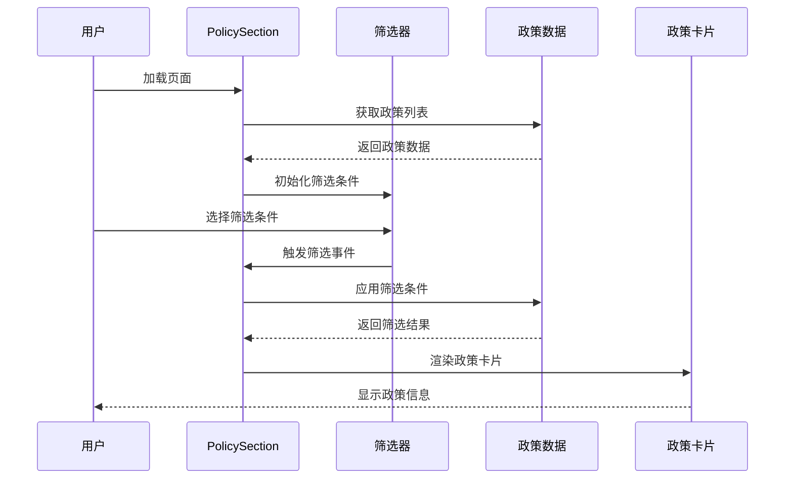
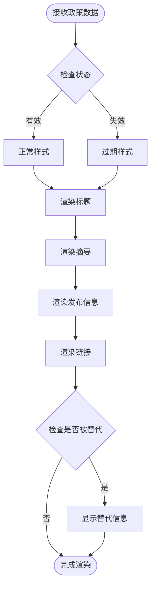
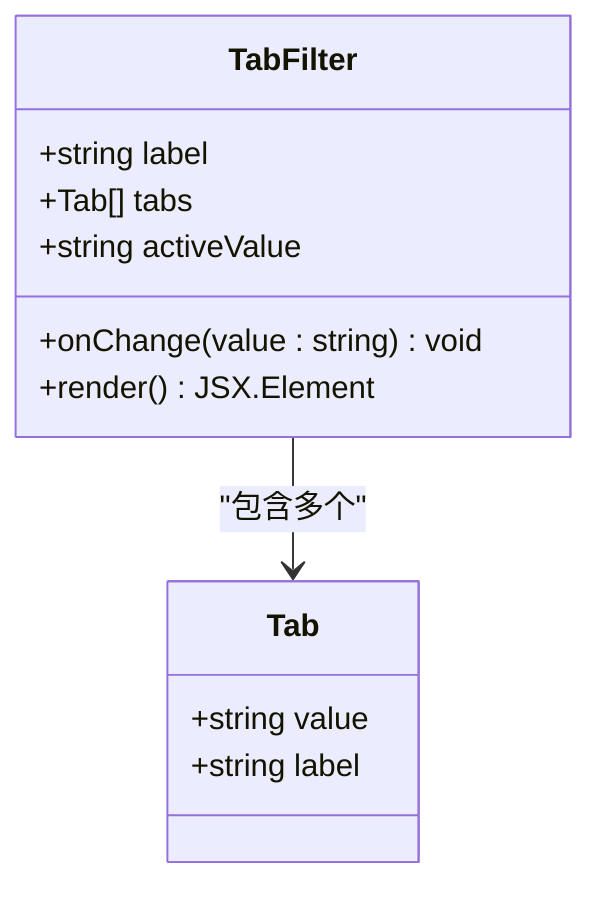
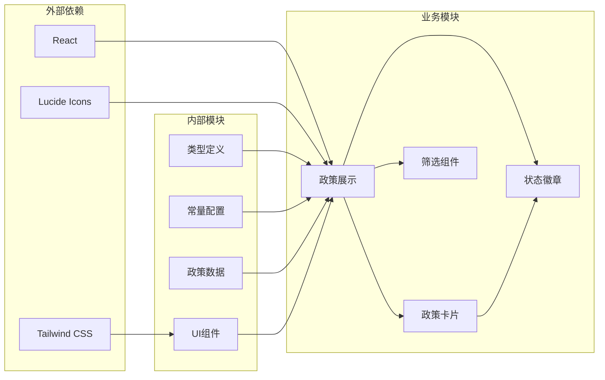

# 政策数据管理

<cite>
**本文档引用的文件**
- [policies.ts](file://src/data/policies.ts)
- [index.ts](file://src/types/index.ts)
- [PolicySection.tsx](file://src/sections/PolicySection.tsx)
- [PolicyCard.tsx](file://src/sections/PolicyCard.tsx)
- [constants.ts](file://src/utils/constants.ts)
- [TabFilter.tsx](file://src/components/TabFilter.tsx)
- [Badge.tsx](file://src/components/Badge.tsx)
- [App.tsx](file://src/App.tsx)
</cite>

## 目录
1. [简介](#简介)
2. [项目结构](#项目结构)
3. [核心组件](#核心组件)
4. [架构概览](#架构概览)
5. [详细组件分析](#详细组件分析)
6. [依赖关系分析](#依赖关系分析)
7. [性能考虑](#性能考虑)
8. [故障排除指南](#故障排除指南)
9. [结论](#结论)
10. [附录](#附录)

## 简介

本项目是一个碳信息代理平台，专注于政策数据的展示和管理。政策数据管理模块提供了完整的政策信息展示、筛选和查询功能，支持全国、省、市三个层级的政策分类，涵盖政策文件和方法学两大类别，以及有效和失效两种状态管理。

该系统采用React + TypeScript构建，通过模块化的数据结构设计实现了政策数据的高效管理和用户友好的交互体验。

## 项目结构

政策数据管理模块位于项目的`src`目录下，主要包含以下关键文件：



**图表来源**
- [policies.ts:1-345](file://src/data/policies.ts#L1-L345)
- [index.ts:1-65](file://src/types/index.ts#L1-L65)
- [PolicySection.tsx:1-89](file://src/sections/PolicySection.tsx#L1-L89)

**章节来源**
- [policies.ts:1-345](file://src/data/policies.ts#L1-L345)
- [index.ts:1-65](file://src/types/index.ts#L1-L65)
- [constants.ts:1-44](file://src/utils/constants.ts#L1-L44)

## 核心组件

### 数据模型设计

政策数据采用强类型接口定义，确保数据结构的一致性和完整性：

```mermaid
classDiagram
class Policy {
+string id
+string title
+regionType : 'national' | 'province' | 'city'
+string province
+category : 'policy' | 'methodology'
+status : 'active' | 'expired'
+string publishDate
+string issuingAuthority
+string summary
+string sourceUrl
+replacedBy? : {id : string, title : string}
}
class CarbonProduct {
+string id
+string name
+string fullName
+market : 'domestic' | 'international'
+string unit
+string region
+string notes
}
class Methodology {
+string id
+string province
+string name
+TransportMode[] transportModes
}
class TransportMode {
+string mode
+string label
+string icon
+number baselineFactor
+number scenarioFactor
}
Policy --> CarbonProduct : "关联"
Methodology --> TransportMode : "包含"
```

**图表来源**
- [index.ts:2-14](file://src/types/index.ts#L2-L14)
- [index.ts:17-37](file://src/types/index.ts#L17-L37)
- [index.ts:48-53](file://src/types/index.ts#L48-L53)
- [index.ts:40-46](file://src/types/index.ts#L40-L46)

### 政策分类体系

系统支持三级行政区划分类：
- **国家级** (`national`): 全国范围适用的政策
- **省级** (`province`): 省级政策，包括直辖市
- **市级** (`city`): 地市级政策

同时支持两类政策内容：
- **政策文件** (`policy`): 政府发布的政策法规
- **方法学** (`methodology`): 技术方法和标准规范

**章节来源**
- [index.ts:5-8](file://src/types/index.ts#L5-L8)
- [constants.ts:14-18](file://src/utils/constants.ts#L14-L18)

## 架构概览

政策数据管理采用分层架构设计，实现了数据、业务逻辑和界面的清晰分离：



**图表来源**
- [PolicySection.tsx:9-89](file://src/sections/PolicySection.tsx#L9-L89)
- [policies.ts:3-345](file://src/data/policies.ts#L3-L345)

## 详细组件分析

### 政策展示组件 (PolicySection)

PolicySection是政策数据管理的核心组件，负责政策信息的展示和筛选：



**图表来源**
- [PolicySection.tsx:9-89](file://src/sections/PolicySection.tsx#L9-L89)
- [TabFilter.tsx:8-31](file://src/components/TabFilter.tsx#L8-L31)

#### 筛选逻辑实现

组件实现了多维度的筛选功能：

1. **区域类型筛选**: 支持全国、省、市三个层级
2. **省份筛选**: 基于区域类型动态生成可用省份列表
3. **政策类别筛选**: 政策文件和方法学分类
4. **状态筛选**: 有效和失效状态管理

**章节来源**
- [PolicySection.tsx:15-34](file://src/sections/PolicySection.tsx#L15-L34)
- [constants.ts:1-24](file://src/utils/constants.ts#L1-L24)

### 政策卡片组件 (PolicyCard)

PolicyCard负责单个政策信息的展示，提供简洁直观的信息呈现：



**图表来源**
- [PolicyCard.tsx:9-67](file://src/sections/PolicyCard.tsx#L9-L67)
- [Badge.tsx:5-18](file://src/components/Badge.tsx#L5-L18)

#### 状态管理机制

系统实现了完整的政策状态管理：

1. **有效状态** (`active`): 政策当前有效
2. **失效状态** (`expired`): 政策已失效
3. **替代机制**: 失效政策可指向新的替代版本

**章节来源**
- [PolicyCard.tsx:10-64](file://src/sections/PolicyCard.tsx#L10-L64)
- [index.ts:13](file://src/types/index.ts#L13)

### 筛选组件 (TabFilter)

TabFilter提供统一的标签式筛选界面：



**图表来源**
- [TabFilter.tsx:1-31](file://src/components/TabFilter.tsx#L1-L31)

**章节来源**
- [TabFilter.tsx:8-31](file://src/components/TabFilter.tsx#L8-L31)

## 依赖关系分析

政策数据管理模块的依赖关系清晰明确：



**图表来源**
- [PolicySection.tsx:1-8](file://src/sections/PolicySection.tsx#L1-L8)
- [App.tsx:1-60](file://src/App.tsx#L1-L60)

### 数据流分析

政策数据在系统中的流转过程：

1. **数据加载**: 从`policies.ts`导入政策数据
2. **状态管理**: 使用React的useState和useMemo进行状态管理
3. **筛选处理**: 通过过滤函数实现多维筛选
4. **渲染输出**: 将筛选结果渲染为用户界面

**章节来源**
- [PolicySection.tsx:1-8](file://src/sections/PolicySection.tsx#L1-L8)
- [policies.ts:1-345](file://src/data/policies.ts#L1-L345)

## 性能考虑

### 内存优化策略

1. **数据结构优化**: 使用扁平化数组存储政策数据，避免深层嵌套
2. **状态缓存**: 利用`useMemo`缓存筛选结果，减少重复计算
3. **组件优化**: 政策卡片组件使用条件渲染，避免不必要的DOM操作

### 渲染性能

1. **虚拟滚动**: 对于大量政策数据，可考虑实现虚拟滚动
2. **懒加载**: 政策详情页面可实现按需加载
3. **图片优化**: 政策卡片中的图标使用SVG格式，体积小且可缩放

### 缓存策略

当前实现采用内存缓存：
- 政策数据在应用启动时加载到内存
- 筛选结果使用`useMemo`缓存
- 可扩展为localStorage或IndexedDB持久化缓存

## 故障排除指南

### 常见问题及解决方案

1. **筛选功能异常**
   - 检查`regionType`状态是否正确设置
   - 验证省份列表是否包含当前选择的省份
   - 确认筛选条件的优先级顺序

2. **政策卡片显示问题**
   - 检查`policy.status`字段值是否正确
   - 验证`sourceUrl`链接的有效性
   - 确认`summary`字段长度适中

3. **数据加载错误**
   - 检查`policies.ts`文件语法是否正确
   - 验证Policy接口定义是否完整
   - 确认数据格式符合预期

**章节来源**
- [PolicySection.tsx:26-34](file://src/sections/PolicySection.tsx#L26-L34)
- [PolicyCard.tsx:9-67](file://src/sections/PolicyCard.tsx#L9-L67)

## 结论

政策数据管理模块通过精心设计的数据结构和组件架构，成功实现了政策信息的高效管理和用户友好展示。系统具有以下优势：

1. **清晰的层次结构**: 数据、业务逻辑和界面分离，便于维护和扩展
2. **灵活的筛选机制**: 支持多维度筛选，满足不同用户需求
3. **良好的用户体验**: 响应式设计和直观的交互界面
4. **可扩展性**: 模块化设计便于添加新功能和数据源

未来可以考虑的功能增强包括：搜索功能、排序规则、国际化支持、数据导入导出等。

## 附录

### 政策数据扩展指南

#### 新增地区支持步骤

1. 在`PROVINCES`数组中添加新的省份名称
2. 在`policies.ts`中添加对应地区的政策数据
3. 更新筛选逻辑以支持新地区
4. 测试筛选功能的正确性

#### 新增政策类型

1. 扩展`category`枚举类型
2. 添加相应的筛选选项
3. 更新UI组件以支持新类型
4. 测试数据展示效果

#### 数据更新流程

1. **数据收集**: 从官方渠道获取最新政策信息
2. **数据验证**: 检查数据格式和完整性
3. **数据转换**: 转换为标准的Policy接口格式
4. **数据测试**: 验证数据在系统中的显示效果
5. **数据部署**: 更新到生产环境

**章节来源**
- [constants.ts:8-12](file://src/utils/constants.ts#L8-L12)
- [policies.ts:3-345](file://src/data/policies.ts#L3-L345)

### 多语言支持方案

当前系统采用中文界面，如需支持多语言：

1. **国际化框架**: 集成i18n库（如react-i18next）
2. **文本提取**: 将所有用户可见文本提取到翻译文件
3. **动态切换**: 实现语言切换功能
4. **布局适配**: 考虑不同语言的文本长度差异

### 搜索功能实现建议

1. **全文搜索**: 实现基于标题、摘要的全文检索
2. **高级搜索**: 支持组合条件搜索
3. **搜索历史**: 记录用户的搜索历史
4. **搜索建议**: 提供智能搜索建议