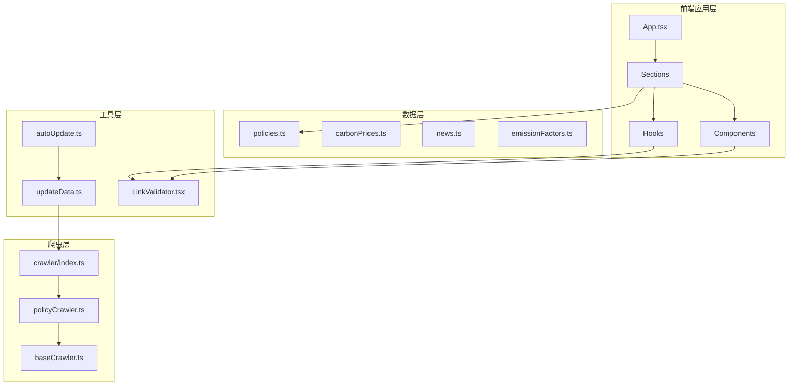
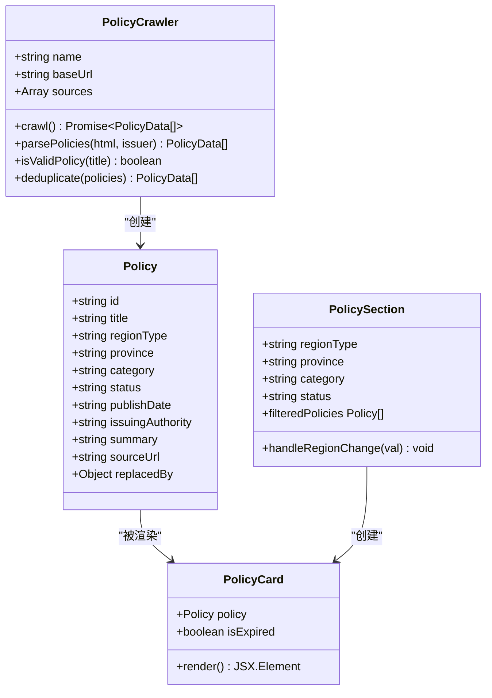
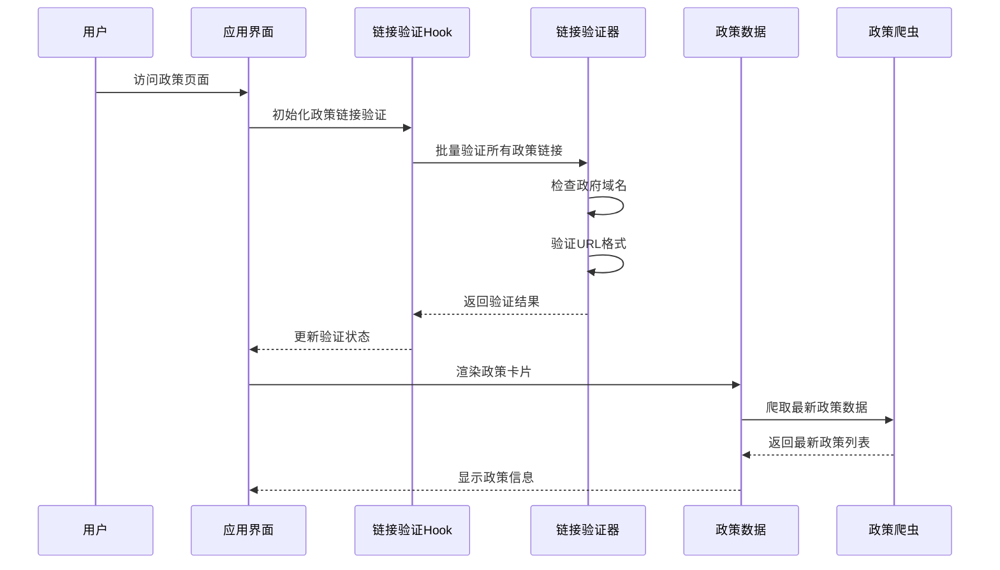
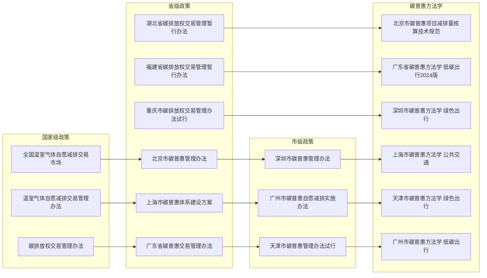
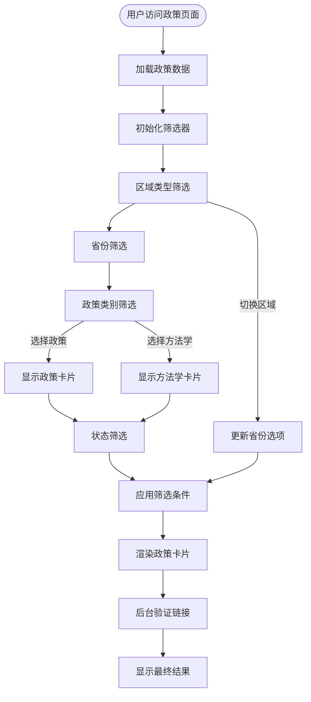
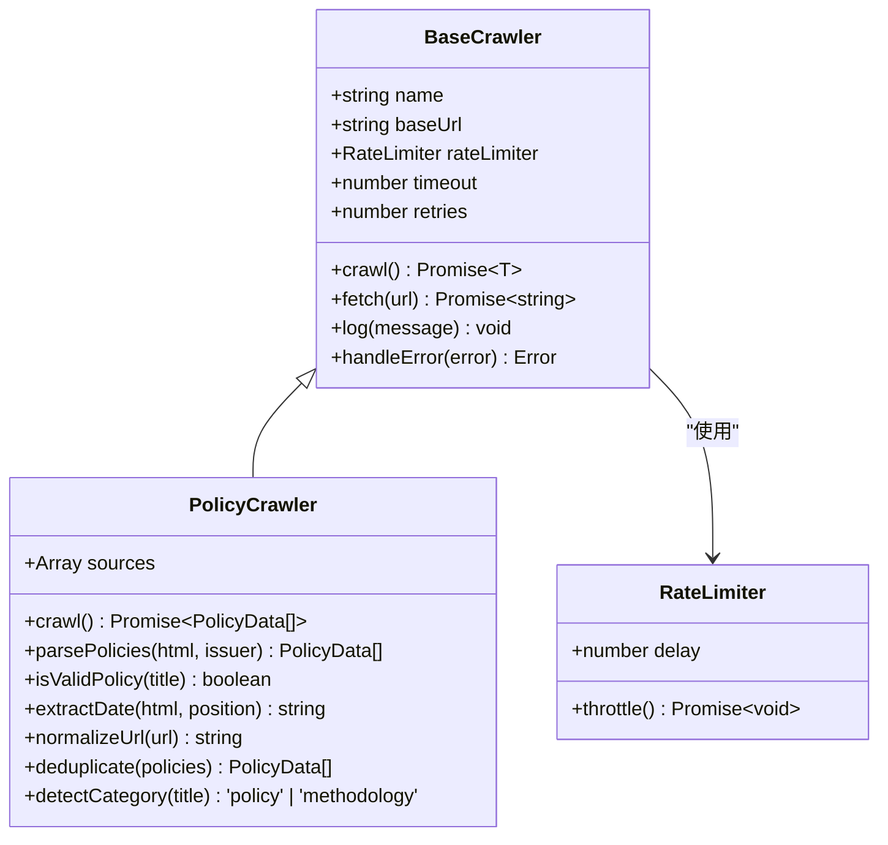
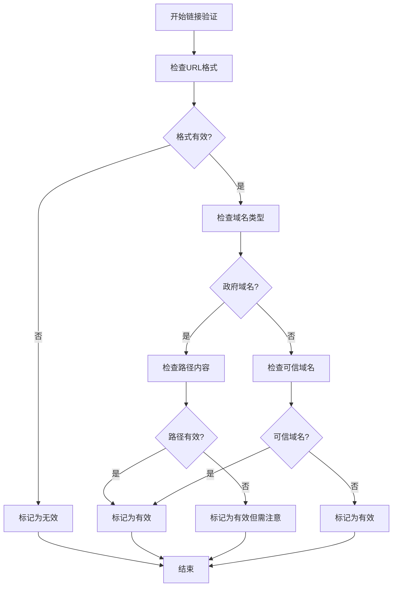
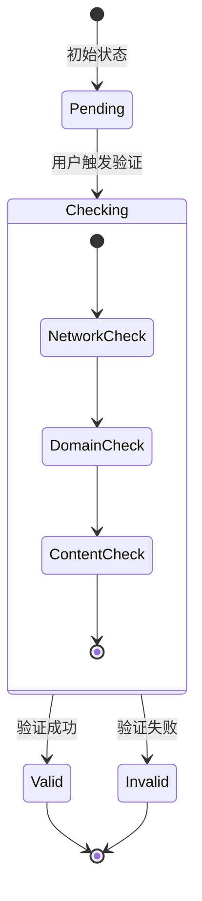
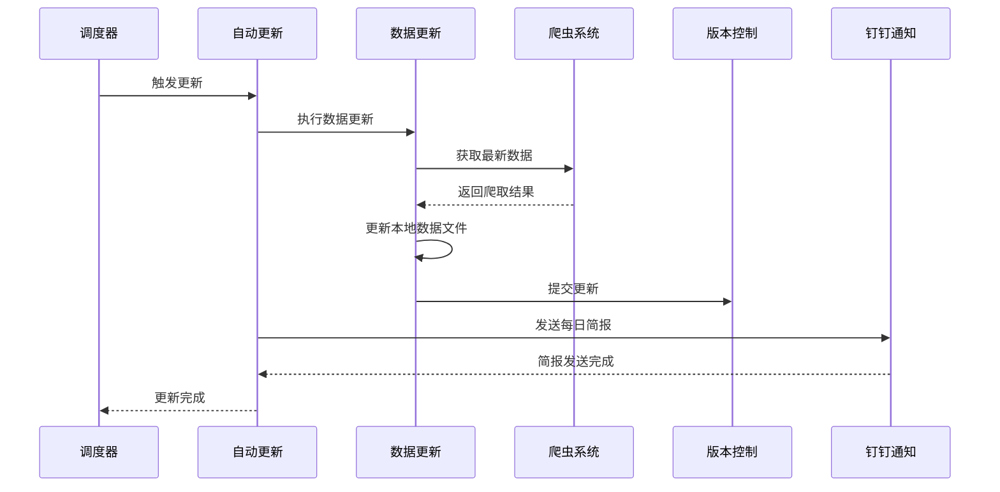
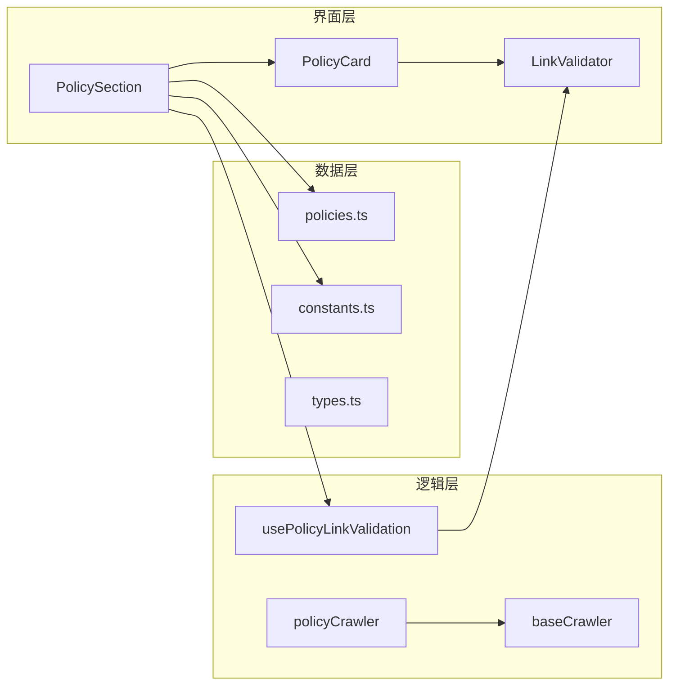

# 扩展的政策数据管理

<cite>
**本文档引用的文件**
- [policies.ts](file://src/data/policies.ts)
- [policyCrawler.ts](file://scripts/crawler/policyCrawler.ts)
- [PolicySection.tsx](file://src/sections/PolicySection.tsx)
- [PolicyCard.tsx](file://src/sections/PolicyCard.tsx)
- [usePolicyLinkValidation.ts](file://src/hooks/usePolicyLinkValidation.ts)
- [LinkValidator.tsx](file://src/components/LinkValidator.tsx)
- [index.ts](file://scripts/crawler/index.ts)
- [autoUpdate.ts](file://scripts/autoUpdate.ts)
- [updateData.ts](file://scripts/updateData.ts)
- [baseCrawler.ts](file://scripts/crawler/baseCrawler.ts)
- [constants.ts](file://src/utils/constants.ts)
- [types.ts](file://src/types/index.ts)
- [App.tsx](file://src/App.tsx)
- [package.json](file://package.json)
</cite>

## 更新摘要
**变更内容**
- 新增了6个城市的碳普惠方法学数据，扩展了平台的碳会计标准覆盖范围
- 新增了方法学分类，支持碳普惠项目的核算和计算标准
- 扩展了爬虫系统以支持方法学数据的抓取和解析
- 增强了政策数据的完整性，包含政策文件和方法学两个维度

## 目录
1. [项目概述](#项目概述)
2. [项目结构](#项目结构)
3. [核心组件](#核心组件)
4. [架构概览](#架构概览)
5. [详细组件分析](#详细组件分析)
6. [依赖关系分析](#依赖关系分析)
7. [性能考虑](#性能考虑)
8. [故障排除指南](#故障排除指南)
9. [结论](#结论)

## 项目概述

这是一个基于React + TypeScript + Vite构建的碳信息代理系统，专注于全国碳普惠政策数据的收集、管理和展示。系统实现了完整的政策数据生命周期管理，包括数据采集、验证、存储和可视化展示。

该系统的核心功能是提供一个统一的平台，让用户能够查询和了解全国各省市自治区的碳普惠相关政策法规，包括政策文件、方法学以及相关的实施情况。**最新更新**：系统现已扩展至覆盖全国10个重点地区，包括广东、江苏、浙江、湖北、福建、山东、重庆、四川、云南、吉林等地区的政策数据，并新增了6个城市的碳普惠方法学数据，显著扩展了平台的碳会计标准覆盖范围。

## 项目结构

项目采用模块化的组织方式，主要分为以下几个核心部分：



**图表来源**
- [App.tsx:1-60](file://src/App.tsx#L1-L60)
- [policies.ts:1-305](file://src/data/policies.ts#L1-L305)
- [policyCrawler.ts:1-247](file://scripts/crawler/policyCrawler.ts#L1-L247)

**章节来源**
- [package.json:1-40](file://package.json#L1-L40)
- [App.tsx:1-60](file://src/App.tsx#L1-L60)

## 核心组件

### 政策数据模型

系统定义了完整的政策数据结构，支持多层级的政策分类和状态管理，现已扩展支持方法学数据：



**图表来源**
- [types.ts:1-65](file://src/types/index.ts#L1-L65)
- [policyCrawler.ts:17-247](file://scripts/crawler/policyCrawler.ts#L17-L247)
- [PolicySection.tsx:1-93](file://src/sections/PolicySection.tsx#L1-L93)
- [PolicyCard.tsx:1-68](file://src/sections/PolicyCard.tsx#L1-L68)

### 政策数据分类体系

系统支持三种级别的政策分类，现已扩展包含方法学分类：

| 分类级别 | 描述 | 示例 |
|---------|------|------|
| 国家级 | 全国性的政策法规 | 《碳排放权交易管理办法》 |
| 省级 | 省级政府发布的政策 | 《北京市碳普惠管理办法》 |
| 市级 | 地市级政府发布的政策 | 《深圳市碳普惠方法学》 |
| **方法学** | **碳普惠项目的核算标准** | **《北京市碳普惠项目减排量核算技术规范》** |

**章节来源**
- [policies.ts:1-305](file://src/data/policies.ts#L1-L305)
- [constants.ts:14-18](file://src/utils/constants.ts#L14-L18)

## 架构概览

系统采用分层架构设计，实现了数据采集、处理和展示的完整流程：



**图表来源**
- [usePolicyLinkValidation.ts:1-81](file://src/hooks/usePolicyLinkValidation.ts#L1-L81)
- [LinkValidator.tsx:17-96](file://src/components/LinkValidator.tsx#L17-L96)
- [PolicySection.tsx:16-17](file://src/sections/PolicySection.tsx#L16-L17)

## 详细组件分析

### 政策数据管理组件

#### 政策数据源管理

**更新**：系统现已扩展至覆盖全国10个重点地区，包括新增的广州、深圳、湖北、福建、山东、重庆、四川、浙江、云南、吉林等地区的政策数据，并新增了6个城市的碳普惠方法学数据，显著扩展了平台的碳会计标准覆盖范围。



**图表来源**
- [policies.ts:3-304](file://src/data/policies.ts#L3-L304)

#### 政策筛选和过滤机制

系统提供了多维度的政策筛选功能，现已支持方法学分类：



**图表来源**
- [PolicySection.tsx:19-38](file://src/sections/PolicySection.tsx#L19-L38)
- [constants.ts:14-18](file://src/utils/constants.ts#L14-L18)

**章节来源**
- [PolicySection.tsx:1-93](file://src/sections/PolicySection.tsx#L1-L93)
- [constants.ts:14-18](file://src/utils/constants.ts#L14-L18)

### 政策爬虫系统

#### 爬虫架构设计

**更新**：爬虫系统现已扩展支持10个新增地区的政府机构网站，包括湖北省生态环境厅、福建省生态环境厅、浙江省生态环境厅、山东省生态环境厅、四川省生态环境厅、云南省生态环境厅、吉林省生态环境厅等，并新增了方法学数据的抓取能力。



**图表来源**
- [baseCrawler.ts:16-64](file://scripts/crawler/baseCrawler.ts#L16-L64)
- [policyCrawler.ts:17-247](file://scripts/crawler/policyCrawler.ts#L17-L247)

#### 爬虫配置参数

| 参数 | 值 | 说明 |
|------|-----|------|
| 请求间隔 | 3000ms | 政府网站访问频率限制 |
| 超时时间 | 15000ms | HTTP请求超时设置 |
| 重试次数 | 2次 | 网络不稳定时的重试机制 |
| 并发控制 | 串行执行 | 避免对目标网站造成压力 |
| **方法学检测** | **新增关键词** | **支持方法学、技术规范、核算等关键词识别** |

**章节来源**
- [policyCrawler.ts:112-139](file://scripts/crawler/policyCrawler.ts#L112-L139)
- [baseCrawler.ts:8-29](file://scripts/crawler/baseCrawler.ts#L8-L29)

### 链接验证系统

#### 验证策略

系统实现了多层次的链接验证机制：



**图表来源**
- [LinkValidator.tsx:18-96](file://src/components/LinkValidator.tsx#L18-L96)

#### 验证状态管理



**图表来源**
- [usePolicyLinkValidation.ts:17-38](file://src/hooks/usePolicyLinkValidation.ts#L17-L38)

**章节来源**
- [usePolicyLinkValidation.ts:1-81](file://src/hooks/usePolicyLinkValidation.ts#L1-L81)
- [LinkValidator.tsx:178-280](file://src/components/LinkValidator.tsx#L178-L280)

### 自动更新系统

#### 更新流程



**图表来源**
- [autoUpdate.ts:18-49](file://scripts/autoUpdate.ts#L18-L49)
- [updateData.ts:173-185](file://scripts/updateData.ts#L173-L185)

**章节来源**
- [autoUpdate.ts:1-53](file://scripts/autoUpdate.ts#L1-L53)
- [updateData.ts:173-185](file://scripts/updateData.ts#L173-L185)

## 依赖关系分析

### 技术栈依赖

系统采用现代化的前端技术栈，主要依赖关系如下：

```mermaid
graph TB
subgraph "核心框架"
React[React 19.2.4]
ReactDOM[React DOM 19.2.4]
Vite[Vite 8.0.1]
TypeScript[TypeScript 5.9.3]
end
subgraph "UI组件库"
Lucide[Lucide React 0.577.0]
Recharts[Recharts 3.8.0]
Tailwind[Tailwind CSS 4.2.2]
end
subgraph "工具库"
DayJS[DayJS 1.11.20]
NodeTypes[@types/node 24.12.0]
ReactTypes[@types/react 19.2.14]
end
React --> ReactDOM
React --> Lucide
React --> Recharts
Vite --> TypeScript
Vite --> React
Tailwind --> Vite
```

**图表来源**
- [package.json:15-38](file://package.json#L15-L38)

### 组件间依赖关系



**图表来源**
- [PolicySection.tsx:1-93](file://src/sections/PolicySection.tsx#L1-L93)
- [PolicyCard.tsx:1-68](file://src/sections/PolicyCard.tsx#L1-L68)
- [usePolicyLinkValidation.ts:1-81](file://src/hooks/usePolicyLinkValidation.ts#L1-L81)

**章节来源**
- [package.json:1-40](file://package.json#L1-L40)

## 性能考虑

### 数据加载优化

1. **虚拟滚动**: 对于大量政策数据，建议实现虚拟滚动以提升渲染性能
2. **懒加载**: 政策卡片采用懒加载策略，减少初始渲染负担
3. **缓存机制**: 政策数据和链接验证结果应实现缓存，避免重复请求
4. ****方法学数据优化****: **方法学数据相对稳定，可采用更强的缓存策略** |

### 爬虫性能优化

1. **并发控制**: 使用速率限制器控制爬取频率，避免对目标服务器造成压力
2. **错误重试**: 实现智能重试机制，提高数据获取成功率
3. **增量更新**: 仅更新发生变化的数据，减少不必要的处理
4. ****方法学优先级****: **方法学数据更新频率较低，可降低爬取频率** |

### 内存管理

1. **状态清理**: 组件卸载时及时清理定时器和事件监听器
2. **引用优化**: 使用React.memo优化组件重渲染
3. **资源释放**: 及时释放爬虫和验证器占用的资源
4. ****数据结构优化****: **方法学数据结构相对简单，内存占用较小** |

## 故障排除指南

### 常见问题及解决方案

#### 政策链接失效

**问题描述**: 政策链接无法访问或内容已变更

**解决步骤**:
1. 检查链接格式是否正确
2. 验证域名是否在可信列表中
3. 查看是否有替代政策链接
4. 更新政策数据中的替代信息

#### 爬虫抓取失败

**问题描述**: 政策爬虫无法获取最新数据

**解决步骤**:
1. 检查网络连接和防火墙设置
2. 验证目标网站结构是否发生变化
3. 调整爬虫配置参数
4. 实施备用数据源

#### 数据同步问题

**问题描述**: 前端显示的政策数据与实际不符

**解决步骤**:
1. 清除浏览器缓存
2. 检查数据更新脚本执行状态
3. 验证Git版本控制状态
4. 重新部署应用

#### **方法学数据异常**

**问题描述**: **方法学数据解析错误或显示异常**

**解决步骤**:
**1. 检查方法学标题格式是否符合预期**
**2. 验证方法学分类检测逻辑**
**3. 确认方法学数据结构完整性**
**4. 更新方法学关键词检测规则**

**章节来源**
- [LinkValidator.tsx:88-96](file://src/components/LinkValidator.tsx#L88-L96)
- [policyCrawler.ts:183-190](file://scripts/crawler/policyCrawler.ts#L183-L190)

## 结论

该碳普惠政策数据管理系统实现了完整的政策数据生命周期管理，具有以下特点：

1. **全面性**: 覆盖全国31个省市区的政策数据，包含国家、省、市三级政策。**最新更新**：现已扩展至10个重点地区，包括广东、江苏、浙江、湖北、福建、山东、重庆、四川、云南、吉林等地区的政策数据，并新增了6个城市的碳普惠方法学数据，显著扩展了平台的碳会计标准覆盖范围。
2. **实时性**: 通过爬虫系统定期获取最新政策信息
3. **可靠性**: 实现了多层次的链接验证机制，确保数据质量
4. **可扩展性**: 模块化设计便于功能扩展和维护
5. **用户体验**: 提供直观的筛选和搜索功能

系统通过合理的架构设计和技术选型，为用户提供了一个可靠的碳普惠政策信息查询平台。**新增的方法学数据**为用户提供了具体的碳减排量核算标准，有助于推动碳普惠项目的规范化发展。

**更新总结**：本次更新显著扩展了系统的地理覆盖范围和数据完整性，新增了6个城市的碳普惠方法学数据，增强了系统的实用性和覆盖面，为用户提供更全面的碳普惠政策信息服务。同时，新增的方法学分类使系统能够更好地支持碳会计标准的实施和推广。