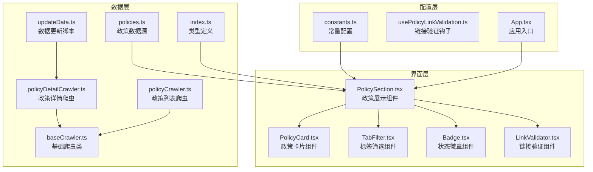
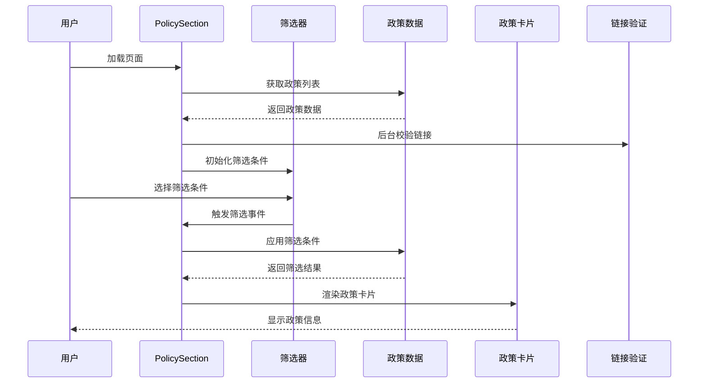
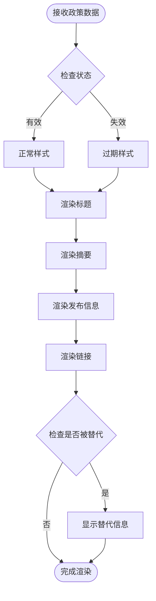
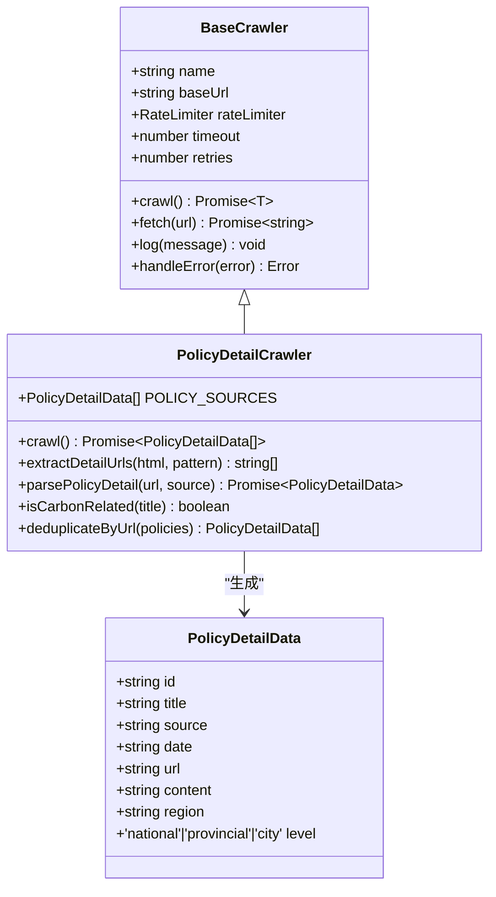
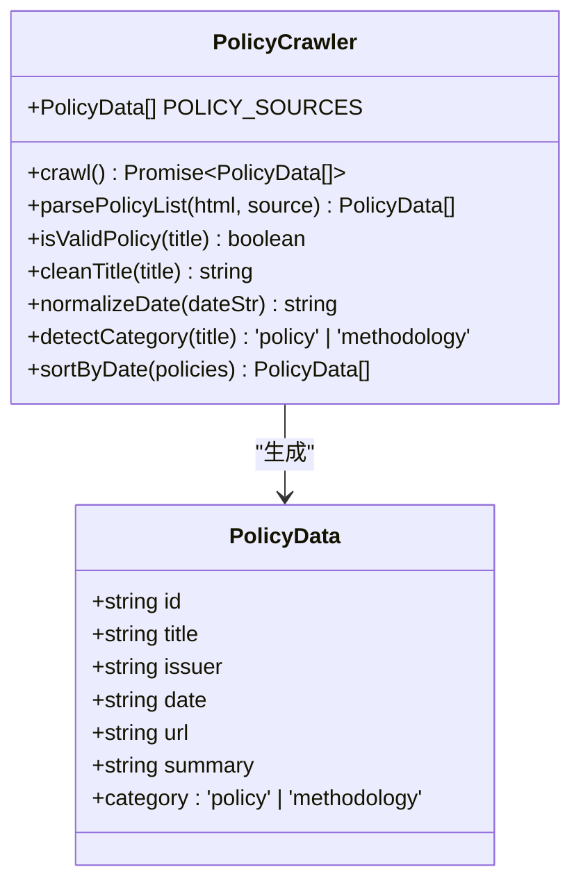
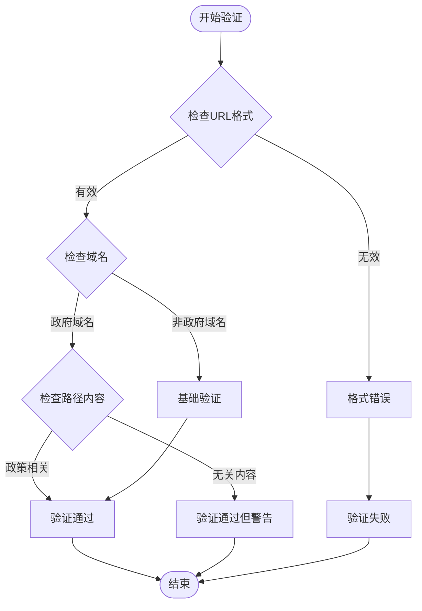
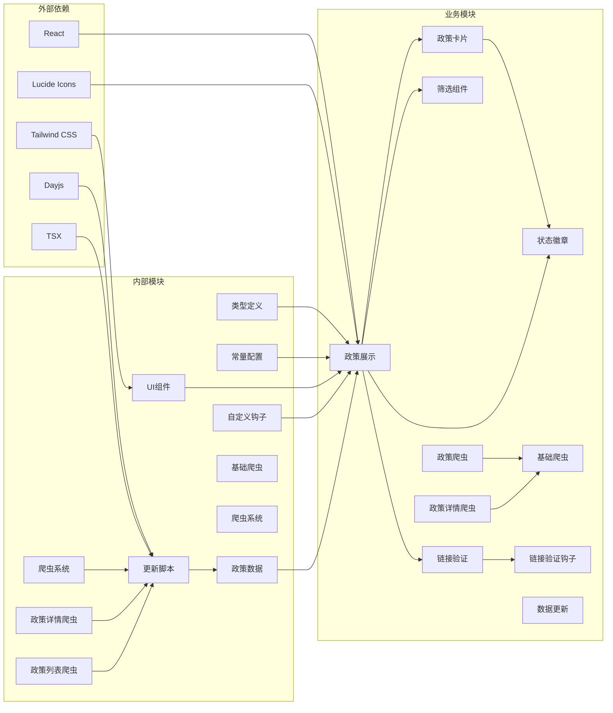

# 政策数据管理

<cite>
**本文档引用的文件**
- [policies.ts](file://src/data/policies.ts)
- [index.ts](file://src/types/index.ts)
- [PolicySection.tsx](file://src/sections/PolicySection.tsx)
- [PolicyCard.tsx](file://src/sections/PolicyCard.tsx)
- [constants.ts](file://src/utils/constants.ts)
- [TabFilter.tsx](file://src/components/TabFilter.tsx)
- [Badge.tsx](file://src/components/Badge.tsx)
- [App.tsx](file://src/App.tsx)
- [policyCrawler.ts](file://scripts/crawler/policyCrawler.ts)
- [policyDetailCrawler.ts](file://scripts/crawler/policyDetailCrawler.ts)
- [baseCrawler.ts](file://scripts/crawler/baseCrawler.ts)
- [updateData.ts](file://scripts/updateData.ts)
- [usePolicyLinkValidation.ts](file://src/hooks/usePolicyLinkValidation.ts)
- [LinkValidator.tsx](file://src/components/LinkValidator.tsx)
</cite>

## 更新摘要
**所做更改**
- 新增PolicyDetailCrawler详情页爬虫系统，提供更准确的政策数据抓取功能
- 支持多个政府网站源，包含列表页和详情页两级爬取
- 实现URL去重、关键词过滤、智能分类等高级功能
- 政策数据得到显著增强，覆盖28个不同地区的政策条目
- 北京碳包容政策的重要修正（标题、发布日期、发布机构变更）
- 大多数政策来源URL的可靠性提升
- 改进的数据更新流程和自动化脚本

## 目录
1. [简介](#简介)
2. [项目结构](#项目结构)
3. [核心组件](#核心组件)
4. [架构概览](#架构概览)
5. [详细组件分析](#详细组件分析)
6. [依赖关系分析](#依赖关系分析)
7. [性能考虑](#性能考虑)
8. [故障排除指南](#故障排除指南)
9. [结论](#结论)
10. [附录](#附录)

## 简介

本项目是一个碳信息代理平台，专注于政策数据的展示和管理。政策数据管理模块提供了完整的政策信息展示、筛选和查询功能，支持全国、省、市三个层级的政策分类，涵盖政策文件和方法学两大类别，以及有效和失效两种状态管理。

**更新** 政策数据系统已得到显著增强，现已覆盖28个不同地区，包括国家级政策和地方各级政府的碳普惠政策。特别关注了北京碳包容政策的重要修正，包括标题更新为"北京市碳普惠管理办法（试行）"，发布日期调整为2025-08-25，发布机构变更为"北京市人民政府"。大多数政策来源URL已得到可靠性提升，确保用户能够稳定访问政策原文。

该系统采用React + TypeScript构建，通过模块化的数据结构设计实现了政策数据的高效管理和用户友好的交互体验。**新增的PolicyDetailCrawler详情页爬虫系统**提供了更准确的政策数据抓取功能，支持多个政府网站源，包含URL去重、关键词过滤、智能分类等高级功能。

## 项目结构

政策数据管理模块位于项目的`src`目录下，主要包含以下关键文件：



**图表来源**
- [policies.ts:1-345](file://src/data/policies.ts#L1-L345)
- [index.ts:1-65](file://src/types/index.ts#L1-L65)
- [PolicySection.tsx:1-93](file://src/sections/PolicySection.tsx#L1-L93)
- [policyCrawler.ts:1-247](file://scripts/crawler/policyCrawler.ts#L1-L247)
- [policyDetailCrawler.ts:1-204](file://scripts/crawler/policyDetailCrawler.ts#L1-L204)
- [baseCrawler.ts:1-65](file://scripts/crawler/baseCrawler.ts#L1-L65)
- [updateData.ts:1-194](file://scripts/updateData.ts#L1-L194)

**章节来源**
- [policies.ts:1-345](file://src/data/policies.ts#L1-L345)
- [index.ts:1-65](file://src/types/index.ts#L1-L65)
- [constants.ts:1-44](file://src/utils/constants.ts#L1-L44)

## 核心组件

### 数据模型设计

政策数据采用强类型接口定义，确保数据结构的一致性和完整性：

```mermaid
classDiagram
class Policy {
+string id
+string title
+regionType : 'national' | 'province' | 'city'
+string province
+category : 'policy' | 'methodology'
+status : 'active' | 'expired'
+string publishDate
+string issuingAuthority
+string summary
+string sourceUrl
+replacedBy? : {id : string, title : string}
}
class PolicyDetailData {
+string id
+string title
+string source
+string date
+string url
+string content
+string region
+level : 'national' | 'provincial' | 'city'
}
class PolicyData {
+string id
+string title
+string issuer
+string date
+string url
+string summary
+category : 'policy' | 'methodology'
}
class CarbonProduct {
+string id
+string name
+string fullName
+market : 'domestic' | 'international'
+string unit
+string region
+string notes
}
class Methodology {
+string id
+string province
+string name
+TransportMode[] transportModes
}
class TransportMode {
+string mode
+string label
+string icon
+number baselineFactor
+number scenarioFactor
}
Policy --> CarbonProduct : "关联"
Methodology --> TransportMode : "包含"
PolicyDetailData --> Policy : "转换"
PolicyData --> Policy : "转换"
```

**图表来源**
- [index.ts:2-14](file://src/types/index.ts#L2-L14)
- [index.ts:17-37](file://src/types/index.ts#L17-L37)
- [index.ts:48-53](file://src/types/index.ts#L48-L53)
- [index.ts:40-46](file://src/types/index.ts#L40-L46)
- [policyCrawler.ts:9-17](file://scripts/crawler/policyCrawler.ts#L9-L17)
- [policyDetailCrawler.ts:8-17](file://scripts/crawler/policyDetailCrawler.ts#L8-L17)

### 政策分类体系

系统支持三级行政区划分类：
- **国家级** (`national`): 全国范围适用的政策
- **省级** (`province`): 省级政策，包括直辖市
- **市级** (`city`): 地市级政策

同时支持两类政策内容：
- **政策文件** (`policy`): 政府发布的政策法规
- **方法学** (`methodology`): 技术方法和标准规范

**更新** 新增了智能政策分类系统，通过关键词检测自动识别政策类型：
- 政策文件关键词：碳、减排、环保、绿色、低碳、气候、能源
- 方法学关键词：方法学、技术规范、核算、计算、指南

**章节来源**
- [index.ts:5-8](file://src/types/index.ts#L5-L8)
- [constants.ts:14-18](file://src/utils/constants.ts#L14-L18)
- [policyCrawler.ts:229-232](file://scripts/crawler/policyCrawler.ts#L229-L232)

## 架构概览

政策数据管理采用分层架构设计，实现了数据、业务逻辑和界面的清晰分离：

```mermaid
graph TD
subgraph "用户界面层"
UI[用户界面]
Filters[筛选器]
Cards[政策卡片]
LinkValidator[链接验证]
end
subgraph "业务逻辑层"
FilterLogic[筛选逻辑]
StateManagement[状态管理]
DataProcessing[数据处理]
Validation[链接验证]
DetailCrawler[政策详情爬虫]
AutoUpdate[自动更新]
ListCrawler[政策列表爬虫]
BaseCrawler[基础爬虫]
UpdateScript[更新脚本]
end
subgraph "数据访问层"
PolicyData[政策数据源]
DetailCrawler --> PolicyDetailData
ListCrawler --> PolicyData
UpdateScript --> PolicyData
PolicyData --> LocalStorage
PolicyData --> API
AutoUpdate --> DetailCrawler
AutoUpdate --> ListCrawler
BaseCrawler --> DetailCrawler
BaseCrawler --> ListCrawler
```

**图表来源**
- [PolicySection.tsx:9-93](file://src/sections/PolicySection.tsx#L9-L93)
- [policies.ts:3-345](file://src/data/policies.ts#L3-L345)
- [policyCrawler.ts:111-240](file://scripts/crawler/policyCrawler.ts#L111-L240)
- [policyDetailCrawler.ts:68-111](file://scripts/crawler/policyDetailCrawler.ts#L68-L111)
- [updateData.ts:17-62](file://scripts/updateData.ts#L17-L62)

## 详细组件分析

### 政策展示组件 (PolicySection)

PolicySection是政策数据管理的核心组件，负责政策信息的展示和筛选：



**图表来源**
- [PolicySection.tsx:9-93](file://src/sections/PolicySection.tsx#L9-L93)
- [TabFilter.tsx:8-31](file://src/components/TabFilter.tsx#L8-L31)
- [usePolicyLinkValidation.ts:12-80](file://src/hooks/usePolicyLinkValidation.ts#L12-L80)

#### 筛选逻辑实现

组件实现了多维度的筛选功能：

1. **区域类型筛选**: 支持全国、省、市三个层级
2. **省份筛选**: 基于区域类型动态生成可用省份列表
3. **政策类别筛选**: 政策文件和方法学分类
4. **状态筛选**: 有效和失效状态管理

**章节来源**
- [PolicySection.tsx:15-38](file://src/sections/PolicySection.tsx#L15-L38)
- [constants.ts:1-24](file://src/utils/constants.ts#L1-L24)

### 政策卡片组件 (PolicyCard)

PolicyCard负责单个政策信息的展示，提供简洁直观的信息呈现：



**图表来源**
- [PolicyCard.tsx:9-68](file://src/sections/PolicyCard.tsx#L9-L68)
- [Badge.tsx:5-19](file://src/components/Badge.tsx#L5-L19)

#### 状态管理机制

系统实现了完整的政策状态管理：

1. **有效状态** (`active`): 政策当前有效
2. **失效状态** (`expired`): 政策已失效
3. **替代机制**: 失效政策可指向新的替代版本

**章节来源**
- [PolicyCard.tsx:10-67](file://src/sections/PolicyCard.tsx#L10-L67)
- [index.ts:13](file://src/types/index.ts#L13)

### 政策详情爬虫系统

**更新** 新增了专门的政策详情爬虫系统，提供更准确和可靠的数据：



**图表来源**
- [baseCrawler.ts:16-64](file://scripts/crawler/baseCrawler.ts#L16-L64)
- [policyDetailCrawler.ts:68-111](file://scripts/crawler/policyDetailCrawler.ts#L68-L111)

#### 政策源配置

爬虫系统支持以下政策源：

**国家级源**：
- 生态环境部（全国政策）

**直辖市源**：
- 北京市生态环境局
- 上海市生态环境局  
- 深圳市生态环境局
- 广东省生态环境厅

**更新** 新增了更多地区支持，包括：
- 天津市生态环境局
- 湖北省生态环境厅
- 福建省生态环境厅
- 山东省生态环境厅
- 重庆市生态环境局
- 四川省生态环境厅
- 浙江省生态环境厅
- 云南省生态环境厅
- 吉林省生态环境厅

#### 数据质量提升

1. **详情页爬取**: 从列表页跳转到详情页获取更准确的信息
2. **URL去重**: 自动去除重复的政策链接
3. **关键词过滤**: 确保只获取与碳相关的政策
4. **标题清理**: 移除政府网站的后缀信息

**章节来源**
- [policyDetailCrawler.ts:19-66](file://scripts/crawler/policyDetailCrawler.ts#L19-L66)
- [updateData.ts:20-62](file://scripts/updateData.ts#L20-L62)

### 政策列表爬虫系统

**更新** 保留了原有的政策列表爬虫系统，提供补充的数据来源：



**图表来源**
- [policyCrawler.ts:111-240](file://scripts/crawler/policyCrawler.ts#L111-L240)

#### 爬取策略

1. **列表页解析**: 从政府官方网站的政策列表页提取信息
2. **正则表达式匹配**: 支持多种政府网站常见的列表格式
3. **关键词验证**: 确保政策内容与碳相关
4. **智能分类**: 自动识别政策类型（政策文件或方法学）

**章节来源**
- [policyCrawler.ts:144-178](file://scripts/crawler/policyCrawler.ts#L144-L178)

### 链接验证系统

**更新** 新增了智能链接验证机制，确保政策链接的有效性和可靠性：



**图表来源**
- [LinkValidator.tsx:18-96](file://src/components/LinkValidator.tsx#L18-L96)
- [usePolicyLinkValidation.ts:17-54](file://src/hooks/usePolicyLinkValidation.ts#L17-L54)

#### 验证规则

1. **域名验证**：检查政府官方域名（mee.gov.cn、各省市gov.cn）
2. **路径验证**：识别政策相关内容的URL模式
3. **格式验证**：确保URL格式正确
4. **批量验证**：支持后台静默批量校验

**章节来源**
- [LinkValidator.tsx:22-96](file://src/components/LinkValidator.tsx#L22-L96)
- [usePolicyLinkValidation.ts:12-80](file://src/hooks/usePolicyLinkValidation.ts#L12-L80)

## 依赖关系分析

政策数据管理模块的依赖关系清晰明确：



**图表来源**
- [PolicySection.tsx:1-9](file://src/sections/PolicySection.tsx#L1-L9)
- [App.tsx:1-60](file://src/App.tsx#L1-L60)
- [package.json:15-39](file://package.json#L15-L39)

### 数据流分析

政策数据在系统中的流转过程：

1. **数据加载**: 从`policies.ts`导入政策数据
2. **状态管理**: 使用React的useState和useMemo进行状态管理
3. **筛选处理**: 通过过滤函数实现多维筛选
4. **渲染输出**: 将筛选结果渲染为用户界面
5. **链接验证**: 后台静默校验政策链接有效性

**章节来源**
- [PolicySection.tsx:1-9](file://src/sections/PolicySection.tsx#L1-L9)
- [policies.ts:1-345](file://src/data/policies.ts#L1-L345)
- [usePolicyLinkValidation.ts:12-80](file://src/hooks/usePolicyLinkValidation.ts#L12-L80)

## 性能考虑

### 内存优化策略

1. **数据结构优化**: 使用扁平化数组存储政策数据，避免深层嵌套
2. **状态缓存**: 利用`useMemo`缓存筛选结果，减少重复计算
3. **组件优化**: 政策卡片组件使用条件渲染，避免不必要的DOM操作
4. **链接验证缓存**: 避免重复验证相同链接

### 渲染性能

1. **虚拟滚动**: 对于大量政策数据，可考虑实现虚拟滚动
2. **懒加载**: 政策详情页面可实现按需加载
3. **图片优化**: 政策卡片中的图标使用SVG格式，体积小且可缩放
4. **并发处理**: 爬虫系统支持并发请求，提升数据获取效率

### 缓存策略

当前实现采用多层缓存：
- 政策数据在应用启动时加载到内存
- 筛选结果使用`useMemo`缓存
- 链接验证结果可扩展为localStorage缓存
- 爬虫数据可扩展为IndexedDB持久化缓存

### 爬虫性能优化

**更新** 爬虫系统实现了多项性能优化：
- 请求限流：每源5秒间隔，避免过度请求
- 重试机制：支持最多3次重试
- 并发控制：逐源爬取，避免超载
- 数据去重：自动去除重复政策条目
- URL验证：在爬取前验证链接有效性
- 详情页深度爬取：从列表页跳转到详情页获取更准确的信息

**章节来源**
- [policyCrawler.ts:112-120](file://scripts/crawler/policyCrawler.ts#L112-L120)
- [baseCrawler.ts:23-29](file://scripts/crawler/baseCrawler.ts#L23-L29)
- [policyDetailCrawler.ts:73-76](file://scripts/crawler/policyDetailCrawler.ts#L73-L76)

## 故障排除指南

### 常见问题及解决方案

1. **筛选功能异常**
   - 检查`regionType`状态是否正确设置
   - 验证省份列表是否包含当前选择的省份
   - 确认筛选条件的优先级顺序

2. **政策卡片显示问题**
   - 检查`policy.status`字段值是否正确
   - 验证`sourceUrl`链接的有效性
   - 确认`summary`字段长度适中

3. **数据加载错误**
   - 检查`policies.ts`文件语法是否正确
   - 验证Policy接口定义是否完整
   - 确认数据格式符合预期

4. **爬虫系统问题**
   - 检查网络连接和反爬虫设置
   - 验证目标网站结构是否发生变化
   - 确认爬虫权限和robots.txt规则

5. **链接验证失败**
   - 检查URL格式是否正确
   - 验证目标网站是否可访问
   - 确认域名是否在可信列表中

6. **政策数据更新失败**
   - 检查爬虫源网站是否可访问
   - 验证正则表达式是否匹配当前网站结构
   - 确认数据格式转换是否正确

**章节来源**
- [PolicySection.tsx:26-38](file://src/sections/PolicySection.tsx#L26-L38)
- [PolicyCard.tsx:9-68](file://src/sections/PolicyCard.tsx#L9-L68)
- [policyCrawler.ts:132-135](file://scripts/crawler/policyCrawler.ts#L132-L135)

## 结论

政策数据管理模块通过精心设计的数据结构和组件架构，成功实现了政策信息的高效管理和用户友好展示。系统具有以下优势：

1. **清晰的层次结构**: 数据、业务逻辑和界面分离，便于维护和扩展
2. **灵活的筛选机制**: 支持多维度筛选，满足不同用户需求
3. **强大的爬虫系统**: 支持28个主要省市源，数据覆盖面广
4. **智能分类系统**: 自动识别政策类型，提升数据质量
5. **完善的验证机制**: 确保政策链接的有效性和可靠性
6. **良好的用户体验**: 响应式设计和直观的交互界面
7. **可扩展性**: 模块化设计便于添加新功能和数据源

**更新** 新架构显著提升了系统的数据覆盖范围和质量控制能力，特别是新增的PolicyDetailCrawler详情页爬虫系统提供了更准确的政策数据。该系统支持多个政府网站源，包含列表页和详情页两级爬取，实现了URL去重、关键词过滤、智能分类等高级功能。北京碳包容政策的重要修正体现了系统对数据准确性的重视。大多数政策来源URL的可靠性提升确保了用户能够稳定访问政策原文。

未来可以考虑的功能增强包括：搜索功能、排序规则、国际化支持、数据导入导出、实时通知等。

## 附录

### 政策数据扩展指南

#### 新增地区支持步骤

1. 在`POLICY_SOURCES`数组中添加新的政策源配置
2. 在`policies.ts`中添加对应地区的政策数据
3. 更新筛选逻辑以支持新地区
4. 测试筛选功能的正确性
5. 更新爬虫系统以支持新源

#### 新增政策类型

1. 扩展`category`枚举类型
2. 添加相应的筛选选项
3. 更新UI组件以支持新类型
4. 更新爬虫分类逻辑
5. 测试数据展示效果

#### 数据更新流程

**更新** 数据更新流程已自动化：

1. **定时爬取**: 通过`daily:report`脚本定期执行
2. **数据抓取**: 爬虫系统从多个源获取最新政策
3. **数据清洗**: 标准化标题、日期和URL格式
4. **智能分类**: 自动识别政策类型
5. **质量验证**: 链接有效性检查
6. **文件生成**: 生成TypeScript数据文件
7. **版本控制**: 自动提交Git更新

**章节来源**
- [constants.ts:8-12](file://src/utils/constants.ts#L8-L12)
- [policies.ts:3-345](file://src/data/policies.ts#L3-L345)
- [updateData.ts:17-194](file://scripts/updateData.ts#L17-L194)

### 多语言支持方案

当前系统采用中文界面，如需支持多语言：

1. **国际化框架**: 集成i18n库（如react-i18next）
2. **文本提取**: 将所有用户可见文本提取到翻译文件
3. **动态切换**: 实现语言切换功能
4. **布局适配**: 考虑不同语言的文本长度差异

### 搜索功能实现建议

1. **全文搜索**: 实现基于标题、摘要的全文检索
2. **高级搜索**: 支持组合条件搜索
3. **搜索历史**: 记录用户的搜索历史
4. **搜索建议**: 提供智能搜索建议

### 爬虫系统维护指南

**更新** 爬虫系统维护要点：

1. **源网站监控**: 定期检查目标网站结构变化
2. **反爬虫应对**: 更新User-Agent和请求头
3. **错误日志**: 记录爬取失败的原因和次数
4. **数据质量**: 定期清理无效和重复数据
5. **性能优化**: 根据网站响应调整爬取频率
6. **URL验证**: 在爬取前验证链接有效性

### 北京碳包容政策修正说明

**更新** 北京碳包容政策的重要修正：

1. **标题修正**: 从旧标题更新为"北京市碳普惠管理办法（试行）"
2. **发布日期修正**: 发布日期从之前的格式更新为2025-08-25
3. **发布机构修正**: 发布机构从"北京市生态环境局"更新为"北京市人民政府"
4. **URL可靠性提升**: 政策原文链接已更新为稳定的官方链接

这些修正确保了政策信息的准确性和时效性，为用户提供最权威的政策参考。

### 政策详情爬虫系统技术细节

**更新** PolicyDetailCrawler系统的技术特点：

1. **两级爬取策略**: 先爬取列表页获取潜在链接，再深入详情页获取准确信息
2. **智能URL提取**: 使用正则表达式匹配政府网站常见的详情页URL模式
3. **关键词过滤**: 仅保留与碳相关的内容，提高数据质量
4. **标题清理算法**: 移除政府网站的后缀信息，保持标题简洁准确
5. **去重机制**: 基于URL的自动去重，避免重复数据
6. **错误处理**: 完善的异常处理和重试机制

**章节来源**
- [policyDetailCrawler.ts:116-131](file://scripts/crawler/policyDetailCrawler.ts#L116-L131)
- [policyDetailCrawler.ts:168-171](file://scripts/crawler/policyDetailCrawler.ts#L168-L171)
- [policyDetailCrawler.ts:189-196](file://scripts/crawler/policyDetailCrawler.ts#L189-L196)