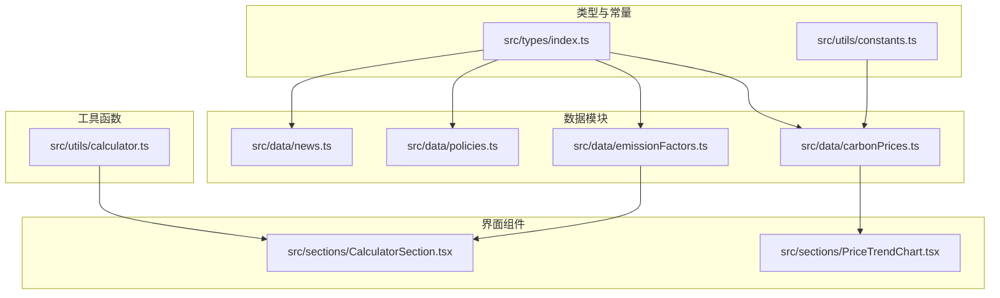
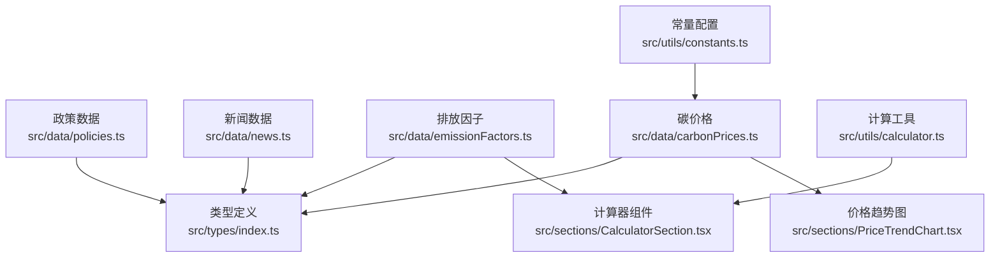
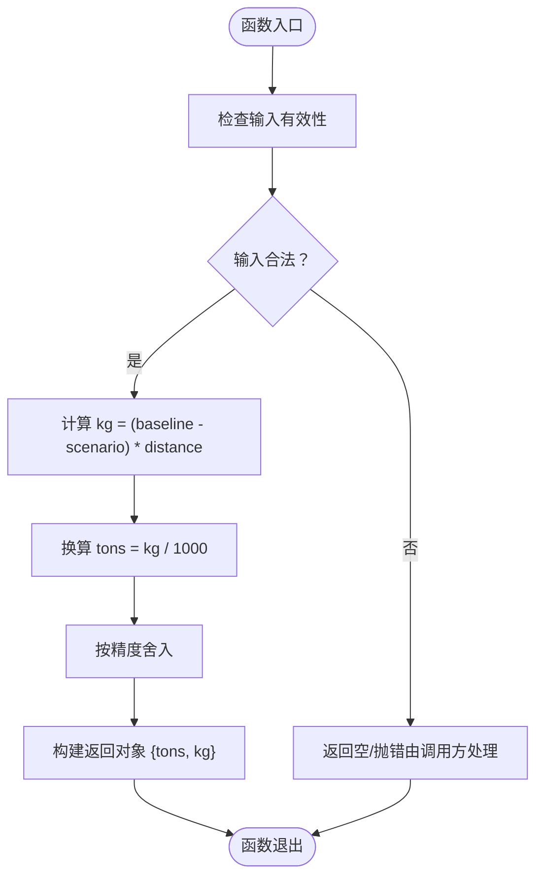
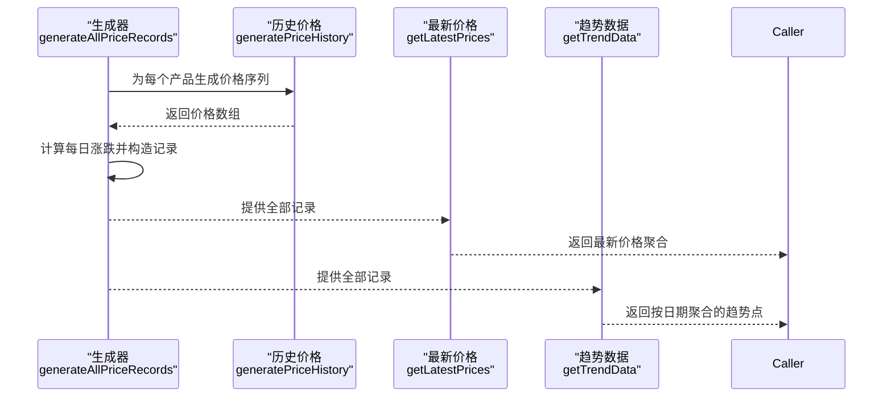
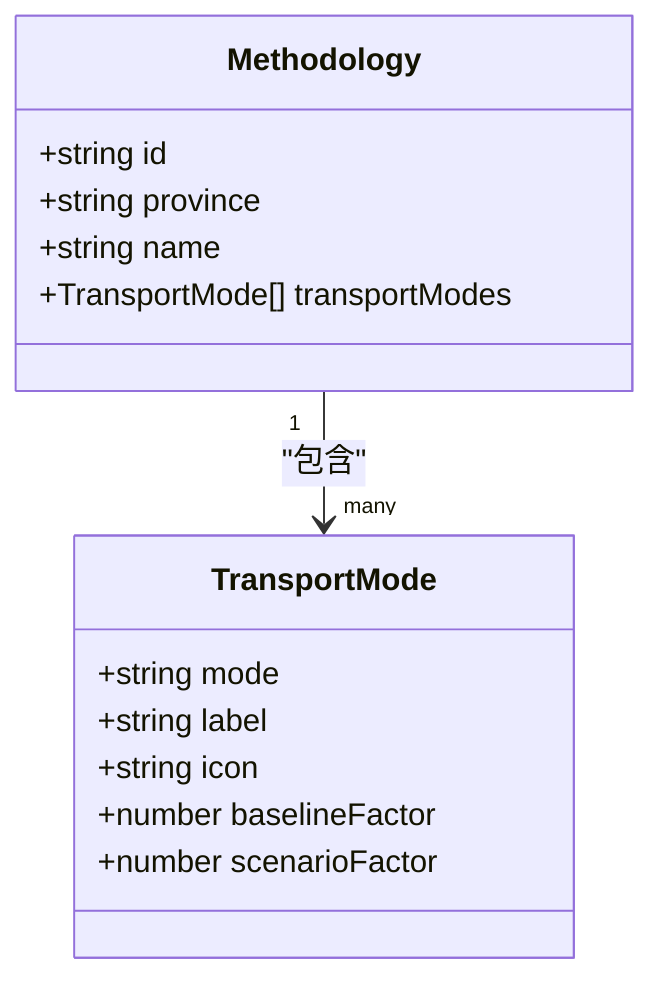
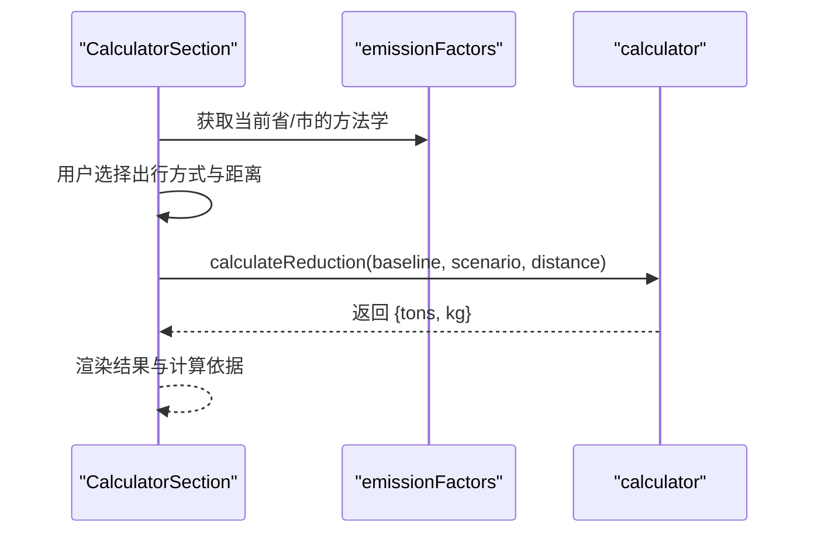
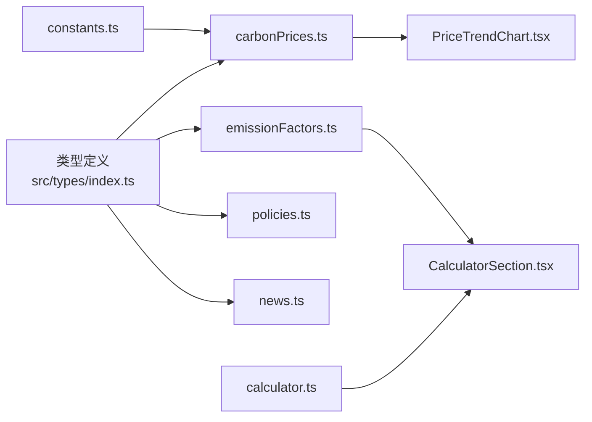

# 数据处理与转换

<cite>
**本文引用的文件**
- [src/utils/calculator.ts](file://src/utils/calculator.ts)
- [src/utils/constants.ts](file://src/utils/constants.ts)
- [src/data/carbonPrices.ts](file://src/data/carbonPrices.ts)
- [src/data/emissionFactors.ts](file://src/data/emissionFactors.ts)
- [src/data/policies.ts](file://src/data/policies.ts)
- [src/data/news.ts](file://src/data/news.ts)
- [src/types/index.ts](file://src/types/index.ts)
- [src/sections/CalculatorSection.tsx](file://src/sections/CalculatorSection.tsx)
- [src/sections/PriceTrendChart.tsx](file://src/sections/PriceTrendChart.tsx)
- [package.json](file://package.json)
</cite>

## 目录
1. [简介](#简介)
2. [项目结构](#项目结构)
3. [核心组件](#核心组件)
4. [架构总览](#架构总览)
5. [详细组件分析](#详细组件分析)
6. [依赖关系分析](#依赖关系分析)
7. [性能考虑](#性能考虑)
8. [故障排查指南](#故障排查指南)
9. [结论](#结论)
10. [附录](#附录)

## 简介
本文件系统性梳理本项目的数据处理与转换实现，覆盖数据预处理、格式转换与计算逻辑，解释数据清洗规则、异常值处理与标准化流程，阐述工具函数设计思路、算法实现与性能优化策略，说明常量配置管理、环境变量处理与动态配置更新方式，并给出数据验证、错误处理与异常恢复策略，最后提供扩展方法与新增计算逻辑、自定义转换规则的实践建议。

## 项目结构
项目采用按功能模块组织的前端结构，数据层以纯数据模块为主，配合类型定义与工具函数；界面层通过组件消费数据与工具函数完成展示与交互。

图表来源
- [src/types/index.ts:1-65](file://src/types/index.ts#L1-L65)
- [src/utils/constants.ts:1-44](file://src/utils/constants.ts#L1-L44)
- [src/data/carbonPrices.ts:1-103](file://src/data/carbonPrices.ts#L1-L103)
- [src/data/emissionFactors.ts:1-103](file://src/data/emissionFactors.ts#L1-L103)
- [src/data/policies.ts:1-345](file://src/data/policies.ts#L1-L345)
- [src/data/news.ts:1-185](file://src/data/news.ts#L1-L185)
- [src/utils/calculator.ts:1-12](file://src/utils/calculator.ts#L1-L12)
- [src/sections/CalculatorSection.tsx:1-161](file://src/sections/CalculatorSection.tsx#L1-L161)
- [src/sections/PriceTrendChart.tsx:1-134](file://src/sections/PriceTrendChart.tsx#L1-L134)

章节来源
- [src/types/index.ts:1-65](file://src/types/index.ts#L1-L65)
- [src/utils/constants.ts:1-44](file://src/utils/constants.ts#L1-L44)
- [src/data/carbonPrices.ts:1-103](file://src/data/carbonPrices.ts#L1-L103)
- [src/data/emissionFactors.ts:1-103](file://src/data/emissionFactors.ts#L1-L103)
- [src/data/policies.ts:1-345](file://src/data/policies.ts#L1-L345)
- [src/data/news.ts:1-185](file://src/data/news.ts#L1-L185)
- [src/utils/calculator.ts:1-12](file://src/utils/calculator.ts#L1-L12)
- [src/sections/CalculatorSection.tsx:1-161](file://src/sections/CalculatorSection.tsx#L1-L161)
- [src/sections/PriceTrendChart.tsx:1-134](file://src/sections/PriceTrendChart.tsx#L1-L134)

## 核心组件
- 计算工具函数：提供碳减排量计算，输入基线与情景排放因子及距离，输出吨与千克两种单位的减排量。
- 常量配置：集中管理区域类型、省份列表、政策分类与状态、碳产品元信息等。
- 数据模块：
  - 碳价格：生成历史价格序列、最新价格聚合与趋势点数据。
  - 排放因子：按省/市提供不同交通方式的基线与情景排放因子。
  - 政策：全国与多地碳普惠/方法学政策清单。
  - 新闻：生成近20天的模拟新闻数据。
- 类型定义：统一Policy、CarbonProduct、PriceRecord、TransportMode、NewsItem等接口。
- 界面组件：计算器组件消费排放因子与计算函数；价格趋势图组件消费价格趋势数据。

章节来源
- [src/utils/calculator.ts:1-12](file://src/utils/calculator.ts#L1-L12)
- [src/utils/constants.ts:1-44](file://src/utils/constants.ts#L1-L44)
- [src/data/carbonPrices.ts:1-103](file://src/data/carbonPrices.ts#L1-L103)
- [src/data/emissionFactors.ts:1-103](file://src/data/emissionFactors.ts#L1-L103)
- [src/data/policies.ts:1-345](file://src/data/policies.ts#L1-L345)
- [src/data/news.ts:1-185](file://src/data/news.ts#L1-L185)
- [src/types/index.ts:1-65](file://src/types/index.ts#L1-L65)
- [src/sections/CalculatorSection.tsx:1-161](file://src/sections/CalculatorSection.tsx#L1-L161)
- [src/sections/PriceTrendChart.tsx:1-134](file://src/sections/PriceTrendChart.tsx#L1-L134)

## 架构总览
数据从“数据模块”生成或加载，经“工具函数”进行计算转换，最终由“界面组件”渲染展示。类型定义贯穿全链路，确保数据结构一致性。

图表来源
- [src/data/policies.ts:1-345](file://src/data/policies.ts#L1-L345)
- [src/data/news.ts:1-185](file://src/data/news.ts#L1-L185)
- [src/data/emissionFactors.ts:1-103](file://src/data/emissionFactors.ts#L1-L103)
- [src/data/carbonPrices.ts:1-103](file://src/data/carbonPrices.ts#L1-L103)
- [src/utils/constants.ts:1-44](file://src/utils/constants.ts#L1-L44)
- [src/utils/calculator.ts:1-12](file://src/utils/calculator.ts#L1-L12)
- [src/sections/CalculatorSection.tsx:1-161](file://src/sections/CalculatorSection.tsx#L1-L161)
- [src/sections/PriceTrendChart.tsx:1-134](file://src/sections/PriceTrendChart.tsx#L1-L134)
- [src/types/index.ts:1-65](file://src/types/index.ts#L1-L65)

## 详细组件分析

### 计算工具函数：calculateReduction
- 设计思路：基于“基线排放因子 - 情景排放因子”的差值与距离相乘得到kg级减排量，再换算为吨，保留合理精度。
- 输入参数：基线因子、情景因子、距离（公里）
- 输出结果：包含吨与千克两种单位的对象
- 性能特征：纯数值运算，时间复杂度O(1)，内存占用极低
- 异常处理：未显式校验参数合法性，调用方应保证输入非负且为有效数字

图表来源
- [src/utils/calculator.ts:1-12](file://src/utils/calculator.ts#L1-L12)

章节来源
- [src/utils/calculator.ts:1-12](file://src/utils/calculator.ts#L1-L12)

### 碳价格数据模块：carbonPrices
- 数据生成：为每种碳产品生成固定天数的历史价格序列，使用线性同余生成器控制随机性，限制价格波动幅度，确保稳定性与合理性。
- 格式转换：将价格序列转换为价格记录数组，计算日涨跌；按市场类型聚合趋势点。
- 标准化流程：日期格式统一为“年-月-日”，价格与涨跌保留两位小数，避免浮点误差累积。
- 异常值处理：通过上下边界约束（价格在一定倍率范围内波动），过滤极端异常值。
- 动态配置更新：通过常量表配置不同产品的基础价格、波动率与种子，便于快速调整与扩展。

图表来源
- [src/data/carbonPrices.ts:1-103](file://src/data/carbonPrices.ts#L1-L103)
- [src/utils/constants.ts:26-44](file://src/utils/constants.ts#L26-L44)

章节来源
- [src/data/carbonPrices.ts:1-103](file://src/data/carbonPrices.ts#L1-L103)
- [src/utils/constants.ts:1-44](file://src/utils/constants.ts#L1-L44)

### 排放因子数据模块：emissionFactors
- 数据结构：按省/市分组，每组包含多种交通方式的基线与情景排放因子。
- 预处理：直接导出结构化数组，供界面组件按省筛选与模式匹配。
- 转换规则：界面组件根据所选省与出行方式提取对应因子，交由计算函数得出减排量。
- 扩展方式：新增省/市或交通方式只需在数组中追加对象，保持接口一致。

图表来源
- [src/data/emissionFactors.ts:1-103](file://src/data/emissionFactors.ts#L1-L103)
- [src/types/index.ts:39-53](file://src/types/index.ts#L39-L53)

章节来源
- [src/data/emissionFactors.ts:1-103](file://src/data/emissionFactors.ts#L1-L103)
- [src/types/index.ts:39-53](file://src/types/index.ts#L39-L53)

### 政策数据模块：policies
- 数据结构：统一Policy接口，包含地区类型、省份、分类、状态、发布日期、发布机构、摘要、来源链接等。
- 预处理：按国家、省、市维度组织，支持状态（有效/已失效）与分类（政策/方法学）筛选。
- 转换规则：界面层按区域类型与状态过滤，展示摘要与来源链接。
- 扩展方式：新增政策时遵循接口字段，补充地区类型与状态枚举即可。

章节来源
- [src/data/policies.ts:1-345](file://src/data/policies.ts#L1-L345)
- [src/types/index.ts:1-14](file://src/types/index.ts#L1-L14)

### 新闻数据模块：news
- 数据生成：生成近20天的模拟新闻，模板化标题、摘要与标签，按来源映射URL。
- 格式转换：统一publishDate格式，生成唯一id，附加tags。
- 异常处理：若来源无映射则回退到通用搜索URL，保证可用性。

章节来源
- [src/data/news.ts:1-185](file://src/data/news.ts#L1-L185)

### 界面组件：CalculatorSection
- 输入处理：省/市选择、出行方式选择、距离输入；距离输入进行非负数与数值转换。
- 计算流程：根据省/市筛选方法学，匹配出行方式，调用计算函数得到减排量。
- 展示逻辑：当输入有效时展示吨与千克两种单位结果，同时显示计算依据。

图表来源
- [src/sections/CalculatorSection.tsx:1-161](file://src/sections/CalculatorSection.tsx#L1-L161)
- [src/data/emissionFactors.ts:1-103](file://src/data/emissionFactors.ts#L1-L103)
- [src/utils/calculator.ts:1-12](file://src/utils/calculator.ts#L1-L12)

章节来源
- [src/sections/CalculatorSection.tsx:1-161](file://src/sections/CalculatorSection.tsx#L1-L161)
- [src/data/emissionFactors.ts:1-103](file://src/data/emissionFactors.ts#L1-L103)
- [src/utils/calculator.ts:1-12](file://src/utils/calculator.ts#L1-L12)

### 界面组件：PriceTrendChart
- 输入处理：接收按日期聚合的价格趋势点数据，按市场类型过滤产品。
- 交互逻辑：支持勾选/取消产品，支持全选/反选；颜色与产品ID绑定。
- 渲染逻辑：使用响应式折线图组件绘制趋势曲线，设置坐标轴标签与提示样式。

章节来源
- [src/sections/PriceTrendChart.tsx:1-134](file://src/sections/PriceTrendChart.tsx#L1-L134)
- [src/data/carbonPrices.ts:85-102](file://src/data/carbonPrices.ts#L85-L102)
- [src/utils/constants.ts:26-44](file://src/utils/constants.ts#L26-L44)

## 依赖关系分析
- 类型依赖：所有数据模块与工具函数均依赖类型定义，确保接口一致性。
- 常量依赖：碳价格模块依赖常量中的产品元信息与单位等配置。
- 组件依赖：界面组件分别依赖数据模块与工具函数，形成清晰的单向依赖链。
- 外部库：使用dayjs进行日期处理，使用recharts进行可视化渲染。

图表来源
- [src/types/index.ts:1-65](file://src/types/index.ts#L1-L65)
- [src/utils/constants.ts:1-44](file://src/utils/constants.ts#L1-L44)
- [src/utils/calculator.ts:1-12](file://src/utils/calculator.ts#L1-L12)
- [src/data/carbonPrices.ts:1-103](file://src/data/carbonPrices.ts#L1-L103)
- [src/data/emissionFactors.ts:1-103](file://src/data/emissionFactors.ts#L1-L103)
- [src/data/policies.ts:1-345](file://src/data/policies.ts#L1-L345)
- [src/data/news.ts:1-185](file://src/data/news.ts#L1-L185)
- [src/sections/CalculatorSection.tsx:1-161](file://src/sections/CalculatorSection.tsx#L1-L161)
- [src/sections/PriceTrendChart.tsx:1-134](file://src/sections/PriceTrendChart.tsx#L1-L134)

章节来源
- [src/types/index.ts:1-65](file://src/types/index.ts#L1-L65)
- [src/utils/constants.ts:1-44](file://src/utils/constants.ts#L1-L44)
- [src/utils/calculator.ts:1-12](file://src/utils/calculator.ts#L1-L12)
- [src/data/carbonPrices.ts:1-103](file://src/data/carbonPrices.ts#L1-L103)
- [src/data/emissionFactors.ts:1-103](file://src/data/emissionFactors.ts#L1-L103)
- [src/data/policies.ts:1-345](file://src/data/policies.ts#L1-L345)
- [src/data/news.ts:1-185](file://src/data/news.ts#L1-L185)
- [src/sections/CalculatorSection.tsx:1-161](file://src/sections/CalculatorSection.tsx#L1-L161)
- [src/sections/PriceTrendChart.tsx:1-134](file://src/sections/PriceTrendChart.tsx#L1-L134)

## 性能考虑
- 计算函数：纯数学运算，O(1)复杂度，开销极低。
- 数据生成：历史价格生成循环次数固定（天数），整体线性复杂度；使用整型线性同余生成器与边界约束，避免昂贵的随机分布计算。
- 可视化：趋势图组件按需渲染可见产品，减少不必要的线条绘制。
- 内存占用：数据模块以只读数组形式存在，组件通过memo化与选择器减少重复计算与重渲染。
- 建议：如需支持动态配置更新，可在应用层引入配置缓存与变更通知机制，避免频繁重建数据结构。

## 故障排查指南
- 输入非法导致计算异常
  - 现象：距离为负或非数字时，结果为空或NaN
  - 处理：在组件层对输入进行非负数与数值转换，确保传入计算函数的参数有效
  - 参考路径：[src/sections/CalculatorSection.tsx:96-113](file://src/sections/CalculatorSection.tsx#L96-L113)
- 价格数据缺失
  - 现象：最新价格或趋势点出现0值
  - 处理：数据模块对缺失记录返回默认值，确保图表不中断
  - 参考路径：[src/data/carbonPrices.ts:64-83](file://src/data/carbonPrices.ts#L64-L83)
- 图表渲染异常
  - 现象：产品切换后部分线条不显示
  - 处理：确认产品ID与颜色映射一致，检查可见集合状态更新逻辑
  - 参考路径：[src/sections/PriceTrendChart.tsx:37-55](file://src/sections/PriceTrendChart.tsx#L37-L55)
- 日期格式问题
  - 现象：趋势图横轴标签显示异常
  - 处理：统一使用dayjs格式化，确保日期字符串一致
  - 参考路径：[src/data/carbonPrices.ts:88-90](file://src/data/carbonPrices.ts#L88-L90)

章节来源
- [src/sections/CalculatorSection.tsx:96-113](file://src/sections/CalculatorSection.tsx#L96-L113)
- [src/data/carbonPrices.ts:64-83](file://src/data/carbonPrices.ts#L64-L83)
- [src/sections/PriceTrendChart.tsx:37-55](file://src/sections/PriceTrendChart.tsx#L37-L55)
- [src/data/carbonPrices.ts:88-90](file://src/data/carbonPrices.ts#L88-L90)

## 结论
本项目的数据处理与转换以“纯数据模块 + 工具函数 + 类型定义 + 界面组件”的分层架构实现，具备良好的可维护性与扩展性。计算函数简洁高效，数据模块通过常量与配置实现灵活扩展，界面组件通过选择器与memo化降低渲染成本。建议在生产环境中增加输入校验与错误边界，以增强健壮性。

## 附录

### 常量配置管理与动态更新
- 常量集中管理：区域类型、省份、政策分类与状态、碳产品元信息等集中于常量文件，便于统一维护。
- 动态更新建议：在应用层引入配置中心或运行时配置对象，组件订阅配置变更事件，实现无需重启的动态更新。

章节来源
- [src/utils/constants.ts:1-44](file://src/utils/constants.ts#L1-L44)

### 环境变量处理
- 当前项目未发现环境变量使用；如需支持，可在构建脚本或运行时注入配置，避免硬编码。

章节来源
- [package.json](file://package.json)

### 数据验证与标准化
- 数据验证：在组件层对用户输入进行非负数与数值转换；在数据模块对缺失记录提供默认值。
- 标准化：统一日期格式、价格与涨跌精度、单位与标签，确保跨模块一致性。

章节来源
- [src/sections/CalculatorSection.tsx:96-113](file://src/sections/CalculatorSection.tsx#L96-L113)
- [src/data/carbonPrices.ts:64-83](file://src/data/carbonPrices.ts#L64-L83)

### 扩展方式与新增规则
- 新增碳产品：在常量配置中添加产品元信息，数据模块自动纳入历史价格生成与趋势计算。
- 新增省/市方法学：在排放因子数组中追加新的省/市条目，组件自动可用。
- 新增政策：在政策数组中追加新条目，界面层按分类与状态过滤展示。
- 自定义转换规则：通过在数据模块中新增转换函数或在组件中扩展选择器，保持类型定义不变。

章节来源
- [src/utils/constants.ts:26-44](file://src/utils/constants.ts#L26-L44)
- [src/data/emissionFactors.ts:1-103](file://src/data/emissionFactors.ts#L1-L103)
- [src/data/policies.ts:1-345](file://src/data/policies.ts#L1-L345)
- [src/types/index.ts:1-65](file://src/types/index.ts#L1-L65)