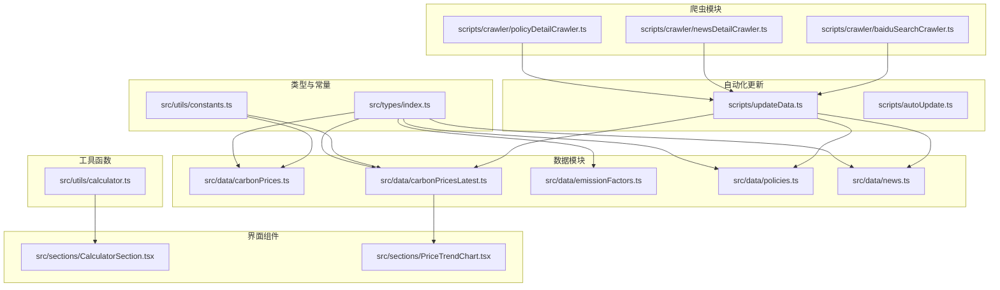
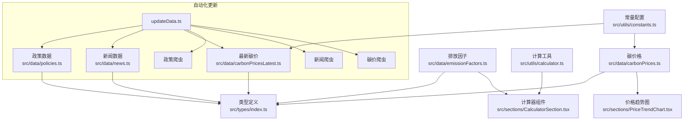
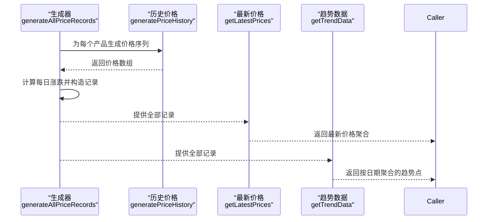
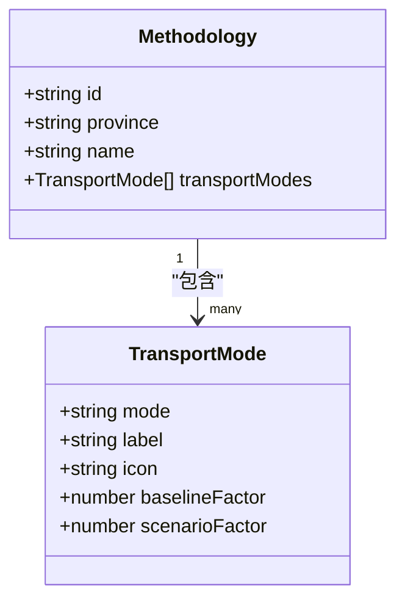
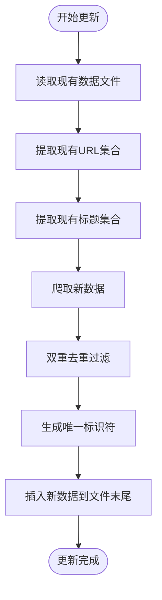
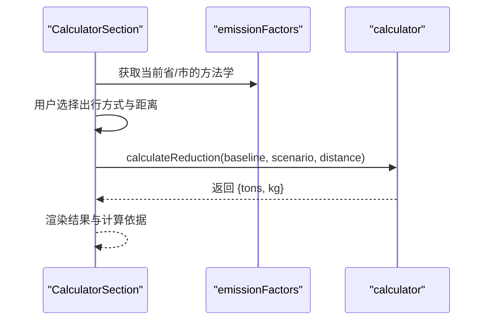
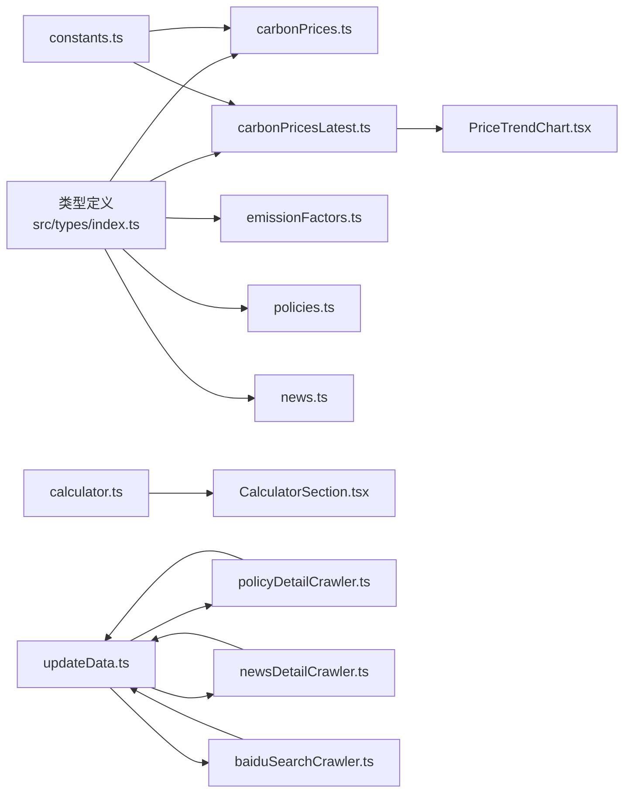

# 数据处理与转换

<cite>
**本文引用的文件**
- [src/utils/calculator.ts](file://src/utils/calculator.ts)
- [src/utils/constants.ts](file://src/utils/constants.ts)
- [src/data/carbonPrices.ts](file://src/data/carbonPrices.ts)
- [src/data/carbonPricesLatest.ts](file://src/data/carbonPricesLatest.ts)
- [src/data/emissionFactors.ts](file://src/data/emissionFactors.ts)
- [src/data/policies.ts](file://src/data/policies.ts)
- [src/data/news.ts](file://src/data/news.ts)
- [src/types/index.ts](file://src/types/index.ts)
- [src/sections/CalculatorSection.tsx](file://src/sections/CalculatorSection.tsx)
- [src/sections/PriceTrendChart.tsx](file://src/sections/PriceTrendChart.tsx)
- [scripts/updateData.ts](file://scripts/updateData.ts)
- [scripts/autoUpdate.ts](file://scripts/autoUpdate.ts)
- [scripts/crawler/policyDetailCrawler.ts](file://scripts/crawler/policyDetailCrawler.ts)
- [scripts/crawler/newsDetailCrawler.ts](file://scripts/crawler/newsDetailCrawler.ts)
- [scripts/crawler/baiduSearchCrawler.ts](file://scripts/crawler/baiduSearchCrawler.ts)
- [package.json](file://package.json)
</cite>

## 目录
1. [简介](#简介)
2. [项目结构](#项目结构)
3. [核心组件](#核心组件)
4. [架构总览](#架构总览)
5. [详细组件分析](#详细组件分析)
6. [依赖关系分析](#依赖关系分析)
7. [性能考虑](#性能考虑)
8. [故障排查指南](#故障排查指南)
9. [结论](#结论)
10. [附录](#附录)

## 简介
本文件系统性梳理本项目的数据处理与转换实现，覆盖数据预处理、格式转换与计算逻辑，解释数据清洗规则、异常值处理与标准化流程，阐述工具函数设计思路、算法实现与性能优化策略，说明常量配置管理、环境变量处理与动态配置更新方式，并给出数据验证、错误处理与异常恢复策略，最后提供扩展方法与新增计算逻辑、自定义转换规则的实践建议。

**更新** 本版本新增了自动化数据更新与智能去重功能，通过增量合并算法确保手动维护数据与自动化数据的和谐共存。

## 项目结构
项目采用按功能模块组织的前端结构，数据层以纯数据模块为主，配合类型定义与工具函数；界面层通过组件消费数据与工具函数完成展示与交互。新增了自动化数据更新脚本和爬虫模块，实现数据的自动获取与智能去重。

**图表来源**
- [src/types/index.ts:1-65](file://src/types/index.ts#L1-L65)
- [src/utils/constants.ts:1-44](file://src/utils/constants.ts#L1-L44)
- [src/data/carbonPrices.ts:1-103](file://src/data/carbonPrices.ts#L1-L103)
- [src/data/carbonPricesLatest.ts:1-67](file://src/data/carbonPricesLatest.ts#L1-L67)
- [src/data/emissionFactors.ts:1-103](file://src/data/emissionFactors.ts#L1-L103)
- [src/data/policies.ts:1-436](file://src/data/policies.ts#L1-L436)
- [src/data/news.ts:1-253](file://src/data/news.ts#L1-L253)
- [src/utils/calculator.ts:1-12](file://src/utils/calculator.ts#L1-L12)
- [src/sections/CalculatorSection.tsx:1-161](file://src/sections/CalculatorSection.tsx#L1-L161)
- [src/sections/PriceTrendChart.tsx:1-134](file://src/sections/PriceTrendChart.tsx#L1-L134)
- [scripts/updateData.ts:1-305](file://scripts/updateData.ts#L1-L305)
- [scripts/autoUpdate.ts:1-53](file://scripts/autoUpdate.ts#L1-L53)
- [scripts/crawler/policyDetailCrawler.ts:1-204](file://scripts/crawler/policyDetailCrawler.ts#L1-L204)
- [scripts/crawler/newsDetailCrawler.ts:1-339](file://scripts/crawler/newsDetailCrawler.ts#L1-L339)
- [scripts/crawler/baiduSearchCrawler.ts:1-110](file://scripts/crawler/baiduSearchCrawler.ts#L1-L110)

**章节来源**
- [src/types/index.ts:1-65](file://src/types/index.ts#L1-L65)
- [src/utils/constants.ts:1-44](file://src/utils/constants.ts#L1-L44)
- [src/data/carbonPrices.ts:1-103](file://src/data/carbonPrices.ts#L1-L103)
- [src/data/carbonPricesLatest.ts:1-67](file://src/data/carbonPricesLatest.ts#L1-L67)
- [src/data/emissionFactors.ts:1-103](file://src/data/emissionFactors.ts#L1-L103)
- [src/data/policies.ts:1-436](file://src/data/policies.ts#L1-L436)
- [src/data/news.ts:1-253](file://src/data/news.ts#L1-L253)
- [src/utils/calculator.ts:1-12](file://src/utils/calculator.ts#L1-L12)
- [src/sections/CalculatorSection.tsx:1-161](file://src/sections/CalculatorSection.tsx#L1-L161)
- [src/sections/PriceTrendChart.tsx:1-134](file://src/sections/PriceTrendChart.tsx#L1-L134)
- [scripts/updateData.ts:1-305](file://scripts/updateData.ts#L1-L305)
- [scripts/autoUpdate.ts:1-53](file://scripts/autoUpdate.ts#L1-L53)
- [scripts/crawler/policyDetailCrawler.ts:1-204](file://scripts/crawler/policyDetailCrawler.ts#L1-L204)
- [scripts/crawler/newsDetailCrawler.ts:1-339](file://scripts/crawler/newsDetailCrawler.ts#L1-L339)
- [scripts/crawler/baiduSearchCrawler.ts:1-110](file://scripts/crawler/baiduSearchCrawler.ts#L1-L110)

## 核心组件
- 计算工具函数：提供碳减排量计算，输入基线与情景排放因子及距离，输出吨与千克两种单位的减排量。
- 常量配置：集中管理区域类型、省份列表、政策分类与状态、碳产品元信息等。
- 数据模块：
  - 碳价格：生成历史价格序列、最新价格聚合与趋势点数据。
  - 碳价格最新数据：通过百度搜索获取实时碳价数据，生成最新价格文件。
  - 排放因子：按省/市提供不同交通方式的基线与情景排放因子。
  - 政策：全国与多地碳普惠/方法学政策清单，支持增量更新。
  - 新闻：生成近20天的模拟新闻数据，支持增量更新。
- 类型定义：统一Policy、CarbonProduct、PriceRecord、TransportMode、NewsItem等接口。
- 界面组件：计算器组件消费排放因子与计算函数；价格趋势图组件消费价格趋势数据。
- 自动化更新：通过updateData脚本实现数据的自动获取、智能去重和增量合并。
- 爬虫模块：政策详情爬虫、新闻爬虫、碳价搜索爬虫，提供数据获取能力。

**更新** 新增自动化数据更新和爬虫模块，实现数据的自动获取与智能去重。

**章节来源**
- [src/utils/calculator.ts:1-12](file://src/utils/calculator.ts#L1-L12)
- [src/utils/constants.ts:1-44](file://src/utils/constants.ts#L1-L44)
- [src/data/carbonPrices.ts:1-103](file://src/data/carbonPrices.ts#L1-L103)
- [src/data/carbonPricesLatest.ts:1-67](file://src/data/carbonPricesLatest.ts#L1-L67)
- [src/data/emissionFactors.ts:1-103](file://src/data/emissionFactors.ts#L1-L103)
- [src/data/policies.ts:1-436](file://src/data/policies.ts#L1-L436)
- [src/data/news.ts:1-253](file://src/data/news.ts#L1-L253)
- [src/types/index.ts:1-65](file://src/types/index.ts#L1-L65)
- [src/sections/CalculatorSection.tsx:1-161](file://src/sections/CalculatorSection.tsx#L1-L161)
- [src/sections/PriceTrendChart.tsx:1-134](file://src/sections/PriceTrendChart.tsx#L1-L134)
- [scripts/updateData.ts:1-305](file://scripts/updateData.ts#L1-L305)
- [scripts/autoUpdate.ts:1-53](file://scripts/autoUpdate.ts#L1-L53)
- [scripts/crawler/policyDetailCrawler.ts:1-204](file://scripts/crawler/policyDetailCrawler.ts#L1-L204)
- [scripts/crawler/newsDetailCrawler.ts:1-339](file://scripts/crawler/newsDetailCrawler.ts#L1-L339)
- [scripts/crawler/baiduSearchCrawler.ts:1-110](file://scripts/crawler/baiduSearchCrawler.ts#L1-L110)

## 架构总览
数据从"数据模块"生成或加载，经"工具函数"进行计算转换，最终由"界面组件"渲染展示。类型定义贯穿全链路，确保数据结构一致性。新增的自动化更新架构实现了数据的自动获取、智能去重和增量合并，确保手动维护数据与自动化数据的和谐共存。

**图表来源**
- [src/data/policies.ts:1-436](file://src/data/policies.ts#L1-L436)
- [src/data/news.ts:1-253](file://src/data/news.ts#L1-L253)
- [src/data/emissionFactors.ts:1-103](file://src/data/emissionFactors.ts#L1-L103)
- [src/data/carbonPrices.ts:1-103](file://src/data/carbonPrices.ts#L1-L103)
- [src/data/carbonPricesLatest.ts:1-67](file://src/data/carbonPricesLatest.ts#L1-L67)
- [src/utils/constants.ts:1-44](file://src/utils/constants.ts#L1-L44)
- [src/utils/calculator.ts:1-12](file://src/utils/calculator.ts#L1-L12)
- [src/sections/CalculatorSection.tsx:1-161](file://src/sections/CalculatorSection.tsx#L1-L161)
- [src/sections/PriceTrendChart.tsx:1-134](file://src/sections/PriceTrendChart.tsx#L1-L134)
- [scripts/updateData.ts:1-305](file://scripts/updateData.ts#L1-L305)
- [scripts/crawler/policyDetailCrawler.ts:1-204](file://scripts/crawler/policyDetailCrawler.ts#L1-L204)
- [scripts/crawler/newsDetailCrawler.ts:1-339](file://scripts/crawler/newsDetailCrawler.ts#L1-L339)
- [scripts/crawler/baiduSearchCrawler.ts:1-110](file://scripts/crawler/baiduSearchCrawler.ts#L1-L110)

## 详细组件分析

### 计算工具函数：calculateReduction
- 设计思路：基于"基线排放因子 - 情景排放因子"的差值与距离相乘得到kg级减排量，再换算为吨，保留合理精度。
- 输入参数：基线因子、情景因子、距离（公里）
- 输出结果：包含吨与千克两种单位的对象
- 性能特征：纯数值运算，时间复杂度O(1)，内存占用极低
- 异常处理：未显式校验参数合法性，调用方应保证输入非负且为有效数字

**图表来源**
- [src/utils/calculator.ts:1-12](file://src/utils/calculator.ts#L1-L12)

**章节来源**
- [src/utils/calculator.ts:1-12](file://src/utils/calculator.ts#L1-L12)

### 碳价格数据模块：carbonPrices
- 数据生成：为每种碳产品生成固定天数的历史价格序列，使用线性同余生成器控制随机性，限制价格波动幅度，确保稳定性与合理性。
- 格式转换：将价格序列转换为价格记录数组，计算日涨跌；按市场类型聚合趋势点。
- 标准化流程：日期格式统一为"年-月-日"，价格与涨跌保留两位小数，避免浮点误差累积。
- 异常值处理：通过上下边界约束（价格在一定倍率范围内波动），过滤极端异常值。
- 动态配置更新：通过常量表配置不同产品的基础价格、波动率与种子，便于快速调整与扩展。

**图表来源**
- [src/data/carbonPrices.ts:1-103](file://src/data/carbonPrices.ts#L1-L103)
- [src/utils/constants.ts:26-44](file://src/utils/constants.ts#L26-L44)

**章节来源**
- [src/data/carbonPrices.ts:1-103](file://src/data/carbonPrices.ts#L1-L103)
- [src/utils/constants.ts:1-44](file://src/utils/constants.ts#L1-L44)

### 碳价格最新数据模块：carbonPricesLatest
- 数据来源：通过百度搜索爬虫获取实时碳价数据，包含全国碳市场CEA、CCER、各省市碳配额等。
- 数据结构：包含产品ID、名称、价格、涨跌幅、日期和数据来源。
- 更新机制：每日自动更新，生成最新的价格数据文件。
- 应用场景：为界面组件提供实时碳价数据，支持价格查询和对比功能。

**章节来源**
- [src/data/carbonPricesLatest.ts:1-67](file://src/data/carbonPricesLatest.ts#L1-L67)
- [scripts/crawler/baiduSearchCrawler.ts:1-110](file://scripts/crawler/baiduSearchCrawler.ts#L1-L110)

### 排放因子数据模块：emissionFactors
- 数据结构：按省/市分组，每组包含多种交通方式的基线与情景排放因子。
- 预处理：直接导出结构化数组，供界面组件按省筛选与模式匹配。
- 转换规则：界面组件根据所选省与出行方式提取对应因子，交由计算函数得出减排量。
- 扩展方式：新增省/市或交通方式只需在数组中追加对象，保持接口一致。

**图表来源**
- [src/data/emissionFactors.ts:1-103](file://src/data/emissionFactors.ts#L1-L103)
- [src/types/index.ts:39-53](file://src/types/index.ts#L39-L53)

**章节来源**
- [src/data/emissionFactors.ts:1-103](file://src/data/emissionFactors.ts#L1-L103)
- [src/types/index.ts:39-53](file://src/types/index.ts#L39-L53)

### 政策数据模块：policies
- 数据结构：统一Policy接口，包含地区类型、省份、分类、状态、发布日期、发布机构、摘要、来源链接等。
- 预处理：按国家、省、市维度组织，支持状态（有效/已失效）与分类（政策/方法学）筛选。
- 转换规则：界面层按区域类型与状态过滤，展示摘要与来源链接。
- 扩展方式：新增政策时遵循接口字段，补充地区类型与状态枚举即可。
- **智能去重**：通过updateData脚本实现URL和标题双重去重，确保手动维护数据与自动化数据和谐共存。

**更新** 新增智能去重功能，通过URL和标题双重去重确保数据质量。

**章节来源**
- [src/data/policies.ts:1-436](file://src/data/policies.ts#L1-L436)
- [src/types/index.ts:1-14](file://src/types/index.ts#L1-L14)
- [scripts/updateData.ts:81-84](file://scripts/updateData.ts#L81-L84)

### 新闻数据模块：news
- 数据生成：生成近20天的模拟新闻，模板化标题、摘要与标签，按来源映射URL。
- 格式转换：统一publishDate格式，生成唯一id，附加tags。
- 异常处理：若来源无映射则回退到通用搜索URL，保证可用性。
- **智能去重**：通过updateData脚本实现URL和标题双重去重，支持增量更新。

**更新** 新增智能去重功能，通过URL和标题双重去重确保数据质量。

**章节来源**
- [src/data/news.ts:1-253](file://src/data/news.ts#L1-L253)
- [scripts/updateData.ts:173-176](file://scripts/updateData.ts#L173-L176)

### 自动化数据更新：updateData
- **核心功能**：实现数据的自动获取、智能去重和增量合并，确保手动维护数据与自动化数据和谐共存。
- **增量合并算法**：读取现有数据文件，提取URL和标题用于去重，仅追加新数据。
- **智能去重机制**：
  - URL去重：防止重复的政策或新闻链接
  - 标题去重：防止重复的政策或新闻标题
  - 双重去重：同时基于URL和标题进行去重，提高准确性
- **唯一标识符生成**：为新数据生成唯一的ID，格式为"crawl-YYYYMMDD-NNN"或"search-YYYYMMDD-NNN"。
- **文件更新策略**：在文件末尾添加新数据，保留原有数据结构和注释。

**图表来源**
- [scripts/updateData.ts:41-127](file://scripts/updateData.ts#L41-L127)
- [scripts/updateData.ts:133-222](file://scripts/updateData.ts#L133-L222)

**章节来源**
- [scripts/updateData.ts:1-305](file://scripts/updateData.ts#L1-L305)

### 爬虫模块：policyDetailCrawler
- **功能**：从政府网站爬取真实的政策详情页URL和内容。
- **数据源**：包含生态环境部、各省市生态环境局等政府网站。
- **智能过滤**：通过关键词判断是否为碳相关政策，确保数据相关性。
- **URL去重**：在爬取阶段就进行URL去重，避免重复请求。
- **限流机制**：设置合理的请求间隔，避免被目标网站封禁。

**章节来源**
- [scripts/crawler/policyDetailCrawler.ts:1-204](file://scripts/crawler/policyDetailCrawler.ts#L1-L204)

### 爬虫模块：newsDetailCrawler
- **功能**：基于搜狗新闻搜索获取碳市场相关信息。
- **搜索策略**：多组关键词覆盖碳市场各个领域，包括碳市场、碳普惠、CCER等。
- **智能过滤**：通过碳相关关键词过滤搜索结果，确保数据质量。
- **去重机制**：按标题去重，合并相同标题的不同标签。
- **来源识别**：从URL推断新闻来源，提高数据可信度。

**章节来源**
- [scripts/crawler/newsDetailCrawler.ts:1-339](file://scripts/crawler/newsDetailCrawler.ts#L1-L339)

### 爬虫模块：baiduSearchCrawler
- **功能**：通过百度搜索获取实时碳价信息。
- **搜索范围**：全国碳市场CEA、CCER、各省市碳配额等主要碳产品。
- **价格解析**：支持多种价格格式的解析，包括价格和涨跌幅。
- **数据验证**：通过合理的价格范围过滤无效数据。

**章节来源**
- [scripts/crawler/baiduSearchCrawler.ts:1-110](file://scripts/crawler/baiduSearchCrawler.ts#L1-L110)

### 界面组件：CalculatorSection
- 输入处理：省/市选择、出行方式选择、距离输入；距离输入进行非负数与数值转换。
- 计算流程：根据省/市筛选方法学，匹配出行方式，调用计算函数得到减排量。
- 展示逻辑：当输入有效时展示吨与千克两种单位结果，同时显示计算依据。

**图表来源**
- [src/sections/CalculatorSection.tsx:1-161](file://src/sections/CalculatorSection.tsx#L1-L161)
- [src/data/emissionFactors.ts:1-103](file://src/data/emissionFactors.ts#L1-L103)
- [src/utils/calculator.ts:1-12](file://src/utils/calculator.ts#L1-L12)

**章节来源**
- [src/sections/CalculatorSection.tsx:1-161](file://src/sections/CalculatorSection.tsx#L1-L161)
- [src/data/emissionFactors.ts:1-103](file://src/data/emissionFactors.ts#L1-L103)
- [src/utils/calculator.ts:1-12](file://src/utils/calculator.ts#L1-L12)

### 界面组件：PriceTrendChart
- 输入处理：接收按日期聚合的价格趋势点数据，按市场类型过滤产品。
- 交互逻辑：支持勾选/取消产品，支持全选/反选；颜色与产品ID绑定。
- 渲染逻辑：使用响应式折线图组件绘制趋势曲线，设置坐标轴标签与提示样式。

**章节来源**
- [src/sections/PriceTrendChart.tsx:1-134](file://src/sections/PriceTrendChart.tsx#L1-L134)
- [src/data/carbonPrices.ts:85-102](file://src/data/carbonPrices.ts#L85-L102)
- [src/utils/constants.ts:26-44](file://src/utils/constants.ts#L26-L44)

## 依赖关系分析
- 类型依赖：所有数据模块与工具函数均依赖类型定义，确保接口一致性。
- 常量依赖：碳价格模块依赖常量中的产品元信息与单位等配置。
- 组件依赖：界面组件分别依赖数据模块与工具函数，形成清晰的单向依赖链。
- 外部库：使用dayjs进行日期处理，使用recharts进行可视化渲染。
- **自动化依赖**：updateData脚本依赖爬虫模块获取数据，依赖文件系统进行数据更新。
- **爬虫依赖**：爬虫模块依赖HTTP客户端和正则表达式进行数据解析。

**图表来源**
- [src/types/index.ts:1-65](file://src/types/index.ts#L1-L65)
- [src/utils/constants.ts:1-44](file://src/utils/constants.ts#L1-L44)
- [src/utils/calculator.ts:1-12](file://src/utils/calculator.ts#L1-L12)
- [src/data/carbonPrices.ts:1-103](file://src/data/carbonPrices.ts#L1-L103)
- [src/data/carbonPricesLatest.ts:1-67](file://src/data/carbonPricesLatest.ts#L1-L67)
- [src/data/emissionFactors.ts:1-103](file://src/data/emissionFactors.ts#L1-L103)
- [src/data/policies.ts:1-436](file://src/data/policies.ts#L1-L436)
- [src/data/news.ts:1-253](file://src/data/news.ts#L1-L253)
- [src/sections/CalculatorSection.tsx:1-161](file://src/sections/CalculatorSection.tsx#L1-L161)
- [src/sections/PriceTrendChart.tsx:1-134](file://src/sections/PriceTrendChart.tsx#L1-L134)
- [scripts/updateData.ts:1-305](file://scripts/updateData.ts#L1-L305)
- [scripts/crawler/policyDetailCrawler.ts:1-204](file://scripts/crawler/policyDetailCrawler.ts#L1-L204)
- [scripts/crawler/newsDetailCrawler.ts:1-339](file://scripts/crawler/newsDetailCrawler.ts#L1-L339)
- [scripts/crawler/baiduSearchCrawler.ts:1-110](file://scripts/crawler/baiduSearchCrawler.ts#L1-L110)

**章节来源**
- [src/types/index.ts:1-65](file://src/types/index.ts#L1-L65)
- [src/utils/constants.ts:1-44](file://src/utils/constants.ts#L1-L44)
- [src/utils/calculator.ts:1-12](file://src/utils/calculator.ts#L1-L12)
- [src/data/carbonPrices.ts:1-103](file://src/data/carbonPrices.ts#L1-L103)
- [src/data/carbonPricesLatest.ts:1-67](file://src/data/carbonPricesLatest.ts#L1-L67)
- [src/data/emissionFactors.ts:1-103](file://src/data/emissionFactors.ts#L1-L103)
- [src/data/policies.ts:1-436](file://src/data/policies.ts#L1-L436)
- [src/data/news.ts:1-253](file://src/data/news.ts#L1-L253)
- [src/sections/CalculatorSection.tsx:1-161](file://src/sections/CalculatorSection.tsx#L1-L161)
- [src/sections/PriceTrendChart.tsx:1-134](file://src/sections/PriceTrendChart.tsx#L1-L134)
- [scripts/updateData.ts:1-305](file://scripts/updateData.ts#L1-L305)
- [scripts/autoUpdate.ts:1-53](file://scripts/autoUpdate.ts#L1-L53)
- [scripts/crawler/policyDetailCrawler.ts:1-204](file://scripts/crawler/policyDetailCrawler.ts#L1-L204)
- [scripts/crawler/newsDetailCrawler.ts:1-339](file://scripts/crawler/newsDetailCrawler.ts#L1-L339)
- [scripts/crawler/baiduSearchCrawler.ts:1-110](file://scripts/crawler/baiduSearchCrawler.ts#L1-L110)

## 性能考虑
- 计算函数：纯数学运算，O(1)复杂度，开销极低。
- 数据生成：历史价格生成循环次数固定（天数），整体线性复杂度；使用整型线性同余生成器与边界约束，避免昂贵的随机分布计算。
- 可视化：趋势图组件按需渲染可见产品，减少不必要的线条绘制。
- 内存占用：数据模块以只读数组形式存在，组件通过memo化与选择器减少重复计算与重渲染。
- **自动化更新**：采用并行更新策略，同时更新碳价、政策和新闻数据，提高更新效率。
- **智能去重**：使用Set数据结构进行去重，时间复杂度O(n)，内存占用较小。
- **爬虫性能**：设置合理的请求间隔和超时时间，避免过度请求影响目标网站性能。

**更新** 新增自动化更新和智能去重的性能考虑。

## 故障排查指南
- 输入非法导致计算异常
  - 现象：距离为负或非数字时，结果为空或NaN
  - 处理：在组件层对输入进行非负数与数值转换，确保传入计算函数的参数有效
  - 参考路径：[src/sections/CalculatorSection.tsx:96-113](file://src/sections/CalculatorSection.tsx#L96-L113)
- 价格数据缺失
  - 现象：最新价格或趋势点出现0值
  - 处理：数据模块对缺失记录返回默认值，确保图表不中断
  - 参考路径：[src/data/carbonPrices.ts:64-83](file://src/data/carbonPrices.ts#L64-L83)
- 图表渲染异常
  - 现象：产品切换后部分线条不显示
  - 处理：确认产品ID与颜色映射一致，检查可见集合状态更新逻辑
  - 参考路径：[src/sections/PriceTrendChart.tsx:37-55](file://src/sections/PriceTrendChart.tsx#L37-L55)
- 日期格式问题
  - 现象：趋势图横轴标签显示异常
  - 处理：统一使用dayjs格式化，确保日期字符串一致
  - 参考路径：[src/data/carbonPrices.ts:88-90](file://src/data/carbonPrices.ts#L88-L90)
- **自动化更新失败**
  - 现象：updateData脚本执行失败或数据未更新
  - 处理：检查爬虫模块是否正常工作，确认文件权限，查看控制台错误信息
  - 参考路径：[scripts/updateData.ts:282-294](file://scripts/updateData.ts#L282-L294)
- **智能去重失效**
  - 现象：重复数据仍然出现
  - 处理：检查URL和标题提取正则表达式，确认escapeForTS函数正确转义特殊字符
  - 参考路径：[scripts/updateData.ts:55-67](file://scripts/updateData.ts#L55-L67)
- **爬虫被封禁**
  - 现象：爬虫请求失败或返回空数据
  - 处理：检查rateLimitMs设置，确认User-Agent，查看目标网站robots.txt
  - 参考路径：[scripts/crawler/policyDetailCrawler.ts:73](file://scripts/crawler/policyDetailCrawler.ts#L73)

**更新** 新增自动化更新和智能去重相关的故障排查指南。

**章节来源**
- [src/sections/CalculatorSection.tsx:96-113](file://src/sections/CalculatorSection.tsx#L96-L113)
- [src/data/carbonPrices.ts:64-83](file://src/data/carbonPrices.ts#L64-L83)
- [src/sections/PriceTrendChart.tsx:37-55](file://src/sections/PriceTrendChart.tsx#L37-L55)
- [src/data/carbonPrices.ts:88-90](file://src/data/carbonPrices.ts#L88-L90)
- [scripts/updateData.ts:282-294](file://scripts/updateData.ts#L282-L294)
- [scripts/updateData.ts:55-67](file://scripts/updateData.ts#L55-L67)
- [scripts/crawler/policyDetailCrawler.ts:73](file://scripts/crawler/policyDetailCrawler.ts#L73)

## 结论
本项目的数据处理与转换以"纯数据模块 + 工具函数 + 类型定义 + 界面组件"的分层架构实现，具备良好的可维护性与扩展性。计算函数简洁高效，数据模块通过常量与配置实现灵活扩展，界面组件通过选择器与memo化降低渲染成本。

**更新** 新版本通过自动化数据更新和智能去重功能，实现了数据的自动获取与高质量维护，确保手动维护数据与自动化数据的和谐共存。爬虫模块提供了强大的数据获取能力，增量合并算法保证了数据的一致性和完整性。

建议在生产环境中增加输入校验与错误边界，以增强健壮性。同时可以考虑增加数据版本控制和回滚机制，以便在出现问题时能够快速恢复。

## 附录

### 常量配置管理与动态更新
- 常量集中管理：区域类型、省份、政策分类与状态、碳产品元信息等集中于常量文件，便于统一维护。
- 动态更新建议：在应用层引入配置中心或运行时配置对象，组件订阅配置变更事件，实现无需重启的动态更新。

**章节来源**
- [src/utils/constants.ts:1-44](file://src/utils/constants.ts#L1-L44)

### 环境变量处理
- 当前项目未发现环境变量使用；如需支持，可在构建脚本或运行时注入配置，避免硬编码。

**章节来源**
- [package.json](file://package.json)

### 数据验证与标准化
- 数据验证：在组件层对用户输入进行非负数与数值转换；在数据模块对缺失记录提供默认值。
- 标准化：统一日期格式、价格与涨跌精度、单位与标签，确保跨模块一致性。
- **智能去重**：通过URL和标题双重去重，确保数据质量；使用Set数据结构提高去重效率。

**更新** 新增智能去重机制。

**章节来源**
- [src/sections/CalculatorSection.tsx:96-113](file://src/sections/CalculatorSection.tsx#L96-L113)
- [src/data/carbonPrices.ts:64-83](file://src/data/carbonPrices.ts#L64-L83)
- [scripts/updateData.ts:81-84](file://scripts/updateData.ts#L81-L84)
- [scripts/updateData.ts:173-176](file://scripts/updateData.ts#L173-L176)

### 扩展方式与新增规则
- 新增碳产品：在常量配置中添加产品元信息，数据模块自动纳入历史价格生成与趋势计算。
- 新增省/市方法学：在排放因子数组中追加新的省/市条目，组件自动可用。
- 新增政策：在政策数组中追加新条目，界面层按分类与状态过滤展示。
- **自动化数据扩展**：新增爬虫数据源，修改updateData脚本中的数据源配置。
- **自定义转换规则**：通过在数据模块中新增转换函数或在组件中扩展选择器，保持类型定义不变。

**更新** 新增自动化数据扩展和自定义转换规则。

**章节来源**
- [src/utils/constants.ts:26-44](file://src/utils/constants.ts#L26-L44)
- [src/data/emissionFactors.ts:1-103](file://src/data/emissionFactors.ts#L1-L103)
- [src/data/policies.ts:1-436](file://src/data/policies.ts#L1-L436)
- [src/types/index.ts:1-65](file://src/types/index.ts#L1-L65)
- [scripts/updateData.ts:19-35](file://scripts/updateData.ts#L19-L35)

### 自动化更新流程
- **执行流程**：updateData脚本并行更新碳价、政策和新闻数据，然后自动提交到Git仓库。
- **定时任务**：通过GitHub Actions实现每日自动更新，确保数据的时效性。
- **错误处理**：每个数据源都有独立的错误处理机制，单个数据源失败不影响其他数据源更新。
- **日志记录**：详细的控制台日志，便于监控和调试。

**章节来源**
- [scripts/updateData.ts:282-294](file://scripts/updateData.ts#L282-L294)
- [scripts/autoUpdate.ts:1-53](file://scripts/autoUpdate.ts#L1-L53)
- [.github/workflows/daily-update.yml:1-53](file://.github/workflows/daily-update.yml#L1-L53)