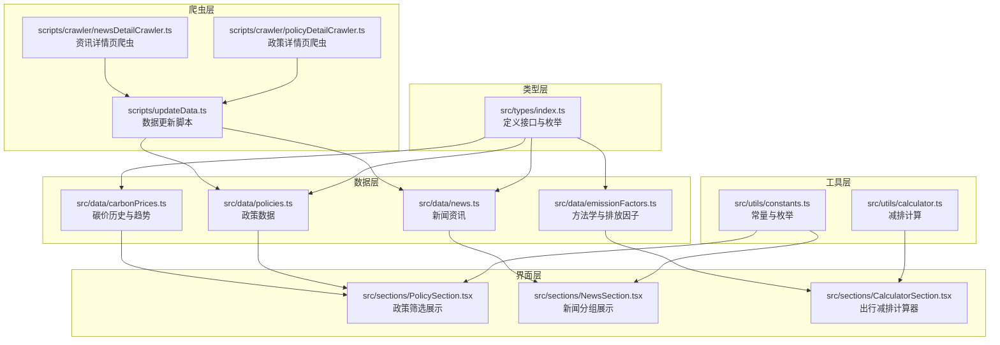
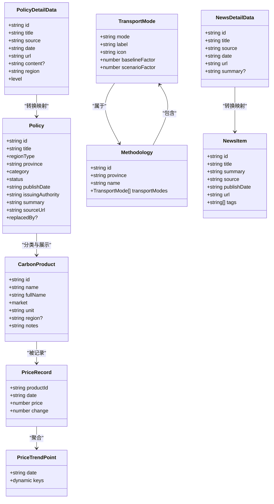
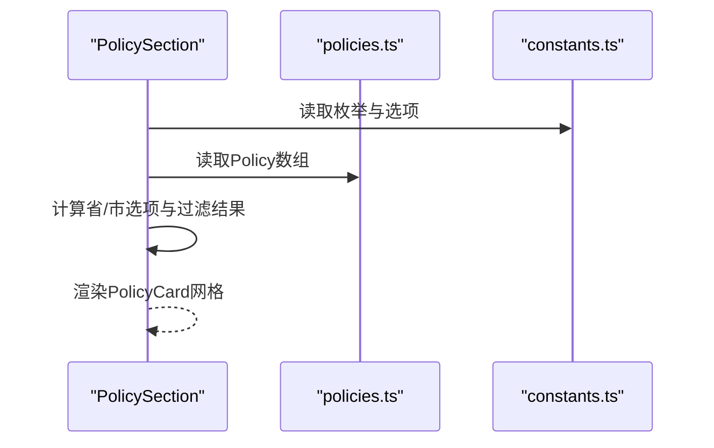
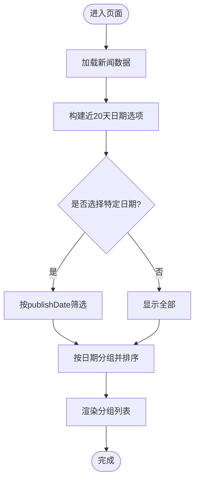
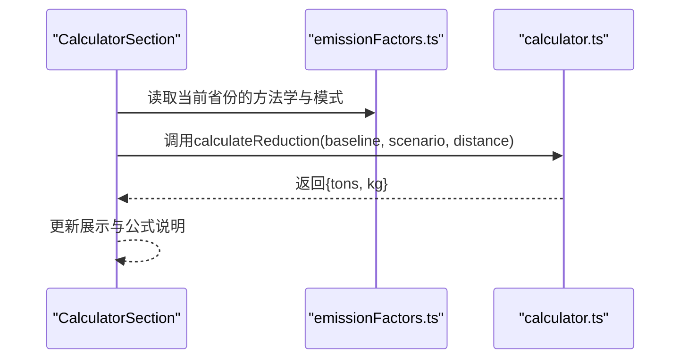
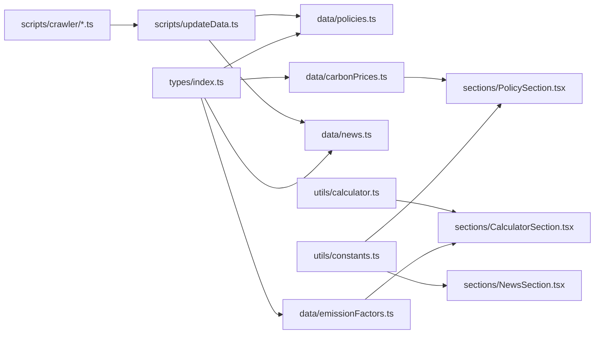

# 数据模型定义

<cite>
**本文引用的文件**
- [src/types/index.ts](file://src/types/index.ts)
- [src/data/policies.ts](file://src/data/policies.ts)
- [src/data/emissionFactors.ts](file://src/data/emissionFactors.ts)
- [src/data/news.ts](file://src/data/news.ts)
- [src/data/carbonPrices.ts](file://src/data/carbonPrices.ts)
- [src/utils/constants.ts](file://src/utils/constants.ts)
- [src/utils/calculator.ts](file://src/utils/calculator.ts)
- [src/sections/PolicySection.tsx](file://src/sections/PolicySection.tsx)
- [src/sections/NewsSection.tsx](file://src/sections/NewsSection.tsx)
- [src/sections/CalculatorSection.tsx](file://src/sections/CalculatorSection.tsx)
- [scripts/crawler/policyDetailCrawler.ts](file://scripts/crawler/policyDetailCrawler.ts)
- [scripts/crawler/newsDetailCrawler.ts](file://scripts/crawler/newsDetailCrawler.ts)
- [scripts/updateData.ts](file://scripts/updateData.ts)
</cite>

## 更新摘要
**变更内容**
- 新增PolicyDetailData和NewsDetailData接口定义，反映详情页爬虫系统提供的更详细数据结构
- 更新Policy和NewsItem数据模型，增加URL、摘要、地区、级别等丰富字段
- 增强数据模型的完整性，支持更详细的政策和资讯信息展示
- 完善数据转换流程，从爬虫接口到应用数据模型的映射关系

## 目录
1. [简介](#简介)
2. [项目结构](#项目结构)
3. [核心数据模型](#核心数据模型)
4. [架构总览](#架构总览)
5. [详细组件分析](#详细组件分析)
6. [依赖关系分析](#依赖关系分析)
7. [性能考量](#性能考量)
8. [故障排查指南](#故障排查指南)
9. [结论](#结论)
10. [附录](#附录)

## 简介
本文件系统化梳理碳普惠信息代理项目的数据模型，聚焦于Policy、CarbonProduct、TransportMode、NewsItem等核心数据结构，阐明字段语义、类型约束、业务规则与相互关系，并提供扩展与向后兼容建议，以及类型安全最佳实践与TS类型推导技巧。

**更新** 项目现已支持从详情页爬虫系统获取更丰富的数据，包括PolicyDetailData和NewsDetailData接口，提供URL、摘要、地区、级别等详细字段，增强了数据的完整性和实用性。

## 项目结构
项目采用按功能模块组织的前端结构，数据模型主要分布在以下位置：
- 类型定义：src/types/index.ts
- 静态数据：src/data/*.ts
- 爬虫系统：scripts/crawler/*.ts
- 工具常量与计算：src/utils/*.ts
- 页面组件与使用：src/sections/*.tsx

**图表来源**
- [src/types/index.ts:1-65](file://src/types/index.ts#L1-L65)
- [src/data/policies.ts:1-345](file://src/data/policies.ts#L1-L345)
- [src/data/emissionFactors.ts:1-103](file://src/data/emissionFactors.ts#L1-L103)
- [src/data/news.ts:1-109](file://src/data/news.ts#L1-L109)
- [src/data/carbonPrices.ts:1-103](file://src/data/carbonPrices.ts#L1-L103)
- [scripts/crawler/policyDetailCrawler.ts:1-204](file://scripts/crawler/policyDetailCrawler.ts#L1-L204)
- [scripts/crawler/newsDetailCrawler.ts:1-197](file://scripts/crawler/newsDetailCrawler.ts#L1-L197)
- [scripts/updateData.ts:1-194](file://scripts/updateData.ts#L1-L194)

**章节来源**
- [src/types/index.ts:1-65](file://src/types/index.ts#L1-L65)
- [src/data/policies.ts:1-345](file://src/data/policies.ts#L1-L345)
- [src/data/emissionFactors.ts:1-103](file://src/data/emissionFactors.ts#L1-L103)
- [src/data/news.ts:1-109](file://src/data/news.ts#L1-L109)
- [src/data/carbonPrices.ts:1-103](file://src/data/carbonPrices.ts#L1-L103)
- [scripts/crawler/policyDetailCrawler.ts:1-204](file://scripts/crawler/policyDetailCrawler.ts#L1-L204)
- [scripts/crawler/newsDetailCrawler.ts:1-197](file://scripts/crawler/newsDetailCrawler.ts#L1-L197)
- [scripts/updateData.ts:1-194](file://scripts/updateData.ts#L1-L194)

## 核心数据模型
本节逐项解析关键数据模型的字段、类型、约束与业务含义。

### PolicyDetailData（政策详情数据）
**新增** 政策详情页爬虫返回的详细数据结构

- 字段与类型
  - id: string（唯一标识符）
  - title: string（标题）
  - source: string（来源机构）
  - date: string（发布日期，YYYY-MM-DD）
  - url: string（详情页URL）
  - content?: string（政策全文内容，可选）
  - region: string（适用地区）
  - level: 'national' | 'provincial' | 'city'（区域层级）
- 约束与校验
  - 唯一键：id
  - 枚举值：level（national、provincial、city）
  - 可选字段：content
  - URL格式验证
- 业务含义
  - 提供政策详情页的完整信息，支持URL跳转和内容展示
- 关系
  - 作为爬虫输出接口，通过updateData.ts转换为Policy接口

**章节来源**
- [scripts/crawler/policyDetailCrawler.ts:8-17](file://scripts/crawler/policyDetailCrawler.ts#L8-L17)
- [scripts/crawler/policyDetailCrawler.ts:136-162](file://scripts/crawler/policyDetailCrawler.ts#L136-L162)
- [scripts/updateData.ts:25-50](file://scripts/updateData.ts#L25-L50)

### Policy（政策）
- 字段与类型
  - id: string（主键标识）
  - title: string（标题）
  - regionType: 'national' | 'province' | 'city'（区域层级）
  - province: string（省/市名称）
  - category: 'policy' | 'methodology'（政策类别）
  - status: 'active' | 'expired'（状态）
  - publishDate: string（发布日期，YYYY-MM-DD）
  - issuingAuthority: string（发布机构）
  - summary: string（摘要）
  - sourceUrl: string（来源链接）
  - replacedBy?: { id: string; title: string }（被替代项，可选）
- 约束与校验
  - 唯一键：id
  - 枚举值：regionType、category、status
  - 可选字段：replacedBy
  - 发布日期格式：字符串日期，建议统一为ISO 8601
- 业务含义
  - 描述碳普惠相关的政策文件或方法学，支持按区域、类别、状态过滤与展示。
- 关系
  - 与CarbonProduct无直接外键关联；通过category区分"政策"与"方法学"。
  - 由PolicyDetailData转换而来，增加了regionType和province字段映射。

**更新** 增加了从PolicyDetailData转换而来的字段映射，包括regionType、province、summary等。

**章节来源**
- [src/types/index.ts:2-14](file://src/types/index.ts#L2-L14)
- [src/data/policies.ts:3-344](file://src/data/policies.ts#L3-L344)
- [scripts/updateData.ts:37-48](file://scripts/updateData.ts#L37-L48)

### CarbonProduct（碳产品）
- 字段与类型
  - id: string（产品标识）
  - name: string（简称）
  - fullName: string（全称）
  - market: 'domestic' | 'international'（市场类型）
  - unit: string（单位）
  - region?: string（适用区域，可选）
  - notes: string（备注说明）
- 约束与校验
  - 唯一键：id
  - 枚举值：market
  - region可选，用于标注特定区域市场
- 业务含义
  - 定义碳市场产品元数据，用于价格展示与趋势分析。
- 关系
  - 与PriceRecord通过productId关联；与PriceTrendPoint通过productId键聚合。

**章节来源**
- [src/types/index.ts:17-25](file://src/types/index.ts#L17-L25)
- [src/utils/constants.ts:26-43](file://src/utils/constants.ts#L26-L43)

### TransportMode（交通出行模式）
- 字段与类型
  - mode: string（模式标识）
  - label: string（显示标签）
  - icon: string（图标名）
  - baselineFactor: number（基准排放因子，kgCO₂/km）
  - scenarioFactor: number（情景排放因子，kgCO₂/km）
- 约束与校验
  - 数值非负；baselineFactor ≥ scenarioFactor
  - 字段命名清晰，便于UI映射
- 业务含义
  - 描述不同出行方式的排放因子，用于计算减排量。
- 关系
  - 属于Methodology的子集合。

**章节来源**
- [src/types/index.ts:40-46](file://src/types/index.ts#L40-L46)
- [src/data/emissionFactors.ts:3-102](file://src/data/emissionFactors.ts#L3-L102)

### Methodology（方法学）
- 字段与类型
  - id: string（方法学标识）
  - province: string（适用省份）
  - name: string（方法学名称）
  - transportModes: TransportMode[]（出行模式数组）
- 约束与校验
  - 唯一键：id
  - transportModes非空且元素满足TransportMode约束
- 业务含义
  - 定义某地区的碳普惠方法学，包含多种出行方式的排放因子。
- 关系
  - 与TransportMode一对多；与CalculatorSection交互进行减排计算。

**章节来源**
- [src/types/index.ts:48-53](file://src/types/index.ts#L48-L53)
- [src/data/emissionFactors.ts:3-102](file://src/data/emissionFactors.ts#L3-L102)

### NewsDetailData（资讯详情数据）
**新增** 资讯详情页爬虫返回的详细数据结构

- 字段与类型
  - id: string（唯一标识符）
  - title: string（标题）
  - source: string（来源机构）
  - date: string（发布日期，YYYY-MM-DD）
  - url: string（详情页URL）
  - summary?: string（文章摘要，可选）
- 约束与校验
  - 唯一键：id
  - 可选字段：summary
  - URL格式验证
- 业务含义
  - 提供资讯详情页的完整信息，支持URL跳转和摘要展示
- 关系
  - 作为爬虫输出接口，通过updateData.ts转换为NewsItem接口

**章节来源**
- [scripts/crawler/newsDetailCrawler.ts:8-15](file://scripts/crawler/newsDetailCrawler.ts#L8-L15)
- [scripts/crawler/newsDetailCrawler.ts:115-148](file://scripts/crawler/newsDetailCrawler.ts#L115-L148)
- [scripts/updateData.ts:72-100](file://scripts/updateData.ts#L72-L100)

### NewsItem（新闻资讯）
- 字段与类型
  - id: string（主键）
  - title: string（标题）
  - summary: string（摘要）
  - source: string（来源）
  - publishDate: string（发布日期）
  - url: string（原文链接）
  - tags: string[]（标签数组）
- 约束与校验
  - 唯一键：id
  - tags为非空字符串数组
  - publishDate为字符串日期
- 业务含义
  - 提供碳普惠与碳市场相关新闻，支持按日期分组与筛选。
- 关系
  - 与NewsSection展示逻辑耦合。
  - 由NewsDetailData转换而来，增加了tags字段。

**更新** 增加了从NewsDetailData转换而来的字段映射，包括tags字段。

**章节来源**
- [src/types/index.ts:56-64](file://src/types/index.ts#L56-L64)
- [src/data/news.ts:5-96](file://src/data/news.ts#L5-L96)
- [scripts/updateData.ts:85-93](file://scripts/updateData.ts#L85-L93)

### PriceRecord（价格记录）
- 字段与类型
  - productId: string（产品标识）
  - date: string（日期）
  - price: number（价格）
  - change: number（日涨跌）
- 约束与校验
  - productId来自CarbonProduct.id
  - price与change为数值；change允许负值
- 业务含义
  - 表示某产品的每日价格序列，用于价格表与趋势图。
- 关系
  - 与CarbonProduct通过id关联；与PriceTrendPoint按日期聚合。

**章节来源**
- [src/types/index.ts:27-32](file://src/types/index.ts#L27-L32)
- [src/data/carbonPrices.ts:33-53](file://src/data/carbonPrices.ts#L33-L53)

### PriceTrendPoint（价格趋势点）
- 字段与类型
  - date: string（日期）
  - [productId: string]: number | string（动态键，productId为键，值为价格或日期别名）
- 约束与校验
  - 动态索引键；值为数值或字符串
- 业务含义
  - 将多个产品的价格按日期横向聚合，便于趋势图绘制。
- 关系
  - 由PriceRecord转换生成。

**章节来源**
- [src/types/index.ts:34-37](file://src/types/index.ts#L34-L37)
- [src/data/carbonPrices.ts:85-102](file://src/data/carbonPrices.ts#L85-L102)

## 架构总览
数据模型在应用中的角色与交互如下：

**图表来源**
- [src/types/index.ts:1-65](file://src/types/index.ts#L1-L65)
- [scripts/crawler/policyDetailCrawler.ts:8-17](file://scripts/crawler/policyDetailCrawler.ts#L8-L17)
- [scripts/crawler/newsDetailCrawler.ts:8-15](file://scripts/crawler/newsDetailCrawler.ts#L8-L15)

## 详细组件分析

### 政策筛选与展示（PolicySection）
- 数据来源：policies.ts
- 过滤维度：regionType、province、category、status
- 交互逻辑：根据区域类型动态生成省/市选项；按多维条件筛选并渲染卡片

**图表来源**
- [src/sections/PolicySection.tsx:1-93](file://src/sections/PolicySection.tsx#L1-L93)
- [src/data/policies.ts:1-345](file://src/data/policies.ts#L1-L345)
- [src/utils/constants.ts:1-44](file://src/utils/constants.ts#L1-L44)

**章节来源**
- [src/sections/PolicySection.tsx:1-93](file://src/sections/PolicySection.tsx#L1-L93)
- [src/data/policies.ts:1-345](file://src/data/policies.ts#L1-L345)
- [src/utils/constants.ts:1-44](file://src/utils/constants.ts#L1-L44)

### 新闻分组与筛选（NewsSection）
- 数据来源：news.ts
- 分组策略：按publishDate分组并按日期降序
- 交互逻辑：日期筛选按钮切换，支持"全部"与近20天日期

**图表来源**
- [src/sections/NewsSection.tsx:1-110](file://src/sections/NewsSection.tsx#L1-L110)
- [src/data/news.ts:1-109](file://src/data/news.ts#L1-L109)

**章节来源**
- [src/sections/NewsSection.tsx:1-110](file://src/sections/NewsSection.tsx#L1-L110)
- [src/data/news.ts:1-109](file://src/data/news.ts#L1-L109)

### 出行减排计算器（CalculatorSection）
- 数据来源：emissionFactors.ts（方法学与排放因子）
- 计算逻辑：基于TransportMode的baselineFactor与scenarioFactor，结合距离计算减排量（kg与ton）

**图表来源**
- [src/sections/CalculatorSection.tsx:1-161](file://src/sections/CalculatorSection.tsx#L1-L161)
- [src/data/emissionFactors.ts:1-103](file://src/data/emissionFactors.ts#L1-L103)
- [src/utils/calculator.ts:1-12](file://src/utils/calculator.ts#L1-L12)

**章节来源**
- [src/sections/CalculatorSection.tsx:1-161](file://src/sections/CalculatorSection.tsx#L1-L161)
- [src/data/emissionFactors.ts:1-103](file://src/data/emissionFactors.ts#L1-L103)
- [src/utils/calculator.ts:1-12](file://src/utils/calculator.ts#L1-L12)

## 依赖关系分析
- 类型定义与数据文件
  - types/index.ts定义的接口被data/*.ts文件实例化使用
- 爬虫系统与数据转换
  - scripts/crawler/*.ts提供爬虫接口，scripts/updateData.ts负责数据转换
- 组件与数据
  - sections/*.tsx通过import从data/*.ts读取静态数据
  - utils/constants.ts提供筛选与枚举选项，被sections使用
  - utils/calculator.ts提供计算函数，被CalculatorSection使用
- 外部依赖
  - dayjs用于日期处理（carbonPrices.ts、NewsSection.tsx）
  - lucide-react用于图标（sections中使用）

**图表来源**
- [src/types/index.ts:1-65](file://src/types/index.ts#L1-L65)
- [src/data/policies.ts:1-345](file://src/data/policies.ts#L1-L345)
- [src/data/emissionFactors.ts:1-103](file://src/data/emissionFactors.ts#L1-L103)
- [src/data/news.ts:1-109](file://src/data/news.ts#L1-L109)
- [src/data/carbonPrices.ts:1-103](file://src/data/carbonPrices.ts#L1-L103)
- [scripts/crawler/policyDetailCrawler.ts:1-204](file://scripts/crawler/policyDetailCrawler.ts#L1-L204)
- [scripts/crawler/newsDetailCrawler.ts:1-197](file://scripts/crawler/newsDetailCrawler.ts#L1-L197)
- [scripts/updateData.ts:1-194](file://scripts/updateData.ts#L1-L194)
- [src/utils/constants.ts:1-44](file://src/utils/constants.ts#L1-L44)
- [src/utils/calculator.ts:1-12](file://src/utils/calculator.ts#L1-L12)
- [src/sections/PolicySection.tsx:1-93](file://src/sections/PolicySection.tsx#L1-L93)
- [src/sections/NewsSection.tsx:1-110](file://src/sections/NewsSection.tsx#L1-L110)
- [src/sections/CalculatorSection.tsx:1-161](file://src/sections/CalculatorSection.tsx#L1-L161)

**章节来源**
- [src/types/index.ts:1-65](file://src/types/index.ts#L1-L65)
- [src/data/policies.ts:1-345](file://src/data/policies.ts#L1-L345)
- [src/data/emissionFactors.ts:1-103](file://src/data/emissionFactors.ts#L1-L103)
- [src/data/news.ts:1-109](file://src/data/news.ts#L1-L109)
- [src/data/carbonPrices.ts:1-103](file://src/data/carbonPrices.ts#L1-L103)
- [scripts/crawler/policyDetailCrawler.ts:1-204](file://scripts/crawler/policyDetailCrawler.ts#L1-L204)
- [scripts/crawler/newsDetailCrawler.ts:1-197](file://scripts/crawler/newsDetailCrawler.ts#L1-L197)
- [scripts/updateData.ts:1-194](file://scripts/updateData.ts#L1-L194)
- [src/utils/constants.ts:1-44](file://src/utils/constants.ts#L1-L44)
- [src/utils/calculator.ts:1-12](file://src/utils/calculator.ts#L1-L12)
- [src/sections/PolicySection.tsx:1-93](file://src/sections/PolicySection.tsx#L1-L93)
- [src/sections/NewsSection.tsx:1-110](file://src/sections/NewsSection.tsx#L1-L110)
- [src/sections/CalculatorSection.tsx:1-161](file://src/sections/CalculatorSection.tsx#L1-L161)

## 性能考量
- 数据规模
  - 当前静态数据规模较小，组件内使用useMemo进行筛选与分组，避免重复计算
- 时间复杂度
  - 筛选与分组操作为O(n)，n为数据条目数；在小规模数据下开销可忽略
- 内存与渲染
  - 使用React.memo与useMemo减少不必要的重渲染
- 数据转换优化
  - 爬虫数据转换采用批量处理，避免重复计算
- 建议
  - 若未来数据量增长，可考虑服务端分页、缓存与懒加载策略

## 故障排查指南
- 类型不匹配
  - 现象：编译报错或TS类型检查失败
  - 排查：确认接口字段与实际数据一致；检查枚举值拼写
- 数据缺失
  - 现象：组件渲染为空或异常
  - 排查：检查数据文件是否正确导入；确认默认值与可选字段处理
- 日期格式
  - 现象：日期比较或分组异常
  - 排查：统一使用ISO 8601日期字符串；必要时使用dayjs进行解析与比较
- 计算精度
  - 现象：小数位异常或精度丢失
  - 排查：使用parseFloat与toFixed控制精度；确保输入为数字类型
- 爬虫数据转换
  - 现象：PolicyDetailData转换为Policy时字段映射错误
  - 排查：检查updateData.ts中的字段映射逻辑；验证level到regionType的转换

**章节来源**
- [src/utils/calculator.ts:1-12](file://src/utils/calculator.ts#L1-L12)
- [src/data/carbonPrices.ts:1-103](file://src/data/carbonPrices.ts#L1-L103)
- [src/sections/NewsSection.tsx:1-110](file://src/sections/NewsSection.tsx#L1-L110)
- [scripts/updateData.ts:37-48](file://scripts/updateData.ts#L37-L48)

## 结论
本项目通过清晰的类型定义与静态数据组织，实现了政策、方法学、新闻与碳价等核心数据模型的稳定展示与交互。新增的PolicyDetailData和NewsDetailData接口提供了更丰富的数据结构，增强了系统的数据完整性和实用性。类型安全与TS推导在组件中得到良好运用，配合useMemo优化提升了性能。建议后续在数据量增长时引入服务端与缓存机制，并持续完善类型约束与错误处理。

## 附录

### 枚举与常量
- 区域类型：national、province、city
- 政策类别：policy、methodology
- 政策状态：active、expired
- 碳产品市场：domestic、international
- 政策层级：national、provincial、city

**更新** 新增政策层级枚举，支持national、provincial、city三个级别。

**章节来源**
- [src/utils/constants.ts:1-44](file://src/utils/constants.ts#L1-L44)
- [src/types/index.ts:5-8](file://src/types/index.ts#L5-L8)
- [src/types/index.ts:21](file://src/types/index.ts#L21)
- [src/types/index.ts:7-8](file://src/types/index.ts#L7-L8)
- [src/types/index.ts:8](file://src/types/index.ts#L8)
- [scripts/crawler/policyDetailCrawler.ts:16](file://scripts/crawler/policyDetailCrawler.ts#L16)

### 扩展指南与向后兼容
- 扩展字段
  - 在现有接口上新增可选字段，保持向后兼容
  - 对于新增枚举值，需同步更新常量与组件逻辑
- 数据迁移
  - 采用版本化数据结构；保留旧字段并在运行时做兼容转换
- 类型安全
  - 使用as const声明常量，获得更精确的类型推断
  - 对外部数据进行严格校验后再注入组件
- 爬虫数据集成
  - 新增PolicyDetailData和NewsDetailData接口，提供完整的爬虫数据结构
  - 通过updateData.ts实现爬虫数据到应用数据的平滑转换

**更新** 新增爬虫数据接口的扩展指南，包括PolicyDetailData和NewsDetailData的使用方法。

**章节来源**
- [src/types/index.ts:1-65](file://src/types/index.ts#L1-L65)
- [src/utils/constants.ts:1-44](file://src/utils/constants.ts#L1-L44)
- [scripts/crawler/policyDetailCrawler.ts:8-17](file://scripts/crawler/policyDetailCrawler.ts#L8-L17)
- [scripts/crawler/newsDetailCrawler.ts:8-15](file://scripts/crawler/newsDetailCrawler.ts#L8-L15)
- [scripts/updateData.ts:1-194](file://scripts/updateData.ts#L1-L194)

### TS类型推导技巧
- 使用as const提升字面量类型精度
- 使用Record<string, T>处理动态键
- 使用泛型与条件类型增强接口复用性
- 使用Partial、Pick、Omit等工具类型简化接口定义
- 使用类型守卫确保可选字段的安全访问
- 使用联合类型处理枚举值的精确匹配

**更新** 新增爬虫数据接口的类型推导技巧，包括PolicyDetailData和NewsDetailData的使用。

**章节来源**
- [src/types/index.ts:34-37](file://src/types/index.ts#L34-L37)
- [src/data/carbonPrices.ts:85-102](file://src/data/carbonPrices.ts#L85-L102)
- [scripts/crawler/policyDetailCrawler.ts:8-17](file://scripts/crawler/policyDetailCrawler.ts#L8-L17)
- [scripts/crawler/newsDetailCrawler.ts:8-15](file://scripts/crawler/newsDetailCrawler.ts#L8-L15)