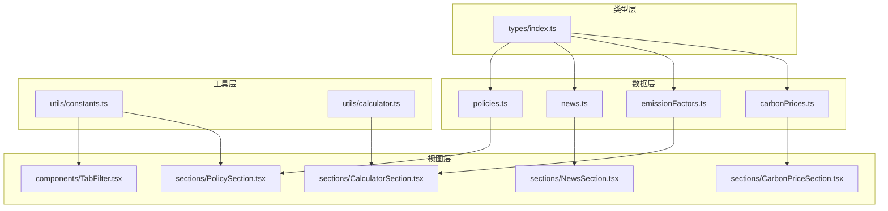
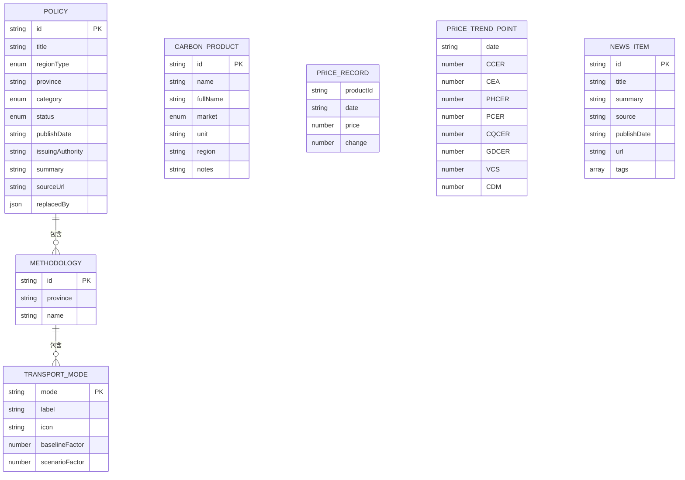
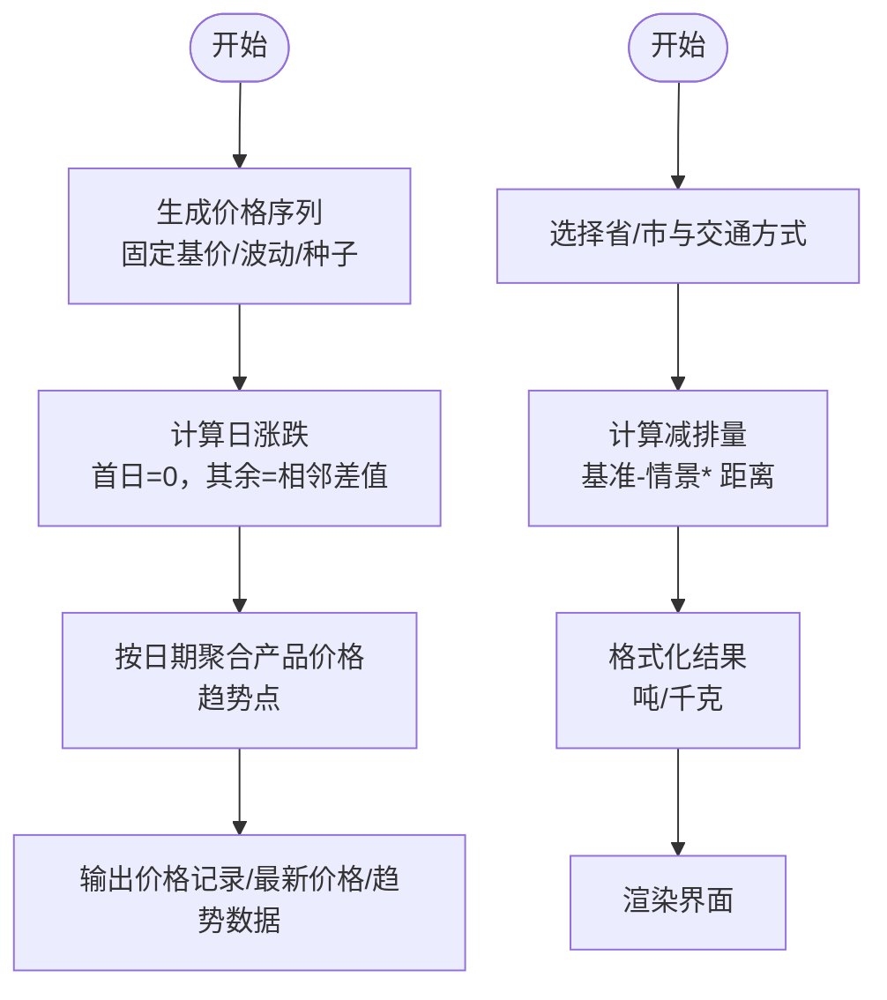
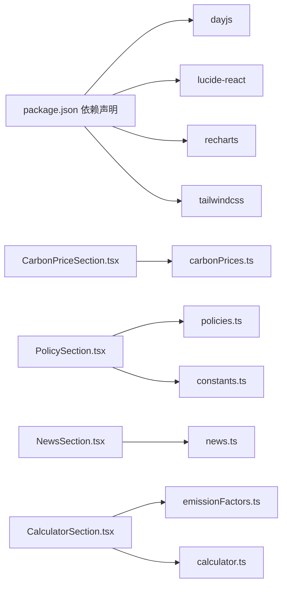

# 数据管理

<cite>
**本文引用的文件列表**
- [carbonPrices.ts](file://src/data/carbonPrices.ts)
- [emissionFactors.ts](file://src/data/emissionFactors.ts)
- [news.ts](file://src/data/news.ts)
- [policies.ts](file://src/data/policies.ts)
- [index.ts](file://src/types/index.ts)
- [constants.ts](file://src/utils/constants.ts)
- [calculator.ts](file://src/utils/calculator.ts)
- [CarbonPriceSection.tsx](file://src/sections/CarbonPriceSection.tsx)
- [PolicySection.tsx](file://src/sections/PolicySection.tsx)
- [NewsSection.tsx](file://src/sections/NewsSection.tsx)
- [CalculatorSection.tsx](file://src/sections/CalculatorSection.tsx)
- [TabFilter.tsx](file://src/components/TabFilter.tsx)
- [package.json](file://package.json)
</cite>

## 目录
1. [简介](#简介)
2. [项目结构与数据模块划分](#项目结构与数据模块划分)
3. [核心数据模型](#核心数据模型)
4. [数据源与加载策略](#数据源与加载策略)
5. [数据处理与转换流程](#数据处理与转换流程)
6. [缓存与性能优化](#缓存与性能优化)
7. [数据验证与错误处理](#数据验证与错误处理)
8. [数据扩展与迁移指南](#数据扩展与迁移指南)
9. [数据安全与隐私合规](#数据安全与隐私合规)
10. [依赖关系与架构图](#依赖关系与架构图)
11. [故障排查与常见问题](#故障排查与常见问题)
12. [结论](#结论)

## 简介
本文件系统性梳理碳普惠信息代理项目的数据管理方案，覆盖数据模型设计、数据源配置、数据处理流程、静态数据组织与加载、缓存机制、验证与异常恢复、数据转换与本地化、扩展与迁移策略、安全与合规以及性能优化等方面。文档面向开发者与产品/运营人员，既提供代码级细节，也给出可操作的实践建议。

## 项目结构与数据模块划分
项目采用“按功能域分层”的组织方式：
- 数据层：存放各业务领域的静态数据文件（碳价、排放因子、政策、新闻）。
- 类型层：集中定义所有数据接口与枚举类型，确保跨模块一致性。
- 工具层：提供常量、计算函数等通用能力。
- 视图层：组件与页面通过导入数据与类型进行渲染与交互。

图表来源
- [carbonPrices.ts:1-103](file://src/data/carbonPrices.ts#L1-L103)
- [emissionFactors.ts:1-103](file://src/data/emissionFactors.ts#L1-L103)
- [news.ts:1-77](file://src/data/news.ts#L1-L77)
- [policies.ts:1-318](file://src/data/policies.ts#L1-L318)
- [index.ts:1-65](file://src/types/index.ts#L1-L65)
- [constants.ts:1-44](file://src/utils/constants.ts#L1-L44)
- [calculator.ts:1-12](file://src/utils/calculator.ts#L1-L12)
- [CarbonPriceSection.tsx:1-42](file://src/sections/CarbonPriceSection.tsx#L1-L42)
- [PolicySection.tsx:1-89](file://src/sections/PolicySection.tsx#L1-L89)
- [NewsSection.tsx:1-71](file://src/sections/NewsSection.tsx#L1-L71)
- [CalculatorSection.tsx:1-161](file://src/sections/CalculatorSection.tsx#L1-L161)
- [TabFilter.tsx:1-32](file://src/components/TabFilter.tsx#L1-L32)

章节来源
- [carbonPrices.ts:1-103](file://src/data/carbonPrices.ts#L1-L103)
- [emissionFactors.ts:1-103](file://src/data/emissionFactors.ts#L1-L103)
- [news.ts:1-77](file://src/data/news.ts#L1-L77)
- [policies.ts:1-318](file://src/data/policies.ts#L1-L318)
- [index.ts:1-65](file://src/types/index.ts#L1-L65)
- [constants.ts:1-44](file://src/utils/constants.ts#L1-L44)
- [calculator.ts:1-12](file://src/utils/calculator.ts#L1-L12)
- [CarbonPriceSection.tsx:1-42](file://src/sections/CarbonPriceSection.tsx#L1-L42)
- [PolicySection.tsx:1-89](file://src/sections/PolicySection.tsx#L1-L89)
- [NewsSection.tsx:1-71](file://src/sections/NewsSection.tsx#L1-L71)
- [CalculatorSection.tsx:1-161](file://src/sections/CalculatorSection.tsx#L1-L161)
- [TabFilter.tsx:1-32](file://src/components/TabFilter.tsx#L1-L32)

## 核心数据模型
本项目通过统一的类型定义保证数据结构一致性和可维护性。以下为关键数据模型与字段说明（字段含义与约束见下表）。

图表来源
- [index.ts:1-65](file://src/types/index.ts#L1-L65)

字段与约束说明
- 政策（Policy）
  - id：唯一标识，字符串，必填。
  - title：标题，字符串，必填。
  - regionType：区域类型，取值限定为 national/province/city。
  - province：省/市名称，字符串，必填。
  - category：分类，取值限定为 policy/methodology。
  - status：状态，取值限定为 active/expired。
  - publishDate：发布日期，字符串（YYYY-MM-DD），必填。
  - issuingAuthority：发布机构，字符串，必填。
  - summary：摘要，字符串，必填。
  - sourceUrl：原文链接，字符串，可选。
  - replacedBy：被替代项，对象{id,title}，可选。
- 碳产品（CarbonProduct）
  - id：产品标识，字符串，必填。
  - name/fullName：简称与全称，字符串，必填。
  - market：市场类型，取值限定为 domestic/international。
  - unit：单位，字符串，必填。
  - region：适用地区，字符串，可选。
  - notes：备注，字符串，必填。
- 价格记录（PriceRecord）
  - productId：产品标识，字符串，必填。
  - date：日期，字符串（YYYY-MM-DD），必填。
  - price/change：价格与日涨跌，数值，必填。
- 方法学（Methodology）与交通方式（TransportMode）
  - 通过方法学聚合多个交通方式；每个方式包含基准与情景排放因子，用于碳减排量计算。
- 新闻（NewsItem）
  - id/title/summary/source/publishDate/url/tags：字段语义明确，tags为字符串数组。

章节来源
- [index.ts:1-65](file://src/types/index.ts#L1-L65)

## 数据源与加载策略
- 静态数据文件
  - 碳价历史与趋势：carbonPrices.ts 提供生成器函数，基于固定种子与波动参数生成30天的历史价格序列，并计算当日涨跌。
  - 排放因子：emissionFactors.ts 定义多省市区的方法学与交通方式及其基准/情景因子。
  - 政策：policies.ts 定义全国及多省市的政策与方法学条目，含状态、生效时间、替代关系等。
  - 新闻：news.ts 定义多条新闻条目，含标签与来源。
- 加载与导出
  - 各数据文件以命名导出形式暴露给视图层或工具层使用。
  - 组件通过直接导入静态数据实现“零运行时依赖”的快速渲染。
- 常量与筛选
  - utils/constants.ts 提供区域类型、省份、政策分类、状态等枚举与元数据，供筛选组件与页面使用。

章节来源
- [carbonPrices.ts:1-103](file://src/data/carbonPrices.ts#L1-L103)
- [emissionFactors.ts:1-103](file://src/data/emissionFactors.ts#L1-L103)
- [policies.ts:1-318](file://src/data/policies.ts#L1-L318)
- [news.ts:1-77](file://src/data/news.ts#L1-L77)
- [constants.ts:1-44](file://src/utils/constants.ts#L1-L44)

## 数据处理与转换流程
- 碳价数据处理
  - 生成历史价格序列：根据产品基价、波动率与随机种子生成30天价格序列，限制价格在合理区间内。
  - 计算日涨跌：首日涨跌为0，其余为相邻两日差值。
  - 趋势数据组装：按日期聚合各产品的价格，形成图表所需的时间序列点。
- 排放因子计算
  - 使用工具函数对选定交通方式的基准与情景因子、出行距离进行计算，返回吨与千克两种单位的减排量。
- 政策与新闻展示
  - 政策：通过TabFilter与常量进行区域/分类/状态筛选，动态过滤后渲染卡片列表。
  - 新闻：直接遍历静态新闻数组，渲染标题、摘要、来源、日期与标签。

图表来源
- [carbonPrices.ts:5-53](file://src/data/carbonPrices.ts#L5-L53)
- [calculator.ts:1-12](file://src/utils/calculator.ts#L1-L12)
- [CalculatorSection.tsx:31-34](file://src/sections/CalculatorSection.tsx#L31-L34)

章节来源
- [carbonPrices.ts:5-103](file://src/data/carbonPrices.ts#L5-L103)
- [calculator.ts:1-12](file://src/utils/calculator.ts#L1-L12)
- [CalculatorSection.tsx:1-161](file://src/sections/CalculatorSection.tsx#L1-L161)

## 缓存与性能优化
- 当前实现
  - 所有数据均为静态导入，组件内部通过 useMemo 进行轻量缓存，避免重复计算。
  - 碳价生成器每次调用都会重新生成序列，但仅在组件首次渲染或依赖变化时触发。
- 性能建议
  - 将生成逻辑封装为惰性初始化，仅在需要时生成并缓存结果。
  - 对于趋势数据，可按市场维度分别缓存，减少重复计算。
  - 在新闻与政策列表中，对筛选后的结果进行持久化缓存，避免每次渲染都执行过滤。
  - 对于图表渲染，使用 React.memo 或浅比较优化重渲染。

章节来源
- [CarbonPriceSection.tsx:8-11](file://src/sections/CarbonPriceSection.tsx#L8-L11)
- [PolicySection.tsx:26-34](file://src/sections/PolicySection.tsx#L26-L34)
- [NewsSection.tsx:1-71](file://src/sections/NewsSection.tsx#L1-L71)

## 数据验证与错误处理
- 输入校验
  - 出行距离输入使用最小值约束，防止负数或无效值导致计算异常。
  - 价格序列生成过程中对价格上下限进行约束，避免极端波动。
- 异常恢复
  - 当找不到最新价格或趋势数据时，组件默认回退为0或空值，保证界面稳定。
  - 若某省/市方法学缺失，组件会清空模式选择并提示用户重新选择。
- 可观测性
  - 建议在生成器与计算函数中增加边界检查与日志输出，便于定位异常。

章节来源
- [CalculatorSection.tsx:102-105](file://src/sections/CalculatorSection.tsx#L102-L105)
- [carbonPrices.ts:13-14](file://src/data/carbonPrices.ts#L13-L14)
- [carbonPrices.ts:68-82](file://src/data/carbonPrices.ts#L68-L82)

## 数据扩展与迁移指南
- 新增碳产品
  - 在常量中添加产品元数据（id/name/fullName/market/unit/notes/region），并在价格生成器中配置基价、波动与种子。
  - 更新趋势数据聚合逻辑，确保新产品的价格点被正确纳入。
- 新增省/市方法学
  - 在排放因子数据中新增省/市方法学与交通方式条目，确保基准与情景因子合理。
  - 更新计算组件的省/市选项与默认值。
- 新增政策/方法学
  - 在政策数据中追加条目，注意 regionType/province/category/status/publishDate 的一致性。
  - 如需替换旧版本，使用 replacedBy 字段指向新条目。
- 新增新闻
  - 在新闻数据中追加条目，确保标题、摘要、来源、日期与标签完整。
- 迁移策略
  - 采用渐进式更新：先在开发环境验证，再灰度到生产。
  - 对于价格与方法学，保留历史数据不变，新增条目与默认值，避免破坏现有趋势。
  - 对于政策，使用 replacedBy 字段标注替代关系，保持历史可追溯。

章节来源
- [constants.ts:26-43](file://src/utils/constants.ts#L26-L43)
- [carbonPrices.ts:19-28](file://src/data/carbonPrices.ts#L19-L28)
- [policies.ts:1-318](file://src/data/policies.ts#L1-L318)
- [emissionFactors.ts:1-103](file://src/data/emissionFactors.ts#L1-L103)
- [news.ts:1-77](file://src/data/news.ts#L1-L77)

## 数据安全与隐私合规
- 数据来源
  - 本项目使用静态数据，不涉及外部API调用或敏感数据采集，无需额外隐私协议。
- 内容合规
  - 文章标题与摘要为中文，符合国内内容规范；如引入国际新闻源，需遵守目标国家/地区的法律法规。
- 最佳实践
  - 对外展示的链接应使用 HTTPS，避免混合内容风险。
  - 如未来接入用户行为数据，需遵循最小化原则与透明告知义务。

章节来源
- [news.ts:1-77](file://src/data/news.ts#L1-L77)
- [package.json:12-19](file://package.json#L12-L19)

## 依赖关系与架构图
- 外部依赖
  - dayjs：日期处理与格式化。
  - lucide-react：图标库。
  - recharts：图表渲染。
  - tailwindcss：样式框架。
- 内部依赖
  - 组件通过导入数据与类型实现解耦；工具层提供常量与计算函数，降低重复逻辑。

图表来源
- [package.json:12-19](file://package.json#L12-L19)
- [CarbonPriceSection.tsx:1-42](file://src/sections/CarbonPriceSection.tsx#L1-L42)
- [PolicySection.tsx:1-89](file://src/sections/PolicySection.tsx#L1-L89)
- [NewsSection.tsx:1-71](file://src/sections/NewsSection.tsx#L1-L71)
- [CalculatorSection.tsx:1-161](file://src/sections/CalculatorSection.tsx#L1-L161)
- [carbonPrices.ts:1-103](file://src/data/carbonPrices.ts#L1-L103)
- [policies.ts:1-318](file://src/data/policies.ts#L1-L318)
- [news.ts:1-77](file://src/data/news.ts#L1-L77)
- [emissionFactors.ts:1-103](file://src/data/emissionFactors.ts#L1-L103)
- [calculator.ts:1-12](file://src/utils/calculator.ts#L1-L12)
- [constants.ts:1-44](file://src/utils/constants.ts#L1-L44)

## 故障排查与常见问题
- 现象：价格趋势图表显示异常或空白
  - 检查是否正确传入日期格式与产品集合；确认最新价格与趋势数据的日期对齐。
- 现象：碳计算器无结果或显示NaN
  - 检查出行距离是否为正数；确认所选省/市与交通方式存在对应方法学。
- 现象：政策筛选无结果
  - 检查筛选条件组合是否合理；确认 regionType/province/category/status 的取值范围。
- 现象：新闻卡片无法打开链接
  - 检查 url 字段是否为有效链接；确认外链使用了正确的 target 与 rel 属性。

章节来源
- [CarbonPriceSection.tsx:1-42](file://src/sections/CarbonPriceSection.tsx#L1-L42)
- [CalculatorSection.tsx:1-161](file://src/sections/CalculatorSection.tsx#L1-L161)
- [PolicySection.tsx:1-89](file://src/sections/PolicySection.tsx#L1-L89)
- [NewsSection.tsx:1-71](file://src/sections/NewsSection.tsx#L1-L71)

## 结论
本项目采用“静态数据+类型约束+工具函数”的数据管理方案，结构清晰、易于扩展与维护。通过统一的类型定义与常量配置，实现了跨模块的一致性；通过组件内的轻量缓存与惰性计算，兼顾了性能与可读性。建议后续在生成器与计算函数中增强边界检查与日志，同时在趋势与筛选场景中引入更完善的缓存策略，以进一步提升用户体验与系统稳定性。