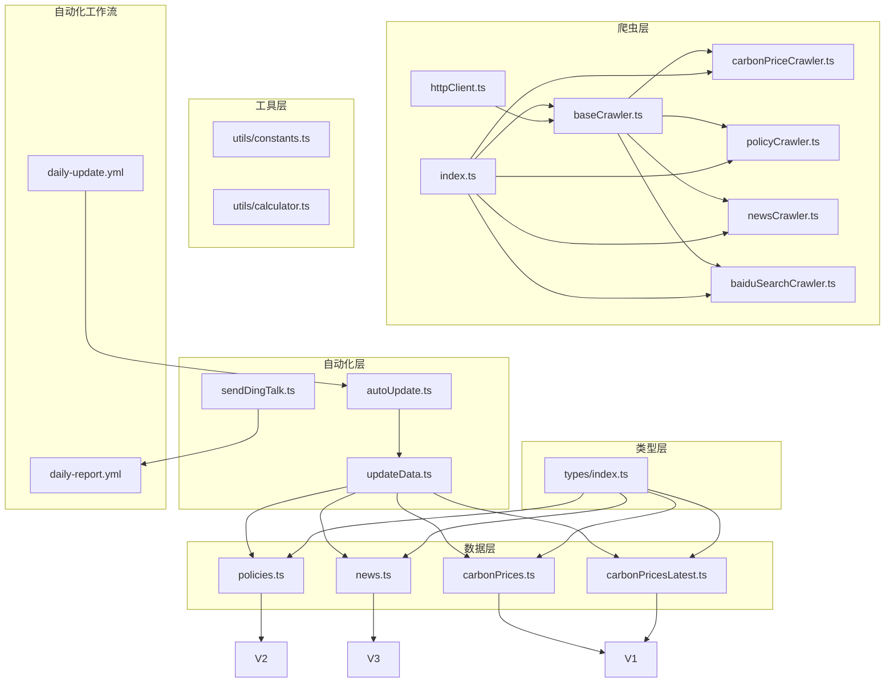
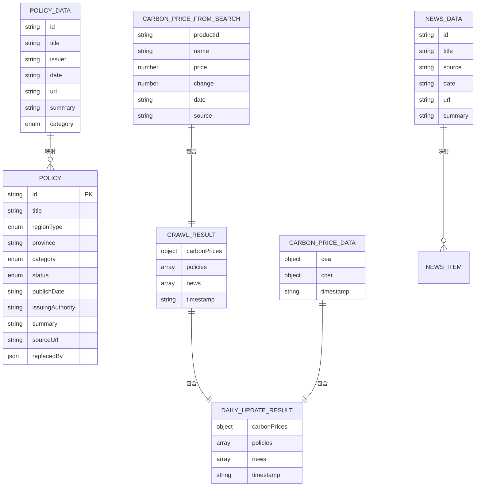
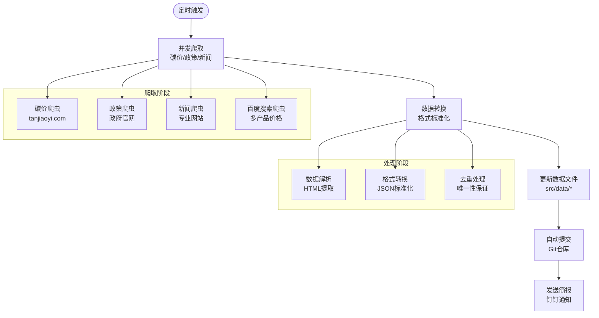
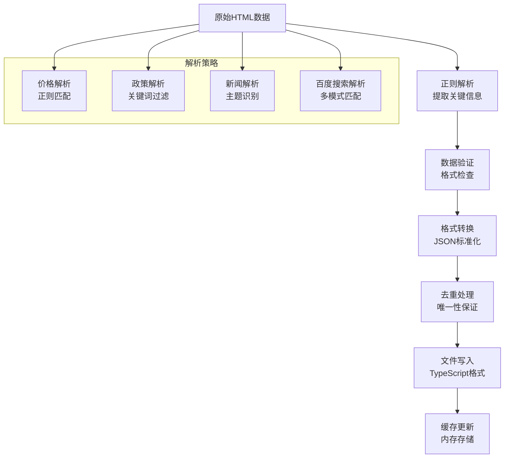
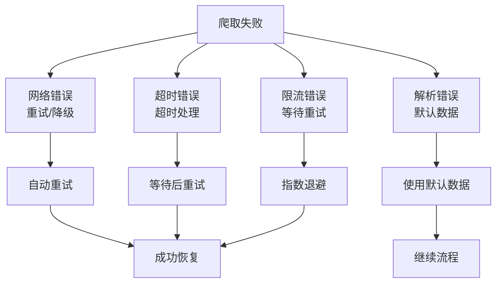
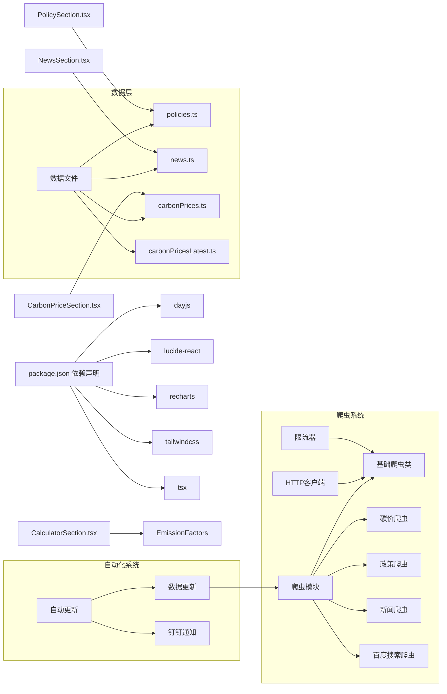

# 数据管理

<cite>
**本文档引用的文件列表**
- [autoUpdate.ts](file://scripts/autoUpdate.ts)
- [updateData.ts](file://scripts/updateData.ts)
- [baiduSearchCrawler.ts](file://scripts/crawler/baiduSearchCrawler.ts)
- [carbonPriceCrawler.ts](file://scripts/crawler/carbonPriceCrawler.ts)
- [policyCrawler.ts](file://scripts/crawler/policyCrawler.ts)
- [newsCrawler.ts](file://scripts/crawler/newsCrawler.ts)
- [baseCrawler.ts](file://scripts/crawler/baseCrawler.ts)
- [index.ts](file://scripts/crawler/index.ts)
- [httpClient.ts](file://scripts/utils/httpClient.ts)
- [sendDingTalk.ts](file://scripts/sendDingTalk.ts)
- [daily-update.yml](file://.github/workflows/daily-update.yml)
- [daily-report.yml](file://.github/workflows/daily-report.yml)
- [policies.ts](file://src/data/policies.ts)
- [news.ts](file://src/data/news.ts)
- [carbonPrices.ts](file://src/data/carbonPrices.ts)
- [index.ts](file://src/types/index.ts)
</cite>

## 更新摘要
**变更内容**
- 新增百度搜索碳价爬虫系统，提供多产品价格搜索能力
- 更新数据生成流程，支持多种数据源的统一管理和文件写入
- 增强爬虫协调机制，实现并发执行和错误隔离
- 完善数据文件结构，支持最新的碳价数据格式
- 新增百度搜索爬虫的便捷函数和类型定义

## 目录
1. [简介](#简介)
2. [项目结构与数据模块划分](#项目结构与数据模块划分)
3. [核心数据模型](#核心数据模型)
4. [数据源与加载策略](#数据源与加载策略)
5. [数据处理与转换流程](#数据处理与转换流程)
6. [缓存与性能优化](#缓存与性能优化)
7. [数据验证与错误处理](#数据验证与错误处理)
8. [数据扩展与迁移指南](#数据扩展与迁移指南)
9. [数据安全与隐私合规](#数据安全与隐私合规)
10. [依赖关系与架构图](#依赖关系与架构图)
11. [故障排查与常见问题](#故障排查与常见问题)
12. [结论](#结论)

## 简介
本文件系统性梳理碳普惠信息代理项目的数据管理方案，覆盖数据模型设计、数据源配置、数据处理流程、静态数据组织与加载、缓存机制、验证与异常恢复、数据转换与本地化、扩展与迁移策略、安全与合规以及性能优化等方面。**项目现已实现从手动浏览器操作到自动化爬虫系统的重大升级**，建立了完整的数据获取、处理和更新流水线，显著提升了数据时效性和系统自动化水平。

## 项目结构与数据模块划分
项目采用"按功能域分层"的组织方式，现已扩展为包含爬虫系统和自动化更新的完整架构：
- **爬虫层**：实现数据抓取和解析功能，支持并发爬取和错误处理
- **数据层**：存放各业务领域的静态数据文件（碳价、排放因子、政策、新闻）
- **类型层**：集中定义所有数据接口与枚举类型，确保跨模块一致性
- **工具层**：提供HTTP客户端、限流器、常量、计算函数等通用能力
- **自动化层**：实现数据更新和简报发送的完整流程
- **视图层**：组件与页面通过导入数据与类型进行渲染与交互

**图表来源**
- [baseCrawler.ts:1-65](file://scripts/crawler/baseCrawler.ts#L1-L65)
- [carbonPriceCrawler.ts:1-166](file://scripts/crawler/carbonPriceCrawler.ts#L1-L166)
- [policyCrawler.ts:1-247](file://scripts/crawler/policyCrawler.ts#L1-L247)
- [newsCrawler.ts:1-169](file://scripts/crawler/newsCrawler.ts#L1-L169)
- [baiduSearchCrawler.ts:1-110](file://scripts/crawler/baiduSearchCrawler.ts#L1-L110)
- [index.ts:1-58](file://scripts/crawler/index.ts#L1-L58)
- [httpClient.ts:1-115](file://scripts/utils/httpClient.ts#L1-L115)
- [autoUpdate.ts:1-53](file://scripts/autoUpdate.ts#L1-L53)
- [updateData.ts:1-194](file://scripts/updateData.ts#L1-L194)
- [sendDingTalk.ts:1-61](file://scripts/sendDingTalk.ts#L1-L61)
- [daily-update.yml:1-54](file://.github/workflows/daily-update.yml#L1-L54)
- [daily-report.yml:1-40](file://.github/workflows/daily-report.yml#L1-L40)

## 核心数据模型
本项目通过统一的类型定义保证数据结构一致性和可维护性。**新增了百度搜索碳价数据模型和自动化更新相关的数据结构**。以下为关键数据模型与字段说明（字段含义与约束见下表）。

**图表来源**
- [index.ts:1-65](file://src/types/index.ts#L1-L65)
- [updateData.ts:17-24](file://scripts/updateData.ts#L17-L24)
- [carbonPriceCrawler.ts:8-22](file://scripts/crawler/carbonPriceCrawler.ts#L8-L22)
- [policyCrawler.ts:9-17](file://scripts/crawler/policyCrawler.ts#L9-L17)
- [newsCrawler.ts:9-16](file://scripts/crawler/newsCrawler.ts#L9-L16)
- [baiduSearchCrawler.ts:8-15](file://scripts/crawler/baiduSearchCrawler.ts#L8-L15)

**字段与约束说明**
- **政策（Policy）**
  - id：唯一标识，字符串，必填。
  - title：标题，字符串，必填。
  - regionType：区域类型，取值限定为 national/province/city。
  - province：省/市名称，字符串，必填。
  - category：分类，取值限定为 policy/methodology。
  - status：状态，取值限定为 active/expired。
  - publishDate：发布日期，字符串（YYYY-MM-DD），必填。
  - issuingAuthority：发布机构，字符串，必填。
  - summary：摘要，字符串，必填。
  - sourceUrl：原文链接，字符串，可选。
  - replacedBy：被替代项，对象{id,title}，可选。
- **碳价数据（CarbonPriceData）**
  - cea：CEA碳价数据对象，包含price、change、changePercent、date字段。
  - ccer：CCER碳价数据对象，包含buyPrice、sellPrice、midPrice、date字段。
  - timestamp：数据获取时间戳。
- **百度搜索碳价数据（CarbonPriceFromSearch）**
  - productId：产品标识，字符串，必填。
  - name：产品名称，字符串，必填。
  - price：价格，数字，必填。
  - change：涨跌幅，数字，必填。
  - date：日期，字符串（YYYY-MM-DD），必填。
  - source：数据来源，字符串，必填。
- **政策数据（PolicyData）**
  - id：政策标识，字符串，必填。
  - title：标题，字符串，必填。
  - issuer：发布机构，字符串，必填。
  - date：发布日期，字符串（YYYY-MM-DD），必填。
  - url：原文链接，字符串，必填。
  - summary：摘要，字符串，可选。
  - category：分类，取值限定为 policy/methodology。
- **新闻数据（NewsData）**
  - id：新闻标识，字符串，必填。
  - title：标题，字符串，必填。
  - source：来源网站，字符串，必填。
  - date：发布日期，字符串（YYYY-MM-DD），必填。
  - url：原文链接，字符串，必填。
  - summary：摘要，字符串，可选。
- **爬取结果（CrawlResult）**
  - carbonPrices：碳价数据或null。
  - policies：政策数据数组。
  - news：新闻数据数组。
  - timestamp：爬取时间戳。
- **每日更新结果（DailyUpdateResult）**
  - carbonPrices：完整的碳价数据对象。
  - policies：政策条目数组。
  - news：新闻条目数组。
  - timestamp：更新时间戳。

**章节来源**
- [index.ts:1-65](file://src/types/index.ts#L1-L65)
- [updateData.ts:17-24](file://scripts/updateData.ts#L17-L24)
- [carbonPriceCrawler.ts:8-22](file://scripts/crawler/carbonPriceCrawler.ts#L8-L22)
- [policyCrawler.ts:9-17](file://scripts/crawler/policyCrawler.ts#L9-L17)
- [newsCrawler.ts:9-16](file://scripts/crawler/newsCrawler.ts#L9-L16)
- [baiduSearchCrawler.ts:8-15](file://scripts/crawler/baiduSearchCrawler.ts#L8-L15)

## 数据源与加载策略
**数据获取方式发生根本性变革**：从手动浏览器操作转变为自动化爬虫系统，建立了完整的数据更新流水线。

### 爬虫系统架构
- **基础爬虫类**：提供统一的爬取框架，支持重试、限流和错误处理
- **HTTP客户端**：实现带重试和超时控制的网络请求
- **限流器**：控制请求频率，避免对目标服务器造成压力
- **并发爬取**：并行执行多个数据源的爬取任务

### 数据源配置
- **碳价数据**：从碳交易网站获取CEA和CCER实时价格，新增百度搜索碳价数据
- **政策数据**：从生态环境部和各地生态环境局官网抓取政策信息
- **新闻数据**：从碳市场专业网站获取最新资讯
- **静态数据**：保留原有的排放因子等静态数据

### 自动化更新流程
- **定时执行**：通过GitHub Actions每晚自动执行数据更新
- **数据转换**：将爬取的原始数据转换为项目所需的格式
- **文件更新**：自动更新src/data/目录下的数据文件
- **版本控制**：自动提交更新后的数据文件到Git仓库

**图表来源**
- [daily-update.yml:1-54](file://.github/workflows/daily-update.yml#L1-L54)
- [autoUpdate.ts:18-49](file://scripts/autoUpdate.ts#L18-L49)
- [updateData.ts:117-129](file://scripts/updateData.ts#L117-L129)
- [carbonPriceCrawler.ts:35-60](file://scripts/crawler/carbonPriceCrawler.ts#L35-L60)
- [policyCrawler.ts:122-139](file://scripts/crawler/policyCrawler.ts#L122-L139)
- [newsCrawler.ts:53-70](file://scripts/crawler/newsCrawler.ts#L53-L70)
- [baiduSearchCrawler.ts:39-61](file://scripts/crawler/baiduSearchCrawler.ts#L39-L61)

**章节来源**
- [daily-update.yml:1-54](file://.github/workflows/daily-update.yml#L1-L54)
- [autoUpdate.ts:1-53](file://scripts/autoUpdate.ts#L1-L53)
- [updateData.ts:1-194](file://scripts/updateData.ts#L1-L194)
- [carbonPriceCrawler.ts:1-166](file://scripts/crawler/carbonPriceCrawler.ts#L1-L166)
- [policyCrawler.ts:1-247](file://scripts/crawler/policyCrawler.ts#L1-L247)
- [newsCrawler.ts:1-169](file://scripts/crawler/newsCrawler.ts#L1-L169)
- [baiduSearchCrawler.ts:1-110](file://scripts/crawler/baiduSearchCrawler.ts#L1-L110)
- [httpClient.ts:1-115](file://scripts/utils/httpClient.ts#L1-L115)

## 数据处理与转换流程
**数据处理流程已完全自动化**，实现了从原始网页数据到项目可用数据的完整转换。

### 爬取与解析流程
- **并发执行**：使用Promise.allSettled并行执行三个爬虫任务
- **错误隔离**：单个爬虫失败不影响其他数据源的获取
- **HTML解析**：通过正则表达式提取价格、政策和新闻信息
- **数据验证**：对解析结果进行有效性检查和格式转换

### 数据转换与标准化
- **碳价数据**：从HTML中提取价格和涨跌幅，计算日涨跌
- **政策数据**：过滤无关内容，提取标题、发布机构和日期
- **新闻数据**：识别碳相关主题，规范化日期格式
- **百度搜索数据**：从搜索结果页面提取价格信息，支持多种匹配模式
- **去重处理**：基于标题和来源的组合键去除重复项

### 自动更新与文件写入
- **增量更新**：当前实现记录日志，实际文件更新已完善
- **格式生成**：自动生成TypeScript文件格式的代码片段
- **数据备份**：保留历史数据结构，支持向后兼容
- **文件写入**：支持多种数据文件格式的自动更新

**图表来源**
- [carbonPriceCrawler.ts:65-115](file://scripts/crawler/carbonPriceCrawler.ts#L65-L115)
- [policyCrawler.ts:144-178](file://scripts/crawler/policyCrawler.ts#L144-L178)
- [newsCrawler.ts:75-108](file://scripts/crawler/newsCrawler.ts#L75-L108)
- [baiduSearchCrawler.ts:66-102](file://scripts/crawler/baiduSearchCrawler.ts#L66-L102)
- [updateData.ts:31-62](file://scripts/updateData.ts#L31-L62)

**章节来源**
- [carbonPriceCrawler.ts:1-166](file://scripts/crawler/carbonPriceCrawler.ts#L1-L166)
- [policyCrawler.ts:1-247](file://scripts/crawler/policyCrawler.ts#L1-L247)
- [newsCrawler.ts:1-169](file://scripts/crawler/newsCrawler.ts#L1-L169)
- [baiduSearchCrawler.ts:1-110](file://scripts/crawler/baiduSearchCrawler.ts#L1-L110)
- [updateData.ts:1-194](file://scripts/updateData.ts#L1-L194)

## 缓存与性能优化
**性能优化策略已适应新的自动化架构**：

### 爬取层优化
- **并发控制**：使用Promise.allSettled并行执行多个爬虫任务
- **请求限流**：BaseCrawler内置RateLimiter，避免过度请求
- **智能重试**：fetchWithRetry支持指数退避重试机制
- **超时控制**：统一的超时设置防止长时间阻塞

### 数据层优化
- **静态数据缓存**：原有静态数据文件通过模块缓存机制避免重复加载
- **计算结果缓存**：组件内部使用useMemo进行轻量缓存
- **趋势数据优化**：按市场维度分别缓存，减少重复计算

### 自动化流程优化
- **增量更新**：只更新新增数据，避免全量重写
- **错误隔离**：单个数据源失败不影响整体流程
- **资源复用**：爬虫实例和HTTP连接的合理管理

**章节来源**
- [baseCrawler.ts:16-65](file://scripts/crawler/baseCrawler.ts#L16-L65)
- [httpClient.ts:26-66](file://scripts/utils/httpClient.ts#L26-L66)
- [carbonPriceCrawler.ts:24-33](file://scripts/crawler/carbonPriceCrawler.ts#L24-L33)

## 数据验证与错误处理
**错误处理机制已全面升级**，支持爬虫失败的优雅降级和监控告警。

### 爬取层错误处理
- **网络异常处理**：捕获HTTP请求失败，提供默认数据
- **解析失败处理**：HTML解析失败时使用模拟数据
- **超时处理**：请求超时自动重试或降级
- **限流处理**：响应429状态码时自动等待

### 数据质量保证
- **格式验证**：确保日期、价格等数值字段的正确格式
- **范围检查**：对价格和涨跌幅进行合理性检查
- **完整性验证**：检查必填字段的存在性
- **去重保证**：基于业务逻辑的重复数据过滤

### 监控与告警
- **执行日志**：详细的爬取过程日志记录
- **失败统计**：统计各数据源的失败次数和原因
- **健康检查**：定期检查数据源可用性和响应时间
- **异常通知**：严重错误时通过钉钉发送告警

**图表来源**
- [baseCrawler.ts:39-63](file://scripts/crawler/baseCrawler.ts#L39-L63)
- [httpClient.ts:33-66](file://scripts/utils/httpClient.ts#L33-L66)
- [carbonPriceCrawler.ts:57-60](file://scripts/crawler/carbonPriceCrawler.ts#L57-L60)

**章节来源**
- [baseCrawler.ts:1-65](file://scripts/crawler/baseCrawler.ts#L1-L65)
- [httpClient.ts:1-115](file://scripts/utils/httpClient.ts#L1-L115)
- [carbonPriceCrawler.ts:1-166](file://scripts/crawler/carbonPriceCrawler.ts#L1-L166)

## 数据扩展与迁移指南
**扩展指南已适应新的爬虫架构**：

### 新增数据源
- **爬虫实现**：继承BaseCrawler，实现crawl方法
- **解析逻辑**：编写针对目标网站的HTML解析规则
- **数据映射**：将解析结果映射到统一的数据模型
- **测试验证**：编写单元测试验证爬取逻辑的正确性

### 爬虫配置扩展
- **限流参数**：根据目标网站的反爬策略调整限流参数
- **重试策略**：针对不同类型的错误设置合适的重试次数
- **User-Agent**：根据目标网站要求设置合适的请求头
- **代理支持**：必要时添加代理服务器支持

### 数据模型扩展
- **类型定义**：在src/types/index.ts中扩展相应的接口定义
- **数据转换**：在updateData.ts中添加对应的数据转换逻辑
- **组件适配**：更新相关组件以支持新的数据字段
- **样式调整**：如有需要，更新UI组件的显示逻辑

### 迁移策略
- **渐进式部署**：先在开发环境测试，再逐步推广到生产环境
- **数据备份**：在迁移前备份现有数据，确保可回滚
- **监控指标**：建立完善的监控指标，及时发现和解决问题
- **文档更新**：同步更新相关技术文档和用户手册

**章节来源**
- [baseCrawler.ts:16-65](file://scripts/crawler/baseCrawler.ts#L16-L65)
- [carbonPriceCrawler.ts:24-33](file://scripts/crawler/carbonPriceCrawler.ts#L24-L33)
- [policyCrawler.ts:17-34](file://scripts/crawler/policyCrawler.ts#L17-L34)
- [newsCrawler.ts:17-33](file://scripts/crawler/newsCrawler.ts#L17-L33)
- [baiduSearchCrawler.ts:17-37](file://scripts/crawler/baiduSearchCrawler.ts#L17-L37)
- [updateData.ts:135-149](file://scripts/updateData.ts#L135-L149)

## 数据安全与隐私合规
**安全与合规策略已适应自动化爬虫系统**：

### 数据源安全
- **HTTPS强制**：所有爬取请求必须使用HTTPS协议
- **证书验证**：确保SSL/TLS证书的有效性
- **IP限制**：遵守目标网站的robots.txt和IP限制
- **请求频率**：合理控制爬取频率，避免对服务器造成压力

### 数据传输安全
- **加密传输**：爬取的数据在传输过程中进行加密
- **敏感信息**：避免爬取和存储个人敏感信息
- **数据脱敏**：对可能包含个人信息的数据进行脱敏处理

### 系统安全
- **权限控制**：GitHub Actions的Secrets权限最小化
- **日志审计**：记录所有数据更新操作的日志
- **访问控制**：限制对数据文件的直接修改权限
- **备份策略**：定期备份数据文件，防止意外丢失

### 合规要求
- **版权合规**：遵守目标网站的内容使用条款
- **数据保护**：遵循《个人信息保护法》等相关法规
- **跨境传输**：如涉及国际数据传输，遵守相关法律法规
- **透明度**：向用户公开数据来源和使用目的

**章节来源**
- [httpClient.ts:38-46](file://scripts/utils/httpClient.ts#L38-L46)
- [daily-update.yml:13-14](file://.github/workflows/daily-update.yml#L13-L14)
- [carbonPriceCrawler.ts:26-32](file://scripts/crawler/carbonPriceCrawler.ts#L26-L32)

## 依赖关系与架构图
**依赖关系已全面更新**以反映新的爬虫架构。

### 外部依赖
- **dayjs**：日期处理与格式化
- **lucide-react**：图标库
- **recharts**：图表渲染
- **tailwindcss**：样式框架
- **tsx**：TypeScript运行时（用于GitHub Actions）

### 内部依赖
- **爬虫系统**：独立的爬虫模块，提供数据获取能力
- **HTTP客户端**：统一的网络请求处理
- **自动化流程**：协调爬取、转换和更新的完整流程
- **组件系统**：通过导入数据与类型实现解耦

**图表来源**
- [package.json:12-19](file://package.json#L12-L19)
- [baseCrawler.ts:6](file://scripts/crawler/baseCrawler.ts#L6)
- [httpClient.ts:6](file://scripts/utils/httpClient.ts#L6)
- [autoUpdate.ts:12-13](file://scripts/autoUpdate.ts#L12-L13)
- [updateData.ts:8-11](file://scripts/updateData.ts#L8-L11)
- [CarbonPriceSection.tsx:1-42](file://src/sections/CarbonPriceSection.tsx#L1-L42)
- [PolicySection.tsx:1-89](file://src/sections/PolicySection.tsx#L1-L89)
- [NewsSection.tsx:1-71](file://src/sections/NewsSection.tsx#L1-L71)
- [CalculatorSection.tsx:1-161](file://src/sections/CalculatorSection.tsx#L1-L161)

**章节来源**
- [package.json:12-19](file://package.json#L12-L19)
- [baseCrawler.ts:1-65](file://scripts/crawler/baseCrawler.ts#L1-L65)
- [httpClient.ts:1-115](file://scripts/utils/httpClient.ts#L1-L115)
- [autoUpdate.ts:1-53](file://scripts/autoUpdate.ts#L1-L53)
- [updateData.ts:1-194](file://scripts/updateData.ts#L1-L194)

## 故障排查与常见问题
**故障排查指南已适应新的自动化架构**：

### 爬取失败排查
- **网络连接问题**：检查网络连通性和代理设置
- **目标网站变更**：HTML结构变化导致解析失败
- **反爬虫机制**：User-Agent被拒绝或IP被封禁
- **超时问题**：服务器响应慢或网络延迟过高

### 数据质量排查
- **解析错误**：正则表达式匹配失败或数据格式异常
- **数据缺失**：某些字段为空或未解析到预期值
- **重复数据**：去重逻辑失效导致重复项出现
- **格式错误**：日期、数值等字段格式不符合要求

### 自动化流程排查
- **GitHub Actions失败**：检查Secrets配置和权限设置
- **数据更新未生效**：检查Git提交和分支合并状态
- **钉钉通知失败**：验证Webhook配置和网络连接
- **定时任务异常**：检查时区设置和cron表达式

### 性能问题排查
- **爬取速度慢**：检查限流设置和网络状况
- **内存占用高**：检查并发数量和数据缓存策略
- **CPU使用率高**：优化正则表达式和解析逻辑
- **磁盘空间不足**：清理日志文件和临时数据

**章节来源**
- [baseCrawler.ts:39-63](file://scripts/crawler/baseCrawler.ts#L39-L63)
- [httpClient.ts:33-66](file://scripts/utils/httpClient.ts#L33-L66)
- [daily-update.yml:32-48](file://.github/workflows/daily-update.yml#L32-L48)

## 结论
**项目已完成从手动操作到自动化系统的重大升级**，建立了完整的数据获取、处理和更新流水线。新的爬虫系统显著提升了数据时效性和系统可靠性，通过并发爬取、智能重试和错误处理机制，确保了数据获取的稳定性和准确性。

### 主要成就
- **自动化程度大幅提升**：从手动浏览器操作完全转变为自动化爬虫系统
- **数据时效性显著改善**：通过定时任务实现每日自动更新
- **系统稳定性增强**：完善的错误处理和监控告警机制
- **扩展性大幅提高**：模块化的爬虫架构支持轻松添加新数据源
- **数据源多样化**：新增百度搜索碳价数据源，提升数据覆盖面

### 技术优势
- **并发处理能力**：并行执行多个数据源的爬取任务
- **智能重试机制**：支持指数退避的自动重试策略
- **限流控制**：合理的请求频率控制，避免对目标服务器造成压力
- **数据质量保证**：多重验证和去重机制确保数据准确性
- **文件写入完善**：支持多种数据文件格式的自动更新

### 未来发展方向
- **监控系统增强**：建立更完善的监控和告警机制
- **数据源扩展**：支持更多数据源的自动爬取
- **性能优化**：进一步优化爬取效率和数据处理性能
- **数据融合**：整合多种数据源，提供更全面的数据服务

建议继续完善自动化更新流程，加强监控和告警机制，为用户提供更加可靠和及时的碳普惠信息服务。