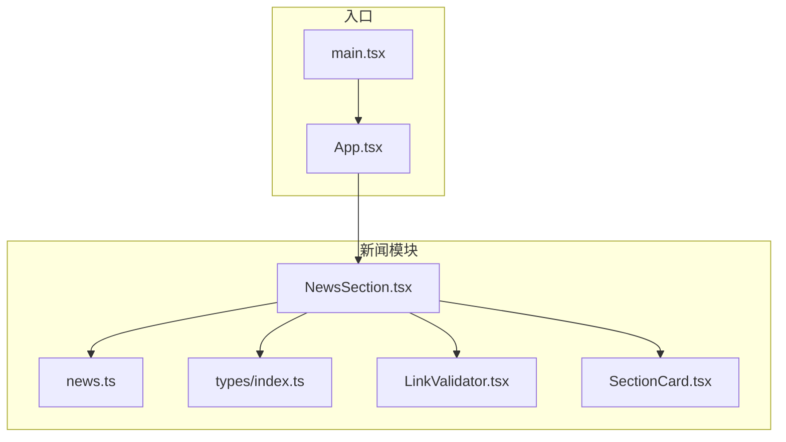
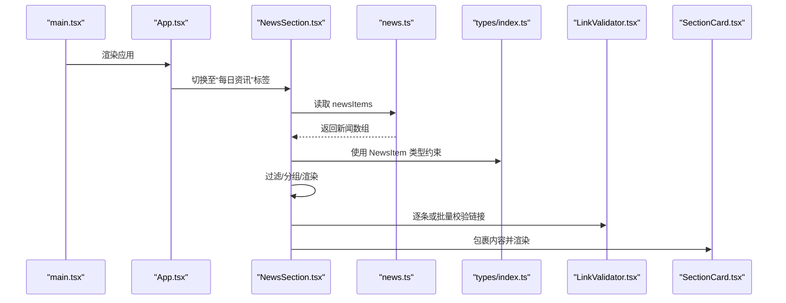
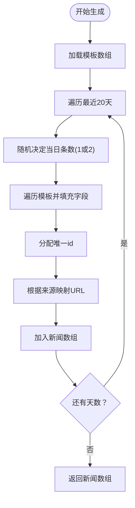
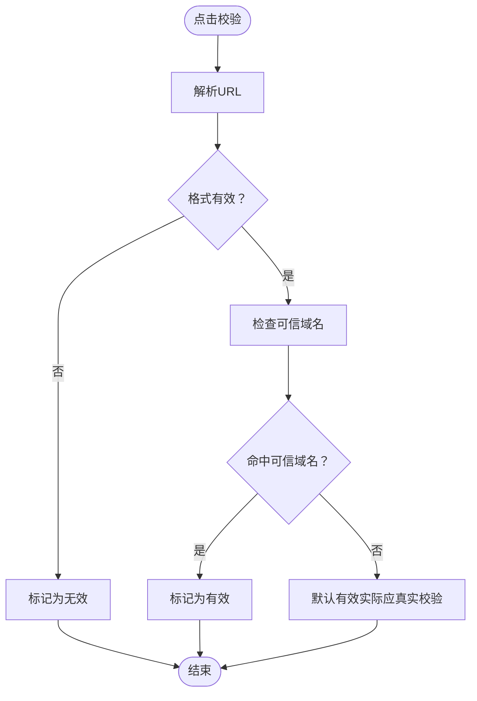
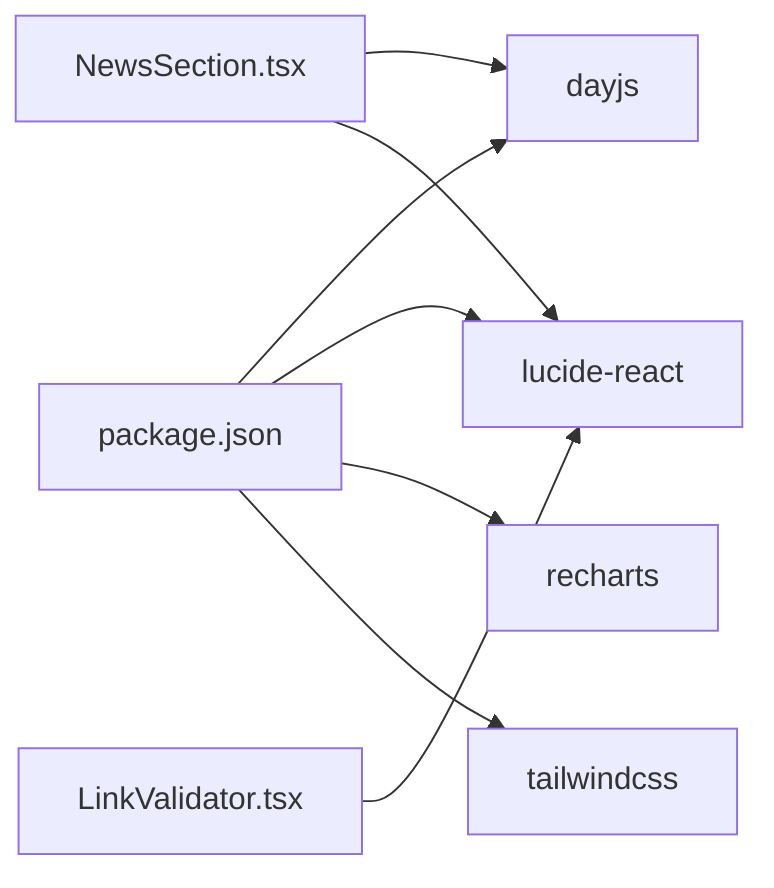

# 新闻数据管理

<cite>
**本文引用的文件**
- [news.ts](file://src/data/news.ts)
- [index.ts](file://src/types/index.ts)
- [NewsSection.tsx](file://src/sections/NewsSection.tsx)
- [LinkValidator.tsx](file://src/components/LinkValidator.tsx)
- [SectionCard.tsx](file://src/components/SectionCard.tsx)
- [TabFilter.tsx](file://src/components/TabFilter.tsx)
- [constants.ts](file://src/utils/constants.ts)
- [App.tsx](file://src/App.tsx)
- [main.tsx](file://src/main.tsx)
- [package.json](file://package.json)
</cite>

## 目录
1. [简介](#简介)
2. [项目结构](#项目结构)
3. [核心组件](#核心组件)
4. [架构总览](#架构总览)
5. [详细组件分析](#详细组件分析)
6. [依赖关系分析](#依赖关系分析)
7. [性能考量](#性能考量)
8. [故障排查指南](#故障排查指南)
9. [结论](#结论)
10. [附录](#附录)

## 简介
本文件面向“碳普惠新闻数据管理”主题，系统性梳理项目中的新闻数据结构、分类体系、内容组织与展示机制，覆盖以下方面：
- 新闻数据模型与字段定义（标题、摘要、发布时间、来源、标签等）
- 数据生成与来源映射机制
- 新闻展示与筛选流程（按日期分组、标签展示、链接校验）
- 分类逻辑、标签系统与推荐思路
- 本地化处理、多语言支持现状与扩展建议
- 内容过滤与安全校验
- 扩展方式、新增频道支持与内容聚合策略

## 项目结构
该项目采用前端单页应用架构，围绕“政策、碳价、计算器、新闻”四大板块构建。新闻模块位于 sections 与 data 目录，配合类型定义与通用组件完成数据到界面的完整链路。



图表来源
- [main.tsx:1-11](file://src/main.tsx#L1-L11)
- [App.tsx:18-52](file://src/App.tsx#L18-L52)
- [NewsSection.tsx:1-179](file://src/sections/NewsSection.tsx#L1-L179)
- [news.ts:1-185](file://src/data/news.ts#L1-L185)
- [index.ts:55-64](file://src/types/index.ts#L55-L64)
- [LinkValidator.tsx:1-267](file://src/components/LinkValidator.tsx#L1-L267)
- [SectionCard.tsx:1-25](file://src/components/SectionCard.tsx#L1-L25)

章节来源
- [main.tsx:1-11](file://src/main.tsx#L1-L11)
- [App.tsx:18-52](file://src/App.tsx#L18-L52)

## 核心组件
- 新闻数据模型：定义了新闻项的字段集合，包括标识、标题、摘要、来源、发布时间、跳转链接与标签数组。
- 新闻数据生成器：基于模板生成近20天的新闻数据，按来源映射外链地址，随机分配每日条目数量。
- 新闻展示组件：负责日期筛选、按日分组、标签渲染、链接校验与批量校验。
- 链接校验组件：提供单项与批量链接有效性校验，支持可信域名白名单与状态反馈。
- 通用卡片容器：统一新闻区域的标题、副标题与内边距布局。

章节来源
- [index.ts:55-64](file://src/types/index.ts#L55-L64)
- [news.ts:5-185](file://src/data/news.ts#L5-L185)
- [NewsSection.tsx:1-179](file://src/sections/NewsSection.tsx#L1-L179)
- [LinkValidator.tsx:1-267](file://src/components/LinkValidator.tsx#L1-L267)
- [SectionCard.tsx:1-25](file://src/components/SectionCard.tsx#L1-L25)

## 架构总览
新闻模块从数据层到视图层的调用链如下：



图表来源
- [main.tsx:6-10](file://src/main.tsx#L6-L10)
- [App.tsx:47-51](file://src/App.tsx#L47-L51)
- [NewsSection.tsx:5,24-45](file://src/sections/NewsSection.tsx#L5,L24-L45)
- [news.ts:184](file://src/data/news.ts#L184)
- [index.ts:55-64](file://src/types/index.ts#L55-L64)
- [LinkValidator.tsx:207-267](file://src/components/LinkValidator.tsx#L207-L267)
- [SectionCard.tsx:10-24](file://src/components/SectionCard.tsx#L10-L24)

## 详细组件分析

### 新闻数据模型与字段定义
- 字段清单
  - id：唯一标识符
  - title：新闻标题
  - summary：摘要
  - source：来源媒体/机构
  - publishDate：发布日期（字符串格式）
  - url：外链地址
  - tags：标签数组
- 设计要点
  - 使用 TypeScript 接口确保类型安全
  - 发布日期以字符串存储，便于前端排序与分组
  - 标签用于快速分类与检索

章节来源
- [index.ts:55-64](file://src/types/index.ts#L55-L64)

### 新闻数据生成与来源映射
- 数据生成策略
  - 基于固定模板数组，循环生成最近20天的新闻
  - 每日生成1-2条，随机分布，保证数据连续性与多样性
  - 为每条新闻分配唯一id与对应日期
- 来源映射
  - 将来源媒体名称映射到官方或权威站点链接
  - 若未匹配到预设来源，则回退到搜索引擎结果页



图表来源
- [news.ts:5-155](file://src/data/news.ts#L5-L155)
- [news.ts:157-182](file://src/data/news.ts#L157-L182)

章节来源
- [news.ts:5-185](file://src/data/news.ts#L5-L185)

### 新闻展示与筛选流程
- 日期筛选
  - 生成最近20天的日期选项，支持“全部”与具体日期切换
  - 使用 dayjs 对日期进行格式化与比较
- 分组与排序
  - 按 publishDate 分组，按日期降序排列
- 标签渲染
  - 每条新闻展示其标签，便于快速识别主题
- 链接校验
  - 单项校验：点击按钮触发，显示状态与提示
  - 批量校验：对当前筛选结果中的所有链接进行顺序校验，展示进度与统计

```mermaid
sequenceDiagram
participant UI as "NewsSection.tsx"
participant Dayjs as "dayjs"
participant Filter as "筛选逻辑"
participant Group as "分组逻辑"
participant Link as "LinkValidator.tsx"
UI->>Dayjs : 生成日期选项
UI->>Filter : 根据选择的日期过滤
Filter-->>UI : 返回过滤后的新闻列表
UI->>Group : 按publishDate分组并降序
Group-->>UI : 返回分组结果
UI->>Link : 逐条或批量校验url
Link-->>UI : 返回校验结果
```

图表来源
- [NewsSection.tsx:12-45](file://src/sections/NewsSection.tsx#L12-L45)
- [NewsSection.tsx:47-61](file://src/sections/NewsSection.tsx#L47-L61)
- [LinkValidator.tsx:105-110](file://src/components/LinkValidator.tsx#L105-L110)
- [LinkValidator.tsx:212-225](file://src/components/LinkValidator.tsx#L212-L225)

章节来源
- [NewsSection.tsx:1-179](file://src/sections/NewsSection.tsx#L1-L179)

### 链接校验与内容过滤
- 可信域名白名单
  - 预置一组可信域名，用于判断来源可靠性
  - 支持主域名与子域名匹配
- 校验流程
  - 格式校验：确保URL以 http/https 开头
  - 域名匹配：命中可信列表则标记为有效
  - 状态反馈：提供“待校验/校验中/已校验/链接异常”等状态
- 批量校验
  - 提供进度条与统计信息，便于快速评估整体质量



图表来源
- [LinkValidator.tsx:19-96](file://src/components/LinkValidator.tsx#L19-L96)
- [LinkValidator.tsx:207-267](file://src/components/LinkValidator.tsx#L207-L267)

章节来源
- [LinkValidator.tsx:1-267](file://src/components/LinkValidator.tsx#L1-L267)

### 分类逻辑、标签系统与推荐思路
- 分类与标签
  - 当前使用 tags 字段作为轻量分类，如“碳普惠”、“CCER”、“方法学”等
  - 展示时以标签形式呈现，便于用户快速识别主题
- 推荐算法思路（概念性）
  - 基于标签共现矩阵与用户行为序列，构建简单协同过滤
  - 结合时间衰减权重，优先推荐近期热点与高相似度内容
  - 可引入 TF-IDF 或词向量相似度进行语义匹配
- 注意事项
  - 当前未实现真正的推荐引擎，上述为扩展建议

章节来源
- [news.ts:11,17,23,29,35,47,53,59,65,71,77,83,89,95,107,113,119,125](file://src/data/news.ts#L11,L17,L23,L29,L35,L47,L53,L59,L65,L71,L77,L83,L89,L95,L107,L113,L119,L125)

### 本地化处理与多语言支持
- 现状
  - 日期显示采用中文格式（例如“MM月DD日”），符合中文用户的阅读习惯
  - 文案与标签多为中文，未见国际化资源文件
- 建议
  - 引入 i18n 库（如 react-i18next），将文案与日期格式化逻辑抽离为翻译键
  - 为不同语言版本提供独立的标签与来源映射配置
  - 保持类型定义与数据结构不变，仅替换展示层

章节来源
- [NewsSection.tsx:12-22](file://src/sections/NewsSection.tsx#L12-L22)
- [NewsSection.tsx:109-114](file://src/sections/NewsSection.tsx#L109-L114)

### 扩展方式、新增频道支持与内容聚合策略
- 新增频道
  - 在 news.ts 中增加新的来源模板与 URL 映射
  - 在类型定义中保持 NewsItem 字段一致
  - 在展示层无需改动即可继承现有筛选与校验能力
- 内容聚合
  - 可通过外部接口拉取真实新闻，再与现有模板合并
  - 引入统一的数据适配器，屏蔽来源差异
- 数据持久化与缓存
  - 建议引入本地缓存（如 IndexedDB 或 localStorage）保存最近一次抓取结果
  - 设置过期策略与增量更新机制，减少重复抓取

章节来源
- [news.ts:157-182](file://src/data/news.ts#L157-L182)
- [index.ts:55-64](file://src/types/index.ts#L55-L64)

## 依赖关系分析
- 外部依赖
  - dayjs：日期处理与格式化
  - lucide-react：图标库
  - recharts：图表（用于碳价趋势等）
  - tailwindcss：样式框架
- 内部依赖
  - App.tsx 依赖各板块组件
  - NewsSection.tsx 依赖 news.ts、LinkValidator.tsx、SectionCard.tsx
  - LinkValidator.tsx 依赖 lucide-react 与自身状态管理



图表来源
- [package.json:12-19](file://package.json#L12-L19)
- [NewsSection.tsx:1-179](file://src/sections/NewsSection.tsx#L1-L179)
- [LinkValidator.tsx:1-267](file://src/components/LinkValidator.tsx#L1-L267)

章节来源
- [package.json:12-19](file://package.json#L12-L19)

## 性能考量
- 渲染优化
  - 使用 useMemo 缓存日期选项、过滤结果与分组结果，避免重复计算
  - 批量校验时使用进度条与分步执行，降低阻塞
- 数据规模
  - 当前生成约20条新闻，性能压力较小；若接入真实抓取，建议分页与懒加载
- 网络与安全
  - 链接校验为前端模拟，生产环境需后端 API 实现真实校验
  - 对外链访问应设置合理的超时与重试策略

章节来源
- [NewsSection.tsx:12-45](file://src/sections/NewsSection.tsx#L12-L45)
- [LinkValidator.tsx:212-225](file://src/components/LinkValidator.tsx#L212-L225)

## 故障排查指南
- 新闻不显示或为空
  - 检查 news.ts 是否成功导出 newsItems
  - 确认 NewsSection.tsx 的筛选逻辑是否误选特定日期
- 链接校验异常
  - 确认 URL 格式是否以 http/https 开头
  - 检查可信域名白名单是否包含目标域名
- 样式或图标问题
  - 确认 lucide-react 与 tailwindcss 已正确安装与配置
- 性能卡顿
  - 检查是否存在不必要的重渲染，合理使用 useMemo/useCallback

章节来源
- [news.ts:184](file://src/data/news.ts#L184)
- [NewsSection.tsx:24-45](file://src/sections/NewsSection.tsx#L24-L45)
- [LinkValidator.tsx:71-96](file://src/components/LinkValidator.tsx#L71-L96)
- [package.json:12-19](file://package.json#L12-L19)

## 结论
本项目以清晰的模块划分实现了新闻数据的本地化生成、展示与基础校验。通过类型约束与组件化设计，具备良好的可维护性与扩展性。建议后续在以下方向深化：
- 引入真实抓取与后端校验，完善内容质量保障
- 增加国际化与多语言支持
- 构建推荐系统与标签体系，提升用户体验
- 规范数据接入与缓存策略，支撑更大规模内容

## 附录
- 术语
  - 新闻项：新闻数据的基本单元，包含标题、摘要、来源、发布时间、链接与标签
  - 标签：用于主题分类的关键词
  - 可信域名：经过验证的权威来源域名集合
- 相关文件路径
  - 数据模型：[types/index.ts:55-64](file://src/types/index.ts#L55-L64)
  - 新闻数据：[data/news.ts:1-185](file://src/data/news.ts#L1-L185)
  - 展示组件：[sections/NewsSection.tsx:1-179](file://src/sections/NewsSection.tsx#L1-L179)
  - 链接校验：[components/LinkValidator.tsx:1-267](file://src/components/LinkValidator.tsx#L1-L267)
  - 通用卡片：[components/SectionCard.tsx:1-25](file://src/components/SectionCard.tsx#L1-L25)
  - 依赖声明：[package.json:12-19](file://package.json#L12-L19)