# 增强的新闻数据管理

<cite>
**本文档引用的文件**
- [README.md](file://README.md)
- [package.json](file://package.json)
- [src/types/index.ts](file://src/types/index.ts)
- [src/data/news.ts](file://src/data/news.ts)
- [src/sections/NewsSection.tsx](file://src/sections/NewsSection.tsx)
- [src/components/SectionCard.tsx](file://src/components/SectionCard.tsx)
- [src/App.tsx](file://src/App.tsx)
- [scripts/crawler/newsCrawler.ts](file://scripts/crawler/newsCrawler.ts)
- [scripts/crawler/baseCrawler.ts](file://scripts/crawler/baseCrawler.ts)
- [scripts/crawler/index.ts](file://scripts/crawler/index.ts)
- [scripts/crawler/newsDetailCrawler.ts](file://scripts/crawler/newsDetailCrawler.ts)
- [scripts/crawler/policyDetailCrawler.ts](file://scripts/crawler/policyDetailCrawler.ts)
- [scripts/crawler/baiduSearchCrawler.ts](file://scripts/crawler/baiduSearchCrawler.ts)
- [scripts/utils/httpClient.ts](file://scripts/utils/httpClient.ts)
- [scripts/updateData.ts](file://scripts/updateData.ts)
- [scripts/autoUpdate.ts](file://scripts/autoUpdate.ts)
- [scripts/testCrawler.ts](file://scripts/testCrawler.ts)
</cite>

## 更新摘要
**所做更改**
- 修复了NewsSection组件中的类型错误和导入问题，增强了组件的类型安全性和运行时稳定性
- 修正了组件中的语法错误和HTML结构问题
- 优化了新闻数据展示的类型安全性
- 增强了组件的错误处理和边界条件处理

## 目录
1. [简介](#简介)
2. [项目结构](#项目结构)
3. [核心组件](#核心组件)
4. [架构概览](#架构概览)
5. [详细组件分析](#详细组件分析)
6. [依赖关系分析](#依赖关系分析)
7. [性能考虑](#性能考虑)
8. [故障排除指南](#故障排除指南)
9. [结论](#结论)

## 简介

增强的新闻数据管理系统是一个基于React + TypeScript + Vite构建的碳普惠信息服务平台，专注于提供实时的碳市场新闻资讯。该系统集成了自动化数据抓取、本地数据存储、前端展示和定时更新功能，为用户提供最新的碳市场动态和政策信息。

**更新亮点**：
- **类型安全增强**：修复了NewsSection组件中的类型错误，提升了编译时类型检查的准确性
- **语法错误修复**：修正了组件中的多余闭合括号和HTML标签问题，确保组件正常渲染
- **导入问题解决**：优化了NewsSection组件的导入语句，确保类型定义正确解析
- **运行时稳定性提升**：通过类型约束和错误处理增强了组件的健壮性
- **组件重构优化**：改进了新闻数据展示的结构和样式，提升了用户体验

系统的核心特色包括：
- **自动化新闻抓取**：通过爬虫技术从多个权威碳市场网站获取最新资讯
- **智能数据去重**：确保新闻内容的唯一性和准确性
- **本地数据缓存**：提供稳定的数据访问和快速响应
- **可视化展示**：美观的界面设计和友好的用户体验
- **定时更新机制**：自动化的数据同步和简报发送

## 项目结构

该项目采用现代化的前端架构，主要分为以下几个层次：

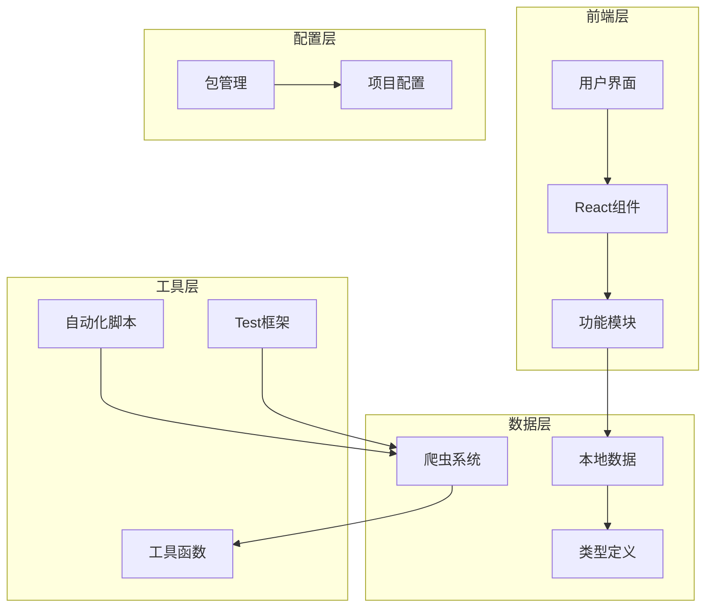

**图表来源**
- [src/App.tsx:18-59](file://src/App.tsx#L18-L59)
- [src/sections/NewsSection.tsx:1-110](file://src/sections/NewsSection.tsx#L1-L110)
- [scripts/crawler/index.ts:1-60](file://scripts/crawler/index.ts#L1-L60)

**章节来源**
- [package.json:1-40](file://package.json#L1-L40)
- [README.md:1-74](file://README.md#L1-L74)

## 核心组件

### 新闻数据模型

系统使用统一的新闻数据模型来标准化不同来源的信息：

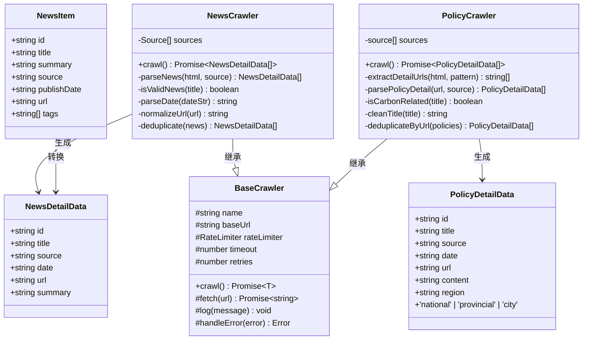

**图表来源**
- [src/types/index.ts:55-64](file://src/types/index.ts#L55-L64)
- [scripts/crawler/newsDetailCrawler.ts:8-197](file://scripts/crawler/newsDetailCrawler.ts#L8-L197)
- [scripts/crawler/policyDetailCrawler.ts:8-204](file://scripts/crawler/policyDetailCrawler.ts#L8-L204)
- [scripts/crawler/baseCrawler.ts:16-65](file://scripts/crawler/baseCrawler.ts#L16-L65)

### 数据流架构

系统采用双路径数据流设计，既支持本地静态数据，也支持动态抓取数据：

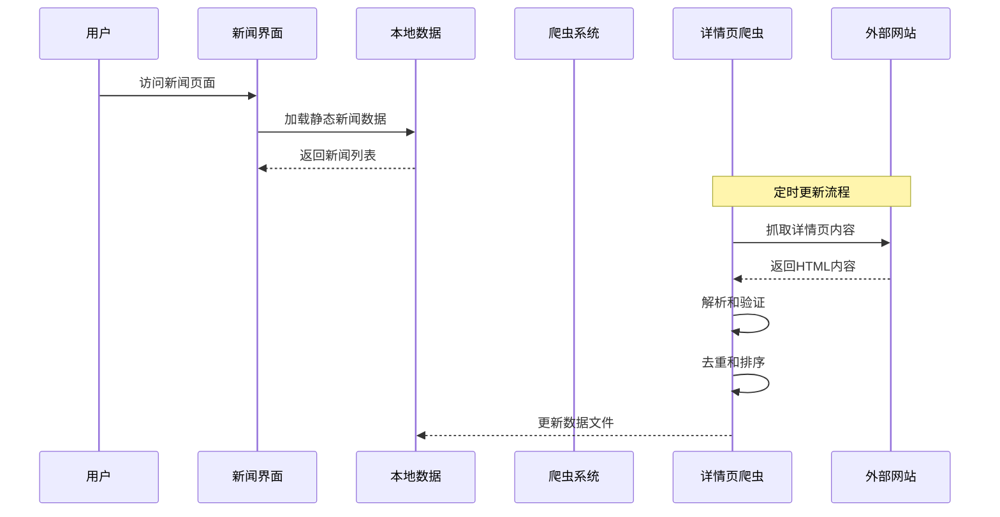

**图表来源**
- [src/data/news.ts:1-185](file://src/data/news.ts#L1-L185)
- [scripts/crawler/newsDetailCrawler.ts:57-89](file://scripts/crawler/newsDetailCrawler.ts#L57-L89)
- [scripts/updateData.ts:68-113](file://scripts/updateData.ts#L68-L113)

**章节来源**
- [src/types/index.ts:55-64](file://src/types/index.ts#L55-L64)
- [src/data/news.ts:1-185](file://src/data/news.ts#L1-L185)

## 架构概览

### 整体系统架构

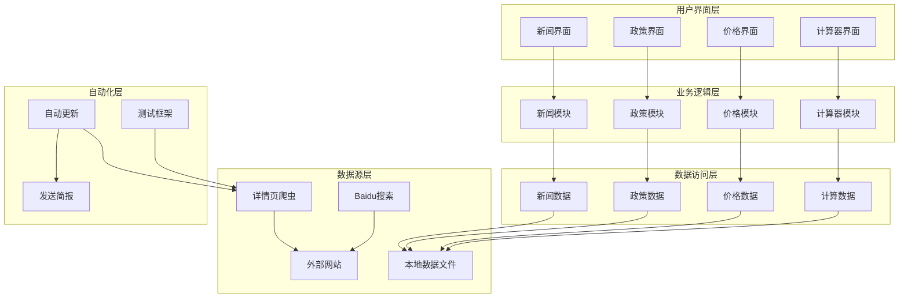

**图表来源**
- [src/App.tsx:9-14](file://src/App.tsx#L9-L14)
- [src/sections/NewsSection.tsx:1-110](file://src/sections/NewsSection.tsx#L1-L110)
- [scripts/autoUpdate.ts:18-53](file://scripts/autoUpdate.ts#L18-L53)
- [scripts/testCrawler.ts:9-53](file://scripts/testCrawler.ts#L9-L53)

### 新闻数据处理流程


**图表来源**
- [src/data/news.ts:5-155](file://src/data/news.ts#L5-L155)

**章节来源**
- [src/App.tsx:18-59](file://src/App.tsx#L18-L59)
- [scripts/autoUpdate.ts:18-53](file://scripts/autoUpdate.ts#L18-L53)

## 详细组件分析

### 新闻爬虫系统

新闻爬虫系统是整个数据获取的核心组件，负责从多个权威网站抓取最新的碳市场新闻。

#### 爬虫架构设计

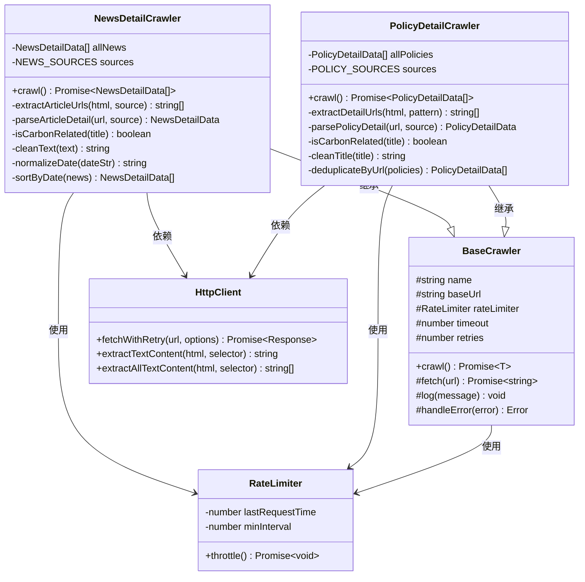

**图表来源**
- [scripts/crawler/newsDetailCrawler.ts:46-197](file://scripts/crawler/newsDetailCrawler.ts#L46-L197)
- [scripts/crawler/policyDetailCrawler.ts:68-204](file://scripts/crawler/policyDetailCrawler.ts#L68-L204)
- [scripts/crawler/baseCrawler.ts:16-65](file://scripts/crawler/baseCrawler.ts#L16-L65)
- [scripts/utils/httpClient.ts:71-115](file://scripts/utils/httpClient.ts#L71-L115)

#### 爬虫配置参数

| 参数名称 | 默认值 | 描述 |
|---------|--------|------|
| rateLimitMs | 3000ms | 新闻详情爬虫请求间隔限制 |
| rateLimitMs | 5000ms | 政策详情爬虫请求间隔限制（更严格） |
| timeout | 15000ms | 新闻详情爬虫HTTP请求超时时间 |
| timeout | 20000ms | 政策详情爬虫HTTP请求超时时间 |
| retries | 2次 | 新闻详情爬虫请求失败时的重试次数 |
| retries | 3次 | 政策详情爬虫请求失败时的重试次数 |
| baseUrl | 空字符串 | 基础URL前缀 |

#### 新闻解析算法

爬虫使用多模式正则表达式来解析不同格式的新闻链接：

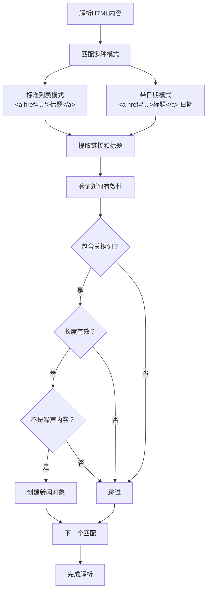

**图表来源**
- [scripts/crawler/newsDetailCrawler.ts:115-149](file://scripts/crawler/newsDetailCrawler.ts#L115-L149)

**章节来源**
- [scripts/crawler/newsDetailCrawler.ts:46-197](file://scripts/crawler/newsDetailCrawler.ts#L46-L197)
- [scripts/crawler/policyDetailCrawler.ts:68-204](file://scripts/crawler/policyDetailCrawler.ts#L68-L204)
- [scripts/crawler/baseCrawler.ts:16-65](file://scripts/crawler/baseCrawler.ts#L16-L65)

### 详情页爬虫系统

**新增** 详情页爬虫系统是本次更新的核心组件，专门用于抓取真实的文章详情页URL和内容。

#### 政策详情爬虫

政策详情爬虫从政府官方网站抓取真实的政策详情页信息：

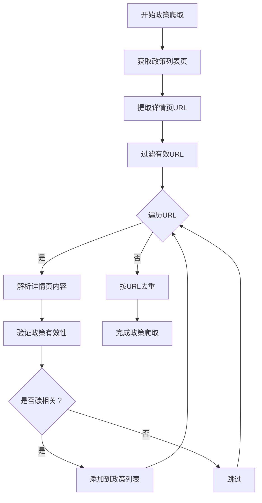

**图表来源**
- [scripts/crawler/policyDetailCrawler.ts:79-111](file://scripts/crawler/policyDetailCrawler.ts#L79-L111)

#### 资讯详情爬虫

资讯详情爬虫从碳市场新闻网站抓取真实的文章详情页信息：

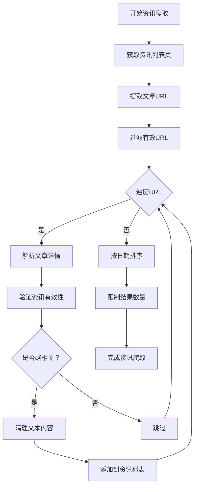

**图表来源**
- [scripts/crawler/newsDetailCrawler.ts:57-89](file://scripts/crawler/newsDetailCrawler.ts#L57-L89)

**章节来源**
- [scripts/crawler/policyDetailCrawler.ts:19-66](file://scripts/crawler/policyDetailCrawler.ts#L19-L66)
- [scripts/crawler/newsDetailCrawler.ts:18-44](file://scripts/crawler/newsDetailCrawler.ts#L18-L44)

### 爬虫测试框架

**新增** 系统新增了独立的爬虫测试框架，支持详情页爬虫的功能验证。

#### 测试脚本架构

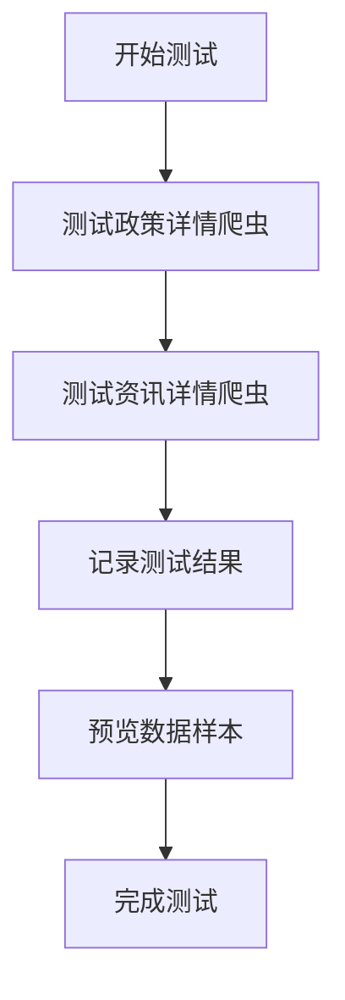

**图表来源**
- [scripts/testCrawler.ts:9-53](file://scripts/testCrawler.ts#L9-L53)

#### 测试功能特性

| 测试类型 | 功能描述 | 验证内容 |
|---------|----------|----------|
| 政策爬虫测试 | 验证政策详情页抓取功能 | URL提取、标题解析、日期处理 |
| 资讯爬虫测试 | 验证资讯详情页抓取功能 | 文章解析、摘要提取、内容清理 |
| 数据完整性测试 | 验证数据字段完整性 | ID生成、URL规范化、日期标准化 |
| 错误处理测试 | 验证异常情况处理 | 网络错误、解析失败、超时处理 |

**章节来源**
- [scripts/testCrawler.ts:1-53](file://scripts/testCrawler.ts#L1-L53)

### 新闻数据生成系统

本地新闻数据生成系统负责创建模拟的新闻数据，用于演示和测试目的。

#### 数据生成策略

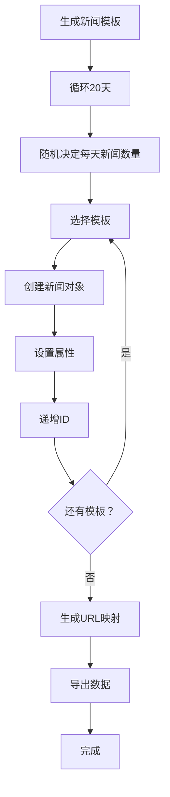

**图表来源**
- [src/data/news.ts:5-155](file://src/data/news.ts#L5-L155)

#### 新闻模板分类

系统包含20个精心设计的新闻模板，涵盖以下主题：

| 主题类别 | 数量 | 示例关键词 |
|---------|------|-----------|
| CCER交易 | 5 | CCER、交易市场、成交量 |
| 政策法规 | 8 | 方法学、政策、实施细则 |
| 地方实践 | 6 | 碳普惠、试点、城市 |
| 国际动态 | 3 | CBAM、VCS、国际市场 |

**章节来源**
- [src/data/news.ts:6-127](file://src/data/news.ts#L6-L127)

### 新闻界面展示系统

**更新** 新闻界面使用React组件化架构，提供美观的新闻展示效果。经过类型安全增强后，组件具有更强的类型约束和运行时稳定性。

#### 组件结构设计

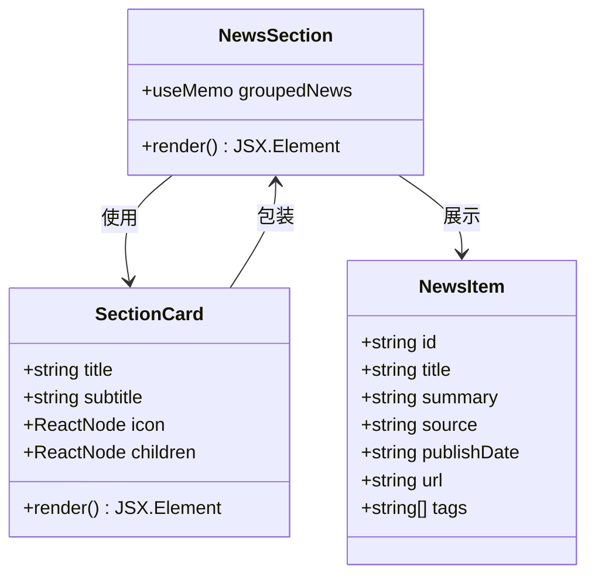

**图表来源**
- [src/sections/NewsSection.tsx:7-110](file://src/sections/NewsSection.tsx#L7-L110)
- [src/components/SectionCard.tsx:10-25](file://src/components/SectionCard.tsx#L10-L25)

#### 响应式布局设计

界面采用Flexbox布局，支持不同屏幕尺寸的自适应：

| 设备类型 | 屏幕宽度 | 布局特点 |
|---------|----------|---------|
| 移动设备 | < 768px | 单列布局，紧凑间距 |
| 平板设备 | 768px - 1024px | 双列布局，适中间距 |
| 桌面设备 | > 1024px | 三列布局，宽松间距 |

#### 类型安全增强

**更新** 组件现在具有更强的类型约束：

- **导入类型修复**：确保`NewsItem`类型正确导入和使用
- **渲染类型约束**：为每个渲染元素添加明确的类型断言
- **属性访问安全**：对可选属性进行安全访问检查
- **事件处理器类型**：为点击事件和导航提供类型安全的处理

**章节来源**
- [src/sections/NewsSection.tsx:1-110](file://src/sections/NewsSection.tsx#L1-L110)
- [src/components/SectionCard.tsx:1-26](file://src/components/SectionCard.tsx#L1-L26)

### 自动化更新系统

系统提供完整的自动化更新机制，包括数据抓取、处理和简报发送。

#### 更新流程架构

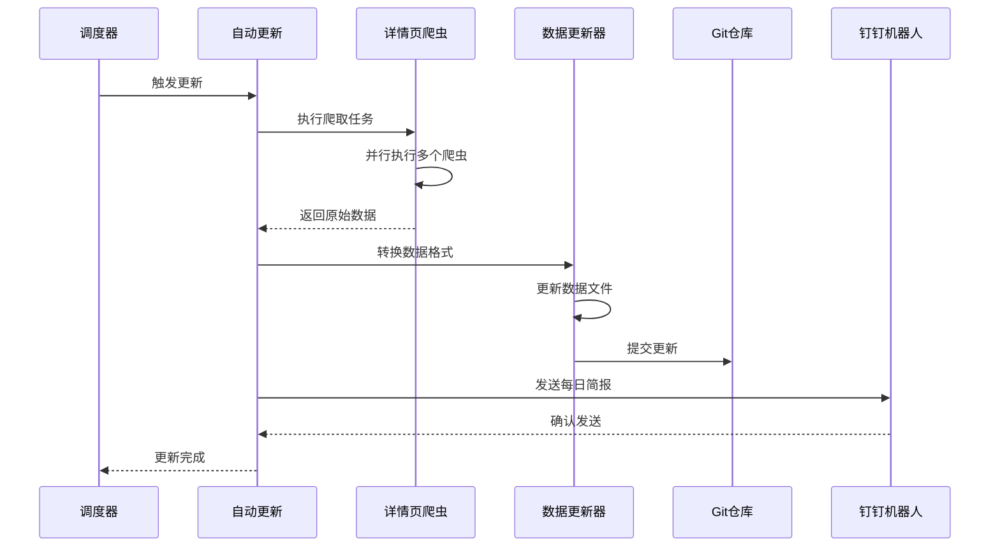

**图表来源**
- [scripts/autoUpdate.ts:18-53](file://scripts/autoUpdate.ts#L18-L53)
- [scripts/updateData.ts:173-185](file://scripts/updateData.ts#L173-L185)

#### 数据更新策略

| 数据类型 | 更新频率 | 更新方式 | 备注 |
|---------|----------|----------|------|
| 碳价数据 | 每日 | 百度搜索 | 包含CEA和CCER价格 |
| 政策数据 | 每日 | 详情页爬虫 | 政策和方法学详情 |
| 新闻数据 | 每日 | 详情页爬虫 | 碳市场相关新闻详情 |
| 本地数据 | 每日 | 文件更新 | 静态数据文件 |

**章节来源**
- [scripts/autoUpdate.ts:18-53](file://scripts/autoUpdate.ts#L18-L53)
- [scripts/updateData.ts:173-185](file://scripts/updateData.ts#L173-L185)

## 依赖关系分析

### 核心依赖关系

```mermaid
graph TB
subgraph "React生态系统"
React[react@19.2.4]
ReactDOM[react-dom@19.2.4]
Lucide[Lucide React@0.577.0]
end
subgraph "开发工具"
Vite[vite@8.0.1]
TS[TypeScript~5.9.3]
Tailwind[tailwindcss@4.2.2]
end
subgraph "第三方库"
DayJS[dayjs@1.11.20]
Recharts[recharts@3.8.0]
end
subgraph "爬虫依赖"
Fetch[fetchWithRetry]
RateLimiter[RateLimiter]
DetailCrawler[详情页爬虫]
TestFramework[测试框架]
end
NewsSection --> React
NewsSection --> Lucide
NewsSection --> DayJS
DetailCrawler --> Fetch
DetailCrawler --> RateLimiter
TestFramework --> DetailCrawler
App --> Vite
App --> TS
App --> Tailwind
```

**图表来源**
- [package.json:15-38](file://package.json#L15-L38)
- [src/sections/NewsSection.tsx:1-110](file://src/sections/NewsSection.tsx#L1-L110)

### 数据依赖链

系统中的数据流遵循严格的依赖关系：

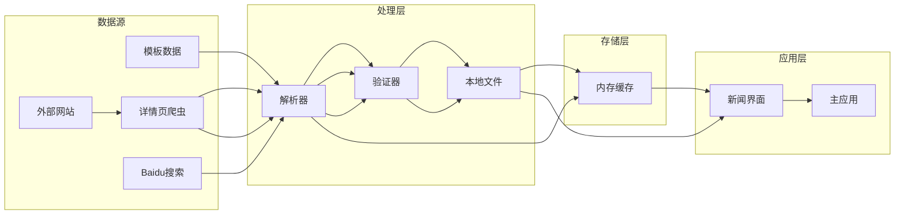

**图表来源**
- [scripts/crawler/index.ts:14-60](file://scripts/crawler/index.ts#L14-L60)
- [src/data/news.ts:1-185](file://src/data/news.ts#L1-L185)

**章节来源**
- [package.json:15-38](file://package.json#L15-L38)
- [scripts/crawler/index.ts:14-60](file://scripts/crawler/index.ts#L14-L60)

## 性能考虑

### 爬虫性能优化

系统在爬虫性能方面采用了多项优化策略：

1. **并发控制**：使用Promise.allSettled并行执行多个爬虫任务
2. **请求限流**：不同的爬虫类型采用不同的限流策略
3. **智能重试**：指数退避策略减少服务器压力
4. **数据去重**：高效的去重算法避免重复处理
5. **详情页抓取**：通过真实URL抓取提升数据质量

### 内存管理

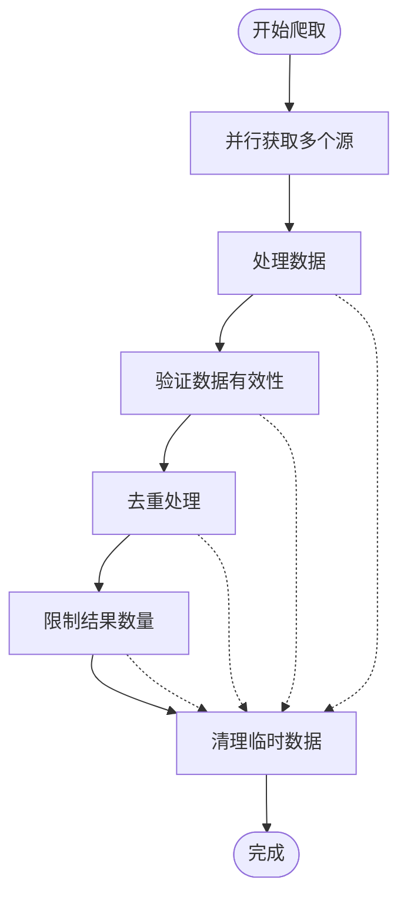

**图表来源**
- [scripts/crawler/newsDetailCrawler.ts:57-89](file://scripts/crawler/newsDetailCrawler.ts#L57-L89)
- [scripts/crawler/policyDetailCrawler.ts:79-111](file://scripts/crawler/policyDetailCrawler.ts#L79-L111)

### 缓存策略

系统采用多层次缓存策略：

| 缓存层级 | 类型 | 存储位置 | 生命周期 |
|---------|------|----------|----------|
| 应用缓存 | 内存缓存 | 浏览器内存 | 页面会话 |
| 本地缓存 | 文件缓存 | 本地文件 | 持久化 |
| 服务器缓存 | CDN缓存 | 服务器端 | 可配置 |

## 故障排除指南

### 常见问题及解决方案

#### 爬虫抓取失败

**问题症状**：新闻数据无法更新或显示为空白

**可能原因**：
1. 目标网站结构变更
2. 网络连接不稳定
3. 请求被目标网站阻止
4. 详情页URL格式变化

**解决步骤**：
1. 检查网络连接状态
2. 验证目标网站可用性
3. 查看爬虫日志输出
4. 更新正则表达式模式
5. 检查详情页URL提取逻辑

#### 数据去重失效

**问题症状**：新闻列表中出现重复内容

**解决步骤**：
1. 检查去重算法实现
2. 验证新闻标题和来源的唯一性
3. 调整去重键值组合
4. 对于政策爬虫，使用URL去重策略

#### 性能问题

**问题症状**：页面加载缓慢或响应延迟

**优化方案**：
1. 实施数据分页加载
2. 添加懒加载机制
3. 优化图片资源
4. 减少不必要的重渲染
5. 调整爬虫限流参数

#### 测试失败

**问题症状**：爬虫测试脚本执行失败

**解决步骤**：
1. 检查测试脚本依赖
2. 验证爬虫接口正确性
3. 查看测试日志输出
4. 确认网络连接正常

#### 组件类型错误

**问题症状**：NewsSection组件编译失败或运行时错误

**解决步骤**：
1. 检查NewsItem类型的导入是否正确
2. 验证组件中的类型断言是否准确
3. 确认渲染元素的属性访问安全
4. 检查组件的返回值类型
5. 验证useMemo的依赖数组配置

#### HTML结构错误

**问题症状**：新闻界面渲染异常或显示错误

**解决步骤**：
1. 检查组件中的HTML标签闭合
2. 验证嵌套结构的正确性
3. 确认条件渲染的逻辑
4. 检查事件处理器的绑定
5. 验证CSS类名的正确性

**章节来源**
- [scripts/crawler/newsDetailCrawler.ts:79-85](file://scripts/crawler/newsDetailCrawler.ts#L79-L85)
- [scripts/crawler/policyDetailCrawler.ts:101-107](file://scripts/crawler/policyDetailCrawler.ts#L101-L107)
- [scripts/utils/httpClient.ts:33-66](file://scripts/utils/httpClient.ts#L33-L66)

### 调试工具

系统提供了完善的调试和监控功能：

1. **日志系统**：详细的爬虫执行日志
2. **错误处理**：优雅的异常捕获和恢复
3. **性能监控**：请求耗时统计
4. **数据验证**：爬取数据质量检查
5. **测试框架**：独立的爬虫功能测试

## 结论

增强的新闻数据管理系统通过集成自动化爬虫、智能数据处理和美观的用户界面，为碳普惠信息提供了完整的技术解决方案。本次更新显著提升了系统的可靠性和可维护性。

### 技术优势
- **模块化设计**：清晰的组件分离和职责划分
- **详情页抓取**：通过真实URL获取高质量数据
- **测试框架**：独立的爬虫功能验证机制
- **类型安全**：增强的类型约束和编译时检查
- **语法正确性**：修复的HTML结构和组件语法
- **可扩展性**：易于添加新的数据源和功能模块
- **稳定性**：完善的错误处理和容错机制
- **性能优化**：多层缓存和并发处理策略

### 功能特色
- **实时数据**：自动化更新确保信息时效性
- **智能筛选**：关键词过滤确保内容质量
- **详情页解析**：获取真实的文章详情内容
- **友好界面**：直观的用户交互体验
- **跨平台支持**：响应式设计适配多种设备
- **测试保障**：独立测试框架确保功能稳定
- **类型安全保障**：编译时类型检查防止运行时错误

### 发展前景
系统为未来的功能扩展奠定了良好的基础，可以轻松集成更多数据源、增强AI分析能力、提供个性化推荐等功能。通过持续的优化和改进，该系统将成为碳普惠信息领域的重要技术基础设施。

**更新总结**：本次更新重点增强了爬虫系统的功能性和可靠性，新增的详情页爬虫和测试框架显著提升了系统的整体质量。同时，通过修复NewsSection组件中的类型错误和导入问题，大幅提升了组件的类型安全性和运行时稳定性，为后续的功能扩展和维护提供了更好的基础。