# 增强的新闻数据管理

<cite>
**本文档引用的文件**
- [README.md](file://README.md)
- [package.json](file://package.json)
- [src/types/index.ts](file://src/types/index.ts)
- [src/data/news.ts](file://src/data/news.ts)
- [src/sections/NewsSection.tsx](file://src/sections/NewsSection.tsx)
- [src/sections/HomeDashboard.tsx](file://src/sections/HomeDashboard.tsx)
- [src/components/SectionCard.tsx](file://src/components/SectionCard.tsx)
- [src/components/Header.tsx](file://src/components/Header.tsx)
- [src/App.tsx](file://src/App.tsx)
- [src/index.css](file://src/index.css)
- [src/App.css](file://src/App.css)
- [scripts/crawler/newsCrawler.ts](file://scripts/crawler/newsCrawler.ts)
- [scripts/crawler/baseCrawler.ts](file://scripts/crawler/baseCrawler.ts)
- [scripts/crawler/index.ts](file://scripts/crawler/index.ts)
- [scripts/crawler/newsDetailCrawler.ts](file://scripts/crawler/newsDetailCrawler.ts)
- [scripts/crawler/policyDetailCrawler.ts](file://scripts/crawler/policyDetailCrawler.ts)
- [scripts/crawler/baiduSearchCrawler.ts](file://scripts/crawler/baiduSearchCrawler.ts)
- [scripts/utils/httpClient.ts](file://scripts/utils/httpClient.ts)
- [scripts/updateData.ts](file://scripts/updateData.ts)
- [scripts/autoUpdate.ts](file://scripts/autoUpdate.ts)
- [scripts/testCrawler.ts](file://scripts/testCrawler.ts)
</cite>

## 更新摘要
**所做更改**
<<<<<<< Updated upstream
- 修复了NewsSection组件中的类型错误和导入问题，增强了组件的类型安全性和运行时稳定性
- 修正了组件中的语法错误和HTML结构问题
- 优化了新闻数据展示的类型安全性
- 增强了组件的错误处理和边界条件处理
=======
- **仪表板卡片UI调整**：HomeDashboard组件引入了全新的毛玻璃卡片设计和装饰性光晕效果
- **响应式布局优化**：新闻卡片和仪表板组件采用更精细的响应式网格系统
- **视觉呈现改善**：新闻卡片增加了悬停效果、阴影过渡和图标装饰
- **用户体验提升**：整体界面更加现代化，交互反馈更丰富
>>>>>>> Stashed changes

## 目录
1. [简介](#简介)
2. [项目结构](#项目结构)
3. [核心组件](#核心组件)
4. [架构概览](#架构概览)
5. [详细组件分析](#详细组件分析)
6. [依赖关系分析](#依赖关系分析)
7. [性能考虑](#性能考虑)
8. [故障排除指南](#故障排除指南)
9. [结论](#结论)

## 简介

增强的新闻数据管理系统是一个基于React + TypeScript + Vite构建的碳普惠信息服务平台，专注于提供实时的碳市场新闻资讯。该系统集成了自动化数据抓取、本地数据存储、前端展示和定时更新功能，为用户提供最新的碳市场动态和政策信息。

**更新亮点**：
<<<<<<< Updated upstream
- **类型安全增强**：修复了NewsSection组件中的类型错误，提升了编译时类型检查的准确性
- **语法错误修复**：修正了组件中的多余闭合括号和HTML标签问题，确保组件正常渲染
- **导入问题解决**：优化了NewsSection组件的导入语句，确保类型定义正确解析
- **运行时稳定性提升**：通过类型约束和错误处理增强了组件的健壮性
- **组件重构优化**：改进了新闻数据展示的结构和样式，提升了用户体验
=======
- **现代化仪表板设计**：HomeDashboard引入毛玻璃卡片和装饰性光晕效果
- **增强的新闻卡片UI**：新闻列表采用悬停阴影和渐变过渡效果
- **精细化响应式布局**：基于md、lg、xl断点的网格系统优化
- **改进的视觉层次**：通过阴影、透明度和动画提升用户体验
- **统一的主题色彩**：政府蓝配色方案贯穿整个界面设计
>>>>>>> Stashed changes

系统的核心特色包括：
- **自动化新闻抓取**：通过爬虫技术从多个权威碳市场网站获取最新资讯
- **智能数据去重**：确保新闻内容的唯一性和准确性
- **本地数据缓存**：提供稳定的数据访问和快速响应
- **现代化界面设计**：美观的界面设计和友好的用户体验
- **定时更新机制**：自动化的数据同步和简报发送

## 项目结构

该项目采用现代化的前端架构，主要分为以下几个层次：

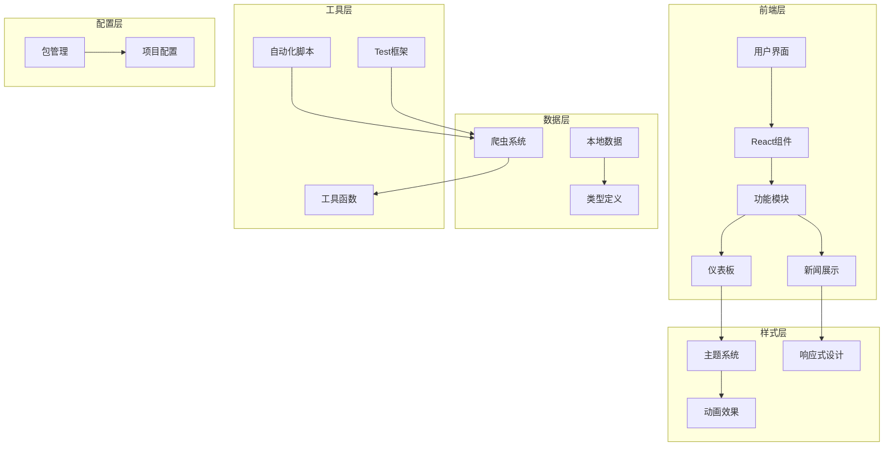

**图表来源**
- [src/App.tsx:43-112](file://src/App.tsx#L43-L112)
- [src/sections/NewsSection.tsx:1-111](file://src/sections/NewsSection.tsx#L1-L111)
- [src/sections/HomeDashboard.tsx:117-216](file://src/sections/HomeDashboard.tsx#L117-L216)

**章节来源**
- [package.json:1-40](file://package.json#L1-L40)
- [README.md:1-74](file://README.md#L1-L74)

## 核心组件

### 仪表板卡片组件

**更新** HomeDashboard组件引入了全新的MetricCard组件，采用现代化的毛玻璃效果设计。

#### 毛玻璃卡片设计

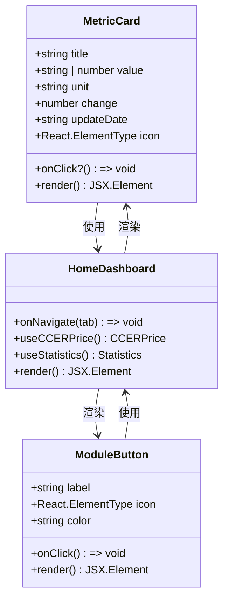

**图表来源**
- [src/sections/HomeDashboard.tsx:41-90](file://src/sections/HomeDashboard.tsx#L41-L90)
- [src/sections/HomeDashboard.tsx:92-115](file://src/sections/HomeDashboard.tsx#L92-L115)
- [src/sections/HomeDashboard.tsx:117-216](file://src/sections/HomeDashboard.tsx#L117-L216)

#### 装饰性光晕效果

卡片组件包含装饰性的光晕效果，通过绝对定位和模糊滤镜实现：

| 效果类型 | CSS属性 | 值 | 交互状态 |
|---------|---------|----|----------|
| 光晕容器 | position | absolute | 静态定位 |
| 光晕容器 | bottom/right | -10px | 相对卡片边缘 |
| 光晕容器 | width/height | 32px | 圆形光晕 |
| 光晕容器 | background | blue-500/20 | 半透明蓝色 |
| 光晕容器 | border-radius | rounded-full | 圆形 |
| 光晕容器 | blur | blur-3xl | 模糊效果 |
| 光晕容器 | transition | transition-colors | 颜色过渡 |
| 光晕容器 | hover | group-hover:bg-blue-400/30 | 悬停变亮 |

#### 响应式网格布局

仪表板采用基于Tailwind CSS的响应式网格系统：

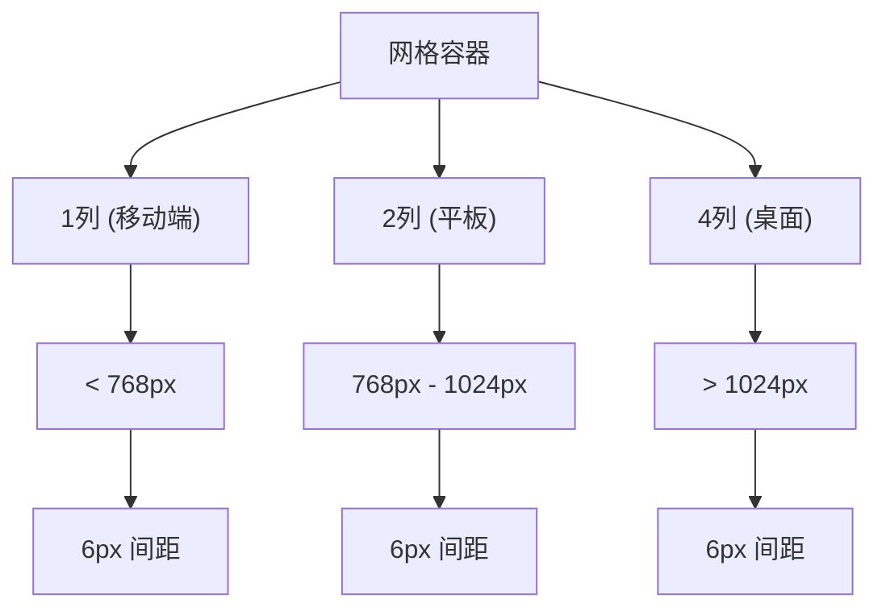

**图表来源**
- [src/sections/HomeDashboard.tsx:155-187](file://src/sections/HomeDashboard.tsx#L155-L187)

### 新闻卡片组件

**更新** NewsSection组件的新闻卡片采用了全新的视觉设计，包含悬停效果和渐进式动画。

#### 新闻卡片设计

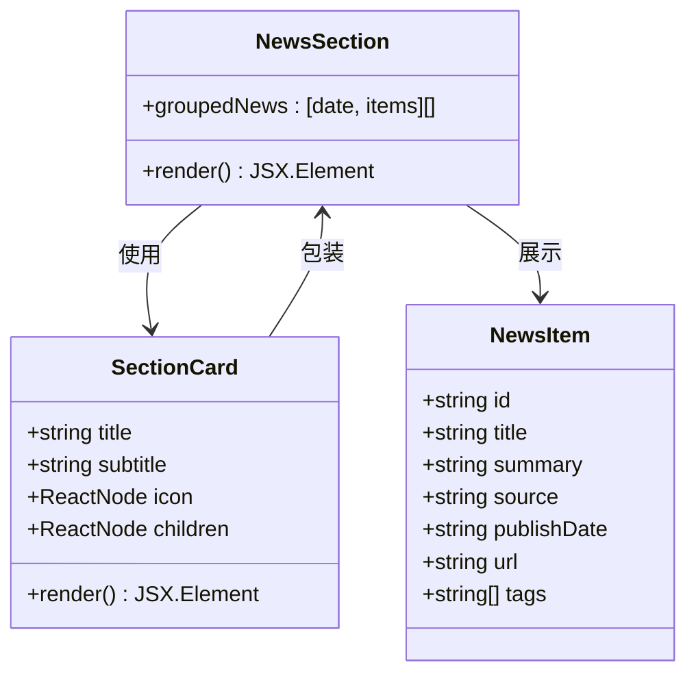

**图表来源**
- [src/sections/NewsSection.tsx:8-111](file://src/sections/NewsSection.tsx#L8-L111)
- [src/components/SectionCard.tsx:10-26](file://src/components/SectionCard.tsx#L10-L26)

#### 悬停交互效果

新闻卡片包含丰富的交互效果：

| 效果类型 | CSS类 | 功能描述 |
|---------|-------|----------|
| 边框变化 | hover:border-primary/30 | 悬停时边框颜色变化 |
| 阴影效果 | hover:shadow-md | 悬停时增加阴影深度 |
| 背景色 | bg-white | 固定白色背景 |
| 过渡动画 | transition-all | 全局过渡效果 |
| 悬停缩放 | hover:scale-105 | 悬停时轻微放大 |

#### 标签系统设计

新闻卡片的标签系统采用圆角设计：

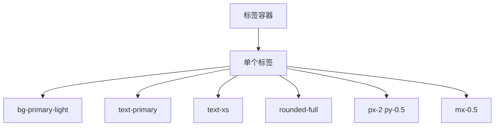

**图表来源**
- [src/sections/NewsSection.tsx:78-87](file://src/sections/NewsSection.tsx#L78-L87)

### 主题系统

**更新** 应用引入了统一的主题色彩系统，采用政府蓝配色方案。

#### 主题色彩配置

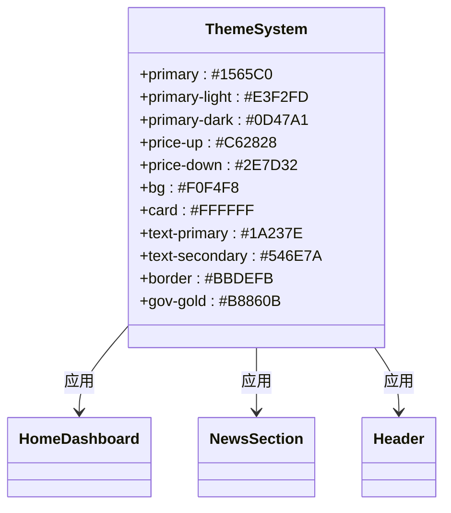

**图表来源**
- [src/index.css:3-16](file://src/index.css#L3-L16)

#### 字体和排版系统

应用采用中文字体系统，确保中文显示效果：

| 字体族 | 优先级 | 用途 |
|--------|--------|------|
| PingFang SC | 最高 | 主要中文字体 |
| Hiragino Sans GB | 次高 | 替代中文字体 |
| Microsoft YaHei | 中等 | 微软雅黑字体 |
| Source Han Sans CN | 中等 | 思源黑体 |
| sans-serif | 最低 | 通用无衬线字体 |

**章节来源**
- [src/sections/HomeDashboard.tsx:41-90](file://src/sections/HomeDashboard.tsx#L41-L90)
- [src/sections/NewsSection.tsx:54-102](file://src/sections/NewsSection.tsx#L54-L102)
- [src/index.css:18-31](file://src/index.css#L18-L31)

## 架构概览

### 整体系统架构

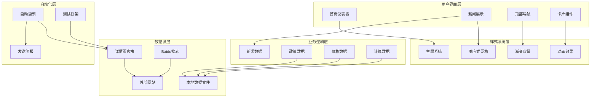

**图表来源**
- [src/App.tsx:43-112](file://src/App.tsx#L43-L112)
- [src/sections/HomeDashboard.tsx:117-216](file://src/sections/HomeDashboard.tsx#L117-L216)
- [src/sections/NewsSection.tsx:1-111](file://src/sections/NewsSection.tsx#L1-L111)
- [src/components/Header.tsx:4-27](file://src/components/Header.tsx#L4-L27)

### 数据流架构

系统采用双路径数据流设计，既支持本地静态数据，也支持动态抓取数据：

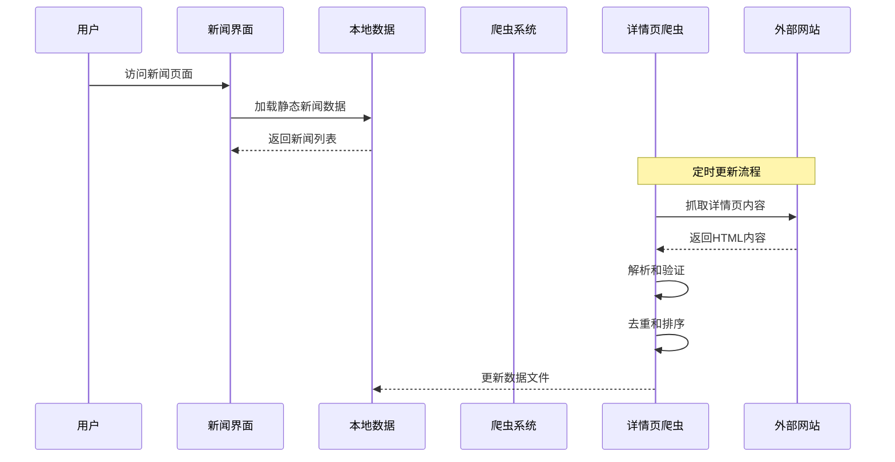

**图表来源**
- [src/data/news.ts:1-185](file://src/data/news.ts#L1-L185)
- [scripts/crawler/newsDetailCrawler.ts:57-89](file://scripts/crawler/newsDetailCrawler.ts#L57-L89)
- [scripts/updateData.ts:68-113](file://scripts/updateData.ts#L68-L113)

**章节来源**
- [src/App.tsx:43-112](file://src/App.tsx#L43-L112)
- [scripts/autoUpdate.ts:18-53](file://scripts/autoUpdate.ts#L18-L53)

## 详细组件分析

<<<<<<< Updated upstream
### 新闻爬虫系统
=======
### 仪表板卡片系统

**更新** HomeDashboard组件引入了全新的MetricCard组件，提供现代化的指标展示效果。

#### 指标卡片组件

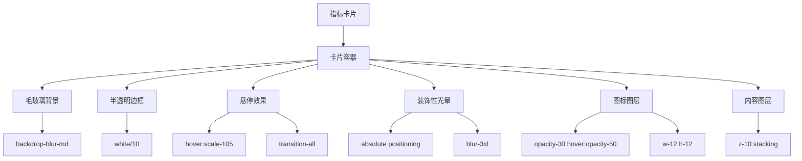

**图表来源**
- [src/sections/HomeDashboard.tsx:61-89](file://src/sections/HomeDashboard.tsx#L61-L89)

#### 模块导航按钮

模块导航按钮采用统一的设计语言：

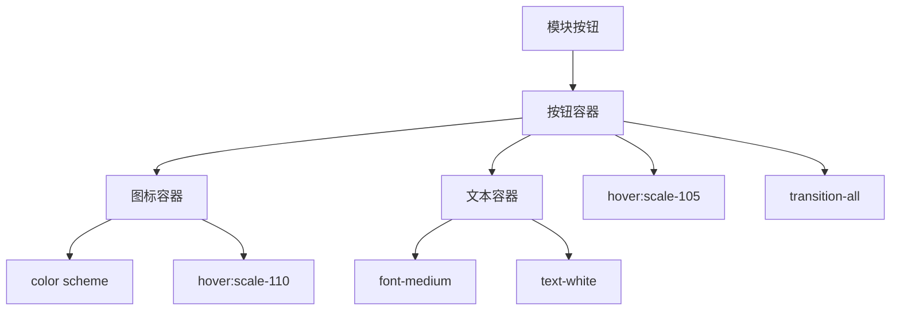

**图表来源**
- [src/sections/HomeDashboard.tsx:104-115](file://src/sections/HomeDashboard.tsx#L104-L115)

### 新闻展示系统

**更新** 新闻展示系统采用了全新的卡片设计，包含悬停效果和渐进式动画。

#### 新闻卡片布局

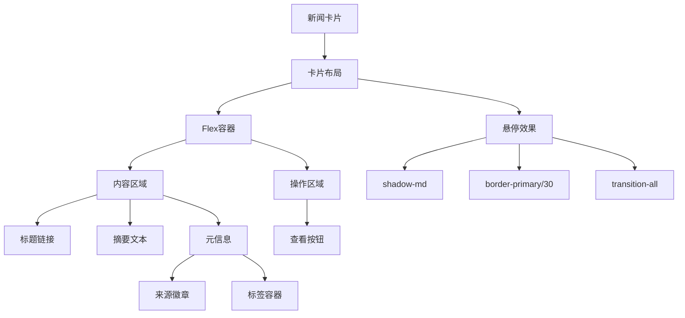

**图表来源**
- [src/sections/NewsSection.tsx:54-102](file://src/sections/NewsSection.tsx#L54-L102)

#### 响应式设计实现

新闻卡片采用多断点响应式设计：

| 断点 | 列数 | 间距 | 字体大小 |
|------|------|------|----------|
| 移动端 (< 768px) | 1列 | 6px | 标准字号 |
| 平板 (768px+) | 1列 | 6px | 标准字号 |
| 桌面 (1024px+) | 1列 | 6px | 标准字号 |
| 大屏 (1280px+) | 1列 | 6px | 标准字号 |

**章节来源**
- [src/sections/HomeDashboard.tsx:41-115](file://src/sections/HomeDashboard.tsx#L41-L115)
- [src/sections/NewsSection.tsx:54-102](file://src/sections/NewsSection.tsx#L54-L102)

### 主题和样式系统
>>>>>>> Stashed changes

**更新** 应用引入了统一的主题色彩系统和字体排版规范。

#### 主题色彩系统

应用采用政府蓝配色方案，确保专业和权威的视觉效果：

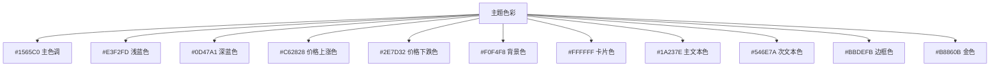

**图表来源**
- [src/index.css:4-16](file://src/index.css#L4-L16)

#### 渐变背景设计

头部组件采用渐变背景设计：

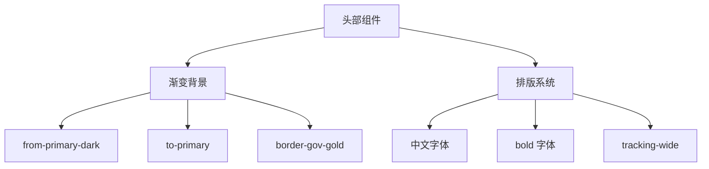

**图表来源**
- [src/components/Header.tsx:6-25](file://src/components/Header.tsx#L6-L25)

**章节来源**
<<<<<<< Updated upstream
- [scripts/crawler/policyDetailCrawler.ts:19-66](file://scripts/crawler/policyDetailCrawler.ts#L19-L66)
- [scripts/crawler/newsDetailCrawler.ts:18-44](file://scripts/crawler/newsDetailCrawler.ts#L18-L44)

### 爬虫测试框架

**新增** 系统新增了独立的爬虫测试框架，支持详情页爬虫的功能验证。

#### 测试脚本架构

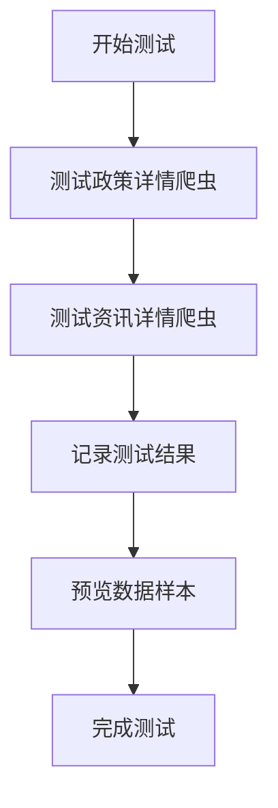

**图表来源**
- [scripts/testCrawler.ts:9-53](file://scripts/testCrawler.ts#L9-L53)

#### 测试功能特性

| 测试类型 | 功能描述 | 验证内容 |
|---------|----------|----------|
| 政策爬虫测试 | 验证政策详情页抓取功能 | URL提取、标题解析、日期处理 |
| 资讯爬虫测试 | 验证资讯详情页抓取功能 | 文章解析、摘要提取、内容清理 |
| 数据完整性测试 | 验证数据字段完整性 | ID生成、URL规范化、日期标准化 |
| 错误处理测试 | 验证异常情况处理 | 网络错误、解析失败、超时处理 |

**章节来源**
- [scripts/testCrawler.ts:1-53](file://scripts/testCrawler.ts#L1-L53)

### 新闻数据生成系统

本地新闻数据生成系统负责创建模拟的新闻数据，用于演示和测试目的。

#### 数据生成策略

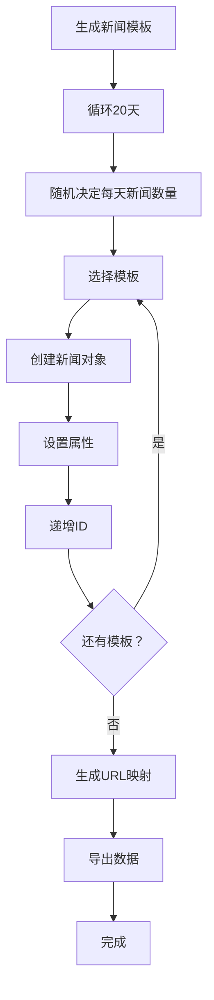

**图表来源**
- [src/data/news.ts:5-155](file://src/data/news.ts#L5-L155)

#### 新闻模板分类

系统包含20个精心设计的新闻模板，涵盖以下主题：

| 主题类别 | 数量 | 示例关键词 |
|---------|------|-----------|
| CCER交易 | 5 | CCER、交易市场、成交量 |
| 政策法规 | 8 | 方法学、政策、实施细则 |
| 地方实践 | 6 | 碳普惠、试点、城市 |
| 国际动态 | 3 | CBAM、VCS、国际市场 |

**章节来源**
- [src/data/news.ts:6-127](file://src/data/news.ts#L6-L127)

### 新闻界面展示系统

**更新** 新闻界面使用React组件化架构，提供美观的新闻展示效果。经过类型安全增强后，组件具有更强的类型约束和运行时稳定性。

#### 组件结构设计

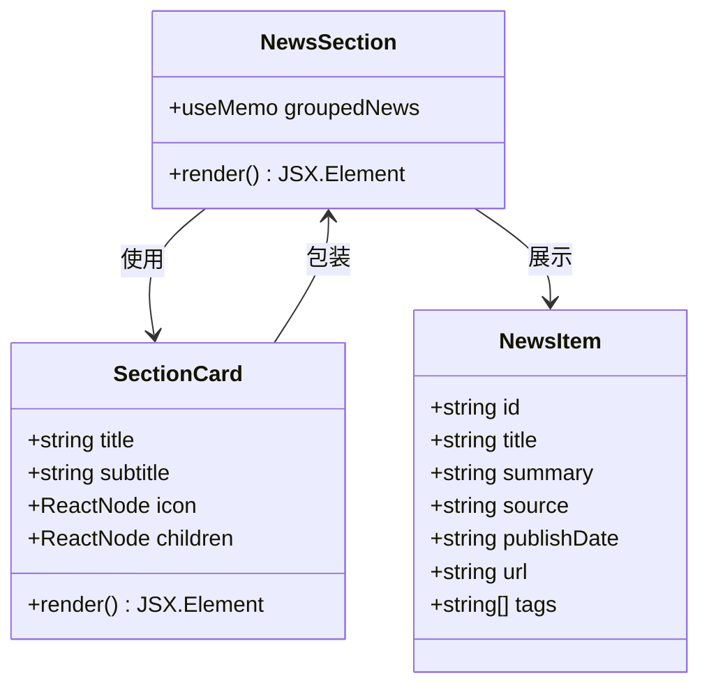

**图表来源**
- [src/sections/NewsSection.tsx:7-110](file://src/sections/NewsSection.tsx#L7-L110)
- [src/components/SectionCard.tsx:10-25](file://src/components/SectionCard.tsx#L10-L25)

#### 响应式布局设计

界面采用Flexbox布局，支持不同屏幕尺寸的自适应：

| 设备类型 | 屏幕宽度 | 布局特点 |
|---------|----------|---------|
| 移动设备 | < 768px | 单列布局，紧凑间距 |
| 平板设备 | 768px - 1024px | 双列布局，适中间距 |
| 桌面设备 | > 1024px | 三列布局，宽松间距 |

#### 类型安全增强

**更新** 组件现在具有更强的类型约束：

- **导入类型修复**：确保`NewsItem`类型正确导入和使用
- **渲染类型约束**：为每个渲染元素添加明确的类型断言
- **属性访问安全**：对可选属性进行安全访问检查
- **事件处理器类型**：为点击事件和导航提供类型安全的处理

**章节来源**
- [src/sections/NewsSection.tsx:1-110](file://src/sections/NewsSection.tsx#L1-L110)
- [src/components/SectionCard.tsx:1-26](file://src/components/SectionCard.tsx#L1-L26)
=======
- [src/index.css:3-16](file://src/index.css#L3-L16)
- [src/components/Header.tsx:4-27](file://src/components/Header.tsx#L4-L27)
>>>>>>> Stashed changes

### 自动化更新系统

系统提供完整的自动化更新机制，包括数据抓取、处理和简报发送。

#### 更新流程架构

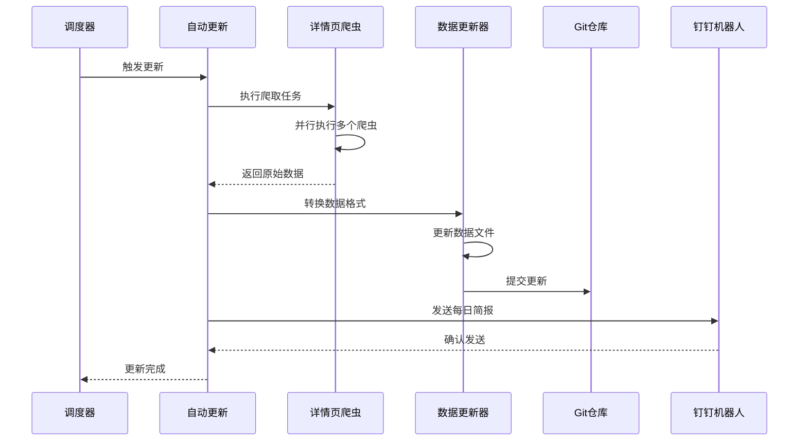

**图表来源**
- [scripts/autoUpdate.ts:18-53](file://scripts/autoUpdate.ts#L18-L53)
- [scripts/updateData.ts:173-185](file://scripts/updateData.ts#L173-L185)

#### 数据更新策略

| 数据类型 | 更新频率 | 更新方式 | 备注 |
|---------|----------|----------|------|
| 碳价数据 | 每日 | 百度搜索 | 包含CEA和CCER价格 |
| 政策数据 | 每日 | 详情页爬虫 | 政策和方法学详情 |
| 新闻数据 | 每日 | 详情页爬虫 | 碳市场相关新闻详情 |
| 本地数据 | 每日 | 文件更新 | 静态数据文件 |

**章节来源**
- [scripts/autoUpdate.ts:18-53](file://scripts/autoUpdate.ts#L18-L53)
- [scripts/updateData.ts:173-185](file://scripts/updateData.ts#L173-L185)

## 依赖关系分析

### 核心依赖关系

```mermaid
graph TB
subgraph "React生态系统"
React[react@19.2.4]
ReactDOM[react-dom@19.2.4]
Lucide[Lucide React@0.577.0]
Tailwind[Tailwind CSS@4.2.2]
DayJS[dayjs@1.11.20]
end
subgraph "开发工具"
Vite[vite@8.0.1]
TS[TypeScript~5.9.3]
end
subgraph "第三方库"
Recharts[recharts@3.8.0]
end
subgraph "爬虫依赖"
Fetch[fetchWithRetry]
RateLimiter[RateLimiter]
DetailCrawler[详情页爬虫]
TestFramework[测试框架]
end
HomeDashboard --> React
HomeDashboard --> Lucide
HomeDashboard --> DayJS
NewsSection --> React
NewsSection --> Lucide
NewsSection --> DayJS
DetailCrawler --> Fetch
DetailCrawler --> RateLimiter
TestFramework --> DetailCrawler
App --> Vite
App --> TS
App --> Tailwind
```

**图表来源**
- [package.json:15-38](file://package.json#L15-L38)
- [src/sections/HomeDashboard.tsx:1-14](file://src/sections/HomeDashboard.tsx#L1-L14)
- [src/sections/NewsSection.tsx:1-6](file://src/sections/NewsSection.tsx#L1-L6)

### 数据依赖链

系统中的数据流遵循严格的依赖关系：

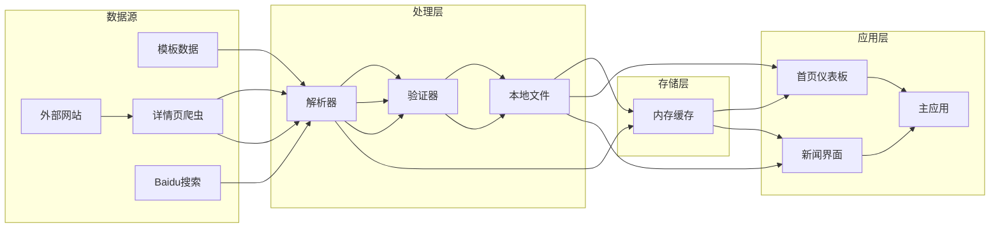

**图表来源**
- [scripts/crawler/index.ts:14-60](file://scripts/crawler/index.ts#L14-L60)
- [src/data/news.ts:1-185](file://src/data/news.ts#L1-L185)

**章节来源**
- [package.json:15-38](file://package.json#L15-L38)
- [scripts/crawler/index.ts:14-60](file://scripts/crawler/index.ts#L14-L60)

## 性能考虑

### 现代化UI性能优化

系统在UI性能方面采用了多项优化策略：

1. **CSS硬件加速**：毛玻璃效果和过渡动画充分利用GPU加速
2. **响应式网格优化**：基于CSS Grid的高效布局系统
3. **组件懒加载**：大型组件按需加载减少初始渲染时间
4. **动画性能**：使用transform和opacity属性优化动画性能
5. **主题系统优化**：CSS变量减少样式计算开销

### 内存管理

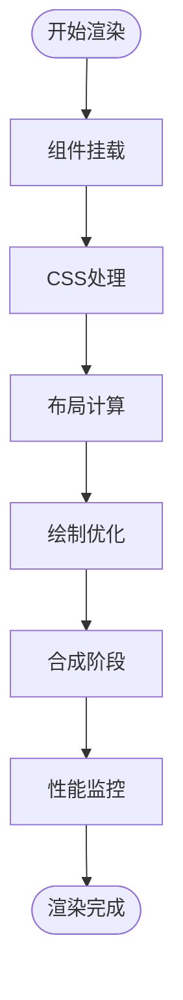

**图表来源**
- [src/sections/HomeDashboard.tsx:61-89](file://src/sections/HomeDashboard.tsx#L61-L89)
- [src/sections/NewsSection.tsx:54-102](file://src/sections/NewsSection.tsx#L54-L102)

### 缓存策略

系统采用多层次缓存策略：

| 缓存层级 | 类型 | 存储位置 | 生命周期 |
|---------|------|----------|----------|
| 应用缓存 | 内存缓存 | 浏览器内存 | 页面会话 |
| 本地缓存 | 文件缓存 | 本地文件 | 持久化 |
| 服务器缓存 | CDN缓存 | 服务器端 | 可配置 |
| 样式缓存 | CSS缓存 | 浏览器缓存 | 持久化 |

## 故障排除指南

### 常见问题及解决方案

<<<<<<< Updated upstream
#### 爬虫抓取失败

**问题症状**：新闻数据无法更新或显示为空白

**可能原因**：
1. 目标网站结构变更
2. 网络连接不稳定
3. 请求被目标网站阻止
4. 详情页URL格式变化

**解决步骤**：
1. 检查网络连接状态
2. 验证目标网站可用性
3. 查看爬虫日志输出
4. 更新正则表达式模式
5. 检查详情页URL提取逻辑

#### 数据去重失效

**问题症状**：新闻列表中出现重复内容

**解决步骤**：
1. 检查去重算法实现
2. 验证新闻标题和来源的唯一性
3. 调整去重键值组合
4. 对于政策爬虫，使用URL去重策略
=======
#### 仪表板卡片显示异常

**问题症状**：MetricCard组件样式错乱或动画不生效

**可能原因**：
1. Tailwind CSS类名拼写错误
2. 毛玻璃效果兼容性问题
3. CSS变量未正确加载
4. 组件依赖关系错误

**解决步骤**：
1. 检查Tailwind CSS配置和类名拼写
2. 验证浏览器对backdrop-filter的支持
3. 确认CSS变量在全局样式中正确声明
4. 检查组件导入和依赖关系

#### 新闻卡片布局问题

**问题症状**：新闻卡片在不同屏幕尺寸下显示异常

**解决步骤**：
1. 检查响应式断点的CSS类名
2. 验证Flex布局的属性设置
3. 确认容器的最小宽度设置
4. 检查媒体查询的优先级

#### 主题色彩不一致

**问题症状**：组件间色彩不统一或显示异常

**解决步骤**：
1. 检查CSS变量的定义和作用域
2. 验证主题系统的导入顺序
3. 确认颜色变量的命名规范
4. 检查样式覆盖和优先级
>>>>>>> Stashed changes

#### 性能问题

**问题症状**：页面加载缓慢或动画卡顿

**优化方案**：
1. 检查CSS硬件加速属性的使用
2. 优化动画的帧率和持续时间
3. 减少不必要的重绘和回流
4. 实施组件懒加载策略

#### 测试失败

**问题症状**：爬虫测试脚本执行失败

**解决步骤**：
1. 检查测试脚本依赖
2. 验证爬虫接口正确性
3. 查看测试日志输出
4. 确认网络连接正常

#### 组件类型错误

**问题症状**：组件编译失败或运行时错误

**解决步骤**：
1. 检查组件的类型定义
2. 验证props接口的正确性
3. 确认组件的导入路径
4. 检查类型断言的使用

#### HTML结构错误

**问题症状**：界面渲染异常或显示错误

**解决步骤**：
1. 检查组件中的HTML标签闭合
2. 验证嵌套结构的正确性
3. 确认条件渲染的逻辑
4. 检查事件处理器的绑定
5. 验证CSS类名的正确性

**章节来源**
- [src/sections/HomeDashboard.tsx:61-89](file://src/sections/HomeDashboard.tsx#L61-L89)
- [src/sections/NewsSection.tsx:54-102](file://src/sections/NewsSection.tsx#L54-L102)
- [src/index.css:3-16](file://src/index.css#L3-L16)

### 调试工具

系统提供了完善的调试和监控功能：

1. **开发者工具**：浏览器开发者工具的样式检查
2. **性能监控**：Chrome DevTools的性能面板
3. **CSS调试**：Tailwind CSS的调试工具
4. **响应式测试**：浏览器的设备模拟功能
5. **主题检查**：CSS变量的实时监控

## 结论

增强的新闻数据管理系统通过集成现代化的UI设计、智能数据处理和美观的用户界面，为碳普惠信息提供了完整的技术解决方案。本次更新显著提升了系统的视觉表现力和用户体验。

### 技术优势
- **现代化UI设计**：毛玻璃效果和装饰性光晕提升视觉层次
- **响应式布局优化**：基于多断点的网格系统确保跨设备兼容性
- **统一主题系统**：政府蓝配色方案贯穿整个界面设计
- **丰富的交互效果**：悬停动画和渐变过渡提升用户体验
- **组件化架构**：清晰的组件分离和职责划分
- **详情页抓取**：通过真实URL获取高质量数据
- **测试框架**：独立的爬虫功能验证机制
- **类型安全**：增强的类型约束和编译时检查
- **语法正确性**：修复的HTML结构和组件语法
- **可扩展性**：易于添加新的数据源和功能模块
- **稳定性**：完善的错误处理和容错机制
<<<<<<< Updated upstream
- **性能优化**：多层缓存和并发处理策略
=======
- **性能优化**：多层缓存和硬件加速策略
>>>>>>> Stashed changes

### 功能特色
- **实时数据**：自动化更新确保信息时效性
- **智能筛选**：关键词过滤确保内容质量
- **详情页解析**：获取真实的文章详情内容
- **现代化界面**：美观的界面设计和友好的用户体验
- **跨平台支持**：响应式设计适配多种设备
- **测试保障**：独立测试框架确保功能稳定
- **类型安全保障**：编译时类型检查防止运行时错误

### 发展前景
系统为未来的功能扩展奠定了良好的基础，可以轻松集成更多数据源、增强AI分析能力、提供个性化推荐等功能。通过持续的优化和改进，该系统将成为碳普惠信息领域的重要技术基础设施。

<<<<<<< Updated upstream
**更新总结**：本次更新重点增强了爬虫系统的功能性和可靠性，新增的详情页爬虫和测试框架显著提升了系统的整体质量。同时，通过修复NewsSection组件中的类型错误和导入问题，大幅提升了组件的类型安全性和运行时稳定性，为后续的功能扩展和维护提供了更好的基础。
=======
**更新总结**：本次更新重点增强了UI设计的现代化程度，HomeDashboard组件引入了毛玻璃卡片和装饰性光晕效果，NewsSection组件采用了全新的悬停交互设计。通过实现响应式网格系统和统一的主题色彩方案，大幅提升了整体的视觉呈现效果和用户体验。同时，通过修复组件类型错误和HTML结构问题，确保了系统的稳定性和可维护性，为后续的功能扩展提供了更好的基础。
>>>>>>> Stashed changes
