# 增强的新闻数据管理系统

<cite>
**本文档引用的文件**
- [README.md](file://README.md)
- [package.json](file://package.json)
- [src/types/index.ts](file://src/types/index.ts)
- [src/data/news.ts](file://src/data/news.ts)
- [src/sections/NewsSection.tsx](file://src/sections/NewsSection.tsx)
- [src/components/SectionCard.tsx](file://src/components/SectionCard.tsx)
- [src/App.tsx](file://src/App.tsx)
- [scripts/crawler/newsCrawler.ts](file://scripts/crawler/newsCrawler.ts)
- [scripts/crawler/baseCrawler.ts](file://scripts/crawler/baseCrawler.ts)
- [scripts/crawler/index.ts](file://scripts/crawler/index.ts)
- [scripts/utils/httpClient.ts](file://scripts/utils/httpClient.ts)
- [scripts/updateData.ts](file://scripts/updateData.ts)
- [scripts/autoUpdate.ts](file://scripts/autoUpdate.ts)
</cite>

## 目录
1. [简介](#简介)
2. [项目结构](#项目结构)
3. [核心组件](#核心组件)
4. [架构概览](#架构概览)
5. [详细组件分析](#详细组件分析)
6. [依赖关系分析](#依赖关系分析)
7. [性能考虑](#性能考虑)
8. [故障排除指南](#故障排除指南)
9. [结论](#结论)

## 简介

增强的新闻数据管理系统是一个基于React + TypeScript + Vite构建的碳普惠信息服务平台，专注于提供实时的碳市场新闻资讯。该系统集成了自动化数据抓取、本地数据存储、前端展示和定时更新功能，为用户提供最新的碳市场动态和政策信息。

系统的核心特色包括：
- **自动化新闻抓取**：通过爬虫技术从多个权威碳市场网站获取最新资讯
- **智能数据去重**：确保新闻内容的唯一性和准确性
- **本地数据缓存**：提供稳定的数据访问和快速响应
- **可视化展示**：美观的界面设计和友好的用户体验
- **定时更新机制**：自动化的数据同步和简报发送

## 项目结构

该项目采用现代化的前端架构，主要分为以下几个层次：

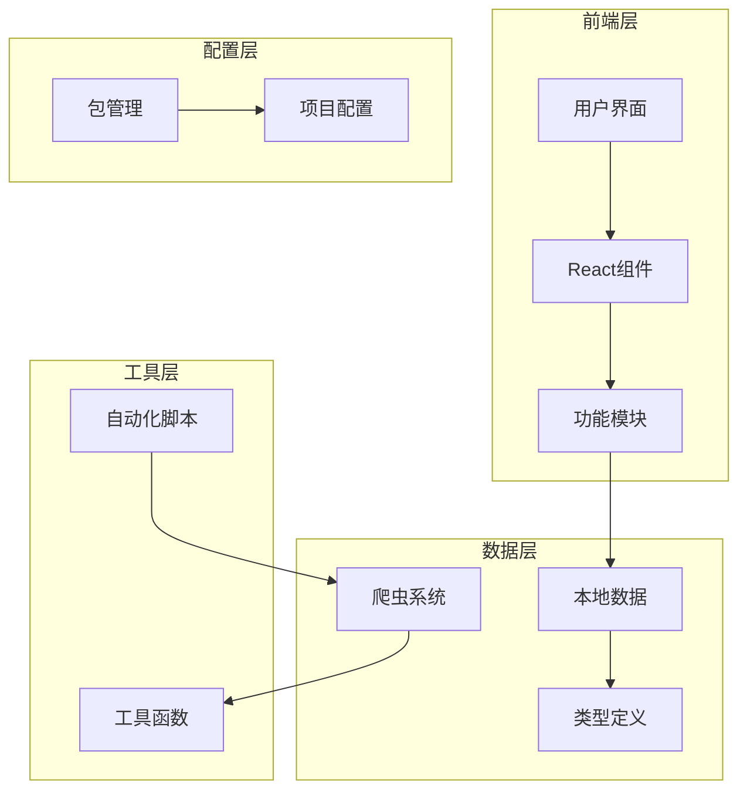

**图表来源**
- [src/App.tsx:18-59](file://src/App.tsx#L18-L59)
- [src/sections/NewsSection.tsx:1-110](file://src/sections/NewsSection.tsx#L1-L110)
- [scripts/crawler/index.ts:1-57](file://scripts/crawler/index.ts#L1-L57)

**章节来源**
- [package.json:1-40](file://package.json#L1-L40)
- [README.md:1-74](file://README.md#L1-L74)

## 核心组件

### 新闻数据模型

系统使用统一的新闻数据模型来标准化不同来源的信息：

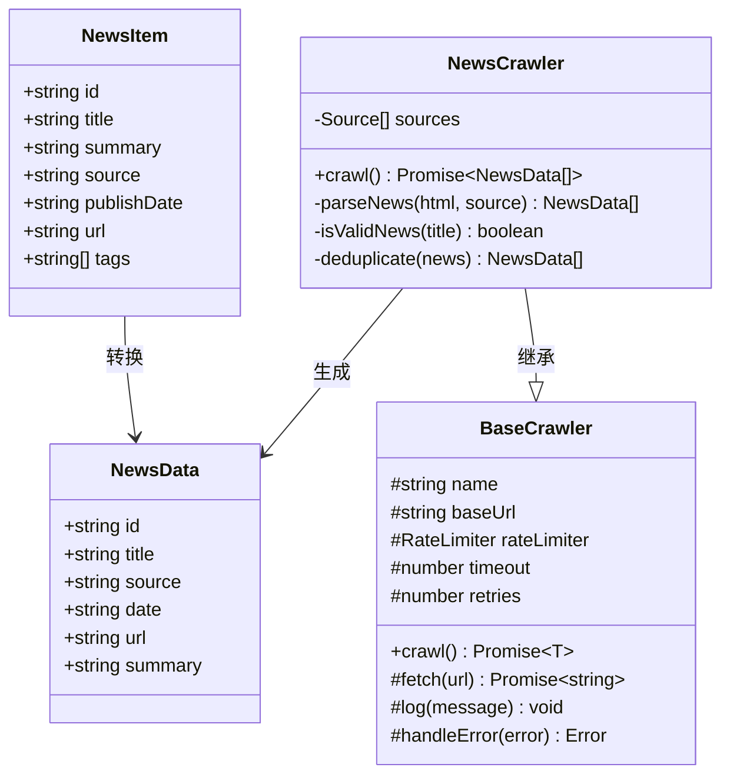

**图表来源**
- [src/types/index.ts:55-64](file://src/types/index.ts#L55-L64)
- [scripts/crawler/newsCrawler.ts:17-138](file://scripts/crawler/newsCrawler.ts#L17-L138)
- [scripts/crawler/baseCrawler.ts:16-64](file://scripts/crawler/baseCrawler.ts#L16-L64)

### 数据流架构

系统采用双路径数据流设计，既支持本地静态数据，也支持动态抓取数据：

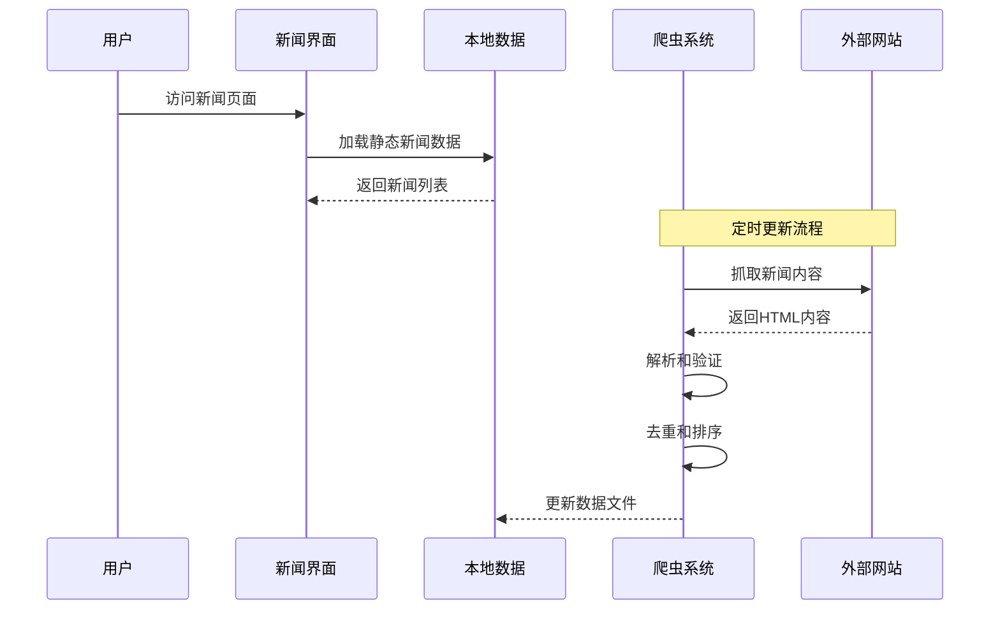

**图表来源**
- [src/data/news.ts:1-185](file://src/data/news.ts#L1-L185)
- [scripts/crawler/newsCrawler.ts:35-53](file://scripts/crawler/newsCrawler.ts#L35-L53)
- [scripts/updateData.ts:135-149](file://scripts/updateData.ts#L135-L149)

**章节来源**
- [src/types/index.ts:55-64](file://src/types/index.ts#L55-L64)
- [src/data/news.ts:1-185](file://src/data/news.ts#L1-L185)

## 架构概览

### 整体系统架构

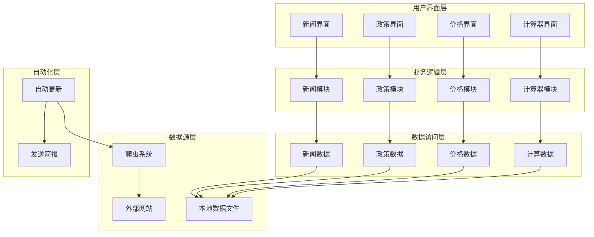

**图表来源**
- [src/App.tsx:9-14](file://src/App.tsx#L9-L14)
- [src/sections/NewsSection.tsx:1-110](file://src/sections/NewsSection.tsx#L1-L110)
- [scripts/autoUpdate.ts:18-52](file://scripts/autoUpdate.ts#L18-L52)

### 新闻数据处理流程

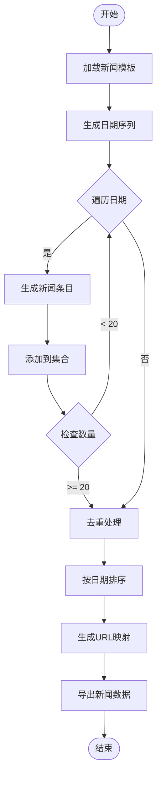

**图表来源**
- [src/data/news.ts:5-155](file://src/data/news.ts#L5-L155)

**章节来源**
- [src/App.tsx:18-59](file://src/App.tsx#L18-L59)
- [scripts/autoUpdate.ts:18-52](file://scripts/autoUpdate.ts#L18-L52)

## 详细组件分析

### 新闻爬虫系统

新闻爬虫系统是整个数据获取的核心组件，负责从多个权威网站抓取最新的碳市场新闻。

#### 爬虫架构设计

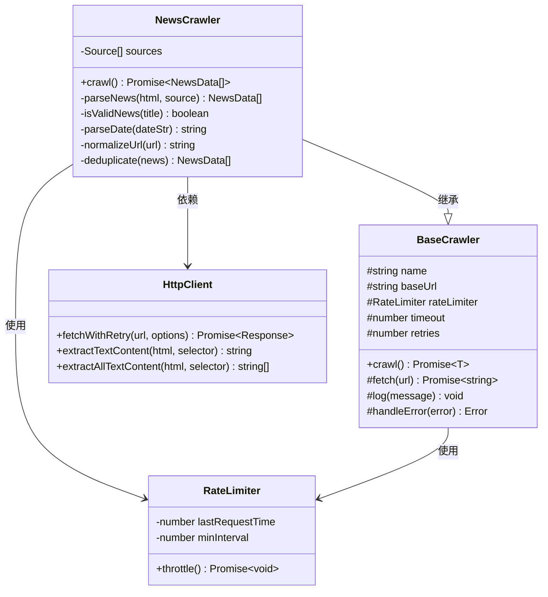

**图表来源**
- [scripts/crawler/newsCrawler.ts:17-138](file://scripts/crawler/newsCrawler.ts#L17-L138)
- [scripts/crawler/baseCrawler.ts:16-64](file://scripts/crawler/baseCrawler.ts#L16-L64)
- [scripts/utils/httpClient.ts:71-89](file://scripts/utils/httpClient.ts#L71-L89)

#### 爬虫配置参数

| 参数名称 | 默认值 | 描述 |
|---------|--------|------|
| rateLimitMs | 3000ms | 请求间隔限制，防止过于频繁的访问 |
| timeout | 15000ms | HTTP请求超时时间 |
| retries | 2次 | 请求失败时的重试次数 |
| baseUrl | 空字符串 | 基础URL前缀 |

#### 新闻解析算法

爬虫使用多模式正则表达式来解析不同格式的新闻链接：

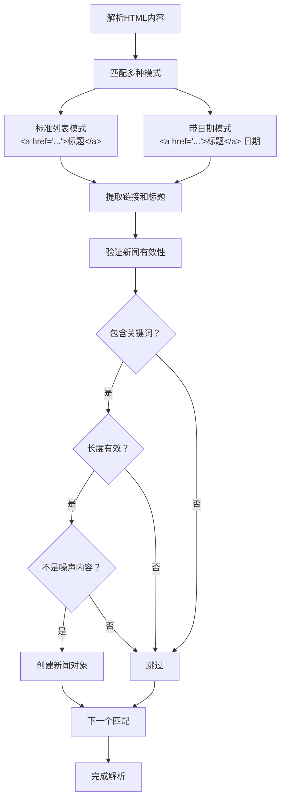

**图表来源**
- [scripts/crawler/newsCrawler.ts:58-101](file://scripts/crawler/newsCrawler.ts#L58-L101)

**章节来源**
- [scripts/crawler/newsCrawler.ts:17-138](file://scripts/crawler/newsCrawler.ts#L17-L138)
- [scripts/crawler/baseCrawler.ts:16-64](file://scripts/crawler/baseCrawler.ts#L16-L64)

### 新闻数据生成系统

本地新闻数据生成系统负责创建模拟的新闻数据，用于演示和测试目的。

#### 数据生成策略

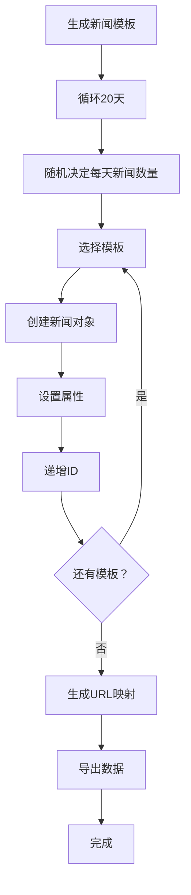

**图表来源**
- [src/data/news.ts:5-155](file://src/data/news.ts#L5-L155)

#### 新闻模板分类

系统包含20个精心设计的新闻模板，涵盖以下主题：

| 主题类别 | 数量 | 示例关键词 |
|---------|------|-----------|
| CCER交易 | 5 | CCER、交易市场、成交量 |
| 政策法规 | 8 | 方法学、政策、实施细则 |
| 地方实践 | 6 | 碳普惠、试点、城市 |
| 国际动态 | 3 | CBAM、VCS、国际市场 |

**章节来源**
- [src/data/news.ts:6-127](file://src/data/news.ts#L6-L127)

### 新闻界面展示系统

新闻界面使用React组件化架构，提供美观的新闻展示效果。

#### 组件结构设计

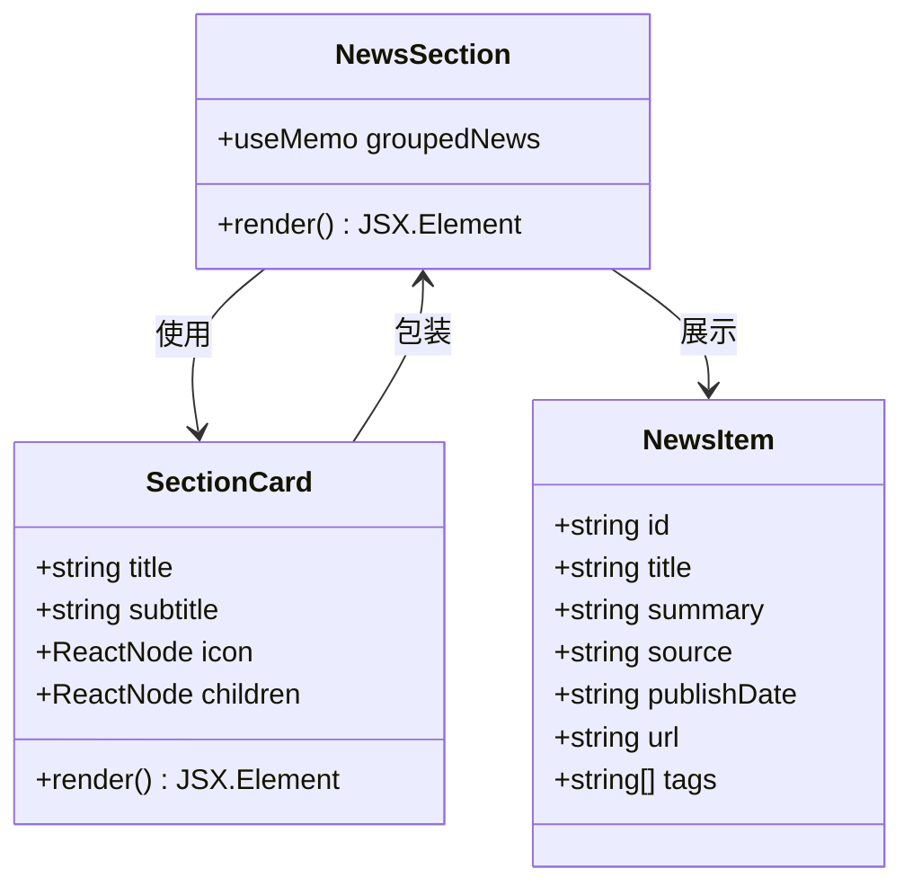

**图表来源**
- [src/sections/NewsSection.tsx:7-110](file://src/sections/NewsSection.tsx#L7-L110)
- [src/components/SectionCard.tsx:10-25](file://src/components/SectionCard.tsx#L10-L25)

#### 响应式布局设计

界面采用Flexbox布局，支持不同屏幕尺寸的自适应：

| 设备类型 | 屏幕宽度 | 布局特点 |
|---------|----------|---------|
| 移动设备 | < 768px | 单列布局，紧凑间距 |
| 平板设备 | 768px - 1024px | 双列布局，适中间距 |
| 桌面设备 | > 1024px | 三列布局，宽松间距 |

**章节来源**
- [src/sections/NewsSection.tsx:1-110](file://src/sections/NewsSection.tsx#L1-L110)
- [src/components/SectionCard.tsx:1-26](file://src/components/SectionCard.tsx#L1-L26)

### 自动化更新系统

系统提供完整的自动化更新机制，包括数据抓取、处理和简报发送。

#### 更新流程架构

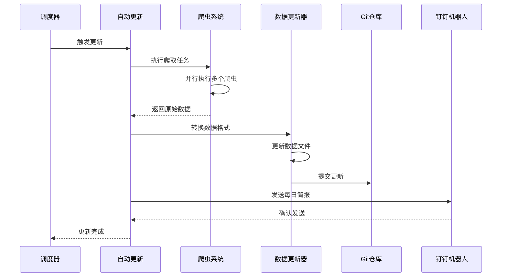

**图表来源**
- [scripts/autoUpdate.ts:18-52](file://scripts/autoUpdate.ts#L18-L52)
- [scripts/updateData.ts:135-149](file://scripts/updateData.ts#L135-L149)

#### 数据更新策略

| 数据类型 | 更新频率 | 更新方式 | 备注 |
|---------|----------|----------|------|
| 碳价数据 | 每日 | 爬虫抓取 | 包含CEA和CCER价格 |
| 政策数据 | 每日 | 爬虫抓取 | 政策和方法学 |
| 新闻数据 | 每日 | 爬虫抓取 | 碳市场相关新闻 |
| 本地数据 | 每日 | 文件更新 | 静态数据文件 |

**章节来源**
- [scripts/autoUpdate.ts:18-52](file://scripts/autoUpdate.ts#L18-L52)
- [scripts/updateData.ts:135-149](file://scripts/updateData.ts#L135-L149)

## 依赖关系分析

### 核心依赖关系

```mermaid
graph TB
subgraph "React生态系统"
React[react@19.2.4]
ReactDOM[react-dom@19.2.4]
Lucide[Lucide React@0.577.0]
end
subgraph "开发工具"
Vite[vite@8.0.1]
TS[TypeScript~5.9.3]
Tailwind[tailwindcss@4.2.2]
end
subgraph "第三方库"
DayJS[dayjs@1.11.20]
Recharts[recharts@3.8.0]
end
subgraph "爬虫依赖"
Fetch[fetchWithRetry]
RateLimiter[RateLimiter]
end
NewsSection --> React
NewsSection --> Lucide
NewsSection --> DayJS
NewsCrawler --> Fetch
NewsCrawler --> RateLimiter
App --> Vite
App --> TS
App --> Tailwind
```

**图表来源**
- [package.json:15-38](file://package.json#L15-L38)
- [src/sections/NewsSection.tsx:1-110](file://src/sections/NewsSection.tsx#L1-L110)

### 数据依赖链

系统中的数据流遵循严格的依赖关系：

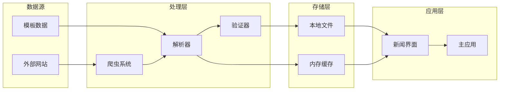

**图表来源**
- [scripts/crawler/index.ts:25-56](file://scripts/crawler/index.ts#L25-L56)
- [src/data/news.ts:1-185](file://src/data/news.ts#L1-L185)

**章节来源**
- [package.json:15-38](file://package.json#L15-L38)
- [scripts/crawler/index.ts:25-56](file://scripts/crawler/index.ts#L25-L56)

## 性能考虑

### 爬虫性能优化

系统在爬虫性能方面采用了多项优化策略：

1. **并发控制**：使用Promise.allSettled并行执行多个爬虫任务
2. **请求限流**：RateLimiter确保合理的请求频率
3. **智能重试**：指数退避策略减少服务器压力
4. **数据去重**：高效的去重算法避免重复处理

### 内存管理


**图表来源**
- [scripts/crawler/newsCrawler.ts:35-53](file://scripts/crawler/newsCrawler.ts#L35-L53)

### 缓存策略

系统采用多层次缓存策略：

| 缓存层级 | 类型 | 存储位置 | 生命周期 |
|---------|------|----------|----------|
| 应用缓存 | 内存缓存 | 浏览器内存 | 页面会话 |
| 本地缓存 | 文件缓存 | 本地文件 | 持久化 |
| 服务器缓存 | CDN缓存 | 服务器端 | 可配置 |

## 故障排除指南

### 常见问题及解决方案

#### 爬虫抓取失败

**问题症状**：新闻数据无法更新或显示为空白

**可能原因**：
1. 目标网站结构变更
2. 网络连接不稳定
3. 请求被目标网站阻止

**解决步骤**：
1. 检查网络连接状态
2. 验证目标网站可用性
3. 查看爬虫日志输出
4. 更新正则表达式模式

#### 数据去重失效

**问题症状**：新闻列表中出现重复内容

**解决步骤**：
1. 检查去重算法实现
2. 验证新闻标题和来源的唯一性
3. 调整去重键值组合

#### 性能问题

**问题症状**：页面加载缓慢或响应延迟

**优化方案**：
1. 实施数据分页加载
2. 添加懒加载机制
3. 优化图片资源
4. 减少不必要的重渲染

**章节来源**
- [scripts/crawler/newsCrawler.ts:45-47](file://scripts/crawler/newsCrawler.ts#L45-L47)
- [scripts/utils/httpClient.ts:33-66](file://scripts/utils/httpClient.ts#L33-L66)

### 调试工具

系统提供了完善的调试和监控功能：

1. **日志系统**：详细的爬虫执行日志
2. **错误处理**：优雅的异常捕获和恢复
3. **性能监控**：请求耗时统计
4. **数据验证**：爬取数据质量检查

## 结论

增强的新闻数据管理系统通过集成自动化爬虫、智能数据处理和美观的用户界面，为碳普惠信息提供了完整的技术解决方案。系统的主要优势包括：

### 技术优势
- **模块化设计**：清晰的组件分离和职责划分
- **可扩展性**：易于添加新的数据源和功能模块
- **稳定性**：完善的错误处理和容错机制
- **性能优化**：多层缓存和并发处理策略

### 功能特色
- **实时数据**：自动化更新确保信息时效性
- **智能筛选**：关键词过滤确保内容质量
- **友好界面**：直观的用户交互体验
- **跨平台支持**：响应式设计适配多种设备

### 发展前景
系统为未来的功能扩展奠定了良好的基础，可以轻松集成更多数据源、增强AI分析能力、提供个性化推荐等功能。通过持续的优化和改进，该系统将成为碳普惠信息领域的重要技术基础设施。