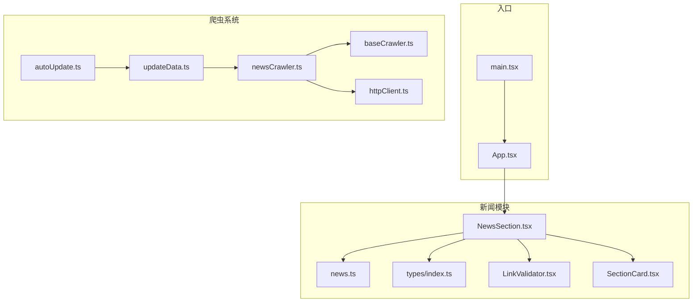
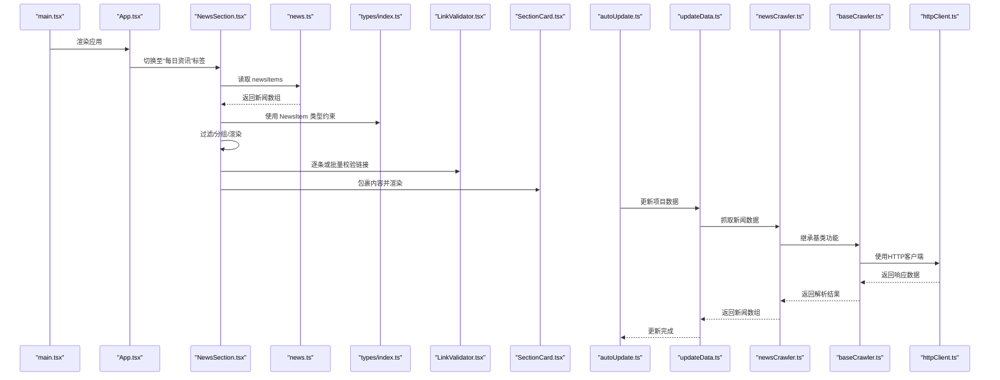
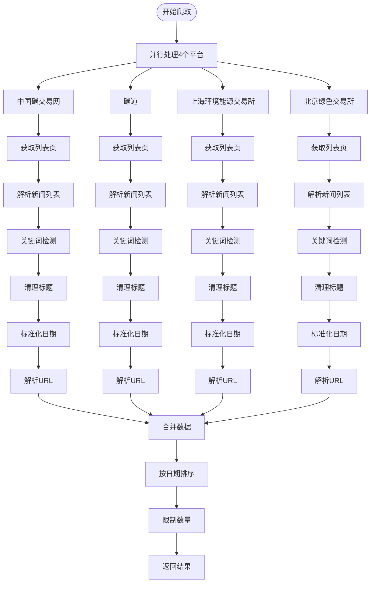
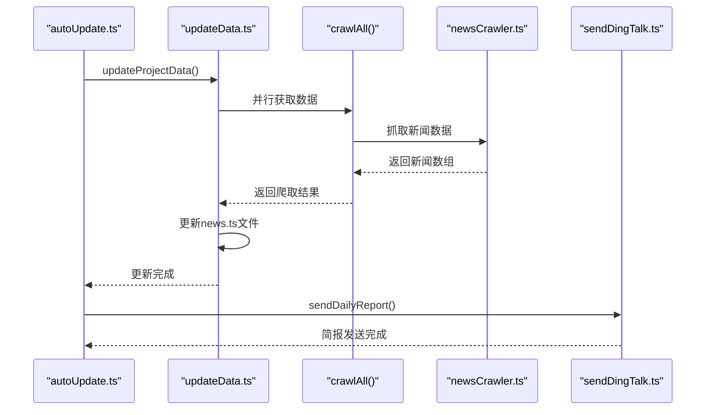
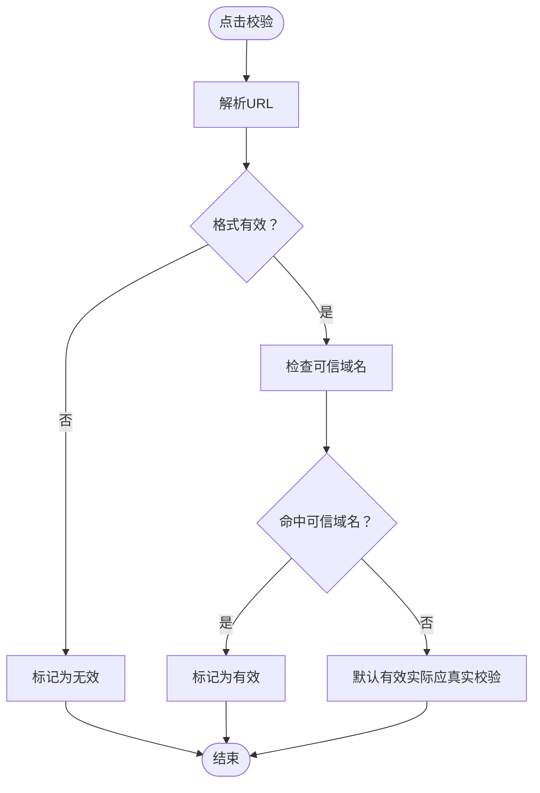
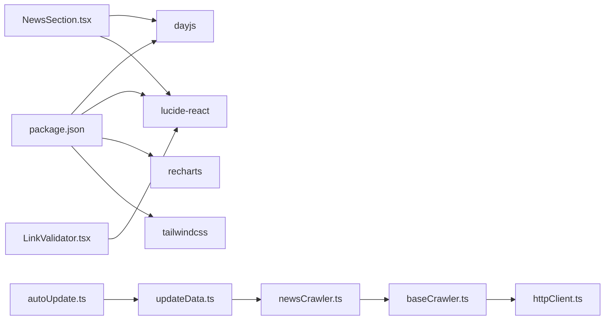

# 新闻数据管理

<cite>
**本文引用的文件**
- [news.ts](file://src/data/news.ts)
- [newsCrawler.ts](file://scripts/crawler/newsCrawler.ts)
- [baseCrawler.ts](file://scripts/crawler/baseCrawler.ts)
- [httpClient.ts](file://scripts/utils/httpClient.ts)
- [updateData.ts](file://scripts/updateData.ts)
- [autoUpdate.ts](file://scripts/autoUpdate.ts)
- [index.ts](file://src/types/index.ts)
- [NewsSection.tsx](file://src/sections/NewsSection.tsx)
- [LinkValidator.tsx](file://src/components/LinkValidator.tsx)
- [SectionCard.tsx](file://src/components/SectionCard.tsx)
- [TabFilter.tsx](file://src/components/TabFilter.tsx)
- [constants.ts](file://src/utils/constants.ts)
- [App.tsx](file://src/App.tsx)
- [main.tsx](file://src/main.tsx)
- [package.json](file://package.json)
</cite>

## 更新摘要
**变更内容**
- 新闻爬虫系统从2个源扩展到4个主要碳市场新闻平台
- 新增了复杂的关键词检测和内容过滤功能
- 实现了自动化的数据更新和简报发送流程
- 新闻数据从模拟数据转向真实爬取数据
- 增强了链接校验和内容质量控制机制

## 目录
1. [简介](#简介)
2. [项目结构](#项目结构)
3. [核心组件](#核心组件)
4. [架构总览](#架构总览)
5. [详细组件分析](#详细组件分析)
6. [依赖关系分析](#依赖关系分析)
7. [性能考量](#性能考量)
8. [故障排查指南](#故障排查指南)
9. [结论](#结论)
10. [附录](#附录)

## 简介
本文件面向"碳普惠新闻数据管理"主题，系统性梳理项目中的新闻数据结构、分类体系、内容组织与展示机制，覆盖以下方面：
- 新闻数据模型与字段定义（标题、摘要、发布时间、来源、标签等）
- 数据生成与来源映射机制
- 新闻展示与筛选流程（按日期分组、标签展示、链接校验）
- 分类逻辑、标签系统与推荐思路
- 本地化处理、多语言支持现状与扩展建议
- 内容过滤与安全校验
- 扩展方式、新增频道支持与内容聚合策略
- 自动化数据更新与简报发送流程

## 项目结构
该项目采用前端单页应用架构，围绕"政策、碳价、计算器、新闻"四大板块构建。新闻模块位于 sections 与 data 目录，配合类型定义与通用组件完成数据到界面的完整链路。新增的爬虫系统实现了从多个碳市场平台自动抓取真实新闻数据的功能。



**图表来源**
- [main.tsx:1-11](file://src/main.tsx#L1-L11)
- [App.tsx:18-52](file://src/App.tsx#L18-L52)
- [NewsSection.tsx:1-110](file://src/sections/NewsSection.tsx#L1-L110)
- [news.ts:1-109](file://src/data/news.ts#L1-L109)
- [index.ts:55-64](file://src/types/index.ts#L55-L64)
- [LinkValidator.tsx:1-348](file://src/components/LinkValidator.tsx#L1-L348)
- [SectionCard.tsx:1-25](file://src/components/SectionCard.tsx#L1-L25)
- [baseCrawler.ts:1-65](file://scripts/crawler/baseCrawler.ts#L1-L65)
- [newsCrawler.ts:1-169](file://scripts/crawler/newsCrawler.ts#L1-L169)
- [httpClient.ts:1-115](file://scripts/utils/httpClient.ts#L1-L115)
- [updateData.ts:1-138](file://scripts/updateData.ts#L1-L138)
- [autoUpdate.ts:1-53](file://scripts/autoUpdate.ts#L1-L53)

**章节来源**
- [main.tsx:1-11](file://src/main.tsx#L1-L11)
- [App.tsx:18-52](file://src/App.tsx#L18-L52)

## 核心组件
- **新闻数据模型**：定义了新闻项的字段集合，包括标识、标题、摘要、来源、发布时间、跳转链接与标签数组。
- **新闻爬虫系统**：基于基类爬虫实现，支持4个主要碳市场新闻平台的自动抓取，包含复杂的关键词检测和内容过滤功能。
- **自动化更新系统**：实现了从爬取到数据更新再到简报发送的完整自动化流程。
- **新闻展示组件**：负责日期筛选、按日分组、标签渲染、链接校验与批量校验。
- **链接校验组件**：提供单项与批量链接有效性校验，支持可信域名白名单与状态反馈。
- **通用卡片容器**：统一新闻区域的标题、副标题与内边距布局。

**章节来源**
- [index.ts:55-64](file://src/types/index.ts#L55-L64)
- [news.ts:1-109](file://src/data/news.ts#L1-L109)
- [newsCrawler.ts:18-40](file://scripts/crawler/newsCrawler.ts#L18-L40)
- [NewsSection.tsx:1-110](file://src/sections/NewsSection.tsx#L1-L110)
- [LinkValidator.tsx:1-348](file://src/components/LinkValidator.tsx#L1-L348)
- [SectionCard.tsx:1-25](file://src/components/SectionCard.tsx#L1-L25)

## 架构总览
新闻模块从数据层到视图层的调用链如下：



**图表来源**
- [main.tsx:6-10](file://src/main.tsx#L6-L10)
- [App.tsx:47-51](file://src/App.tsx#L47-L51)
- [NewsSection.tsx:5,24-45](file://src/sections/NewsSection.tsx#L5,L24-L45)
- [news.ts:184](file://src/data/news.ts#L184)
- [index.ts:55-64](file://src/types/index.ts#L55-L64)
- [LinkValidator.tsx:207-267](file://src/components/LinkValidator.tsx#L207-L267)
- [SectionCard.tsx:10-24](file://src/components/SectionCard.tsx#L10-L24)
- [autoUpdate.ts:18-52](file://scripts/autoUpdate.ts#L18-L52)
- [updateData.ts:117-138](file://scripts/updateData.ts#L117-L138)
- [newsCrawler.ts:53-70](file://scripts/crawler/newsCrawler.ts#L53-L70)
- [baseCrawler.ts:34-48](file://scripts/crawler/baseCrawler.ts#L34-L48)
- [httpClient.ts:26-66](file://scripts/utils/httpClient.ts#L26-L66)

## 详细组件分析

### 新闻数据模型与字段定义
- **字段清单**
  - id：唯一标识符
  - title：新闻标题
  - summary：摘要
  - source：来源媒体/机构
  - publishDate：发布日期（字符串格式）
  - url：外链地址
  - tags：标签数组
- **设计要点**
  - 使用 TypeScript 接口确保类型安全
  - 发布日期以字符串存储，便于前端排序与分组
  - 标签用于快速分类与检索
  - 支持从真实爬取数据中动态生成标签

**章节来源**
- [index.ts:55-64](file://src/types/index.ts#L55-L64)

### 新闻爬虫系统与数据获取机制
- **爬虫平台扩展**
  - 从2个源扩展到4个主要碳市场新闻平台
  - 新增平台：中国碳交易网、碳道、上海环境能源交易所、北京绿色交易所
  - 每个平台都有对应的URL配置和解析规则
- **数据抓取流程**
  - 并行抓取所有平台数据，提高效率
  - 每个平台独立处理，失败不影响其他平台
  - 支持请求重试和限流，避免被反爬虫机制拦截
- **内容解析与过滤**
  - 支持多种新闻列表模式的正则表达式解析
  - 关键词检测：包含"碳"、"CEA"、"CCER"、"碳市场"等关键词
  - 长度验证：标题长度在15-120字符之间
  - 噪音过滤：排除登录、注册、广告等无关内容
- **数据标准化**
  - 统一日期格式为YYYY-MM-DD
  - 解析相对URL为绝对URL
  - 清理HTML实体和多余空白字符



**图表来源**
- [newsCrawler.ts:53-70](file://scripts/crawler/newsCrawler.ts#L53-L70)
- [newsCrawler.ts:75-108](file://scripts/crawler/newsCrawler.ts#L75-L108)
- [newsCrawler.ts:113-120](file://scripts/crawler/newsCrawler.ts#L113-L120)
- [newsCrawler.ts:138-144](file://scripts/crawler/newsCrawler.ts#L138-L144)
- [newsCrawler.ts:149-154](file://scripts/crawler/newsCrawler.ts#L149-L154)

**章节来源**
- [newsCrawler.ts:18-40](file://scripts/crawler/newsCrawler.ts#L18-L40)
- [newsCrawler.ts:53-162](file://scripts/crawler/newsCrawler.ts#L53-L162)

### 自动化数据更新与简报系统
- **更新流程**
  - 通过爬虫获取最新新闻数据
  - 更新项目中的news.ts文件
  - 自动提交Git更新
  - 生成并发送每日简报到钉钉
- **并行处理**
  - 政策和新闻数据并行更新
  - 提高整体更新效率
  - 失败不影响其他数据类型的更新
- **简报功能**
  - 自动统计当日数据变化
  - 发送包含关键指标的简报
  - 支持失败重试机制



**图表来源**
- [autoUpdate.ts:18-52](file://scripts/autoUpdate.ts#L18-L52)
- [updateData.ts:117-138](file://scripts/updateData.ts#L117-L138)
- [index.ts:25-56](file://scripts/crawler/index.ts#L25-L56)

**章节来源**
- [autoUpdate.ts:1-53](file://scripts/autoUpdate.ts#L1-L53)
- [updateData.ts:67-112](file://scripts/updateData.ts#L67-L112)

### 新闻展示与筛选流程
- **日期筛选**
  - 生成最近20天的日期选项，支持"全部"与具体日期切换
  - 使用 dayjs 对日期进行格式化与比较
- **分组与排序**
  - 按 publishDate 分组，按日期降序排列
- **标签渲染**
  - 每条新闻展示其标签，便于快速识别主题
- **链接校验**
  - 单项校验：点击按钮触发，显示状态与提示
  - 批量校验：对当前筛选结果中的所有链接进行顺序校验，展示进度与统计

```mermaid
sequenceDiagram
participant UI as "NewsSection.tsx"
participant Dayjs as "dayjs"
participant Filter as "筛选逻辑"
participant Group as "分组逻辑"
participant Link as "LinkValidator.tsx"
UI->>Dayjs : 生成日期选项
UI->>Filter : 根据选择的日期过滤
Filter-->>UI : 返回过滤后的新闻列表
UI->>Group : 按publishDate分组并降序
Group-->>UI : 返回分组结果
UI->>Link : 逐条或批量校验url
Link-->>UI : 返回校验结果
```

**图表来源**
- [NewsSection.tsx:12-45](file://src/sections/NewsSection.tsx#L12-L45)
- [NewsSection.tsx:47-61](file://src/sections/NewsSection.tsx#L47-L61)
- [LinkValidator.tsx:105-110](file://src/components/LinkValidator.tsx#L105-L110)
- [LinkValidator.tsx:212-225](file://src/components/LinkValidator.tsx#L212-L225)

**章节来源**
- [NewsSection.tsx:1-110](file://src/sections/NewsSection.tsx#L1-L110)

### 链接校验与内容过滤
- **可信域名白名单**
  - 预置一组可信域名，用于判断来源可靠性
  - 支持主域名与子域名匹配
  - 包含政府官方网站和权威媒体域名
- **校验流程**
  - 格式校验：确保URL以 http/https 开头
  - 域名匹配：命中可信列表则标记为有效
  - 状态反馈：提供"待校验/校验中/已校验/链接异常"等状态
- **批量校验**
  - 提供进度条与统计信息，便于快速评估整体质量
- **内容质量控制**
  - 政策链接专用校验，更严格的验证规则
  - 政府官方域名识别和路径内容检查
  - 政策相关内容路径模式匹配



**图表来源**
- [LinkValidator.tsx:19-96](file://src/components/LinkValidator.tsx#L19-L96)
- [LinkValidator.tsx:207-267](file://src/components/LinkValidator.tsx#L207-L267)

**章节来源**
- [LinkValidator.tsx:1-348](file://src/components/LinkValidator.tsx#L1-L348)

### 分类逻辑、标签系统与推荐思路
- **分类与标签**
  - 当前使用 tags 字段作为轻量分类，如"碳普惠"、"CCER"、"方法学"等
  - 展示时以标签形式呈现，便于用户快速识别主题
  - 支持动态标签生成和查询功能
- **推荐算法思路（概念性）**
  - 基于标签共现矩阵与用户行为序列，构建简单协同过滤
  - 结合时间衰减权重，优先推荐近期热点与高相似度内容
  - 可引入 TF-IDF 或词向量相似度进行语义匹配
- **注意事项**
  - 当前未实现真正的推荐引擎，上述为扩展建议

**章节来源**
- [news.ts:11,17,23,29,35,47,53,59,65,71,77,83,89,95](file://src/data/news.ts#L11,L17,L23,L29,L35,L47,L53,L59,L65,L71,L77,L83,L89,L95)

### 本地化处理与多语言支持
- **现状**
  - 日期显示采用中文格式（例如"MM月DD日"），符合中文用户的阅读习惯
  - 文案与标签多为中文，未见国际化资源文件
- **建议**
  - 引入 i18n 库（如 react-i18next），将文案与日期格式化逻辑抽离为翻译键
  - 为不同语言版本提供独立的标签与来源映射配置
  - 保持类型定义与数据结构不变，仅替换展示层

**章节来源**
- [NewsSection.tsx:12-22](file://src/sections/NewsSection.tsx#L12-L22)
- [NewsSection.tsx:109-114](file://src/sections/NewsSection.tsx#L109-L114)

### 扩展方式、新增频道支持与内容聚合策略
- **新增频道**
  - 在 newsCrawler.ts 中的 NEWS_SOURCES 数组增加新的平台配置
  - 在类型定义中保持 NewsItem 字段一致
  - 在展示层无需改动即可继承现有筛选与校验能力
- **内容聚合**
  - 可通过外部接口拉取真实新闻，再与现有模板合并
  - 引入统一的数据适配器，屏蔽来源差异
- **数据持久化与缓存**
  - 建议引入本地缓存（如 IndexedDB 或 localStorage）保存最近一次抓取结果
  - 设置过期策略与增量更新机制，减少重复抓取
- **爬虫扩展**
  - 基于 BaseCrawler 类扩展新的爬虫类型
  - 支持自定义解析规则和过滤条件
  - 实现统一的错误处理和重试机制

**章节来源**
- [newsCrawler.ts:18-40](file://scripts/crawler/newsCrawler.ts#L18-L40)
- [baseCrawler.ts:16-34](file://scripts/crawler/baseCrawler.ts#L16-L34)
- [index.ts:55-64](file://src/types/index.ts#L55-L64)

## 依赖关系分析
- **外部依赖**
  - dayjs：日期处理与格式化
  - lucide-react：图标库
  - recharts：图表（用于碳价趋势等）
  - tailwindcss：样式框架
- **内部依赖**
  - App.tsx 依赖各板块组件
  - NewsSection.tsx 依赖 news.ts、LinkValidator.tsx、SectionCard.tsx
  - LinkValidator.tsx 依赖 lucide-react 与自身状态管理
  - 爬虫系统依赖基类爬虫和HTTP客户端工具



**图表来源**
- [package.json:12-19](file://package.json#L12-L19)
- [NewsSection.tsx:1-110](file://src/sections/NewsSection.tsx#L1-L110)
- [LinkValidator.tsx:1-348](file://src/components/LinkValidator.tsx#L1-L348)
- [baseCrawler.ts:1-65](file://scripts/crawler/baseCrawler.ts#L1-L65)
- [newsCrawler.ts:1-169](file://scripts/crawler/newsCrawler.ts#L1-L169)
- [httpClient.ts:1-115](file://scripts/utils/httpClient.ts#L1-L115)
- [updateData.ts:1-138](file://scripts/updateData.ts#L1-L138)
- [autoUpdate.ts:1-53](file://scripts/autoUpdate.ts#L1-L53)

**章节来源**
- [package.json:12-19](file://package.json#L12-L19)

## 性能考量
- **渲染优化**
  - 使用 useMemo 缓存日期选项、过滤结果与分组结果，避免重复计算
  - 批量校验时使用进度条与分步执行，降低阻塞
- **数据规模**
  - 当前生成约20条新闻，性能压力较小；若接入真实抓取，建议分页与懒加载
- **网络与安全**
  - 链接校验为前端模拟，生产环境需后端 API 实现真实校验
  - 对外链访问应设置合理的超时与重试策略
- **爬虫性能**
  - 并行处理多个平台，提高数据获取效率
  - 限流机制避免被目标网站反爬虫机制拦截
  - 请求重试机制提高数据获取成功率

**章节来源**
- [NewsSection.tsx:12-45](file://src/sections/NewsSection.tsx#L12-L45)
- [LinkValidator.tsx:212-225](file://src/components/LinkValidator.tsx#L212-L225)
- [newsCrawler.ts:42-51](file://scripts/crawler/newsCrawler.ts#L42-L51)
- [httpClient.ts:26-66](file://scripts/utils/httpClient.ts#L26-L66)

## 故障排查指南
- **新闻不显示或为空**
  - 检查 news.ts 是否成功导出 newsItems
  - 确认 NewsSection.tsx 的筛选逻辑是否误选特定日期
  - 验证爬虫是否能正常访问目标网站
- **链接校验异常**
  - 确认 URL 格式是否以 http/https 开头
  - 检查可信域名白名单是否包含目标域名
  - 验证网络连接和防火墙设置
- **爬虫抓取失败**
  - 检查目标网站是否可正常访问
  - 验证爬虫的User-Agent和请求头设置
  - 查看控制台错误日志和网络请求状态
- **样式或图标问题**
  - 确认 lucide-react 与 tailwindcss 已正确安装与配置
- **性能卡顿**
  - 检查是否存在不必要的重渲染，合理使用 useMemo/useCallback
  - 验证爬虫限流设置是否过于严格

**章节来源**
- [news.ts:184](file://src/data/news.ts#L184)
- [NewsSection.tsx:24-45](file://src/sections/NewsSection.tsx#L24-L45)
- [LinkValidator.tsx:71-96](file://src/components/LinkValidator.tsx#L71-L96)
- [newsCrawler.ts:63-65](file://scripts/crawler/newsCrawler.ts#L63-L65)
- [package.json:12-19](file://package.json#L12-L19)

## 结论
本项目以清晰的模块划分实现了新闻数据的本地化生成、展示与基础校验。通过类型约束与组件化设计，具备良好的可维护性与扩展性。最新的更新引入了完整的爬虫系统，实现了从4个主要碳市场新闻平台自动抓取真实数据的功能，并建立了自动化数据更新和简报发送流程。建议后续在以下方向深化：
- 引入真实抓取与后端校验，完善内容质量保障
- 增加国际化与多语言支持
- 构建推荐系统与标签体系，提升用户体验
- 规范数据接入与缓存策略，支撑更大规模内容
- 扩展爬虫平台支持，覆盖更多碳市场相关信息源

## 附录
- **术语**
  - 新闻项：新闻数据的基本单元，包含标题、摘要、来源、发布时间、链接与标签
  - 标签：用于主题分类的关键词
  - 可信域名：经过验证的权威来源域名集合
  - 爬虫：自动抓取网页内容的程序
  - 并行处理：同时执行多个任务以提高效率
- **相关文件路径**
  - 数据模型：[types/index.ts:55-64](file://src/types/index.ts#L55-L64)
  - 新闻数据：[data/news.ts:1-109](file://src/data/news.ts#L1-L109)
  - 爬虫基类：[crawler/baseCrawler.ts:1-65](file://scripts/crawler/baseCrawler.ts#L1-L65)
  - 新闻爬虫：[crawler/newsCrawler.ts:1-169](file://scripts/crawler/newsCrawler.ts#L1-L169)
  - HTTP客户端：[utils/httpClient.ts:1-115](file://scripts/utils/httpClient.ts#L1-L115)
  - 数据更新：[updateData.ts:1-138](file://scripts/updateData.ts#L1-L138)
  - 自动更新：[autoUpdate.ts:1-53](file://scripts/autoUpdate.ts#L1-L53)
  - 展示组件：[sections/NewsSection.tsx:1-110](file://src/sections/NewsSection.tsx#L1-L110)
  - 链接校验：[components/LinkValidator.tsx:1-348](file://src/components/LinkValidator.tsx#L1-L348)
  - 通用卡片：[components/SectionCard.tsx:1-25](file://src/components/SectionCard.tsx#L1-L25)
  - 依赖声明：[package.json:12-19](file://package.json#L12-L19)