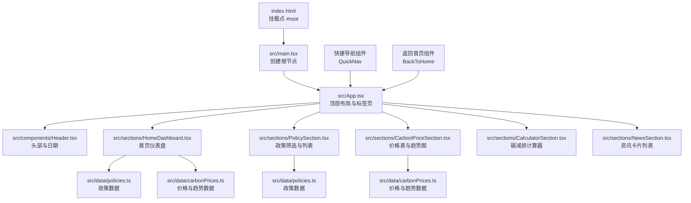
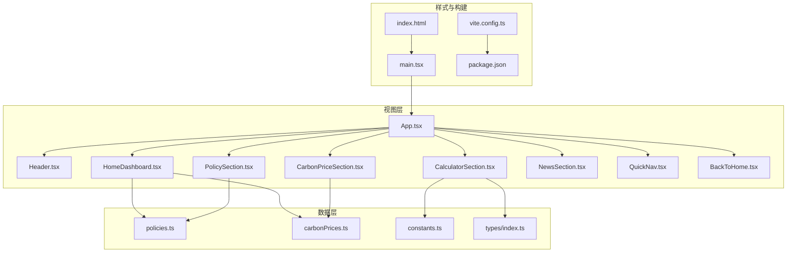
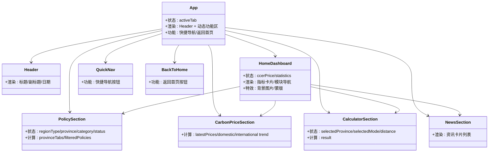
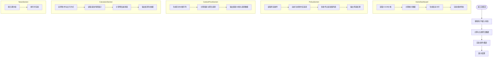
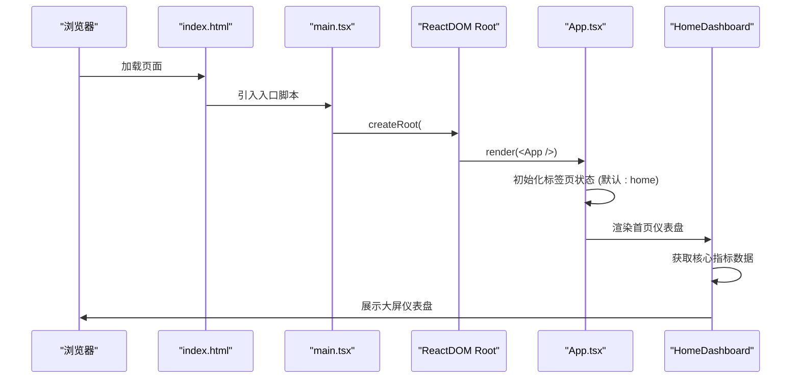
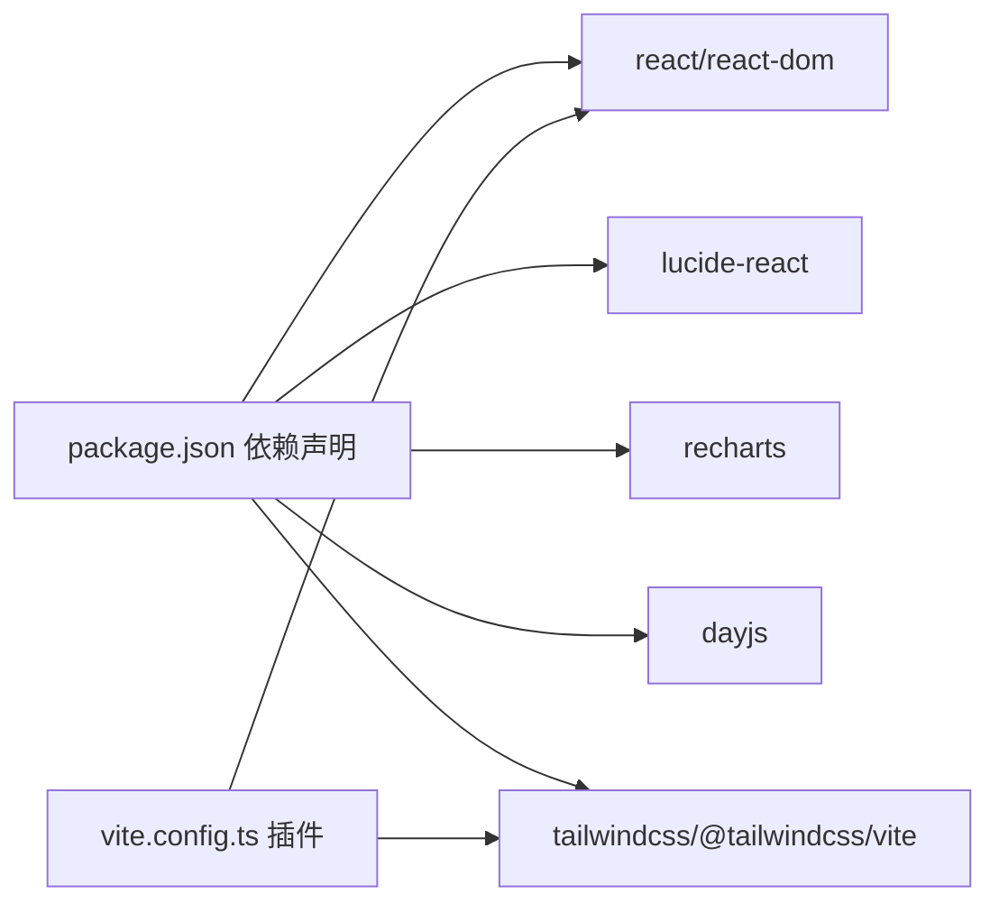

# 应用架构

<cite>
**本文引用的文件**
- [src/App.tsx](file://src/App.tsx)
- [src/main.tsx](file://src/main.tsx)
- [vite.config.ts](file://vite.config.ts)
- [package.json](file://package.json)
- [src/components/Header.tsx](file://src/components/Header.tsx)
- [src/sections/HomeDashboard.tsx](file://src/sections/HomeDashboard.tsx)
- [src/sections/PolicySection.tsx](file://src/sections/PolicySection.tsx)
- [src/sections/CarbonPriceSection.tsx](file://src/sections/CarbonPriceSection.tsx)
- [src/sections/CalculatorSection.tsx](file://src/sections/CalculatorSection.tsx)
- [src/sections/NewsSection.tsx](file://src/sections/NewsSection.tsx)
- [src/utils/constants.ts](file://src/utils/constants.ts)
- [src/data/carbonPrices.ts](file://src/data/carbonPrices.ts)
- [src/data/policies.ts](file://src/data/policies.ts)
- [src/types/index.ts](file://src/types/index.ts)
- [index.html](file://index.html)
</cite>

## 更新摘要
**变更内容**
- 新增HomeDashboard组件作为主页入口，提供大屏风格的仪表盘展示
- 重构应用导航系统，增加快捷导航和返回首页功能
- 优化标签页导航的显示逻辑，实现首页与功能页的不同布局
- 增强主页的交互性和视觉效果，提供更好的用户体验

## 目录
1. [简介](#简介)
2. [项目结构](#项目结构)
3. [核心组件](#核心组件)
4. [架构总览](#架构总览)
5. [组件详解](#组件详解)
6. [依赖关系分析](#依赖关系分析)
7. [性能与优化](#性能与优化)
8. [故障排查指南](#故障排查指南)
9. [结论](#结论)
10. [附录](#附录)

## 简介
本项目是一个基于 React + TypeScript + Vite 的前端应用，面向"碳普惠信息代理"业务场景，提供政策查询、碳价汇总、计算器与新闻资讯四大功能模块。应用采用简洁的单页应用（SPA）架构，通过顶部标签页切换不同功能区，使用 TailwindCSS 进行样式组织，并通过 Recharts 展示价格趋势图表。

**更新** 应用现已重构为以HomeDashboard为主入口的大屏展示架构，提供更加直观和现代化的用户体验。

## 项目结构
应用采用按功能域分层的目录组织方式：
- 根组件与入口：App.tsx 负责顶层布局与标签页切换；main.tsx 负责挂载根节点。
- 主页入口：HomeDashboard.tsx 提供大屏风格的首页仪表盘，展示核心指标和模块导航。
- 组件层：通用 UI 组件（如 Header、SectionCard、TabFilter、Badge、PriceChange）位于 components 目录。
- 功能区：四大板块分别位于 sections 目录，每个板块封装自身状态与子组件。
- 数据与类型：数据源位于 data 目录，类型定义位于 types 目录。
- 工具与常量：utils 目录包含常量与工具函数；components 目录包含可复用 UI 组件。
- 构建与样式：vite.config.ts 配置 React 插件与 TailwindCSS；package.json 定义脚本与依赖。

**图表来源**
- [index.html:1-14](file://index.html#L1-L14)
- [src/main.tsx:1-11](file://src/main.tsx#L1-L11)
- [src/App.tsx:1-121](file://src/App.tsx#L1-L121)
- [src/components/Header.tsx:1-28](file://src/components/Header.tsx#L1-L28)
- [src/sections/HomeDashboard.tsx:1-214](file://src/sections/HomeDashboard.tsx#L1-L214)
- [src/sections/PolicySection.tsx:1-93](file://src/sections/PolicySection.tsx#L1-L93)
- [src/sections/CarbonPriceSection.tsx:1-42](file://src/sections/CarbonPriceSection.tsx#L1-L42)
- [src/sections/CalculatorSection.tsx:1-161](file://src/sections/CalculatorSection.tsx#L1-L161)
- [src/sections/NewsSection.tsx:1-110](file://src/sections/NewsSection.tsx#L1-L110)
- [src/data/policies.ts:1-345](file://src/data/policies.ts#L1-L345)
- [src/data/carbonPrices.ts:1-103](file://src/data/carbonPrices.ts#L1-L103)

**章节来源**
- [index.html:1-14](file://index.html#L1-L14)
- [src/main.tsx:1-11](file://src/main.tsx#L1-L11)
- [src/App.tsx:1-121](file://src/App.tsx#L1-L121)

## 核心组件
- 根组件 App.tsx
  - 职责：维护顶部标签页状态，渲染 Header 与四大功能区之一；负责页面整体布局与底部版权信息。
  - 状态管理：使用 useState 管理当前激活的标签页键值；通过条件渲染在主区域展示对应功能区。
  - 路由机制：未引入外部路由库，采用"标签页切换 + 条件渲染"的轻量路由模式。
  - **更新** 新增快捷导航组件（QuickNav）和返回首页组件（BackToHome），提供更好的导航体验。
- 入口文件 main.tsx
  - 职责：创建根节点并渲染 App；引入全局样式与严格模式包装。
- 主页入口 HomeDashboard.tsx
  - 职责：提供大屏风格的首页仪表盘，展示核心指标和模块导航。
  - 状态管理：使用 useMemo 缓存 CCER 价格和统计数据，避免重复计算。
  - 功能特性：包含指标卡片、模块导航按钮、背景图片和蒙版效果。
- 组件 Header.tsx
  - 职责：展示平台标题、副标题与当前日期；使用图标与渐变背景增强视觉层级。
- 功能区组件
  - PolicySection：提供区域类型、省市区、政策类别与状态的多维筛选，动态生成省市区选项，过滤政策列表。
  - CarbonPriceSection：展示最新碳价与国内外价格趋势图，使用 Recharts 渲染折线图。
  - CalculatorSection：根据省/市方法学与出行方式计算预估碳减排量，支持距离输入与结果展示。
  - NewsSection：展示资讯卡片列表，包含标题、摘要、来源、发布时间与标签。

**章节来源**
- [src/App.tsx:1-121](file://src/App.tsx#L1-L121)
- [src/main.tsx:1-11](file://src/main.tsx#L1-L11)
- [src/sections/HomeDashboard.tsx:1-214](file://src/sections/HomeDashboard.tsx#L1-L214)
- [src/components/Header.tsx:1-28](file://src/components/Header.tsx#L1-L28)
- [src/sections/PolicySection.tsx:1-93](file://src/sections/PolicySection.tsx#L1-L93)
- [src/sections/CarbonPriceSection.tsx:1-42](file://src/sections/CarbonPriceSection.tsx#L1-L42)
- [src/sections/CalculatorSection.tsx:1-161](file://src/sections/CalculatorSection.tsx#L1-L161)
- [src/sections/NewsSection.tsx:1-110](file://src/sections/NewsSection.tsx#L1-L110)

## 架构总览
应用采用"组件驱动 + 数据驱动"的架构风格，现已升级为以HomeDashboard为主入口的大屏展示架构：
- 视图层：以函数式组件为主，配合 React Hooks 管理本地状态与派生数据。
- 数据层：通过 data 目录的数据源与 utils 常量提供静态或动态生成的数据；类型定义集中于 types 目录。
- 样式层：TailwindCSS 提供原子化样式，统一主题色与间距体系。
- 构建层：Vite 提供开发服务器与生产构建，集成 React 插件与 TailwindCSS 插件。

**图表来源**
- [src/App.tsx:1-121](file://src/App.tsx#L1-L121)
- [src/main.tsx:1-11](file://src/main.tsx#L1-L11)
- [src/sections/HomeDashboard.tsx:1-214](file://src/sections/HomeDashboard.tsx#L1-L214)
- [src/components/Header.tsx:1-28](file://src/components/Header.tsx#L1-L28)
- [src/sections/PolicySection.tsx:1-93](file://src/sections/PolicySection.tsx#L1-L93)
- [src/sections/CarbonPriceSection.tsx:1-42](file://src/sections/CarbonPriceSection.tsx#L1-L42)
- [src/sections/CalculatorSection.tsx:1-161](file://src/sections/CalculatorSection.tsx#L1-L161)
- [src/sections/NewsSection.tsx:1-110](file://src/sections/NewsSection.tsx#L1-L110)
- [src/data/policies.ts:1-345](file://src/data/policies.ts#L1-L345)
- [src/data/carbonPrices.ts:1-103](file://src/data/carbonPrices.ts#L1-L103)
- [src/utils/constants.ts:1-44](file://src/utils/constants.ts#L1-L44)
- [src/types/index.ts:1-65](file://src/types/index.ts#L1-L65)
- [index.html:1-14](file://index.html#L1-L14)
- [vite.config.ts:1-8](file://vite.config.ts#L1-L8)
- [package.json:1-40](file://package.json#L1-L40)

## 组件详解

### 组件树结构与职责
- App.tsx
  - 管理顶部导航栏与主内容区的标签页切换。
  - 条件渲染四大功能区之一，保证单一职责与清晰的边界。
  - **更新** 新增快捷导航组件（QuickNav）和返回首页组件（BackToHome），提供更好的导航体验。
- Header.tsx
  - 负责平台标识、副标题与当前日期显示，使用图标与渐变背景提升品牌感。
- HomeDashboard.tsx
  - **新增** 提供大屏风格的首页仪表盘，展示核心指标和模块导航。
  - 包含指标卡片组件（MetricCard）和模块导航按钮（ModuleButton）。
  - 使用背景图片和蒙版效果营造视觉冲击力。
- PolicySection.tsx
  - 维护筛选状态（区域类型、省市区、类别、状态），使用 useMemo 优化筛选逻辑与省市区选项生成。
  - 将筛选结果映射为 PolicyCard 列表，无匹配时提示空态。
- CarbonPriceSection.tsx
  - 使用 useMemo 缓存最新价格与趋势数据，避免重复计算。
  - 通过 PriceTable 与 PriceTrendChart 分别展示价格表与两条趋势图。
- CalculatorSection.tsx
  - 维护省/市选择、出行方式与距离输入，使用 useMemo 计算预估减排量。
  - 结果区域展示吨 CO₂ 与千克 CO₂ 的换算与计算依据。
- NewsSection.tsx
  - 直接消费 news 数据源，渲染卡片列表，包含链接跳转与标签展示。

**图表来源**
- [src/App.tsx:1-121](file://src/App.tsx#L1-L121)
- [src/components/Header.tsx:1-28](file://src/components/Header.tsx#L1-L28)
- [src/sections/HomeDashboard.tsx:1-214](file://src/sections/HomeDashboard.tsx#L1-L214)
- [src/sections/PolicySection.tsx:1-93](file://src/sections/PolicySection.tsx#L1-L93)
- [src/sections/CarbonPriceSection.tsx:1-42](file://src/sections/CarbonPriceSection.tsx#L1-L42)
- [src/sections/CalculatorSection.tsx:1-161](file://src/sections/CalculatorSection.tsx#L1-L161)
- [src/sections/NewsSection.tsx:1-110](file://src/sections/NewsSection.tsx#L1-L110)

**章节来源**
- [src/App.tsx:1-121](file://src/App.tsx#L1-L121)
- [src/components/Header.tsx:1-28](file://src/components/Header.tsx#L1-L28)
- [src/sections/HomeDashboard.tsx:1-214](file://src/sections/HomeDashboard.tsx#L1-L214)
- [src/sections/PolicySection.tsx:1-93](file://src/sections/PolicySection.tsx#L1-L93)
- [src/sections/CarbonPriceSection.tsx:1-42](file://src/sections/CarbonPriceSection.tsx#L1-L42)
- [src/sections/CalculatorSection.tsx:1-161](file://src/sections/CalculatorSection.tsx#L1-L161)
- [src/sections/NewsSection.tsx:1-110](file://src/sections/NewsSection.tsx#L1-L110)

### 数据流向与处理逻辑
- 首页仪表盘流程（HomeDashboard）
  - 输入：政策数据、碳价数据。
  - 处理：使用 useMemo 缓存 CCER 价格和统计数据；计算政策数量、方法学数量和已落地城市数。
  - 输出：核心指标卡片和模块导航按钮。
- 政策筛选流程（PolicySection）
  - 输入：区域类型、省市区、类别、状态。
  - 处理：根据区域类型动态生成省市区选项；对政策数组进行多条件过滤。
  - 输出：筛选后的政策列表与统计信息。
- 碳价与趋势流程（CarbonPriceSection）
  - 输入：产品元数据与时间范围。
  - 处理：生成历史价格序列与涨跌；按市场聚合趋势点。
  - 输出：最新价格表与两条趋势图数据。
- 计算器流程（CalculatorSection）
  - 输入：省/市、出行方式、距离。
  - 处理：查找方法学与基准/情景因子；计算预估减排量。
  - 输出：吨与千克 CO₂ 的结果与计算依据。
- 新闻流程（NewsSection）
  - 输入：新闻条目集合。
  - 处理：按日期分组并排序；渲染卡片列表。
  - 输出：带链接与标签的资讯卡片。

**图表来源**
- [src/sections/HomeDashboard.tsx:1-214](file://src/sections/HomeDashboard.tsx#L1-L214)
- [src/sections/PolicySection.tsx:1-93](file://src/sections/PolicySection.tsx#L1-L93)
- [src/data/carbonPrices.ts:1-103](file://src/data/carbonPrices.ts#L1-L103)
- [src/sections/CalculatorSection.tsx:1-161](file://src/sections/CalculatorSection.tsx#L1-L161)
- [src/sections/NewsSection.tsx:1-110](file://src/sections/NewsSection.tsx#L1-L110)

**章节来源**
- [src/sections/HomeDashboard.tsx:1-214](file://src/sections/HomeDashboard.tsx#L1-L214)
- [src/sections/PolicySection.tsx:1-93](file://src/sections/PolicySection.tsx#L1-L93)
- [src/data/carbonPrices.ts:1-103](file://src/data/carbonPrices.ts#L1-L103)
- [src/sections/CalculatorSection.tsx:1-161](file://src/sections/CalculatorSection.tsx#L1-L161)
- [src/sections/NewsSection.tsx:1-110](file://src/sections/NewsSection.tsx#L1-L110)

### 启动流程图
应用从 index.html 的 #root 挂载点开始，通过 main.tsx 创建根节点并渲染 App；App 再渲染 Header 与当前激活的功能区。**更新** 现在默认进入 HomeDashboard 作为主页入口。

**图表来源**
- [index.html:1-14](file://index.html#L1-L14)
- [src/main.tsx:1-11](file://src/main.tsx#L1-L11)
- [src/App.tsx:1-121](file://src/App.tsx#L1-L121)
- [src/sections/HomeDashboard.tsx:1-214](file://src/sections/HomeDashboard.tsx#L1-L214)

**章节来源**
- [index.html:1-14](file://index.html#L1-L14)
- [src/main.tsx:1-11](file://src/main.tsx#L1-L11)
- [src/App.tsx:1-121](file://src/App.tsx#L1-L121)
- [src/sections/HomeDashboard.tsx:1-214](file://src/sections/HomeDashboard.tsx#L1-L214)

## 依赖关系分析
- 组件间依赖
  - App.tsx 依赖 Header、HomeDashboard 与四大功能区组件；功能区内部再依赖数据源与类型定义。
  - HomeDashboard 依赖 policies.ts 和 carbonPrices.ts；其他功能区依赖相应的数据源。
  - **更新** App.tsx 新增 QuickNav 和 BackToHome 组件的依赖关系。
- 外部依赖
  - React 与 React DOM：提供组件模型与渲染能力。
  - lucide-react：提供图标资源。
  - recharts：用于价格趋势图绘制。
  - dayjs：用于日期格式化。
  - TailwindCSS 与 @tailwindcss/vite：提供样式与构建插件。
- 构建与开发
  - Vite 提供开发服务器与生产构建；@vitejs/plugin-react 与 @tailwindcss/vite 集成到构建链路。

**图表来源**
- [package.json:1-40](file://package.json#L1-L40)
- [vite.config.ts:1-8](file://vite.config.ts#L1-L8)

**章节来源**
- [package.json:1-40](file://package.json#L1-L40)
- [vite.config.ts:1-8](file://vite.config.ts#L1-L8)

## 性能与优化
- 状态与计算优化
  - 使用 useMemo 缓存昂贵计算（如省市区选项、筛选结果、最新价格与趋势数据、计算器结果、CCER 价格和统计数据），减少重复计算与重渲染。
  - 在 PolicySection 中，先按区域类型过滤，再提取唯一省市区，避免每次渲染都全量扫描。
  - **更新** HomeDashboard 使用 useMemo 缓存核心指标数据，避免重复计算。
- 图表与渲染
  - CarbonPriceSection 对趋势数据进行聚合与缓存，降低 Recharts 渲染压力。
  - **更新** HomeDashboard 的指标卡片使用 CSS 过渡动画，提升交互体验。
- 构建与打包
  - Vite 默认启用 React 插件，提供快速热更新与生产构建；TailwindCSS 插件按需生成样式。
  - 建议在生产环境开启压缩与资源内联策略（如 terser 与 cssnano），并利用浏览器缓存策略提升二次加载性能。
- 代码分割与懒加载
  - 当前采用条件渲染而非路由懒加载；若未来功能区复杂度上升，可考虑使用 React.lazy 与 Suspense 对四大功能区进行懒加载，以减小首屏体积。
- 类型安全与开发体验
  - TypeScript 与 ESLint 配置确保类型检查与代码质量；建议在生产构建中启用类型检查，避免运行期错误。

[本节为通用性能指导，不直接分析具体文件，故无"章节来源"]

## 故障排查指南
- 页面空白或组件不渲染
  - 检查 index.html 中 #root 是否存在且 main.tsx 是否正确挂载。
  - 确认 App.tsx 的标签页状态初始化是否正确，避免条件渲染分支缺失。
  - **更新** 检查 HomeDashboard 组件的依赖数据是否正确加载。
- 数据不显示或筛选异常
  - 检查数据源文件是否导出完整数据（如 policies.ts、carbonPrices.ts）。
  - 确认筛选条件与常量定义一致（如 REGION_TYPES、PROVINCES、POLICY_CATEGORIES、POLICY_STATUS）。
  - **更新** 检查 HomeDashboard 的指标计算逻辑是否正确。
- 图表渲染问题
  - 确保传入 Recharts 的数据格式与键名与组件期望一致；检查趋势数据聚合逻辑。
- 构建失败或样式异常
  - 确认 Vite 配置已启用 React 与 TailwindCSS 插件；检查 TailwindCSS 版本与 @tailwindcss/vite 的兼容性。
- 开发服务器无法热更新
  - 检查 Vite 插件配置与网络代理设置；确认端口未被占用。
- **新增** 导航问题
  - 检查 App.tsx 中的标签页状态管理是否正常。
  - 确认快捷导航组件（QuickNav）和返回首页组件（BackToHome）的事件处理是否正确。

**章节来源**
- [index.html:1-14](file://index.html#L1-L14)
- [src/main.tsx:1-11](file://src/main.tsx#L1-L11)
- [src/App.tsx:1-121](file://src/App.tsx#L1-L121)
- [src/sections/HomeDashboard.tsx:1-214](file://src/sections/HomeDashboard.tsx#L1-L214)
- [src/sections/PolicySection.tsx:1-93](file://src/sections/PolicySection.tsx#L1-L93)
- [src/data/carbonPrices.ts:1-103](file://src/data/carbonPrices.ts#L1-L103)
- [vite.config.ts:1-8](file://vite.config.ts#L1-L8)

## 结论
该应用以简洁的组件化架构实现了四大核心功能，现已升级为以HomeDashboard为主入口的大屏展示架构。通过 useMemo 与数据聚合提升了性能，借助 Vite 与 TailwindCSS 实现了高效的开发与构建体验。新增的快捷导航和返回首页功能进一步改善了用户体验。未来可在保持现有架构稳定性的前提下，逐步引入懒加载与更细粒度的性能优化策略，进一步提升用户体验与可维护性。

[本节为总结性内容，不直接分析具体文件，故无"章节来源"]

## 附录
- 关键数据模型（简述）
  - 政策：包含区域类型、省市区、类别、状态、发布机构、摘要与链接等字段。
  - 碳价产品：包含产品 ID、名称、全称、市场（国内/国际）、单位与备注。
  - 价格记录：包含产品 ID、日期、价格与涨跌。
  - 出行方式：包含模式、标签、图标、基准因子与情景因子。
  - 新闻：包含标题、摘要、来源、发布日期、链接与标签数组。
  - **更新** 首页指标：包含 CCER 价格、政策数量、方法学数量、已落地城市数等核心指标。

**章节来源**
- [src/types/index.ts:1-65](file://src/types/index.ts#L1-L65)
- [src/sections/HomeDashboard.tsx:15-44](file://src/sections/HomeDashboard.tsx#L15-L44)