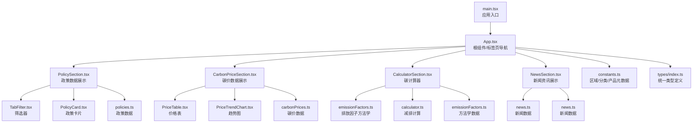
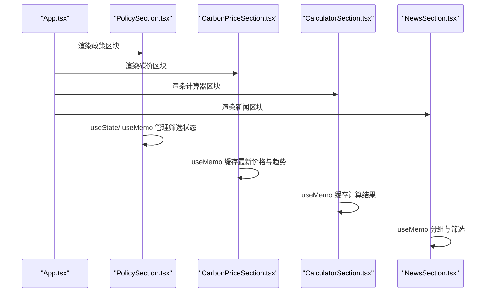
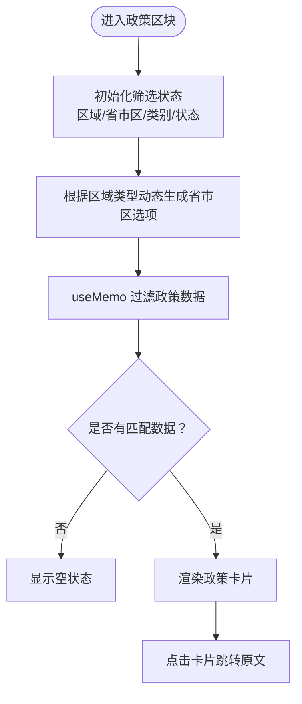
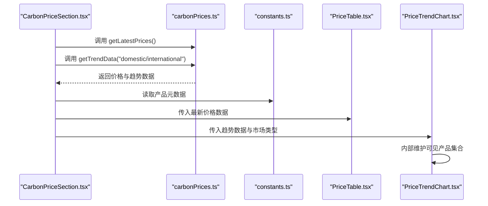
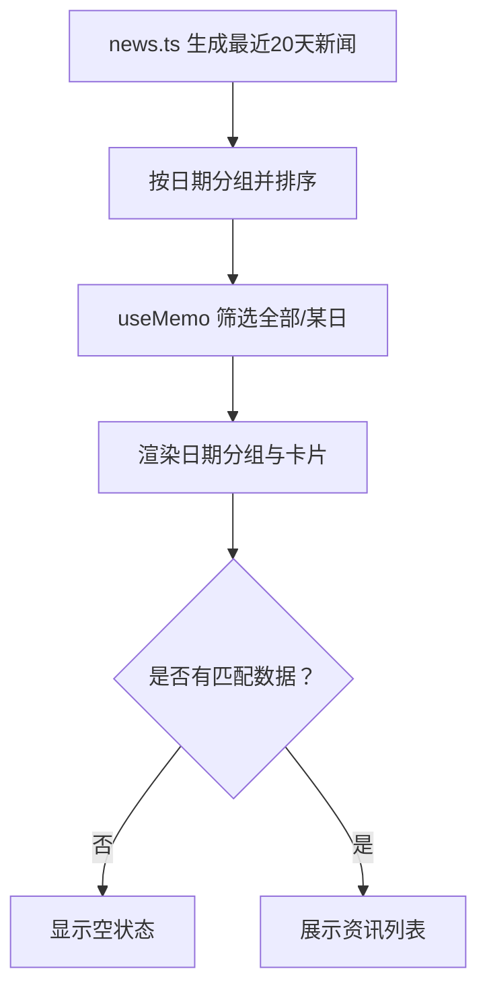
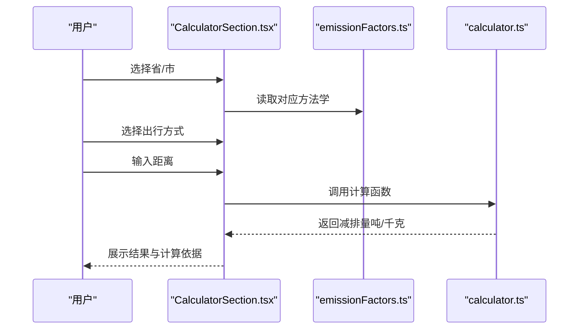
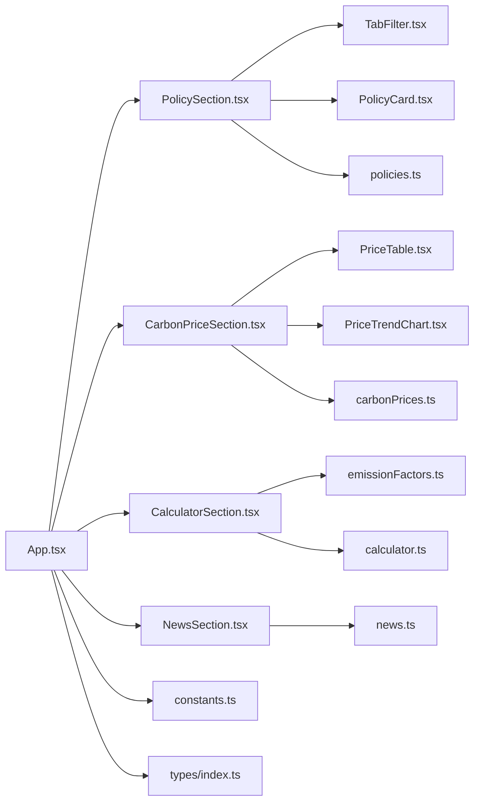

# 数据流设计

<cite>
**本文引用的文件**
- [src/App.tsx](file://src/App.tsx)
- [src/main.tsx](file://src/main.tsx)
- [src/types/index.ts](file://src/types/index.ts)
- [src/utils/constants.ts](file://src/utils/constants.ts)
- [src/utils/calculator.ts](file://src/utils/calculator.ts)
- [src/data/policies.ts](file://src/data/policies.ts)
- [src/data/carbonPrices.ts](file://src/data/carbonPrices.ts)
- [src/data/news.ts](file://src/data/news.ts)
- [src/data/emissionFactors.ts](file://src/data/emissionFactors.ts)
- [src/sections/PolicySection.tsx](file://src/sections/PolicySection.tsx)
- [src/sections/CarbonPriceSection.tsx](file://src/sections/CarbonPriceSection.tsx)
- [src/sections/NewsSection.tsx](file://src/sections/NewsSection.tsx)
- [src/sections/CalculatorSection.tsx](file://src/sections/CalculatorSection.tsx)
- [src/sections/PriceTable.tsx](file://src/sections/PriceTable.tsx)
- [src/sections/PriceTrendChart.tsx](file://src/sections/PriceTrendChart.tsx)
- [src/sections/PolicyCard.tsx](file://src/sections/PolicyCard.tsx)
- [src/components/TabFilter.tsx](file://src/components/TabFilter.tsx)
</cite>

## 目录
1. [引言](#引言)
2. [项目结构](#项目结构)
3. [核心组件](#核心组件)
4. [架构总览](#架构总览)
5. [详细组件分析](#详细组件分析)
6. [依赖关系分析](#依赖关系分析)
7. [性能考虑](#性能考虑)
8. [故障排查指南](#故障排查指南)
9. [结论](#结论)
10. [附录](#附录)

## 引言
本设计文档围绕“碳普惠信息代理”项目，系统梳理从静态数据源到组件渲染的完整数据流与状态管理策略。重点覆盖政策数据、碳价格数据与新闻数据的获取、处理、过滤与展示；解释状态提升、props传递与事件冒泡的实现；阐述组件间数据共享机制、缓存策略与性能优化；并提供数据流图、状态管理图与组件通信图，以帮助开发者与产品人员快速理解与维护系统。

## 项目结构
项目采用按功能域划分的组织方式，核心目录与职责如下：
- src/types：定义统一的数据模型与接口，确保跨模块类型一致。
- src/utils：存放常量、工具函数与通用配置，如区域类型、产品元数据与计算函数。
- src/data：存放静态数据与数据工厂函数，负责数据生成与聚合。
- src/sections：页面级功能区块，负责业务数据的筛选、聚合与子组件编排。
- src/components：通用UI组件，承担交互与展示职责。
- src/App.tsx 与 src/main.tsx：应用入口与根组件，负责路由式内容切换与全局布局。

图表来源
- [src/main.tsx:1-11](file://src/main.tsx#L1-L11)
- [src/App.tsx:18-59](file://src/App.tsx#L18-L59)
- [src/sections/PolicySection.tsx:1-89](file://src/sections/PolicySection.tsx#L1-L89)
- [src/sections/CarbonPriceSection.tsx:1-42](file://src/sections/CarbonPriceSection.tsx#L1-L42)
- [src/sections/CalculatorSection.tsx:1-161](file://src/sections/CalculatorSection.tsx#L1-L161)
- [src/sections/NewsSection.tsx:1-167](file://src/sections/NewsSection.tsx#L1-L167)
- [src/components/TabFilter.tsx:1-32](file://src/components/TabFilter.tsx#L1-L32)
- [src/sections/PriceTable.tsx:1-81](file://src/sections/PriceTable.tsx#L1-L81)
- [src/sections/PriceTrendChart.tsx:1-134](file://src/sections/PriceTrendChart.tsx#L1-L134)
- [src/sections/PolicyCard.tsx:1-68](file://src/sections/PolicyCard.tsx#L1-L68)
- [src/data/policies.ts:1-345](file://src/data/policies.ts#L1-L345)
- [src/data/carbonPrices.ts:1-103](file://src/data/carbonPrices.ts#L1-L103)
- [src/data/news.ts:1-185](file://src/data/news.ts#L1-L185)
- [src/data/emissionFactors.ts:1-103](file://src/data/emissionFactors.ts#L1-L103)
- [src/utils/constants.ts:1-44](file://src/utils/constants.ts#L1-L44)
- [src/types/index.ts:1-65](file://src/types/index.ts#L1-L65)

章节来源
- [src/App.tsx:18-59](file://src/App.tsx#L18-L59)
- [src/main.tsx:1-11](file://src/main.tsx#L1-L11)

## 核心组件
- 应用根组件：负责标签页切换与内容区渲染，使用本地状态管理当前激活标签页。
- 页面级区块：
  - 政策区块：基于区域类型、省市区、政策类别、状态进行多维筛选，支持联动更新。
  - 碳价区块：展示最新价格与国内外产品趋势，使用memo化避免重复计算。
  - 计算器区块：根据省/市方法学选择出行方式，输入距离后实时计算减排量。
  - 新闻区块：按日期分组与筛选，支持全选与按天筛选。
- 通用组件：
  - 筛选器：接收当前值与变更回调，触发父级状态更新。
  - 价格表与趋势图：消费来自数据层的聚合结果，内部维护可见产品集合。
  - 政策卡片：消费单条政策数据，展示摘要与来源链接。

章节来源
- [src/App.tsx:18-59](file://src/App.tsx#L18-L59)
- [src/sections/PolicySection.tsx:1-89](file://src/sections/PolicySection.tsx#L1-L89)
- [src/sections/CarbonPriceSection.tsx:1-42](file://src/sections/CarbonPriceSection.tsx#L1-L42)
- [src/sections/CalculatorSection.tsx:1-161](file://src/sections/CalculatorSection.tsx#L1-L161)
- [src/sections/NewsSection.tsx:1-167](file://src/sections/NewsSection.tsx#L1-L167)
- [src/components/TabFilter.tsx:1-32](file://src/components/TabFilter.tsx#L1-L32)
- [src/sections/PriceTable.tsx:1-81](file://src/sections/PriceTable.tsx#L1-L81)
- [src/sections/PriceTrendChart.tsx:1-134](file://src/sections/PriceTrendChart.tsx#L1-L134)
- [src/sections/PolicyCard.tsx:1-68](file://src/sections/PolicyCard.tsx#L1-L68)

## 架构总览
整体采用“静态数据 + 工厂函数 + 组件渲染”的轻量数据流模式：
- 静态数据源：政策、碳价、新闻、方法学均以TS模块导出或工厂函数形式提供。
- 数据工厂：碳价模块提供生成历史价格、最新价格与趋势数据的函数。
- 组件渲染：页面区块通过useState与useMemo管理与缓存状态，TabFilter等子组件通过props与回调实现事件冒泡。
- 类型约束：统一的类型定义保证跨模块数据一致性。

图表来源
- [src/App.tsx:18-59](file://src/App.tsx#L18-L59)
- [src/sections/PolicySection.tsx:1-89](file://src/sections/PolicySection.tsx#L1-L89)
- [src/sections/CarbonPriceSection.tsx:1-42](file://src/sections/CarbonPriceSection.tsx#L1-L42)
- [src/sections/CalculatorSection.tsx:1-161](file://src/sections/CalculatorSection.tsx#L1-L161)
- [src/sections/NewsSection.tsx:1-167](file://src/sections/NewsSection.tsx#L1-L167)

## 详细组件分析

### 政策数据流与状态管理
- 状态提升与props传递：
  - PolicySection维护区域类型、省市区、类别、状态四个筛选状态，TabFilter作为子组件接收当前值与onChange回调，实现事件冒泡。
  - 省市区选项根据区域类型动态生成，避免无效组合。
- 过滤与渲染：
  - 使用useMemo对原始政策数据进行多条件过滤，减少不必要的重渲染。
  - 渲染PolicyCard时传入单条政策对象，卡片内部仅消费必要字段。
- 数据一致性：
  - 所有筛选条件与数据源均来自单一模块导出，类型由types/index.ts统一约束。

图表来源
- [src/sections/PolicySection.tsx:1-89](file://src/sections/PolicySection.tsx#L1-L89)
- [src/components/TabFilter.tsx:1-32](file://src/components/TabFilter.tsx#L1-L32)
- [src/sections/PolicyCard.tsx:1-68](file://src/sections/PolicyCard.tsx#L1-L68)
- [src/data/policies.ts:1-345](file://src/data/policies.ts#L1-L345)
- [src/types/index.ts:1-65](file://src/types/index.ts#L1-L65)

章节来源
- [src/sections/PolicySection.tsx:1-89](file://src/sections/PolicySection.tsx#L1-L89)
- [src/components/TabFilter.tsx:1-32](file://src/components/TabFilter.tsx#L1-L32)
- [src/sections/PolicyCard.tsx:1-68](file://src/sections/PolicyCard.tsx#L1-L68)
- [src/data/policies.ts:1-345](file://src/data/policies.ts#L1-L345)
- [src/types/index.ts:1-65](file://src/types/index.ts#L1-L65)

### 碳价格数据流与趋势可视化
- 数据获取与处理：
  - carbonPrices.ts提供生成历史价格、最新价格与趋势数据的函数；CarbonPriceSection通过useMemo缓存结果，避免重复计算。
  - 常量constants.ts提供产品元数据与单位标注，用于表格与图表渲染。
- 展示组件：
  - PriceTable按市场分组渲染国内/国际产品，使用PriceChange组件展示涨跌。
  - PriceTrendChart支持多产品叠加与显隐控制，内部维护可见产品集合。
- 性能优化：
  - useMemo缓存最新价格与趋势数据；图表组件内部状态仅影响自身显隐，不回流至父级。

图表来源
- [src/sections/CarbonPriceSection.tsx:1-42](file://src/sections/CarbonPriceSection.tsx#L1-L42)
- [src/data/carbonPrices.ts:1-103](file://src/data/carbonPrices.ts#L1-L103)
- [src/utils/constants.ts:26-44](file://src/utils/constants.ts#L26-L44)
- [src/sections/PriceTable.tsx:1-81](file://src/sections/PriceTable.tsx#L1-L81)
- [src/sections/PriceTrendChart.tsx:1-134](file://src/sections/PriceTrendChart.tsx#L1-L134)

章节来源
- [src/sections/CarbonPriceSection.tsx:1-42](file://src/sections/CarbonPriceSection.tsx#L1-L42)
- [src/data/carbonPrices.ts:1-103](file://src/data/carbonPrices.ts#L1-L103)
- [src/utils/constants.ts:26-44](file://src/utils/constants.ts#L26-L44)
- [src/sections/PriceTable.tsx:1-81](file://src/sections/PriceTable.tsx#L1-L81)
- [src/sections/PriceTrendChart.tsx:1-134](file://src/sections/PriceTrendChart.tsx#L1-L134)

### 新闻数据流与分组展示
- 数据生成与分组：
  - news.ts生成最近20天的新闻数据，按日期分组并降序排列；NewsSection通过useMemo实现筛选与分组，避免重复计算。
- 交互与展示：
  - 提供“全部”与按天筛选按钮，支持日期维度的快速切换。
  - 卡片内包含来源、标签与外链，便于溯源与扩展。
- 性能与可用性：
  - useMemo缓存分组结果；空状态友好提示。

图表来源
- [src/sections/NewsSection.tsx:1-167](file://src/sections/NewsSection.tsx#L1-L167)
- [src/data/news.ts:1-185](file://src/data/news.ts#L1-L185)

章节来源
- [src/sections/NewsSection.tsx:1-167](file://src/sections/NewsSection.tsx#L1-L167)
- [src/data/news.ts:1-185](file://src/data/news.ts#L1-L185)

### 碳计算器数据流与方法学
- 方法学与因子：
  - emissionFactors.ts提供各省/市方法学与出行方式的基准/场景排放因子。
  - calculator.ts提供减排量计算函数，输入基准因子、场景因子与距离。
- 用户交互：
  - 选择省/市 -> 选择出行方式 -> 输入距离 -> 实时显示减排量与计算依据。
- 结果缓存：
  - 使用useMemo缓存计算结果，避免无效重算。

图表来源
- [src/sections/CalculatorSection.tsx:1-161](file://src/sections/CalculatorSection.tsx#L1-L161)
- [src/data/emissionFactors.ts:1-103](file://src/data/emissionFactors.ts#L1-L103)
- [src/utils/calculator.ts:1-12](file://src/utils/calculator.ts#L1-L12)

章节来源
- [src/sections/CalculatorSection.tsx:1-161](file://src/sections/CalculatorSection.tsx#L1-L161)
- [src/data/emissionFactors.ts:1-103](file://src/data/emissionFactors.ts#L1-L103)
- [src/utils/calculator.ts:1-12](file://src/utils/calculator.ts#L1-L12)

## 依赖关系分析
- 模块耦合：
  - 页面区块仅依赖数据模块与工具模块，不直接依赖其他页面区块，降低耦合。
  - 通用组件仅依赖类型定义与少量常量，复用性强。
- 外部依赖：
  - 图表组件依赖可视化库（Recharts），但封装在子组件内部，不影响父级数据流。
- 循环依赖：
  - 当前结构未发现循环依赖，数据与组件分离清晰。

图表来源
- [src/App.tsx:18-59](file://src/App.tsx#L18-L59)
- [src/sections/PolicySection.tsx:1-89](file://src/sections/PolicySection.tsx#L1-L89)
- [src/sections/CarbonPriceSection.tsx:1-42](file://src/sections/CarbonPriceSection.tsx#L1-L42)
- [src/sections/CalculatorSection.tsx:1-161](file://src/sections/CalculatorSection.tsx#L1-L161)
- [src/sections/NewsSection.tsx:1-167](file://src/sections/NewsSection.tsx#L1-L167)
- [src/components/TabFilter.tsx:1-32](file://src/components/TabFilter.tsx#L1-L32)
- [src/sections/PolicyCard.tsx:1-68](file://src/sections/PolicyCard.tsx#L1-L68)
- [src/sections/PriceTable.tsx:1-81](file://src/sections/PriceTable.tsx#L1-L81)
- [src/sections/PriceTrendChart.tsx:1-134](file://src/sections/PriceTrendChart.tsx#L1-L134)
- [src/data/policies.ts:1-345](file://src/data/policies.ts#L1-L345)
- [src/data/carbonPrices.ts:1-103](file://src/data/carbonPrices.ts#L1-L103)
- [src/data/news.ts:1-185](file://src/data/news.ts#L1-L185)
- [src/data/emissionFactors.ts:1-103](file://src/data/emissionFactors.ts#L1-L103)
- [src/utils/constants.ts:1-44](file://src/utils/constants.ts#L1-L44)
- [src/types/index.ts:1-65](file://src/types/index.ts#L1-L65)

章节来源
- [src/App.tsx:18-59](file://src/App.tsx#L18-L59)
- [src/types/index.ts:1-65](file://src/types/index.ts#L1-L65)
- [src/utils/constants.ts:1-44](file://src/utils/constants.ts#L1-L44)

## 性能考虑
- 计算缓存：
  - 多处使用useMemo缓存昂贵计算结果（政策过滤、新闻分组、最新价格与趋势、计算结果）。
- 渲染优化：
  - 子组件仅消费必要字段，避免无关属性导致的重渲染。
  - 图表组件内部状态隔离，不影响父级数据流。
- 数据生成：
  - 碳价数据通过工厂函数批量生成，避免每次渲染都重新计算。
- 可扩展建议：
  - 若数据规模扩大，可在页面级引入轻量缓存（如LRU）或分页加载。
  - 对新闻与政策列表可考虑虚拟滚动以提升大列表渲染性能。

## 故障排查指南
- 数据为空或异常：
  - 检查数据模块导出是否正确（如政策、新闻、碳价）。
  - 确认类型定义与实际数据字段一致，避免渲染期访问不存在字段。
- 筛选无效：
  - 确认TabFilter的onChange回调正确更新父级状态，且省市区选项随区域类型变化。
- 图表异常：
  - 确保传入趋势数据格式符合预期（日期键与数值键），检查产品可见集合状态。
- 计算结果异常：
  - 核对方法学中的基准/场景因子与输入距离，确认计算函数返回值单位与精度。

章节来源
- [src/sections/PolicySection.tsx:1-89](file://src/sections/PolicySection.tsx#L1-L89)
- [src/sections/PriceTrendChart.tsx:1-134](file://src/sections/PriceTrendChart.tsx#L1-L134)
- [src/utils/calculator.ts:1-12](file://src/utils/calculator.ts#L1-L12)
- [src/types/index.ts:1-65](file://src/types/index.ts#L1-L65)

## 结论
本项目采用“静态数据 + 工厂函数 + 组件渲染”的轻量数据流模式，配合useMemo与props/事件冒泡实现高效的状态管理与组件通信。通过类型约束与模块解耦，系统具备良好的可维护性与可扩展性。建议在后续迭代中引入更完善的缓存与分页策略，以支撑更大规模数据与更高并发场景。

## 附录
- 关键数据模型概览（类型定义）
  - 政策：包含id、标题、区域类型、省市区、类别、状态、发布日期、发布机构、摘要、来源链接与替换关系。
  - 碳价产品：包含产品ID、名称、全称、市场（国内/国际）、单位、区域、备注。
  - 价格记录：包含产品ID、日期、价格、涨跌。
  - 出行方式：包含模式、标签、图标、基准因子、场景因子。
  - 方法学：包含省/市、名称与出行方式列表。
  - 新闻：包含id、标题、摘要、来源、发布日期、链接与标签。

章节来源
- [src/types/index.ts:1-65](file://src/types/index.ts#L1-L65)