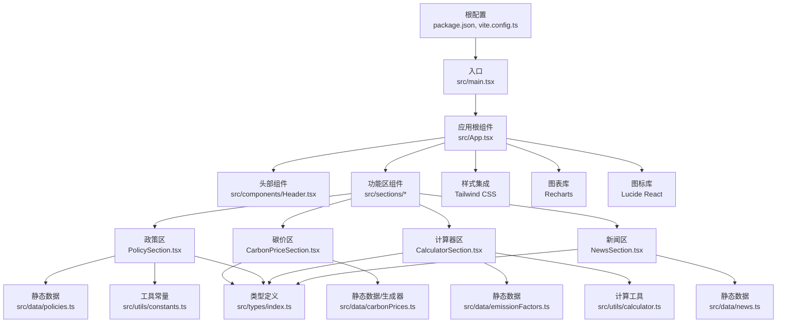
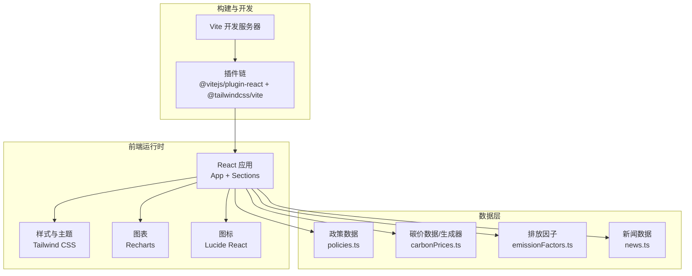
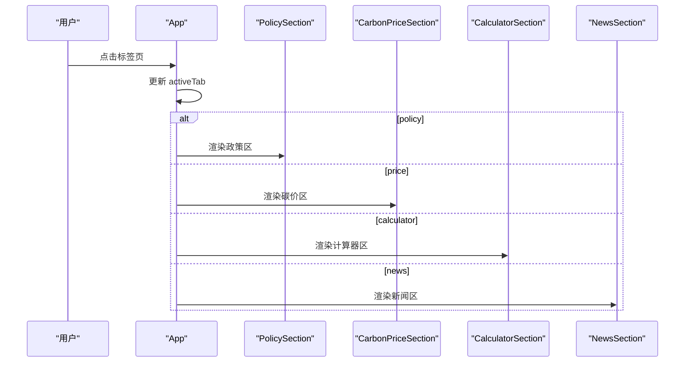
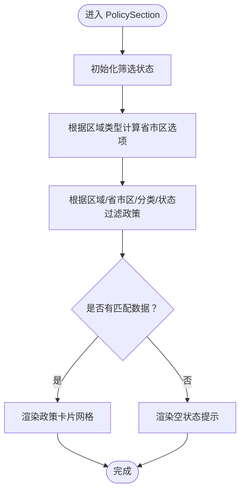
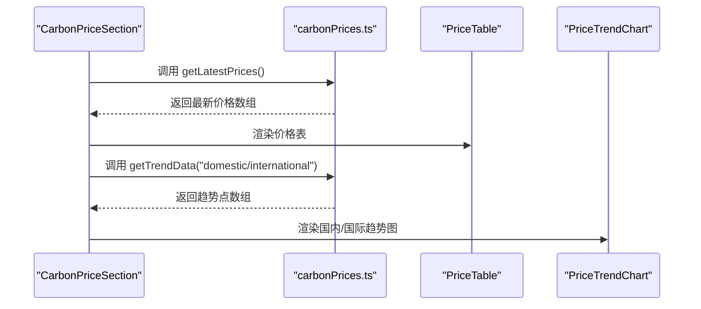
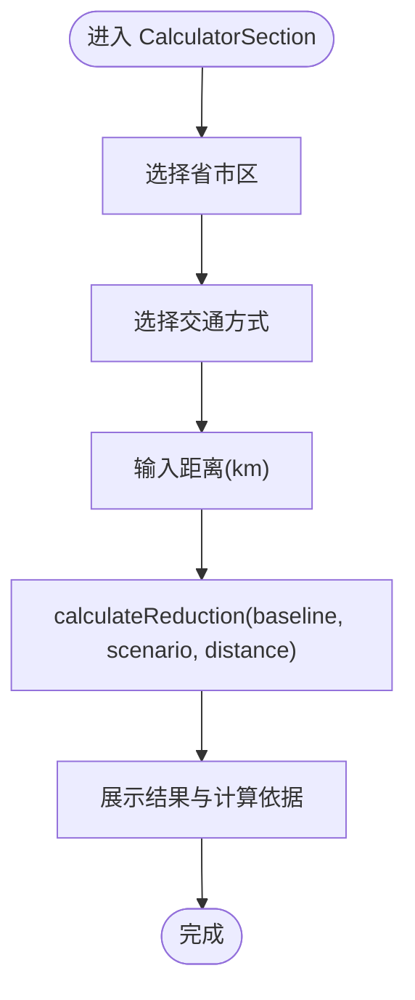
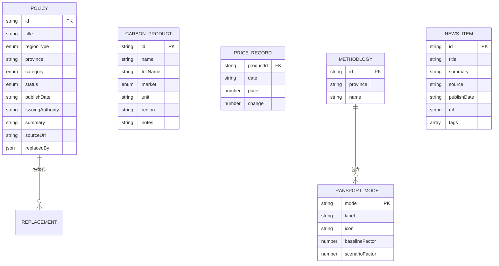
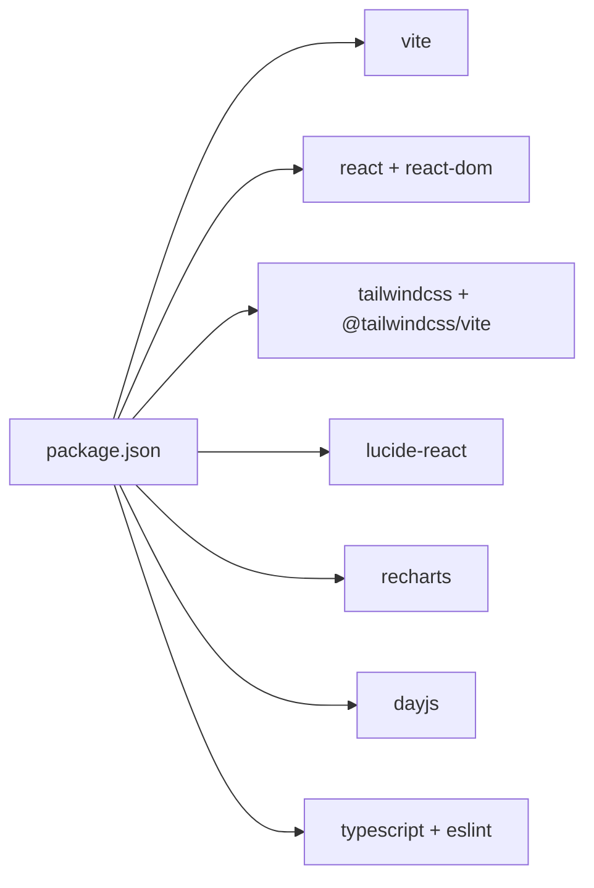

# 架构设计

<cite>
**本文引用的文件**
- [package.json](file://package.json)
- [vite.config.ts](file://vite.config.ts)
- [src/main.tsx](file://src/main.tsx)
- [src/App.tsx](file://src/App.tsx)
- [src/components/Header.tsx](file://src/components/Header.tsx)
- [src/sections/PolicySection.tsx](file://src/sections/PolicySection.tsx)
- [src/sections/CarbonPriceSection.tsx](file://src/sections/CarbonPriceSection.tsx)
- [src/sections/CalculatorSection.tsx](file://src/sections/CalculatorSection.tsx)
- [src/sections/NewsSection.tsx](file://src/sections/NewsSection.tsx)
- [src/data/policies.ts](file://src/data/policies.ts)
- [src/data/carbonPrices.ts](file://src/data/carbonPrices.ts)
- [src/data/emissionFactors.ts](file://src/data/emissionFactors.ts)
- [src/types/index.ts](file://src/types/index.ts)
- [src/utils/constants.ts](file://src/utils/constants.ts)
- [src/utils/calculator.ts](file://src/utils/calculator.ts)
- [README.md](file://README.md)
</cite>

## 目录
1. [引言](#引言)
2. [项目结构](#项目结构)
3. [核心组件](#核心组件)
4. [架构总览](#架构总览)
5. [详细组件分析](#详细组件分析)
6. [依赖分析](#依赖分析)
7. [性能考虑](#性能考虑)
8. [故障排查指南](#故障排查指南)
9. [结论](#结论)
10. [附录](#附录)

## 引言
本项目为“碳普惠信息代理”前端应用，目标是为用户提供政策、碳价、计算器与新闻等碳普惠相关信息的聚合展示与交互体验。系统采用前后端分离的单页应用（SPA）架构，前端基于 React 19 + TypeScript，使用 Vite 进行开发与构建，Tailwind CSS 作为样式基础，Recharts 提供图表可视化，Lucide React 提供图标。

## 项目结构
项目采用按功能域分层的目录组织方式：
- 根级配置：package.json、vite.config.ts、tsconfig 系列配置文件
- 源码入口：src/main.tsx、src/App.tsx
- 组件层：src/components（通用 UI 组件）
- 功能区：src/sections（页面级功能模块）
- 数据层：src/data（静态数据与数据生成工具）
- 类型定义：src/types/index.ts
- 工具层：src/utils（常量、计算逻辑）
- 资源与样式：src/assets、src/index.css、src/App.css

**图表来源**
- [src/main.tsx:1-11](file://src/main.tsx#L1-L11)
- [src/App.tsx:1-60](file://src/App.tsx#L1-L60)
- [src/components/Header.tsx:1-26](file://src/components/Header.tsx#L1-L26)
- [src/sections/PolicySection.tsx:1-89](file://src/sections/PolicySection.tsx#L1-L89)
- [src/sections/CarbonPriceSection.tsx:1-42](file://src/sections/CarbonPriceSection.tsx#L1-L42)
- [src/sections/CalculatorSection.tsx:1-161](file://src/sections/CalculatorSection.tsx#L1-L161)
- [src/sections/NewsSection.tsx:1-71](file://src/sections/NewsSection.tsx#L1-L71)
- [src/data/policies.ts:1-318](file://src/data/policies.ts#L1-L318)
- [src/data/carbonPrices.ts:1-103](file://src/data/carbonPrices.ts#L1-L103)
- [src/data/emissionFactors.ts](file://src/data/emissionFactors.ts)
- [src/utils/constants.ts:1-44](file://src/utils/constants.ts#L1-L44)
- [src/utils/calculator.ts:1-12](file://src/utils/calculator.ts#L1-L12)
- [src/types/index.ts:1-65](file://src/types/index.ts#L1-L65)

**章节来源**
- [package.json:1-36](file://package.json#L1-L36)
- [vite.config.ts:1-8](file://vite.config.ts#L1-L8)
- [src/main.tsx:1-11](file://src/main.tsx#L1-L11)
- [src/App.tsx:1-60](file://src/App.tsx#L1-L60)

## 核心组件
- 应用根组件 App：负责顶部标签页导航与内容区域切换，使用受控状态管理当前激活标签页。
- 头部组件 Header：展示站点标题、副标题与当前日期。
- 功能区组件：
  - PolicySection：政策聚合与筛选，支持区域类型、省市区、分类、状态四维过滤。
  - CarbonPriceSection：展示最新碳价与国内外市场趋势图。
  - CalculatorSection：基于省/市方法学计算出行减碳量。
  - NewsSection：展示碳领域新闻列表与标签。
- 数据层：
  - policies：全国及省市政策静态数据。
  - carbonPrices：碳价历史与最新价格生成器。
  - emissionFactors：不同地区交通出行排放因子。
  - news：新闻条目集合。
- 工具与类型：
  - constants：筛选项枚举与产品元数据。
  - calculator：减碳量计算函数。
  - types：Policy、CarbonProduct、PriceRecord、TransportMode、Methodology、NewsItem 等类型定义。

**章节来源**
- [src/App.tsx:1-60](file://src/App.tsx#L1-L60)
- [src/components/Header.tsx:1-26](file://src/components/Header.tsx#L1-L26)
- [src/sections/PolicySection.tsx:1-89](file://src/sections/PolicySection.tsx#L1-L89)
- [src/sections/CarbonPriceSection.tsx:1-42](file://src/sections/CarbonPriceSection.tsx#L1-L42)
- [src/sections/CalculatorSection.tsx:1-161](file://src/sections/CalculatorSection.tsx#L1-L161)
- [src/sections/NewsSection.tsx:1-71](file://src/sections/NewsSection.tsx#L1-L71)
- [src/data/policies.ts:1-318](file://src/data/policies.ts#L1-L318)
- [src/data/carbonPrices.ts:1-103](file://src/data/carbonPrices.ts#L1-L103)
- [src/data/emissionFactors.ts](file://src/data/emissionFactors.ts)
- [src/utils/constants.ts:1-44](file://src/utils/constants.ts#L1-L44)
- [src/utils/calculator.ts:1-12](file://src/utils/calculator.ts#L1-L12)
- [src/types/index.ts:1-65](file://src/types/index.ts#L1-L65)

## 架构总览
系统采用“前端单页应用 + 静态数据”的轻量后端模式：
- 前端：React + TypeScript + Vite，Tailwind CSS 样式，Recharts 图表，Lucide React 图标。
- 数据：所有业务数据以静态文件形式存放于 src/data，部分数据通过算法生成（如碳价历史）。
- 路由：未引入外部路由库，通过 App 内部状态控制标签页切换。
- 构建：Vite 负责开发服务器、热更新与生产打包；Tailwind CSS 通过 @tailwindcss/vite 插件集成。

**图表来源**
- [src/App.tsx:1-60](file://src/App.tsx#L1-L60)
- [src/sections/PolicySection.tsx:1-89](file://src/sections/PolicySection.tsx#L1-L89)
- [src/sections/CarbonPriceSection.tsx:1-42](file://src/sections/CarbonPriceSection.tsx#L1-L42)
- [src/sections/CalculatorSection.tsx:1-161](file://src/sections/CalculatorSection.tsx#L1-L161)
- [src/sections/NewsSection.tsx:1-71](file://src/sections/NewsSection.tsx#L1-L71)
- [src/data/policies.ts:1-318](file://src/data/policies.ts#L1-L318)
- [src/data/carbonPrices.ts:1-103](file://src/data/carbonPrices.ts#L1-L103)
- [src/data/emissionFactors.ts](file://src/data/emissionFactors.ts)
- [vite.config.ts:1-8](file://vite.config.ts#L1-L8)
- [package.json:12-20](file://package.json#L12-L20)

## 详细组件分析

### 应用根组件与路由设计
- 控制流：App 使用 useState 维护 activeTab，并在主内容区根据键值渲染对应 Section。
- 样式：通过 Tailwind 类名实现响应式布局与主题色系。
- 可扩展性：新增标签页只需在 TABS 中添加条目并在主内容区增加分支。

**图表来源**
- [src/App.tsx:18-52](file://src/App.tsx#L18-L52)
- [src/sections/PolicySection.tsx:1-89](file://src/sections/PolicySection.tsx#L1-L89)
- [src/sections/CarbonPriceSection.tsx:1-42](file://src/sections/CarbonPriceSection.tsx#L1-L42)
- [src/sections/CalculatorSection.tsx:1-161](file://src/sections/CalculatorSection.tsx#L1-L161)
- [src/sections/NewsSection.tsx:1-71](file://src/sections/NewsSection.tsx#L1-L71)

**章节来源**
- [src/App.tsx:1-60](file://src/App.tsx#L1-L60)

### 政策区组件（PolicySection）
- 状态管理：使用 useState 管理区域类型、省市区、分类、状态四个筛选条件。
- 计算属性：通过 useMemo 缓存省市区选项与过滤后的政策列表，避免重复计算。
- 交互流程：区域类型变化时重置省市区；省市区变化联动更新选项；最终渲染卡片网格或空状态提示。

**图表来源**
- [src/sections/PolicySection.tsx:9-34](file://src/sections/PolicySection.tsx#L9-L34)
- [src/utils/constants.ts:1-44](file://src/utils/constants.ts#L1-L44)
- [src/data/policies.ts:1-318](file://src/data/policies.ts#L1-L318)

**章节来源**
- [src/sections/PolicySection.tsx:1-89](file://src/sections/PolicySection.tsx#L1-L89)
- [src/utils/constants.ts:1-44](file://src/utils/constants.ts#L1-L44)
- [src/data/policies.ts:1-318](file://src/data/policies.ts#L1-L318)

### 碳价区组件（CarbonPriceSection）
- 数据来源：通过 carbonPrices.ts 的生成器函数获取最新价格与趋势数据。
- 展示结构：左侧价格表，右侧国内/国际两张趋势图。
- 性能：使用 useMemo 缓存最新价格与趋势数据，减少重复计算。

**图表来源**
- [src/sections/CarbonPriceSection.tsx:8-39](file://src/sections/CarbonPriceSection.tsx#L8-L39)
- [src/data/carbonPrices.ts:55-102](file://src/data/carbonPrices.ts#L55-L102)

**章节来源**
- [src/sections/CarbonPriceSection.tsx:1-42](file://src/sections/CarbonPriceSection.tsx#L1-L42)
- [src/data/carbonPrices.ts:1-103](file://src/data/carbonPrices.ts#L1-L103)

### 计算器区组件（CalculatorSection）
- 数据来源：emissionFactors.ts 提供各地区交通出行排放因子。
- 计算逻辑：调用 utils/calculator.ts 的 calculateReduction 函数进行减碳量计算。
- 交互流程：省市区选择 -> 交通方式选择 -> 输入距离 -> 实时显示吨/千克减碳量与计算依据。

**图表来源**
- [src/sections/CalculatorSection.tsx:16-34](file://src/sections/CalculatorSection.tsx#L16-L34)
- [src/utils/calculator.ts:1-12](file://src/utils/calculator.ts#L1-L12)
- [src/data/emissionFactors.ts](file://src/data/emissionFactors.ts)

**章节来源**
- [src/sections/CalculatorSection.tsx:1-161](file://src/sections/CalculatorSection.tsx#L1-L161)
- [src/utils/calculator.ts:1-12](file://src/utils/calculator.ts#L1-L12)

### 新闻区组件（NewsSection）
- 数据来源：news.ts 提供新闻条目集合。
- 展示结构：卡片式列表，包含标题、摘要、来源、发布时间、标签与跳转链接。

**章节来源**
- [src/sections/NewsSection.tsx:1-71](file://src/sections/NewsSection.tsx#L1-L71)

### 类型与数据模型
- 类型定义覆盖政策、碳价产品与记录、运输方式与方法学、新闻等核心实体。
- 数据模型清晰区分“元数据（meta）”与“时间序列记录（records）”，便于扩展与维护。

**图表来源**
- [src/types/index.ts:1-65](file://src/types/index.ts#L1-L65)
- [src/data/policies.ts:1-318](file://src/data/policies.ts#L1-L318)
- [src/data/emissionFactors.ts](file://src/data/emissionFactors.ts)
- [src/data/carbonPrices.ts:16-33](file://src/data/carbonPrices.ts#L16-L33)

**章节来源**
- [src/types/index.ts:1-65](file://src/types/index.ts#L1-L65)

## 依赖分析
- 构建与开发：Vite 作为核心构建工具，配合 @vitejs/plugin-react 与 @tailwindcss/vite 插件。
- 运行时依赖：React 19、React DOM、Tailwind CSS v4、Lucide React、Recharts、dayjs。
- 开发依赖：TypeScript、ESLint、globals 等。

**图表来源**
- [package.json:12-34](file://package.json#L12-L34)

**章节来源**
- [package.json:1-36](file://package.json#L1-L36)
- [vite.config.ts:1-8](file://vite.config.ts#L1-L8)

## 性能考虑
- 计算缓存：多处使用 useMemo 缓存筛选结果与图表数据，降低渲染成本。
- 静态数据：将业务数据以静态文件形式内嵌，减少网络请求开销，适合中小规模数据集。
- 图表优化：Recharts 默认具备良好的渲染性能，建议在大数据量场景下进一步拆分维度或限制数据点数量。
- 样式体积：Tailwind CSS 在生产构建中会自动裁剪未使用的类，保持样式体积可控。
- 构建优化：Vite 的快速冷启动与按需加载有利于开发体验；生产构建开启压缩与 Tree-shaking。

[本节为通用性能指导，不直接分析具体文件，故无“章节来源”]

## 故障排查指南
- 构建失败：检查 package.json 中脚本与依赖版本是否匹配；确认 Vite 与 Tailwind 插件已正确安装与启用。
- 开发服务器异常：查看 Vite 配置与插件链路，确保 @vitejs/plugin-react 与 @tailwindcss/vite 正确注册。
- 样式未生效：确认 Tailwind CSS 版本与 @tailwindcss/vite 插件兼容；检查构建配置中的插件顺序。
- 数据为空：核对静态数据文件路径与导出格式；确认 Section 组件正确导入并使用数据。
- 类型错误：根据 src/types/index.ts 的定义校验数据结构；确保枚举值与字段类型一致。

**章节来源**
- [package.json:12-34](file://package.json#L12-L34)
- [vite.config.ts:1-8](file://vite.config.ts#L1-L8)
- [README.md:1-74](file://README.md#L1-L74)

## 结论
本项目以“轻量化静态数据 + React 组件化”的方式实现了碳普惠信息的聚合展示。通过清晰的功能区划分、稳定的类型定义与合理的缓存策略，系统在易维护性与性能之间取得平衡。未来可在以下方面演进：
- 引入轻量路由库以支持深度链接与分享；
- 将静态数据迁移至 API 或本地 JSON API，提升数据更新与扩展能力；
- 增加错误边界与全局状态管理（如 Zustand/Redux Toolkit），以应对更复杂的交互与状态需求；
- 加强监控与埋点，收集用户行为与性能指标，持续优化体验。

[本节为总结性内容，不直接分析具体文件，故无“章节来源”]

## 附录
- 构建命令与用途参考 README 中的说明与模板注释。

**章节来源**
- [README.md:1-74](file://README.md#L1-L74)