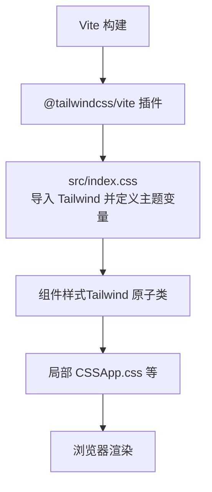
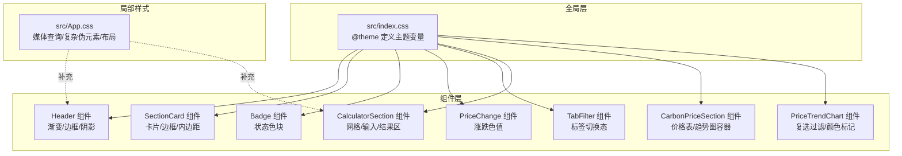
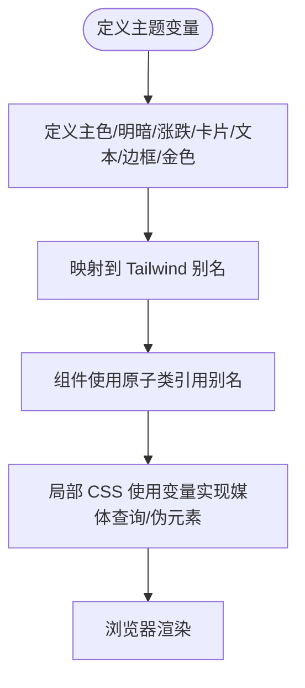
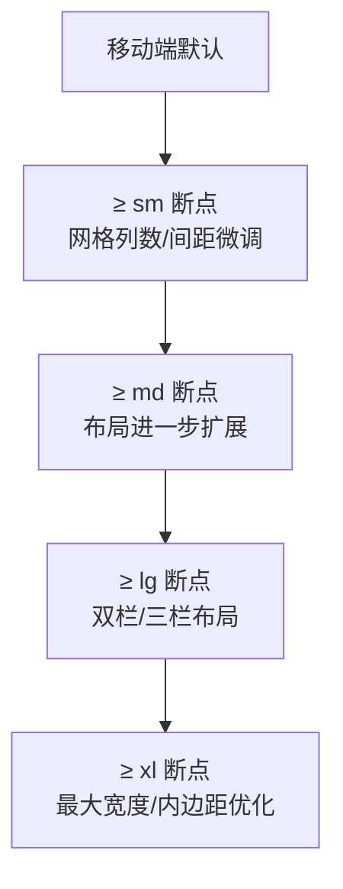
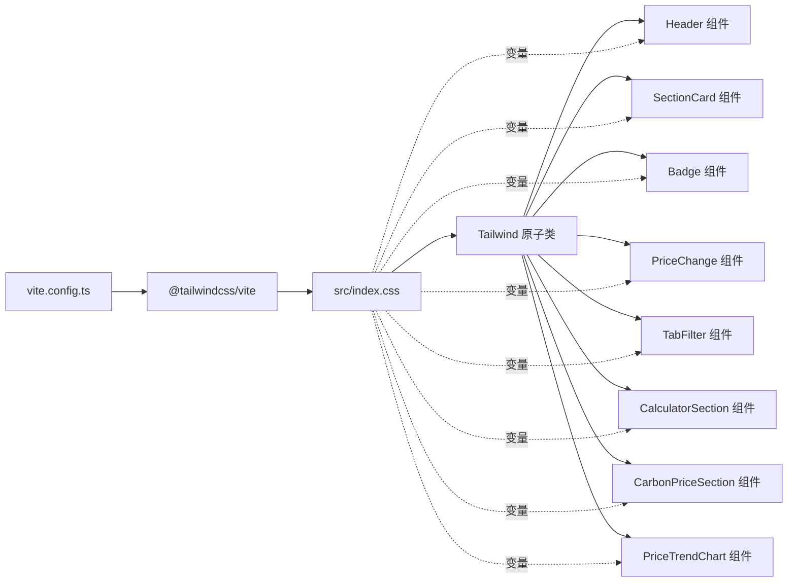

# 样式系统

<cite>
**本文引用的文件**
- [package.json](file://package.json)
- [vite.config.ts](file://vite.config.ts)
- [src/index.css](file://src/index.css)
- [src/App.css](file://src/App.css)
- [src/components/Badge.tsx](file://src/components/Badge.tsx)
- [src/components/Header.tsx](file://src/components/Header.tsx)
- [src/components/SectionCard.tsx](file://src/components/SectionCard.tsx)
- [src/components/PriceChange.tsx](file://src/components/PriceChange.tsx)
- [src/components/TabFilter.tsx](file://src/components/TabFilter.tsx)
- [src/sections/CalculatorSection.tsx](file://src/sections/CalculatorSection.tsx)
- [src/sections/CarbonPriceSection.tsx](file://src/sections/CarbonPriceSection.tsx)
- [src/sections/PriceTrendChart.tsx](file://src/sections/PriceTrendChart.tsx)
- [src/utils/constants.ts](file://src/utils/constants.ts)
</cite>

## 目录
1. [简介](#简介)
2. [项目结构](#项目结构)
3. [核心组件](#核心组件)
4. [架构总览](#架构总览)
5. [详细组件分析](#详细组件分析)
6. [依赖关系分析](#依赖关系分析)
7. [性能考量](#性能考量)
8. [故障排查指南](#故障排查指南)
9. [结论](#结论)
10. [附录](#附录)

## 简介
本项目采用 Tailwind CSS v4 作为原子化样式框架，并通过 Vite 插件进行构建期处理。样式系统以“变量驱动 + 原子类组合”为核心策略：全局通过 CSS 变量提供主题色板与语义变量；组件层以 Tailwind 原子类为主，辅以少量局部 CSS 实现复杂交互与动画；响应式设计遵循移动优先原则，结合媒体查询实现多断点布局。

## 项目结构
- 构建与插件
  - 使用 Vite 配置加载 Tailwind CSS 插件，确保在开发与生产环境均能正确生成与压缩样式。
- 全局样式入口
  - 通过入口 CSS 导入 Tailwind 并定义主题变量，统一字体、背景、边框等基础样式。
- 组件样式
  - 大部分组件样式由 Tailwind 原子类组合完成，少部分复杂交互或动画通过局部 CSS 文件实现。
- 响应式与断点
  - 使用 Tailwind 默认断点（如 sm、md、lg、xl）与媒体查询配合，实现移动端优先的自适应布局。

图表来源
- [vite.config.ts:1-8](file://vite.config.ts#L1-L8)
- [src/index.css:1-31](file://src/index.css#L1-L31)
- [src/App.css:1-185](file://src/App.css#L1-L185)

章节来源
- [package.json:12-20](file://package.json#L12-L20)
- [vite.config.ts:1-8](file://vite.config.ts#L1-L8)
- [src/index.css:1-31](file://src/index.css#L1-L31)

## 核心组件
- 主题变量与颜色系统
  - 在全局 CSS 中定义了政府蓝配色方案与价格涨跌、卡片、文本、边框等语义变量，供 Tailwind 与局部 CSS 同时使用。
- 原子类与语义映射
  - 组件中广泛使用 Tailwind 原子类，如颜色、间距、阴影、边框、渐变、圆角、文字样式等，保证一致的视觉语言。
- 局部样式与交互
  - 对于复杂动画、伪元素、媒体查询等场景，采用局部 CSS 文件补充，避免过度使用内联样式或复杂模板字符串。

章节来源
- [src/index.css:3-16](file://src/index.css#L3-L16)
- [src/components/Header.tsx:6-25](file://src/components/Header.tsx#L6-L25)
- [src/components/SectionCard.tsx:12-24](file://src/components/SectionCard.tsx#L12-L24)
- [src/components/Badge.tsx:8-17](file://src/components/Badge.tsx#L8-L17)
- [src/App.css:1-185](file://src/App.css#L1-L185)

## 架构总览
样式系统围绕“全局主题变量 + Tailwind 原子类 + 局部 CSS 补充”的三层结构展开。全局变量提供统一语义色值，组件通过原子类快速组合出一致的 UI 规范，局部 CSS 负责复杂交互与媒体查询。

图表来源
- [src/index.css:1-31](file://src/index.css#L1-L31)
- [src/components/Header.tsx:1-28](file://src/components/Header.tsx#L1-L28)
- [src/components/SectionCard.tsx:1-26](file://src/components/SectionCard.tsx#L1-L26)
- [src/components/Badge.tsx:1-19](file://src/components/Badge.tsx#L1-L19)
- [src/components/PriceChange.tsx:1-33](file://src/components/PriceChange.tsx#L1-L33)
- [src/components/TabFilter.tsx:1-32](file://src/components/TabFilter.tsx#L1-L32)
- [src/sections/CalculatorSection.tsx:1-161](file://src/sections/CalculatorSection.tsx#L1-L161)
- [src/sections/CarbonPriceSection.tsx:1-42](file://src/sections/CarbonPriceSection.tsx#L1-L42)
- [src/sections/PriceTrendChart.tsx:57-91](file://src/sections/PriceTrendChart.tsx#L57-L91)
- [src/App.css:1-185](file://src/App.css#L1-L185)

## 详细组件分析

### 主题变量与颜色系统
- 设计目标
  - 提供政府蓝主色系与价格涨跌对比色，确保信息传达清晰且符合行业语境。
- 关键变量
  - 主色与明暗对比：用于标题、按钮、边框强调。
  - 价格涨跌：绿色代表下降（减排），红色代表上涨（成本上升）。
  - 卡片与背景：浅色背景与卡片色形成层次感。
  - 文本与边框：区分主要/次要文本与分隔线。
  - 金色：用于重要提示或强调边框。
- 使用方式
  - 组件通过 Tailwind 颜色别名（如 primary、primary-light、price-up、price-down、card、text-primary、border、gov-gold）应用样式。
  - 局部 CSS 使用 CSS 变量实现媒体查询与复杂伪元素。

图表来源
- [src/index.css:3-16](file://src/index.css#L3-L16)
- [src/components/Header.tsx:6](file://src/components/Header.tsx#L6)
- [src/components/SectionCard.tsx:12-24](file://src/components/SectionCard.tsx#L12-L24)
- [src/components/PriceChange.tsx:20-22](file://src/components/PriceChange.tsx#L20-L22)
- [src/App.css:67-71](file://src/App.css#L67-L71)

章节来源
- [src/index.css:3-16](file://src/index.css#L3-L16)
- [src/components/Header.tsx:6-25](file://src/components/Header.tsx#L6-L25)
- [src/components/SectionCard.tsx:12-24](file://src/components/SectionCard.tsx#L12-L24)
- [src/components/PriceChange.tsx:7-32](file://src/components/PriceChange.tsx#L7-L32)
- [src/App.css:67-96](file://src/App.css#L67-L96)

### 命名约定与组件样式隔离
- 命名约定
  - 组件类名采用语义化短词，如“bg-card”、“text-text-primary”、“border-border”，避免无意义缩写。
  - 状态类名明确区分激活/禁用/悬停等状态，如“bg-primary-light”、“text-primary”、“hover:border-primary/30”。
- 样式隔离
  - 每个组件独立包裹在根节点容器中，通过局部容器选择器限定作用域，减少全局污染。
  - 局部 CSS 使用嵌套选择器与媒体查询，仅影响目标区域。
- 示例路径
  - 卡片头部容器使用“border-b”与“px-6 py-4”限定内边距与分隔线。
  - 输入框聚焦态使用“focus:ring-2 focus:ring-primary/30”。

章节来源
- [src/components/SectionCard.tsx:12-24](file://src/components/SectionCard.tsx#L12-L24)
- [src/sections/CalculatorSection.tsx:55-113](file://src/sections/CalculatorSection.tsx#L55-L113)
- [src/App.css:73-105](file://src/App.css#L73-L105)

### 响应式设计与断点策略
- 断点与栅格
  - 使用 Tailwind 默认断点（sm、md、lg、xl）控制网格列数与布局切换。
  - 计算器区域在小屏为单列，在大屏为双列网格。
- 媒体查询
  - 局部 CSS 中对特定区域（如“#center”、“#next-steps”）使用媒体查询调整内边距与方向。
- 移动端优先
  - 小屏优先，逐步增强为大屏布局；标签页与列表在小屏下自动换行与居中。

图表来源
- [src/sections/CalculatorSection.tsx:47-158](file://src/sections/CalculatorSection.tsx#L47-L158)
- [src/App.css:67-96](file://src/App.css#L67-L96)
- [src/App.css:139-153](file://src/App.css#L139-L153)

章节来源
- [src/sections/CalculatorSection.tsx:47-158](file://src/sections/CalculatorSection.tsx#L47-L158)
- [src/App.css:67-154](file://src/App.css#L67-L154)

### 样式继承、覆盖与调试
- 继承与覆盖
  - 全局变量优先于组件默认值；当需要局部覆盖时，使用更具体的选择器或“!important”谨慎处理。
  - 通过“focus:ring-2 focus:ring-primary/30”等工具类实现可叠加的状态样式。
- 调试技巧
  - 使用“focus:outline”辅助定位焦点元素。
  - 使用“bg-opacity”与“text-opacity”微调透明度，避免硬编码颜色。
  - 在局部 CSS 中使用媒体查询验证断点行为。

章节来源
- [src/sections/CalculatorSection.tsx:58](file://src/sections/CalculatorSection.tsx#L58)
- [src/App.css:14-16](file://src/App.css#L14-L16)

### 组件样式规范

#### Header 组件
- 视觉要点
  - 渐变背景从深蓝到浅蓝，强调政府蓝主题。
  - 边框底部使用金色，突出重要性。
  - 文字采用白色高对比度配色。
- 类名要点
  - 渐变与边框：使用“from-primary-dark to-primary”与“border-gov-gold”。
  - 内边距与阴影：使用“py-5 px-6 shadow-lg”。

章节来源
- [src/components/Header.tsx:6-25](file://src/components/Header.tsx#L6-L25)

#### SectionCard 组件
- 视觉要点
  - 卡片容器使用“bg-card”与“rounded-xl shadow-md”。
  - 头部分隔线使用“border-b border-border”，内边距“px-6 py-4”。
- 类名要点
  - 文本语义：使用“text-text-primary”与“text-text-secondary”。

章节来源
- [src/components/SectionCard.tsx:12-24](file://src/components/SectionCard.tsx#L12-L24)

#### Badge 组件
- 视觉要点
  - 状态区分：激活使用“bg-green-100 text-green-800”，过期使用“bg-red-100 text-red-800”。
  - 圆角与内边距：使用“rounded-full px-2.5 py-0.5”。

章节来源
- [src/components/Badge.tsx:8-17](file://src/components/Badge.tsx#L8-L17)

#### PriceChange 组件
- 视觉要点
  - 涨跌颜色：使用“text-price-up”与“text-price-down”。
  - 图标与数值对齐：使用“inline-flex items-center gap-1”。

章节来源
- [src/components/PriceChange.tsx:19-31](file://src/components/PriceChange.tsx#L19-L31)

#### TabFilter 组件
- 视觉要点
  - 标签切换态：激活使用“bg-primary text-white”，非激活使用“bg-gray-100 text-text-secondary”。
  - 过渡与悬停：使用“transition-colors”与“hover:bg-primary-light hover:text-primary”。

章节来源
- [src/components/TabFilter.tsx:19-23](file://src/components/TabFilter.tsx#L19-L23)

#### CalculatorSection 组件
- 视觉要点
  - 输入框聚焦态：使用“focus:ring-2 focus:ring-primary/30”。
  - 结果区域：使用“bg-primary-light/50 rounded-xl p-6 border border-primary/20”。
  - 网格布局：使用“grid grid-cols-1 lg:grid-cols-2 gap-6”。

章节来源
- [src/sections/CalculatorSection.tsx:55-158](file://src/sections/CalculatorSection.tsx#L55-L158)

#### CarbonPriceSection 组件
- 视觉要点
  - 价格表与趋势图容器：使用“bg-gray-50 rounded-lg p-4”。
  - 标题与单位：通过 props 动态传入，保持一致性。

章节来源
- [src/sections/CarbonPriceSection.tsx:19-38](file://src/sections/CarbonPriceSection.tsx#L19-L38)

#### PriceTrendChart 组件
- 视觉要点
  - 复选过滤项：使用“accent-primary”与“text-xs text-text-primary”。
  - 颜色标记：通过内联样式动态设置“backgroundColor”。

章节来源
- [src/sections/PriceTrendChart.tsx:62-91](file://src/sections/PriceTrendChart.tsx#L62-L91)

## 依赖关系分析
- 构建链路
  - Vite 加载 React 与 Tailwind 插件，按顺序处理 TSX 与 CSS。
  - Tailwind 读取全局 CSS 的主题变量，生成对应原子类。
- 组件与样式的耦合
  - 组件通过类名引用主题变量别名，降低硬编码风险。
  - 局部 CSS 与组件解耦，仅在必要时引入媒体查询与复杂伪元素。

图表来源
- [vite.config.ts:1-8](file://vite.config.ts#L1-L8)
- [src/index.css:1-31](file://src/index.css#L1-L31)
- [src/components/Header.tsx:1-28](file://src/components/Header.tsx#L1-L28)
- [src/components/SectionCard.tsx:1-26](file://src/components/SectionCard.tsx#L1-L26)
- [src/components/Badge.tsx:1-19](file://src/components/Badge.tsx#L1-L19)
- [src/components/PriceChange.tsx:1-33](file://src/components/PriceChange.tsx#L1-L33)
- [src/components/TabFilter.tsx:1-32](file://src/components/TabFilter.tsx#L1-L32)
- [src/sections/CalculatorSection.tsx:1-161](file://src/sections/CalculatorSection.tsx#L1-L161)
- [src/sections/CarbonPriceSection.tsx:1-42](file://src/sections/CarbonPriceSection.tsx#L1-L42)
- [src/sections/PriceTrendChart.tsx:57-91](file://src/sections/PriceTrendChart.tsx#L57-L91)

章节来源
- [package.json:12-20](file://package.json#L12-L20)
- [vite.config.ts:1-8](file://vite.config.ts#L1-L8)
- [src/index.css:1-31](file://src/index.css#L1-L31)

## 性能考量
- 原子类体积控制
  - 仅在需要时启用特定工具类，避免生成未使用的样式。
- 构建优化
  - 使用 Tailwind v4 的 Oxide 引擎与 Vite 插件，确保开发与生产环境的高效打包。
- 局部 CSS 的最小化
  - 将复杂交互与媒体查询限制在局部 CSS，减少全局样式体积。
- 字体与渲染
  - 全局设置抗锯齿与行高，提升可读性与渲染稳定性。

章节来源
- [package.json:19](file://package.json#L19)
- [src/index.css:18-26](file://src/index.css#L18-L26)

## 故障排查指南
- 常见问题
  - 类名冲突：检查组件是否使用了相同语义但不同颜色的类名，建议统一别名。
  - 响应式异常：核对媒体查询断点与容器类名是否匹配。
  - 颜色不生效：确认全局变量是否正确导入，以及组件是否使用了正确的 Tailwind 别名。
- 排查步骤
  - 在浏览器开发者工具中查看元素实际应用的类名与计算样式。
  - 临时移除局部 CSS 或注释掉媒体查询，定位问题来源。
  - 使用“focus:outline”辅助检查焦点状态是否按预期触发。

章节来源
- [src/App.css:67-96](file://src/App.css#L67-L96)
- [src/sections/CalculatorSection.tsx:58](file://src/sections/CalculatorSection.tsx#L58)

## 结论
本项目通过“全局变量 + Tailwind 原子类 + 局部 CSS”的三层架构，实现了主题一致、易于维护、可扩展的样式系统。移动优先的响应式策略与语义化的命名约定，使得组件在不同设备与场景下均能保持良好的可用性与可读性。建议持续关注 Tailwind v4 的新特性，并在新增组件时遵循现有命名与隔离规范，以维持整体风格的一致性。

## 附录

### 颜色系统表
- 主色与明暗
  - 主色：用于标题、按钮、边框强调
  - 主色-亮：用于浅色背景与高亮
  - 主色-暗：用于渐变起始与边框强调
- 价格涨跌
  - 上涨：红色，用于成本上升
  - 下降：绿色，用于减排收益
- 卡片与背景
  - 卡片：白色卡片背景
  - 背景：浅灰背景
- 文本与边框
  - 主要文本：深蓝，用于标题与正文
  - 次要文本：灰蓝，用于说明与标签
  - 边框：浅蓝，用于分隔线
- 金色
  - 用于重要提示或强调边框

章节来源
- [src/index.css:4-15](file://src/index.css#L4-L15)

### 响应式断点与示例
- 断点
  - sm：小屏优先
  - md：中屏增强
  - lg：大屏双栏/三栏
  - xl：超大屏最大宽度
- 示例
  - 计算器区域在 lg 以上为双列网格，小屏为单列。
  - “#center”在 1024px 以下调整内边距与间距。

章节来源
- [src/sections/CalculatorSection.tsx:47-158](file://src/sections/CalculatorSection.tsx#L47-L158)
- [src/App.css:67-96](file://src/App.css#L67-L96)