# 组件层次结构

<cite>
**本文引用的文件**
- [src/App.tsx](file://src/App.tsx)
- [src/main.tsx](file://src/main.tsx)
- [src/components/Header.tsx](file://src/components/Header.tsx)
- [src/components/SectionCard.tsx](file://src/components/SectionCard.tsx)
- [src/components/TabFilter.tsx](file://src/components/TabFilter.tsx)
- [src/sections/PolicySection.tsx](file://src/sections/PolicySection.tsx)
- [src/sections/CarbonPriceSection.tsx](file://src/sections/CarbonPriceSection.tsx)
- [src/sections/CalculatorSection.tsx](file://src/sections/CalculatorSection.tsx)
- [src/sections/NewsSection.tsx](file://src/sections/NewsSection.tsx)
- [src/types/index.ts](file://src/types/index.ts)
- [src/utils/constants.ts](file://src/utils/constants.ts)
- [src/data/policies.ts](file://src/data/policies.ts)
- [src/data/carbonPrices.ts](file://src/data/carbonPrices.ts)
- [src/data/emissionFactors.ts](file://src/data/emissionFactors.ts)
- [src/utils/calculator.ts](file://src/utils/calculator.ts)
</cite>

## 目录
1. [引言](#引言)
2. [项目结构](#项目结构)
3. [核心组件](#核心组件)
4. [架构总览](#架构总览)
5. [详细组件分析](#详细组件分析)
6. [依赖分析](#依赖分析)
7. [性能考量](#性能考量)
8. [故障排查指南](#故障排查指南)
9. [结论](#结论)
10. [附录](#附录)

## 引言
本文件面向“碳普惠信息代理”项目，系统梳理组件层次结构与组织方式，重点说明根组件 App.tsx 如何通过标签页导航实现内容切换；头部组件 Header 的职责与设计；共享组件 SectionCard、TabFilter 的复用机制；组件层级关系、props 传递模式与状态提升策略；生命周期管理、事件处理与用户交互响应；并提供组件关系图、数据流图与交互流程图，最后总结设计原则、可复用性与可测试性建议。

## 项目结构
项目采用按功能域划分的目录组织方式：
- 根入口：main.tsx 渲染根组件 App.tsx
- 根组件：App.tsx 管理全局布局、顶部标签导航与四大板块内容区
- 共享组件：components 目录下提供 Header、SectionCard、TabFilter 等通用 UI
- 页面模块：sections 目录下按业务域拆分 PolicySection、CarbonPriceSection、CalculatorSection、NewsSection
- 类型定义：types/index.ts 提供跨模块的数据模型
- 工具与常量：utils 下提供常量与计算逻辑
- 数据源：data 目录提供政策、价格、排放因子、新闻等静态或生成数据

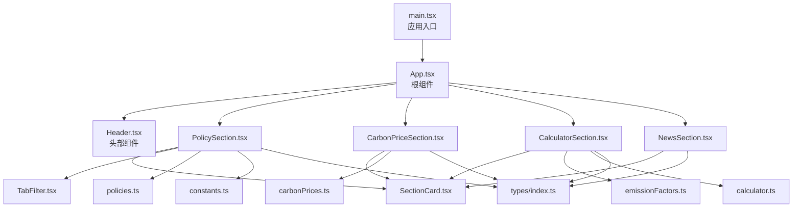

图表来源
- [src/main.tsx:1-11](file://src/main.tsx#L1-L11)
- [src/App.tsx:1-60](file://src/App.tsx#L1-L60)
- [src/components/Header.tsx:1-28](file://src/components/Header.tsx#L1-L28)
- [src/components/SectionCard.tsx:1-26](file://src/components/SectionCard.tsx#L1-L26)
- [src/components/TabFilter.tsx:1-32](file://src/components/TabFilter.tsx#L1-L32)
- [src/sections/PolicySection.tsx:1-89](file://src/sections/PolicySection.tsx#L1-L89)
- [src/sections/CarbonPriceSection.tsx:1-42](file://src/sections/CarbonPriceSection.tsx#L1-L42)
- [src/sections/CalculatorSection.tsx:1-161](file://src/sections/CalculatorSection.tsx#L1-L161)
- [src/sections/NewsSection.tsx:1-166](file://src/sections/NewsSection.tsx#L1-L166)
- [src/data/policies.ts:1-345](file://src/data/policies.ts#L1-L345)
- [src/data/carbonPrices.ts:1-103](file://src/data/carbonPrices.ts#L1-L103)
- [src/data/emissionFactors.ts:1-103](file://src/data/emissionFactors.ts#L1-L103)
- [src/utils/constants.ts:1-44](file://src/utils/constants.ts#L1-L44)
- [src/types/index.ts:1-65](file://src/types/index.ts#L1-L65)
- [src/utils/calculator.ts:1-12](file://src/utils/calculator.ts#L1-L12)

章节来源
- [src/main.tsx:1-11](file://src/main.tsx#L1-L11)
- [src/App.tsx:1-60](file://src/App.tsx#L1-L60)

## 核心组件
- 根组件 App.tsx
  - 负责全局布局、顶部标签导航栏与四大板块内容区的切换
  - 使用受控状态 activeTab 控制当前展示的板块
  - 导入并渲染 Header、PolicySection、CarbonPriceSection、CalculatorSection、NewsSection
- 头部组件 Header.tsx
  - 展示平台名称、副标题与当前日期，承担品牌与信息提示职责
- 共享组件 SectionCard.tsx
  - 通用卡片容器，支持标题、副标题、图标与子内容
  - 作为各业务板块的统一外层容器，保证视觉一致性
- 共享组件 TabFilter.tsx
  - 可复用的标签式过滤器，接收 label、tabs、activeValue、onChange
  - 在政策板块中被多处使用，实现区域类型、省市区、类别、状态的筛选

章节来源
- [src/App.tsx:18-59](file://src/App.tsx#L18-L59)
- [src/components/Header.tsx:4-27](file://src/components/Header.tsx#L4-L27)
- [src/components/SectionCard.tsx:10-25](file://src/components/SectionCard.tsx#L10-L25)
- [src/components/TabFilter.tsx:8-31](file://src/components/TabFilter.tsx#L8-L31)

## 架构总览
应用采用自上而下的单向数据流与状态提升策略：
- App.tsx 维护顶层状态 activeTab，向下传递给四大板块
- 各板块内部维护自身局部状态（如政策筛选、计算器输入、新闻日期筛选）
- 共享组件仅消费 props，不持有业务状态，确保高内聚低耦合
- 数据源通过 data/* 文件提供，工具函数在 utils/* 中封装纯函数

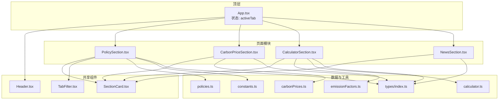

图表来源
- [src/App.tsx:18-59](file://src/App.tsx#L18-L59)
- [src/sections/PolicySection.tsx:9-89](file://src/sections/PolicySection.tsx#L9-L89)
- [src/sections/CarbonPriceSection.tsx:8-41](file://src/sections/CarbonPriceSection.tsx#L8-L41)
- [src/sections/CalculatorSection.tsx:16-161](file://src/sections/CalculatorSection.tsx#L16-L161)
- [src/sections/NewsSection.tsx:7-166](file://src/sections/NewsSection.tsx#L7-L166)
- [src/components/SectionCard.tsx:10-25](file://src/components/SectionCard.tsx#L10-L25)
- [src/components/TabFilter.tsx:8-31](file://src/components/TabFilter.tsx#L8-L31)
- [src/data/policies.ts:1-345](file://src/data/policies.ts#L1-L345)
- [src/data/carbonPrices.ts:1-103](file://src/data/carbonPrices.ts#L1-L103)
- [src/data/emissionFactors.ts:1-103](file://src/data/emissionFactors.ts#L1-L103)
- [src/utils/calculator.ts:1-12](file://src/utils/calculator.ts#L1-L12)
- [src/utils/constants.ts:1-44](file://src/utils/constants.ts#L1-L44)
- [src/types/index.ts:1-65](file://src/types/index.ts#L1-L65)

## 详细组件分析

### 根组件 App.tsx：标签页导航与内容切换
- 结构要点
  - 定义 TABS 常量数组，包含键值、标签与图标
  - 使用 useState 维护 activeTab
  - 顶部导航通过映射 TABS 渲染按钮，点击时更新 activeTab
  - 根据 activeTab 条件渲染对应板块组件
- 生命周期与交互
  - 初始化阶段设置默认 activeTab
  - 用户点击导航按钮触发 setState，驱动重新渲染
- 设计原则
  - 单一职责：只负责导航与内容切换
  - 状态提升：将顶层状态暴露给所有板块，便于后续扩展

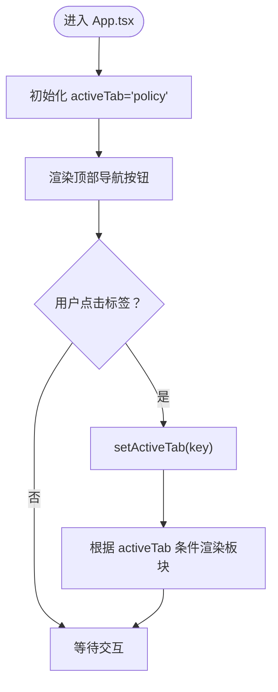

图表来源
- [src/App.tsx:9-14](file://src/App.tsx#L9-L14)
- [src/App.tsx:18-59](file://src/App.tsx#L18-L59)

章节来源
- [src/App.tsx:18-59](file://src/App.tsx#L18-L59)

### 头部组件 Header.tsx：品牌与信息展示
- 职责
  - 展示平台名称、副标题与当前日期
  - 使用渐变背景与图标增强品牌识别
- 设计
  - 无本地状态，纯展示组件，符合函数式无副作用原则
  - 与 App.tsx 平级，作为全局头部

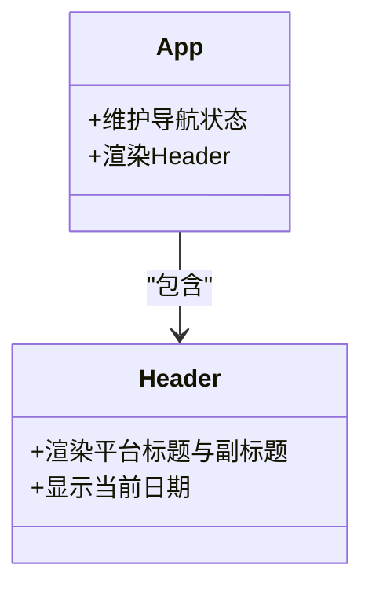

图表来源
- [src/components/Header.tsx:4-27](file://src/components/Header.tsx#L4-L27)
- [src/App.tsx:22-23](file://src/App.tsx#L22-L23)

章节来源
- [src/components/Header.tsx:4-27](file://src/components/Header.tsx#L4-L27)

### 共享组件 SectionCard.tsx：卡片容器
- 能力
  - 接收 title、subtitle、icon、children
  - 统一样式：卡片背景、边框、阴影、内边距
- 复用场景
  - 政策、碳价、计算器、资讯板块均以 SectionCard 包裹，形成一致的视觉与交互体验

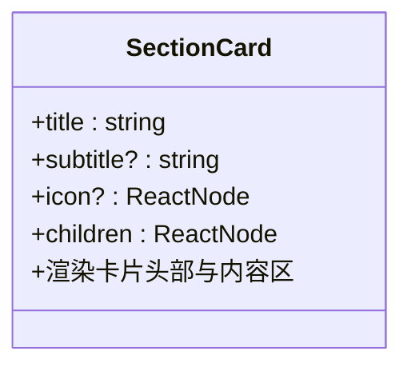

图表来源
- [src/components/SectionCard.tsx:3-8](file://src/components/SectionCard.tsx#L3-L8)
- [src/components/SectionCard.tsx:10-25](file://src/components/SectionCard.tsx#L10-L25)

章节来源
- [src/components/SectionCard.tsx:10-25](file://src/components/SectionCard.tsx#L10-L25)

### 共享组件 TabFilter.tsx：标签式过滤器
- 能力
  - 接收 label、tabs 数组、activeValue、onChange 回调
  - 渲染一组可切换的标签按钮，点击触发 onChange
- 复用场景
  - 在政策板块中被多次使用，分别用于区域类型、省市区、类别、状态的筛选

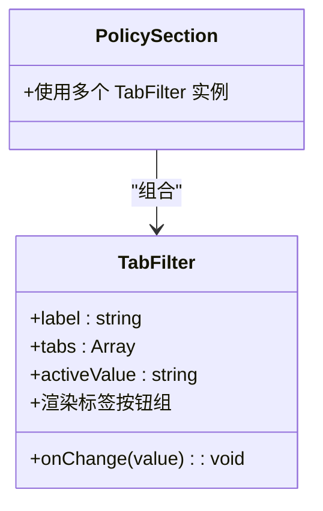

图表来源
- [src/components/TabFilter.tsx:1-6](file://src/components/TabFilter.tsx#L1-L6)
- [src/components/TabFilter.tsx:8-31](file://src/components/TabFilter.tsx#L8-L31)
- [src/sections/PolicySection.tsx:42-72](file://src/sections/PolicySection.tsx#L42-L72)

章节来源
- [src/components/TabFilter.tsx:8-31](file://src/components/TabFilter.tsx#L8-L31)
- [src/sections/PolicySection.tsx:42-72](file://src/sections/PolicySection.tsx#L42-L72)

### 政策板块 PolicySection.tsx：筛选与列表
- 状态与筛选
  - 维护 regionType、province、category、status 四个筛选状态
  - provinceTabs 基于 regionType 动态生成
  - filteredPolicies 基于上述状态进行过滤
- 交互
  - TabFilter onChange 更新对应状态
  - 省市区联动：当区域类型变化时重置省市区为“全部”
- 视觉
  - 使用 SectionCard 包裹，内部网格展示 PolicyCard 列表

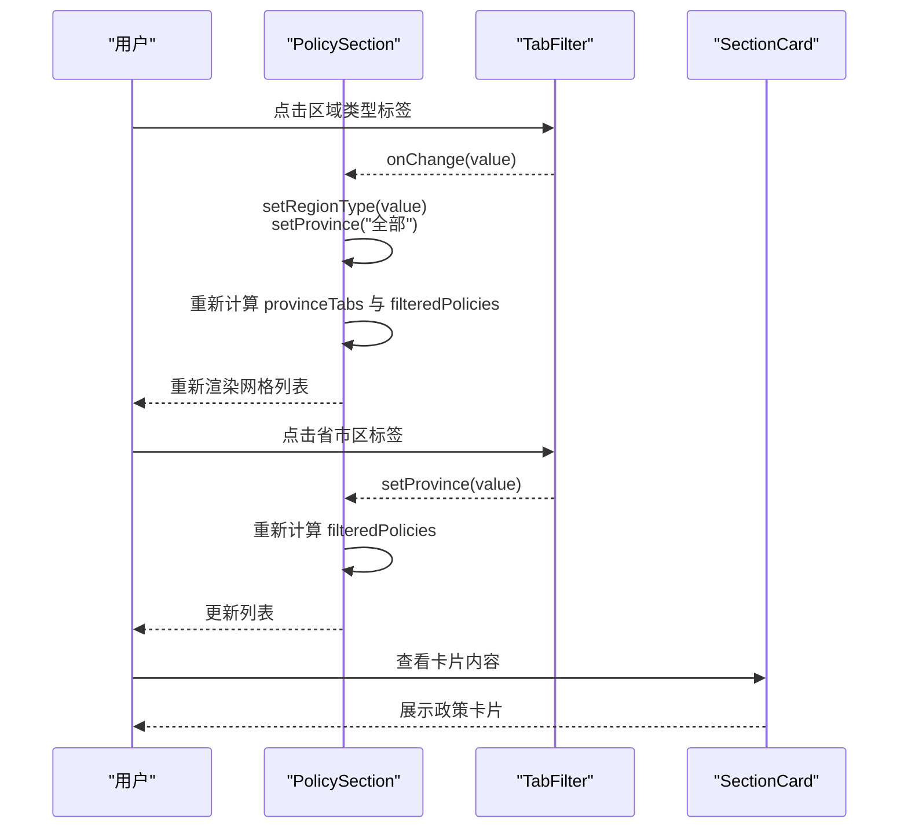

图表来源
- [src/sections/PolicySection.tsx:9-89](file://src/sections/PolicySection.tsx#L9-L89)
- [src/components/TabFilter.tsx:8-31](file://src/components/TabFilter.tsx#L8-L31)
- [src/components/SectionCard.tsx:10-25](file://src/components/SectionCard.tsx#L10-L25)
- [src/data/policies.ts:1-345](file://src/data/policies.ts#L1-L345)
- [src/utils/constants.ts:1-44](file://src/utils/constants.ts#L1-L44)

章节来源
- [src/sections/PolicySection.tsx:9-89](file://src/sections/PolicySection.tsx#L9-L89)

### 碳价板块 CarbonPriceSection.tsx：价格与趋势
- 数据
  - 通过 carbonPrices.ts 生成最新价格与趋势数据
- 结构
  - 使用 SectionCard 包裹价格表格与两条趋势图
- 性能
  - 使用 useMemo 缓存最新价格与趋势数据，避免重复计算

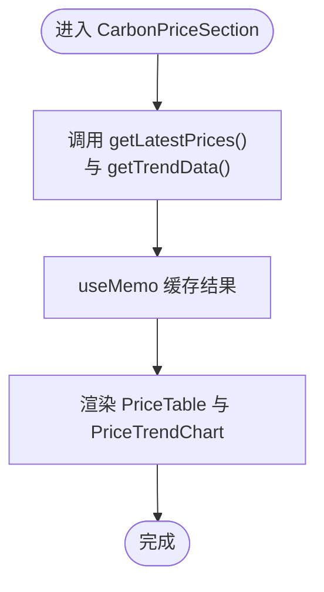

图表来源
- [src/sections/CarbonPriceSection.tsx:8-41](file://src/sections/CarbonPriceSection.tsx#L8-L41)
- [src/data/carbonPrices.ts:55-103](file://src/data/carbonPrices.ts#L55-L103)

章节来源
- [src/sections/CarbonPriceSection.tsx:8-41](file://src/sections/CarbonPriceSection.tsx#L8-L41)

### 计算器板块 CalculatorSection.tsx：输入与结果
- 输入
  - 省市选择、出行方式选择、距离输入
- 计算
  - 根据所选省市与出行方式获取基准与情景排放因子
  - 调用 calculateReduction 计算减碳量（吨与千克）
- 视觉
  - 左侧输入区，右侧结果区；无输入时显示提示

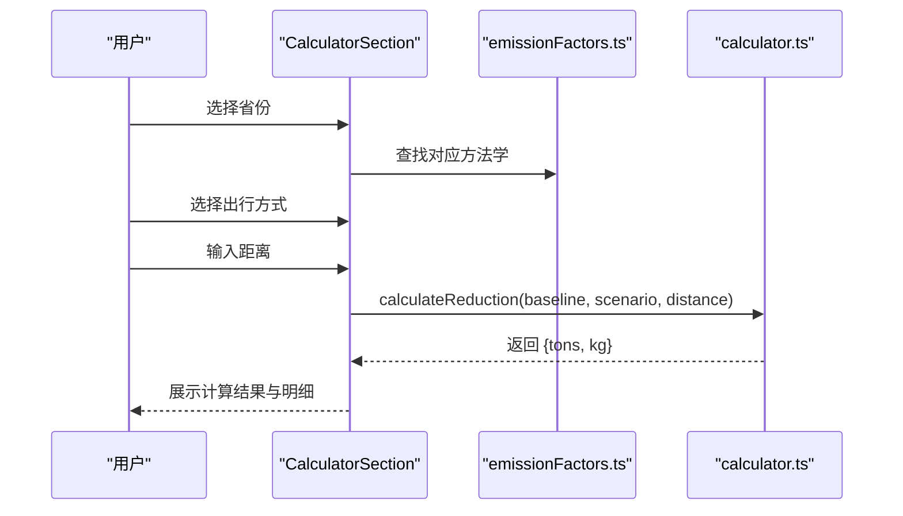

图表来源
- [src/sections/CalculatorSection.tsx:16-161](file://src/sections/CalculatorSection.tsx#L16-L161)
- [src/data/emissionFactors.ts:1-103](file://src/data/emissionFactors.ts#L1-103)
- [src/utils/calculator.ts:1-12](file://src/utils/calculator.ts#L1-L12)

章节来源
- [src/sections/CalculatorSection.tsx:16-161](file://src/sections/CalculatorSection.tsx#L16-L161)

### 资讯板块 NewsSection.tsx：日期筛选与分组
- 筛选
  - 生成最近20天日期选项，支持按日期筛选
- 分组
  - 将新闻按 publishDate 分组并按日期降序排列
- 视觉
  - 使用 SectionCard 包裹，日期标题+列表项的结构

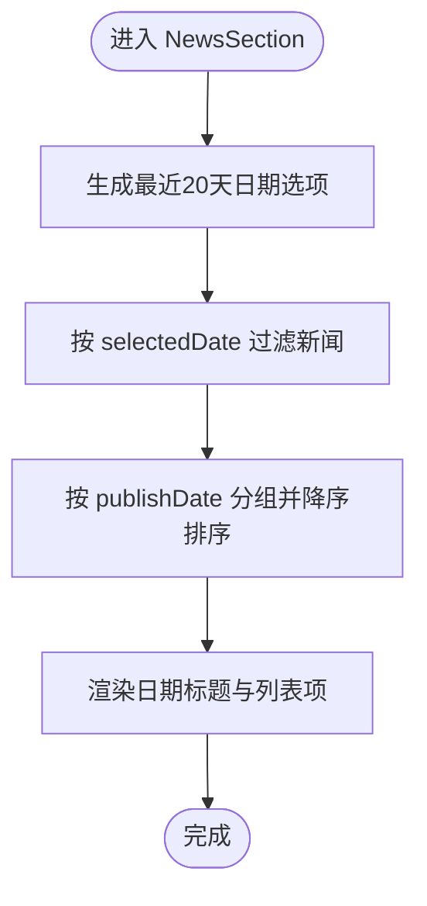

图表来源
- [src/sections/NewsSection.tsx:7-166](file://src/sections/NewsSection.tsx#L7-L166)

章节来源
- [src/sections/NewsSection.tsx:7-166](file://src/sections/NewsSection.tsx#L7-L166)

## 依赖分析
- 组件耦合
  - App.tsx 与四大板块为兄弟关系，通过状态提升实现解耦
  - 各板块内部状态自洽，不反向回传到 App.tsx
- 外部依赖
  - 数据源：policies.ts、carbonPrices.ts、emissionFactors.ts、news.ts
  - 工具：constants.ts（常量）、calculator.ts（纯函数）
  - 类型：types/index.ts（Policy、CarbonProduct、PriceRecord、Methodology、NewsItem）

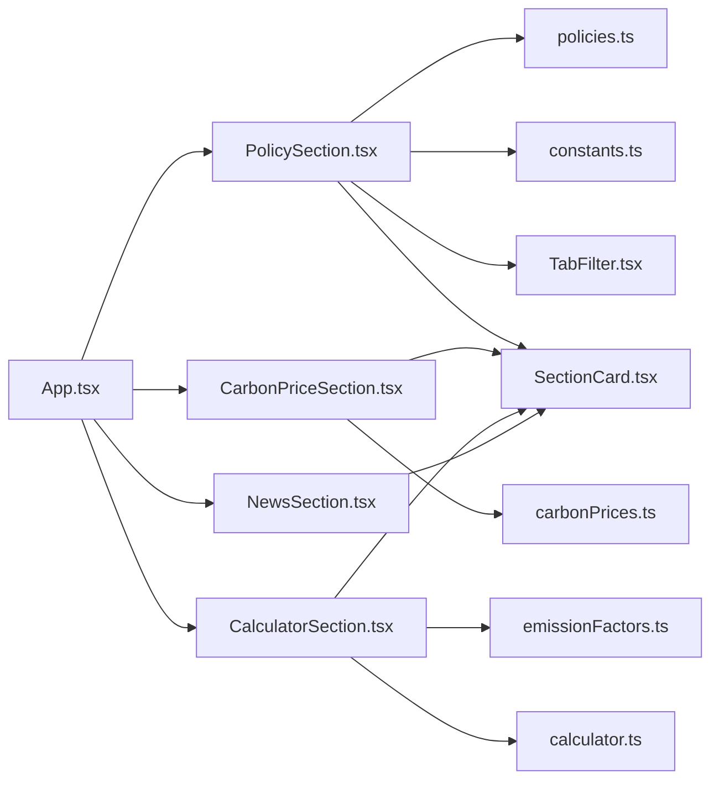

图表来源
- [src/App.tsx:18-59](file://src/App.tsx#L18-L59)
- [src/sections/PolicySection.tsx:1-89](file://src/sections/PolicySection.tsx#L1-L89)
- [src/sections/CarbonPriceSection.tsx:1-42](file://src/sections/CarbonPriceSection.tsx#L1-L42)
- [src/sections/CalculatorSection.tsx:1-161](file://src/sections/CalculatorSection.tsx#L1-L161)
- [src/sections/NewsSection.tsx:1-166](file://src/sections/NewsSection.tsx#L1-L166)
- [src/data/policies.ts:1-345](file://src/data/policies.ts#L1-L345)
- [src/data/carbonPrices.ts:1-103](file://src/data/carbonPrices.ts#L1-L103)
- [src/data/emissionFactors.ts:1-103](file://src/data/emissionFactors.ts#L1-L103)
- [src/utils/constants.ts:1-44](file://src/utils/constants.ts#L1-L44)
- [src/utils/calculator.ts:1-12](file://src/utils/calculator.ts#L1-L12)
- [src/components/TabFilter.tsx:1-32](file://src/components/TabFilter.tsx#L1-L32)
- [src/components/SectionCard.tsx:1-26](file://src/components/SectionCard.tsx#L1-L26)

章节来源
- [src/App.tsx:18-59](file://src/App.tsx#L18-L59)
- [src/sections/PolicySection.tsx:1-89](file://src/sections/PolicySection.tsx#L1-L89)
- [src/sections/CarbonPriceSection.tsx:1-42](file://src/sections/CarbonPriceSection.tsx#L1-L42)
- [src/sections/CalculatorSection.tsx:1-161](file://src/sections/CalculatorSection.tsx#L1-L161)
- [src/sections/NewsSection.tsx:1-166](file://src/sections/NewsSection.tsx#L1-L166)

## 性能考量
- 计算缓存
  - 使用 useMemo 缓存昂贵计算结果（如政策过滤、碳价数据、计算结果），减少不必要的重渲染
- 数据生成
  - 碳价数据通过伪随机算法生成历史曲线，避免真实网络请求带来的延迟
- 渲染优化
  - SectionCard 作为稳定容器，减少布局抖动
  - TabFilter 仅渲染必要按钮，避免过度 DOM

## 故障排查指南
- 导航无效
  - 检查 App.tsx 中 TABS 键值与导航按钮 key 是否一致
  - 确认 onClick 回调是否正确调用 setActiveTab
- 筛选无结果
  - 检查 TabFilter 的 activeValue 与 onChange 是否正确传递至板块状态
  - 确认 filteredPolicies 的过滤条件与数据字段匹配
- 计算器无输出
  - 确认所选省市与出行方式存在有效 baselineFactor 与 scenarioFactor
  - 检查距离输入是否为正数
- 资讯为空
  - 检查 selectedDate 与新闻 publishDate 的格式一致性

章节来源
- [src/App.tsx:29-42](file://src/App.tsx#L29-L42)
- [src/sections/PolicySection.tsx:26-34](file://src/sections/PolicySection.tsx#L26-L34)
- [src/sections/CalculatorSection.tsx:31-34](file://src/sections/CalculatorSection.tsx#L31-L34)
- [src/sections/NewsSection.tsx:24-44](file://src/sections/NewsSection.tsx#L24-L44)

## 结论
本项目通过清晰的组件分层与状态提升策略，实现了导航控制、内容切换与业务模块的解耦。共享组件（SectionCard、TabFilter）提升了复用性与一致性；纯函数工具与数据源分离增强了可测试性与可维护性。建议在后续迭代中进一步引入细粒度的单元测试与端到端测试，以保障复杂交互与数据流的稳定性。

## 附录
- 设计原则
  - 单一职责：每个组件聚焦一个功能域
  - 无状态优先：展示型组件尽量无状态
  - 状态提升：共享状态置于高层组件
  - 可复用性：通过 props 与类型约束提升组件复用能力
  - 可测试性：纯函数与清晰的输入输出便于测试
- 最佳实践
  - 使用 useMemo 优化昂贵计算
  - 使用 TypeScript 类型约束确保数据一致性
  - 将样式与逻辑分离，保持组件简洁