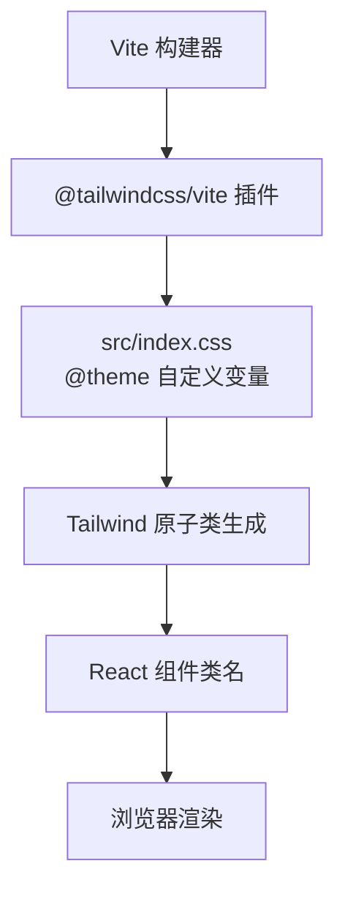
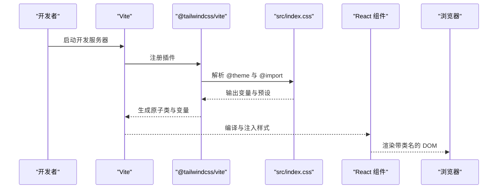
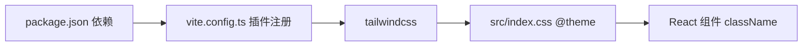

# 样式与主题

<cite>
**本文引用的文件**
- [package.json](file://package.json)
- [vite.config.ts](file://vite.config.ts)
- [src/index.css](file://src/index.css)
- [src/App.css](file://src/App.css)
- [src/App.tsx](file://src/App.tsx)
- [src/components/Header.tsx](file://src/components/Header.tsx)
- [src/components/SectionCard.tsx](file://src/components/SectionCard.tsx)
- [src/components/TabFilter.tsx](file://src/components/TabFilter.tsx)
- [src/components/Badge.tsx](file://src/components/Badge.tsx)
- [src/sections/PolicySection.tsx](file://src/sections/PolicySection.tsx)
- [src/sections/CarbonPriceSection.tsx](file://src/sections/CarbonPriceSection.tsx)
- [src/sections/PriceTable.tsx](file://src/sections/PriceTable.tsx)
- [src/utils/constants.ts](file://src/utils/constants.ts)
</cite>

## 目录
1. [简介](#简介)
2. [项目结构](#项目结构)
3. [核心组件](#核心组件)
4. [架构总览](#架构总览)
5. [详细组件分析](#详细组件分析)
6. [依赖关系分析](#依赖关系分析)
7. [性能考量](#性能考量)
8. [故障排查指南](#故障排查指南)
9. [结论](#结论)
10. [附录](#附录)

## 简介
本文件面向“碳普惠信息代理”项目，系统化梳理其样式与主题体系，覆盖 Tailwind CSS 配置、自定义主题与样式规范、颜色系统、字体与间距、断点与响应式策略、组件样式定制、CSS 变量与动态主题、动画与交互反馈、最佳实践与性能优化、调试与兼容性、无障碍设计以及主题扩展与品牌定制等。

## 项目结构
项目采用 React + Vite + Tailwind CSS v4 的技术栈，样式通过 Vite 插件加载并构建，全局主题变量在入口样式中集中定义，组件层使用原子类与语义化变量组合实现一致的视觉与交互体验。

图表来源
- [vite.config.ts:1-8](file://vite.config.ts#L1-L8)
- [package.json:12-19](file://package.json#L12-L19)
- [src/index.css:1-16](file://src/index.css#L1-L16)

章节来源
- [package.json:12-19](file://package.json#L12-L19)
- [vite.config.ts:1-8](file://vite.config.ts#L1-L8)
- [src/index.css:1-16](file://src/index.css#L1-L16)

## 核心组件
- 主题与基础样式：通过全局样式集中定义颜色、背景、文本、边框、卡片等变量，并在 body、根容器等基础元素上应用。
- 页面骨架：App.tsx 提供顶部导航、主内容区与页脚的整体布局，使用语义化变量控制背景、边框与文字色彩。
- 头部与卡片：Header.tsx 使用渐变背景与品牌色边框；SectionCard.tsx 将标题栏与内容区统一到卡片容器中，复用边框与文本变量。
- 过滤与标签：TabFilter.tsx 使用过渡与悬停状态表达交互反馈；Badge.tsx 使用语义化色板表达状态。
- 数据展示：PolicySection.tsx 与 CarbonPriceSection.tsx 展示网格与表格，结合响应式断点实现多端适配；PriceTable.tsx 使用表头品牌色与行悬停态提升可读性。

章节来源
- [src/index.css:18-30](file://src/index.css#L18-L30)
- [src/App.tsx:22-56](file://src/App.tsx#L22-L56)
- [src/components/Header.tsx:6-25](file://src/components/Header.tsx#L6-L25)
- [src/components/SectionCard.tsx:12-23](file://src/components/SectionCard.tsx#L12-L23)
- [src/components/TabFilter.tsx:19-23](file://src/components/TabFilter.tsx#L19-L23)
- [src/components/Badge.tsx:9-13](file://src/components/Badge.tsx#L9-L13)
- [src/sections/PolicySection.tsx:80-85](file://src/sections/PolicySection.tsx#L80-L85)
- [src/sections/CarbonPriceSection.tsx:21-38](file://src/sections/CarbonPriceSection.tsx#L21-L38)
- [src/sections/PriceTable.tsx:47-53](file://src/sections/PriceTable.tsx#L47-L53)

## 架构总览
Tailwind v4 在本项目中的工作流如下：Vite 启动时加载 @tailwindcss/vite 插件，解析 src/index.css 中的 @theme 声明，生成原子类与变量映射，随后 React 组件通过 className 使用这些变量与工具类进行样式组合。

图表来源
- [vite.config.ts:1-8](file://vite.config.ts#L1-L8)
- [package.json:13-19](file://package.json#L13-L19)
- [src/index.css:1-16](file://src/index.css#L1-L16)

## 详细组件分析

### 主题与颜色系统
- 全局变量：在 src/index.css 的 @theme 中集中声明品牌主色、价格涨跌色、背景、卡片、文本、边框与政府金等变量，形成统一的视觉语言。
- 使用方式：组件通过原子类直接引用变量名（如 primary、card、text-primary），或使用语义化色值（如价格涨跌）。
- 扩展建议：新增品牌色或状态色时，优先在 @theme 中补充变量，再在组件中按需使用，避免硬编码。

章节来源
- [src/index.css:3-16](file://src/index.css#L3-L16)
- [src/components/Header.tsx:6](file://src/components/Header.tsx#L6)
- [src/components/SectionCard.tsx:12-23](file://src/components/SectionCard.tsx#L12-L23)
- [src/sections/PriceTable.tsx:47-53](file://src/sections/PriceTable.tsx#L47-L53)

### 字体与排版规范
- 字体族：在 body 中指定中文优先的字体链，确保在不同平台的一致显示。
- 行高与清晰度：启用 WebKit 与 Firefox 的字体抗锯齿，提升阅读体验。
- 组件内排版：标题、副标题、正文均使用语义化变量控制字号与字重，保持层级清晰。

章节来源
- [src/index.css:20-26](file://src/index.css#L20-L26)
- [src/components/SectionCard.tsx:16-19](file://src/components/SectionCard.tsx#L16-L19)

### 间距与布局标准
- 容器最大宽度：多数容器使用 max-w-7xl 限制内容宽度，保证在大屏下的可读性。
- 内外边距：组件普遍采用 p-4/p-6、px-4/px-6、gap-3/gap-4 等原子间距，形成统一的留白节奏。
- 响应式间距：在小屏下调整 padding 与 gap，确保移动端可触达与可读性。

章节来源
- [src/App.tsx:47](file://src/App.tsx#L47)
- [src/components/SectionCard.tsx:22](file://src/components/SectionCard.tsx#L22)
- [src/App.css:67-71](file://src/App.css#L67-L71)

### 断点与响应式策略
- 断点使用：组件广泛使用 sm/md/lg 等断点修饰符，实现从移动端到桌面端的有序降级。
- 典型场景：
  - 网格布局：在小屏单列、中屏双列、大屏三列之间切换。
  - 导航与卡片：在窄屏下将横向导航转为纵向堆叠，卡片内容自适应。
  - 表格：在小屏开启横向滚动容器，保障数据可读性。

章节来源
- [src/sections/PolicySection.tsx:80-85](file://src/sections/PolicySection.tsx#L80-L85)
- [src/sections/CarbonPriceSection.tsx:21-38](file://src/sections/CarbonPriceSection.tsx#L21-L38)
- [src/App.css:67-71](file://src/App.css#L67-L71)

### 组件样式定制
- 卡片容器：统一使用圆角、阴影与边框，标题区突出主色与图标，内容区提供内边距。
- 导航与标签：使用过渡与悬停态表达交互反馈；选中态强调品牌主色。
- 状态徽标：使用明确的语义化色板表达有效/失效状态，避免歧义。

章节来源
- [src/components/SectionCard.tsx:12-23](file://src/components/SectionCard.tsx#L12-L23)
- [src/components/TabFilter.tsx:19-23](file://src/components/TabFilter.tsx#L19-L23)
- [src/components/Badge.tsx:9-13](file://src/components/Badge.tsx#L9-L13)

### CSS 变量与动态主题
- 变量来源：@theme 定义的变量在组件中以原子类形式使用，实现“变量即主题”的风格。
- 动态切换：当前仓库未实现运行时主题切换逻辑。若需支持深浅色或品牌主题切换，可在 @theme 外层包裹条件块或引入 JS 控制的 CSS 变量注入，并在组件中按需切换类名。

章节来源
- [src/index.css:3-16](file://src/index.css#L3-L16)
- [src/App.tsx:33-37](file://src/App.tsx#L33-L37)

### 动画与过渡
- 悬停与焦点：按钮与链接使用 transition-colors 或 transition 为颜色与阴影变化提供平滑过渡。
- 表格行悬停：hover 背景色变化增强可读性与交互反馈。
- 可访问性：焦点可见性通过 outline 与 outline-offset 明确指示键盘可达目标。

章节来源
- [src/App.css:8](file://src/App.css#L8)
- [src/sections/PriceTable.tsx:24](file://src/sections/PriceTable.tsx#L24)
- [src/App.css:14](file://src/App.css#L14)

### 无障碍设计
- 文本对比度：通过语义化变量确保文本与背景具备基本对比度。
- 键盘可达性：为按钮与链接提供可见焦点环。
- 语义化结构：使用语义化 HTML 与清晰的标题层级，配合组件内的语义化变量命名，提升屏幕阅读器体验。

章节来源
- [src/index.css:21-22](file://src/index.css#L21-L22)
- [src/App.css:14](file://src/App.css#L14)

## 依赖关系分析
- 构建链路：Vite 通过 @tailwindcss/vite 插件加载 Tailwind，解析 src/index.css 的 @theme 并生成原子类。
- 组件依赖：各页面与组件通过 className 引用原子类与变量，形成低耦合的样式组织方式。
- 可能的循环：当前结构为单向依赖（样式 -> 组件），无明显循环依赖风险。

图表来源
- [package.json:13-19](file://package.json#L13-L19)
- [vite.config.ts:1-8](file://vite.config.ts#L1-L8)
- [src/index.css:1-16](file://src/index.css#L1-L16)

章节来源
- [package.json:13-19](file://package.json#L13-L19)
- [vite.config.ts:1-8](file://vite.config.ts#L1-L8)
- [src/index.css:1-16](file://src/index.css#L1-L16)

## 性能考量
- 原子类体积：Tailwind v4 通过按需扫描减少未使用类，建议保持组件类名简洁，避免冗余组合。
- 变量复用：在 @theme 中集中管理颜色与尺寸，减少重复定义，降低构建体积。
- 响应式断点：仅在必要处使用断点修饰符，避免过度嵌套与重复规则。
- 图标与图表：Lucide React 与 Recharts 已按需引入，注意避免在小屏加载过大数据集导致渲染压力。

## 故障排查指南
- 样式不生效
  - 检查是否正确引入 @import "tailwindcss" 与 @theme 声明。
  - 确认 Vite 插件已注册 @tailwindcss/vite。
- 变量未识别
  - 确保变量名拼写与 @theme 中一致，且组件类名中使用的是变量名而非硬编码值。
- 响应式异常
  - 检查断点修饰符是否正确，确认容器宽度与 max-w-* 是否符合预期。
- 交互反馈缺失
  - 确认 hover/focus 类名存在且未被覆盖，检查 transition 属性是否生效。

章节来源
- [src/index.css:1-16](file://src/index.css#L1-L16)
- [vite.config.ts:1-8](file://vite.config.ts#L1-L8)
- [src/App.css:8](file://src/App.css#L8)

## 结论
本项目以 Tailwind v4 为核心，通过 @theme 集中定义主题变量，配合原子类与语义化变量在组件中实现一致的视觉与交互体验。整体结构清晰、可维护性强，具备良好的扩展性与响应式表现。后续可在保持现有约定的前提下，逐步完善动态主题切换、无障碍细节与性能优化策略。

## 附录

### 常用变量与类名速览
- 颜色变量：primary、primary-light、primary-dark、price-up、price-down、bg、card、text-primary、text-secondary、border、gov-gold
- 布局变量：max-w-7xl、gap、p-*/px-*、py-*/px-*
- 交互变量：transition-colors、hover:*、focus-visible:*、shadow-*、rounded-*

章节来源
- [src/index.css:3-16](file://src/index.css#L3-L16)
- [src/App.tsx:26-44](file://src/App.tsx#L26-L44)