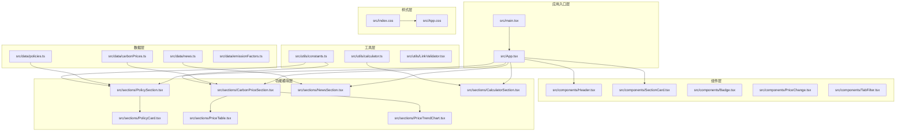
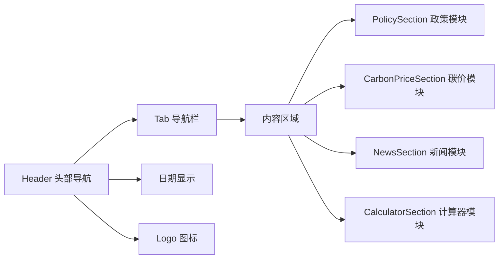
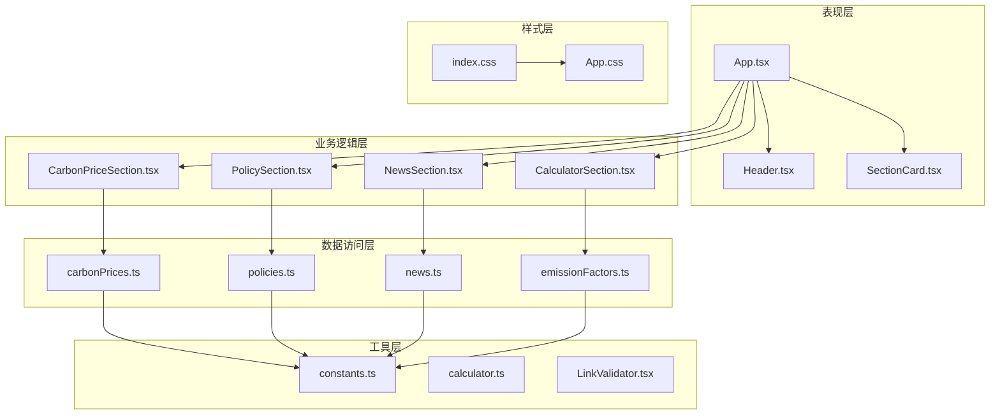
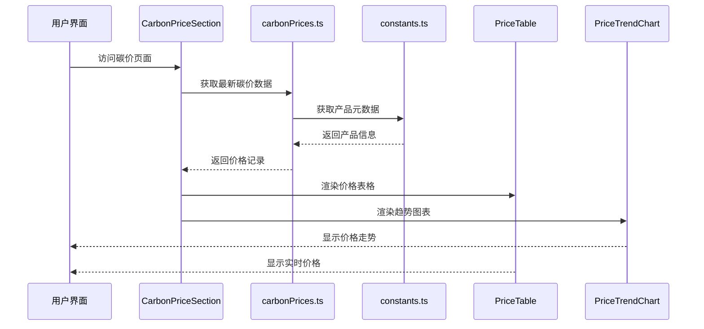
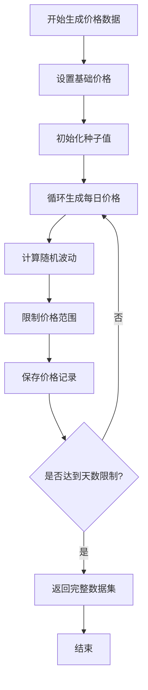
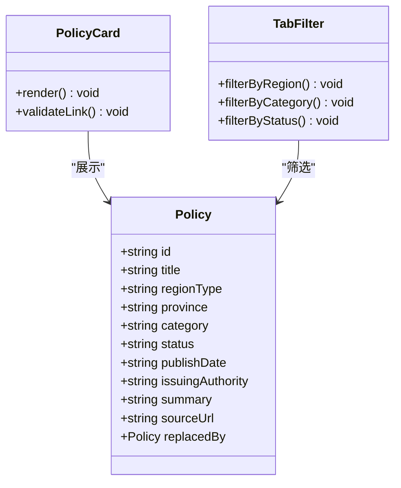
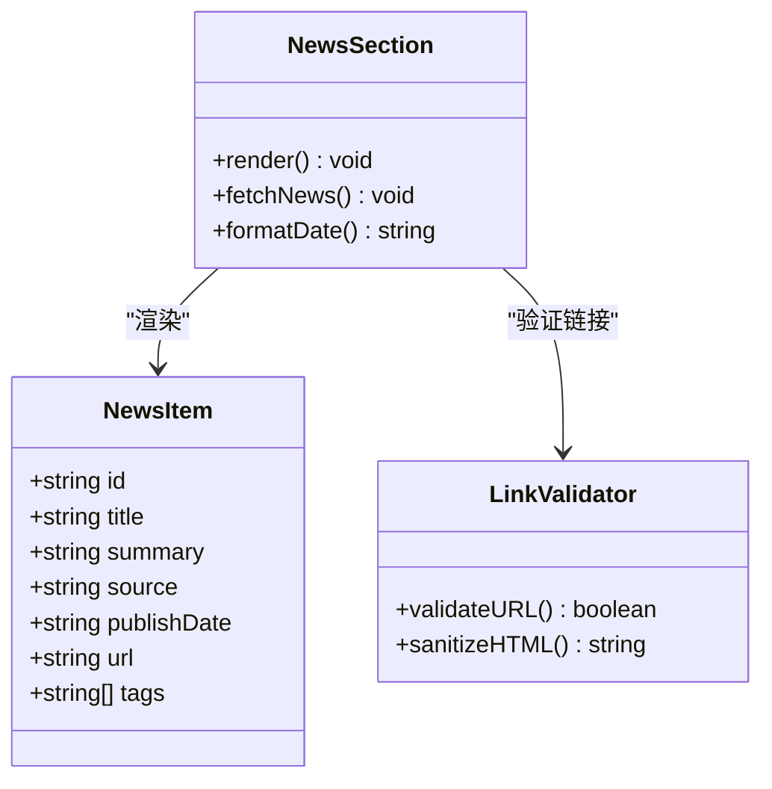
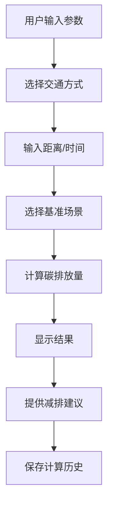
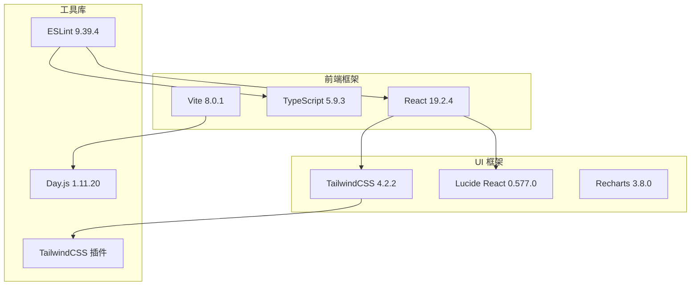

# 政府蓝主题样式

<cite>
**本文档引用的文件**
- [README.md](file://README.md)
- [package.json](file://package.json)
- [vite.config.ts](file://vite.config.ts)
- [src/index.css](file://src/index.css)
- [src/App.css](file://src/App.css)
- [src/App.tsx](file://src/App.tsx)
- [src/components/Header.tsx](file://src/components/Header.tsx)
- [src/components/SectionCard.tsx](file://src/components/SectionCard.tsx)
- [src/sections/CarbonPriceSection.tsx](file://src/sections/CarbonPriceSection.tsx)
- [src/data/carbonPrices.ts](file://src/data/carbonPrices.ts)
- [src/types/index.ts](file://src/types/index.ts)
- [src/utils/constants.ts](file://src/utils/constants.ts)
</cite>

## 目录
1. [简介](#简介)
2. [项目结构](#项目结构)
3. [核心组件](#核心组件)
4. [架构概览](#架构概览)
5. [详细组件分析](#详细组件分析)
6. [依赖关系分析](#依赖关系分析)
7. [性能考虑](#性能考虑)
8. [故障排除指南](#故障排除指南)
9. [结论](#结论)

## 简介

这是一个基于 React + TypeScript + Vite 构建的碳普惠信息服务平台，采用政府蓝主题样式设计。项目实现了碳价格查询、政策法规、新闻资讯和碳计算器等功能模块，为用户提供全面的碳市场信息服务。

该平台使用 TailwindCSS 作为样式框架，通过自定义 CSS 变量实现统一的主题色彩系统，包括政府蓝主色调、金色点缀色等，营造专业、权威的政府服务形象。

## 项目结构

项目采用模块化组织方式，主要分为以下几个层次：

**图表来源**
- [src/App.tsx:1-60](file://src/App.tsx#L1-L60)
- [src/components/Header.tsx:1-28](file://src/components/Header.tsx#L1-L28)
- [src/sections/CarbonPriceSection.tsx:1-42](file://src/sections/CarbonPriceSection.tsx#L1-L42)

**章节来源**
- [README.md:1-74](file://README.md#L1-L74)
- [package.json:1-40](file://package.json#L1-L40)
- [vite.config.ts:1-8](file://vite.config.ts#L1-L8)

## 核心组件

### 主题色彩系统

项目采用统一的政府蓝主题色彩方案，通过 CSS 自定义属性实现全局色彩管理：

| 色彩类别 | 颜色值 | 使用场景 |
|---------|--------|----------|
| 主色调 | #1565C0 | 导航栏、按钮、重要信息 |
| 深蓝色 | #0D47A1 | 导航栏渐变深色端 |
| 浅蓝色 | #E3F2FD | 背景辅助色 |
| 价格上升 | #C62828 | 碳价上涨标识 |
| 价格下降 | #2E7D32 | 碳价下跌标识 |
| 背景色 | #F0F4F8 | 页面背景 |
| 卡片色 | #FFFFFF | 内容卡片背景 |
| 文本主色 | #1A237E | 主要文本颜色 |
| 文本次色 | #546E7A | 次要文本颜色 |
| 边框色 | #BBDEFB | 分割线和边框 |
| 金色 | #B8860B | 强调色和装饰色 |

### 应用布局组件

应用采用响应式布局设计，支持桌面端和移动端访问：

**图表来源**
- [src/App.tsx:18-59](file://src/App.tsx#L18-L59)
- [src/components/Header.tsx:4-27](file://src/components/Header.tsx#L4-L27)

**章节来源**
- [src/index.css:3-16](file://src/index.css#L3-L16)
- [src/App.tsx:18-59](file://src/App.tsx#L18-L59)
- [src/components/Header.tsx:4-27](file://src/components/Header.tsx#L4-L27)

## 架构概览

系统采用分层架构设计，各层职责清晰分离：

**图表来源**
- [src/App.tsx:1-60](file://src/App.tsx#L1-L60)
- [src/sections/CarbonPriceSection.tsx:1-42](file://src/sections/CarbonPriceSection.tsx#L1-L42)
- [src/data/carbonPrices.ts:1-103](file://src/data/carbonPrices.ts#L1-L103)

## 详细组件分析

### 碳价查询模块

碳价查询模块是系统的核心功能之一，提供实时碳价信息和趋势分析：

**图表来源**
- [src/sections/CarbonPriceSection.tsx:8-41](file://src/sections/CarbonPriceSection.tsx#L8-L41)
- [src/data/carbonPrices.ts:55-83](file://src/data/carbonPrices.ts#L55-L83)
- [src/utils/constants.ts:26-44](file://src/utils/constants.ts#L26-L44)

#### 数据生成算法

系统使用伪随机数生成器模拟碳价波动：

**图表来源**
- [src/data/carbonPrices.ts:5-17](file://src/data/carbonPrices.ts#L5-L17)

**章节来源**
- [src/sections/CarbonPriceSection.tsx:1-42](file://src/sections/CarbonPriceSection.tsx#L1-L42)
- [src/data/carbonPrices.ts:1-103](file://src/data/carbonPrices.ts#L1-L103)
- [src/utils/constants.ts:1-44](file://src/utils/constants.ts#L1-L44)

### 政策法规模块

政策模块提供碳普惠相关的政策法规查询功能：

**图表来源**
- [src/types/index.ts:2-14](file://src/types/index.ts#L2-L14)
- [src/sections/PolicyCard.tsx:1-200](file://src/sections/PolicyCard.tsx#L1-L200)
- [src/components/TabFilter.tsx:1-200](file://src/components/TabFilter.tsx#L1-L200)

**章节来源**
- [src/types/index.ts:1-65](file://src/types/index.ts#L1-L65)
- [src/utils/constants.ts:14-24](file://src/utils/constants.ts#L14-L24)

### 新闻资讯模块

新闻模块集成最新的碳市场相关新闻和政策动态：

**图表来源**
- [src/types/index.ts:55-65](file://src/types/index.ts#L55-L65)
- [src/sections/NewsSection.tsx:1-200](file://src/sections/NewsSection.tsx#L1-L200)
- [src/components/LinkValidator.tsx:1-200](file://src/components/LinkValidator.tsx#L1-L200)

**章节来源**
- [src/types/index.ts:55-65](file://src/types/index.ts#L55-L65)

### 碳计算器模块

计算器模块提供碳排放量计算功能：

**图表来源**
- [src/sections/CalculatorSection.tsx:1-200](file://src/sections/CalculatorSection.tsx#L1-L200)
- [src/utils/calculator.ts:1-200](file://src/utils/calculator.ts#L1-L200)

**章节来源**
- [src/sections/CalculatorSection.tsx:1-200](file://src/sections/CalculatorSection.tsx#L1-L200)
- [src/utils/calculator.ts:1-200](file://src/utils/calculator.ts#L1-L200)

## 依赖关系分析

项目使用现代化的技术栈构建，主要依赖关系如下：

**图表来源**
- [package.json:15-38](file://package.json#L15-L38)

**章节来源**
- [package.json:1-40](file://package.json#L1-L40)
- [vite.config.ts:1-8](file://vite.config.ts#L1-L8)

## 性能考虑

### 样式优化策略

1. **CSS 变量缓存**: 使用 CSS 自定义属性减少重复定义
2. **Tailwind 实用类**: 通过原子化 CSS 提高样式复用性
3. **条件渲染**: 按需加载不同模块内容
4. **懒加载**: 图表组件采用延迟加载机制

### 数据处理优化

1. **内存缓存**: 使用 useMemo 缓存计算结果
2. **虚拟滚动**: 大列表采用虚拟化渲染
3. **防抖处理**: 输入框搜索添加防抖机制
4. **数据分页**: 新闻和政策列表实现分页加载

## 故障排除指南

### 常见问题及解决方案

| 问题类型 | 症状描述 | 解决方案 |
|---------|----------|----------|
| 样式不生效 | 政府蓝主题颜色异常 | 检查 CSS 变量定义和导入顺序 |
| 组件渲染错误 | 页面空白或报错 | 检查 TypeScript 类型定义 |
| 数据加载失败 | 碳价数据为空 | 验证 API 接口和网络连接 |
| 图表显示异常 | 折线图不显示 | 检查 Recharts 版本兼容性 |

### 开发环境调试

1. **启用开发工具**: 使用 React DevTools 进行组件调试
2. **控制台日志**: 添加必要的调试信息输出
3. **类型检查**: 运行 TypeScript 类型检查命令
4. **样式验证**: 使用浏览器开发者工具检查 CSS 变量

**章节来源**
- [src/index.css:1-31](file://src/index.css#L1-L31)
- [src/App.css:1-185](file://src/App.css#L1-L185)

## 结论

该政府蓝主题样式项目成功实现了专业的碳普惠信息服务界面，具有以下特点：

1. **统一的主题设计**: 通过政府蓝主色调和金色点缀营造权威感
2. **模块化架构**: 清晰的功能模块划分便于维护和扩展
3. **响应式设计**: 支持多终端访问体验
4. **性能优化**: 采用多种优化策略确保流畅的用户体验

项目为政府部门和企业提供了一个专业、可靠、易用的碳市场信息服务窗口，有助于推动碳普惠事业的发展。