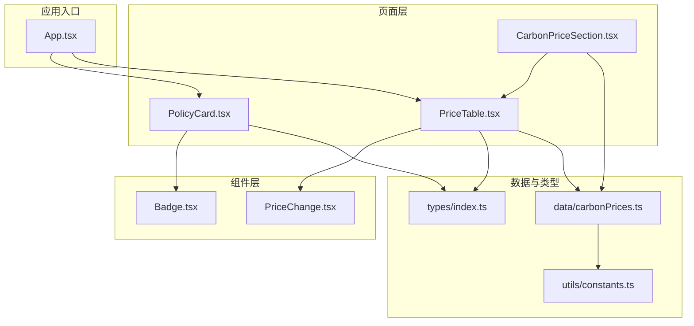
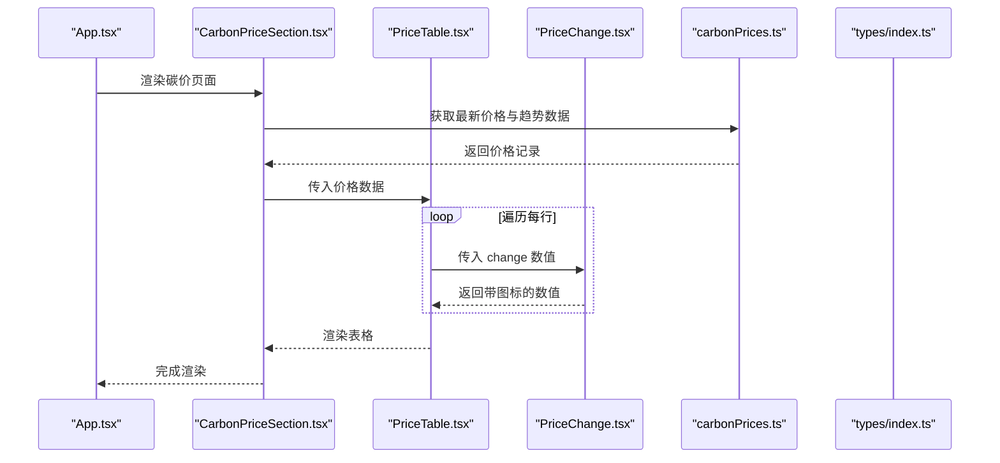
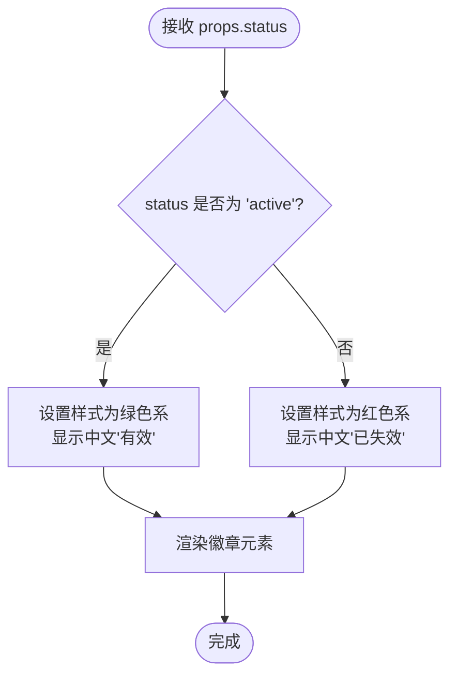
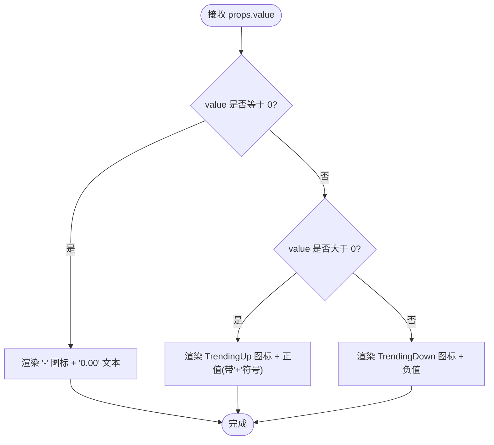
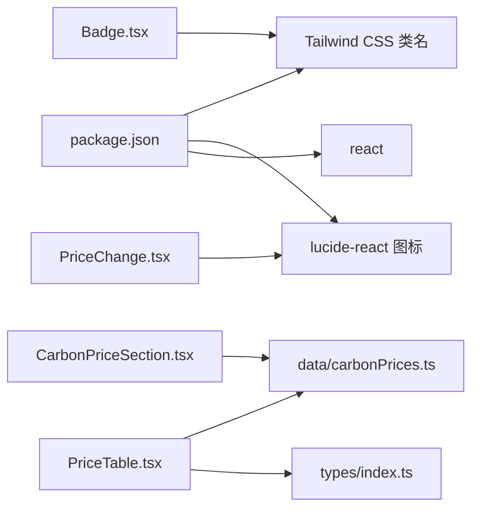

# 展示组件

<cite>
**本文引用的文件**
- [Badge.tsx](file://src/components/Badge.tsx)
- [PriceChange.tsx](file://src/components/PriceChange.tsx)
- [PolicyCard.tsx](file://src/sections/PolicyCard.tsx)
- [PriceTable.tsx](file://src/sections/PriceTable.tsx)
- [CarbonPriceSection.tsx](file://src/sections/CarbonPriceSection.tsx)
- [index.ts](file://src/types/index.ts)
- [constants.ts](file://src/utils/constants.ts)
- [carbonPrices.ts](file://src/data/carbonPrices.ts)
- [App.tsx](file://src/App.tsx)
- [package.json](file://package.json)
</cite>

## 目录
1. [简介](#简介)
2. [项目结构](#项目结构)
3. [核心组件](#核心组件)
4. [架构总览](#架构总览)
5. [组件详解](#组件详解)
6. [依赖关系分析](#依赖关系分析)
7. [性能考量](#性能考量)
8. [故障排查指南](#故障排查指南)
9. [结论](#结论)
10. [附录](#附录)

## 简介
本文件聚焦于两个展示型组件：Badge 徽章与 PriceChange 价格变化。前者用于状态标识与标签分类，后者用于价格趋势与数值变化的可视化展示。文档从设计模式、实现细节、属性配置、样式定制、主题适配、可访问性、响应式设计与性能优化等维度进行系统化说明，并结合真实业务场景给出使用建议与最佳实践。

## 项目结构
本项目采用按功能分层的组织方式，展示组件位于 components 目录，业务页面位于 sections 目录，类型定义位于 types 目录，数据生成逻辑位于 data 目录，工具常量位于 utils 目录，应用入口位于根目录。

图表来源
- [App.tsx:18-59](file://src/App.tsx#L18-L59)
- [PolicyCard.tsx:1-67](file://src/sections/PolicyCard.tsx#L1-L67)
- [PriceTable.tsx:1-41](file://src/sections/PriceTable.tsx#L1-L41)
- [CarbonPriceSection.tsx:1-41](file://src/sections/CarbonPriceSection.tsx#L1-L41)
- [Badge.tsx:1-19](file://src/components/Badge.tsx#L1-L19)
- [PriceChange.tsx:1-33](file://src/components/PriceChange.tsx#L1-L33)
- [index.ts:1-65](file://src/types/index.ts#L1-L65)
- [constants.ts:1-44](file://src/utils/constants.ts#L1-L44)
- [carbonPrices.ts:1-103](file://src/data/carbonPrices.ts#L1-L103)

章节来源
- [App.tsx:1-60](file://src/App.tsx#L1-L60)
- [package.json:1-36](file://package.json#L1-L36)

## 核心组件
本节概述两个组件的职责与交互关系：
- Badge：根据状态渲染不同颜色与文案的徽章，用于政策卡片中的“有效/已失效”标识。
- PriceChange：根据数值正负展示上涨/下跌图标与数值，用于价格表中的变化列。

章节来源
- [Badge.tsx:1-19](file://src/components/Badge.tsx#L1-L19)
- [PriceChange.tsx:1-33](file://src/components/PriceChange.tsx#L1-L33)

## 架构总览
下图展示了应用中这两个组件的典型调用链路与数据流。

图表来源
- [App.tsx:47-51](file://src/App.tsx#L47-L51)
- [CarbonPriceSection.tsx:8-11](file://src/sections/CarbonPriceSection.tsx#L8-L11)
- [PriceTable.tsx:18-41](file://src/sections/PriceTable.tsx#L18-L41)
- [PriceChange.tsx:7-32](file://src/components/PriceChange.tsx#L7-L32)
- [carbonPrices.ts:55-83](file://src/data/carbonPrices.ts#L55-L83)
- [index.ts:27-37](file://src/types/index.ts#L27-L37)

## 组件详解

### Badge 徽章组件
- 设计模式
  - 纯函数组件 + 条件渲染：根据状态选择样式类与文案。
  - 语义化标签：使用语义化的 span 元素承载徽章内容。
- 状态标识
  - 支持两种状态：active（有效）、expired（已失效）。
  - 不同状态对应不同的背景色与文字色，便于快速识别。
- 标签分类
  - 作为政策卡片右上角的标签，配合卡片整体布局使用。
- 视觉样式系统
  - 尺寸规格：紧凑内边距与小字号，适合嵌入到标题或列表中。
  - 颜色编码：通过 Tailwind 类名实现颜色映射，保持与主题一致。
  - 动画效果：当前版本未引入额外动画，但具备过渡类名扩展空间。
- 可访问性
  - 使用语义化元素与清晰的文本内容，确保屏幕阅读器可读。
- 响应式设计
  - 采用紧凑尺寸与弹性布局，适合在不同屏幕宽度下显示。
- 性能优化
  - 无副作用，渲染开销极低；可直接复用，避免重复计算。

图表来源
- [Badge.tsx:5-18](file://src/components/Badge.tsx#L5-L18)

章节来源
- [Badge.tsx:1-19](file://src/components/Badge.tsx#L1-L19)
- [PolicyCard.tsx:9-30](file://src/sections/PolicyCard.tsx#L9-L30)

### PriceChange 价格变化组件
- 设计模式
  - 纯函数组件 + 条件渲染：根据数值正负选择图标与颜色。
  - 图标驱动：使用 lucide-react 的 TrendingUp/TrendingDown/Minus 提升可读性。
- 价格趋势展示
  - value 为 0：显示横线图标与固定数值“0.00”，表示无变化。
  - value > 0：显示上涨图标与正值（带加号），颜色为价格上涨色。
  - value < 0：显示下跌图标与负值，颜色为价格下跌色。
- 数值计算与格式化
  - 使用固定两位小数格式化输出，保证对齐与一致性。
- 动态更新机制
  - 由父组件传入实时变化值，组件内部不维护状态，利于外部统一管理。
- 可访问性
  - 图标通过 className 控制尺寸，文本包含数值，屏幕阅读器可读。
- 响应式设计
  - 固定小尺寸图标与紧凑布局，适合在表格列中使用。
- 性能优化
  - 无状态组件，渲染路径短；数值格式化仅在必要时执行。

图表来源
- [PriceChange.tsx:7-32](file://src/components/PriceChange.tsx#L7-L32)

章节来源
- [PriceChange.tsx:1-33](file://src/components/PriceChange.tsx#L1-L33)
- [PriceTable.tsx:32-32](file://src/sections/PriceTable.tsx#L32-L32)

## 依赖关系分析
- 组件依赖
  - Badge 依赖于 Tailwind 类名实现样式，无第三方依赖。
  - PriceChange 依赖 lucide-react 的图标库，用于趋势可视化。
- 数据依赖
  - PriceTable 依赖 types 中的价格记录类型与 data 层的数据生成逻辑。
  - CarbonPriceSection 依赖 data 层提供的最新价格与趋势数据。
- 外部依赖
  - package.json 显示项目使用 react、react-dom、lucide-react、tailwindcss 等依赖。

图表来源
- [Badge.tsx:1-19](file://src/components/Badge.tsx#L1-L19)
- [PriceChange.tsx:1-33](file://src/components/PriceChange.tsx#L1-L33)
- [PriceTable.tsx:1-41](file://src/sections/PriceTable.tsx#L1-L41)
- [carbonPrices.ts:1-103](file://src/data/carbonPrices.ts#L1-L103)
- [index.ts:27-37](file://src/types/index.ts#L27-L37)
- [package.json:12-19](file://package.json#L12-L19)

章节来源
- [package.json:1-36](file://package.json#L1-L36)

## 性能考量
- 渲染路径
  - 两个组件均为纯函数组件，无内部状态，渲染路径短，性能开销低。
- 计算复杂度
  - Badge 为 O(1)，PriceChange 为 O(1)，均不随数据规模增长而增加。
- 外部依赖
  - lucide-react 图标体积较小，按需引入即可满足需求。
- 优化建议
  - 在大量数据渲染场景中，建议结合虚拟化或分页策略减少重排。
  - 对频繁更新的数值，可在父组件进行必要的防抖或节流处理。

## 故障排查指南
- Badge 文案与颜色不符
  - 检查传入的 status 是否为 'active' 或 'expired'，确保大小写与枚举一致。
  - 确认 Tailwind 类名拼写正确，颜色变量是否在主题中定义。
- PriceChange 图标不显示
  - 确认 lucide-react 已安装且版本兼容。
  - 检查组件的 className 是否被覆盖或冲突。
- 数值格式异常
  - 确保传入的 value 为数字类型，避免字符串导致格式化错误。
  - 如需自定义精度，可在父组件进行预处理后再传入。
- 表格列对齐问题
  - PriceChange 默认使用固定小数位，若与其他列对齐不一致，可在父组件统一格式化。

章节来源
- [Badge.tsx:5-18](file://src/components/Badge.tsx#L5-L18)
- [PriceChange.tsx:7-32](file://src/components/PriceChange.tsx#L7-L32)
- [PriceTable.tsx:22-41](file://src/sections/PriceTable.tsx#L22-L41)

## 结论
Badge 与 PriceChange 作为轻量级展示组件，分别承担状态标识与价格趋势展示的核心职责。它们以纯函数组件的形式实现，具备良好的可维护性与可扩展性。通过合理的属性设计与样式系统，能够满足多种业务场景下的信息传达需求。建议在实际使用中结合主题与可访问性要求，持续优化渲染性能与用户体验。

## 附录

### 属性配置与样式定制
- Badge
  - 属性：status（'active' | 'expired'）
  - 样式：通过 Tailwind 类名控制颜色与尺寸，支持主题扩展
- PriceChange
  - 属性：value（number）
  - 样式：根据正负值切换颜色与图标，支持主题扩展

章节来源
- [Badge.tsx:1-3](file://src/components/Badge.tsx#L1-L3)
- [PriceChange.tsx:3-5](file://src/components/PriceChange.tsx#L3-L5)

### 主题适配选项
- 颜色映射
  - Badge：有效/失效分别映射至绿色系与红色系，可通过主题变量替换。
  - PriceChange：上涨/下跌分别映射至价格上涨色与价格下跌色，可通过主题变量替换。
- 字体与尺寸
  - 组件使用紧凑字号与内边距，适配多场景嵌入；如需调整，可在父组件容器中统一设置。

章节来源
- [Badge.tsx:8-16](file://src/components/Badge.tsx#L8-L16)
- [PriceChange.tsx:19-22](file://src/components/PriceChange.tsx#L19-L22)

### 使用场景与最佳实践
- 政策卡片
  - 在 PolicyCard 中使用 Badge 展示政策状态，提升可读性与对比度。
  - 建议与卡片悬停阴影、边框状态联动，增强交互反馈。
- 价格表格
  - 在 PriceTable 中使用 PriceChange 展示每日变化，统一数值格式与对齐。
  - 建议在父组件中对数据进行缓存与去抖，避免频繁重渲染。
- 价格趋势图
  - 在 CarbonPriceSection 中结合趋势图展示历史走势，组件负责当前变化的展示。

章节来源
- [PolicyCard.tsx:9-30](file://src/sections/PolicyCard.tsx#L9-L30)
- [PriceTable.tsx:18-41](file://src/sections/PriceTable.tsx#L18-L41)
- [CarbonPriceSection.tsx:8-11](file://src/sections/CarbonPriceSection.tsx#L8-L11)