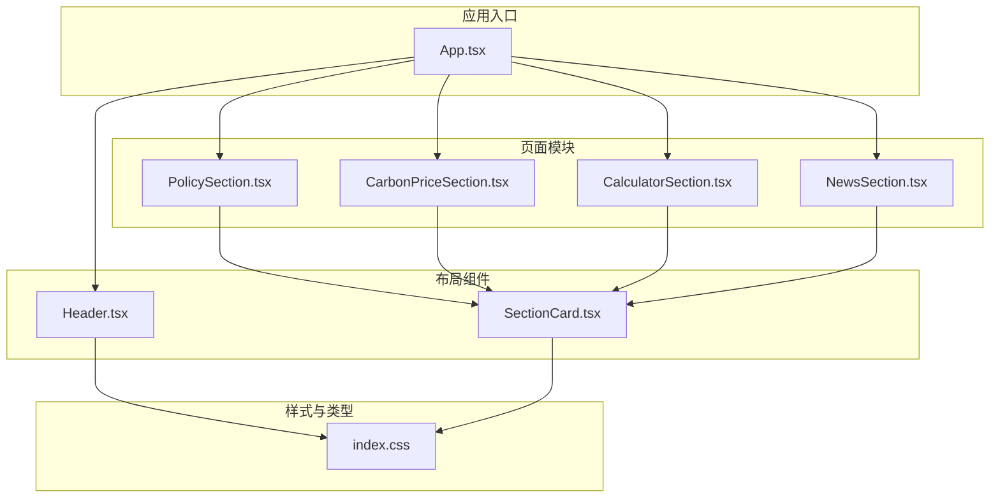
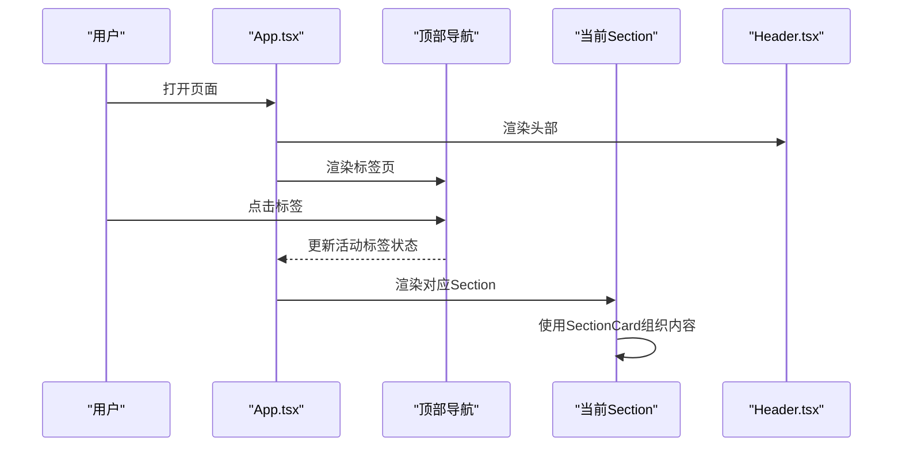
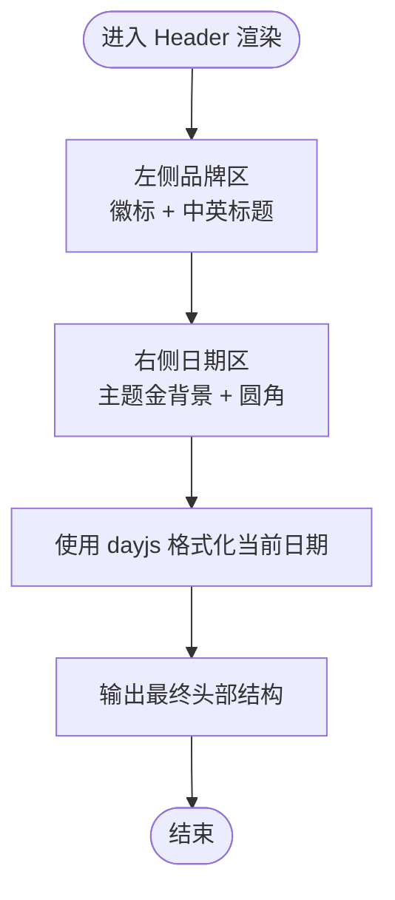
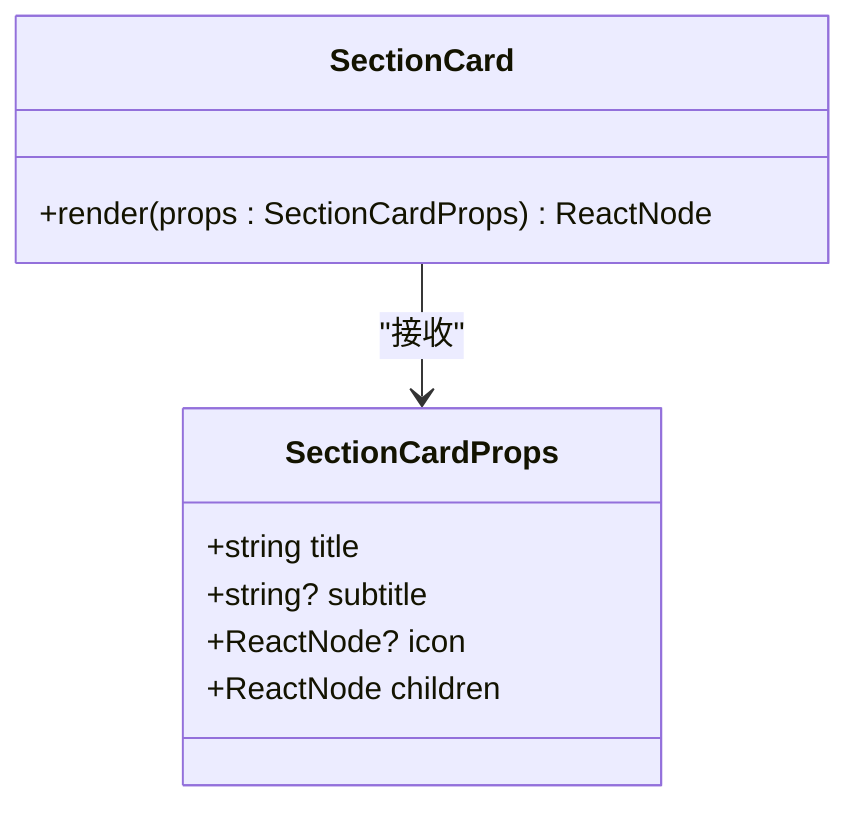
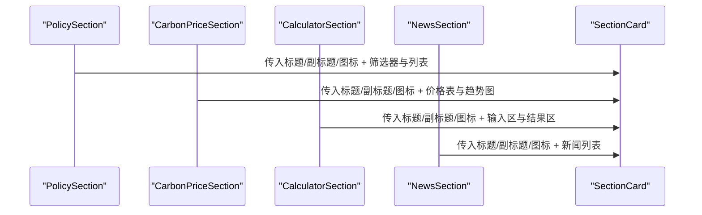
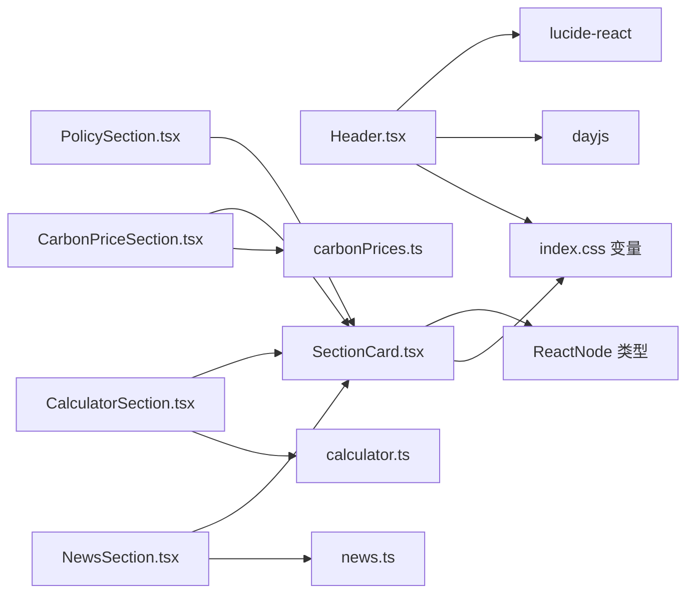

# 布局组件

<cite>
**本文引用的文件**
- [src/components/Header.tsx](file://src/components/Header.tsx)
- [src/components/SectionCard.tsx](file://src/components/SectionCard.tsx)
- [src/App.tsx](file://src/App.tsx)
- [src/index.css](file://src/index.css)
- [src/sections/PolicySection.tsx](file://src/sections/PolicySection.tsx)
- [src/sections/CarbonPriceSection.tsx](file://src/sections/CarbonPriceSection.tsx)
- [src/sections/CalculatorSection.tsx](file://src/sections/CalculatorSection.tsx)
- [src/sections/NewsSection.tsx](file://src/sections/NewsSection.tsx)
- [src/utils/calculator.ts](file://src/utils/calculator.ts)
- [src/data/carbonPrices.ts](file://src/data/carbonPrices.ts)
- [src/data/news.ts](file://src/data/news.ts)
</cite>

## 目录
1. [简介](#简介)
2. [项目结构](#项目结构)
3. [核心组件](#核心组件)
4. [架构总览](#架构总览)
5. [详细组件分析](#详细组件分析)
6. [依赖分析](#依赖分析)
7. [性能考量](#性能考量)
8. [故障排查指南](#故障排查指南)
9. [结论](#结论)
10. [附录](#附录)

## 简介
本文件聚焦于布局组件中的 Header 头部组件与 SectionCard 区块卡片组件，系统阐述其设计理念、实现细节与使用方式。Header 负责品牌展示、日期显示与视觉设计规范；SectionCard 提供区块容器、标题与副标题、图标以及内容区的统一样式与布局。文档同时覆盖属性配置、事件处理与状态管理机制，并给出在不同业务场景下的使用示例与最佳实践，涵盖可访问性、性能优化与跨浏览器兼容性建议。

## 项目结构
- 组件层：Header、SectionCard 位于 components 目录，作为通用布局组件被页面模块复用。
- 页面层：App 中通过导航切换不同 Section 模块；各 Section（如 PolicySection、CarbonPriceSection、CalculatorSection、NewsSection）内部使用 SectionCard 进行内容分组与展示。
- 样式层：index.css 定义主题变量与全局字体、背景等基础样式；组件内使用 Tailwind 类名进行布局与风格控制。
- 数据与工具：carbonPrices.ts、news.ts 提供示例数据；calculator.ts 提供计算逻辑，供计算器场景使用。

图表来源
- [src/App.tsx:18-59](file://src/App.tsx#L18-L59)
- [src/components/Header.tsx:4-27](file://src/components/Header.tsx#L4-L27)
- [src/components/SectionCard.tsx:10-25](file://src/components/SectionCard.tsx#L10-L25)
- [src/index.css:3-16](file://src/index.css#L3-L16)

章节来源
- [src/App.tsx:18-59](file://src/App.tsx#L18-L59)
- [src/index.css:3-16](file://src/index.css#L3-L16)

## 核心组件
- Header 组件
  - 功能：品牌标识展示、当前日期显示、政府蓝配色与金色边框装饰。
  - 视觉规范：渐变背景、阴影、边框强调；图标尺寸与文字排版遵循一致性。
  - 日期逻辑：使用 dayjs 格式化当前日期，无需外部传参。
- SectionCard 组件
  - 功能：提供带标题、副标题与图标的区块容器，内部内容区域统一留白。
  - 可选图标：支持传入任意 ReactNode 图标，默认使用主色渲染。
  - 结构：标题区（含图标与标题/副标题）+ 内容区（p-6），便于在各 Section 中复用。

章节来源
- [src/components/Header.tsx:4-27](file://src/components/Header.tsx#L4-L27)
- [src/components/SectionCard.tsx:3-8](file://src/components/SectionCard.tsx#L3-L8)
- [src/components/SectionCard.tsx:10-25](file://src/components/SectionCard.tsx#L10-L25)

## 架构总览
Header 作为全局头部横幅，贯穿整个应用；SectionCard 作为页面模块的通用容器，承载各类业务内容。App 通过状态管理控制顶部标签页切换，不同 Section 在各自容器中组织数据与交互。

图表来源
- [src/App.tsx:18-59](file://src/App.tsx#L18-L59)
- [src/components/Header.tsx:4-27](file://src/components/Header.tsx#L4-L27)
- [src/components/SectionCard.tsx:10-25](file://src/components/SectionCard.tsx#L10-L25)

## 详细组件分析

### Header 组件
- 设计理念
  - 强调政府蓝色系品牌识别，辅以金色边框突出权威感。
  - 左侧品牌区包含徽标与中英双语标题，右侧显示当前日期，形成信息密度适中的头部布局。
- 实现要点
  - 渐变背景与阴影增强层级感；边框使用主题金，强化品牌识别。
  - 图标采用 lucide-react 的 Building2，尺寸固定为中等规格。
  - 日期格式化由 dayjs 完成，确保本地化日期显示。
- 视觉设计规范
  - 颜色：主色、浅主色、深主色、背景、卡片、文本主次色、边框、政府金。
  - 字体：无特殊声明时使用全局字体族，字号与字重保持一致。
  - 响应式：容器最大宽度约束，左右间距与元素对齐在移动端保持可读性。
- 属性与事件
  - 当前实现不接收任何 props，内部状态完全由组件自身生成。
  - 无事件回调或状态管理需求，适合直接嵌入应用根布局。
- 使用示例
  - 在 App.tsx 中直接引入并放置于导航上方，即可完成全局头部渲染。
- 最佳实践
  - 如需国际化日期或品牌文案，请在组件外层封装或通过 i18n 库注入。
  - 若需动态品牌徽标或标题，建议通过 props 注入，以便复用与测试。

图表来源
- [src/components/Header.tsx:4-27](file://src/components/Header.tsx#L4-L27)
- [src/index.css:3-16](file://src/index.css#L3-L16)

章节来源
- [src/components/Header.tsx:4-27](file://src/components/Header.tsx#L4-L27)
- [src/index.css:3-16](file://src/index.css#L3-L16)

### SectionCard 组件
- 设计理念
  - 将标题、副标题与图标组合为统一的头部区，内容区提供一致的内边距，保证不同 Section 的视觉一致性。
  - 图标可选，便于在不同场景下灵活表达语义。
- 实现要点
  - Props 接口清晰：标题必填，副标题可选，图标可选，子节点必填。
  - 头部区包含图标、标题与副标题，内容区包裹 children。
  - 使用主题变量控制背景、边框、文本颜色与阴影，确保与整体风格一致。
- 属性配置
  - title: 字符串，区块标题。
  - subtitle: 字符串（可选），副标题描述。
  - icon: ReactNode（可选），自定义图标节点。
  - children: ReactNode，区块内容主体。
- 事件与状态
  - 组件本身不涉及交互事件或内部状态，作为纯展示容器使用。
- 使用示例
  - 在 PolicySection、CarbonPriceSection、CalculatorSection、NewsSection 中均以相同模式调用，分别传入不同的标题、副标题与图标，再将具体业务内容作为 children 传入。
- 最佳实践
  - 图标尺寸建议与主题一致（如 w-5 h-5），避免破坏头部区对齐。
  - 副标题用于补充统计数量或简要说明，不宜过长。
  - 子内容区建议使用语义化结构（如列表、表格、卡片网格）提升可读性。

图表来源
- [src/components/SectionCard.tsx:3-8](file://src/components/SectionCard.tsx#L3-L8)
- [src/components/SectionCard.tsx:10-25](file://src/components/SectionCard.tsx#L10-L25)

章节来源
- [src/components/SectionCard.tsx:3-8](file://src/components/SectionCard.tsx#L3-L8)
- [src/components/SectionCard.tsx:10-25](file://src/components/SectionCard.tsx#L10-L25)

### SectionCard 在各页面中的应用
- PolicySection
  - 使用 SectionCard 包裹政策筛选与列表展示，标题与副标题显示总数，图标为 FileText。
  - 内容区包含多级 TabFilter 与网格化 PolicyCard 列表。
- CarbonPriceSection
  - 使用 SectionCard 包裹价格表与两条趋势图，标题与副标题说明市场范围，图标为 TrendingUp。
  - 内容区分为价格表与两个趋势图区域。
- CalculatorSection
  - 使用 SectionCard 包裹输入区与结果区，标题与副标题说明计算依据，图标为 Calculator。
  - 输入区包含省市区选择、出行方式选择与距离输入；结果区展示减排量与计算因子。
- NewsSection
  - 使用 SectionCard 包裹新闻列表，标题与副标题说明来源与时效，图标为 Newspaper。
  - 内容区为卡片式新闻条目，包含来源、时间、标签与跳转链接。

图表来源
- [src/sections/PolicySection.tsx:42-86](file://src/sections/PolicySection.tsx#L42-L86)
- [src/sections/CarbonPriceSection.tsx:14-39](file://src/sections/CarbonPriceSection.tsx#L14-L39)
- [src/sections/CalculatorSection.tsx:42-158](file://src/sections/CalculatorSection.tsx#L42-L158)
- [src/sections/NewsSection.tsx:7-68](file://src/sections/NewsSection.tsx#L7-L68)
- [src/components/SectionCard.tsx:10-25](file://src/components/SectionCard.tsx#L10-L25)

章节来源
- [src/sections/PolicySection.tsx:42-86](file://src/sections/PolicySection.tsx#L42-L86)
- [src/sections/CarbonPriceSection.tsx:14-39](file://src/sections/CarbonPriceSection.tsx#L14-L39)
- [src/sections/CalculatorSection.tsx:42-158](file://src/sections/CalculatorSection.tsx#L42-L158)
- [src/sections/NewsSection.tsx:7-68](file://src/sections/NewsSection.tsx#L7-L68)

## 依赖分析
- Header 依赖
  - 图标库：lucide-react 的 Building2。
  - 日期库：dayjs，用于格式化当前日期。
  - 主题变量：来自 index.css 的 --color-* 变量。
- SectionCard 依赖
  - ReactNode 类型：用于 icon 与 children 的类型约束。
  - 主题变量：--color-card、--color-border、--color-text-primary、--color-text-secondary 等。
- 页面模块依赖
  - 各 Section 通过 SectionCard 统一容器，内部依赖各自的数据与工具模块（如 carbonPrices.ts、news.ts、calculator.ts）。

图表来源
- [src/components/Header.tsx:1-2](file://src/components/Header.tsx#L1-L2)
- [src/components/SectionCard.tsx:1](file://src/components/SectionCard.tsx#L1)
- [src/sections/PolicySection.tsx:3](file://src/sections/PolicySection.tsx#L3)
- [src/sections/CarbonPriceSection.tsx:3](file://src/sections/CarbonPriceSection.tsx#L3)
- [src/sections/CalculatorSection.tsx:2](file://src/sections/CalculatorSection.tsx#L2)
- [src/sections/NewsSection.tsx:1](file://src/sections/NewsSection.tsx#L1)
- [src/utils/calculator.ts:1-12](file://src/utils/calculator.ts#L1-L12)
- [src/data/carbonPrices.ts:1-103](file://src/data/carbonPrices.ts#L1-L103)
- [src/data/news.ts:1-77](file://src/data/news.ts#L1-L77)
- [src/index.css:3-16](file://src/index.css#L3-L16)

章节来源
- [src/components/Header.tsx:1-2](file://src/components/Header.tsx#L1-L2)
- [src/components/SectionCard.tsx:1](file://src/components/SectionCard.tsx#L1)
- [src/sections/PolicySection.tsx:3](file://src/sections/PolicySection.tsx#L3)
- [src/sections/CarbonPriceSection.tsx:3](file://src/sections/CarbonPriceSection.tsx#L3)
- [src/sections/CalculatorSection.tsx:2](file://src/sections/CalculatorSection.tsx#L2)
- [src/sections/NewsSection.tsx:1](file://src/sections/NewsSection.tsx#L1)
- [src/utils/calculator.ts:1-12](file://src/utils/calculator.ts#L1-L12)
- [src/data/carbonPrices.ts:1-103](file://src/data/carbonPrices.ts#L1-L103)
- [src/data/news.ts:1-77](file://src/data/news.ts#L1-L77)
- [src/index.css:3-16](file://src/index.css#L3-L16)

## 性能考量
- Header
  - 日期格式化在每次渲染时执行，建议在上层组件缓存当前日期字符串，或使用定时器按天更新，减少不必要的重渲染。
  - 图标为静态 SVG，体积小，影响可忽略。
- SectionCard
  - 作为纯展示组件，渲染成本低；建议避免在 children 中传递大型复杂树，必要时拆分组件或使用懒加载。
  - 头部区的图标与标题/副标题均为轻量元素，不会造成性能瓶颈。
- 页面模块
  - 计算器场景使用 useMemo 缓存计算结果，避免重复计算；建议在输入变化时才触发重新计算。
  - 新闻与价格趋势等数据生成使用预设算法，建议在服务端或构建期生成静态数据，前端仅做展示。

## 故障排查指南
- Header 日期未更新
  - 检查 dayjs 是否正确引入与初始化；确认组件未被强制刷新导致日期不变。
- 图标显示异常
  - 确认 lucide-react 版本与图标名称正确；检查组件内图标尺寸类名是否与主题一致。
- 文本溢出或排版错位
  - SectionCard 的标题/副标题与图标对齐依赖 flex 布局，若自定义样式破坏了对齐，建议恢复默认类名或调整容器样式。
- 主题色不生效
  - 确认 index.css 中的主题变量已正确导入与生效；组件中使用的变量名需与定义一致。

章节来源
- [src/components/Header.tsx:1-2](file://src/components/Header.tsx#L1-L2)
- [src/components/SectionCard.tsx:10-25](file://src/components/SectionCard.tsx#L10-L25)
- [src/index.css:3-16](file://src/index.css#L3-L16)

## 结论
Header 与 SectionCard 以简洁明确的职责分工支撑起应用的整体布局：前者负责品牌与日期信息的统一呈现，后者提供一致的区块容器与内容组织能力。二者配合 App 的导航与状态管理，形成清晰的页面结构。通过合理使用主题变量、保持组件纯展示特性以及在页面模块中运用 useMemo 等优化手段，可在保证可维护性的前提下获得良好的用户体验与性能表现。

## 附录
- 可访问性建议
  - 为 Header 的品牌标题提供语义化标签；为 SectionCard 的标题使用合适的语义层级（如 h2）。
  - 为交互元素提供键盘可达性与焦点可见性；为图标提供替代文本（如需要）。
- 跨浏览器兼容性
  - 使用 Tailwind 类名与 CSS 变量时，确保目标浏览器支持相应特性；在需要时添加必要的 polyfill 或降级方案。
- 维护建议
  - 对 Header 的品牌文案与日期格式进行集中管理，避免散落于多处。
  - 对 SectionCard 的样式进行集中约束，避免在页面中过度覆盖默认样式。