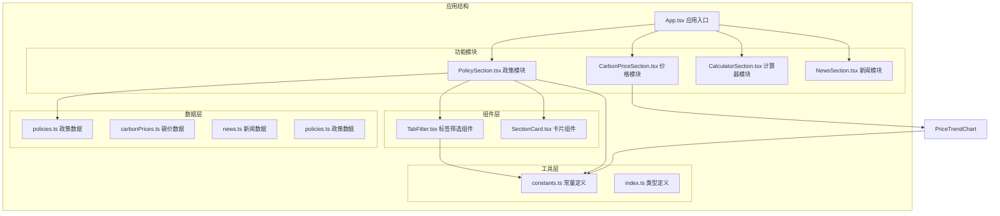
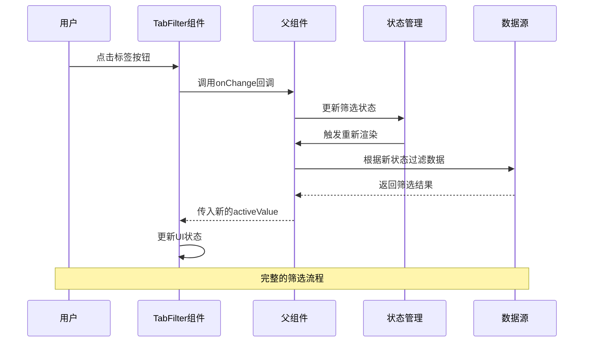
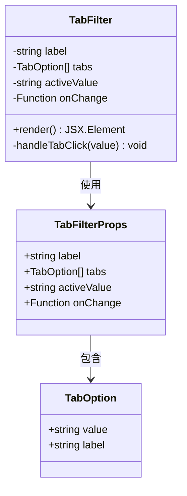
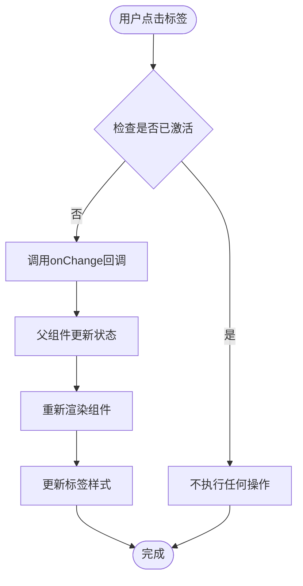
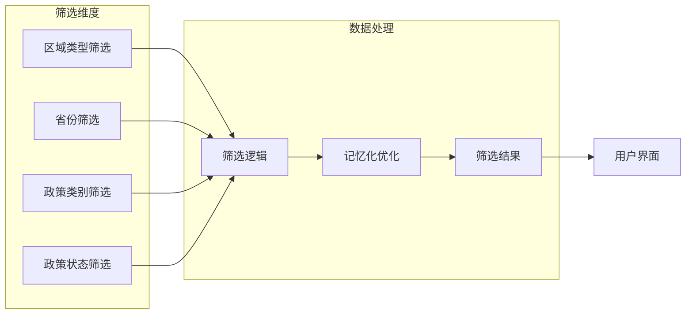
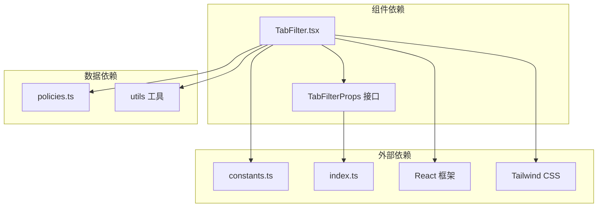

# 筛选组件

<cite>
**本文档引用的文件**
- [TabFilter.tsx](file://src/components/TabFilter.tsx)
- [PolicySection.tsx](file://src/sections/PolicySection.tsx)
- [constants.ts](file://src/utils/constants.ts)
- [policies.ts](file://src/data/policies.ts)
- [PriceTrendChart.tsx](file://src/sections/PriceTrendChart.tsx)
- [index.ts](file://src/types/index.ts)
</cite>

## 目录
1. [简介](#简介)
2. [项目结构](#项目结构)
3. [核心组件](#核心组件)
4. [架构概览](#架构概览)
5. [详细组件分析](#详细组件分析)
6. [依赖关系分析](#依赖关系分析)
7. [性能考虑](#性能考虑)
8. [故障排除指南](#故障排除指南)
9. [结论](#结论)

## 简介

TabFilter 标签筛选组件是碳普惠信息服务平台中的核心筛选工具，专门用于提供直观、易用的标签式筛选界面。该组件采用简洁的设计理念，通过标签按钮的形式让用户能够快速选择不同的筛选条件，支持单选模式下的状态同步和响应式布局。

该组件在项目中主要应用于政策信息筛选场景，为用户提供按区域类型、省份名称、政策类别和政策状态等维度的多维筛选能力。组件设计遵循 React 函数式组件的最佳实践，通过 props 接口实现清晰的组件契约，并通过事件回调机制实现与父组件的数据通信。

## 项目结构

项目采用模块化架构设计，TabFilter 组件位于组件层，专门负责筛选功能的实现。整个项目围绕碳普惠信息服务展开，包含政策、价格、计算器和新闻四大核心功能模块。

**图表来源**
- [App.tsx:1-60](file://src/App.tsx#L1-L60)
- [TabFilter.tsx:1-32](file://src/components/TabFilter.tsx#L1-L32)
- [PolicySection.tsx:1-89](file://src/sections/PolicySection.tsx#L1-L89)

**章节来源**
- [App.tsx:1-60](file://src/App.tsx#L1-L60)
- [TabFilter.tsx:1-32](file://src/components/TabFilter.tsx#L1-L32)

## 核心组件

TabFilter 组件是一个高度可复用的筛选组件，具有以下核心特性：

### 组件架构设计

组件采用函数式组件设计，通过 TypeScript 接口定义 props 结构，确保类型安全和良好的开发体验。组件内部实现了完整的标签切换逻辑，支持动态样式根据激活状态自动调整。

### 核心功能特性

- **标签渲染**: 动态渲染标签按钮列表，每个标签包含值和显示标签
- **状态管理**: 通过 activeValue 属性管理当前激活状态
- **事件处理**: 通过 onChange 回调函数实现与父组件的状态同步
- **响应式布局**: 支持标签按钮的自动换行和间距调整
- **视觉反馈**: 提供激活状态和悬停状态的视觉差异

### API 接口定义

组件通过以下接口暴露功能：

| 属性名 | 类型 | 必需 | 描述 |
|--------|------|------|------|
| label | string | 是 | 标签组的显示标题 |
| tabs | Array<{value: string, label: string}> | 是 | 标签选项数组 |
| activeValue | string | 是 | 当前激活的标签值 |
| onChange | (value: string) => void | 是 | 标签切换回调函数 |

**章节来源**
- [TabFilter.tsx:1-32](file://src/components/TabFilter.tsx#L1-L32)

## 架构概览

TabFilter 组件在整个应用架构中扮演着关键的筛选控制角色，通过与父组件的紧密协作实现复杂的数据筛选功能。

**图表来源**
- [TabFilter.tsx:8-31](file://src/components/TabFilter.tsx#L8-L31)
- [PolicySection.tsx:36-71](file://src/sections/PolicySection.tsx#L36-L71)

### 组件交互模式

组件采用单向数据流设计，父组件负责维护筛选状态，TabFilter 组件只负责展示和用户交互。这种设计模式确保了状态的一致性和可预测性。

## 详细组件分析

### TabFilter 组件实现

TabFilter 组件是一个轻量级但功能完整的筛选组件，实现了标签式筛选的所有核心需求。

#### 组件结构分析

**图表来源**
- [TabFilter.tsx:1-6](file://src/components/TabFilter.tsx#L1-L6)

#### 标签切换逻辑

组件的核心逻辑集中在标签点击事件处理上，实现了精确的状态切换机制：

**图表来源**
- [TabFilter.tsx:16-26](file://src/components/TabFilter.tsx#L16-L26)

#### 状态同步机制

组件通过 props 和回调函数实现与父组件的状态同步，确保筛选状态在整个应用中保持一致。

**章节来源**
- [TabFilter.tsx:8-31](file://src/components/TabFilter.tsx#L8-L31)

### 在政策模块中的应用

TabFilter 组件在 PolicySection 中得到了充分的应用，实现了复杂的多维筛选功能。

#### 多维筛选实现

**图表来源**
- [PolicySection.tsx:9-34](file://src/sections/PolicySection.tsx#L9-L34)

#### 筛选状态管理

组件展示了如何在父组件中管理多个筛选状态变量，并通过 useMemo 进行性能优化：

| 状态变量 | 类型 | 默认值 | 作用 |
|----------|------|--------|------|
| regionType | string | 'all' | 区域类型筛选状态 |
| province | string | '全部' | 省份筛选状态 |
| category | string | 'all' | 政策类别筛选状态 |
| status | string | 'all' | 政策状态筛选状态 |

#### 动态标签生成

组件实现了根据当前筛选状态动态生成标签列表的功能，特别是省份标签的动态生成逻辑：

**章节来源**
- [PolicySection.tsx:15-24](file://src/sections/PolicySection.tsx#L15-L24)

### 与其他筛选组件的对比

项目中还存在其他类型的筛选组件，如基于复选框的 PriceTrendChart 组件，展示了不同筛选方式的特点。

#### 单选 vs 多选对比

| 特性 | TabFilter(单选) | PriceTrendChart(多选) |
|------|----------------|----------------------|
| 选择模式 | 单个标签激活 | 多个标签可同时激活 |
| 状态管理 | 简单字符串值 | 复杂集合状态 |
| 用户体验 | 直观明确 | 精细控制 |
| 性能开销 | 低 | 中等 |
| 适用场景 | 区域、类别等互斥筛选 | 产品类型等组合筛选 |

**章节来源**
- [PriceTrendChart.tsx:31-55](file://src/sections/PriceTrendChart.tsx#L31-L55)

## 依赖关系分析

TabFilter 组件的依赖关系相对简单，主要依赖于外部常量定义和类型系统。

**图表来源**
- [TabFilter.tsx:1-6](file://src/components/TabFilter.tsx#L1-L6)
- [constants.ts:1-44](file://src/utils/constants.ts#L1-L44)

### 外部依赖分析

组件对外部依赖的使用体现了现代 React 开发的最佳实践：

- **React**: 使用 useState Hook 进行状态管理
- **Tailwind CSS**: 通过类名实现样式控制
- **TypeScript**: 提供完整的类型安全保障
- **Lucide React**: 图标库集成

**章节来源**
- [TabFilter.tsx:1-32](file://src/components/TabFilter.tsx#L1-L32)

## 性能考虑

TabFilter 组件在设计时充分考虑了性能优化，采用了多种策略来确保良好的用户体验。

### 渲染优化策略

1. **最小化重渲染**: 组件本身不维护内部状态，避免不必要的重新渲染
2. **事件处理优化**: 使用箭头函数避免重复绑定
3. **样式计算优化**: 通过三元表达式实现动态样式计算

### 内存管理

组件采用无状态设计，减少了内存占用和垃圾回收压力。所有状态都由父组件管理，确保了状态的集中控制。

### 用户体验优化

- **即时反馈**: 标签切换提供即时的视觉反馈
- **无障碍支持**: 正确的语义化 HTML 结构
- **响应式设计**: 自适应不同屏幕尺寸

## 故障排除指南

### 常见问题及解决方案

#### 标签样式不正确

**问题描述**: 标签按钮样式不符合预期
**可能原因**: Tailwind CSS 类名冲突或样式覆盖
**解决方案**: 检查组件中的类名拼写，确保样式库正确引入

#### 点击事件无效

**问题描述**: 点击标签按钮没有响应
**可能原因**: onChange 回调函数未正确传递
**解决方案**: 验证父组件是否正确传递了 onChange 函数

#### 状态不同步

**问题描述**: UI 显示的激活状态与实际状态不一致
**可能原因**: activeValue prop 未正确更新
**解决方案**: 确保父组件正确更新 activeValue 状态

### 调试技巧

1. **使用浏览器开发者工具**检查元素状态
2. **添加日志输出**跟踪事件触发
3. **验证数据结构**确保 tabs 数组格式正确

**章节来源**
- [TabFilter.tsx:16-26](file://src/components/TabFilter.tsx#L16-L26)

## 结论

TabFilter 标签筛选组件是碳普惠信息服务平台中一个设计精良的筛选工具，它成功地平衡了功能完整性、用户体验和性能优化。组件通过简洁的 API 设计和清晰的职责分离，为复杂的多维筛选场景提供了可靠的解决方案。

该组件的主要优势包括：

- **设计理念先进**: 采用函数式组件和单向数据流
- **API 设计优雅**: 通过 props 和回调实现清晰的组件契约
- **用户体验优秀**: 提供直观的标签式交互模式
- **性能表现良好**: 通过最小化重渲染和优化的事件处理
- **可扩展性强**: 易于在其他模块中复用和扩展

在未来的发展中，可以考虑增加更多的交互反馈、键盘导航支持和更丰富的筛选选项，以进一步提升用户体验和功能完整性。