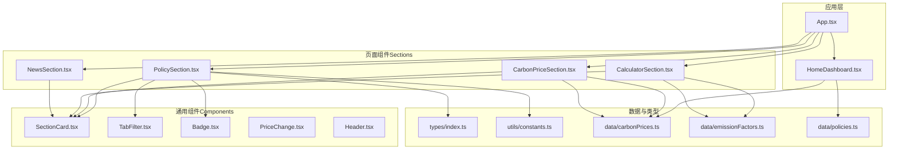
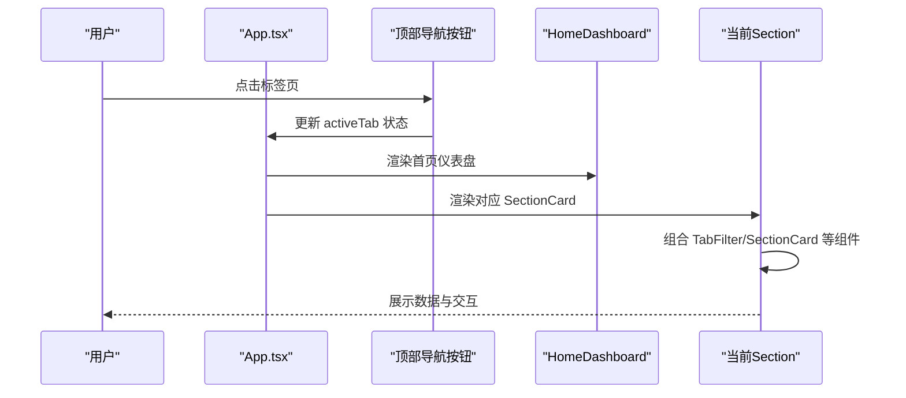
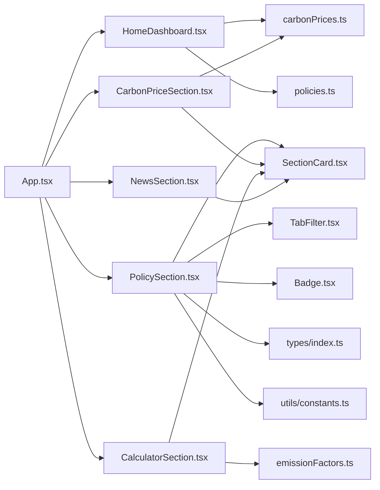

# 组件系统

<cite>
**本文引用的文件**
- [src/components/Badge.tsx](file://src/components/Badge.tsx)
- [src/components/Header.tsx](file://src/components/Header.tsx)
- [src/components/PriceChange.tsx](file://src/components/PriceChange.tsx)
- [src/components/SectionCard.tsx](file://src/components/SectionCard.tsx)
- [src/components/TabFilter.tsx](file://src/components/TabFilter.tsx)
- [src/sections/HomeDashboard.tsx](file://src/sections/HomeDashboard.tsx)
- [src/App.tsx](file://src/App.tsx)
- [src/types/index.ts](file://src/types/index.ts)
- [src/utils/constants.ts](file://src/utils/constants.ts)
- [src/data/carbonPrices.ts](file://src/data/carbonPrices.ts)
- [src/data/emissionFactors.ts](file://src/data/emissionFactors.ts)
- [src/data/policies.ts](file://src/data/policies.ts)
- [src/sections/PolicySection.tsx](file://src/sections/PolicySection.tsx)
- [src/sections/CarbonPriceSection.tsx](file://src/sections/CarbonPriceSection.tsx)
- [src/sections/CalculatorSection.tsx](file://src/sections/CalculatorSection.tsx)
- [src/sections/NewsSection.tsx](file://src/sections/NewsSection.tsx)
- [README.md](file://README.md)
</cite>

## 更新摘要
**变更内容**
- 新增HomeDashboard组件，提供现代化的大屏展示界面
- 更新应用架构图以包含新的首页仪表盘组件
- 增加HomeDashboard的组件详解和使用模式
- 更新依赖关系分析以反映新的组件结构

## 目录
1. [简介](#简介)
2. [项目结构](#项目结构)
3. [核心组件](#核心组件)
4. [架构总览](#架构总览)
5. [组件详解](#组件详解)
6. [依赖关系分析](#依赖关系分析)
7. [性能考量](#性能考量)
8. [故障排查指南](#故障排查指南)
9. [结论](#结论)
10. [附录](#附录)

## 简介
本文件面向"碳普惠信息代理"项目的组件系统，系统化梳理可复用组件的设计理念、API 规范与使用模式，覆盖功能特性、属性配置、事件处理、样式定制、生命周期与状态更新机制、性能优化策略，并提供组合模式、父子/兄弟组件通信示例路径、可访问性与响应式设计建议、以及测试与调试策略。

## 项目结构
项目采用按功能分层的组织方式：顶层应用负责导航与内容切换；sections 展示具体业务模块；components 提供通用 UI 组件；data 与 utils 提供数据与工具能力；types 定义类型契约。

**图表来源**
- [src/App.tsx:1-121](file://src/App.tsx#L1-L121)
- [src/sections/HomeDashboard.tsx:1-214](file://src/sections/HomeDashboard.tsx#L1-L214)
- [src/sections/PolicySection.tsx:1-89](file://src/sections/PolicySection.tsx#L1-L89)
- [src/sections/CarbonPriceSection.tsx:1-42](file://src/sections/CarbonPriceSection.tsx#L1-L42)
- [src/sections/CalculatorSection.tsx:1-161](file://src/sections/CalculatorSection.tsx#L1-L161)
- [src/sections/NewsSection.tsx:1-71](file://src/sections/NewsSection.tsx#L1-L71)
- [src/components/SectionCard.tsx:1-26](file://src/components/SectionCard.tsx#L1-L26)
- [src/components/TabFilter.tsx:1-32](file://src/components/TabFilter.tsx#L1-L32)
- [src/components/Badge.tsx:1-19](file://src/components/Badge.tsx#L1-L19)
- [src/components/PriceChange.tsx:1-33](file://src/components/PriceChange.tsx#L1-L33)
- [src/components/Header.tsx:1-28](file://src/components/Header.tsx#L1-L28)
- [src/types/index.ts:1-65](file://src/types/index.ts#L1-L65)
- [src/utils/constants.ts:1-44](file://src/utils/constants.ts#L1-L44)
- [src/data/carbonPrices.ts:1-103](file://src/data/carbonPrices.ts#L1-L103)
- [src/data/emissionFactors.ts:1-103](file://src/data/emissionFactors.ts#L1-L103)
- [src/data/policies.ts:1-200](file://src/data/policies.ts#L1-L200)

**章节来源**
- [src/App.tsx:1-121](file://src/App.tsx#L1-L121)
- [README.md:1-74](file://README.md#L1-L74)

## 核心组件
本节从设计理念、API 规范、使用模式、生命周期与状态、性能优化等维度，系统介绍可复用组件。

- 设计理念
  - 单一职责：每个组件聚焦一个 UI 片段或交互行为。
  - 可组合性：通过 children 与图标节点扩展内容与语义。
  - 可配置性：以 props 明确输入，以 className 支持主题与样式覆盖。
  - 可复用性：在不同页面中复用，减少重复逻辑。

- API 规范
  - 所有组件均以函数式组件导出，使用 TypeScript 接口定义 props。
  - 事件回调统一通过 onXxx 形式传入，便于父组件控制状态。
  - 文本与文案统一来自常量或国际化资源，便于维护与扩展。

- 使用模式
  - 父子通信：父组件持有状态，向子组件传递 activeValue 与 onChange。
  - 兄弟协作：多个 TabFilter 组合时，共享过滤条件，通过 useMemo 优化渲染。
  - 内容插槽：SectionCard 通过 children 接收任意内容，增强灵活性。

- 生命周期与状态
  - 无副作用的纯展示组件：仅在 props 变化时重渲染。
  - 有状态组件：如 App 的导航标签页、CalculatorSection 的输入与结果计算，使用 useState 与 useMemo 管理本地状态与派生值。

- 性能优化
  - 使用 useMemo 缓存昂贵计算与过滤结果。
  - 避免不必要的深层比较，props 尽量保持稳定引用。
  - 列表渲染使用稳定 key，减少重排。

**章节来源**
- [src/components/SectionCard.tsx:1-26](file://src/components/SectionCard.tsx#L1-L26)
- [src/components/TabFilter.tsx:1-32](file://src/components/TabFilter.tsx#L1-L32)
- [src/components/Badge.tsx:1-19](file://src/components/Badge.tsx#L1-L19)
- [src/components/PriceChange.tsx:1-33](file://src/components/PriceChange.tsx#L1-L33)
- [src/components/Header.tsx:1-28](file://src/components/Header.tsx#L1-L28)
- [src/App.tsx:18-52](file://src/App.tsx#L18-L52)
- [src/sections/CalculatorSection.tsx:31-34](file://src/sections/CalculatorSection.tsx#L31-L34)

## 架构总览
应用通过顶部导航切换四大板块：政策、碳价、计算器、新闻。每个板块由 SectionCard 包裹，内部再组合通用组件与业务数据。新增的HomeDashboard作为首页仪表盘，提供核心指标展示和模块导航功能。

**图表来源**
- [src/App.tsx:54-120](file://src/App.tsx#L54-L120)
- [src/sections/HomeDashboard.tsx:119-213](file://src/sections/HomeDashboard.tsx#L119-L213)
- [src/sections/PolicySection.tsx:41-86](file://src/sections/PolicySection.tsx#L41-L86)
- [src/sections/CarbonPriceSection.tsx:13-40](file://src/sections/CarbonPriceSection.tsx#L13-L40)
- [src/sections/CalculatorSection.tsx:41-158](file://src/sections/CalculatorSection.tsx#L41-L158)
- [src/sections/NewsSection.tsx:5-69](file://src/sections/NewsSection.tsx#L5-L69)

## 组件详解

### HomeDashboard 组件
**新增** 首页仪表盘组件，提供现代化的大屏展示界面

- 功能特性
  - 全屏背景展示，使用模糊玻璃效果和渐变背景营造专业视觉体验
  - 核心指标卡片展示今日CCER价格、政策数量、方法学数量、已落地城市等关键数据
  - 模块导航按钮提供快速跳转到各个功能模块
  - 响应式布局，支持不同屏幕尺寸的自适应显示

- 属性配置
  - onNavigate: (tab: 'policy' | 'price' | 'calculator' | 'news') => void
    - 导航回调函数，接收目标模块键值，用于页面跳转

- 事件处理
  - 指标卡片点击：触发 onNavigate 回调，跳转到相应模块
  - 模块按钮点击：触发 onNavigate 回调，跳转到相应模块

- 样式定制
  - 使用 backdrop-blur-md 实现毛玻璃效果
  - 通过颜色类名实现模块化色彩区分
  - 支持 hover 效果和动画过渡

- 使用示例路径
  - [App.tsx 中的 HomeDashboard 使用:96](file://src/App.tsx#L96)

- 组件结构
  - MetricCard：指标展示卡片组件
  - ModuleButton：模块导航按钮组件
  - 数据获取：useCCERPrice 和 useStatistics 自定义 Hook

- 性能优化
  - 使用 useMemo 缓存指标计算结果
  - 通过 CSS 过渡实现流畅的交互效果
  - 懒加载背景图片，避免阻塞首屏渲染

**章节来源**
- [src/sections/HomeDashboard.tsx:1-214](file://src/sections/HomeDashboard.tsx#L1-L214)
- [src/App.tsx:96](file://src/App.tsx#L96)

### SectionCard 组件
- 功能特性
  - 提供统一的卡片容器，头部包含标题、副标题与图标，主体区域承载子内容。
  - 通过 children 接受任意 ReactNode，实现高内聚、低耦合的内容布局。

- 属性配置
  - title: 标题文本（必填）
  - subtitle: 副标题文本（可选）
  - icon: 图标节点（可选）
  - children: 子内容（必填）

- 事件处理
  - 无事件回调，作为纯展示容器。

- 样式定制
  - 通过 className 覆盖边框、阴影、背景色等，满足主题一致性。

- 使用示例路径
  - [PolicySection.tsx 中的 SectionCard 使用:42-46](file://src/sections/PolicySection.tsx#L42-L46)
  - [CarbonPriceSection.tsx 中的 SectionCard 使用:14-18](file://src/sections/CarbonPriceSection.tsx#L14-L18)
  - [CalculatorSection.tsx 中的 SectionCard 使用:42-46](file://src/sections/CalculatorSection.tsx#L42-L46)
  - [NewsSection.tsx 中的 SectionCard 使用:7-11](file://src/sections/NewsSection.tsx#L7-L11)

- 组合模式
  - SectionCard 作为容器，内部可嵌套 TabFilter、表格、图表等组件。

**章节来源**
- [src/components/SectionCard.tsx:1-26](file://src/components/SectionCard.tsx#L1-L26)
- [src/sections/PolicySection.tsx:42-46](file://src/sections/PolicySection.tsx#L42-L46)
- [src/sections/CarbonPriceSection.tsx:14-18](file://src/sections/CarbonPriceSection.tsx#L14-L18)
- [src/sections/CalculatorSection.tsx:42-46](file://src/sections/CalculatorSection.tsx#L42-L46)
- [src/sections/NewsSection.tsx:7-11](file://src/sections/NewsSection.tsx#L7-L11)

### TabFilter 组件
- 功能特性
  - 提供标签式筛选器，支持多组标签切换，高亮当前激活项。
  - 适用于区域类型、省市区、政策类别、状态等多维筛选。

- 属性配置
  - label: 标签前缀文本（必填）
  - tabs: 标签数组 [{ value, label }]（必填）
  - activeValue: 当前激活值（必填）
  - onChange(value): 回调函数（必填）

- 事件处理
  - 点击标签触发 onChange，父组件更新 activeValue 并联动其他筛选。

- 样式定制
  - 激活态与悬停态通过 className 差异化显示，支持主题色系覆盖。

- 使用示例路径
  - [PolicySection.tsx 中的 TabFilter 组合:48-71](file://src/sections/PolicySection.tsx#L48-L71)

- 组合模式
  - 多个 TabFilter 并列使用，形成复合筛选面板；通过 useMemo 优化依赖计算。

- 性能优化
  - 使用 useMemo 缓存 provinceTabs 与 filteredPolicies，避免每次渲染重新计算。

**章节来源**
- [src/components/TabFilter.tsx:1-32](file://src/components/TabFilter.tsx#L1-L32)
- [src/sections/PolicySection.tsx:15-34](file://src/sections/PolicySection.tsx#L15-L34)
- [src/sections/PolicySection.tsx:48-71](file://src/sections/PolicySection.tsx#L48-L71)

### Badge 组件
- 功能特性
  - 根据状态渲染"有效/已失效"徽章，颜色与文案随状态变化。

- 属性配置
  - status: 'active' | 'expired'

- 事件处理
  - 无交互，纯展示。

- 样式定制
  - 通过 className 控制背景色、文字色与圆角尺寸。

- 使用示例路径
  - [PolicySection.tsx 中的 Badge 使用:81-84](file://src/sections/PolicySection.tsx#L81-L84)

**章节来源**
- [src/components/Badge.tsx:1-19](file://src/components/Badge.tsx#L1-L19)
- [src/sections/PolicySection.tsx:81-84](file://src/sections/PolicySection.tsx#L81-L84)

### PriceChange 组件
- 功能特性
  - 根据数值正负显示上涨/下跌箭头与数值，零值显示中线符号。

- 属性配置
  - value: 数值（必填）

- 事件处理
  - 无交互。

- 样式定制
  - 上涨/下跌使用不同文本色，支持主题色覆盖。

- 使用示例路径
  - [CarbonPriceSection.tsx 中的价格变化展示:19-38](file://src/sections/CarbonPriceSection.tsx#L19-L38)

**章节来源**
- [src/components/PriceChange.tsx:1-33](file://src/components/PriceChange.tsx#L1-L33)
- [src/sections/CarbonPriceSection.tsx:19-38](file://src/sections/CarbonPriceSection.tsx#L19-L38)

### Header 组件
- 功能特性
  - 应用头部，包含品牌图标、标题、副标题与日期显示，使用渐变背景与金色边框强调品牌识别。

- 属性配置
  - 无 props。

- 事件处理
  - 无交互。

- 样式定制
  - 通过 className 覆盖背景、阴影、边框与文字色。

- 使用示例路径
  - [App.tsx 中的 Header 使用:22-25](file://src/App.tsx#L22-L25)

**章节来源**
- [src/components/Header.tsx:1-28](file://src/components/Header.tsx#L1-L28)
- [src/App.tsx:22-25](file://src/App.tsx#L22-L25)

### 数据与类型支撑
- 类型定义
  - 政策、碳价产品、价格记录、排放因子、新闻等类型在 types/index.ts 中集中声明，确保组件间契约一致。

- 常量与配置
  - utils/constants.ts 提供区域类型、省份、政策分类、状态等枚举与元数据，为筛选与展示提供基础数据。

- 数据生成与趋势
  - data/carbonPrices.ts 提供价格历史生成、最新价格查询与趋势数据聚合，支持图表渲染。

- 方法学数据
  - data/emissionFactors.ts 提供各省市交通出行方法学与基准/场景因子，用于计算器结果计算。

- 政策数据
  - data/policies.ts 提供全国各省市自治区的政策和方法学数据，支持HomeDashboard的核心指标计算。

**章节来源**
- [src/types/index.ts:1-65](file://src/types/index.ts#L1-L65)
- [src/utils/constants.ts:1-44](file://src/utils/constants.ts#L1-L44)
- [src/data/carbonPrices.ts:55-83](file://src/data/carbonPrices.ts#L55-L83)
- [src/data/carbonPrices.ts:85-102](file://src/data/carbonPrices.ts#L85-L102)
- [src/data/emissionFactors.ts:3-102](file://src/data/emissionFactors.ts#L3-L102)
- [src/data/policies.ts:1-200](file://src/data/policies.ts#L1-L200)

## 依赖关系分析
组件间依赖与数据流向如下：

**图表来源**
- [src/App.tsx:1-121](file://src/App.tsx#L1-L121)
- [src/sections/HomeDashboard.tsx:1-214](file://src/sections/HomeDashboard.tsx#L1-L214)
- [src/sections/PolicySection.tsx:1-89](file://src/sections/PolicySection.tsx#L1-L89)
- [src/sections/CarbonPriceSection.tsx:1-42](file://src/sections/CarbonPriceSection.tsx#L1-L42)
- [src/sections/CalculatorSection.tsx:1-161](file://src/sections/CalculatorSection.tsx#L1-L161)
- [src/sections/NewsSection.tsx:1-71](file://src/sections/NewsSection.tsx#L1-L71)
- [src/components/SectionCard.tsx:1-26](file://src/components/SectionCard.tsx#L1-L26)
- [src/components/TabFilter.tsx:1-32](file://src/components/TabFilter.tsx#L1-L32)
- [src/components/Badge.tsx:1-19](file://src/components/Badge.tsx#L1-L19)
- [src/data/carbonPrices.ts:1-103](file://src/data/carbonPrices.ts#L1-L103)
- [src/data/emissionFactors.ts:1-103](file://src/data/emissionFactors.ts#L1-L103)
- [src/data/policies.ts:1-200](file://src/data/policies.ts#L1-L200)
- [src/types/index.ts:1-65](file://src/types/index.ts#L1-L65)
- [src/utils/constants.ts:1-44](file://src/utils/constants.ts#L1-L44)

## 性能考量
- 计算缓存
  - 使用 useMemo 缓存昂贵计算与过滤结果，例如政策筛选、最新价格与趋势数据。
  - HomeDashboard 中的 useCCERPrice 和 useStatistics Hook 使用 useMemo 优化指标计算。
  - 示例路径：[HomeDashboard 中的 useMemo 使用:16-22](file://src/sections/HomeDashboard.tsx#L16-L22)，[HomeDashboard 中的 useMemo 使用:25-44](file://src/sections/HomeDashboard.tsx#L25-L44)。

- 状态收敛
  - 将筛选状态收敛到父组件，避免子组件内部冗余状态，降低重渲染范围。
  - 示例路径：[PolicySection.tsx 中的状态管理:10-13](file://src/sections/PolicySection.tsx#L10-L13)。

- 列表渲染
  - 为列表项提供稳定 key，减少 DOM 重建与样式抖动。
  - 示例路径：[PolicySection.tsx 中的列表渲染:81-84](file://src/sections/PolicySection.tsx#L81-L84)。

- 事件绑定
  - 将回调函数稳定化，避免因函数引用变化导致子组件不必要重渲染。
  - 示例路径：[TabFilter.tsx 中的点击处理:16-27](file://src/components/TabFilter.tsx#L16-L27)。

- 主题与样式
  - 通过 className 与主题变量控制样式，避免内联样式的频繁变更。
  - HomeDashboard 使用 CSS 过渡和动画提升用户体验。
  - 示例路径：[SectionCard.tsx 的样式类名:12-24](file://src/components/SectionCard.tsx#L12-L24)。

- 组件懒加载
  - HomeDashboard 作为首页组件，提供良好的首屏体验和视觉效果。

**章节来源**
- [src/sections/PolicySection.tsx:10-13](file://src/sections/PolicySection.tsx#L10-L13)
- [src/components/TabFilter.tsx:16-27](file://src/components/TabFilter.tsx#L16-L27)
- [src/data/carbonPrices.ts:85-102](file://src/data/carbonPrices.ts#L85-L102)
- [src/sections/HomeDashboard.tsx:16-22](file://src/sections/HomeDashboard.tsx#L16-L22)
- [src/sections/HomeDashboard.tsx:25-44](file://src/sections/HomeDashboard.tsx#L25-L44)

## 故障排查指南
- 常见问题
  - 筛选无效：检查 activeValue 是否与 onChange 正确联动，确认 tabs 的 value 与 activeValue 类型一致。
  - 数据为空：确认数据源是否加载成功，检查 useMemo 依赖是否正确。
  - 样式异常：检查主题变量与 className 是否被覆盖，确认 Tailwind 类拼接顺序。
  - 首页仪表盘显示问题：检查 HomeDashboard 的背景图片加载和 CSS 样式。

- 调试技巧
  - 在父组件打印状态变化，定位 props 传递链路。
  - 使用 React DevTools 分析组件树与渲染次数，识别过度重渲染点。
  - 对复杂计算使用 console.time/console.timeEnd 定位性能瓶颈。
  - 检查 HomeDashboard 的自定义 Hook 是否正确返回数据。

- 测试策略
  - 单元测试：针对纯函数与计算逻辑（如价格趋势聚合、因子计算）编写测试。
  - 组件测试：使用测试库渲染组件，断言 props、className 与交互行为。
  - 端到端测试：验证页面级流程（如筛选、切换标签页、查看详情）。
  - HomeDashboard 测试：验证指标卡片数据展示、导航功能和响应式布局。

- 性能监控
  - 监控 HomeDashboard 的渲染性能，特别是指标卡片的更新频率。
  - 检查背景图片的加载性能和缓存策略。

**章节来源**
- [src/sections/PolicySection.tsx:10-13](file://src/sections/PolicySection.tsx#L10-L13)
- [src/components/TabFilter.tsx:16-27](file://src/components/TabFilter.tsx#L16-L27)
- [src/data/carbonPrices.ts:85-102](file://src/data/carbonPrices.ts#L85-L102)
- [src/sections/HomeDashboard.tsx:119-213](file://src/sections/HomeDashboard.tsx#L119-L213)

## 结论
该组件系统以 SectionCard 为核心容器，结合 TabFilter、Badge、PriceChange 等通用组件，配合类型与常量定义，实现了清晰的职责划分与良好的可复用性。新增的 HomeDashboard 组件提供了现代化的大屏展示界面，增强了用户体验和视觉效果。通过 useMemo 与状态收敛，保证了性能与可维护性。建议在后续迭代中进一步完善测试体系与可访问性支持，持续提升用户体验与工程质量。

## 附录
- 可访问性建议
  - 为交互元素提供键盘可达性与焦点可见性。
  - 为图标与装饰性元素提供合适的 aria-label 或隐藏文本。
  - 为表格与列表提供语义化结构与可读性提示。
  - HomeDashboard 中的卡片组件应提供适当的语义化标记。

- 响应式设计
  - 使用网格与弹性布局适配不同屏幕尺寸。
  - 控制字体大小与间距，确保在小屏设备上的可读性。
  - HomeDashboard 使用响应式网格布局，支持移动端适配。

- 跨浏览器兼容性
  - 使用现代 CSS 特性时提供回退方案。
  - 在第三方图标库与日期库上关注兼容性与 polyfill 需求。
  - HomeDashboard 使用的 CSS 特性需要考虑浏览器兼容性。

- 性能优化建议
  - 为 HomeDashboard 添加图片懒加载和缓存策略。
  - 优化指标数据的更新频率，避免频繁的重新计算。
  - 考虑使用 Web Workers 处理大量数据计算。