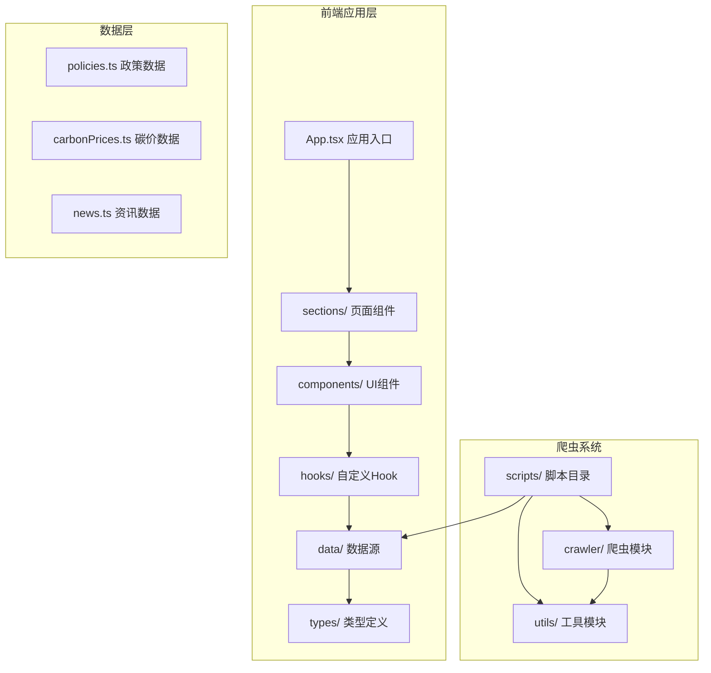
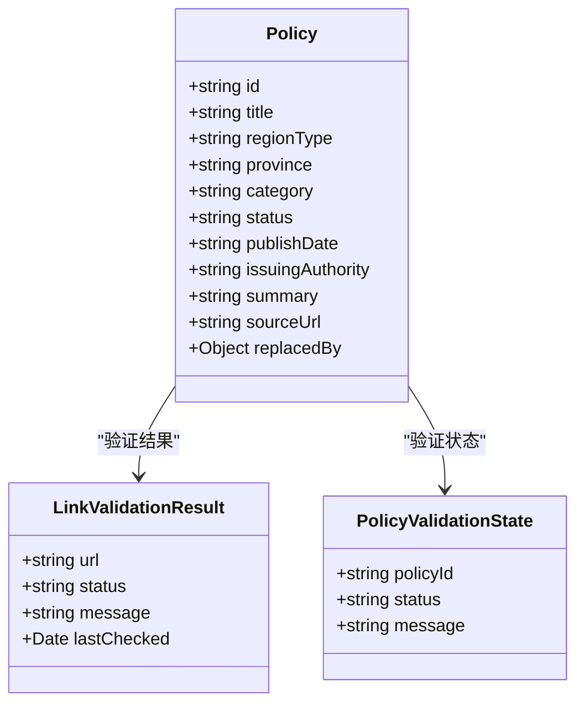
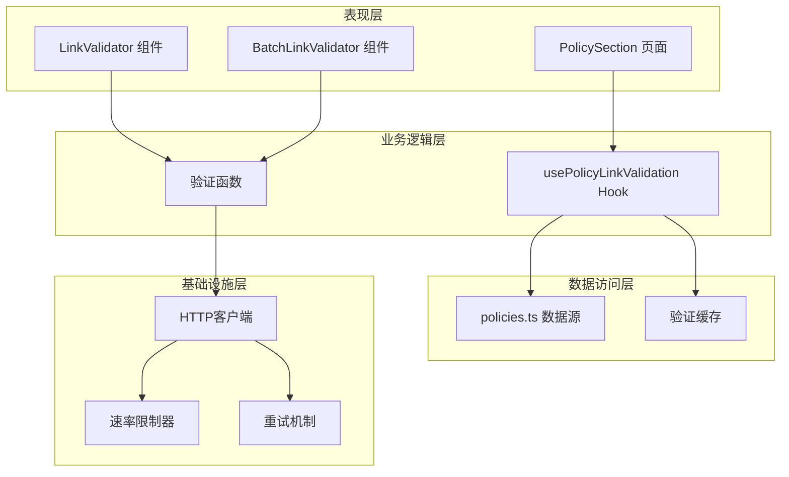
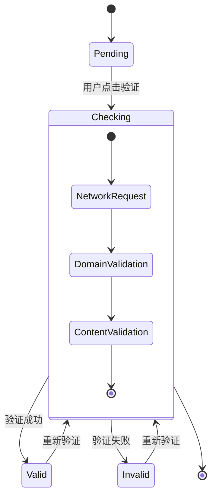
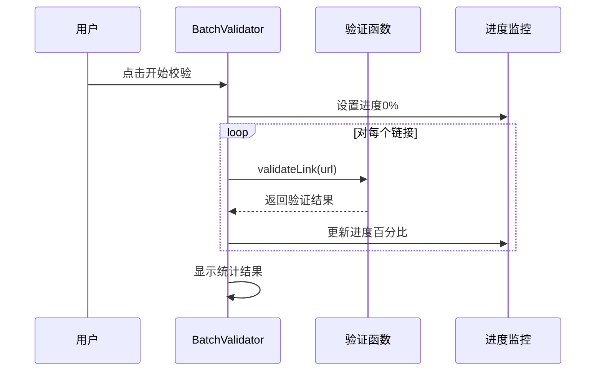
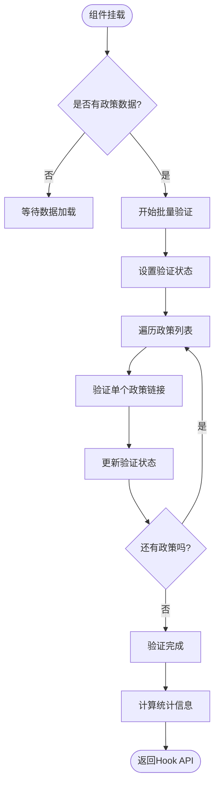
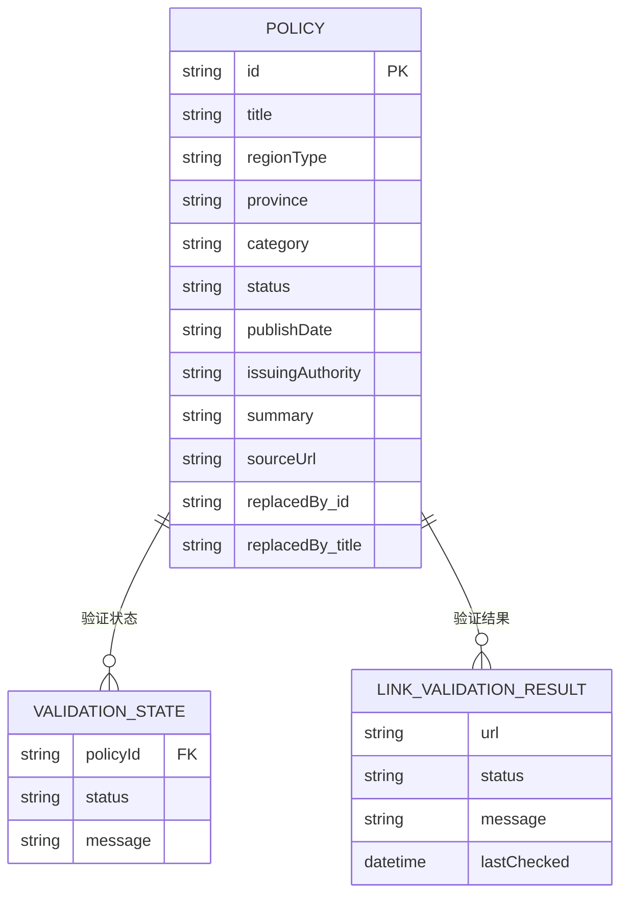
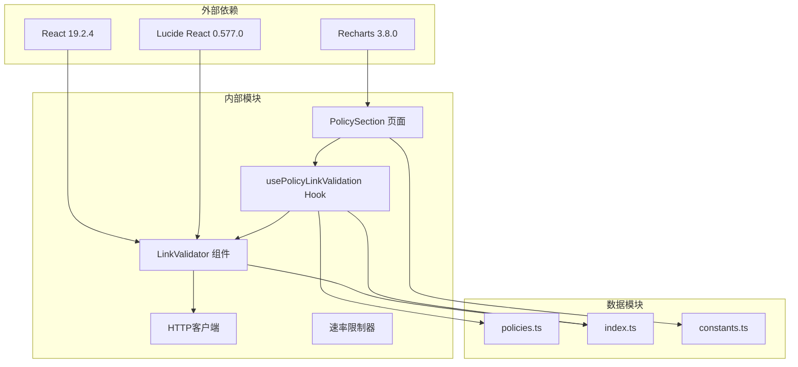
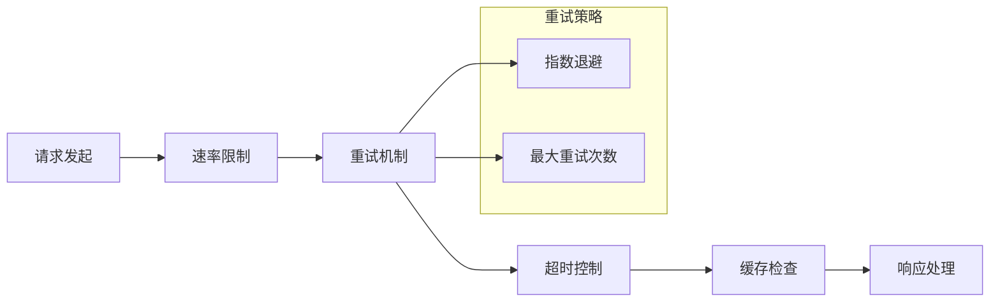

# 链接验证系统

<cite>
**本文档引用的文件**
- [LinkValidator.tsx](file://src/components/LinkValidator.tsx)
- [usePolicyLinkValidation.ts](file://src/hooks/usePolicyLinkValidation.ts)
- [policies.ts](file://src/data/policies.ts)
- [index.ts](file://src/types/index.ts)
- [PolicySection.tsx](file://src/sections/PolicySection.tsx)
- [baseCrawler.ts](file://scripts/crawler/baseCrawler.ts)
- [httpClient.ts](file://scripts/utils/httpClient.ts)
- [policyCrawler.ts](file://scripts/crawler/policyCrawler.ts)
- [autoUpdate.ts](file://scripts/autoUpdate.ts)
- [updateData.ts](file://scripts/updateData.ts)
- [App.tsx](file://src/App.tsx)
- [constants.ts](file://src/utils/constants.ts)
</cite>

## 目录
1. [简介](#简介)
2. [项目结构](#项目结构)
3. [核心组件](#核心组件)
4. [架构概览](#架构概览)
5. [详细组件分析](#详细组件分析)
6. [依赖关系分析](#依赖关系分析)
7. [性能考虑](#性能考虑)
8. [故障排除指南](#故障排除指南)
9. [结论](#结论)

## 简介

链接验证系统是碳普惠资讯服务平台的核心功能模块，负责验证政策链接的有效性和可信度。该系统采用React + TypeScript构建，提供了两种验证策略：通用链接验证和政策链接专用验证，确保用户访问的政策信息来源可靠且内容准确。

系统的主要功能包括：
- 政策链接的实时验证和状态显示
- 批量链接验证功能
- 后台静默验证机制
- 可信域名白名单管理
- 详细的验证结果反馈

## 项目结构

该项目采用模块化的前端架构，主要分为以下几个核心部分：

**图表来源**
- [App.tsx:1-60](file://src/App.tsx#L1-L60)
- [LinkValidator.tsx:1-348](file://src/components/LinkValidator.tsx#L1-L348)
- [baseCrawler.ts:1-65](file://scripts/crawler/baseCrawler.ts#L1-L65)

**章节来源**
- [App.tsx:1-60](file://src/App.tsx#L1-L60)
- [package.json:1-40](file://package.json#L1-L40)

## 核心组件

链接验证系统的核心组件包括链接验证器、政策链接验证Hook、以及相关的数据模型和爬虫工具。

### 链接验证器组件

链接验证器是一个独立的React组件，提供以下功能：
- 单个链接验证
- 批量链接验证
- 可展开的详细信息面板
- 不同状态的视觉反馈

### 政策链接验证Hook

`usePolicyLinkValidation` Hook提供了后台静默验证功能：
- 自动验证所有政策链接
- 进度跟踪和统计
- 状态管理和消息传递
- 性能优化的批量处理

### 数据模型

系统定义了完整的类型系统来确保数据一致性：

**图表来源**
- [index.ts:1-65](file://src/types/index.ts#L1-L65)
- [LinkValidator.tsx:4-15](file://src/components/LinkValidator.tsx#L4-L15)

**章节来源**
- [LinkValidator.tsx:178-280](file://src/components/LinkValidator.tsx#L178-L280)
- [usePolicyLinkValidation.ts:5-81](file://src/hooks/usePolicyLinkValidation.ts#L5-L81)

## 架构概览

链接验证系统采用分层架构设计，确保功能模块的清晰分离和高内聚低耦合：

**图表来源**
- [LinkValidator.tsx:178-348](file://src/components/LinkValidator.tsx#L178-L348)
- [usePolicyLinkValidation.ts:12-81](file://src/hooks/usePolicyLinkValidation.ts#L12-L81)
- [httpClient.ts:26-66](file://scripts/utils/httpClient.ts#L26-L66)

## 详细组件分析

### LinkValidator 组件分析

LinkValidator组件实现了完整的链接验证功能，具有以下特点：

#### 核心验证逻辑

组件提供了两种验证策略：

1. **通用链接验证** (`validateLink`)
   - 可信域名白名单验证
   - URL格式检查
   - 默认有效性判断

2. **政策链接专用验证** (`validatePolicyLink`)
   - 政府官方域名识别
   - 政策相关内容路径检测
   - 更严格的验证规则

#### 状态管理系统

组件内部维护了完整的状态管理机制：

**图表来源**
- [LinkValidator.tsx:178-280](file://src/components/LinkValidator.tsx#L178-L280)

#### 批量验证功能

BatchLinkValidator组件提供了高效的批量验证能力：

**图表来源**
- [LinkValidator.tsx:287-348](file://src/components/LinkValidator.tsx#L287-L348)

**章节来源**
- [LinkValidator.tsx:18-96](file://src/components/LinkValidator.tsx#L18-L96)
- [LinkValidator.tsx:99-176](file://src/components/LinkValidator.tsx#L99-L176)
- [LinkValidator.tsx:287-348](file://src/components/LinkValidator.tsx#L287-L348)

### usePolicyLinkValidation Hook 分析

该Hook实现了智能的后台验证机制：

#### 自动验证流程

**图表来源**
- [usePolicyLinkValidation.ts:41-54](file://src/hooks/usePolicyLinkValidation.ts#L41-L54)

#### 状态管理机制

Hook内部使用Map数据结构高效管理多个政策的验证状态：

| 状态类型 | 描述 | 视觉表示 |
|---------|------|----------|
| `pending` | 待验证 | 灰色问号图标 |
| `checking` | 验证中 | 旋转加载图标 |
| `valid` | 验证通过 | 绿色对勾图标 |
| `invalid` | 验证失败 | 红色叉号图标 |

**章节来源**
- [usePolicyLinkValidation.ts:12-81](file://src/hooks/usePolicyLinkValidation.ts#L12-L81)

### 政策数据集成

系统集成了全面的政策数据源，支持全国范围内的碳普惠政策：

#### 政策数据结构

每个政策对象包含完整的信息字段：

**图表来源**
- [policies.ts:3-345](file://src/data/policies.ts#L3-L345)
- [index.ts:2-14](file://src/types/index.ts#L2-L14)

#### 政策覆盖范围

系统支持以下层级的政策覆盖：
- **国家级**：全国性碳普惠政策
- **省级**：各省碳普惠体系建设方案
- **市级**：重点城市具体实施细则

**章节来源**
- [policies.ts:3-345](file://src/data/policies.ts#L3-L345)
- [constants.ts:1-44](file://src/utils/constants.ts#L1-L44)

## 依赖关系分析

链接验证系统的依赖关系体现了清晰的分层架构：

**图表来源**
- [package.json:15-23](file://package.json#L15-L23)
- [LinkValidator.tsx:1-3](file://src/components/LinkValidator.tsx#L1-L3)
- [usePolicyLinkValidation.ts:1-3](file://src/hooks/usePolicyLinkValidation.ts#L1-L3)

### 关键依赖特性

1. **React生态系统集成**
   - 使用React 19.2.4的最新特性
   - 支持并发特性和性能优化
   - TypeScript类型安全保证

2. **UI组件库**
   - Lucide React提供简洁的图标系统
   - TailwindCSS实现响应式设计
   - Recharts用于数据可视化

3. **网络请求优化**
   - 自定义HTTP客户端支持重试机制
   - 速率限制器防止请求过载
   - 超时控制确保用户体验

**章节来源**
- [package.json:15-38](file://package.json#L15-L38)
- [httpClient.ts:26-89](file://scripts/utils/httpClient.ts#L26-L89)

## 性能考虑

链接验证系统在设计时充分考虑了性能优化：

### 并发处理策略

系统采用异步并发处理来提升验证效率：

1. **批量验证优化**
   - 使用Promise.all进行并行验证
   - 进度条实时更新用户体验
   - 内存使用优化避免重复存储

2. **缓存机制**
   - 验证结果本地缓存
   - 避免重复验证相同链接
   - 缓存失效策略管理

### 网络请求优化

**图表来源**
- [httpClient.ts:26-66](file://scripts/utils/httpClient.ts#L26-L66)

### 内存管理

系统实现了智能的内存管理策略：
- 使用WeakMap避免内存泄漏
- 及时清理未使用的验证状态
- 优化React组件的重新渲染

## 故障排除指南

### 常见问题诊断

#### 链接验证失败

| 问题类型 | 可能原因 | 解决方案 |
|---------|----------|----------|
| 格式错误 | URL格式不正确 | 检查URL前缀(http/https) |
| 域名不受信任 | 不在可信域名列表 | 联系管理员添加域名 |
| 网络超时 | 服务器响应慢 | 检查网络连接或稍后重试 |
| 验证异常 | 服务器返回错误状态码 | 查看详细信息面板 |

#### 性能问题

1. **验证速度慢**
   - 检查网络连接质量
   - 减少同时验证的链接数量
   - 清理浏览器缓存

2. **内存占用过高**
   - 刷新页面释放内存
   - 检查是否有未清理的定时器
   - 避免频繁切换标签页

#### 用户界面问题

1. **状态显示异常**
   - 检查浏览器控制台错误
   - 确认JavaScript功能正常
   - 尝试清除浏览器缓存

2. **批量验证界面无响应**
   - 检查网络连接
   - 确认浏览器允许弹窗
   - 重新加载页面

**章节来源**
- [LinkValidator.tsx:185-189](file://src/components/LinkValidator.tsx#L185-L189)
- [usePolicyLinkValidation.ts:18-38](file://src/hooks/usePolicyLinkValidation.ts#L18-L38)

## 结论

链接验证系统是一个功能完整、架构清晰的React应用模块。系统通过精心设计的验证策略、高效的批量处理机制和完善的错误处理，为用户提供可靠的政策链接验证服务。

### 主要优势

1. **双层验证策略**：既满足一般链接验证需求，又针对政策链接提供专门的严格验证
2. **后台静默验证**：不影响用户体验的自动化验证流程
3. **丰富的状态反馈**：直观的视觉指示和详细的结果说明
4. **可扩展的数据模型**：支持未来功能扩展和数据源增加

### 技术亮点

- **类型安全**：完整的TypeScript类型定义确保代码质量
- **性能优化**：并发处理和智能缓存机制
- **用户体验**：流畅的交互和及时的反馈
- **可维护性**：清晰的模块划分和文档化

该系统为碳普惠资讯平台提供了坚实的技术基础，能够有效提升用户获取政策信息的准确性和可靠性。