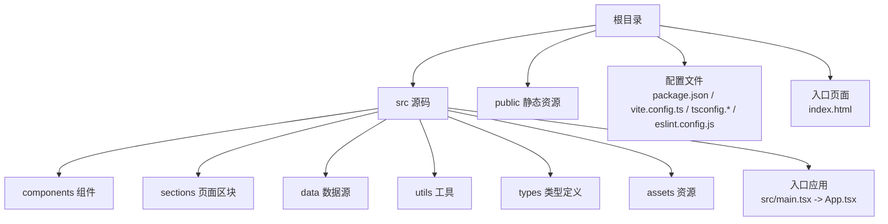
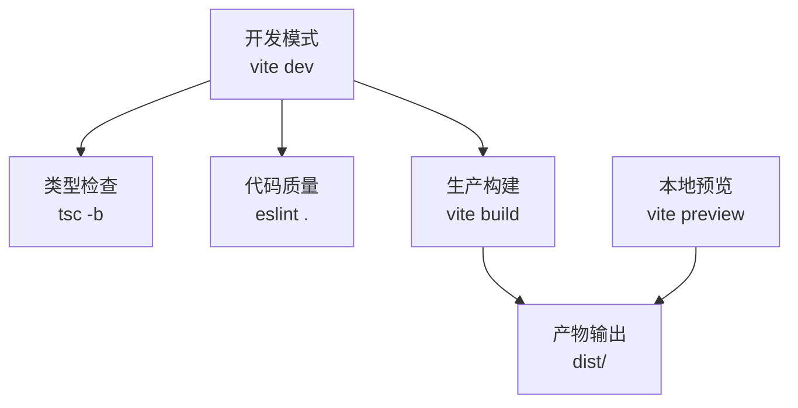
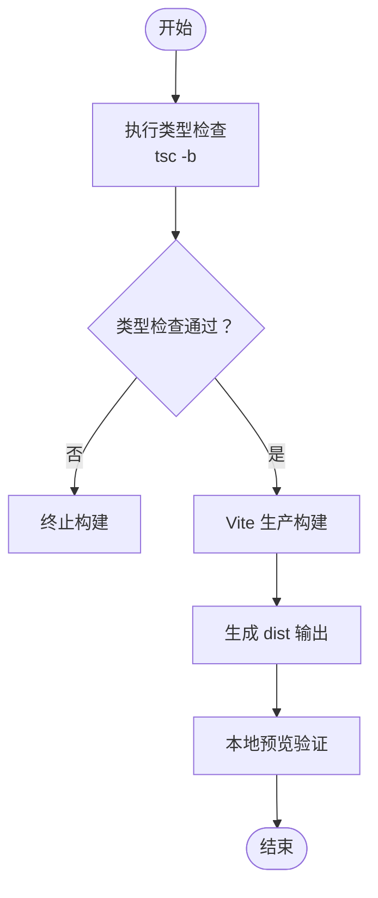
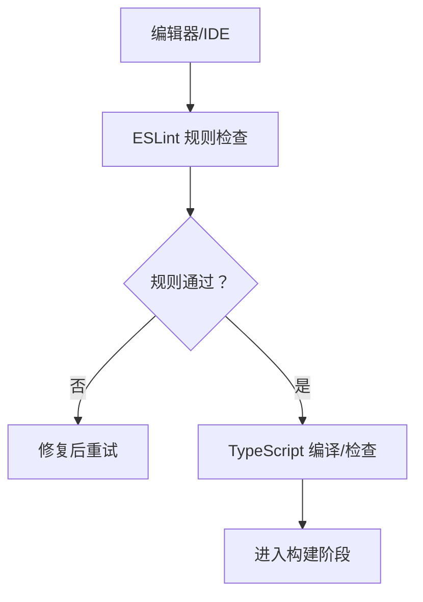
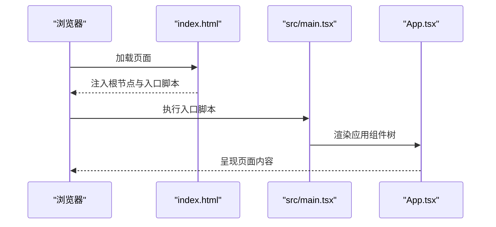
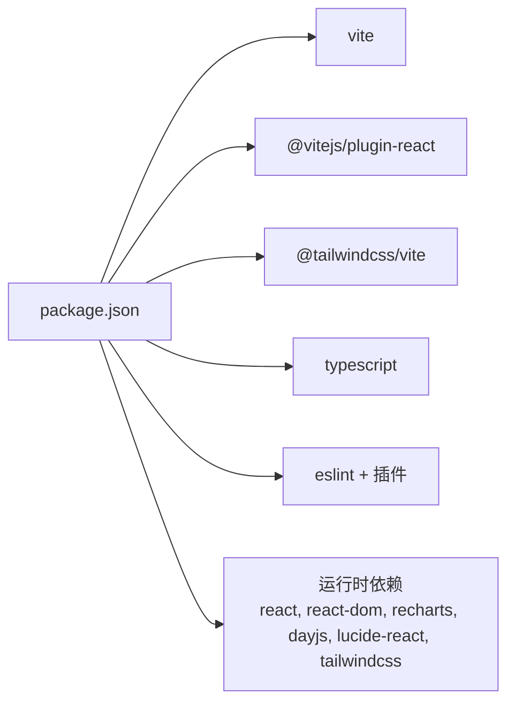

# 部署与维护

<cite>
**本文引用的文件**
- [package.json](file://package.json)
- [vite.config.ts](file://vite.config.ts)
- [README.md](file://README.md)
- [index.html](file://index.html)
- [src/main.tsx](file://src/main.tsx)
- [tsconfig.json](file://tsconfig.json)
- [tsconfig.app.json](file://tsconfig.app.json)
- [tsconfig.node.json](file://tsconfig.node.json)
- [eslint.config.js](file://eslint.config.js)
</cite>

## 目录
1. [简介](#简介)
2. [项目结构](#项目结构)
3. [核心组件](#核心组件)
4. [架构总览](#架构总览)
5. [详细组件分析](#详细组件分析)
6. [依赖分析](#依赖分析)
7. [性能考虑](#性能考虑)
8. [故障排查指南](#故障排查指南)
9. [结论](#结论)
10. [附录](#附录)

## 简介
本文件面向“碳普惠信息代理”项目的运维与发布团队，系统化梳理从本地开发到生产部署、从构建配置到打包优化、从域名与HTTPS到CI/CD与监控告警的全链路实践。由于当前仓库未包含CI/CD脚本、Docker镜像、Nginx配置等部署相关文件，本文在相应章节提供可落地的标准化建议与最佳实践，便于团队按需扩展。

## 项目结构
项目采用React + TypeScript + Vite技术栈，使用多配置文件组织编译与类型检查，通过Vite进行开发与构建，配合TailwindCSS与React插件完成样式与组件支持。

**图表来源**
- [index.html:1-14](file://index.html#L1-L14)
- [src/main.tsx:1-11](file://src/main.tsx#L1-L11)

**章节来源**
- [package.json:1-36](file://package.json#L1-L36)
- [vite.config.ts:1-8](file://vite.config.ts#L1-L8)
- [tsconfig.json:1-8](file://tsconfig.json#L1-L8)
- [tsconfig.app.json:1-29](file://tsconfig.app.json#L1-L29)
- [tsconfig.node.json:1-27](file://tsconfig.node.json#L1-L27)
- [eslint.config.js:1-24](file://eslint.config.js#L1-L24)
- [index.html:1-14](file://index.html#L1-L14)
- [src/main.tsx:1-11](file://src/main.tsx#L1-L11)

## 核心组件
- 构建与打包：基于Vite的开发服务器与生产构建，结合React与TailwindCSS插件。
- 类型与校验：TypeScript多配置分层（应用与Node），ESLint规则集。
- 运行时入口：HTML模板与React根节点挂载。
- 依赖生态：React、React DOM、Recharts、Day.js、Lucide React、TailwindCSS等。

**章节来源**
- [package.json:6-11](file://package.json#L6-L11)
- [vite.config.ts:5-7](file://vite.config.ts#L5-L7)
- [tsconfig.app.json:1-29](file://tsconfig.app.json#L1-L29)
- [tsconfig.node.json:1-27](file://tsconfig.node.json#L1-L27)
- [eslint.config.js:8-23](file://eslint.config.js#L8-L23)
- [index.html:1-14](file://index.html#L1-L14)
- [src/main.tsx:1-11](file://src/main.tsx#L1-L11)

## 架构总览
下图展示从开发到生产的端到端流程：本地开发（Vite HMR）、类型检查（tsc）、代码质量（ESLint）、打包（Vite）、预览（Vite Preview）以及最终产物输出。

**图表来源**
- [package.json:6-11](file://package.json#L6-L11)
- [vite.config.ts:5-7](file://vite.config.ts#L5-L7)

## 详细组件分析

### 构建配置与打包优化
- Vite基础配置：启用React与TailwindCSS插件，满足组件与样式需求。
- 多配置分层：应用侧与Node侧分别约束模块解析、严格类型与语法擦除，提升构建稳定性与类型安全。
- 构建脚本：先执行类型检查再进行打包，确保类型问题在构建阶段暴露；预览脚本用于验证产物可用性。
- HTML入口：统一的HTML模板负责注入根节点与图标，保证运行时渲染入口一致。

**图表来源**
- [package.json:6-11](file://package.json#L6-L11)
- [vite.config.ts:5-7](file://vite.config.ts#L5-L7)
- [tsconfig.app.json:1-29](file://tsconfig.app.json#L1-L29)
- [tsconfig.node.json:1-27](file://tsconfig.node.json#L1-L27)

**章节来源**
- [vite.config.ts:5-7](file://vite.config.ts#L5-L7)
- [package.json:6-11](file://package.json#L6-L11)
- [tsconfig.app.json:1-29](file://tsconfig.app.json#L1-L29)
- [tsconfig.node.json:1-27](file://tsconfig.node.json#L1-L27)
- [index.html:1-14](file://index.html#L1-L14)

### 代码质量与类型安全
- ESLint规则：推荐规则、React Hooks、React Refresh与全局浏览器环境配置，保障开发体验与一致性。
- TypeScript配置：应用侧启用严格模式、未使用变量/参数检测、语法擦除仅保留类型信息，避免运行时开销；Node侧聚焦工具链与Vite配置类型。
- README中提供了更严格的类型感知配置示例，可用于生产级应用增强。

**图表来源**
- [eslint.config.js:8-23](file://eslint.config.js#L8-L23)
- [tsconfig.app.json:19-25](file://tsconfig.app.json#L19-L25)
- [tsconfig.node.json:17-23](file://tsconfig.node.json#L17-L23)
- [README.md:14-73](file://README.md#L14-L73)

**章节来源**
- [eslint.config.js:1-24](file://eslint.config.js#L1-L24)
- [tsconfig.app.json:1-29](file://tsconfig.app.json#L1-L29)
- [tsconfig.node.json:1-27](file://tsconfig.node.json#L1-L27)
- [README.md:14-73](file://README.md#L14-L73)

### 运行时入口与静态资源
- HTML模板：声明视口、语言、标题与Favicon，挂载React根节点，加载应用入口脚本。
- 入口脚本：创建根容器并渲染应用组件树，确保严格模式开启以捕获潜在问题。

**图表来源**
- [index.html:1-14](file://index.html#L1-L14)
- [src/main.tsx:1-11](file://src/main.tsx#L1-L11)

**章节来源**
- [index.html:1-14](file://index.html#L1-L14)
- [src/main.tsx:1-11](file://src/main.tsx#L1-L11)

## 依赖分析
- 运行时依赖：React、React DOM、Recharts、Day.js、Lucide React、TailwindCSS及其Vite插件。
- 开发依赖：Vite、@vitejs/plugin-react、@tailwindcss/vite、TypeScript、ESLint及相关插件。
- 依赖关系耦合：构建与运行时插件通过Vite集中管理；类型与质量工具独立于运行时，降低耦合度。

**图表来源**
- [package.json:12-34](file://package.json#L12-L34)

**章节来源**
- [package.json:12-34](file://package.json#L12-L34)

## 性能考虑
- 构建性能：启用Bundler模式与模块解析策略，减少冗余扫描；类型擦除仅保留编译期信息，避免运行时负担。
- 代码分割与懒加载：建议在路由层面引入动态导入，结合Vite的原生代码分割能力进一步拆分包体。
- 资源优化：利用Vite内置压缩与哈希命名策略，结合CDN缓存策略提升二次加载性能。
- 图表与日期处理：Recharts与Day.js均为轻量库，建议在业务层按需引入，避免重复依赖。

[本节为通用性能建议，无需特定文件引用]

## 故障排查指南
- 构建失败
  - 现象：构建报错或类型检查失败。
  - 排查：优先查看类型检查输出，修正类型问题后再尝试构建；确认Vite与插件版本兼容。
  - 参考路径：[package.json:6-11](file://package.json#L6-L11)、[tsconfig.app.json:1-29](file://tsconfig.app.json#L1-L29)、[tsconfig.node.json:1-27](file://tsconfig.node.json#L1-L27)
- 预览异常
  - 现象：本地预览无法打开或空白页。
  - 排查：确认HTML模板中的根节点存在且入口脚本正确；检查浏览器控制台错误。
  - 参考路径：[index.html:1-14](file://index.html#L1-L14)、[src/main.tsx:1-11](file://src/main.tsx#L1-L11)
- 代码质量告警
  - 现象：ESLint报错或警告。
  - 排查：根据规则提示修复；必要时调整ESLint配置以适配团队规范。
  - 参考路径：[eslint.config.js:8-23](file://eslint.config.js#L8-L23)
- 生产环境访问问题
  - 现象：页面空白、资源404或跨域。
  - 排查：核对静态资源路径与基础路径配置；确认服务器正确指向dist目录；检查CORS与HTTPS设置。
  - 参考路径：[vite.config.ts:5-7](file://vite.config.ts#L5-L7)

**章节来源**
- [package.json:6-11](file://package.json#L6-L11)
- [tsconfig.app.json:1-29](file://tsconfig.app.json#L1-L29)
- [tsconfig.node.json:1-27](file://tsconfig.node.json#L1-L27)
- [index.html:1-14](file://index.html#L1-L14)
- [src/main.tsx:1-11](file://src/main.tsx#L1-L11)
- [eslint.config.js:8-23](file://eslint.config.js#L8-L23)
- [vite.config.ts:5-7](file://vite.config.ts#L5-L7)

## 结论
本项目以Vite为核心构建体系，结合TypeScript与ESLint形成从开发到生产的完整质量闭环。建议在现有基础上补充CI/CD流水线、Docker镜像与Nginx部署配置，并建立完善的监控与日志体系，以支撑生产环境的稳定运行与快速迭代。

[本节为总结性内容，无需特定文件引用]

## 附录

### A. 生产环境部署策略与域名/HTTPS
- 静态站点托管：将dist目录部署至CDN或静态托管平台（如GitHub Pages、Vercel、Cloudflare Pages等），确保基础路径与回退路由配置正确。
- 自建服务器：使用Nginx/Apache等反向代理指向dist目录；配置Gzip/Br压缩、HTTP/2与HSTS；证书由Let’s Encrypt或其他CA签发。
- HTTPS与安全：强制HTTPS访问，启用HSTS与安全头部；合理配置CSP与缓存策略。
- 域名与CDN：绑定自有域名并通过CDN加速；开启灰度与蓝绿发布策略以降低风险。

[本节为概念性建议，无需特定文件引用]

### B. CI/CD流程与自动化测试
- 流水线阶段：拉取代码 → 安装依赖 → 类型检查 → 单元/集成测试 → Lint → 构建 → 产物上传 → 部署预发布/生产。
- 触发条件：分支保护、PR合并、标签发布、定时巡检。
- 测试建议：为关键模块编写单元测试与端到端测试；结合覆盖率报告评估质量。
- 缓存策略：缓存Node模块与构建缓存，缩短流水线时间。

[本节为概念性建议，无需特定文件引用]

### C. 版本升级策略、依赖更新与安全补丁
- 依赖升级：定期扫描安全公告与依赖更新；优先小版本升级，重大版本进行充分测试。
- 回滚策略：采用蓝绿/滚动发布，保留上一版本镜像以便快速回滚。
- 安全基线：启用依赖漏洞扫描与许可证合规检查；对高危漏洞及时修补。

[本节为概念性建议，无需特定文件引用]

### D. 备份策略、灾难恢复与运维监控
- 备份：定期备份源码、配置与构建产物；数据库与外部服务另案备份。
- 监控：接入应用性能监控（APM）、日志聚合与告警平台；关注页面加载时延、错误率与用户行为。
- 灾备：多区域部署与自动切换；制定演练计划与应急预案。

[本节为概念性建议，无需特定文件引用]

### E. 维护检查清单
- 每日：健康检查、日志巡检、缓存命中率与错误率统计。
- 每周：依赖安全扫描、构建性能回归对比、容量与配额预警。
- 每月：压测与回归测试、文档与流程复盘。

[本节为概念性建议，无需特定文件引用]