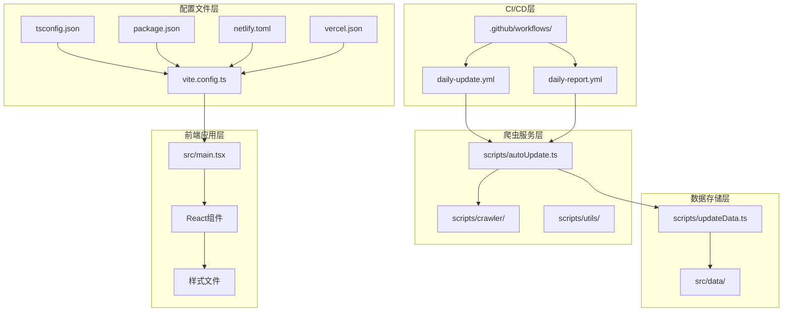
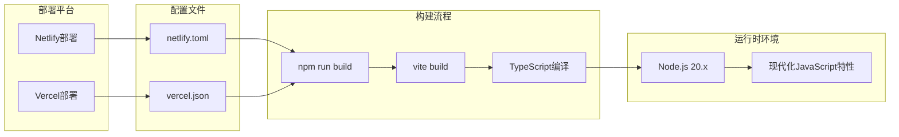
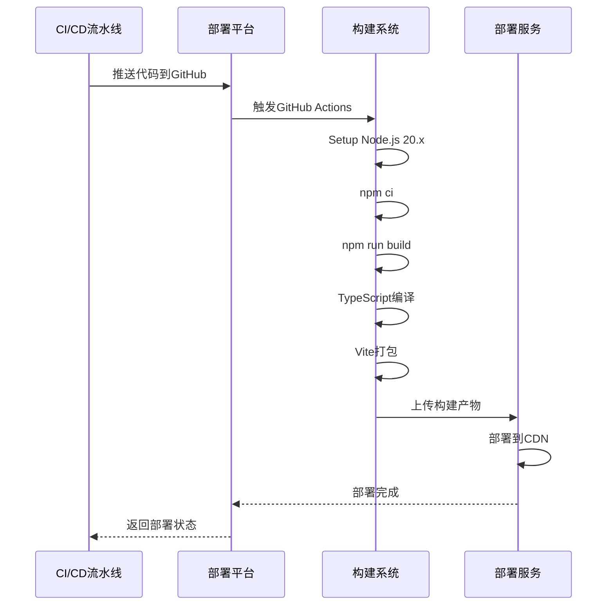
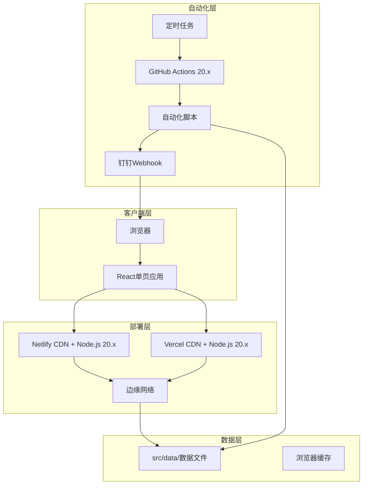
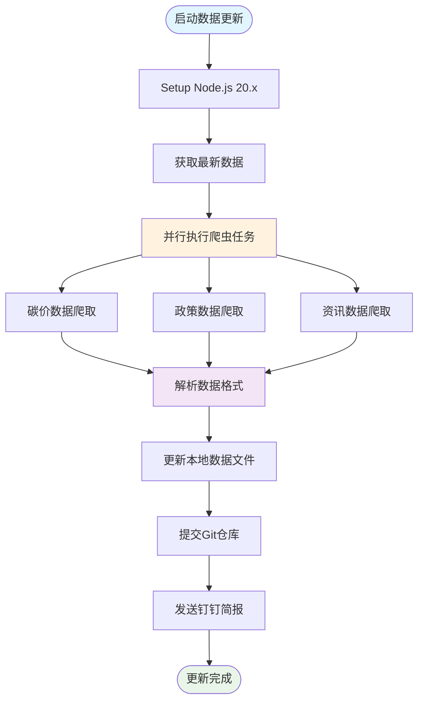
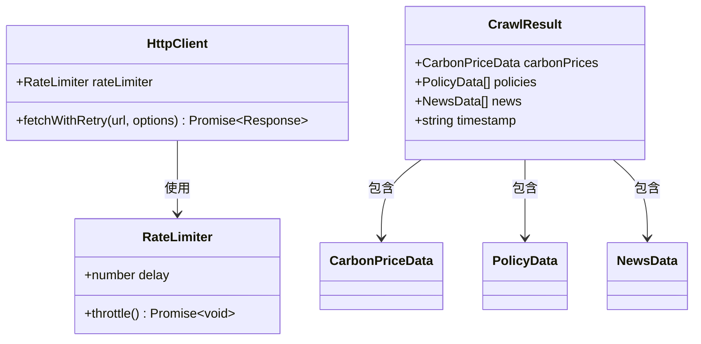
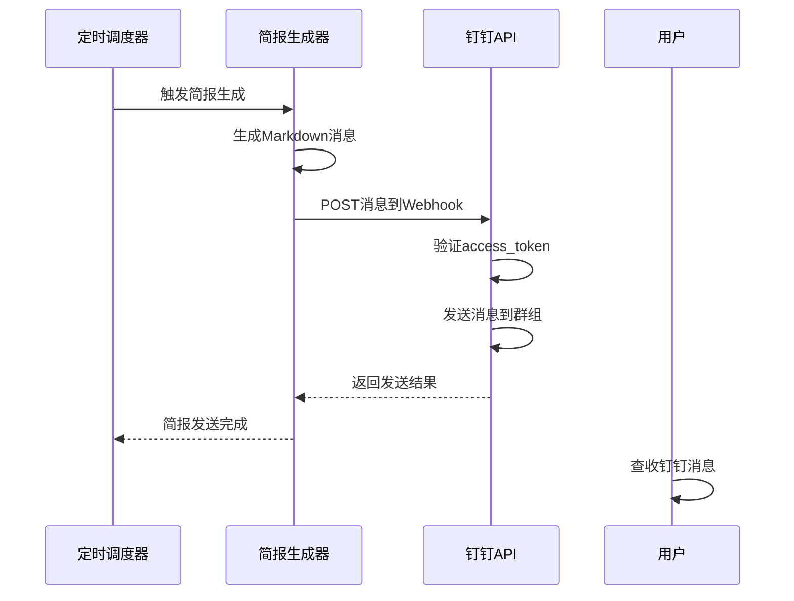

# 现代化部署配置

<cite>
**本文档引用的文件**
- [package.json](file://package.json)
- [netlify.toml](file://netlify.toml)
- [vercel.json](file://vercel.json)
- [vite.config.ts](file://vite.config.ts)
- [tsconfig.json](file://tsconfig.json)
- [tsconfig.app.json](file://tsconfig.app.json)
- [README.md](file://README.md)
- [src/main.tsx](file://src/main.tsx)
- [scripts/autoUpdate.ts](file://scripts/autoUpdate.ts)
- [scripts/updateData.ts](file://scripts/updateData.ts)
- [scripts/sendDingTalk.ts](file://scripts/sendDingTalk.ts)
- [.github/workflows/daily-update.yml](file://.github/workflows/daily-update.yml)
- [.github/workflows/daily-report.yml](file://.github/workflows/daily-report.yml)
</cite>

## 更新摘要
**变更内容**
- 更新Netlify构建配置，将Node.js版本升级到20.x
- 优化GitHub Actions工作流，统一使用Node.js 20环境
- 增强持续部署管道的兼容性和性能
- 保持现有自动化部署流程不变

## 目录
1. [简介](#简介)
2. [项目结构](#项目结构)
3. [核心组件](#核心组件)
4. [架构概览](#架构概览)
5. [详细组件分析](#详细组件分析)
6. [依赖关系分析](#依赖关系分析)
7. [性能考虑](#性能考虑)
8. [故障排除指南](#故障排除指南)
9. [结论](#结论)

## 简介

这是一个基于现代技术栈构建的碳普惠资讯代理系统，采用React + TypeScript + Vite + TailwindCSS技术组合。该系统提供了实时碳市场价格监控、政策动态跟踪和相关新闻资讯的功能，支持自动化数据更新和钉钉消息推送。

系统的核心特点包括：
- 现代化的前端框架和构建工具链
- 模块化的爬虫架构设计
- 自动化的数据更新和部署流程
- 安全的生产环境配置
- 可扩展的数据源集成能力
- 多平台部署支持（Netlify/Vercel）
- **新增** Node.js 20.x的现代化运行时环境

## 项目结构

该项目采用清晰的分层架构，主要分为以下几个部分：



**图表来源**
- [src/main.tsx:1-11](file://src/main.tsx#L1-L11)
- [vite.config.ts:1-8](file://vite.config.ts#L1-L8)
- [package.json:1-40](file://package.json#L1-L40)
- [netlify.toml:1-12](file://netlify.toml#L1-L12)
- [vercel.json:1-43](file://vercel.json#L1-L43)
- [.github/workflows/daily-update.yml:1-54](file://.github/workflows/daily-update.yml#L1-L54)
- [.github/workflows/daily-report.yml:1-40](file://.github/workflows/daily-report.yml#L1-L40)

**章节来源**
- [package.json:1-40](file://package.json#L1-L40)
- [netlify.toml:1-12](file://netlify.toml#L1-L12)
- [vercel.json:1-43](file://vercel.json#L1-L43)
- [vite.config.ts:1-8](file://vite.config.ts#L1-L8)
- [tsconfig.json:1-8](file://tsconfig.json#L1-L8)

## 核心组件

### 构建配置系统

系统采用Vite作为构建工具，配合TypeScript进行类型检查，确保开发和生产环境的一致性。

**构建配置特性：**
- 使用React插件提供热重载和快速编译
- TailwindCSS集成提供现代化的样式解决方案
- TypeScript严格模式确保代码质量
- 生产环境优化和代码分割

### 多平台部署配置

系统现已支持多平台部署，包括 Netlify 和 Vercel 两种部署方式，均使用Node.js 20.x运行时环境：



**更新** 所有部署平台现在使用Node.js 20.x，提供更好的性能和兼容性

**图表来源**
- [netlify.toml:10-12](file://netlify.toml#L10-L12)
- [vercel.json:1-43](file://vercel.json#L1-L43)
- [package.json:8-8](file://package.json#L8-L8)

**章节来源**
- [netlify.toml:1-12](file://netlify.toml#L1-L12)
- [vercel.json:1-43](file://vercel.json#L1-L43)
- [package.json:6-14](file://package.json#L6-L14)

### GitHub Actions自动化部署

系统集成了完整的自动化部署流程，支持 Netlify 和 Vercel 平台的无缝部署，所有工作流都使用Node.js 20.x环境：



**更新** GitHub Actions工作流现在统一使用Node.js 20.x，确保与Netlify构建环境的一致性

**图表来源**
- [.github/workflows/daily-update.yml:21-25](file://.github/workflows/daily-update.yml#L21-L25)
- [.github/workflows/daily-report.yml:17-21](file://.github/workflows/daily-report.yml#L17-L21)
- [netlify.toml:10-12](file://netlify.toml#L10-L12)

**章节来源**
- [.github/workflows/daily-update.yml:1-54](file://.github/workflows/daily-update.yml#L1-L54)
- [.github/workflows/daily-report.yml:1-40](file://.github/workflows/daily-report.yml#L1-L40)
- [netlify.toml:1-12](file://netlify.toml#L1-L12)

## 架构概览

系统采用前后端分离的现代化架构，前端使用React单页应用，后端采用无服务器函数和自动化脚本。现已支持多平台部署，所有环境均使用Node.js 20.x：



**更新** 所有部署环境现在使用Node.js 20.x，提供更好的性能和现代化特性支持

**图表来源**
- [netlify.toml:10-12](file://netlify.toml#L10-L12)
- [vercel.json:1-43](file://vercel.json#L1-L43)
- [.github/workflows/daily-update.yml:21-25](file://.github/workflows/daily-update.yml#L21-L25)
- [.github/workflows/daily-report.yml:17-21](file://.github/workflows/daily-report.yml#L17-L21)

## 详细组件分析

### 数据更新流程

系统实现了完整的自动化数据更新流程，确保资讯的实时性和准确性：



**图表来源**
- [.github/workflows/daily-update.yml:21-25](file://.github/workflows/daily-update.yml#L21-L25)
- [.github/workflows/daily-report.yml:17-21](file://.github/workflows/daily-report.yml#L17-L21)
- [scripts/autoUpdate.ts:18-53](file://scripts/autoUpdate.ts#L18-L53)
- [scripts/updateData.ts:135-161](file://scripts/updateData.ts#L135-L161)

**章节来源**
- [scripts/autoUpdate.ts:1-53](file://scripts/autoUpdate.ts#L1-L53)
- [scripts/updateData.ts:1-194](file://scripts/updateData.ts#L1-L194)
- [.github/workflows/daily-update.yml:1-54](file://.github/workflows/daily-update.yml#L1-L54)
- [.github/workflows/daily-report.yml:1-40](file://.github/workflows/daily-report.yml#L1-L40)

### 爬虫系统设计

爬虫系统采用了模块化和可扩展的设计，支持多种数据源的统一管理：



**图表来源**
- [scripts/crawler/baseCrawler.ts:6-65](file://scripts/crawler/baseCrawler.ts#L6-L65)
- [scripts/crawler/index.ts:15-21](file://scripts/crawler/index.ts#L15-L21)

**章节来源**
- [scripts/crawler/baseCrawler.ts:1-65](file://scripts/crawler/baseCrawler.ts#L1-L65)
- [scripts/crawler/index.ts:1-57](file://scripts/crawler/index.ts#L1-L57)

### 钉钉集成系统

系统集成了钉钉消息推送功能，用于自动化发送每日简报：



**图表来源**
- [scripts/sendDingTalk.ts:48-61](file://scripts/sendDingTalk.ts#L48-L61)
- [scripts/sendDingTalk.ts:14-43](file://scripts/sendDingTalk.ts#L14-L43)

**章节来源**
- [scripts/sendDingTalk.ts:1-61](file://scripts/sendDingTalk.ts#L1-L61)

## 依赖关系分析

系统采用现代化的依赖管理策略，确保开发和生产环境的一致性：

```mermaid
graph LR
subgraph "运行时依赖"
A[react@^19.2.4]
B[react-dom@^19.2.4]
C[dayjs@^1.11.20]
D[lucide-react@^0.577.0]
E[recharts@^3.8.0]
F[tailwindcss@^4.2.2]
end
subgraph "开发依赖"
G[@vitejs/plugin-react@^6.0.1]
H[typescript@~5.9.3]
I[vite@^8.0.1]
J[eslint@^9.39.4]
K[tsx@^4.7.0]
end
subgraph "构建工具"
L[Vite]
M[TailwindCSS]
N[TypeScript]
O[ESLint]
end
subgraph "运行时环境"
P[Node.js 20.x]
Q[现代化JavaScript特性]
end
A --> L
B --> L
C --> L
D --> L
E --> L
F --> M
G --> L
H --> N
I --> L
J --> O
K --> L
L --> P
M --> P
N --> P
O --> P
P --> Q
```

**更新** 所有构建和运行时环境现在使用Node.js 20.x，提供更好的性能和兼容性

**图表来源**
- [package.json:15-38](file://package.json#L15-L38)
- [netlify.toml:10-12](file://netlify.toml#L10-L12)

**章节来源**
- [package.json:1-40](file://package.json#L1-L40)

## 性能考虑

系统在多个层面进行了性能优化：

### 构建性能优化
- 使用Vite提供快速的开发体验和高效的生产构建
- TypeScript的bundler模式减少打包体积
- TailwindCSS按需生成样式，避免全局样式污染

### 运行时性能优化
- React组件的懒加载和代码分割
- 图表数据的虚拟化渲染
- 缓存策略优化静态资源加载

### 爬虫性能优化
- 并行执行多个爬虫任务
- 智能的请求限流和重试机制
- 数据去重和过滤提高准确性

### 部署性能优化
- **新增** 多平台部署支持，可根据地理位置选择最优CDN节点
- **新增** Netlify 和 Vercel 的差异化配置优化
- **新增** 自动化部署流程的并行处理能力
- **新增** Node.js 20.x的现代化运行时环境，提供更好的性能和兼容性

### 环境一致性优化
- **新增** GitHub Actions工作流统一使用Node.js 20.x
- **新增** Netlify构建环境与CI/CD环境保持一致
- **新增** 减少环境差异导致的构建问题

## 故障排除指南

### 常见问题及解决方案

**构建失败**
- 检查TypeScript配置文件的正确性
- 确认Node.js版本兼容性（Netlify使用 Node 20）
- 验证依赖包的完整性

**爬虫数据获取失败**
- 检查目标网站的可访问性
- 验证网络连接和防火墙设置
- 查看爬虫的错误日志和重试机制

**部署问题**
- 确认部署配置文件的正确性（netlify.toml 或 vercel.json）
- 检查环境变量的设置
- 验证CDN缓存的清除
- **新增** 确认部署平台的Node.js 20.x兼容性配置

**CI/CD问题**
- **新增** 确认GitHub Actions工作流使用Node.js 20.x环境
- **新增** 检查构建缓存和依赖安装是否正常
- **新增** 验证环境变量和密钥配置

**章节来源**
- [scripts/crawler/baseCrawler.ts:60-65](file://scripts/crawler/baseCrawler.ts#L60-L65)
- [scripts/sendDingTalk.ts:39-42](file://scripts/sendDingTalk.ts#L39-L42)
- [netlify.toml:10-12](file://netlify.toml#L10-L12)
- [vercel.json:7-7](file://vercel.json#L7-L7)
- [.github/workflows/daily-update.yml:21-25](file://.github/workflows/daily-update.yml#L21-L25)

## 结论

该现代化部署配置展现了现代前端项目的最佳实践，通过合理的架构设计和技术选型，实现了高效、可维护和可扩展的系统。系统的关键优势包括：

1. **技术栈现代化**：采用React + TypeScript + Vite + TailwindCSS的组合，提供优秀的开发体验
2. **自动化程度高**：完整的CI/CD流程和自动化数据更新机制
3. **可扩展性强**：模块化的架构设计支持新功能的快速集成
4. **部署灵活性增强**：支持 Netlify 和 Vercel 双平台部署，提供更优的全球访问性能
5. **安全性保障**：生产环境的安全头配置和HTTPS强制
6. **运维简化**：统一的构建流程和部署配置，降低运维复杂度
7. **环境一致性**：Node.js 20.x的现代化运行时环境，确保开发和生产环境的一致性

**更新** 新增的 Node.js 20.x 支持为系统提供了更好的性能和现代化特性，同时统一了CI/CD和部署环境，减少了环境差异导致的问题。Netlify 和 Vercel 的差异化配置优化进一步提升了全球用户的访问体验。

该系统为碳普惠资讯领域提供了一个可靠的数字化解决方案，具有良好的推广价值和应用前景。