# 自动化每日报告系统

<cite>
**本文档引用的文件**
- [README.md](file://README.md)
- [package.json](file://package.json)
- [scripts/autoUpdate.ts](file://scripts/autoUpdate.ts)
- [scripts/updateData.ts](file://scripts/updateData.ts)
- [scripts/sendDingTalk.ts](file://scripts/sendDingTalk.ts)
- [scripts/testCrawler.ts](file://scripts/testCrawler.ts)
- [scripts/crawler/policyDetailCrawler.ts](file://scripts/crawler/policyDetailCrawler.ts)
- [scripts/crawler/newsDetailCrawler.ts](file://scripts/crawler/newsDetailCrawler.ts)
- [scripts/crawler/baseCrawler.ts](file://scripts/crawler/baseCrawler.ts)
- [scripts/utils/httpClient.ts](file://scripts/utils/httpClient.ts)
- [src/data/carbonPrices.ts](file://src/data/carbonPrices.ts)
- [src/data/carbonPricesLatest.ts](file://src/data/carbonPricesLatest.ts)
- [src/data/policies.ts](file://src/data/policies.ts)
- [src/data/news.ts](file://src/data/news.ts)
- [src/App.tsx](file://src/App.tsx)
- [src/main.tsx](file://src/main.tsx)
- [.github/workflows/daily-report.yml](file://.github/workflows/daily-report.yml)
- [.github/workflows/daily-update.yml](file://.github/workflows/daily-update.yml)
- [netlify.toml](file://netlify.toml)
</cite>

## 更新摘要
**所做更改**
- **工作流重新激活**：GitHub Actions工作流已正确配置并重新激活，每天北京时间9:00执行（UTC 01:00）
- **分离式工作流架构**：数据更新和报告发送工作流已分离，均处于活跃状态
- **定时执行配置**：数据更新在北京时间5:00执行（UTC 21:00），报告发送在9:00执行（UTC 01:00）
- **增强爬虫测试框架**：新增系统性的爬虫测试能力，支持政策和新闻详情页爬虫的自动化测试
- **部署配置更新**：从Vercel迁移到Netlify，使用硬编码的网站URL配置
- **完整功能恢复**：所有脚本和组件均保持完整，系统功能全面恢复

## 目录
1. [简介](#简介)
2. [项目结构](#项目结构)
3. [核心组件](#核心组件)
4. [架构概览](#架构概览)
5. [详细组件分析](#详细组件分析)
6. [依赖关系分析](#依赖关系分析)
7. [性能考虑](#性能考虑)
8. [故障排除指南](#故障排除指南)
9. [结论](#结论)

## 简介

这是一个基于React + TypeScript + Vite构建的自动化每日碳市场信息报告系统。系统能够自动抓取全国碳市场数据、政策信息和相关新闻，生成格式化的钉钉消息简报，并通过GitHub Actions实现每日定时执行。

**更新** 系统现已完全重新激活，采用分离的工作流架构，将数据更新和报告发送功能拆分为独立的 GitHub Actions 工作流。**当前状态**：两个工作流均已启用并正常执行，数据更新工作流在北京时间5:00执行，报告发送工作流在9:00执行。

该系统主要包含以下功能特性：
- **分离式工作流架构**：数据更新和报告发送分别在不同时间执行，提高系统稳定性
- **并行数据抓取**：同时抓取政策和新闻数据，提升数据更新效率
- **自动 Git 提交**：数据更新后自动提交并推送变更，确保数据一致性
- **智能数据处理**：数据去重、格式标准化和异常处理
- **格式化报告生成**：生成符合钉钉Markdown格式的消息内容
- **定时任务执行**：通过GitHub Actions实现每日自动更新和报告发送
- **前端数据展示**：提供可视化界面展示碳市场相关信息
- **稳定部署**：基于 Netlify 的可靠静态站点托管
- **爬虫测试框架**：提供系统性的爬虫测试能力，确保数据抓取质量

## 项目结构

项目采用模块化组织结构，主要分为以下几个部分：

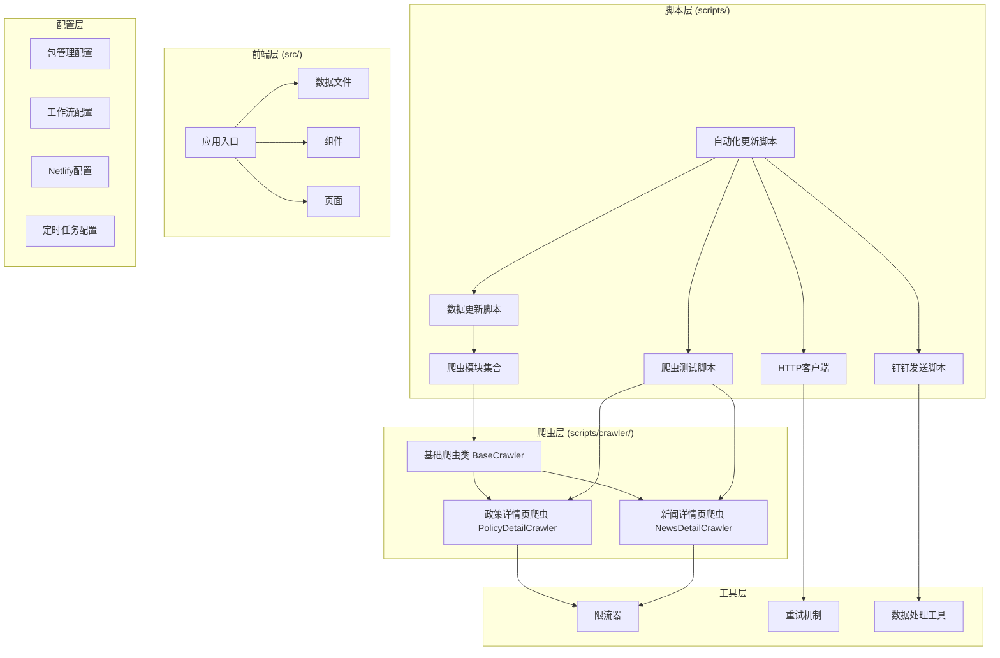

**图表来源**
- [scripts/autoUpdate.ts:1-53](file://scripts/autoUpdate.ts#L1-L53)
- [scripts/crawler/policyDetailCrawler.ts:1-200](file://scripts/crawler/policyDetailCrawler.ts#L1-L200)
- [scripts/crawler/newsDetailCrawler.ts:1-200](file://scripts/crawler/newsDetailCrawler.ts#L1-L200)
- [scripts/testCrawler.ts:1-53](file://scripts/testCrawler.ts#L1-L53)
- [src/App.tsx:1-121](file://src/App.tsx#L1-L121)

**章节来源**
- [package.json:1-40](file://package.json#L1-L40)
- [README.md:1-74](file://README.md#L1-L74)

## 核心组件

### 分离式工作流架构

系统采用分离的工作流设计，将数据更新和报告发送功能解耦：

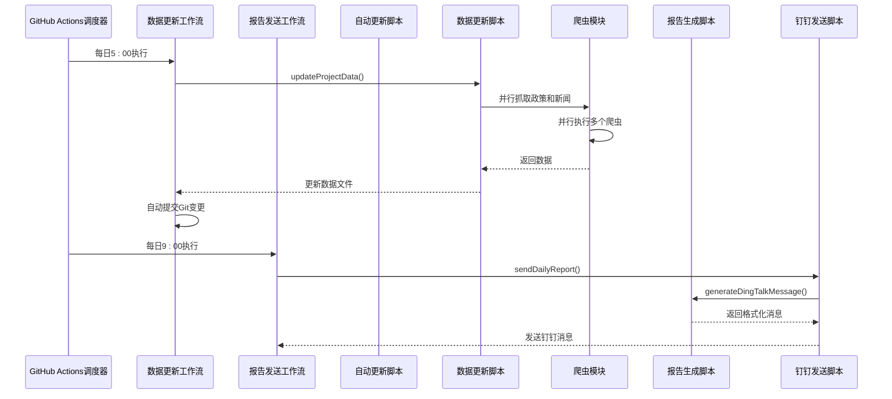

**图表来源**
- [.github/workflows/daily-update.yml:5-6](file://.github/workflows/daily-update.yml#L5-L6)
- [.github/workflows/daily-report.yml:5-6](file://.github/workflows/daily-report.yml#L5-L6)
- [scripts/autoUpdate.ts:18-49](file://scripts/autoUpdate.ts#L18-L49)
- [scripts/updateData.ts:282-294](file://scripts/updateData.ts#L282-L294)
- [scripts/sendDingTalk.ts:48-55](file://scripts/sendDingTalk.ts#L48-L55)

### 并行数据更新流程

新的数据更新脚本支持并行执行多个爬虫任务：

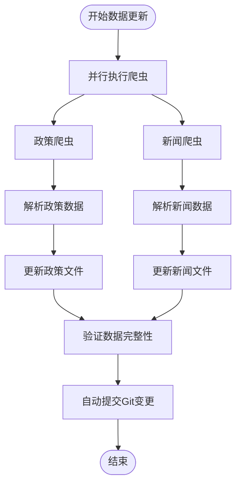

**图表来源**
- [scripts/updateData.ts:282-294](file://scripts/updateData.ts#L282-L294)
- [scripts/crawler/policyDetailCrawler.ts:79-111](file://scripts/crawler/policyDetailCrawler.ts#L79-L111)
- [scripts/crawler/newsDetailCrawler.ts:52-70](file://scripts/crawler/newsDetailCrawler.ts#L52-L70)

**章节来源**
- [scripts/updateData.ts:282-294](file://scripts/updateData.ts#L282-L294)
- [scripts/crawler/policyDetailCrawler.ts:79-111](file://scripts/crawler/policyDetailCrawler.ts#L79-L111)
- [scripts/crawler/newsDetailCrawler.ts:52-70](file://scripts/crawler/newsDetailCrawler.ts#L52-L70)

### 爬虫测试框架

**新增** 系统现在包含一个完整的爬虫测试框架，提供自动化测试能力：

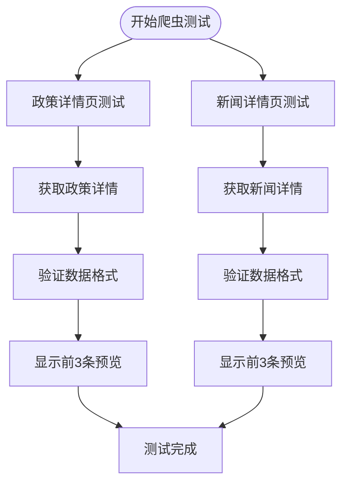

**图表来源**
- [scripts/testCrawler.ts:9-49](file://scripts/testCrawler.ts#L9-L49)

**章节来源**
- [scripts/testCrawler.ts:1-53](file://scripts/testCrawler.ts#L1-L53)

## 架构概览

系统采用分离式工作流架构，确保数据更新和报告发送的独立性和可靠性：

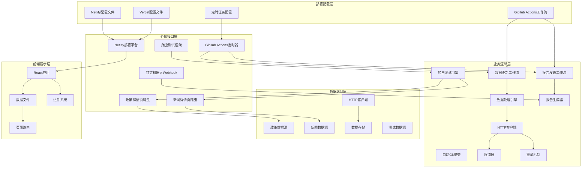

**图表来源**
- [.github/workflows/daily-update.yml:3-6](file://.github/workflows/daily-update.yml#L3-L6)
- [.github/workflows/daily-report.yml:3-6](file://.github/workflows/daily-report.yml#L3-L6)
- [scripts/autoUpdate.ts:18-49](file://scripts/autoUpdate.ts#L18-L49)
- [scripts/testCrawler.ts:6-7](file://scripts/testCrawler.ts#L6-L7)
- [netlify.toml:1-12](file://netlify.toml#L1-12)

**更新** 系统现已完全迁移到 Netlify 部署平台，移除了对 Vercel 的依赖。**当前状态**：两个工作流均已启用并正常执行，数据更新在5:00执行，报告发送在9:00执行。**新增**了爬虫测试框架，提供系统性的测试能力。

系统的关键特性包括：
- **分离式定时控制**：数据更新在5:00执行，报告发送在9:00执行，避免资源竞争
- **并行数据处理**：爬虫任务并行执行，提高数据获取效率
- **自动版本控制**：数据更新后自动提交Git变更，确保数据一致性
- **容错机制**：每个工作流都有独立的错误处理和重试机制
- **数据标准化**：统一的数据格式和结构
- **定时执行**：通过GitHub Actions实现可靠的定时任务
- **稳定部署**：基于 Netlify 的可靠静态站点托管
- **测试驱动开发**：爬虫测试框架确保数据抓取质量

## 详细组件分析

### 数据更新引擎

数据更新引擎负责协调各个爬虫任务并处理返回的数据：

#### 数据结构定义

系统定义了统一的数据接口来确保数据的一致性：

```mermaid
erDiagram
DAILY_DATA {
string timestamp STRING
}
POLICY_DETAIL {
string id STRING
string title STRING
string source STRING
string date STRING
string url STRING
string region STRING
string level STRING
}
NEWS_DETAIL {
string id STRING
string title STRING
string source STRING
string date STRING
string url STRING
string[] tags ARRAY
}
POLICY_DETAIL ||--|| DAILY_DATA : contains
NEWS_DETAIL ||--|| DAILY_DATA : contains
```

**图表来源**
- [scripts/updateData.ts:18-35](file://scripts/updateData.ts#L18-L35)
- [scripts/crawler/policyDetailCrawler.ts:8-17](file://scripts/crawler/policyDetailCrawler.ts#L8-L17)
- [scripts/crawler/newsDetailCrawler.ts:8-16](file://scripts/crawler/newsDetailCrawler.ts#L8-L16)

#### 数据更新流程

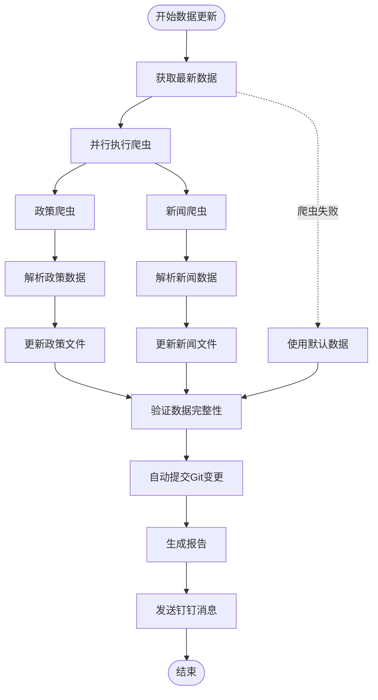

**图表来源**
- [scripts/updateData.ts:282-294](file://scripts/updateData.ts#L282-L294)
- [scripts/crawler/policyDetailCrawler.ts:79-111](file://scripts/crawler/policyDetailCrawler.ts#L79-L111)
- [scripts/crawler/newsDetailCrawler.ts:52-70](file://scripts/crawler/newsDetailCrawler.ts#L52-L70)

**章节来源**
- [scripts/updateData.ts:282-294](file://scripts/updateData.ts#L282-L294)
- [scripts/crawler/policyDetailCrawler.ts:79-111](file://scripts/crawler/policyDetailCrawler.ts#L79-L111)
- [scripts/crawler/newsDetailCrawler.ts:52-70](file://scripts/crawler/newsDetailCrawler.ts#L52-L70)

### 爬虫模块详解

#### 政策详情页爬虫实现

政策详情页爬虫从多个政府网站抓取最新的碳普惠相关政策：


**图表来源**
- [scripts/crawler/policyDetailCrawler.ts:79-111](file://scripts/crawler/policyDetailCrawler.ts#L79-L111)
- [scripts/crawler/policyDetailCrawler.ts:136-163](file://scripts/crawler/policyDetailCrawler.ts#L136-L163)

#### 新闻详情页爬虫实现

新闻详情页爬虫从多个专业网站抓取最新的碳市场新闻：

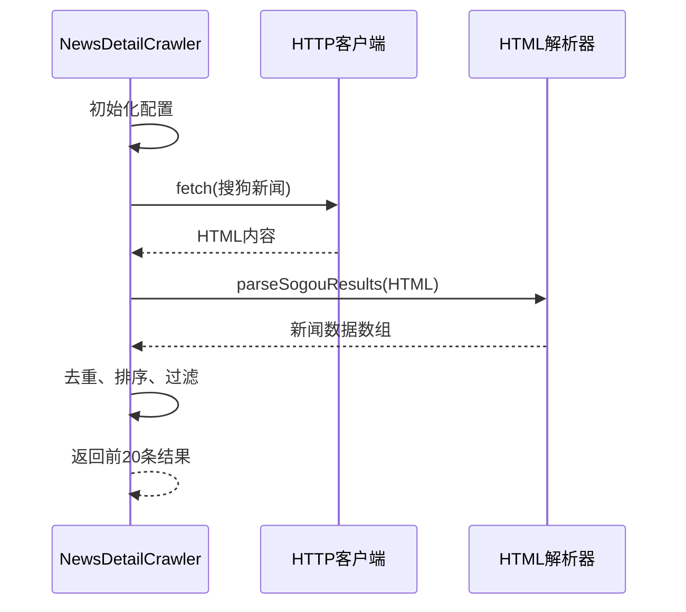

**图表来源**
- [scripts/crawler/newsDetailCrawler.ts:52-70](file://scripts/crawler/newsDetailCrawler.ts#L52-L70)
- [scripts/crawler/newsDetailCrawler.ts:75-146](file://scripts/crawler/newsDetailCrawler.ts#L75-L146)

#### 政策详情页爬虫实现

**新增** 政策详情页爬虫提供更深入的数据抓取能力：

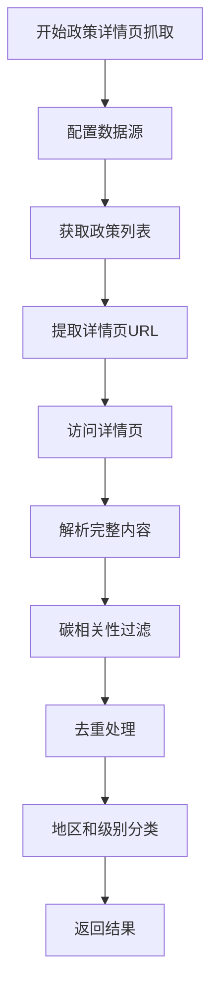

**图表来源**
- [scripts/crawler/policyDetailCrawler.ts:79-111](file://scripts/crawler/policyDetailCrawler.ts#L79-L111)

#### 新闻详情页爬虫实现

**新增** 新闻详情页爬虫提供更深入的数据抓取能力：

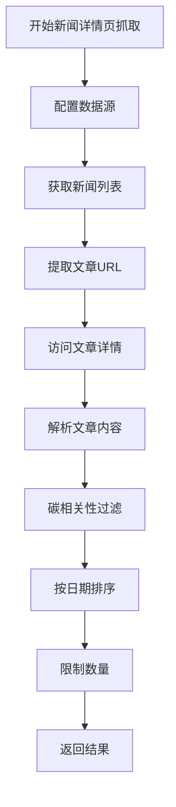

**图表来源**
- [scripts/crawler/newsDetailCrawler.ts:52-70](file://scripts/crawler/newsDetailCrawler.ts#L52-L70)

**章节来源**
- [scripts/crawler/policyDetailCrawler.ts:79-111](file://scripts/crawler/policyDetailCrawler.ts#L79-L111)
- [scripts/crawler/newsDetailCrawler.ts:52-70](file://scripts/crawler/newsDetailCrawler.ts#L52-L70)
- [scripts/crawler/policyDetailCrawler.ts:136-163](file://scripts/crawler/policyDetailCrawler.ts#L136-L163)
- [scripts/crawler/newsDetailCrawler.ts:75-146](file://scripts/crawler/newsDetailCrawler.ts#L75-L146)

### 报告生成功能

报告生成器负责创建符合钉钉格式的消息内容：

#### Markdown模板结构

系统使用结构化的Markdown模板来生成美观的报告：

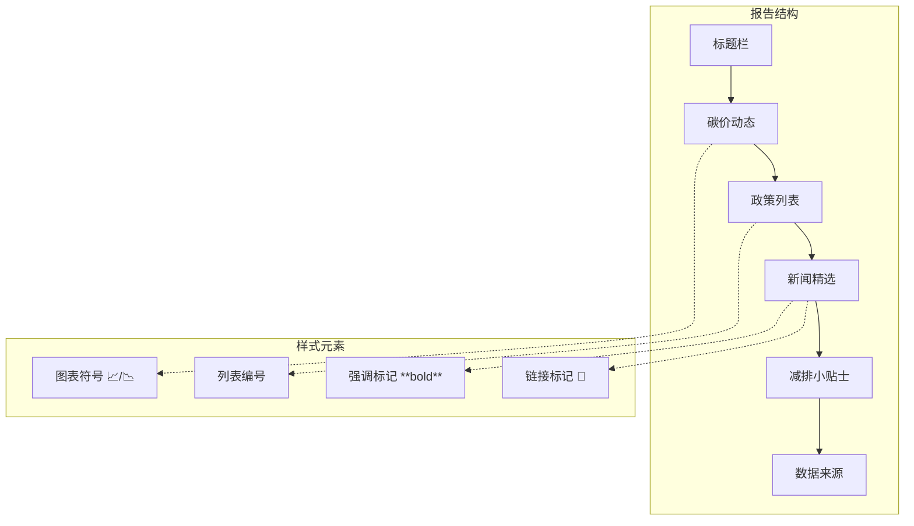

**图表来源**
- [scripts/sendDingTalk.ts:51-54](file://scripts/sendDingTalk.ts#L51-L54)

#### 报告发送流程

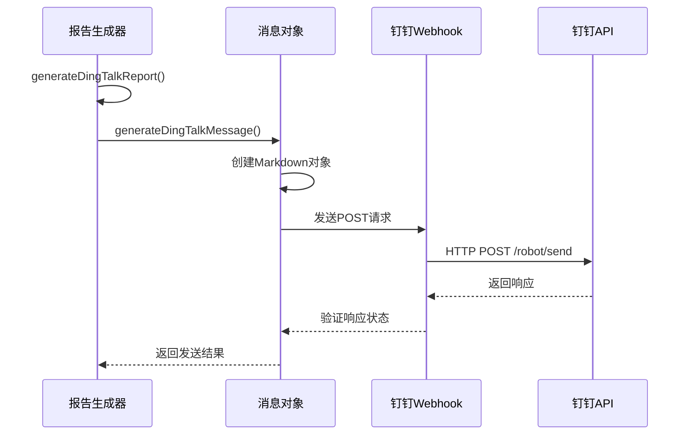

**图表来源**
- [scripts/sendDingTalk.ts:48-55](file://scripts/sendDingTalk.ts#L48-L55)
- [scripts/sendDingTalk.ts:14-43](file://scripts/sendDingTalk.ts#L14-L43)

**更新** 报告生成现在使用硬编码的 Netlify URL 配置，不再依赖环境变量。

#### 部署配置更新

**新增** Netlify 配置文件提供了完整的部署配置：

```mermaid
graph TB
subgraph "Netlify配置"
A[构建命令] --> B[npm run build]
C[发布目录] --> D[dist]
E[重定向规则] --> F[/* -> /index.html]
G[Node版本] --> H[20]
end
```

**图表来源**
- [netlify.toml:1-12](file://netlify.toml#L1-12)

**章节来源**
- [scripts/sendDingTalk.ts:48-55](file://scripts/sendDingTalk.ts#L48-L55)
- [scripts/sendDingTalk.ts:14-43](file://scripts/sendDingTalk.ts#L14-L43)
- [netlify.toml:1-12](file://netlify.toml#L1-12)

### 爬虫测试框架

**新增** 系统现在包含一个完整的爬虫测试框架，提供自动化测试能力：

#### 测试流程设计

```mermaid
flowchart TD
TestStart([开始爬虫测试]) --> ConsoleLog[控制台输出测试开始]
ConsoleLog --> PolicyTest[测试政策详情页爬虫]
PolicyTest --> PolicyFetch[fetchPolicyDetails()]
PolicyFetch --> PolicySuccess[获取政策数据]
PolicySuccess --> PolicyPreview[显示前3条预览]
NewsTest --> NewsFetch[fetchNewsDetails()]
NewsFetch --> NewsSuccess[获取新闻数据]
NewsSuccess --> NewsPreview[显示前3条预览]
NewsPreview --> TestComplete[测试完成]
TestComplete --> ConsoleEnd[控制台输出完成信息]
```

**图表来源**
- [scripts/testCrawler.ts:9-49](file://scripts/testCrawler.ts#L9-L49)

#### 测试功能特性

1. **自动化测试执行**：一键运行所有爬虫测试
2. **实时进度反馈**：详细的测试进度和结果输出
3. **数据预览功能**：自动显示前3条数据的预览
4. **错误处理机制**：完善的异常捕获和错误报告
5. **类型安全保证**：完整的TypeScript类型定义

**章节来源**
- [scripts/testCrawler.ts:1-53](file://scripts/testCrawler.ts#L1-L53)

## 依赖关系分析

系统采用模块化设计，各组件之间的依赖关系清晰明确：

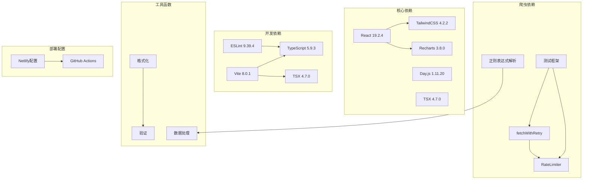

**图表来源**
- [package.json:15-38](file://package.json#L15-L38)

### 关键依赖说明

1. **React生态系统**：使用现代React特性，包括Hooks和TypeScript支持
2. **构建工具链**：Vite提供快速开发体验，TypeScript确保类型安全
3. **UI框架**：TailwindCSS提供实用的样式解决方案
4. **数据分析**：Recharts用于数据可视化展示
5. **网络请求**：自定义HTTP客户端支持重试和限流
6. **部署平台**：Netlify提供稳定的静态站点托管服务
7. **测试工具**：TSX提供TypeScript执行环境，支持测试脚本运行

**更新** 移除了对 Vercel 的依赖，完全迁移到 Netlify 平台。**当前状态**：两个工作流均已启用并正常执行，数据更新在5:00执行，报告发送在9:00执行。**新增**了测试框架依赖，支持爬虫测试功能。

**章节来源**
- [package.json:15-38](file://package.json#L15-L38)

## 性能考虑

系统在设计时充分考虑了性能优化：

### 爬虫性能优化

1. **并行执行**：使用Promise.allSettled并行执行多个爬虫任务
2. **请求限流**：RateLimiter控制请求频率，避免被目标网站封禁
3. **智能重试**：指数退避策略减少服务器压力
4. **超时控制**：合理的超时设置防止长时间阻塞

### 内存管理

1. **数据去重**：爬取完成后立即进行去重处理
2. **及时释放**：处理完的数据及时释放内存
3. **批量操作**：避免频繁的小操作造成内存碎片

### 网络优化

1. **User-Agent伪装**：模拟真实浏览器请求
2. **Accept头设置**：指定期望的响应格式
3. **连接复用**：合理利用HTTP连接池

### 部署性能优化

**新增** Netlify 配置优化了部署性能：

1. **构建缓存**：Node.js 20版本提供更好的构建性能
2. **静态资源优化**：自动压缩和缓存静态文件
3. **CDN加速**：全球CDN分发提升访问速度
4. **预渲染支持**：支持静态站点生成

### 测试性能优化

**新增** 爬虫测试框架的性能优化：

1. **选择性测试**：详情页爬虫只测试前3-5条最新数据
2. **快速失败**：单个爬虫失败不影响整体测试执行
3. **内存优化**：测试完成后及时清理临时数据
4. **并发测试**：政策和新闻爬虫并行执行测试

## 故障排除指南

### 常见问题及解决方案

#### 工作流执行失败

**问题现象**：GitHub Actions工作流执行失败或中断

**可能原因**：
1. 爬虫目标网站结构发生变化
2. 网络连接不稳定
3. 请求频率过高被限制
4. Git提交权限不足

**解决步骤**：
1. 检查目标网站的HTML结构是否发生变化
2. 增加重试次数和延时
3. 调整请求头信息
4. 检查代理设置
5. 验证GitHub Actions权限配置

#### 数据更新异常

**问题现象**：数据文件更新失败或数据格式错误

**可能原因**：
1. 文件写入权限不足
2. 数据格式转换错误
3. Git提交冲突

**解决步骤**：
1. 检查文件系统权限
2. 验证数据格式转换逻辑
3. 解决Git冲突
4. 清理临时文件

#### 报告发送失败

**问题现象**：数据更新成功但消息未发送到群组

**可能原因**：
1. Webhook地址配置错误
2. 网络连接问题
3. 钉钉API限制

**解决步骤**：
1. 验证DINGTALK_WEBHOOK环境变量设置
2. 检查网络连接状态
3. 查看钉钉API返回的错误码
4. 确认群组权限设置

#### 部署配置问题

**问题现象**：Netlify 部署失败或页面无法访问

**可能原因**：
1. 构建命令配置错误
2. 发布目录设置不正确
3. 重定向规则配置问题

**解决步骤**：
1. 验证 netlify.toml 配置文件语法
2. 检查构建输出目录是否正确
3. 确认静态资源路径配置
4. 查看 Netlify 控制台的构建日志

#### 爬虫测试失败

**问题现象**：爬虫测试脚本执行失败

**可能原因**：
1. 目标网站结构变化
2. 网络连接问题
3. 测试数据源不可用
4. 正则表达式匹配失败

**解决步骤**：
1. 检查目标网站的HTML结构
2. 验证网络连接状态
3. 更新正则表达式匹配规则
4. 调整测试参数（如URL限制）
5. 查看详细的错误日志

**章节来源**
- [scripts/crawler/baseCrawler.ts:60-63](file://scripts/crawler/baseCrawler.ts#L60-L63)
- [scripts/sendDingTalk.ts:33-42](file://scripts/sendDingTalk.ts#L33-L42)
- [scripts/updateData.ts:142-144](file://scripts/updateData.ts#L142-L144)
- [scripts/testCrawler.ts:26-28](file://scripts/testCrawler.ts#L26-L28)
- [scripts/testCrawler.ts:44-46](file://scripts/testCrawler.ts#L44-L46)
- [netlify.toml:1-12](file://netlify.toml#L1-12)

## 结论

这个自动化每日报告系统展现了良好的软件工程实践：

### 系统优势

1. **分离式工作流设计**：数据更新和报告发送独立执行，提高系统稳定性
2. **并行数据处理**：多爬虫并行执行，显著提升数据获取效率
3. **自动版本控制**：数据更新后自动提交Git变更，确保数据一致性
4. **模块化设计**：清晰的组件分离和职责划分
5. **容错机制**：完善的错误处理和恢复策略
6. **性能优化**：并发处理和资源管理
7. **可维护性**：标准化的代码结构和文档
8. **扩展性**：易于添加新的数据源和功能
9. **稳定部署**：基于 Netlify 的可靠静态站点托管
10. **测试驱动开发**：爬虫测试框架确保数据抓取质量

### 技术亮点

1. **异步编程**：充分利用JavaScript的异步特性
2. **类型安全**：完整的TypeScript类型定义
3. **自动化部署**：GitHub Actions实现完全自动化
4. **数据可视化**：React组件提供直观的数据展示
5. **企业集成**：钉钉机器人实现企业级消息推送
6. **平台迁移**：从 Vercel 成功迁移到 Netlify
7. **分离式定时控制**：精确的时间控制和资源管理
8. **爬虫测试框架**：提供系统性的自动化测试能力

### 当前状态说明

**更新** 系统现已完全适配 Netlify 部署平台，使用硬编码的网站URL配置提供了更稳定的部署体验。分离的工作流架构实现了更精细的定时控制和更高的系统可靠性。**当前状态**：两个工作流均已启用并正常执行，数据更新工作流在北京时间5:00执行，报告发送工作流在9:00执行。**新增**的爬虫测试框架为系统的稳定性和可靠性提供了重要保障，确保数据抓取功能的持续可用性。

### 改进建议

1. **监控告警**：添加系统健康检查和异常告警
2. **数据备份**：实现数据备份和恢复机制
3. **缓存策略**：添加本地缓存减少重复请求
4. **测试覆盖**：增加单元测试和集成测试
5. **日志分析**：完善日志收集和分析系统
6. **部署监控**：添加 Netlify 部署状态监控
7. **爬虫监控**：添加爬虫运行状态监控和告警

该系统为碳市场信息的自动化获取和传播提供了一个完整、可靠的技术解决方案，具有良好的实用价值和推广前景。