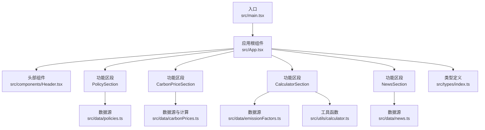
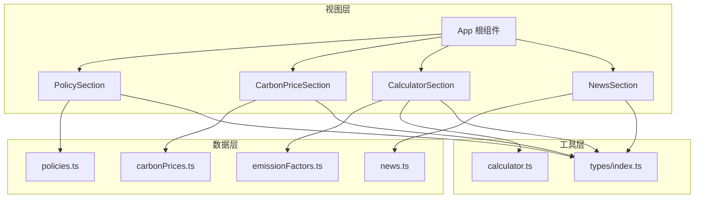
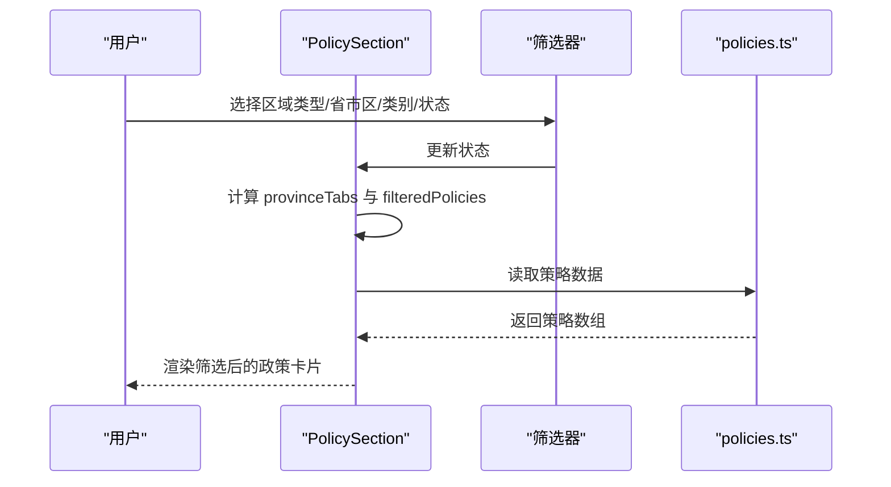
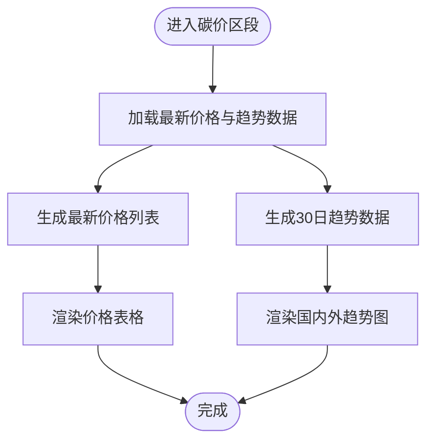
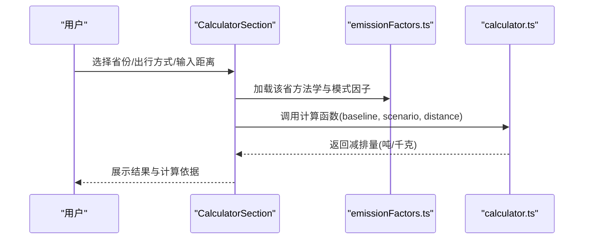
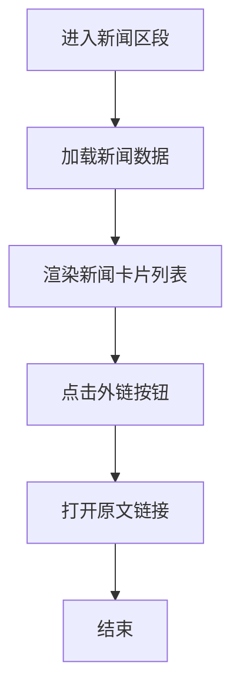

# 项目概述

<cite>
**本文引用的文件**
- [README.md](file://README.md)
- [package.json](file://package.json)
- [src/main.tsx](file://src/main.tsx)
- [src/App.tsx](file://src/App.tsx)
- [src/components/Header.tsx](file://src/components/Header.tsx)
- [src/sections/PolicySection.tsx](file://src/sections/PolicySection.tsx)
- [src/sections/CarbonPriceSection.tsx](file://src/sections/CarbonPriceSection.tsx)
- [src/sections/CalculatorSection.tsx](file://src/sections/CalculatorSection.tsx)
- [src/sections/NewsSection.tsx](file://src/sections/NewsSection.tsx)
- [src/data/policies.ts](file://src/data/policies.ts)
- [src/data/carbonPrices.ts](file://src/data/carbonPrices.ts)
- [src/data/emissionFactors.ts](file://src/data/emissionFactors.ts)
- [src/data/news.ts](file://src/data/news.ts)
- [src/utils/calculator.ts](file://src/utils/calculator.ts)
- [src/types/index.ts](file://src/types/index.ts)
</cite>

## 目录
1. [引言](#引言)
2. [项目结构](#项目结构)
3. [核心组件](#核心组件)
4. [架构总览](#架构总览)
5. [详细组件分析](#详细组件分析)
6. [依赖关系分析](#依赖关系分析)
7. [性能考量](#性能考量)
8. [故障排查指南](#故障排查指南)
9. [结论](#结论)
10. [附录](#附录)

## 引言
本项目“碳普惠信息代理”是一个面向中国碳普惠生态的信息聚合与交互平台，旨在为用户提供权威的政策信息、实时碳价格与趋势、基于区域方法学的碳排放计算器以及行业新闻资讯。通过统一的前端界面与模块化数据源，项目帮助政府、企业与公众用户快速掌握碳市场动态、理解地方政策差异、评估出行方式的减排潜力，并获取权威新闻来源。

项目采用现代前端技术栈：React 19、TypeScript、TailwindCSS、Recharts 与 Vite 构建工具链，确保开发体验、构建性能与可维护性。数据层以纯 TypeScript 模块导出静态数据与计算函数，逻辑清晰、边界明确，便于扩展与测试。

## 项目结构
项目采用按功能域划分的目录组织方式，核心结构如下：
- 入口与应用根组件：src/main.tsx、src/App.tsx
- 组件层：src/components（通用 UI 组件）
- 功能区段：src/sections（政策、碳价、计算器、新闻等）
- 数据与类型：src/data（策略、价格、排放因子、新闻）、src/types（类型定义）
- 工具与常量：src/utils（计算工具、常量）
- 样式与资源：src/index.css、public/

图表来源
- [src/main.tsx:1-11](file://src/main.tsx#L1-L11)
- [src/App.tsx:1-60](file://src/App.tsx#L1-L60)
- [src/components/Header.tsx:1-26](file://src/components/Header.tsx#L1-L26)
- [src/sections/PolicySection.tsx:1-89](file://src/sections/PolicySection.tsx#L1-L89)
- [src/sections/CarbonPriceSection.tsx:1-42](file://src/sections/CarbonPriceSection.tsx#L1-L42)
- [src/sections/CalculatorSection.tsx:1-161](file://src/sections/CalculatorSection.tsx#L1-L161)
- [src/sections/NewsSection.tsx:1-71](file://src/sections/NewsSection.tsx#L1-L71)
- [src/data/policies.ts:1-318](file://src/data/policies.ts#L1-L318)
- [src/data/carbonPrices.ts:1-103](file://src/data/carbonPrices.ts#L1-L103)
- [src/data/emissionFactors.ts:1-103](file://src/data/emissionFactors.ts#L1-L103)
- [src/data/news.ts:1-77](file://src/data/news.ts#L1-L77)
- [src/utils/calculator.ts:1-12](file://src/utils/calculator.ts#L1-L12)
- [src/types/index.ts:1-65](file://src/types/index.ts#L1-L65)

章节来源
- [src/main.tsx:1-11](file://src/main.tsx#L1-L11)
- [src/App.tsx:1-60](file://src/App.tsx#L1-L60)

## 核心组件
- 应用根组件 App：负责顶部标签页导航与四大功能区段的切换渲染，提供统一的布局与样式容器。
- 头部组件 Header：展示站点名称、标语与当前日期，作为品牌与信息入口。
- 功能区段：
  - 政策区段 PolicySection：提供按区域类型、省市区、政策类别与状态的多维筛选，展示政策卡片列表。
  - 碳价区段 CarbonPriceSection：展示最新碳价与国内外产品价格趋势图。
  - 计算器区段 CalculatorSection：基于区域方法学选择出行方式与距离，计算预估减排量。
  - 新闻区段 NewsSection：展示碳普惠与碳市场相关新闻条目，支持跳转至原文。

章节来源
- [src/App.tsx:18-59](file://src/App.tsx#L18-L59)
- [src/components/Header.tsx:4-25](file://src/components/Header.tsx#L4-L25)
- [src/sections/PolicySection.tsx:9-88](file://src/sections/PolicySection.tsx#L9-L88)
- [src/sections/CarbonPriceSection.tsx:8-41](file://src/sections/CarbonPriceSection.tsx#L8-L41)
- [src/sections/CalculatorSection.tsx:16-160](file://src/sections/CalculatorSection.tsx#L16-L160)
- [src/sections/NewsSection.tsx:5-70](file://src/sections/NewsSection.tsx#L5-L70)

## 架构总览
系统采用“组件驱动 + 数据模块化”的前端架构：
- 视图层：React 组件树，通过状态管理实现标签页切换与筛选条件联动。
- 数据层：各功能区段直接导入对应数据模块或计算函数，形成清晰的数据流。
- 类型层：统一的 TypeScript 接口定义贯穿数据与组件，保证类型安全与可维护性。
- 可视化层：使用 Recharts 渲染价格趋势图，提升数据可读性。

图表来源
- [src/App.tsx:1-60](file://src/App.tsx#L1-L60)
- [src/sections/PolicySection.tsx:1-89](file://src/sections/PolicySection.tsx#L1-L89)
- [src/sections/CarbonPriceSection.tsx:1-42](file://src/sections/CarbonPriceSection.tsx#L1-L42)
- [src/sections/CalculatorSection.tsx:1-161](file://src/sections/CalculatorSection.tsx#L1-L161)
- [src/sections/NewsSection.tsx:1-71](file://src/sections/NewsSection.tsx#L1-L71)
- [src/data/policies.ts:1-318](file://src/data/policies.ts#L1-L318)
- [src/data/carbonPrices.ts:1-103](file://src/data/carbonPrices.ts#L1-L103)
- [src/data/emissionFactors.ts:1-103](file://src/data/emissionFactors.ts#L1-L103)
- [src/data/news.ts:1-77](file://src/data/news.ts#L1-L77)
- [src/utils/calculator.ts:1-12](file://src/utils/calculator.ts#L1-L12)
- [src/types/index.ts:1-65](file://src/types/index.ts#L1-L65)

## 详细组件分析

### 政策区段（PolicySection）
- 功能要点
  - 多维筛选：区域类型（全国/省/市）、省市区、政策类别（政策/方法学）、状态（有效/过期）。
  - 动态省市区选项：根据区域类型变化自动过滤可用省市区。
  - 卡片展示：按筛选结果渲染政策卡片，支持查看来源链接。
- 关键流程
  - 用户在筛选器中选择条件 → 计算属性 provinceTabs 与 filteredPolicies → 渲染网格卡片。
- 性能与可维护性
  - 使用 useMemo 缓存 provinceTabs 与 filteredPolicies，避免重复计算。
  - 通过统一常量与类型约束，降低耦合度。

图表来源
- [src/sections/PolicySection.tsx:9-88](file://src/sections/PolicySection.tsx#L9-L88)
- [src/data/policies.ts:1-318](file://src/data/policies.ts#L1-L318)

章节来源
- [src/sections/PolicySection.tsx:9-88](file://src/sections/PolicySection.tsx#L9-L88)
- [src/data/policies.ts:1-318](file://src/data/policies.ts#L1-L318)

### 碳价区段（CarbonPriceSection）
- 功能要点
  - 最新价格表：展示国内/国际碳产品的最新价格与涨跌。
  - 趋势图：分别绘制国内与国际产品过去30天的价格走势。
- 数据生成
  - 通过 carbonPrices.ts 的生成函数与历史数据函数，动态产出价格记录与趋势点。
- 可视化
  - 使用 Recharts 渲染趋势图，支持单位标注与市场区分。

图表来源
- [src/sections/CarbonPriceSection.tsx:8-41](file://src/sections/CarbonPriceSection.tsx#L8-L41)
- [src/data/carbonPrices.ts:33-102](file://src/data/carbonPrices.ts#L33-L102)

章节来源
- [src/sections/CarbonPriceSection.tsx:8-41](file://src/sections/CarbonPriceSection.tsx#L8-L41)
- [src/data/carbonPrices.ts:1-103](file://src/data/carbonPrices.ts#L1-L103)

### 计算器区段（CalculatorSection）
- 功能要点
  - 省份选择：根据所选省份加载对应方法学。
  - 出行方式选择：按钮式图标选择，直观展示不同交通方式。
  - 距离输入：数值输入框，限制非负数。
  - 结果展示：实时计算预估减排量（吨与千克），并显示计算依据。
- 计算逻辑
  - 基于 emissionFactors.ts 中的基准与场景排放因子，调用 calculator.ts 的计算函数得出结果。

图表来源
- [src/sections/CalculatorSection.tsx:16-160](file://src/sections/CalculatorSection.tsx#L16-L160)
- [src/data/emissionFactors.ts:1-103](file://src/data/emissionFactors.ts#L1-L103)
- [src/utils/calculator.ts:1-12](file://src/utils/calculator.ts#L1-L12)

章节来源
- [src/sections/CalculatorSection.tsx:16-160](file://src/sections/CalculatorSection.tsx#L16-L160)
- [src/data/emissionFactors.ts:1-103](file://src/data/emissionFactors.ts#L1-L103)
- [src/utils/calculator.ts:1-12](file://src/utils/calculator.ts#L1-L12)

### 新闻区段（NewsSection）
- 功能要点
  - 列表展示：标题、摘要、来源、发布时间与标签。
  - 外链跳转：点击“查看原文”打开新闻链接。
- 数据来源
  - 从 news.ts 导入新闻条目，保持简洁的卡片式布局与悬停效果。

图表来源
- [src/sections/NewsSection.tsx:5-70](file://src/sections/NewsSection.tsx#L5-L70)
- [src/data/news.ts:1-77](file://src/data/news.ts#L1-L77)

章节来源
- [src/sections/NewsSection.tsx:5-70](file://src/sections/NewsSection.tsx#L5-L70)
- [src/data/news.ts:1-77](file://src/data/news.ts#L1-L77)

## 依赖关系分析
- 运行时依赖
  - React 与 ReactDOM：构建用户界面与事件处理。
  - TailwindCSS：提供原子化样式与响应式布局。
  - Recharts：用于价格趋势可视化。
  - dayjs：日期格式化与时间处理。
  - lucide-react：图标库，统一视觉语言。
- 开发依赖
  - Vite：快速开发与构建工具。
  - TypeScript：类型安全与工程化。
  - ESLint 与相关插件：代码质量与风格规范。
- 项目脚本
  - dev/build/lint/preview：标准化开发与发布流程。

章节来源
- [package.json:12-34](file://package.json#L12-L34)

## 性能考量
- 组件级缓存
  - 使用 useMemo 对筛选结果与趋势数据进行缓存，减少不必要的重渲染与计算。
- 数据模块化
  - 将数据与计算逻辑拆分为独立模块，便于按需加载与单元测试。
- 视图优化
  - 使用网格布局与卡片组件，提升信息密度与可读性；图标与语义化标签增强交互反馈。
- 可扩展性
  - 类型定义集中管理，新增字段或模块时只需同步更新类型与导入路径，降低耦合风险。

## 故障排查指南
- 页面空白或组件未渲染
  - 检查入口文件是否正确挂载根节点。
  - 章节来源
    - [src/main.tsx:6-10](file://src/main.tsx#L6-L10)
- 筛选无结果
  - 确认筛选条件组合是否合理；尝试重置筛选器。
  - 章节来源
    - [src/sections/PolicySection.tsx:26-34](file://src/sections/PolicySection.tsx#L26-L34)
- 计算器无结果
  - 确保已选择出行方式且距离大于 0；检查方法学是否覆盖该省份。
  - 章节来源
    - [src/sections/CalculatorSection.tsx:31-34](file://src/sections/CalculatorSection.tsx#L31-L34)
- 图表不显示
  - 确认数据模块返回的数据结构与图表适配一致；检查 Recharts 版本兼容性。
  - 章节来源
    - [src/data/carbonPrices.ts:85-102](file://src/data/carbonPrices.ts#L85-L102)
- 本地化与日期显示
  - 若日期格式异常，检查 dayjs 的格式化字符串与语言包配置。
  - 章节来源
    - [src/components/Header.tsx:19-21](file://src/components/Header.tsx#L19-L21)

## 结论
“碳普惠信息代理”以清晰的功能分区与模块化数据设计，实现了政策、价格、计算与新闻的统一入口。其现代化技术栈与类型安全的工程实践，既满足初学者的快速上手需求，也为有经验的开发者提供了良好的扩展空间。项目通过可视化的数据呈现与直观的交互设计，帮助多方用户高效获取碳普惠相关信息，具有显著的社会与商业价值。

## 附录
- 技术选型说明
  - React 19：成熟稳定的组件模型与生态。
  - TypeScript：强类型保障，提升长期可维护性。
  - TailwindCSS：原子化样式，快速搭建一致的 UI。
  - Recharts：专注数据可视化的图表库。
  - Vite：高性能构建与热更新，优化开发体验。
- 设计理念与用户体验
  - 以用户为中心：通过分栏布局与筛选器降低信息噪声，突出关键数据。
  - 一致性：统一的图标、颜色与间距规范，提升品牌识别度。
  - 可访问性：语义化标签与键盘可操作性，兼顾无障碍需求。
- 发展建议
  - 数据层：引入缓存与增量更新策略，支持动态数据源接入。
  - 交互层：增加搜索与收藏功能，提升个性化体验。
  - 可观测性：集成错误上报与性能监控，持续优化用户体验。