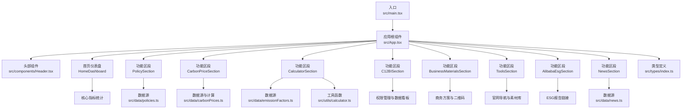
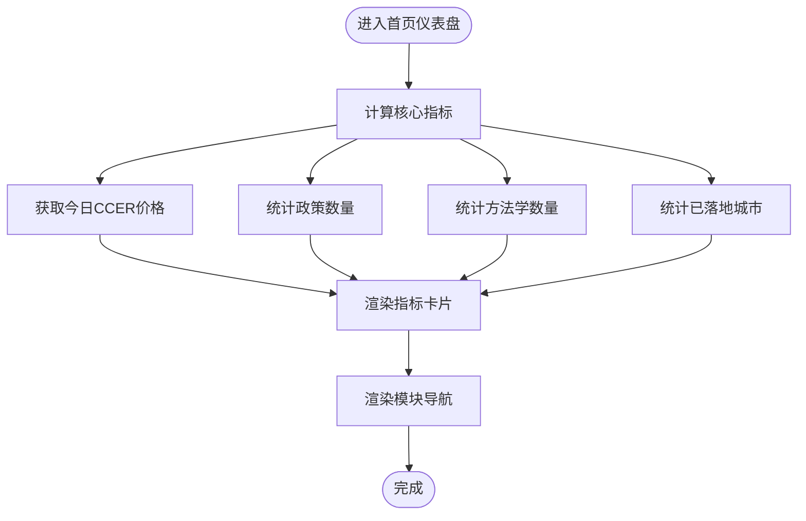
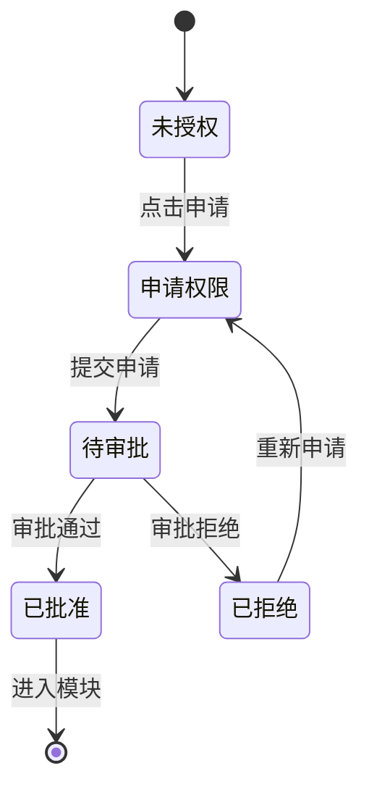
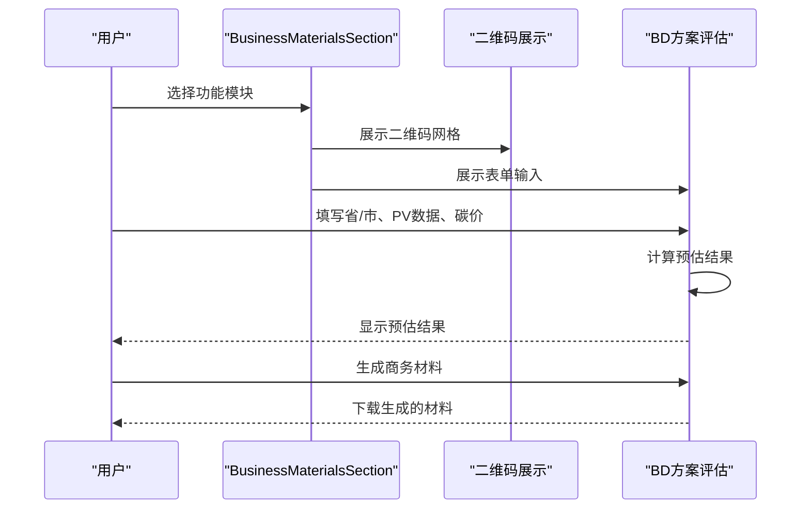
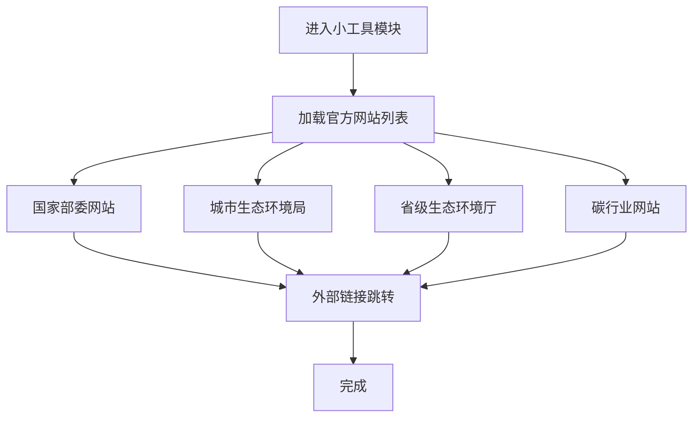
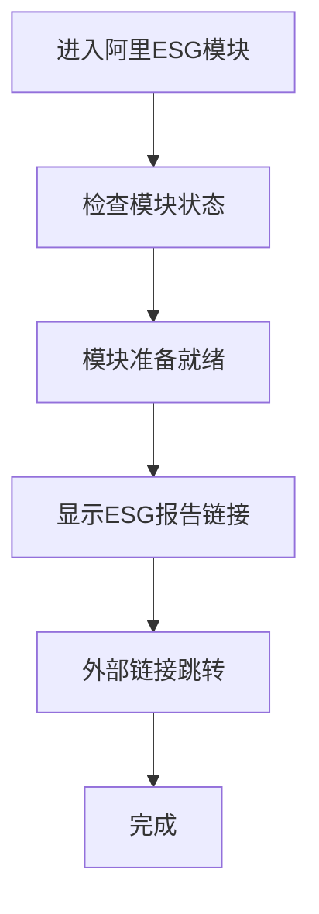
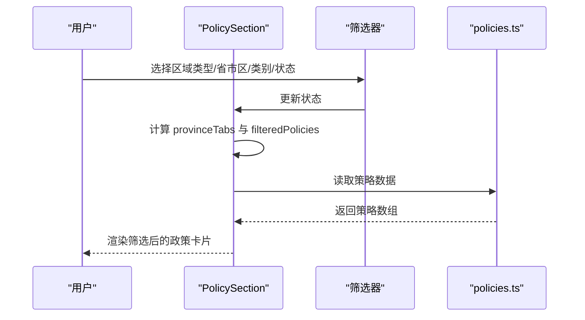
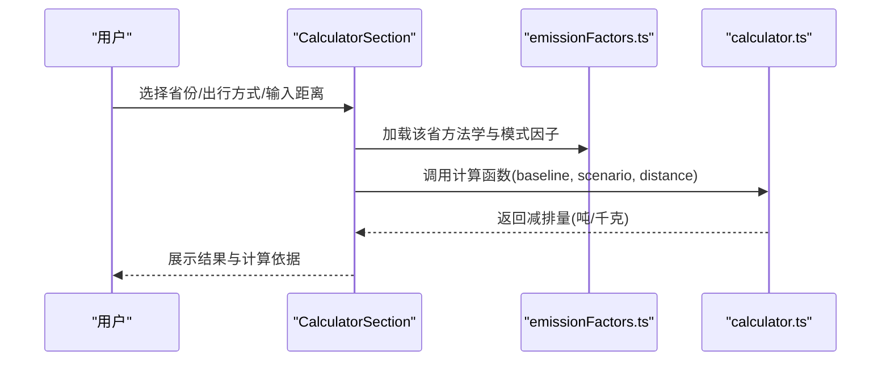
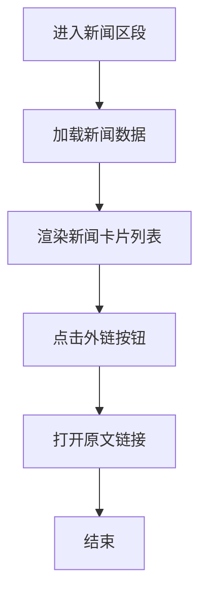

# 项目概述

<cite>
**本文引用的文件**
- [README.md](file://README.md)
- [package.json](file://package.json)
- [src/main.tsx](file://src/main.tsx)
- [src/App.tsx](file://src/App.tsx)
- [src/components/Header.tsx](file://src/components/Header.tsx)
- [src/sections/HomeDashboard.tsx](file://src/sections/HomeDashboard.tsx)
- [src/sections/PolicySection.tsx](file://src/sections/PolicySection.tsx)
- [src/sections/CarbonPriceSection.tsx](file://src/sections/CarbonPriceSection.tsx)
- [src/sections/CalculatorSection.tsx](file://src/sections/CalculatorSection.tsx)
- [src/sections/NewsSection.tsx](file://src/sections/NewsSection.tsx)
- [src/sections/C12BISection.tsx](file://src/sections/C12BISection.tsx)
- [src/sections/BusinessMaterialsSection.tsx](file://src/sections/BusinessMaterialsSection.tsx)
- [src/sections/ToolsSection.tsx](file://src/sections/ToolsSection.tsx)
- [src/sections/AlibabaEsgSection.tsx](file://src/sections/AlibabaEsgSection.tsx)
- [src/data/policies.ts](file://src/data/policies.ts)
- [src/data/carbonPrices.ts](file://src/data/carbonPrices.ts)
- [src/data/emissionFactors.ts](file://src/data/emissionFactors.ts)
- [src/data/news.ts](file://src/data/news.ts)
- [src/utils/calculator.ts](file://src/utils/calculator.ts)
- [src/types/index.ts](file://src/types/index.ts)
</cite>

## 更新摘要
**变更内容**
- 应用组件新增8个导航标签，从原来的4个功能区段扩展到9个模块
- 项目从carbon-info-agent正式更名为carbonhub
- 头部显示新的品牌标识"高德绿色出行碳普惠AI智能体"
- 新增C12BI数据看板、商务素材、小工具、阿里ESG等专业功能模块
- 首页仪表盘提供核心指标展示和模块导航

## 目录
1. [引言](#引言)
2. [项目结构](#项目结构)
3. [核心组件](#核心组件)
4. [架构总览](#架构总览)
5. [详细组件分析](#详细组件分析)
6. [依赖关系分析](#依赖关系分析)
7. [性能考量](#性能考量)
8. [故障排查指南](#故障排查指南)
9. [结论](#结论)
10. [附录](#附录)

## 引言
本项目"carbonhub"是一个面向中国碳普惠生态的综合性信息服务平台，现已从单一的碳普惠信息代理升级为包含9大功能模块的专业化平台。项目提供权威的政策信息、实时碳价格与趋势、基于区域方法学的碳排放计算器、数据看板、商务素材、小工具、阿里ESG报告以及行业新闻资讯等全方位服务。

平台采用现代化前端技术栈：React 19、TypeScript、TailwindCSS、Recharts与Vite构建工具链，确保开发体验、构建性能与可维护性。经过重构后的架构支持9个独立功能模块，每个模块都有专门的数据源与计算逻辑，形成清晰的模块化数据流。

**更新** 项目已正式更名为carbonhub，品牌标识为"高德绿色出行碳普惠AI智能体"，提供更专业的碳普惠信息服务。

## 项目结构
项目采用按功能域划分的目录组织方式，现已扩展为9大功能模块：
- 入口与应用根组件：src/main.tsx、src/App.tsx
- 组件层：src/components（通用UI组件）
- 功能区段：src/sections（首页仪表盘、政策、碳价、计算器、数据看板、商务素材、小工具、阿里ESG、新闻等）
- 数据与类型：src/data（策略、价格、排放因子、新闻）、src/types（类型定义）
- 工具与常量：src/utils（计算工具、常量）
- 样式与资源：src/index.css、public/



**图表来源**
- [src/main.tsx:1-11](file://src/main.tsx#L1-L11)
- [src/App.tsx:14-24](file://src/App.tsx#L14-L24)
- [src/sections/HomeDashboard.tsx:121-130](file://src/sections/HomeDashboard.tsx#L121-L130)
- [src/sections/C12BISection.tsx:14-18](file://src/sections/C12BISection.tsx#L14-L18)
- [src/sections/BusinessMaterialsSection.tsx:186-395](file://src/sections/BusinessMaterialsSection.tsx#L186-L395)
- [src/sections/ToolsSection.tsx:38-184](file://src/sections/ToolsSection.tsx#L38-L184)
- [src/sections/AlibabaEsgSection.tsx:4-33](file://src/sections/AlibabaEsgSection.tsx#L4-L33)

**章节来源**
- [src/main.tsx:1-11](file://src/main.tsx#L1-L11)
- [src/App.tsx:1-113](file://src/App.tsx#L1-L113)

## 核心组件
- 应用根组件 App：负责顶部9个标签页导航与功能模块的切换渲染，提供统一的布局与样式容器。
- 头部组件 Header：展示新的品牌标识"高德绿色出行碳普惠AI智能体"与当前日期，作为专业品牌与信息入口。
- 首页仪表盘 HomeDashboard：提供核心指标展示（今日CCER价格、政策数量、方法学数量、已落地城市）和模块导航。
- 功能区段：
  - 政策区段 PolicySection：提供按区域类型、省市区、政策类别与状态的多维筛选，展示政策卡片列表。
  - 碳价区段 CarbonPriceSection：展示最新碳价与国内外产品价格趋势图。
  - 计算器区段 CalculatorSection：基于区域方法学选择出行方式与距离，计算预估减排量。
  - 数据看板 C12BISection：提供权限申请和数据看板访问功能。
  - 商务素材 BusinessMaterialsSection：提供二维码展示、BD方案评估和材料生成。
  - 小工具 ToolsSection：提供数据查询、宣传素材和官网导航功能。
  - 阿里ESG AlibabaEsgSection：提供阿里巴巴集团ESG报告链接。
  - 新闻区段 NewsSection：展示碳普惠与碳市场相关新闻条目，支持跳转至原文。

**更新** 新增8个功能模块，从原来的4个扩展到9个，涵盖政策、价格、计算、数据看板、商务素材、工具、ESG报告和新闻资讯的全生态服务。

**章节来源**
- [src/App.tsx:14-24](file://src/App.tsx#L14-L24)
- [src/components/Header.tsx:4-27](file://src/components/Header.tsx#L4-L27)
- [src/sections/HomeDashboard.tsx:117-216](file://src/sections/HomeDashboard.tsx#L117-L216)
- [src/sections/C12BISection.tsx:14-169](file://src/sections/C12BISection.tsx#L14-L169)
- [src/sections/BusinessMaterialsSection.tsx:186-395](file://src/sections/BusinessMaterialsSection.tsx#L186-L395)
- [src/sections/ToolsSection.tsx:38-184](file://src/sections/ToolsSection.tsx#L38-L184)
- [src/sections/AlibabaEsgSection.tsx:4-33](file://src/sections/AlibabaEsgSection.tsx#L4-L33)

## 架构总览
系统采用"组件驱动 + 数据模块化"的前端架构，现已扩展为9大功能模块：
- 视图层：React组件树，通过状态管理实现9个标签页切换与筛选条件联动。
- 数据层：各功能模块直接导入对应数据模块或计算函数，形成清晰的数据流。
- 类型层：统一的TypeScript接口定义贯穿数据与组件，保证类型安全与可维护性。
- 可视化层：使用Recharts渲染价格趋势图，提升数据可读性。

```mermaid
graph TB
subgraph "视图层"
APP["App 根组件"]
HOME["HomeDashboard 首页仪表盘"]
SEC1["PolicySection 政策区段"]
SEC2["CarbonPriceSection 碳价区段"]
SEC3["CalculatorSection 计算器区段"]
SEC4["C12BISection 数据看板"]
SEC5["BusinessMaterialsSection 商务素材"]
SEC6["ToolsSection 小工具"]
SEC7["AlibabaEsgSection 阿里ESG"]
SEC8["NewsSection 新闻区段"]
end
subgraph "数据层"
P["policies.ts 政策数据"]
CP["carbonPrices.ts 碳价数据"]
EF["emissionFactors.ts 排放因子"]
N["news.ts 新闻数据"]
END
subgraph "工具层"
CALC["calculator.ts 计算工具"]
TYPES["types/index.ts 类型定义"]
END
APP --> HOME
APP --> SEC1
APP --> SEC2
APP --> SEC3
APP --> SEC4
APP --> SEC5
APP --> SEC6
APP --> SEC7
APP --> SEC8
HOME --> P
HOME --> CP
HOME --> EF
SEC1 --> P
SEC2 --> CP
SEC3 --> EF
SEC3 --> CALC
SEC4 --> TYPES
SEC5 --> TYPES
SEC6 --> TYPES
SEC7 --> TYPES
SEC8 --> N
SEC1 --> TYPES
SEC2 --> TYPES
SEC3 --> TYPES
SEC4 --> TYPES
SEC5 --> TYPES
SEC6 --> TYPES
SEC7 --> TYPES
SEC8 --> TYPES
```

**图表来源**
- [src/App.tsx:1-113](file://src/App.tsx#L1-L113)
- [src/sections/HomeDashboard.tsx:1-217](file://src/sections/HomeDashboard.tsx#L1-L217)
- [src/sections/PolicySection.tsx:1-89](file://src/sections/PolicySection.tsx#L1-L89)
- [src/sections/CarbonPriceSection.tsx:1-42](file://src/sections/CarbonPriceSection.tsx#L1-L42)
- [src/sections/CalculatorSection.tsx:1-161](file://src/sections/CalculatorSection.tsx#L1-L161)
- [src/sections/C12BISection.tsx:1-170](file://src/sections/C12BISection.tsx#L1-L170)
- [src/sections/BusinessMaterialsSection.tsx:1-396](file://src/sections/BusinessMaterialsSection.tsx#L1-L396)
- [src/sections/ToolsSection.tsx:1-185](file://src/sections/ToolsSection.tsx#L1-L185)
- [src/sections/AlibabaEsgSection.tsx:1-34](file://src/sections/AlibabaEsgSection.tsx#L1-L34)
- [src/sections/NewsSection.tsx:1-71](file://src/sections/NewsSection.tsx#L1-L71)

## 详细组件分析

### 首页仪表盘（HomeDashboard）
- 功能要点
  - 核心指标展示：今日CCER价格、政策数量、方法学数量、已落地城市。
  - 模块导航：8个功能模块的快捷入口，支持一键跳转。
  - 交互设计：卡片式布局，支持悬停效果和点击跳转。
- 数据统计
  - 通过useMemo缓存统计数据，避免重复计算。
  - 集成碳价数据和政策数据，提供实时指标。
- 视觉设计
  - 大屏风格设计，背景图片+蒙版效果。
  - 渐变色彩和毛玻璃效果，提升视觉层次。



**图表来源**
- [src/sections/HomeDashboard.tsx:17-39](file://src/sections/HomeDashboard.tsx#L17-L39)
- [src/sections/HomeDashboard.tsx:117-216](file://src/sections/HomeDashboard.tsx#L117-L216)

**章节来源**
- [src/sections/HomeDashboard.tsx:117-216](file://src/sections/HomeDashboard.tsx#L117-L216)

### 数据看板（C12BISection）
- 功能要点
  - 权限管理：支持1个月、3个月、长期永久三种权限有效期选择。
  - 审批流程：模拟审批流程，支持申请、审批、通过、拒绝状态。
  - 模块状态：开发中提示，等待正式上线。
- 权限系统
  - 状态管理：hasPermission、showApplyModal、selectedDuration、approvalStatus。
  - 用户体验：模态框设计，清晰的状态反馈。
- 安全考虑
  - 权限申请需要审批，确保数据访问安全。



**图表来源**
- [src/sections/C12BISection.tsx:14-33](file://src/sections/C12BISection.tsx#L14-L33)

**章节来源**
- [src/sections/C12BISection.tsx:14-169](file://src/sections/C12BISection.tsx#L14-L169)

### 商务素材（BusinessMaterialsSection）
- 功能要点
  - 二维码展示：10个重点城市的绿色出行二维码。
  - BD方案评估：支持省/市名称、平台情况、各类导航PV、碳市场价格输入。
  - 材料生成：支持生成商务PPT和项目PDD。
- 数据查询
  - 内置SQL模板，提供查询逻辑说明。
  - 支持SQL复制功能，便于技术对接。
- 用户体验
  - 分步骤设计，先填写信息再查看结果。
  - 响应式布局，适配不同屏幕尺寸。



**图表来源**
- [src/sections/BusinessMaterialsSection.tsx:186-395](file://src/sections/BusinessMaterialsSection.tsx#L186-L395)

**章节来源**
- [src/sections/BusinessMaterialsSection.tsx:186-395](file://src/sections/BusinessMaterialsSection.tsx#L186-L395)

### 小工具（ToolsSection）
- 功能要点
  - 官网导航：国家部委、城市生态环境局、省级生态环境厅、碳行业网站分类导航。
  - 宣传素材：提供钉钉文档链接，包含海报、图文、视频等资源。
  - 数据查询：预留数据查询功能，正在开发中。
- 网站分类
  - 国家部委：生态环境部等中央部门网站。
  - 城市局：北京、上海、广州、深圳等重点城市生态环境局。
  - 省厅：浙江、江苏、山东等省级生态环境厅。
  - 行业网站：全国碳市场、环境报等专业网站。
- 用户体验
  - 分类清晰，支持外部链接跳转。
  - 悬停效果，提供外部链接图标。



**图表来源**
- [src/sections/ToolsSection.tsx:38-184](file://src/sections/ToolsSection.tsx#L38-L184)

**章节来源**
- [src/sections/ToolsSection.tsx:38-184](file://src/sections/ToolsSection.tsx#L38-L184)

### 阿里ESG（AlibabaEsgSection）
- 功能要点
  - 专业报告：提供阿里巴巴集团环境、社会及治理报告链接。
  - 外部导航：安全跳转到官方ESG页面。
  - 品牌展示：体现平台的专业性和权威性。
- 用户价值
  - 提供权威的ESG报告获取渠道。
  - 展示平台与大型企业的合作关系。



**图表来源**
- [src/sections/AlibabaEsgSection.tsx:4-33](file://src/sections/AlibabaEsgSection.tsx#L4-L33)

**章节来源**
- [src/sections/AlibabaEsgSection.tsx:4-33](file://src/sections/AlibabaEsgSection.tsx#L4-L33)

### 政策区段（PolicySection）
- 功能要点
  - 多维筛选：区域类型（全国/省/市）、省市区、政策类别（政策/方法学）、状态（有效/过期）。
  - 动态省市区选项：根据区域类型变化自动过滤可用省市区。
  - 卡片展示：按筛选结果渲染政策卡片，支持查看来源链接。
- 关键流程
  - 用户在筛选器中选择条件 → 计算属性 provinceTabs 与 filteredPolicies → 渲染网格卡片。
- 性能与可维护性
  - 使用 useMemo 缓存 provinceTabs 与 filteredPolicies，避免重复计算。
  - 通过统一常量与类型约束，降低耦合度。



**图表来源**
- [src/sections/PolicySection.tsx:9-88](file://src/sections/PolicySection.tsx#L9-L88)
- [src/data/policies.ts:1-318](file://src/data/policies.ts#L1-L318)

**章节来源**
- [src/sections/PolicySection.tsx:9-88](file://src/sections/PolicySection.tsx#L9-L88)
- [src/data/policies.ts:1-318](file://src/data/policies.ts#L1-L318)

### 碳价区段（CarbonPriceSection）
- 功能要点
  - 最新价格表：展示国内/国际碳产品的最新价格与涨跌。
  - 趋势图：分别绘制国内与国际产品过去30天的价格走势。
- 数据生成
  - 通过 carbonPrices.ts 的生成函数与历史数据函数，动态产出价格记录与趋势点。
- 可视化
  - 使用 Recharts 渲染趋势图，支持单位标注与市场区分。


**图表来源**
- [src/sections/CarbonPriceSection.tsx:8-41](file://src/sections/CarbonPriceSection.tsx#L8-L41)
- [src/data/carbonPrices.ts:33-102](file://src/data/carbonPrices.ts#L33-L102)

**章节来源**
- [src/sections/CarbonPriceSection.tsx:8-41](file://src/sections/CarbonPriceSection.tsx#L8-L41)
- [src/data/carbonPrices.ts:1-103](file://src/data/carbonPrices.ts#L1-L103)

### 计算器区段（CalculatorSection）
- 功能要点
  - 省份选择：根据所选省份加载对应方法学。
  - 出行方式选择：按钮式图标选择，直观展示不同交通方式。
  - 距离输入：数值输入框，限制非负数。
  - 结果展示：实时计算预估减排量（吨与千克），并显示计算依据。
- 计算逻辑
  - 基于 emissionFactors.ts 中的基准与场景排放因子，调用 calculator.ts 的计算函数得出结果。



**图表来源**
- [src/sections/CalculatorSection.tsx:16-160](file://src/sections/CalculatorSection.tsx#L16-L160)
- [src/data/emissionFactors.ts:1-103](file://src/data/emissionFactors.ts#L1-L103)
- [src/utils/calculator.ts:1-12](file://src/utils/calculator.ts#L1-L12)

**章节来源**
- [src/sections/CalculatorSection.tsx:16-160](file://src/sections/CalculatorSection.tsx#L16-L160)
- [src/data/emissionFactors.ts:1-103](file://src/data/emissionFactors.ts#L1-L103)
- [src/utils/calculator.ts:1-12](file://src/utils/calculator.ts#L1-L12)

### 新闻区段（NewsSection）
- 功能要点
  - 列表展示：标题、摘要、来源、发布时间与标签。
  - 外链跳转：点击"查看原文"打开新闻链接。
- 数据来源
  - 从 news.ts 导入新闻条目，保持简洁的卡片式布局与悬停效果。



**图表来源**
- [src/sections/NewsSection.tsx:5-70](file://src/sections/NewsSection.tsx#L5-L70)
- [src/data/news.ts:1-77](file://src/data/news.ts#L1-L77)

**章节来源**
- [src/sections/NewsSection.tsx:5-70](file://src/sections/NewsSection.tsx#L5-L70)
- [src/data/news.ts:1-77](file://src/data/news.ts#L1-L77)

## 依赖关系分析
- 运行时依赖
  - React 与 ReactDOM：构建用户界面与事件处理。
  - TailwindCSS：提供原子化样式与响应式布局。
  - Recharts：用于价格趋势可视化。
  - dayjs：日期格式化与时间处理。
  - lucide-react：图标库，统一视觉语言。
- 开发依赖
  - Vite：快速开发与构建工具。
  - TypeScript：类型安全与工程化。
  - ESLint 与相关插件：代码质量与风格规范。
- 项目脚本
  - dev/build/lint/preview：标准化开发与发布流程。

**更新** 项目名称已从carbon-info-agent更新为carbonhub，反映平台的专业化和品牌化升级。

**章节来源**
- [package.json:15-38](file://package.json#L15-L38)

## 性能考量
- 组件级缓存
  - 使用 useMemo 对筛选结果、趋势数据和核心指标进行缓存，减少不必要的重渲染与计算。
- 数据模块化
  - 将数据与计算逻辑拆分为独立模块，便于按需加载与单元测试。
- 视图优化
  - 使用网格布局与卡片组件，提升信息密度与可读性；图标与语义化标签增强交互反馈。
- 可扩展性
  - 类型定义集中管理，新增字段或模块时只需同步更新类型与导入路径，降低耦合风险。
- 模块化设计
  - 9大功能模块独立开发，支持并行开发和独立部署。

## 故障排查指南
- 页面空白或组件未渲染
  - 检查入口文件是否正确挂载根节点。
  - 章节来源
    - [src/main.tsx:6-10](file://src/main.tsx#L6-L10)
- 筛选无结果
  - 确认筛选条件组合是否合理；尝试重置筛选器。
  - 章节来源
    - [src/sections/PolicySection.tsx:26-34](file://src/sections/PolicySection.tsx#L26-L34)
- 计算器无结果
  - 确保已选择出行方式且距离大于 0；检查方法学是否覆盖该省份。
  - 章节来源
    - [src/sections/CalculatorSection.tsx:31-34](file://src/sections/CalculatorSection.tsx#L31-L34)
- 图表不显示
  - 确认数据模块返回的数据结构与图表适配一致；检查 Recharts 版本兼容性。
  - 章节来源
    - [src/data/carbonPrices.ts:85-102](file://src/data/carbonPrices.ts#L85-L102)
- 本地化与日期显示
  - 若日期格式异常，检查 dayjs 的格式化字符串与语言包配置。
  - 章节来源
    - [src/components/Header.tsx:21-23](file://src/components/Header.tsx#L21-L23)
- 权限申请失败
  - 检查网络连接和审批流程；确认审批人信息正确。
  - 章节来源
    - [src/sections/C12BISection.tsx:25-33](file://src/sections/C12BISection.tsx#L25-L33)
- 商务素材无法生成
  - 确认已填写完整信息；检查浏览器兼容性。
  - 章节来源
    - [src/sections/BusinessMaterialsSection.tsx:195-201](file://src/sections/BusinessMaterialsSection.tsx#L195-L201)

## 结论
carbonhub平台以清晰的功能分区与模块化数据设计，实现了从单一碳普惠信息代理到综合性碳生态服务平台的跨越。通过新增的9大功能模块，平台涵盖了政策、价格、计算、数据看板、商务素材、工具、ESG报告和新闻资讯的全生态服务。

现代化技术栈与类型安全的工程实践，既满足初学者的快速上手需求，也为有经验的开发者提供了良好的扩展空间。平台通过可视化的数据呈现与直观的交互设计，帮助政府、企业与公众用户高效获取碳普惠相关信息，具有显著的社会与商业价值。

**更新** 平台已完成品牌升级，从carbon-info-agent正式更名为carbonhub，提供更专业、更全面的碳普惠信息服务，标志着项目进入新的发展阶段。

## 附录
- 技术选型说明
  - React 19：成熟稳定的组件模型与生态。
  - TypeScript：强类型保障，提升长期可维护性。
  - TailwindCSS：原子化样式，快速搭建一致的 UI。
  - Recharts：专注数据可视化的图表库。
  - Vite：高性能构建与热更新，优化开发体验。
- 设计理念与用户体验
  - 以用户为中心：通过分栏布局与筛选器降低信息噪声，突出关键数据。
  - 一致性：统一的图标、颜色与间距规范，提升品牌识别度。
  - 可访问性：语义化标签与键盘可操作性，兼顾无障碍需求。
  - 模块化：9大功能模块独立设计，支持专业化使用。
- 发展建议
  - 数据层：引入缓存与增量更新策略，支持动态数据源接入。
  - 交互层：增加搜索与收藏功能，提升个性化体验。
  - 可观测性：集成错误上报与性能监控，持续优化用户体验。
  - 扩展性：支持更多碳普惠城市和政策的接入。